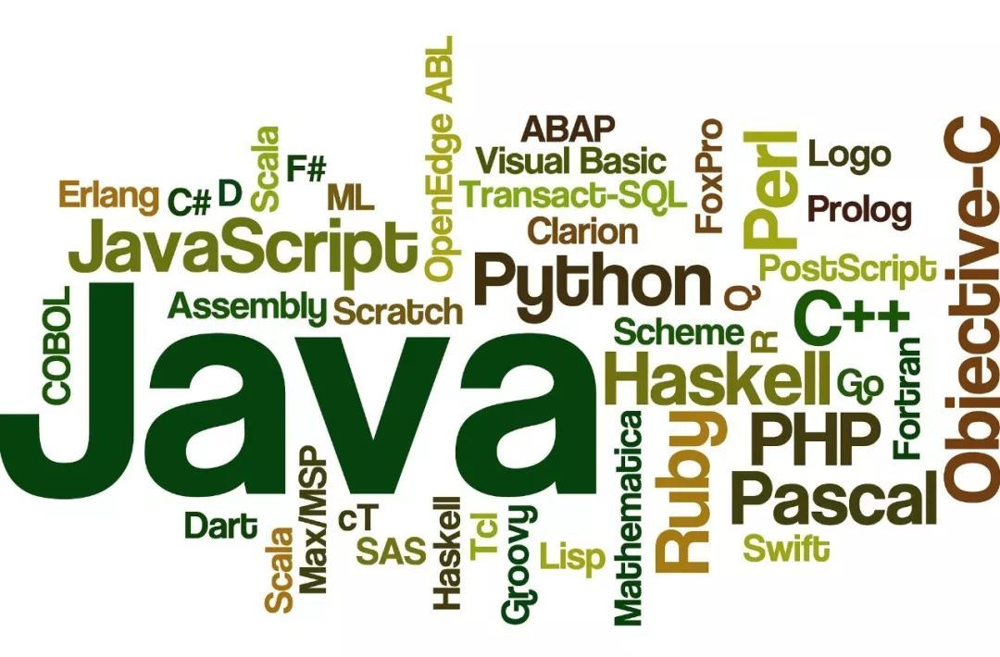
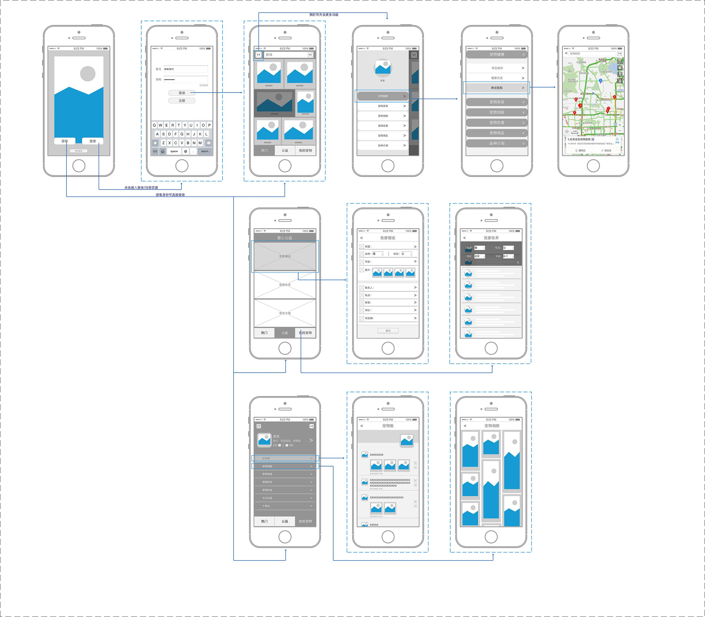
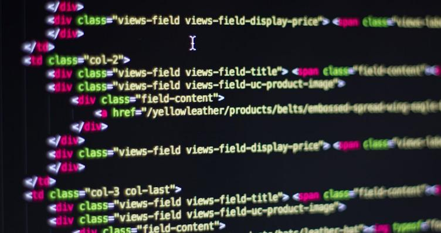
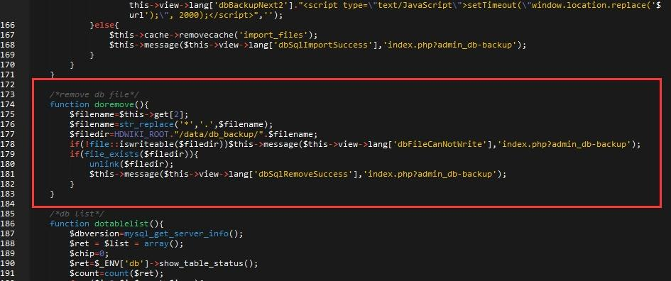

# 概念引入

**学习运维之前我们要先了解什么是计算机，什么是编程语言，什么是程序，软件的开发流程**

## 一、什么是计算机？为什么要有计算机？

### 1、介绍

```bash
计算机：是现代一种用于高速计算的电子计算机器，诞生的目的就是为了取代人力。
```


### 2、程序员的作用：举例去银行工作

#### 1.人力操作

```bash
银行行长------------------------------柜台人员			  
			  接收用户输入的账号
			  接收用户输入的密码
			  判断 输入的账号 等于 正确的账号 并且 输入的密码 等于 正确的密码:
				 告诉用户登录成功
			  否则：
				 告诉用户登录失败
```


#### 2.机器取代人力操作

```bash
自助取款机（ATM）
		程序员------------------------------计算机
			   用编程语言把上述步骤翻译下来
```


## 二、什么是编程语言

```bash
人与人沟通的语言叫做人类语言（汉语、英语、法语、日语）
人与机器沟通的语言就叫做编程语言
```



## 三、什么是编程

```bash
1、把想让计算机做事的步骤想清楚
2、用一种计算机能听懂的语言（编程语言）把做事的步骤翻译下来
```


## 四、为何要编程？

```bash
为了让计算机取代人力
```


## 五、什么是程序？

```bash
程序就是一堆代码文件
```


## 六、总结

```bash
1、计算机硬件就是一堆废铁，计算机的运行全都受程序控制
2、可以说程序是计算机硬件的灵魂
3、硬件的以外的都叫软件
```


## 七、软件的分类

```bash
1、操作系统：就是一个协调、管理、控制计算机硬件资源与应用软件资源的一个控制程序
2、应用软件：在操作系统之上，特定用于计算机某些功能
```

​		

## 八、计算机体系的三层结构

### 1、应用程序层

```bash
1.解释型开发的应用程序
2.shell解释器、cmd解释器、python解释器
3.其他应用程序，
```


### 2、操作系统层

```bash
由内核和系统接口组成
```


### 3、计算机硬件层

```bash
cpu、内存、硬盘
```


## 九、软件的开发流程

### 1、需求分析阶段

#### 1.PM市场调研

```bash
PM产品经理及相关部门进行市场调研，进行需求分析，绘画出原型草图。
```


#### 2.开需求分析会议

```bash
PM召集所有相关技术人员开需求分析会,为了获得明确的需求需要开n次会议。只要有不对的地方就要再次开会。
```


### 2、项目开发阶段

#### 1.项目设计阶段

##### 1）UE交互设计师与PM产品经理设计出交互式原型图




##### 2）UI根据交互图设计出UI界面


#### 2.开发阶段

##### 1）FE前端设计师根据UI界面编写前端代码




##### 2）RD后端设计师根据需求编写后端代码




##### 3）前后端代码合并


#### 3.测试阶段

```bash
1）开发人员进行code review代码评审
2）前后端开发自己运行测试，找到bug并修改
3）QA专业测试找到bug，通知开发去修改
4）测试无误后进行第一次验收
```


#### 4.项目上线阶段

```bash
1）运维人员编写上线方案及回滚方案
2）测试环境、体验服上线试运行（时间比较长1-5周），测试功能修改bug。
3）测试环境无误后正式服上线
4）上线功能检测
5）产品二次验收
6）部署好监控，实时监控服务状态
```


