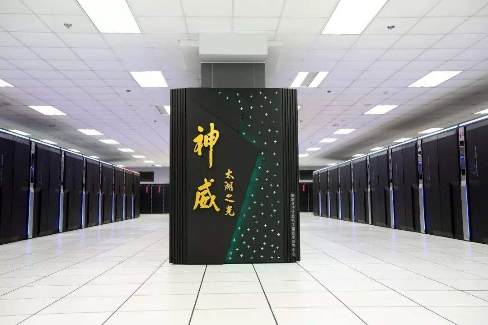
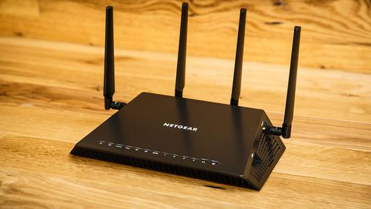

# **计算机的分类及服务器分类**

**了解计算机的种类，深度了解我们常见的服务器种类及每种服务器的优缺点**

## 一、计算机的分类

### 1、超级计算机

```bash
	通常是指由数百数千甚至更多的处理器（机）组成的、能计算普通PC机和服务器不能完成的大型复杂课题的计算机。超级计算机是计算机中功能最强、运算速度最快、存储容量最大的一类计算机，是国家科技发展水平和综合国力的重要标志。
```




### 2、工业控制计算机

```bash
	主要类别有IPC（PC总线工业电脑）、PLC（可编程控制系统）、DCS（分散型控制系统）、FCS（现场总线系统）及CNC（数控系统）五种。

	在工业制造过程中，电脑又可以充当生产调度的助手。它能以极快的速度，对原材料、设备、工人的需要量进行一系列复杂的计算，并选出最佳方案，供管理人员参考。
	在工业生产车间，电脑能代替人控制生产的各种环节。例如生产味精的发酵阶段，需要控制温度、压力和酸碱度。用人工控制时，由于工人的技术熟练程度不同，经验不同，以及外界对人的干扰等种种原因，生产很不稳定，产品的质量和产量波动很大。有的厂采用了电脑来控制，日产量可以提高两三吨，增加利润近三万元，效果极为显著。
```


### 3、网络计算机

#### 1.服务器

> 服务器是运维工作的主战场

```bash
	服务器是计算机的一种，它比普通计算机运行更快、负载更高、价格更贵。服务器在网络中为其它客户机（如PC机、智能手机、ATM等终端甚至是火车系统等大型设备）提供计算或者应用服务。服务器具有高速的CPU运算能力、长时间的可靠运行、强大的I/O外部数据吞吐能力以及更好的扩展性。
	
	根据服务器所提供的服务，一般来说服务器都具备承担响应服务请求、承担服务、保障服务的能力。服务器作为电子设备，其内部的结构十分的复杂，但与普通的计算机内部结构相差不大，如：cpu、硬盘、内存，系统、系统总线等。由于需要提供高可用的服务，因此在处理能力、稳定性、可靠性、安装性、可扩展性、可管理性等方面要求较高。
```


#### 2.工作站

```bash
	工作站是一种高端的通用微型计算机。它是为了单用户使用并提供比个人计算机更强大的性能，尤其是在图形处理能力，任务并行方面的能力。通常配有高分辨率的大屏、多屏显示器及容量很大的内存储器和外部存储器，并且具有极强的信息和高性能的图形、图像处理功能的计算机。另外，连接到服务器的终端机也可称为工作站。工作站的应用领域有： 科学和工程计算、软件开发、计算机辅助分析、计算机辅助制造、工程设计和应用、图形和图像处理、过程控制和信息管理等。
```


#### 3.集线器

```bash
	集线器的英文称为“Hub”。“Hub”是“中心”的意思，集线器的主要功能是对接收到的信号进行再生整形放大，以扩大网络的传输距离，同时把所有节点集中在以它为中心的节点上。它工作于OSI(开放系统互联参考模型)参考模型第一层，即“物理层”。集线器与网卡、网线等传输介质一样，属于局域网中的基础设备，采用CSMA/CD（即带冲突检测的载波监听多路访问技术)介质访问控制机制。集线器每个接口简单的收发比特，收到1就转发1，收到0就转发0，不进行碰撞检测。
```


#### 4.交换机

```bash
	交换机（Switch）意为“开关”是一种用于电（光）信号转发的网络设备。它可以为接入交换机的任意两个网络节点提供独享的电信号通路。最常见的交换机是以太网交换机。其他常见的还有电话语音交换机、光纤交换机等。
```


#### 5.路由器

```bash
	路由器是连接两个或多个网络的硬件设备，在网络间起网关的作用，是读取每一个数据包中的地址然后决定如何传送的专用智能性的网络设备。它能够理解不同的协议，例如某个局域网使用的以太网协议，因特网使用的TCP/IP协议。这样，路由器可以分析各种不同类型网络传来的数据包的目的地址，把非TCP/IP网络的地址转换成TCP/IP地址，或者反之；再根据选定的路由算法把各数据包按最佳路线传送到指定位置。所以路由器可以把非TCP/IP网络连接到因特网上。
```




### 4、个人电脑

#### 1.台式机

```bash
	台式机，是一种独立相分离的计算机，完完全全跟其它部件无联系，相对于笔记本和上网本体积较大，主机、显示器等设备一般都是相对独立的，一般需要放置在电脑桌或者专门的工作台上。因此命名为台式机。台式机散热能力比较强，更适合用于娱乐，玩游戏，看电影等。
```


#### 2.笔记本电脑

```bash
	它又称为“便携式电脑，手提电脑、掌上电脑或膝上型电脑”，其特点是机身小巧。比台式机携带方便，是一种小型、便于携带的个人电脑。它通常重1-3公斤。
	当前发展的趋势是体积越来越小，重量越来越轻，功能越来越强。
	为了缩小体积，笔记本电脑采用了液晶显示器（也称液晶LCD屏）。除键盘外，还装有触控板（Touchpad）或触控点（Pointing stick）作为定位设备（Pointing device）。
笔记本电脑和台式机的主要区别在于便携性，它对主板、CPU、内存、显卡、硬盘的容量等有不同的要求。
```


## 二、服务器的分类

### 1、按照尺寸分类

```bash
服务器高度
尺寸：U=unit  1U=4.445cm=1.75英寸
```

#### 1. 1U服务器


#### 2. 4U服务器


### 2、外形分类

#### 1.机架式：单机性能有限，不利于扩展


##### 1）介绍

```bash
	机架式服务器的外形看来不像计算机，而像交换机，有1U（1U=1.75英寸）、2U、4U等规格。机架式服务器安装在标准的19英寸机柜里面。这种结构的多为功能型服务器。
	很多专业网络设备都是采用机架式的结构（多为扁平式，就像个抽屉），如交换机、路由器、硬件防火墙这些。机架服务器的宽度为19英寸，高度以U为单位（1U=1.75英寸=44.45毫米），通常有1U，2U，3U，4U，5U，7U）几种标准的服务器。机柜的尺寸也是采用通用的工业标准，通常从22U到42U不等；机柜内按U的高度有可拆卸的滑动拖架，用户可以根据自己服务器的标高灵活调节高度，以存放服务器、集线器、磁盘阵列柜等网络设备。服务器摆放好后，它的所有I/O线全部从机柜的后方引出（机架服务器的所有接口也在后方），统一安置在机柜的线槽中，一般贴有标号，便于管理。
```


##### 2）优点

```bash
	作为为互联网设计的服务器模式，机架服务器是一种外观按照统一标准设计的服务器，配合机柜统一使用。可以说机架式是一种优化结构的塔式服务器，它的设计宗旨主要是为了尽可能减少服务器空间的占用，而减少空间的直接好处就是在机房托管的时候价格会便宜很多。
```


##### 3）缺点

```bash
	机架式服务器因为空间比塔式服务器大大缩小，所以这类服务器在扩展性和散热问题上受到一定的限制，配件也要经过一定的筛选，一般都无法实现太完整的设备扩张，所以单机性能就比较有限，应用范围也比较有限，只能专注于某一方面的应用，如远程存储和Web服务的提供等
```


#### 	2.刀片式：适合集群化


##### 1）介绍

```bash
	刀片式服务器是一种HAHD（High Availability High Density，高可用高密度）的低成本服务器平台，是专门为特殊应用行业和高密度计算机环境设计的，其中每一块“刀片”实际上就是一块系统主板，类似于一个个独立的服务器。在这种模式下，每一个主板运行自己的系统，服务于指定的不同用户群，相互之间没有关联。不过可以使用系统软件将这些母板集合成一个服务器集群。在集群模式下，所有的母板可以连接起来提供高速的网络环境，可以共享资源，为相同的用户群服务。当前市场上的刀片式服务器有两大类：一类主要为电信行业设计，接口标准和尺寸规格符合PICMG（PCI Industrial Computer Manufacturers Group工业计算机制造商集团）1.x或2.x，未来还将推出符合PICMG 3.x 的产品，采用相同标准的不同厂商的刀片和机柜在理论上可以互相兼容；另一类为通用计算设计，接口上可能采用了上述标准或厂商标准，但 尺寸规格是厂商自定，注重性能价格比，属于这一类的产品居多。刀片式服务器最适合群集计算和IxP提供互联网服务。
```

##### 2）优点

```bash
	刀片服务器适用于数码媒体、医学、航天、军事、通讯等多种领域。其中每一块“刀片”实际上就是一块系统主板。它们可以通过本地硬盘启动自己的操作系统，如Windows NT/2000、Linux、Solaris等等，类似于一个个独立的服务器。
	
	在这种模式下，每一个主板运行自己的系统，服务于指定的不同用户群，相互之间没有关联。不过可以用系统软件将这些主板集合成一个集群服务器。在集群模式下，所有的主板可以连接起来提供高速的网络环境，可以共享资源，为相同的用户群服务。在集群中插入新的“刀片”，就可以提高整体性能。而由于每块“刀片”都是热插拔的，所以，系统可以轻松地进行替换，并且将维护时间减少到最小。值得一提的是，系统配置可以通过一套智能KVM和9个或10个带硬盘的CPU板来实现。CPU可以配置成为不同的子系统。一个机架中的服务器可以通过新型的智能KVM转换板共享一套光驱、软驱、键盘、显示器和鼠标，以访问多台服务器，从而便于进行升级、维护和访问服务器上的文件。
```


#### 3.塔式：目前使用在渐渐变少，已不是主流


##### 1）介绍

```bash
	塔式服务器（Tower Server）应该是见得最多也最容易理解的一种服务器结构类型，因为它的外形以及结构都跟立式PC差不多，当然，由于服务器的主板扩展性较强、插槽也多出一堆，所以个头比普通主板大一些，因此塔式服务器的主机机箱也比标准的ATX机箱要大，一般都会预留足够的内部空间以便日后进行硬盘和电源的冗余扩展。 
```

##### 2）优点

```bash
	塔式服务器的主板扩展性较强，插槽也很多，而且塔式服务器的机箱内部往往会预留很多空间，以便进行硬盘，电源等的冗余扩展。这种服务器无需额外设备，对放置空间没多少要求，并且具有良好的可扩展性，配置也能够很高，因而应用范围非常广泛，可以满足一般常见的服务器应用需求。
```

##### 3）缺点

```bash
	塔式服务器因为不能改变放置的方向，往往会造成占用机柜空间大、不能固定、位置移动不便等问题。还是权衡具体环境的利弊来做决定吧。
```


#### 4.小型机：高端定制


##### 1）介绍

```bash
	小型机是指采用精简指令集处理器，性能和价格介于PC服务器和大型主机之间的一种高性能 64 位计算机。国外小型机对应英文名是minicomputer和midrange computer。midrange computer是相对于大型主机和微型机而言，该词汇被国内一些教材误译为中型机，minicomputer一词是由DEC公司于1965年创造。在中国，小型机习惯上用来指UNIX服务器。1971年贝尔实验室发布多任务多用户操作系统UNIX，随后被一些商业公司采用，成为后来服务器的主流操作系统。该服务器类型主要用于金融证券和交通等对业务的单点运行具有高可靠性的行业应用。
```

##### 2）优点

```bash
	型机跟普通的服务器（也就是常说的PC-SERVER）是有很大差别的，最重要的一点就是小型机的高RAS（Reliability, Availability, Serviceability 高可靠性、高可用性、高服务性）特性。
```

##### 3）RAS三大特性

```bash
RAS是Reliability, Availability, Serviceability三个英文单词的缩写，它们反映了计算机的高可靠性、高可用性、高服务性三个著名特点，它们的具体含义如下：
	高可靠性（Reliability）：计算机能够持续运转，从来不停机。		
	高可用性（Availability）：重要资源都有备份；能够检测到潜在要发生的问题，并且能够转移其上正在运行的任务到其它资源，以减少停机时间，保持生产的持续运转；具有实时在线维护和延迟性维护功能。		
	高服务性（Serviceability）：能够实时在线诊断，精确定位出根本问题所在，做到准确无误的快速修复。
```

##### 4）缺点

```bash
缺点：成本高，可扩展性差。目前服务器可以代替小型机。不是必需品。
```


#### 5.云主机

```bash
国内云厂商：阿里云、华为云、腾讯云、百度云、沃家云
国外云厂商：亚马逊云（AWS）、谷歌云
```


### 3、按照品牌分类

#### 1.主要品牌：

```bash
华为、DELL、IBM、浪潮、华硕、惠普、航天联志、联想、华为
```


#### 2.常见服务器品牌


#### 3.服务器品牌中的主要型号（DELL、HP、IBM）

##### 1）DELL:

###### ①机架式

```bash
1U：R410 R420 R430
		R610 R620 R630
2U: R720 R730 R740
4U: R930 R940
```

###### ②塔式

```bash
塔式服务器：T40 T140 T340
塔式图形工作站：T3640 T7920
```

##### 2）HP

###### ①机架式

```bash
1U：DL360G10 DL20G10
2U：DL380G8 DL388G10
4U：DL580G10 XL450G9
```

###### ②塔式

```bash
塔式服务器：ML30G9/G10
```

##### 3）IBM:

###### ①机架式

```bash
1U：3550/m3 3550/m5
2U：3650 S812L S922
4U：3850  E950 E980
8U：3950 
```


#### 4.Dell服务器其他品牌


#### 5.代表图片：Dell R720


## 三、服务器cpu种类


## 四、服务器内部及外观简单介绍

>DL388为例

### 1、内部结构


### 2、前端和后端面板


### 3、PCI-E扩展笼


**想知道关于服务器或者不了解的服务器可以百度或者询问销售服务的客服，他们会很乐意解答！**


## 五、去IOE运动

```bash
阿里巴巴首先发动了“去IOE”运动。
	IBM是服务器提供商，Oracle是数据库软件提供商，EMC则是存储设备提供商，三者构成了一个从软件到硬件的企业数据库系统。由这三驾马车构成的数据库系统几乎占领了全球大部分商用数据库系统市场份额。除阿里巴巴这样需要大量数据运算的电商企业，其他如石油、金融行业也广泛地使用这套系统。
	具体来说，阿里巴巴的“去IOE”运动就是用成本更加低廉的软件——MYSQL替代Oracle，使用PC Server替代EMC2、IBM小型机等设备，以消除“IOE”对自己数据库系统的垄断。这一行动也被业内解读为低成本化——基于“IOE”在业内的垄断，整套系统维护费用非常昂贵，仅仅Oracle系统三年的销售价格就达到八位数，而阿里旗下的用户群每年都在增长，在应用云计算的过程中，“IOE”系统并不适合云服务横向扩展，也就是多个数据库系统同时运行，因此云服务一旦扩张，这部分维护成本将非常高。
	2013年5月17日，最后一台小型机在阿里巴巴支付宝下线，标志着阿里已经完成去IOE化。上海财大经济学院副教授、高等研究院市场机制设计和信息经济研究中心主任李玲芳对《第一财经日报》称，阿里巴巴的“去IOE”为市场带来了一个成功的范本，证明“去IOE”是有可能的。
```

