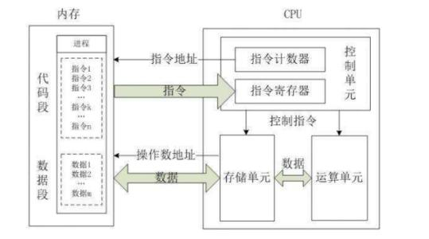
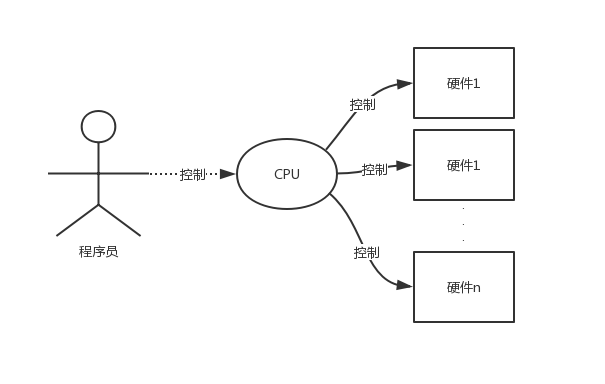
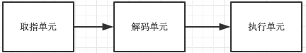
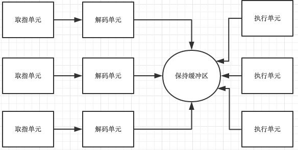
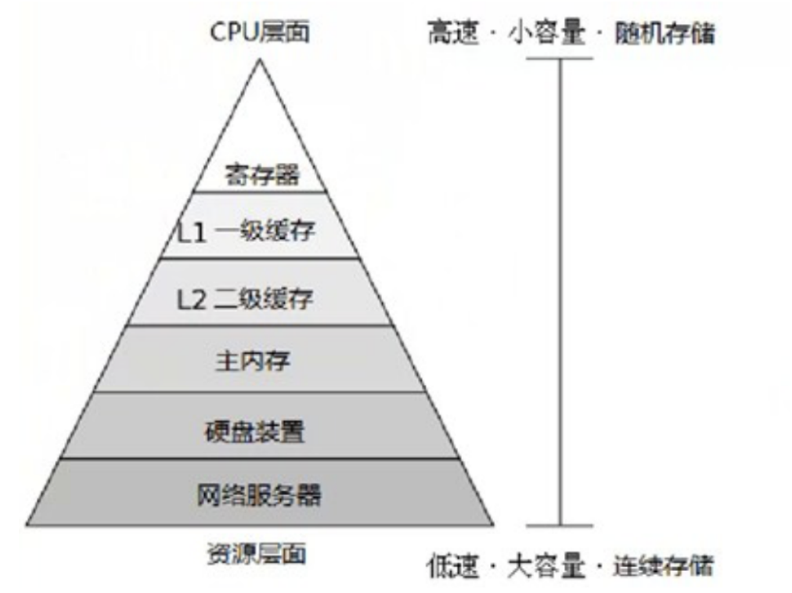
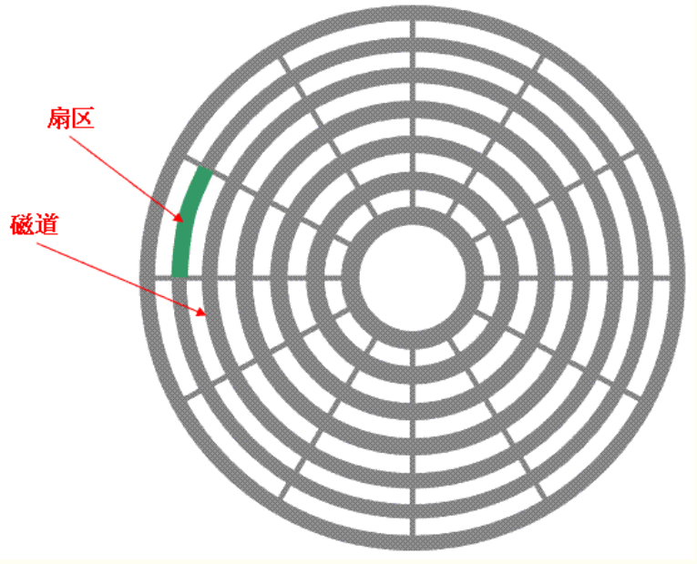
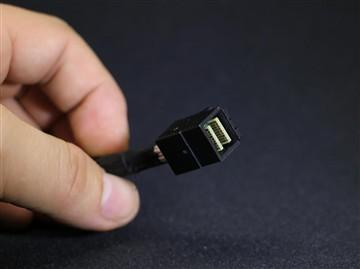

[TOC]


# 计算机和服务器的硬件组成

## 一、计算机硬件结构大体一览


一台计算机由主机、外设及其他部分组成，只有这些硬件组合在一起协调工作，才能称之为计算机。计算机发展到现在，由于不同领域的使用发生了很大的变化，出现了很多分类和零件。但是工作原理没有发生变化。所有计算机组成大致相同，都包含计算机五大组成部分。


## 二、计算机的硬件组成

### 1、计算机的五大组成部分


#### 1.运算器和控制器

**运算器和控制器一般都集成在CPU（中央处理器）当中。**

##### 1）运算器

> 负责算术运算和逻辑运算

```bash
1.运算器是对信息进行处理和运算的部件。经常进行的运算是算术运算和逻辑运算，所以运算器又可称为算术逻辑运算部件（Arithmetic and Logical，ALU）。
2.运算器的核心是加法器。运算器中还有若干个通用寄存器或累加寄存器，用来暂存操作数并存放运算结果。寄存器的存取速度比存储器的存放速度快很多。
3..运算器主要用来负责程序的运算与逻辑的判断。
```


##### 2）控制器

> 计算机的指挥中心，负责控制其他硬件运行

```bash
1.控制器是整个计算机的指挥中心，它的主要功能是按照人们预先确定的操作步骤，控制整个计算机的各部件有条不紊的自动工作。
2.控制器从主存中逐条地读取出指令进行分析，根据指令的不同来安排操作顺序，向各部件发出相应的操作信号，控制它们执行指令所规定的任务。控制器中包括一些专用的寄存器。
3.控制器主要负责协调各个组件和各个单元的工作。
```

**CPU主要用来管理和运算，是整个计算的大脑。它从内存读取指令——》解码——》执行，周而复始。直到一个程序运行完成**



##### 3）指令集



> ​	在超大规模集成电路构成的微型计算机中，往往将CPU制成一块具有特定功能的芯片，称为微处理器，芯片里边有编写好的微指令集,我们在主机上的所有操作或者说任何软件的执行最终都要转化成cpu的指令去执行,如输入输出，阅读，视频，上网等这些都要参考CPU是否内置有相关微指令集才行。如果没有那么CPU无法处理这些操作。不同的CPU指令集不同对应的功能也不同，这就好比不同的人脑，对于大多数人类来说，人脑的结构一样，但是大家的想法、思想都有差别。

###### ①精简指令集

```bash
1.精简指令集（Reduced Instruction Set Computing，RISC）：这种CPU的设计中，微指令集较为精简，每个指令的运行时间都很短，完成的动作也很单纯，指令的执行效能较佳；但是若要做复杂的事情，就要由多个指令来完成。常见的RISC指令集CPU主要例如Sun公司的SPARC系列、IBM公司的Power Architecture（包括PowerPC）系列、与ARM系列等。【注：Sun已经被Oracle收购；】
2.SPARC架构的计算机常用于学术领域的大型工作站中，包括银行金融体系的主服务器也都有这类的计算机架构；
3.PowerPC架构的应用，如Sony出产的Play Station 3（PS3）使用的就是该架构的Cell处理器。
4.ARM是世界上使用范围最广的CPU了，常用的各厂商的手机、PDA、导航系统、网络设备等，几乎都用该架构的CPU。
```

###### ②复杂指令集

```bash
1.复杂指令集（Complex Instruction Set Computer，CISC）与RISC不同，在CISC的微指令集中，每个小指令可以执行一些较低阶的硬件操作，指令数目多而且复杂，每条指令的长度并不相同。因此指令执行较为复杂所以每条指令花费的时间较长，但每条个别指令可以处理的工作较为丰富。常见的CISC微指令集CPU主要有AMD、Intel、VIA等的x86架构的CPU。
```

###### 总结：

```bash
CPU按照指令集可以分为精简指令集CPU和复杂指令集CPU两种，区别: 
1.精简指令集：精简，每个指令的运行时间都很短，完成的动作也很单纯，指令的执行效能较佳；但是若要做复杂的事情，就要由多个指令来完成。
2.复杂指令集：每个小指令可以执行一些较低阶的硬件操作，指令数目多而且复杂，每条指令的长度并不相同。因为指令执行较为复杂所以每条指令花费的时间较长，但每条个别指令可以处理的工作较为丰富。
```


##### 4）x86架构和64位

###### ①x86架构

```bash
1.x86是针对cpu的型号或者说架构的一种统称，详细地讲，最早的那颗Intel发明出来的CPU代号称为8086，后来在8086的基础上又开发出了80285、80386....，因此这种架构的CPU就被统称为x86架构了。
2.由于AMD、Intel、VIA所开发出来的x86架构CPU被大量使用于个人计算机上面，因此，个人计算机常被称为x86架构的计算机！
3.程序员开发出的软件最终都要翻译成cpu的指令集才能运行，因此软件的版本必须与cpu的架构契合，举个例子，我们在MySQL官网下载软件MySQL时名字为：
      Windows(x86,32-bit),ZIP Archive
      (mysql-5.7.20-win32.zip)   
    我们发现名字中有x86或32，这其实就是告诉我们：该软件应该运行在x86架构的计算机上。
```

###### ②64位

```bash
1.cpu的位数指的是cpu一次性能从内存中取出多少位二进制指令，64bit指的是一次性能从内存中取出64位二进制指令。
2.在2003年以前由Intel所开发的x86架构CPU由8位升级到16、32位，后来AMD依此架构修改新一代的CPU为64位，到现在，个人计算机CPU通常都是x86_64的架构。
3.cpu具有向下兼容性，指的是64位的cpu既可以运行64位的软件，也可以运行32位的软件，而32位的cpu只能运行32位的软件。这其实很好理解，如果把cpu的位数当成是车道的宽，而内存中软件的指令当做是待通行的车辆，宽64的车道每次肯定既可以通行64辆车，也可以通信32辆车，而宽32的车道每次却只能通行32辆车
```

###### 总结：

```bash
×86_32位操作系统:
  1.使用x86指令集
  2.指CPU一次性能处理32位个二进制字符（四个字节宽）
  3.只能运行32位及以下的软件，可以兼容运行比自己更低版本的程序
  4.最大支持4G内存

×86: 64位操作系统：
  1.使用x86指令集的64位扩展超集（八个字节）
  2.指CPU一次性能处理64位个二进制字符
  3.既能运行32位的软件又能运行64位的软件，可以兼容运行比自己更低版本的程序
  4.最大支持内存受主板限制
```

###### 微处理器发展历史

```bash
1.微处理器由一片或少数几片大规模集成电路组成的中央处理器。这些电路执行控制部件和算术逻辑部件的功能。微处理器能完成取指令、执行指令，以及与外界存储器和逻辑部件交换信息等操作，是微型计算机的运算控制部分。它可与存储器和外围电路芯片组成微型计算机。

2.计算机的发展主要表现在其核心部件——微处理器的发展上，每当一款新型的微处理器出现时，就会带动计算机系统的其他部件的相应发展，如计算机体系结构的进一步优化，存储器存取容量的不断增大、存取速度的不断提高，外围设备的不断改进以及新设备的不断出现等。根据微处理器的字长和功能，可将其发展划分为以下几个阶段。

第1阶段（1971——1973年）是4位和8位低档微处理器时代，通常称为第1代。
第2阶段（1974——1977年）是8位中高档微处理器时代，通常称为第2代。
第3阶段（1978——1984年）是16位微处理器时代，通常称为第3代。
第4阶段（1985——1992年）是32位微处理器时代，又称为第4代。
第5阶段（1993-2005年）是奔腾（pentium）系列微处理器时代，通常称为第5代。
第6阶段（2005年至今）是酷睿（core）系列微处理器时代，通常称为第6代。“酷睿”是一款领先节能的新型微架构，设计的出发点是提供卓然出众的性能和能效，提高每瓦特性能，也就是所谓的能效比。
```

##### 5)处理器的设计演变

###### ①取值、解码、执行同时执行

```bash
最开始取值、解码、执行这三个过程是同时运行的，这意味着任何一个过程完成都需要等待其余两个过程执行完毕，时间浪费
```

###### ②流水线式

```bash
流水线式的设计，即执行指令n时，可以对指令n+1解码，并且可以读取指令n+2,完全是一套流水线。
```




###### ③超变量cpu

```bash
1.比流水线更加先进，有多个执行单元，可以同时负责不同的事情，比如看电影的同时，听歌，打游戏，学习linux。
2.两个或更多的指令被同时取出、解码并装入一个保持缓冲区中，直至它们都执行完毕。只有有一个执行单元空闲，就检查保持缓冲区是否还有可处理的指令
3.缺陷：这种设计存在一种缺陷，即程序的指令经常不按照顺序执行，在多数情况下，硬件负责保证这种运算结果与顺序执行的指令时的结果相同。
```



##### 6）内核态与用户态

```bash
1.内核态——>操作系统正在控制硬件
    当cpu在内核态运行时，cpu可以执行指令集中所有的指令，很明显，所有的指令中包含了使用硬件的所有功能，（操作系统在内核态下运行，从而可以访问整个硬件）

2.用户态-->应用程序正在运行
    用户程序在用户态下运行，仅仅只能执行cpu整个指令集的一个子集，该子集中不包含操作硬件功能的部分，因此，一般情况下，在用户态中有关I/O和内存保护（操作系统占用的内存是受保护的，不能被别的程序占用），当然，在用户态下，将PSW（Program Status Word 程序状态寄存器）中的模式设置成内核态也是禁止的。

　　内核态与用户态切换　　

　　用户态下工作的软件不能操作硬件，但是我们的软件比如暴风影音，一定会有操作硬件的需求，比如从磁盘上读一个电影文件，那就必须经历从用户态切换到内核态的过程，为此，用户程序必须使用系统调用（system call），系统调用陷入内核并调用操作系统，TRAP指令把用户态切换成内核态，并启用操作系统从而获得服务。

　　请把的系统调用看成一个特别的的过程调用指令就可以了，该指令具有从用户态切换到内核态的特别能力。
```


##### 7) 多核多线程芯片

###### ①双核四线程概念

```bash
物理双核，通过超线程技术，使每个物理核心模拟出一个虚拟核心出来，这样可以同时处理多个任务。但实际上它还是双核，但是性能比双核要强，低于真正的物理四核心处理器
    双核——》2个cpu核心
    四线程：每个核内部有两条流水线——》2核有4条流水线
```


###### ②摩尔定律

```bash
moore定律指出，芯片中的晶体管数量每18个月翻一倍，随着晶体管数量的增多，更强大的功能成为了可能。
ps：挤牙膏行为不算，所以不适应一些芯片厂商。
```

> ps：挤牙膏行为不算，所以不适应一些芯片厂商。


###### ③性能增强

```bash
1.第一步增强：在cpu芯片中加入更大的缓存，一级缓存L1，用和cpu相同的材质制成，cpu访问它降低时延

2.第二步增强：一个cpu中的处理逻辑增多，intel公司首次提出，称为多线程（multithreading）或超线程（hyperthreading），对用户来说一个有两个线程的cpu就相当于两个cpu，我们后面要学习的进程和线程的知识就起源于这里，进程是资源单位而线程才是cpu的执行单位。

3.多线程运行cpu保持两个不同的线程状态，可以在纳秒级的时间内来回切换，速度快到你看到的结果是并发的，伪并行的，然而多线程不提供真正的并行处理，一个cpu同一时刻只能处理一个进程（一个进程中至少一个线程）

4、第三步增强：除了多线程，还出现了核心2个或者4个完整处理器的cpu芯片，如下图。要使用这类多核芯片肯定需要有多处理操作系统
```


#### 2.存储器



##### 1）寄存器：

###### ①介绍

```bash
用与cpu相同材质制造，与cpu一样快，因而cpu访问它无时延，典型容量是：在32位cpu中为32*32，在64位cpu中为64*64，在两种情况下容量均<1KB。
```


###### ②用途

```bash
	因访问内存得到指令或数据的时间比cpu执行指令花费的时间要长得多，所以，所有CPU内部都有一些用来保存关键变量和临时数据的寄存器，这样通常在cpu的指令集中专门提供一些指令，用来将一个字（可以理解为数据）从内存调入寄存器，以及将一个字从寄存器存入内存。cpu其他的指令集可以把来自寄存器、内存的操作数据组合，或者用两者产生一个结果，比如将两个字相加并把结果存在寄存器或内存中。
```


###### ③分类

```bash
1.除了用来保存变量和临时结果的通用寄存器外

2.多数计算机还有一些对程序员设计的专门寄存器，其中之一便是程序计数器，它保存了将要取出的下一条指令的内存地址。在指令取出后，程序计算器就被更新以便执行后期的指令

3.另外一个寄存器便是堆栈指针，它指向内存中当前栈的顶端。该栈包含已经进入但是还没有退出的每个过程中的一个框架。在一个过程的堆栈框架中保存了有关的输入参数、局部变量以及那些没有保存在寄存器中的临时变量

4.最后 一个非常重要的寄存器就是程序状态字寄存器(Program Status Word,PSW),这个寄存器包含了条码位(由比较指令设置)、CPU优先级、模式（用户态或内核态），以及各种其他控制位。用户通常读入整个PSW，但是只对其中少量的字段写入。在系统调用和I/O中，PSW非常非常非常非常非常非常重要
```


###### ④寄存器维护

```bash
　　操作系统必须知晓所有的寄存器。在时间多路复用的CPU中，操作系统会经常中止正在运行的某个程序并启动（或再次启动）另一个程序。每次停止一个运行着的程序时，操作系统必须保存所有的寄存器，这样在稍后该程序被再次运行时，可以把这些寄存器重新装入。
```


##### 2）高速缓存

###### ①介绍

```bash
主要由硬件控制高速缓存的存取，内存中有高速缓存行按照0~64字节为行0，64~127为行1。。。最常用的高速缓存行放置在cpu内部或者非常接近cpu的高速缓存中。
```

###### ②使用

```bash
	当某个程序需要读一个存储字时，高速缓存硬件检查所需要的高速缓存行是否在高速缓存中。如果是，则称为高速缓存命中，缓存满足了请求，就不需要通过总线把访问请求送往主存(内存)，这毕竟是慢的。
	高速缓存的命中通常需要两个时钟周期。高速缓存为命中，就必须访问内存，这需要付出大量的时间代价。由于高速缓存价格昂贵，所以其大小有限，有些机器具有两级甚至三级高速缓存，每一级高速缓存比前一级慢但是容量增加。
```

###### ③其他使用

```bash
	缓存在计算机科学的许多领域中起着重要的作用，并不仅仅只是RAM（随机存取存储器）的缓存行。只要存在大量的资源可以划分为小的部分，那么这些资源中的某些部分肯定会比其他部分更频发地得到使用，此时用缓存可以带来性能上的提升。一个典型的例子就是操作系统一直在使用缓存，比如，多数操作系统在内存中保留频繁使用的文件（的一部分），以避免从磁盘中重复地调用这些文件，类似的/root/a/b/c/d/e/f/a.txt的长路径名转换成该文件所在的磁盘地址的结果然后放入缓存，可以避免重复寻找地址，还有一个web页面的url地址转换为网络地址(IP)地址后，这个转换结果也可以缓存起来供将来使用。
```

###### ④多级缓存

```bash
	缓存是一个好方法，在现代cpu中设计了两个或以上缓存。第一级缓存称为L1总是在CPU中，通常用来将已经解码的指令调入cpu的执行引擎，对那些频繁使用的数据自，多少芯片还会按照第二L1缓存 。。。另外往往设计有二级缓存L2，用来存放近来经常使用的内存字。L1与L2的差别在于对cpu对L1的访问无时间延迟，而对L2的访问则有1-2个时钟周期（即1-2ns）的延迟。
```


##### 3）内存

###### ①RAM：主存（内存）

> 读写速度超快，断电数据即丢失

```bash
	再往下一层是主存，此乃存储器系统的主力，主存通常称为随机访问存储RAM，就是我们通常所说的内存，容量一直在不断攀升，所有不能再高速缓存中找到的，都会到主存中找，主存是易失性存储，断电后数据全部消失
	ps:linux系统会把内存分为两种区域：
		buffer：缓冲区，攒一大波数据，再刷入硬盘
		cache：缓存区，把硬盘的数据在内存中缓存好，cpu取的时候可以直接从内存取
		写入缓冲区buffer，读取缓存区cache
```


###### ②ROM：只读内存

> 读取速度超快，只能用于读取，断电数据不丢失

```bash
   除了主存RAM之外，许多计算机已经在使用少量的非易失性随机访问存储如ROM（Read Only Memory，ROM），在电源切断之后，非易失性存储的内容并不会丢失，ROM只读存储器在工厂中就被编程完毕，修改需要使用专业的烧录设备。ROM速度快且便宜，在有些计算机中，用于启动计算机的引导加载模块就存放在ROM中，另外一些I/O卡也采用ROM处理底层设备的控制。
   
   ps：内存中存放都是cpu要运行的程序
		RAM=》qq、暴风影音、微信、爱奇艺视频
        ROM=》BIOS（Basic Input Output System基本的输入输出操作系统）
```


###### ③EEPROM

>电可擦除可编程ROM和闪存（flash memory）

```bash
   EEPROM（Electrically Erasable PROM，电可擦除可编程ROM）和闪存（flash memory）也是非易失性的，但是与ROM相反，他们可以擦除和重写。不过重写时花费的时间比写入RAM要多。在便携式电子设备中中，闪存通常作为存储媒介。闪存是数码相机中的胶卷，是便携式音译播放器的磁盘，还应用于固态硬盘。闪存在速度上介于RAM和磁盘之间，但与磁盘不同的是，闪存擦除的次数过多，就被磨损了。
```


###### ④CMOS：

> Complementary Metal Oxide Semiconductor（互补金属氧化物半导体）

```bash
	还有一类存储器就是CMOS，它是易失性的，许多计算机利用CMOS存储器来保持当前时间和日期。CMOS存储器和递增时间的电路由一小块电池驱动，所以，即使计算机没有加电，时间也仍然可以正确地更新，除此之外CMOS还可以保存配置的参数，比如，哪一个是启动磁盘等，之所以采用CMOS是因为它耗电非常少，一块工厂原装电池往往能使用若干年，但是当电池失效时，相关的配置和时间等都将丢失。比如：电脑每次断电关机后再次开机时间就会重置，原因：CMOS电池没电了。

		cpu               				     cpu

		ROM（BIOS系统）    				      RAM（cpu与硬盘之间的缓存）

		CMOS（BIOS配置、时间）                硬盘（系统软件存放地）
```


###### ⑤虚拟内存

```bash
swap分区、当内存不够时，拿出虚拟内存作为应急使用
```


###### ⑥服务器内存ECC

```bash
	ECC内存，能够实现错误检查和纠正技术（ECC）的内存条。一般多应用在服务器及图形工作站上，这将使整个电脑系统在工作时更趋于安全稳定。ECC是“Error Checking and Correcting”的简写，中文名称是“错误检查和纠正”。
	
	ECC内存和普通内存相比，只是拥有的特殊的纠错能力。
	
	所以如果相同规格的普通内存与ECC内存速度上是一样，只是ECC内存更加的稳定。但你特别强调性能的话，性能是综合各方面的表现比如速度、稳定等，那么在性能上来说ECC要比普通内存好，这个好就是指稳定。
```


##### 4）外存

###### ①介绍

```bash
外储存器是指除计算机内存及CPU缓存以外的储存器，此类储存器一般断电后仍然能保存数据。常见的外存储器有硬盘、软盘、光盘、U盘等。
```

###### ②硬盘

> 硬盘常分为固态硬盘和机械硬盘，目前计算主流外部存储设备之一

**固态硬盘（SSD）**

>由控制单元和存储单元（FLASH芯片、DRAM芯片）组成。
>
>基于闪存作为存储介质，断电数据仍然存在，用于永久保存数据。

```bash
优点：
    读写速度快、抗震防摔性强、低功耗、低噪音、工作温度范围大、轻便
缺点：
	同价位容量小、寿命比机械硬盘低，数据丢失不容易找回。
```


**机械硬盘（HDD）**

>机械硬盘即是传统普通硬盘，主要由：盘片，磁头，盘片转轴及控制电机，磁头控制器，数据转换器，接口，缓存等几个部分组成
>
>基于磁存取数据，断电数据仍然存在，用于永久保存数据。

```bash
优点：
	同价位容量大、寿命长、数据丢失可找回大部分
缺点：
	读写速度慢、抗震防摔性弱、功耗较高、噪音较大、工作温度范围少、较重
```


#### 3.输入设备

##### 1）介绍

```bash
	输入设备（InputDevice）是人或外部与计算机进行交互的一种装置，用于把原始数据和处理这些数的程序输入到计算机中。计算机能够接收各种各样的数据，既可以是数值型的数据，也可以是各种非数值型的数据，如图形、图像、声音等都可以通过不同类型的输入设备输入到计算机中，进行存储、处理和输出。
	向计算机输入数据和信息的设备。是计算机与用户或其他设备通信的桥梁。输入设备是用户和计算机系统之间进行信息交换的主要装置之一。
```

##### 2）常见输入设备

```bash
键盘，鼠标，摄像头，扫描仪，光笔，手写输入板，游戏杆，语音输入装置等都属于输入设备。
```


#### 4.输出设备

##### 1）介绍

```bash
	输出设备（Output Device）是计算机硬件系统的终端设备，用于接收计算机数据的输出显示、打印、声音、控制外围设备操作等。
	把各种计算结果数据或信息以数字、字符、图像、声音等形式表现出来。
```

##### 2）常见输出设备

```bash
常见的输出设备有显示器、打印机、绘图仪、影像输出系统、语音输出系统、磁记录设备等。
```


## 三、服务器的硬件组成

### 1、机箱

#### 1.介绍

```bash
机箱一般包括外壳、支架、面板上的各种开关、指示灯等。
```

#### 2.作用

```bash
机箱作为电脑配件中的一部分，它起的主要作用是放置和固定各电脑配件，起到一个承托和保护作用。此外，电脑机箱具有屏蔽电磁辐射的重要作用。
```

#### 3.重要性

```bash
3、虽然是很重要的配置，但是使用质量不良的机箱容易让主板和机箱短路，使电脑系统变得很不稳定。
```


### 2、电源

>为设备，将220V家用电或企业用电分别变压成适合各个部分的电压。


#### 1.开关电源

```bash
AB双路供电：为了实现储蓄供电，避免某一单一线路故障导致断电影响服务器的运行
ATX电源：标准电源，台式机，工作站，低端服务器
SSI电源：专门为了服务器而生的电源，基本适用于各种档次的服务器
UPS电源：不间断电源系统，电池供电。
```

#### 2.企业常见供电措施

```bash
(1) 需要AB双线路供电
(2) 通过蓄电池供电（半个小时-2小时）
(3) 备用柴油发电机，会与就近的加油站签订供油协议
```


### 3、cpu


>电脑与服务器中充当类似人体大脑的角色，负责数据的计算以及程序的控制，中央处理器

#### 1.常见cpu类型

##### 1）个人pc

```bash
intel: i3 i5 i7 i9
AMD: R5 R7 R9
```

##### 2）服务器

```bash
intel: 志强 E5 E7
AMD: 霄龙 皓龙
```


#### 2.CPU的路数与核心数的关系

```bash
双核，四核：单个cpu所包含的核心的数量 双核 两个核心  四核 四个核心

几路的服务器：1路代表 1颗CPU  
			 2路    2颗CPU（一般情况下多路CPU需要同型号）
```


### 4、CPU散热模组

#### 1.介绍

>由散热片和风扇组成

#### 2.作用

```bash
散热片连接CPU，将CPU热量导热到散热片上。风扇再将散热片的热量吹出服务器。达到散热的效果。
如果散热模组失效，服务器会先降频。有保护功能主板的服务器会重启，不然温度持续升高烧掉cpu。
```


#### 3.硅脂

>散热片和CPU中间用的是散热硅脂（不是牙膏）,目的是为了弥补cpu和散热器之间的间隙和提高导热性能，越均匀越好，越薄越好。


### 5、内存条

>内存是一个临时的存储器，负责设备中的数据的中转但是不具备永久存储的能力


#### 1.作用

```bash
	CPU是电脑系统中的老大，处理运算速度是最快的，数据一般存在磁盘中的，因此需要通过内存作为数据处理的媒介，让CPU能够从内存那种直接读取数据，并把CPU的操作指令与数据处理完成后保存到磁盘中。和CPU、硬盘并称为电脑的三大件。
```

#### 2.特点

```bash
内存的容量和处理速度直接影响整个电脑的处理速度
内存数据无法持久化保存，会造成内存的数据丢失
```

#### 3.程序、进程、守护进程

```bash
程序：QQ、微信，程序存放在磁盘中静态的数据。
进程：进行中的程序，运行起来的程序，工作在内存中的。
守护进程：一种后台运行、不可以自行停止的进程	
```

#### 4.提升用户体验

```bash
处理高并发能力
	1、高并发：用户访问量、流量集中化，并且数量过大的情况下	
	2、关于数据方面的优化方案
		将用户经常访问的、访问量大的数据提前写入内存中去
		将内存中的数据永远保存到磁盘中
				
	3、缓存区和缓冲区
		buffer：缓冲区
		    等待磁盘中数据写入的区域
		cache：缓存区
			存放等待cpu读取的数据的区域
					
			写buffer，读cache
```


### 6、硬盘

#### 1.介绍

```bash
1、大容量储存设备的设备，硬盘上也是有缓存芯片的。
2、常用硬盘都是3.5英寸的，常规的机械硬盘，读取性能不高，性能比内存差很多，所以，在企业工作中，我们才会把大量的数据缓存到内存中，写入到缓冲区。
```

#### 2.机械硬盘


##### 1）盘片、片面、磁头

```bash
	硬盘中一般会有多个盘片组成，每个盘片包含两个面，每个盘面都对应地有一个读/写磁头。受到硬盘整体体积和生产成本的限制，盘片数量都受到限制，一般都在5片以内。盘片的编号自下向上从0开始，如最下边的盘片有0面和1面，再上一个盘片就编号为2面和3面。
```

> 下图共有三张盘片、六片面、六磁头


##### 2）扇区和磁道

```bash
	下图显示的是一个盘面，盘面中一圈圈灰色同心圆为一条条磁道，从圆心向外画直线，可以将磁道划分为若干个弧段，每个磁道上一个弧段被称之为一个扇区（图践绿色部分）。扇区是磁盘的最小组成单元，通常是512字节。（由于不断提高磁盘的大小，部分厂商设定每个扇区的大小是4096字节）
```




##### 3）磁头和柱面

```bash
	硬盘通常由重叠的一组盘片构成，每个盘面都被划分为数目相等的磁道，并从外缘的“0”开始编号，具有相同编号的磁道形成一个圆柱，称之为磁盘的柱面。磁盘的柱面数与一个盘面上的磁道数是相等的。由于每个盘面都有自己的磁头，因此，盘面数等于总的磁头数。 如下图
```


##### 4）磁盘容量计算

```bash
存储容量 ＝ 磁头数 × 磁道(柱面)数 × 每道扇区数 × 每扇区字节数

上图中磁盘是一个 3个圆盘6个磁头，7个柱面（每个盘片7个磁道） 的磁盘，图3中每条磁道有12个扇区，所以此磁盘的容量为：
	存储容量 6 * 7 * 12 * 512 = 258048
```


##### 5）性能计算

>机械硬盘读取速度和转速有关

###### ①概念

```bash
寻道时间：磁头从开始移动到数据所在磁道所需要的时间，寻道时间越短，I/O操作越快，目前磁盘的平均寻道时间一般在3－15ms，一般都在10ms左右。
旋转延迟时间：盘片旋转将请求数据所在扇区移至读写磁头下方所需要的时间，旋转延迟取决于磁盘转速。普通硬盘一般都是7200rpm，慢的5400rpm。
数据传输时间：完成传输所请求的数据所需要的时间。
```

> 从上面的指标来看、其实最重要的、或者说、我们最关心的应该只有两个：寻道时间；旋转延迟。

###### ②读取响应时间计算

```bash
假如：7200转/分=120转/s
  转一圈花费的时间：0.008s
	平均延迟时间：转半圈花费的时间4ms
	平均寻道时间：5ms
	
读取响应时间=平均寻道时间+平均延迟时间+数据传输时间（可以忽略）
```

##### 6）机械硬盘常见接口类型

```bash
IDE<SCSI<SATA<SAS<光纤通道（按照读写速度从小到大）
```

#### 3.固态硬盘

>依赖电子存取数据（固态电子存储芯片阵列制成的硬盘）

##### 1）接口类型及协议

```bash
新一代的固态硬盘普遍采用SATA-2接口、SATA-3接口、SAS接口、MSATA接口、PCI-E接口、M.2接口、（u.2）SFF-8639接口

协议：
	NVME、AHCI
```

##### 2）M.2接口的固态硬盘优势

```bash
	M.2接口的固态硬盘主要优点在于体积小巧、性能出色，比较广泛的用于台式电脑、笔记本、超级本等便携设备中。而U.2接口则具备速度更快，2.5英寸更好的与目前SATA3.0接口固态硬盘兼容，适合主流笔记本、台式电脑，未来潜力较大。不过配备U.2接口的固态硬盘比较少，尚等待成熟。
```


#### 4.硬盘接口类型

##### 1） IDE：并口

```bash
	早起的PATA（Parallel ATA）接口，即IDE接口，在传输数据和信号时的总线是复用的，传输速率会受到一定的限制。如若提高传输速率，那么传输的数据和信号往往会产生干扰，导致错误。在这种情况下，串行接口技术就产生了。
```


##### 2） SATA：串口


###### ①介绍

```bash
	SATA是 Serial AT Attachment的缩写，即串行ATA接口，有SATA1、SATA2、SATA3几种标准，是将主机总线适配器连接到大容量存储设备（如硬盘驱动器，光驱和固态驱动器）的计算机总线接口。
	2000年11月由“ Serial ATA Working Group“团体所制定，取代旧式PATA（ Parallel ATA或旧称IDE）接口的旧式硬盘，因采用串行方式传输数据而得名, Serial ATA采用串行连接方式，串行ATA总线使用嵌入式时钟信号，具备了更强的纠错能力，还具有结构简单、支持热插拔的优点。
```

###### ②主力

```bash
	目前已经成了桌面硬盘的主力接口，逐渐向m.2发展。
```

###### ③优势

```bash
	作为目前应用最多的硬盘接口，SATA 3.0接口最大的优势就是成熟。普通2.5英寸SSD以及HDD硬盘都使用这种接口，理论传输带宽6Gbps，虽然比起新接口的10Gbps甚至32Gbps带宽差多了，但普通2.5英寸SSD也没这么高的需求，500MB/s多的读写速度也够用。
```


##### 3）SCSI口

```bash
	SCSI主要用于服务器，英文全称为“ Small Computer System Interface“（小型计算机系统接口)，是同IDE（ATA）完全不同的接口，IDE接口是普通PC的标准接口，而SCSI并不是专门为硬盘设计的接口，是种广泛应用于小型机上的高速数据传输技术
```


##### 4）SAS口：新一代SCSI口

###### ①介绍

```bash
	SAS（ Serial Attached SCSI）即串行连接SCSI，是新一代的SCSI技术，和现在流行的 Serial ATA（SATA）硬盘相同，都是采用串行技术以获得更高的传输速度，并通过缩短连结线改善内部空间等。SAS是并行SCSI接口之后开发出的全新接口。此接口的设计是为了改善存储系统的效能、可用性和扩充性，并且提供与SATA硬盘的兼容性。
```


###### ②诞生原因

```bash
	以往我们都是通过SCSI或者SATA接口及硬盘来完成数据存储工作。正因为SATA技术的飞速发展以及多方面的优势，才会让更多的人考虑能否存在一种方式可以将SATA与SCSI两者相结合，这样就可以同时发挥两者的优势了。在这种情况下SAS应运而生。
```


##### 5）光纤接口

> ​	光纤通道主要用于高端服务器场景，价格昂贵，英文拼写是 Fibre channel，和SCSI接口一样光纤通道最初也不是为硬盘设计开发的接口技术，是专门为网络系统设计的，但随着存储系统对速度的需求，才逐渐应用到硬盘系统中

> ​	光纤接口硬盘需要光信号与硬盘的电信号互相转化，才能实现读写数据。


##### 6）mSATA接口

```bash
	1.mSATA接口，全称迷你版SATA接口（mini-SATA）。是早期为了更适应于超级本这类超薄设备的使用环境，针对便携设备开发的mSATA接口应运而生。可以把它看作标准SATA接口的mini版，而在物理接口上（也就是接口类型）是跟mini PCI-E接口是一样的。

	2.mSATA接口是SSD小型化的一个重要过程，不过mSATA依然没有摆脱SATA接口的一些缺陷，比如依然是SATA通道，速度也还是6Gbps。诸多原因没能让mSATA接口火起来，反而被更具升级潜力的M.2 SSD所取代。
```


##### 7）m.2接口

###### ①介绍

```bash
	M.2接口，是Intel推出的一种替代MSATA新的接口规范。其实，对于桌面台式机用户来讲，SATA接口已经足以满足大部分用户的需求了，不过考虑到超极本用户的存储需求，Intel才急切的推出了这种新的接口标准。
```


###### ②支持的协议

```bash
	M.2接口是一种兼容性十分广泛的微型接口，该接口可以通过设置其接口上的KEY槽，以实现不同功能的接口，M.2接口可以支持以下协议。
		   PCIe, PCIe LP 
 		   HSIC
		   SSIC
		   M-PCIe
		   USB
 		   SDIO
		   UART
 		   PCM/I2S
  		   I2C
 		   SMBus
		   SATA
  		   Display Port
```


###### ③m.2 NVME协议接口

```bash
	NVM Express（NVMe），或称非易失性内存主机控制器接口规范(Non-Volatile Memory express),是一个逻辑设备接口规范。他是与AHCI类似的、基于设备逻辑接口的总线传输协议规范（相当于通讯协议中的应用层），用于访问通过PCI-Express（PCIe）总线附加的非易失性内存介质，虽然理论上不一定要求 PCIe 总线协议。
	此规范目的在于充分利用PCI-E通道的低延时以及并行性，还有当代处理器、平台与应用的并行性，在可控制的存储成本下，极大的提升固态硬盘的读写性能，降低由于AHCI接口带来的高延时，彻底解放SATA时代固态硬盘的极致性能。
```


**NVME协议的优势**

```bash
1、性能有数倍的提升；
2、可大幅降低延迟；
3、NVMe可以把最大队列深度从32提升到64000，SSD的IOPS能力也会得到大幅提升；
4、自动功耗状态切换和动态能耗管理功能大大降低功耗；
5、NVMe标准的出现解决了不同PCIe SSD之间的驱动适用性问题。
```


```bash
M.2接口的固态硬盘宽度22mm，单面厚度2.75mm，双面闪存布局也不过3.85mm厚，但M.2具有丰富的可扩展性，最长可以做到110mm，可以提高SSD容量。M.2 SSD与mSATA类似,也是不带金属外壳的，常见的规格有主要有2242、2260、2280三种，宽度都为22mm，长度则各不相同。
```


```bash
不仅仅是长度，M.2的接口也有两种不同的规格，分别是“socket2”和”socket3”
```


```bash
看似都是M.2接口，但其支持的协议不同，对其速度的影响可以说是千差万别，M.2接口目前支持两种通道总线，一个是SATA总线，一个是PCI-E总线。当然，SATA通道由于理论带宽的限制（6Gb/s）,极限传输速度也只能到600MB/s，但PCI-E通道就不一样了，带宽可以达到10Gb/s，所以看似都为M.2接口，但走的“道儿”不一样，速度自然也就有了差别。
```

下图为M.2接口走SATA通道的速率


下图为M.2接口走PCIE通道的速率


##### 8）PCI-E接口

###### ①介绍及优势

```bash
	在传统SATA硬盘中，当我们进行数据操作时，数据会先从硬盘读取到内存，再将数据提取至CPU内部进行计算，计算后写入内存，存储至硬盘中；而PCI-E就不一样了，数据直接通过总线与CPU直连，省去了内存调用硬盘的过程，传输效率与速度都成倍提升。简单的说，我们可以把两种通道理解成两辆相同的汽车，PCI-E通道的汽车就像是在高速上行驶，而SATA通道的汽车就像是在崎岖山路上行驶。很显然，PCI-E SSD传输速度远远大于SATA SSD。
```


###### ②适用范围

```bash
	目前PCI-E接口通道有PCI-E 2.0 x2及PCI-E 3.0 x4两种，最大速度达到32Gbps，可以满足未来一段时间的使用，而且早期PCI-E硬盘不能做启动盘的问题早解决，现在旗舰级SSD大多会选择PCI-E接口。
	虽然PCI-E SSD有诸多好处，但也不是每个人都适合。PCI-E SSD由于闪存颗粒和主控品质问题，总体成本较高，相比传统SATA固态硬盘价格贵一些。另外，由于PCI-E会占用总线通道，入门以及中端平台CPU通道数较少，都不太适合添加PCI-E SSD，只有Z170，或者是X79、X99这样顶级平台，才可以完全发挥PCI-E SSD的性能。总的来说，如果你是一个不差钱的土豪，那么就 PCI-E SSD吧！
```


##### 9）U.2接口




```bash
	U.2接口别称SFF-8639，是由固态硬盘形态工作组织（SSD Form Factor Work Group）推出的接口规范。U.2不但能支持SATA-Express规范，还能兼容SAS、SATA等规范。因此大家可以把它当做是四通道版本的SATA-Express接口，它的理论带宽已经达到了32Gbps，与M.2接口毫无差别。
```


##### 10）总结


##### 11）硬盘的性能与价格

```bash
	硬盘的价格和本身性能与储存量有关。一般情况下同容量固态比机械贵。同类硬盘性能越高读写越快越贵。不同品牌也会有一定的差异。
```


##### 12）根据需求选择不同的硬盘

```bash
高并发访问，小数据量，可以用SSD存放热数据
	热数据：用户经常访问调度的数据
	冷数据：不被经常访问调度的数据

高并发、小数据量====》固态 
重要数据、低并发、大数据量===》机械 
```


### 7、raid卡：硬盘阵列卡

#### 1.**概念及作用**

```bash
1、一块硬盘的容量是有限的，购买多个盘，又要把多个盘当成一块硬盘用，就需要（raid）工具。把所有的硬盘整合成一个大磁盘。然后再分区，放数据。
2、硬盘阵列有多种方式，有的可以提高读写性能，有的可以提高冗余性
3、多个方式可以混合使用
4、有raid卡后就需要将硬盘插到raid卡上，raid再插到主板上。
5、raid有软raid和硬raid之分，硬raid又分为板载raid和硬raid
```


#### 2.**优点**

```bash
1、可以扩展容量
2、可以提高性能
3、可以增加冗余性，保护数据安全
```


#### 3.**raid常见使用种类**

| 种类    | 硬盘数       | 容量             | 冗余性 | 性能                                         |
| ------- | ------------ | ---------------- | ------ | -------------------------------------------- |
| raid 0  | 一块以上     | 没有损耗         | 无     | 最好，n*单盘性能                             |
| raid 1  | 只能是两块   | 损耗一块盘       | 100%   | 写较慢（写两次），读和单盘无差别（读一块盘） |
| raid 5  | 至少三块以上 | 损耗一块盘的容量 | 较高   | 读写都比较慢，其中一块盘做校验               |
| raid 10 | 四块以上     | 一半             | 100%   | 读=n*单盘性能/2,写较低于读                   |


#### 4.总结

```bash
1、
冗余从好到坏：raid1、raid10、raid5、raid0
性能从好到坏：raid0、raid10、raid5、raid1
成本由低到高：raid0、raid5、raid1、raid10

2、根据不同的需要做不同的raid
比如web、负载、zabbix等服务器硬盘里面只需要装系统可以用两个固态做raid 1，
数据库可以用16t固态加32t机械做raid5，虽然用raid 10更好，但是要考虑公司财力问题，选择最适合公司的方案。

3.
SSD+SAS机械====》土豪搭配
SSD+SATA机械===============》常规，对速度有特殊要求
SAS机械===========》常规，比较核心业务使用，对速度要求常规
SATA机械===》内部服务
```


#### 5.硬盘容量单位

```bash
1DB=1024NB
1NB=1024BB
1BB=1024YB
1YB=1024ZB
1ZB=1024EB
1EB=1024PB
1PB=1024TB
1TB=1024GB
1GB=1024MB
1MB=1024KB
1KB=1024B 
1B=8bit

ps:市面上卖硬盘都是按1000来计算，硬盘上也需要安装出厂内置系统驱动之类的。所以你买的2T硬盘实际只有1.8T左右
```


### 8、光驱

```bash
1、作用：方式光盘
2、光盘：基于激光原理读写二进制信息。可以用来听音乐、安装程序、游戏。一些正版系统软件等出售会直接出售光盘（相比U盘便宜）

扩展
3、U盘：基于芯片电信号存储。出了可以存放音乐，电子文档等一些信息外。可以做成启动U盘。
```


### 9、远程管理卡（IDRAC）

> 作用

```bash
1、实现远程管理服务器的开关机
2、自带远程管理卡无法看到开关机过程画面
3、购买独立远程管理卡可以实现
4、在服务器独立运行的pc，与服务器主板上BMC管理芯片通信，监控与管理硬件的状态信息。拥有自己的系统和IP地址。
```


### 10、主板

```bash
1、搭载以上所有硬件的平台，是连接所有硬件的电路板。
2、所有板卡都要通过主板发挥作用，主板性能和质量的好坏直接影响到整个系统
3、电脑主板按不同的架构标准和各种不同的组件、接口组成。
```


#### 1.台式电脑主板图解


**PCI插槽主要用于功能扩展，比如台式PCI-E X16可以用来插显卡（PCI-E X16支持向下兼容，可以接所有PCI扩展卡）、声卡、网卡、usb扩展卡，PCI接口的固态等。**


#### 2.主板芯片组

```bash
主板芯片组几乎决定着主板的全部功能,相当于主板的大脑，其中CPU的类型、主板的系统总线频率，内存类型、容量和性能，显卡插槽规格是由芯片组中的北桥芯片决定的；而扩展槽的种类与数量、扩展接口的类型和数量（如USB2.0/1.1，IEEE1394，串口，并口，笔记本的VGA输出接口）等，是由芯片组的南桥决定的。还有些芯片组由于纳入了3D加速显示（集成显示芯片）、AC97声音解码等功能，还决定着计算机系统的显示性能和音频播放性能等。
```


#### 3.BIOS芯片

```bash
负责主板上电后各部件自检，设置，保存，一切正常后才能启动操作系统。记录了电脑最基本的信息。
```


#### 4.总线扩展槽

```bash
按功能分为内存槽、pci槽、AGP槽等，比较久远还有ISA槽。
```


#### 5.I/O接口

```bash
如软硬盘、键盘鼠标、打印机、usb、COM1、COM2、音频、网卡等
```


#### 6.显卡

```bash
提供对图像数据的快速处理，大型游戏和渲染的必备组件。
```


### 11、机房服务器的摆放


**布线要规整，每根线打好标签，方便管理。出现问题方便排错修改等。**

