# 远程连接及Centos系统优化

```bash
1、远程连接Linux服务器的常见工具有Xshell、SecureCRT、Putty等，其中 最常用的是Xshell、SecureCRT。这些客户端连接工具在Linux服务器对应着相同SSH服务进程sshd，即远程连接都是使用SSH协议，当然它们也支持其他的协议，比如telnet等。

2、在Windows操作系统下，xshell是最好的终端，可以去官网下载
链接：https://pan.baidu.com/s/1DJtQWpSA7RznZoNeaI3QZQ 
提取码：d06c 

3、在Mac操作系统下，用的是iTerm2，下载地址是：https://www.iterm2.com/download/.html
```


## 一、xshell优化

### 1、===============》定义Xshell日志（工具-选项）

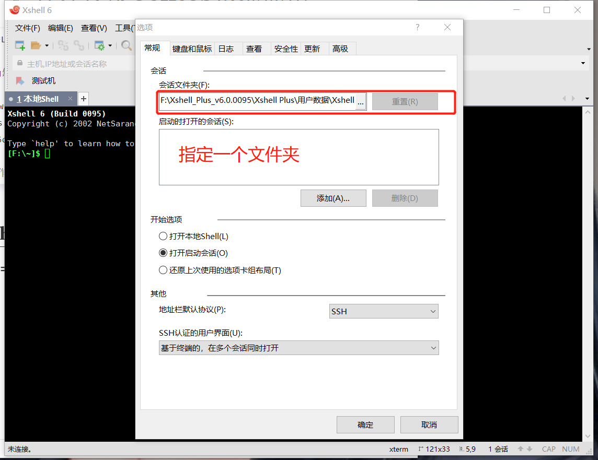

### 2、================关闭Xshell自动更新

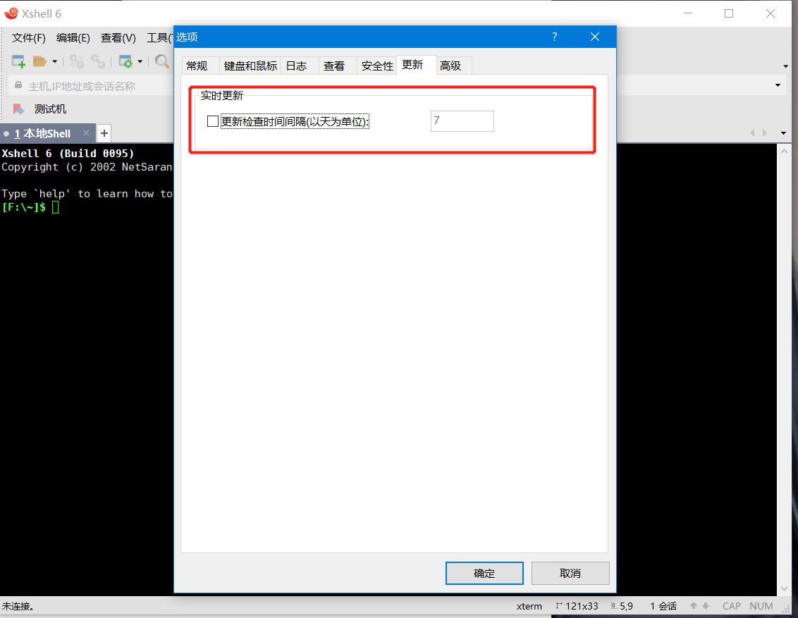


### 3、xshell基础优化（文件---属性）

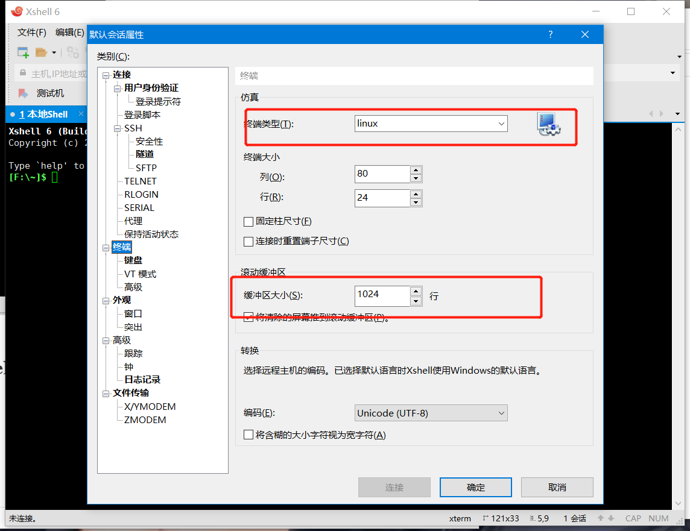

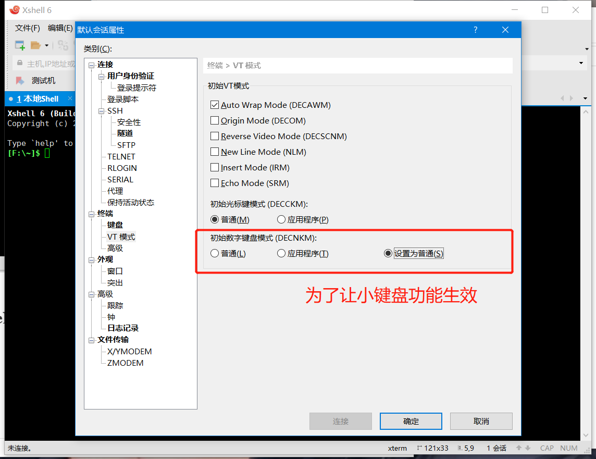

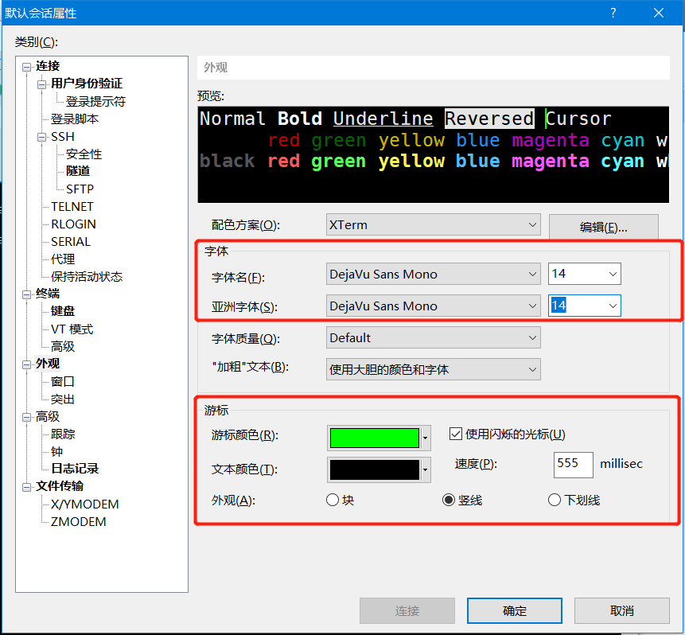

## 二、xshell远程连接

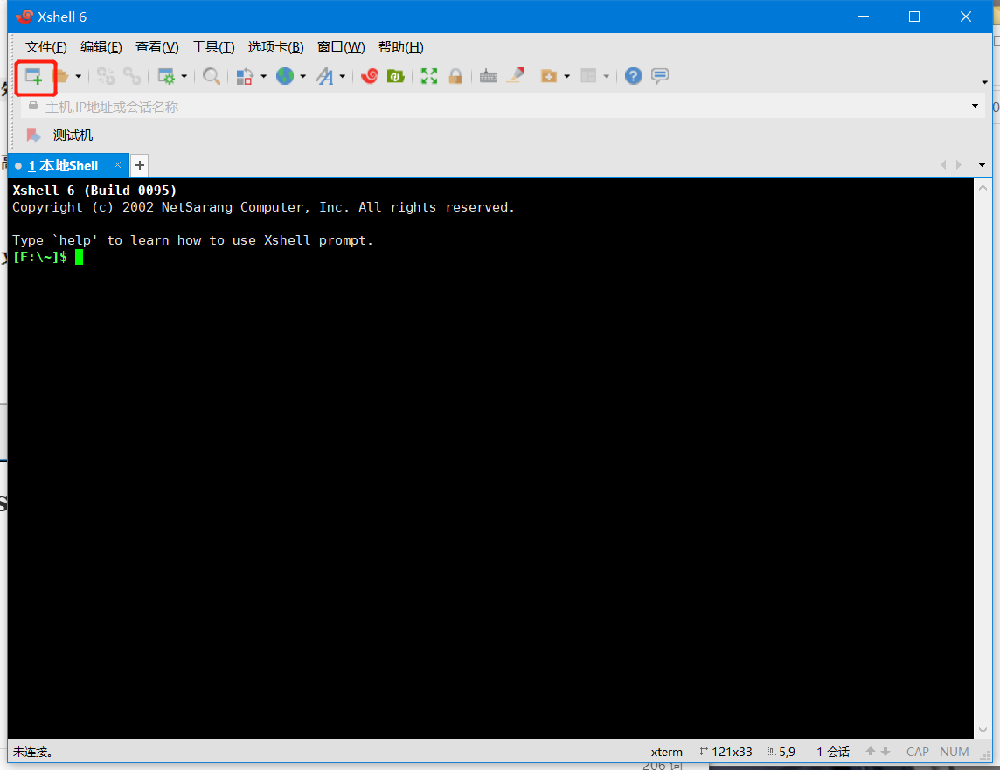

设置好名称、连接协议、服务器ip、端口号

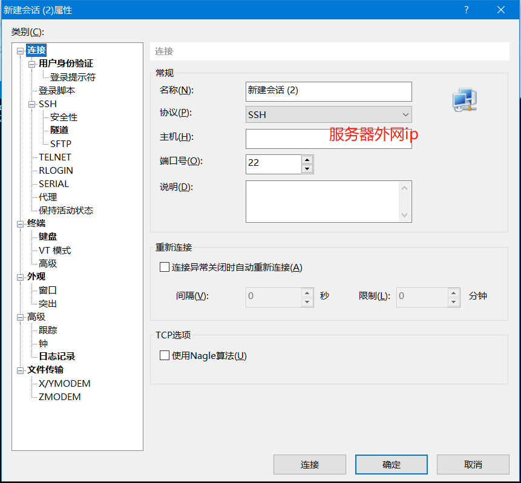


设置用户名和密码，就是安装操作系统设置的

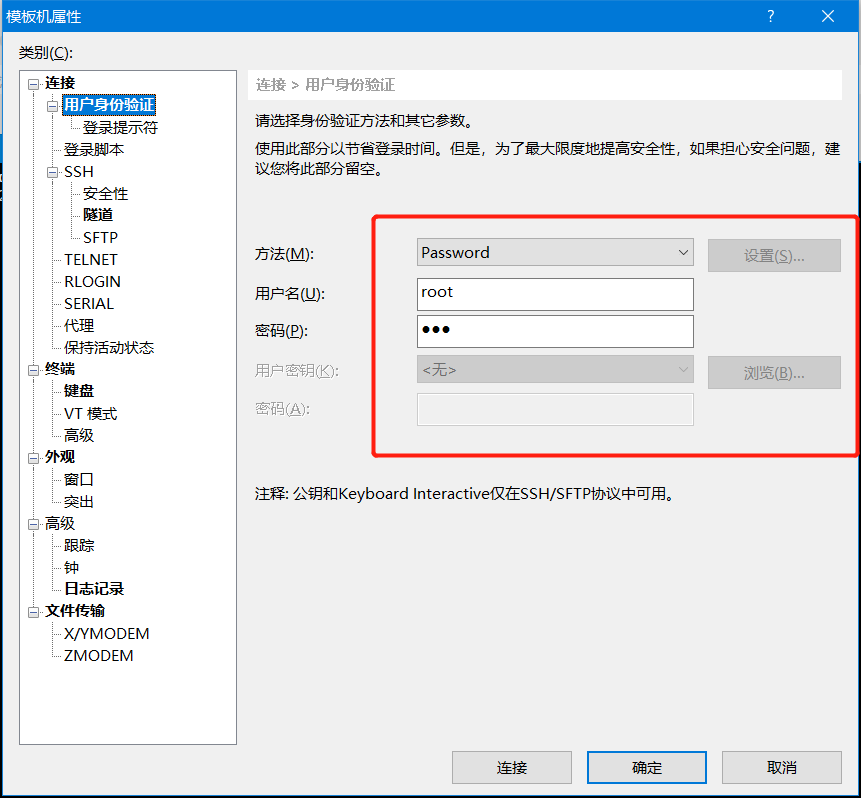


接受保存

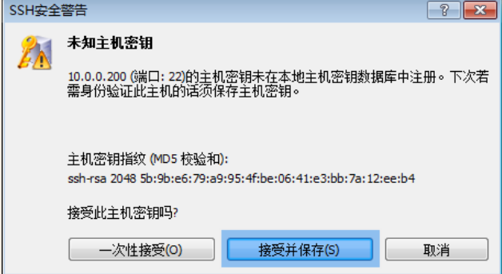


记住密码，方便下次登录

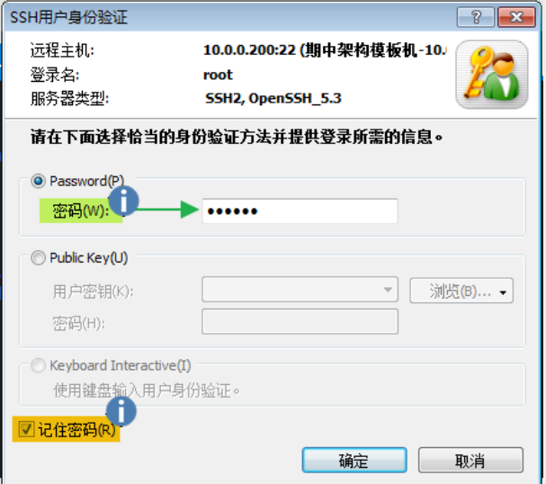


当出现命令提示符时，则登陆成功

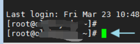

否则登陆失败、


# 基础优化

## 一、解决网络问题排查思路

当我们部署完虚拟机遇到无法上网的问题是，排查思路如下：

ps：由内到外

### 1、linux层面检查

```bash
ip a		查看网卡运行状态

如果网卡处于done或者网卡无显示信息，systemctl restart network重启网卡、停止NetworkManager

查看网卡配置文件具体信息
```

### 2、vm层面检查

```bash
虚拟网络编辑器 ---> vmnet8 网卡设置 查看子网、掩码、网关等设置
```

### 3、windows层面检查

```bash
本地网卡检查 ---> 控制面板\网络和 Internet\网络连接
本地服务检查 ---> 任务管理器 服务 vmware相关服务重启
```


## 二、基础优化步骤

### 1、配置yum仓库

```bash
rm -f /etc/yum.repos.d/*

curl -o /etc/yum.repos.d/CentOS-Base.repo http://mirrors.aliyun.com/repo/Centos-7.repo

curl -o /etc/yum.repos.d/epel.repo http://mirrors.aliyun.com/repo/epel-7.repo

#或

curl -o /etc/yum.repos.d/CentOS-Base.repo https://repo.huaweicloud.com/repository/conf/CentOS-7-reg.repo
yum install -y https://repo.huaweicloud.com/epel/epel-release-latest-7.noarch.rpm

sed -i "s/#baseurl/baseurl/g" /etc/yum.repos.d/epel.repo
sed -i "s/metalink/#metalink/g" /etc/yum.repos.d/epel.repo
sed -i "s@https\?://download.fedoraproject.org/pub@https://repo.huaweicloud.com@g" /etc/yum.repos.d/epel.repo

yum clean all
yum makecache
```


### 2、系统升级

```bash
yum -y upgrade  #只升级系统包，不升级软件和系统内核
yum -y update  #升级系统包、软件、内核。刚做完系统执行一次，以后不要执行，避免长时间未更新，出现兼容问题。
yum update -y --exclud=kernel*	#排除内核都更新
```


### 3、安装基础软件包

```bash
yum install net-tools vim tree htop iftop iotop  bash-completion bash-completion-extras lrzsz sysstat sl lsof unzip telnet nmap nc psmisc dos2unix bwget  nethogs ntpdate nfsutils rsync glances gcc gcc-c++ glibc yum-utils httpd-tools -y
```


### 4、关闭系统服务

#### 1、关闭防火墙

```bash
systemctl stop firewalld      ----->临时关闭
systemctl status firewalld    ----->查看状态
systemctl disable firewalld   ----->永久关闭
```

#### 2、关闭SElinux

```bash
setenforce 0                  ----->临时关闭
sed -i '/^SELINUX=/c SELINUX=disabled' /etc/selinux/config		--->永久关闭
[root@oldboy ~]# getenforce		----->检查状态
Permissive
```

#### 3、关闭NetworkManager

```bash
systemctl stop NetworkManager      ----->临时关闭
systemctl status NetworkManager    ----->查看状态
systemctl disable NetworkManager	   ----->永久关闭
```


### 5、配置ntp服务，同步系统时间

```bash
echo '#Timing synchronization time' >>/var/spool/cron/root	#给定时任务加上注释
echo '0 */1 * * * /usr/sbin/ntpdate ntp1.aliyun.com &>/dev/null' >>/var/spool/cron/root		#设置定时任务
crontab -l	#检查结果
```


### 6、优化显示输出

vim /etc/bashrc  进入bashrc文件  按下41gg  跳转文件的41行  按下i键进入编辑模式，输入#，注释当前行，光标移动到#号前，按下回车键空出当前41行内容，而后光标移动到41行（空行位置），粘贴参数。而后按下ESC键，退出编辑模式，按下SHIFT+; wq 保存退出

```bash
[ "$PS1" = "\\s-\\v\\\$ " ] && PS1="[\[\e[34;1m\]\u@\[\e[0m\]\[\e[32;1m\]\H\[\e[0m\] \[\e[31;1m\]\w\[\e[0m\]]\\$ "
```


### 7、优化ssh连接速度

```bash
sed -i 's@#UseDNS yes@UseDNS no@g' /etc/ssh/sshd_config
sed -i 's@^GSSAPIAuthentication yes@GSSAPIAuthentication no@g' /etc/ssh/sshd_config
systemctl restart sshd
```


### 8、hosts解析

vim /etc/hosts 		

根据需要修改

```bash
10.0.0.3 VIP
172.16.1.4 lb4
172.16.1.5 lb01
172.16.1.6 lb02
172.16.1.7 web01
172.16.1.8 web02
172.16.1.9 web03
172.16.1.31 nfs
172.16.1.41 backup
172.16.1.42 backup02
172.16.1.51 db01
172.16.1.52 db02
172.16.1.53 db03
172.16.1.61 m01
172.16.1.71 zabbix
172.16.1.81 redis01
172.16.1.82 redis02
172.16.1.91 es01
172.16.1.92 es02
```


### 9、调整单个进程最大打开文件数

```bash
echo '* - nofile 65535' >> /etc/security/limits.conf
```


以上完成后开始克隆


# 修改每台主机的主机名、IP地址

## 一、修改主机名

```bash
hostnamectl set-hostname 要换的名字		#注意看要换的名字
hostnamectl set-hostname web01
```


## 二、修改ip地址

```bash
sed -i 's#原ip#更改后ip#g' /etc/sysconfig/network-scripts/ifcfg-eth[01]   #注意自己要换的ip和原ip是什么

sed -i 's#200#7#g' /etc/sysconfig/network-scripts/ifcfg-eth[01]

systemctl restart network
```

y
