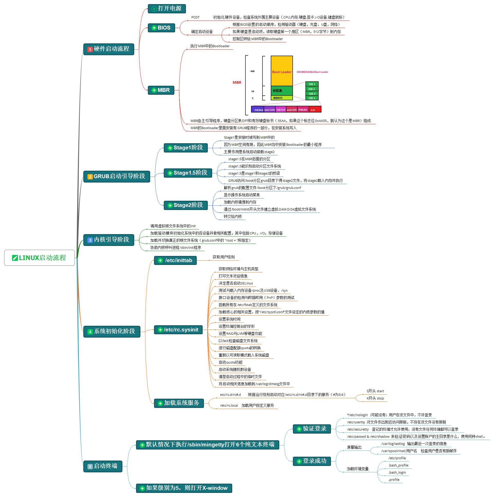
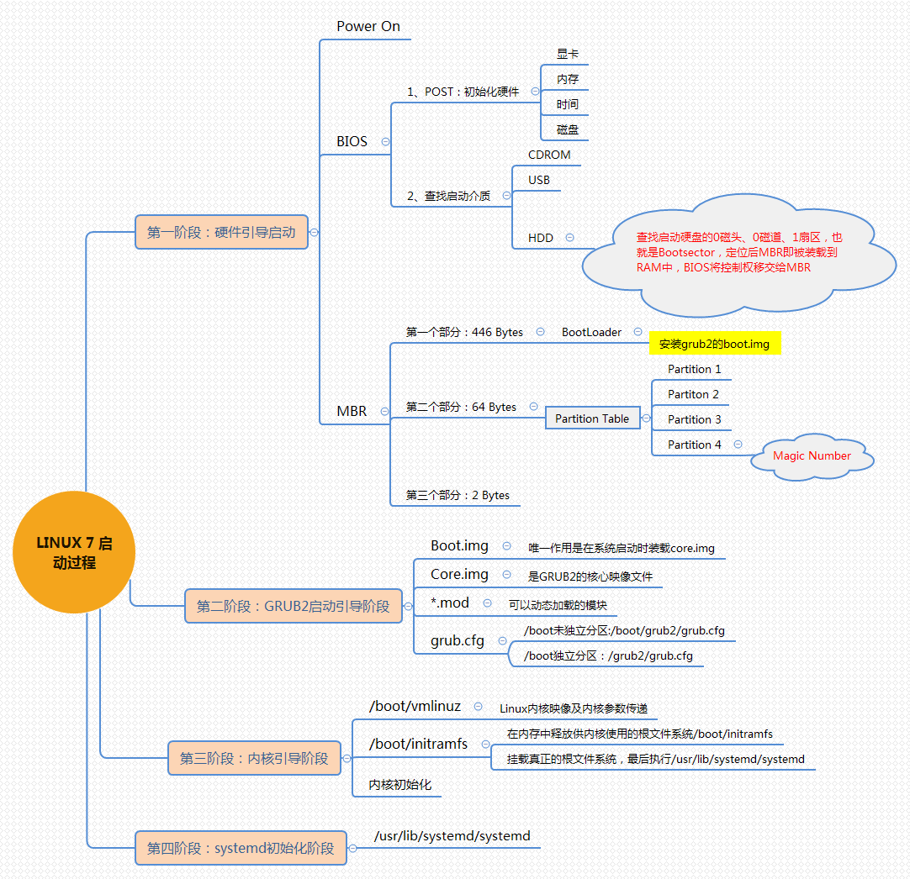

# 操作系统的启动流程

## 一、操作系统的启动流程

### 1、centos6



### 2、centos7



### 3、centos7启动流程详细描述

#### 1.uefi或BIOS初始化阶段

##### 1）POST开机自检

```bash
1.初始化硬件设备，检查系统外围主要设备，如cpu、内存、硬盘、显卡、键盘鼠标、其他IO设备
2.只要一通电，CPU就会自动去加载ROM芯片上的BIOS程序，是这样来实现的。而检测完成之后就进行硬件设备的初始化。
```


##### 2）确认启动设备

```bash
1、根据BIOS设置的启动顺序，检测驱动器（硬盘，光盘，U盘，网络）
2、根据BIOS中对启动顺序的设定，BIOS自己会依次扫描各个引导设备，然后第一个被扫描到具有引导程序(bootloader)的设备就被作为要启动的引导设备。，读取引导设备的MBR（MBR，512字节）到内存
3、将控制权转给MBR中的Bootloader
```


#### 2.加载MBR到内存阶段

```bash
1.BIOS读取并执行启动设备的MBR中的bootloader
2.bootloader要实现的功能就是提供一个菜单给用户，让用户去选择要启动的系统或不同的内核版本
3.将用户选择的内核版本加载至RAM中的特定空间，接着在RAM中解压、展开，而后把系统控制权移交给内核。
```

**MBR描述**

```bash
	全称为Master Boot Record，即硬盘的主引导记录；是位于磁盘最前边的一段引导（Loader）代码。它负责磁盘操作系统(DOS)对磁盘进行读写时分区合法性的判别、分区引导信息的定位，它由磁盘操作系统(DOS)在对硬盘进行初始化时产生的。
```

**MBR组成**

```bash
1.主引导程序(bootloader)（占446个字节）
	可在FDISK程序中找到，它用于硬盘启动时将系统控制转给用户指定的并在分区表中登记了的某个操作系统。

2.磁盘分区表项（DPT，Disk Partition Table)
	由四个分区表项构成（每个16个字节）。
负责说明磁盘上的分区情况，其内容由磁盘介质及用户在使用FDISK定义分区时决定。（具体内容略）

3.有效硬盘标书（占2个字节）
	其值为AA55，存储时低位在前，高位在后，即看上去是55AA（十六进制）。如果这个标志为0XAA55就认为这个是MBR。
```

#### 3.GRUB启动引导阶段

##### 1）Stage1阶段

```bash
1.Stage1是安装是被写道MBR中的
2.MBR空间有限，因此MBR当装安装Bootloader的最小程序
3.作用是启动装在Stage2
```

##### 2）Stage1.5阶段

```bash
1.stage1.5是MBR后面的分区
2.stage1.5能识别区分文件系统
3.stage1.5是stage1和stage2的桥梁
4.GRUB访问/boot分区grub目录下得stage2文件，将stage2载入内存并执行
```

##### 3）stage2阶段

```bash
1.解析grub的配置文件/boot分区下/grub/grub.conf
2.显示操作系统启动菜单
3.加载内核镜像到内存
4.通过/boot/initrd开头文件建立虚拟DAM DISK虚拟文件系统
5.转交给内核
```


##### 4）补充

###### ①信息默认位置

```bash
	grub第1.5和第2阶段，信息默认存放在扇区中，如果使用grub-install生成的第2阶段的文件是存放在/boot分区中的。
```

###### ②1.5阶段的由来

```bash
	为了加载内核系统，不得不加载/boot分区，而加载/boot分区，要有/boot分区的驱动，/boot分区驱动是放在/boot分区中的啊，我们好像进入死循环了，Linux是怎么解决的呢？就是靠放在1.5阶段中的数据，放在第一个扇区后的后续扇区中，第1.5阶段和2阶段总共27个扇区。
```

###### ③1.5阶段的作用

```bash
	第1.5阶段：mbr之后的扇区，识别stage2所在的分区上的文件系统。
```

###### ④2阶段配置

```bash
	开机启动的时候看到Grub选项、信息，还有修改GRUB背景等功能都是stage2提供的，stage2会去读入/boot/grub/grub.conf或者menu.lst等配置文件。
```


#### 4.加载内核和initramfs

##### 1）加载解压内核

```bash
1.加载内核，核心开始解压，启动一些最核心的程序。
2.为了让内核足够的轻小，硬件驱动并没放在内核文件里面。
```


##### 2）内核初始化

```bash
1.kernel内核开始初始化，用systemd来代替centos6以前的init程序
2.先执行initrd.target
3.包括挂载/etc/fstab文件中系统，挂载之后，就可以切换到根目录了。
```


##### 3）根据系统运行级别运行

```bash
1.从initramfs根文件系统切换到磁盘的根目录
2.systemd执行默认target配置
3.centos7表面有“运行级别”这个概念，实际是为了兼容以前的系统，每个所谓“运行级别”都有对应的软连接指向，默认的启动级别/etc/systemd/system/default.target，根据4.它的指向可以找到系统要进入到哪个模式。
```


**七大系统运行级别**

```bash
0：系统停机状态，系统默认运行级别不能设为0，否则不能正常启动
1：单用户工作状态，root权限，用于系统维护，禁止远程登陆
2：多用户状态(没有NFS)
3：完全的多用户状态(有NFS)，登陆后进入控制台命令行模式
4：系统未使用，保留
5：X11控制台，登陆后进入图形GUI模式
6：系统正常关闭并重启，默认运行级别不能设为6，否则不能正常启动

##切换运行级别
init 3
```

