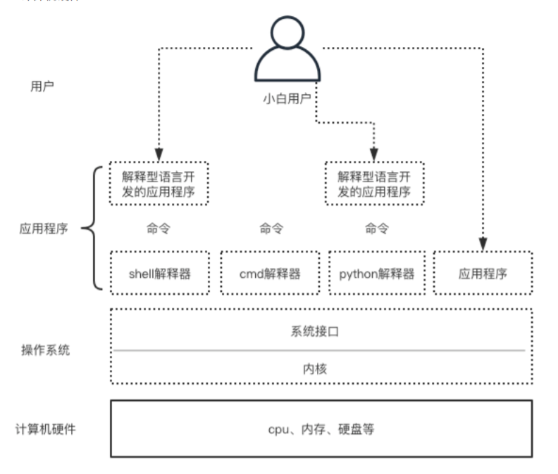

## 一、介绍

```linux
	Shell 中文意思贝壳，寓意类似内核的壳。Shell是指一种应用程序，这个应用程序提供了一个界面，用户通过这个界面访问操作系统内核的服务，简而言之就是只要能够操作应用程序的接口都能够称为SHELL。狭义的shell指的是命令行方面的软件，广义的SHELL则包括图形界面。
```



### 1、什么是系统命令

`--》`理解为控制

```bash
系统命令/shell命令--》shell解释器--》系统接口--》内核--》硬件
应用程序--》系统命令/shell命令--》shell解释器--》系统接口--》内核--》硬件
应用程序--》系统接口-》内核-》硬件
```


### 2、为什么要使用系统命令

> 为了使用计算机，我们可以使用shell对linux系统进行管理，比如：

```bash
1. 文件管理 
2. 用户与权限管理 
3. 进程管理 
4. 磁盘管理 
5. 网络管理 
6. 软件管理
```


### 3、shell的两层意思

#### 1.shell解释器

```bash
1.shell代表的是解释器，是对系统接口的封装，即在系统接口外又加了一层壳
2.shell只是一种称呼，而bash解释器才是具体的一种shell
```


#### 2.shell语言

```bash
1.shell这门编程语言（一堆命令及用法）
2.用shell语言写出的程序通常称之为脚本程序
```

### 4、posix（了解）

```bash
	linux系统支持posix，posix全称可移植的操作系统接口，posix是一种规范
```


## 二、shell交互式环境

### 1、介绍

```bash
[root@xxx ~]# #号代表当前用户权限是超级管理员
[root@xxx ~]$ $号代表当前用户权限是非超管权限

root==>当前登录的用户 
@=====>分隔符 
xxx==>主机名 
~====>当前所在的路径
```

### 2、添加一个新用户

```bash
[root@xiaowu ~]# useradd xiaowu

##查看用户信息
[root@xiaowu ~]# id xiaowu
uid=1001(xiaowu) gid=1001(xiaowu) groups=1001(xiaowu)
```


### 3、给用户设置密码

#### 1.交互式

```bash
[root@xiaowu ~]# passwd xiaowu
Changing password for user xiaowu.
New password:	#输入第一次密码
BAD PASSWORD: The password is shorter than 8 characters
Retype new password:	#输入第二次密码
passwd: all authentication tokens updated successfully.
```


#### 2.非交互式

```bash
[root@xiaowu ~]# echo "123" | passwd xiaowu --stdin
Changing password for user xiaowu.
passwd: all authentication tokens updated successfully.
```


## 三、shell命令语法

### 1、语法

```bash
1、命令：要执行的操作（必选）
2、选项：如何具体执行操作，通常以 -, --, +开头（可选）
3、参数：具体操作的对象（可选）
```

>**unix**认为命令运行完毕后没有提示便是最好的提示，即结果正确，linux继承unix的优良传统

### 2、ls命令

#### 1.概念

```bash
list的缩写，功能：列出目录的内容及其内容属性信息
```

#### 2.语法格式

```bash
ls	  [option]		[file]
ls    [选项]		[文件或目录]
```

#### 3.选项参数

```bash
-l		使用长格式列出文件及目录信息
-a		显示目录文件下的所有文件，包括以“.”开头的文件
-t		根据最后的修改时间排序，默认是文件名排序
-F		在条目后加上文件类型的只是符号（*、/、=、@、|，其中一个）
-r		按照相反次序排序
-p		只在目录后面加上“/”
-i		显示inode节点信息
-d		当遇到目录时，列出目录本身而不是目录内的文件，并且不跟随符号链接
-h		以人类可读的信息显示文件或者目录的大小
-A		列出所有文件，包括隐藏文件，但不包括“.”和“..”这两个目录
-S		根据文件大小排序
-R		递归列出所有子目录
-x		逐行列出项目而不是逐栏列出
-X		根据扩展名排序
-c		根据改变时间排序
-u		根据最后访问时间排序
```


#### 4.例子

```bash
ls
ls /
ls -l /
```

### 3、date命令

```bash
[root@xiaowu ~]# date
Tue Jul 20 20:00:15 CST 2021
[root@xiaowu ~]# date +%F
2021-07-20
```

