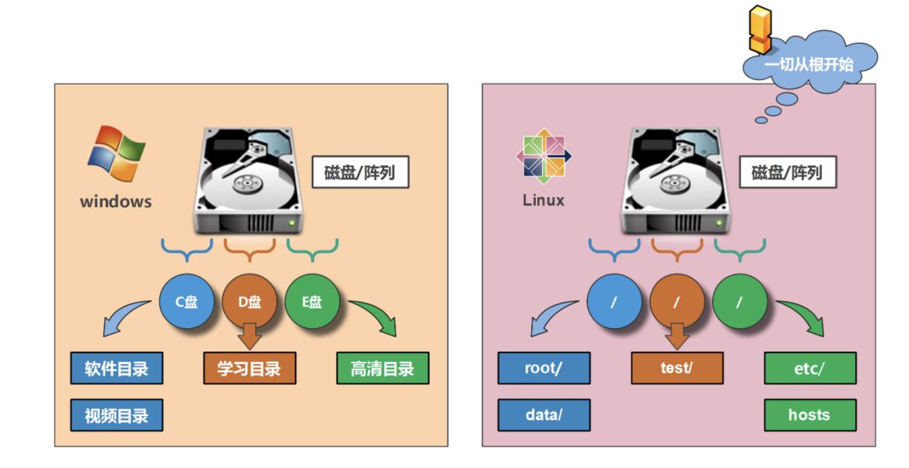

# 文件和目录操作入门

## 一、目录结构

### 1、什么是目录？什么是文件？什么是文件夹

#### 1.目录==文件夹

> 存放的就是文件或者文件夹

#### 2.文件

> 存放是数据、代码，记录了一系列信息的纸

### 2、linux特性：单根目录结构

> linux核心思想：一切皆文件

#### 1.linux和windows目录结构的不同



#### 2.linux根"/"目录下文件夹文件解读

##### 1）命令相关目录

>usr/bin		#普通用户使用的命令，例如ls、date
>usr/sbin	#管理员使用的命令

##### 2）启动目录

> boot		#存放启动相关的文件，例如kernel，grub（引导装载程序）

##### 3）系统文件目录

>usr 		#系统文件，相当于 C:\Windows
>lib -> usr/lib 		#库文件Glibc
>lib64 -> usr/lib64	#库文件Glibc

##### 4）用户家目录

>home		#普通用户家目录
>root		#root用户的HOME

##### 5）配置文件目录

> etc			#配置文件，很重要，系统级服务配置文件都在这里

```bash
/etc/sysconfig/network-script/ifcfg-*	#网卡配置文件
/etc/hostname					#系统主机名配置文件
/etc/resolv.conf				#dns客户端配置文件
/etc/hosts						#本地域名解析配置文件
```

##### 6）设备目录文件

```bash
dev			//设备文件，/dev/sda /dev/sr0
	/dev/cdrom 和/dev/sr0		#系统光盘镜像设备，光盘里存放的内容都在这里，可以用来为操作系统补充包
	/dev/null					#黑洞设备，只进不出。类似于垃圾回收站
	/dev/random					#生成随机数的设备	
	/dev/zero					#能源源不断的产生数据，类似于取款机，随时随地的取钱
	/dev/pts/0					#虚拟的bash shell终端，提供给远程用户使用，0代表第一个终端，1代表第二个终端
	/dev/stderr					#错误输出
	/dev/stdin					#标准输入
	/dev/stdout					#标准输出
```

##### 7）虚拟文件系统

```bash
proc	#虚拟文件系统，反映出来的是内核，进程信息或实时状态
虚拟文件系统：类似于小汽车的仪表盘，能够看到汽车是否有故障，或者是否缺油了
```

##### 8）可变目录和临时目录

```bash
var				#存放的是一些变化文件，比如数据库，日志，邮件
/tmp 			#系统临时目录（类似于公共厕所），系统会定时删除该目录下长时间没有访问的文件

/var	存放一些变化文件
				mysql: 		/var/lib/mysql 	 
				vsftpd: 	/var/ftp 	 
				mail: 		/var/spool/mail 	 
				cron: 		/var/spool/cron 	 
				log: 		/var/log 系统日志文件存放目录	 
				/var/tmp 	临时文件（主要是程序产生的临时文件）
```

##### 9）设备挂载目录

```bash
media 	#移动设备默认挂载点
mnt		#手动挂载设备的挂载点
opt		#早起第三方厂商的软件存放的目录
tmp		#root用户的HOME
```

##### 10）其他重要目录

```bash
lost+found		#孤儿文件
			
run			#存放程序运行后所产生的pid文件
srv			#物理设备产生的一些文件
sys			#硬件设备的驱动程序
```


## 二、linux文件特性

### 1、文件的三种时间

```bash
ls -l 文件名 #仅看的是文件的修改时间 
```

```bash
Linux文件有 三种时间,用stat查看 
	例如：stat anaconda-ks.cfg 
	访问时间：atime，查看内容，用cat检测 
	内容修改时间：mtime，修改内容 
	改变时间：ctime，修改内容，修改权限等属性，凡是有改动都会变
```

### 2、文件的扩展名

>Linux文件是没有扩展名！！！

>linux有多种文件类型但是这些类型并不依赖于文件扩展名

**查看文件扩展名的方法**

#### 1.ls -l或ll

```bash
ls -l 文件名 //看第一个字符 
- 	#普通文件（文本文件，二进制，压缩文件，电影，图片。。。）,例如：/bin/ls 
d 	#目录文件（蓝色），例如/home/ 
b 	#设备文件（块设备）存储设备硬盘，U盘，例如：/dev/sda 
c   #设备文件（字符设备）打印机，例如：终端/dev/tty1 
s 	#套接字文件，例如：/run/rpcbind.sock 
p 	#管道文件，例如：/run/systemd/initctl/fifo 
l 	#链接文件（淡蓝色），例如：/bin
```

> ps:根据颜色判断文件的类型是错误的！！！

#### 2.file+文件路径

```bash
[root@xiaowu ~]# file /etc/grub2.cfg
/etc/grub2.cfg: symbolic link to `../boot/grub2/grub.cfg'
```


## 三、文件属性

### 1、bash shell对文件进行管理

```bash
1. 创建
2. 复制
3. 删除
4. 移动
5. 查看
6. 编辑
7. 压缩
8. 权限操作
9. 查找
```

### 2、pwd命令

> 显示当前工作路径的绝对路径

#### 1.语法格式

```bash
pwd [option]
pwd [选项]
```

#### 2.选项参数

```bash
-L		#显示逻辑路径
-P		#如果当前路径是软连接文件，则会显示软连接文件对应的源文件
```

#### 3.演示

```bash
[root@xiaowu /etc/rc6.d]# pwd
/etc/rc6.d
[root@xiaowu /etc/rc6.d]# pwd -L
/etc/rc6.d
[root@xiaowu /etc/rc6.d]# pwd -P
/etc/rc.d/rc6.d
```

### 3、cd命令

>从当前目录切到指定目录

#### 1.语法格式

```bash
cd	[option]  [dir]
cd	[选项]	  [目录]
```

#### 2.选项参数

```bash
-P		#如果切换的是一个软连接，则会直接切到软连接指向的真正物理目标目录
-L		#如果切换的是一个软连接，直接切到软连接所在的目录
-		#切换到上一次所在目录
~		#切换到家目录
..		#切换到上一层目录
```

### 4、ls命令

>list的缩写，功能：列出目录的内容及其内容属性信息

#### 1.语法格式

```bash
ls	  [option]		[file]
ls    [选项]		[文件或目录]
```

#### 2.选项参数

```bash
-l		使用长格式列出文件及目录信息
-a		显示目录文件下的所有文件，包括以“.”开头的文件
-t		根据最后的修改时间排序，默认是文件名排序
-F		在条目后加上文件类型的只是符号（*、/、=、@、|，其中一个）
-r		按照相反次序排序
-p		只在目录后面加上“/”
-i		显示inode节点信息
-d		当遇到目录时，列出目录本身而不是目录内的文件，并且不跟随符号链接
-h		以人类可读的信息显示文件或者目录的大小
-A		列出所有文件，包括隐藏文件，但不包括“.”和“..”这两个目录
-S		根据文件大小排序
-R		递归列出所有子目录
-x		逐行列出项目而不是逐栏列出
-X		根据扩展名排序
-c		根据改变时间排序
-u		根据最后访问时间排序
```

#### 3.扩展信息解释

```bash
[root@xiaowu ~]# ll -h anaconda-ks.cfg
-rw-------. 1 root root 1.7K Mar 25 08:58 anaconda-ks.cfg
```

```bash
-rw-r--r--. #权限,后面的点代表是否在selinux开启的情况下（enforcing或者permissive都属于开 启）创建的文件
1 			#硬链接个数 
root 		#属主 
root 		#属组 
1.7k 		#文件大小，默认单位字节 
Mar 25 08:58 	#文件修改时间 
anaconda-ks.cfg #文件名字
```

### 5、tree命令

>以树形结构显示目录下的内容

#### 1.语法格式

```bash
tree [option] [directory]
tree [选项] 	[目录]
```

#### 2.参数选项

```bash
-a		#显示所有文件，包括隐藏文件
-d 		#只显示目录
-f		#显示每个文件的全路径
-i		#不显示树枝
-L level	#遍历目录的最大层数
```

## 四、创建、复制、移动、删除

### 1、touch

> 创建新的空文件或改变已有文件的时间戳性
>
> 创建出来的是普通文本与后缀名无关

#### 1.语法格式

```bash
touch  [option]  [file]
touch  [选项]    [文件]
```

#### 2.参数选项

```bash
-a 		#只更改指定文件夹的最后访问时间
-d STRING	#使用字符串STRING代表的时间作为模板设置指定文件的时间属性
-m			#只更改文件的最后修改时间
-r file		#将指定文件的时间属性设置为与模板文件file的时间属性相同
-t STAMP	#使用 [[CC]YY]MMDDhhmm[.ss] 格式的时间设置文件的时间属性。格式的含义从左到右依次为：世纪、年、月、日、时、分、秒
```

#### 3.演示

```bash
touch {a,b,m,n,1,10}.txt
touch {1..9}.txt
touch {1..9}{a..c}.txt
```

### 2、mkdir

> 创建目录

#### 1.语法格式

```bash
mkdir	[option]	[directory]
mkdir	[选项]		[目录]
```

#### 2.参数选项

```bash
-p 		#递归创建目录
-m		#设置新创建目录的默认目录对应的权限
-v		#显示创建目录的过程
```

#### 3.演示

```bash
[root@xiaowu /opt]# mkdir test
[root@xiaowu /opt]# cd test/
[root@xiaowu /opt/test]# pwd
/opt/test
[root@xiaowu /opt/test]# mkdir /opt/test/a b
[root@xiaowu /opt/test]# ll
total 0
drwxr-xr-x 2 root root 6 Jul 21 18:54 a
drwxr-xr-x 2 root root 6 Jul 21 18:54 b
[root@xiaowu /opt/test]# mkdir /opt/test/{c,d}
[root@xiaowu /opt/test]# ls
a  b  c  d
[root@xiaowu /opt/test]# mkdir -v {x,y,z}
mkdir: created directory ‘x’
mkdir: created directory ‘y’
mkdir: created directory ‘z’
[root@xiaowu /opt/test]# mkdir /opt/a/b/c/d/e
mkdir: cannot create directory ‘/opt/a/b/c/d/e’: No such file or directory
[root@xiaowu /opt/test]# mkdir -p /opt/a/b/c/d/e
[root@xiaowu /opt]# tree a
a
└── b
    └── c
        └── d
            └── e

4 directories, 0 files
```

### 3、cp

> 复制文件或目录

#### 1.语法格式

```bash
cp 	[option]	[source]	[dest]
cp	[选项]		[源文件]	[目标文件]
```

#### 2.参数选项

```bash
-p	#复制文件时保持源文件的所有者、权限信息、时间属性
-d	#如果复制的源文件是符号链接（软连接），那么仅复制软连接本身，而且保留软连接所指向的目标文件或目录
-r	#递归复制目录，即复制目录及目录下的所有层级的子目录和文件
-a	#等同于上面的p、d、r这三个功能的总和
-i	#覆盖已有文件前提示用户确认
-t	#默认情况下命令格式是“cp 源文件 目标文件”，使用-t参数后可以颠倒顺序，格式变为“cp -t 目标文件 源文件”
-f	#强行复制文件或目录， 不论目的文件或目录是否已经存在
```

#### 3.演示

```bash
[root@xiaowu /opt/test]# cp /etc/passwd .
[root@xiaowu /opt/test]# ls
a  b  c  d  passwd  x  y  z
[root@xiaowu /opt/test]# cp /etc/hosts ./h.txt
[root@xiaowu /opt/test]# cp -r /boot/* ./
```


### 4、mv

>移动或者重命名文件

#### 1.语法格式

```bash
mv	[option] [source] [dest] 
mv  [选项]   [源文件] [目标文件]
```

#### 2.参数选项

```bash
-f		#若目标文件已经存在，则不会询问而是直接覆盖
-i		#若目标文件已经存在，则询问是否覆盖
-n		#不覆盖已经存在的文件
-u		#在源文件比目标文件新或目标不存在时才进行
```


### 5、rm

> 删除文件或目录

#### 1.语法格式

```bash
rm	[option]  [file]
rm	[选项]	  [<文件或目录>]
```

#### 2.选项参数

```bash
-f		#强制删除。忽略不存在的文件，不提示确认
-i		#在删除之前需要确认
-I		#在删除超过三个文件或者递归删除前需要确认
-r		#递归删除目录及其内容
	rm -rf 文件
	rm -rf 目录
```

## 五、linux中的特殊符号

>配合基础命令，内置命令使用时，以下符号意义如下

```bash
.             当前目录   （cd   mv  cp  等）
..            上一级目录 （cd   mv  cp  等）\
{1..3}        生成一个有序序列  （touch    mkdir   等）
~             用户的家目录 （cd   mv  cp  touch  等  ）
*             一个或多个字符 （rm -rf /*   ???)
|   		  管道符，把管道符前面的命令处理结果，以标准输出的形式，传递给管道符后面的命令再处理。
>             标准输出重定
>>            标准输出追加重定向向

<<            标准输入追加重定向
<             标准输入重定向
&&            并且（同时成立）
！            取反，在find和awk命令中。
||            或者（单一条件成立）
？            通配符：表示任意一个单一字符
```

