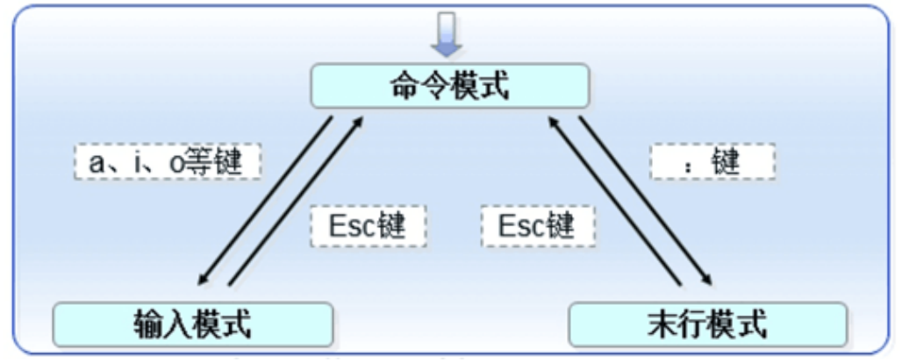
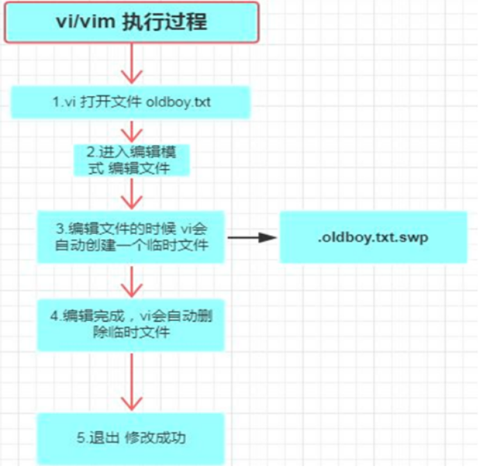

# vim编辑

## 一、什么是vim

```bash
1.可以理解为windows下面的文本编辑器,比如记事本,比如word文档。 

2.vi编辑器通常被简称为vi，而vi又是visual editor的简称。它在Linux上的地位就像Edit程序在DOS上 一样。它可以执行输出、删除、查找、替换、块操作等众多文本操作，而且用户可以根据自己的需要对其进行 定制，这是其他编辑程序所没有的。

3.vi 编辑器并不是一个排版程序，它不像Word或WPS那样可以对字体、格式、段落等其他属性进行编排，它只 是一个文本编辑程序。没有菜单，只有命令，且命令繁多。
```


## 二、为什么要用vim

```bash
1.编辑文件
2.修改配置
3.写脚本
```


## 三、vi和vim的区别

### 1、搜索不同

```bash
1、Vi：Vi不支持正则表达式的搜索。

2、Vim：Vim支持正则表达式的搜索
```


### 2、脚本语言不同

```bash
1、Vi：Vi没有自己的脚本语言，只是在Unix及Linux系统下进行编辑的工具。

2、Vim：Vim有自己的脚本语言，称为Vim脚本（也称为vimscript或VimL），用户可以通过多种方式使用它来增强Vim。
```


### 3、共享不同

```bash
1、Vi：Vi不具有高度可配置性，无法和各个Vi安装之间共享文件。

2、Vim：Vim具有高度可配置性，包含Vim核心全局设置（称为vimrc）的文件可以在各个Vim安装之间共享。
```

## 四、用法格式

```bash
vim [option] [file]
vim [选项] [文件]
```

## 五、参数选项

```bash
-o		#编辑多个文件，上下排列
-O		#编辑多个文件，上下排列				文本切换ctrl+ww
-r		#恢复上次异常退出的文件（.swp）
-R		#以只读的方式打开文件，但可以强制保存
-M		#以只读方式打开文件，但不可以强制保存
```

## 六、vim的三种模式

### 1、普通模式

```bash
	vim进入的默认状态，不能进行编辑输入操作，但可以用“上下左右”对光标进行移动，也可以执行一些操作命令（光标移动、搜索、复制、粘贴、删除）
```

### 2、编辑模式

```bash
可进行编辑输入操作
```

### 3、命令模式

```bash
可执行保存、退出、搜索、替换、显示行号等操作
```

### 4、三种模式的转换



#### 1.普通模式---》编辑模式

>i，I，o，O，a，A，r,R,s,S

```bash
a：进入插入模式并在光标之后进行添加。 
i：进入插入模式并在光标之前进行插入。 
o：进入插入模式并在当前（光标所在）行之下开启新的一行。
```

#### 2.编辑模式---》普通模式

```bash
Esc
```

#### 3.普通模式---》命令模式

```bash
:,/,?
```

#### 4.命令模式---》普通模式

```bash
Esc
```

### 5、vim的命令选项

#### 1.普通模式

##### 1）对光标的移动操作

```bash
G或（shift+g）	#将光标移动到文件的最后一行行首
gg或1gg或1G		#将光标移动到文件第一行行首
0				#数字0，将光标移动到当前所在行的行首
$				#将光标移动到当前所在行的行尾
shift+(			#将光标移动到第一行行首
shift+)			#将光标移动到最后一行行尾
n+回车			#从当前行向下移动n行
ngg				#移动到第n行
H				#光标移动到当前窗口最上方那一行
M				#光标移动到当前窗口中间那一行
L				#光标移动到当前窗口最下方那一行
```

##### 2）复制、粘贴、删除

```bash
yy				#复制光标所在行
nyy				#复制光标向下n行
p(np)			#在光标下一行粘贴，n表示复制次数
P(nP)			#在光标上一行粘贴，n表示复制次数
dd				#删除光标所在行
ndd				#光标开始向下删除n行
u				#恢复前一个执行操作
.				#重复前一个执行过程				
x				#向后删除字符
X				#向前删除字符
d1G				#删除当前行到第一行
dG				#删除当前行到最后一行
d0				#删除当前光标到行首
d$				#删除当前光标到行尾
```

##### 3）进入编辑模式

```bash
i				#在光标所在位置插入文字
a				#在光标后插入文字
I				#在当前行首插入文字
A				#在当前行尾插入文字
O				#在当前所在行的上一行插入新一行
o				#在当前所在行的下一行插入新一行
Esc				#退出编辑模式，回到命令模式中
```

#### 2.命令行模式

##### 1）退出命令

```bash
:wq				#退出并保存
:wq!			#退出并强制保存
:q!				#强制退出，不保存
```

##### 2）显示文本设置

```bash
:set nu			#显示行号
:set nonu		#取消行号
:set ic			#不区分大小写
:set ai			#自动缩进
/xxx			#从光标开始向下寻找xxx字符串
?xxx			#从光标开始向上寻找xxx字符串
n			#光标往下一个xxx字符串跳
N			#光标往上一个xxx字符串跳
:noh			#取消高亮显示
:a,b w /root/aaa.txt		#将当前文档a到b行写入文件aaa.txt
:r 文件地址		#读某个文件到当前光标后
```

##### 3）替换

###### ①全文替换

```bash
:%s/被替换内容/替换内容/g
	%	包含所有行
	s	替换
	g	包含一行所有内容
```

###### ②第a行到第b行之间进行替换

```bash
:a,b s/被替换内容/替换内容/g
```

###### ③第n行之前的进行替换（默认从第一行开始）

```bash
:,n s/被替换内容/替换内容/g
```

###### ④第n行到最后进行替换

```bash
:n,$ s/被替换内容/替换内容/g
```

###### ⑤替换单行内容

```bash
:n s/被替换内容/替换内容/g
```

#### 3.可视块模式ctrl+v（在光标处方向键选定区块）

```bash
i+#+Esc+Esc			#一次性注释多行，#可以替换成别的比如Tab批量缩进
Del					#删除所选内容
r					#替换所选内容
```

## 七、vim执行过程



### 1、vim非正常退出

#### 1.模拟故障

```bash
编辑文件的时候断开连接即可（断网或断电）
重新连接服务器
再次进行编辑文件
```

#### 2.重新编辑故障报错

```bash
Found a swap file by the name ".vim.log.swp"
 Swap file ".vim.log.swp" already exists
```


#### 3.故障恢复

```bash
vim -r 文件名
直接编辑e
退出q
恢复r
删除交换文件d
```


# 其他编辑命令

## 一、diff

>对照文件查找不同

### 1、语法格式

```bash
diff	[ption]	[file1]	[file2]
```


### 2、参数选项

```bash
-y			#以并列的方式显示文件的同异处
-c			#使用上下文的输出格式
-W			#在使用-y参数时，设置比较宽度
-u			#使用统一的格式输出
	
##演示
	diff -u	文本1 文本2 > 文本3   #以文本2为准做文本1的补丁文件
```


## 二、vimdiff

> 对照编辑多个文本，提示不同的地方

>ctrl+ww切换

### 1、语法格式

```bash
vimdiff		[option]	[file1]	[file2]
```


# vim练习题


```bash
Vim练习题一 
1) 使用vi编辑器编辑文件/1.txt进入编辑模式写入内容“hello world” 
2) 进入命令行模式复制改行内容，在下方粘贴80行 
3) 快速移动光标到文件的最后一行 
4) 快速移动光标到当前屏幕的中间一行 
5) 快速移动光标到文件的第五行 
6) 在下方插入新的一行内容“welcome to beijing” 
7) 删除刚插入的一行 
8) 撤销上一步的操作 
9) 进入扩展模式，执行文件的保存退出操作 
10) 修改相应文件，内容如下
```

```bash
#Vim练习题二 
1.将/etc/passwd 复制到/root/目录下，并重命名为test.txt 2.用vim打开test.txt并显示行号 
3.分别向下、向右、向左、向右移动5个字符，分别向下、向上翻两页 
4.把光标移动到第10行，让光标移动到行末，再移动到行首，移动到test.txt文件的最后一行，移动到文件 的首行 
5.搜索文件中出现的 root 并数一下一共出现多少个 
6.把从第一行到第三行出现的root 替换成admin，然后还原上一步操作 
8.把整个文件中所有的root替换成admin 
9.把光标移动到20行，删除本行，还原上一步操作 
11.删除从5行到10行的所有内容，还原上一步操作 
12.复制2行并粘贴到11行下面，还原上一步操作（按两次u） 
13.复制从11行到15行的内容并粘贴到8行上面，还原上一步操作（按两次u） 
14.把13行到18行的内容移动文件的尾部，还原上一步操作（按两次u） 
15.将文件中所有的/sbin/nologin为/bin/bash 16.在第一行下面插入新的一行，并输入"# Hello!" 17.保存文档并退出
```

```bash
#Vim练习题三 根据文件回答下列习题 
[root@xxx ~]# cat proxy.conf 
server { 
Listen 8080; 
Server_Name vim.OldboyEDU.com; 
location / { 
proxy_pass http://127.0.0.1:8080; 
proxy_set_header Host $http_host; 
proxy_set_header X-Forward-for; 
proxy_intercept_errors on; 
proxy_next_upstream error timeout; 
proxy_next_upstream_timeout 3s; 
proxy_next_upstream_tries 2; 
error_page 500 502 403 404 = /proxy_error.html; 
}
location = /proxy_error.html { 
root /code/proxy; 
}
}


1.使用vim打开proxy.conf文件 
2.修改Listen为listen小写，并将8080修改为80 
3.修改Server_Name为server_name小写。 
4.修改vim.OldboyEDU.com为vim.oldboy.com 
5.在server_name行下插入一行 root /code; 
6.复制5-14行的内容，然后将其粘贴到14行下面 
7.删除与proxy_set_header相关的两行全部删除 
8.如上操作完成后，在13-20行前面加上#号 
9.删除21-23的行，然后保存当前文件
```

