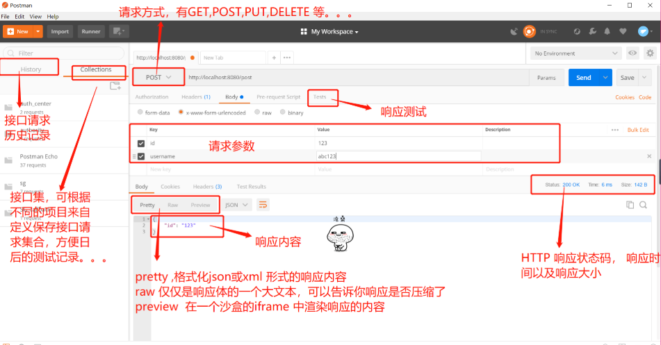

# HTTP协议

## 一、HTTP协议

### 1.什么是http

```bash
HTTP 全称：Hyper Text Transfer Protocol 
中文名：超文本传输协议

是一种按照URL指示，将超文本文档从一台主机(Web服务器)传输到另一台主机(浏览器)的应用层协议，以实现超链接的功能。

http协议就是将用户的请求发送到服务器，再将服务器返回的内容传输给浏览器，浏览器进行解析，解析成便于人类读取的页面
```

### 2.什么是超文本

```bash
包含有超链接(Link)和各种多媒体元素标记(Markup)的文本。这些超文本文件彼此链接，形成网状(Web)，因此又被称为网页(Web Page)。

这些链接使用URL表示。最常见的超文本格式是超文本标记语言HTML。
```

### 3.什么是URL

```bash
URL即统一资源定位符(Uniform Resource Locator)，用来唯一地标识万维网中的某一个文档。
URL由协议、主机和端口(默认为80)以及文件名三部分构成:

#当我们访问    baidu.com
#实际上我们访问的是	http://www.baidu.com:80/index.html

#URL:		http://www.baidu.com:80/index.html
#协议：		http://    https://   ftp://  ssh://  file://
#域名：		www.baidu.com
#端口：		:80		web服务的端口
#请求的文件：		/index.html		/ 指的不是根目录，而是站点目录，我们可以自己指定

http 和 url 和 html 的关系
一个完整的html是由很多个URL组成的，而http是将html的内容进行传输和解析的
```


## 二、HTTP协议原理


### 1.文字描述（正常）

```bash
1.首先，当你在浏览器中输入一个网址的时候（https://www.baidu.com/s?ie=utf-8&f=8&rsv_bp=1&rsv_idx=1&tn=baidu&wd=%E6%9B%BE%E8%80%81%E6%B9%BF&rsv_pq=c177c4df0026ba3e&rsv_t=e001VxO8FQ8I6s1o1i0km8IYEX2%2F7PwwkwTB6FC%2FXU9Mmwz24Z4i%2BnYoP0I&rqlang=cn&rsv_enter=1&rsv_dl=tb&rsv_sug2=0&inputT=1729&rsv_sug4=1728）浏览器会帮你分析，你输入的这个URL

2.其次，浏览器会向DNS服务器请求解析，该URL中的域名www.baidu.com,解析出百度服务器所在的IP地址
3.DNS服务器，会将解析出来的IP地址110.111.112.113并返回给浏览器。
4.浏览器接收到DNS返回的IP地址，立即与该IP所在的服务器建立TCP连接（80端口）。
5.浏览器请求文档，也就是咱们常说的html页面，GET /index.html，并发出HTTP请求报文。
6.服务器给出响应，将请求的index.html文档返回给浏览器，也就是响应HTTP请求的报文。
7.TCP连接响应完之后，释放TCP连接。
8.最后就能显示出，你请求的这个页面了
```

### 2.文字描述（不正常版）

```bash
单身狗刘大哥：浏览器饰
中介大哥：DNS饰
小姐姐照片：URL饰
小姐姐：服务器饰

1.首先作为单身狗的浏览器，在拿到一个URL（小姐姐照片）之后，先分析（意淫）...身材，脸蛋emmmmm...不可描述。
2.然后找到DNS（中介大哥），哥，你把这个小姐姐的,电话，微信，QQ...发给我呗
3.DNS（中介大哥），开始找，这个小姐姐的信息...找到手机号110.111.112.113返回给这个姓刘的单身狗（浏览器）
4.刘大哥拿到手机号之后，欣喜若狂，于是就开始打电话（建立TCP连接）给小姐姐。
5.刘大哥，打电话，给小姐姐，发出邀约请求（HTTP请求报文，GET /index.html）我们见一面吧，电影院，公园，酒店...都可以。
6.小姐姐，回应刘大哥的请求，（HTTP响应报文）现在是大夏天的公园热，电影院又黑，我怕黑...那就酒店见吧，你开好房间等我。
7.挂掉电话，（释放TCP连接）
8.刘大哥和小姐姐，在酒店见面，关好门，拉上窗帘，掀开被子，在床上，进入被窝，刘大哥掏出.........自己的手表，你看我的手表是夜光的（显示html页面）...活该单身
```


## 三、访问网站分析

### 1.请求过程中是以报文的形式

```bash
#报文的内容
1.GET那一部分内容被称为：请求头信息
2.GET和HTTP之间有一个空行被称为：请求空行
3.HTTP中的信息被称为：回应信息
4.HTTP与faa之间也有个空行被称为：响应空行
5.faa部分被称为：主体

#请求头信息
> GET / HTTP/1.1
> User-Agent: curl/7.29.0
> Host: baidu.com
> Accept: */*
> 											#请求空行
#回应信息
< HTTP/1.1 200 OK
< Date: Wed, 25 Nov 2020 07:53:15 GMT
< Server: Apache
< Last-Modified: Tue, 12 Jan 2010 13:48:00 GMT
< ETag: "51-47cf7e6ee8400"
< Accept-Ranges: bytes
< Content-Length: 81
< Cache-Control: max-age=86400
< Expires: Thu, 26 Nov 2020 07:53:15 GMT
< Connection: Keep-Alive
< Content-Type: text/html
<											#响应空行 
#主体
<html>
<meta http-equiv="refresh" content="0;url=http://www.baidu.com/">
</html>

```


### 2.基本信息 General

```bash
#请求的URL
Request URL: http://10.0.0.7/index.html
#请求的方式
Request Method: GET
#请求的状态码
Status Code: 304 Not Modified
#请求的服务器远端地址
Remote Address: 10.0.0.7:80
#仅当协议降级（如HTTPS页面引入HTTP资源）时不发送Referrer信息。
Referrer Policy: no-referrer-when-downgrade
```

### 3.响应头部 Response Headers

```bash
#此字段的值表示可用于定义范围的单位。
Accept-Ranges: bytes
#响应过程保持长连接
Connection: Keep-Alive
#响应数据的长度
Content-Length: 2633
#响应数据的类型
Content-Type: text/html; charset=UTF-8
#响应日期
Date: Wed, 25 Nov 2020 02:17:24 GMT
#缓存文件的唯一标识符，决定走不走缓存
ETag: "a49-56b5ce607fe00"
#长连接保持的设置
Keep-Alive: timeout=5, max=100
#记录文件最后的修改时间，决定走不走缓存
Last-Modified: Fri, 04 May 2018 08:13:44 GMT
#服务器上的服务
Server: Apache/2.4.6 (CentOS) PHP/7.1.31
```

### 4.请求头部 Request Headers

```bash
#请求的文件类型
Accept: text/html,application/xhtml+xml,application/xml;q=0.9,image/webp,image/apng,*/*;q=0.8,application/signed-exchange;v=b3;q=0.9
#请求过程支持的操作
Accept-Encoding: gzip, deflate
#请求过程支持的语言
Accept-Language: zh-CN,zh;q=0.9
#缓存控制，没有缓存
Cache-Control: no-cache
#请求过程保持长连接
Connection: keep-alive
#请求的主机地址
Host: 10.0.0.7
#缓存
Pragma: no-cache
#支持HTTPS请求加密
Upgrade-Insecure-Requests: 1
#客户端信息
User-Agent: Mozilla/5.0 (Windows NT 10.0; Win64; x64) AppleWebKit/537.36 (KHTML, like Gecko) Chrome/84.0.4147.89 Safari/537.36

#上一个访问的页面
Referer: https://www.baidu.com/s?ie=utf-8&f=3&rsv_bp=1&rsv_idx=1&tn=21002492_6_hao_pg&wd=referrer%20policy%E7%9A%84%E4%BD%9C%E7%94%A8&fenlei=256&rsv_pq=f6327f9600103da8&rsv_t=0dd6yhBdiQtZKV0vyvegADd9t%2Fl1BgoNxl%2Fh83mkRag0wa9eAOov9qXH9pbh8hpfXBO%2BAiUEhmA&rqlang=cn&rsv_enter=1&rsv_dl=ts_0&rsv_sug3=2&rsv_sug1=2&rsv_sug7=101&rsv_sug2=1&rsv_btype=i&prefixsug=Referrer%2520Policy&rsp=0&inputT=1290&rsv_sug4=1344
```


## 四、HTTP请求方法

```bash
在HTTP请求报文中的方法(Method)，是对所请求对象所进行的操作，也就是一些命令。请求报文中的操作有
```

| 方法(Method) | 含义                               |
| ------------ | ---------------------------------- |
| GET          | 请求读取一个Web页面                |
| POST         | 上传一个文件 (如Web页面)           |
| DELETE       | 删除Web页面                        |
| CONNECT      | 用于代理服务器                     |
| HEAD         | 请求读取一个Web页面的头部          |
| PUT          | 请求修改一个Web页面                |
| TRACE        | 用于测试，要求服务器送回收到的请求 |
| OPTION       | 查询特定选项                       |

### HTTP协议版本

```bash
HTTP/1.0		#短连接
HTTP/1.1		#长连接
HTTP/2.0		#长连接
HTTP/3.0
```




## 五、HTTP响应方法

```bash
状态码（status-code）是响应报文状态行中包含的一个3位数字，指明特定的请求是否被满足，如果没有满足，原因是什么。状态码分为以下五类：

#趣味图解
https://www.sohu.com/a/278045231_120014184
```


- 301—永久移动。被请求的资源已被永久移动位置；
- 302—请求的资源现在临时从不同的 URI 响应请求；
- 305—使用代理。被请求的资源必须通过指定的代理才能被访问；
- 307—临时跳转。被请求的资源在临时从不同的URL响应请求；
- 400—错误请求；
- 402—需要付款。该状态码是为了将来可能的需求而预留的，用于一些数字货币或者是微支付；
- 403—禁止访问。服务器已经理解请求，但是拒绝执行它；
- 404—找不到对象。请求失败，资源不存在；
- 406—不可接受的。请求的资源的内容特性无法满足请求头中的条件，因而无法生成响应实体；


- 408—请求超时；
- 409—冲突。由于和被请求的资源的当前状态之间存在冲突，请求无法完成；
- 410—遗失的。被请求的资源在服务器上已经不再可用，而且没有任何已知的转发地址；
- 413—响应实体太大。服务器拒绝处理当前请求，请求超过服务器所能处理和允许的最大值。
- 417—期望失败。在请求头 Expect 中指定的预期内容无法被服务器满足；
- 418—我是一个茶壶。超文本咖啡罐控制协议，但是并没有被实际的HTTP服务器实现；
- 420—方法失效。
- 422—不可处理的实体。请求格式正确，但是由于含有语义错误，无法响应；
- 500—服务器内部错误。服务器遇到了一个未曾预料的状况，导致了它无法完成对请求的处理；

| 状态码 | 含义                 |
| ------ | -------------------- |
| 200    | 成功                 |
| 301    | 永久重定向（跳转）   |
| 302    | 临时重定向（跳转）   |
| 304    | 本地缓存             |
| 307    | 内部重定向（跳转）   |
| 400    | 客户端错误           |
| 401    | 认证失败             |
| 403    | 找不到主页，权限不足 |
| 404    | 找不到页面           |
| 500    | 内部错误             |
| 502    | 找不到后端主机       |
| 503    | 服务器过载           |
| 504    | 后端主机超时         |


## 六、请求头部信息

| 头（header）                  | 类型 | 说明                                                  |
| ----------------------------- | ---- | ----------------------------------------------------- |
| User-  Agent（用户 -代理）    | 请求 | 关于浏览器和它平台的信息，如Mozilla5.0                |
| Accept （接受）               | 请求 | 客户能处理的页面类型，如text/html                     |
| Accept-Charset（接受字符集）  | 请求 | 客户可以接受的字符集，如Unicode-1-1                   |
| Accept-Encoding（接受编码）   | 请求 | 客户能处理的页码编码方法，如gzip                      |
| Accept-Languge（接受语言）    | 请求 | 客户能处理的自然语言，如en（英语），zh-cn（简体中文） |
| Host（主机）                  | 请求 | 服务器的DNS名称。从URL中提取出来，必须。              |
| Referer（推荐人）             | 请求 | 用户从该URL代表的页面出发访问当前请求的页面           |
| Cookie                        | 请求 | 将以前设置的Cookie送回服务器，可用来作为会话信息      |
| Date （时间）                 | 双向 | 消息被发送时候的日期和时间                            |
| Server（服务）                | 响应 | 关于服务器的信息，如Microsoft-llS/6.0                 |
| Content-Encoding（内容编码）  | 响应 | 内容是如何被编码的（如gzip）                          |
| Content-Language（内容语言）  | 响应 | 页面所使用的自然语言                                  |
| Content-Length（内容长度）    | 响应 | 以字节计算的页面长度                                  |
| Content-Type（内容类型）      | 响应 | 页面的MIME类型                                        |
| Last-Modified（上次修改时间） | 响应 | 页面最后被修改的时间和日期                            |
| Location（位置）              | 响应 | 指示用户将请求发送给别处，即重定向到另一个URL         |
| Set-Cookie                    | 响应 | 服务器希望客户保存的一个Cookie                        |


## 七、HTTP请求流程总结

### 1.HTTP访问流程图


### 2.原理

```bash
1.用输入域名 - > 浏览器跳转 - > 浏览器缓存 - > Hosts文件 - > DNS解析（递归查询|迭代查询）
    客户端向服务端发起查询 - > 递归查询
    服务端向服务端发起查询 - > 迭代查询
2.由浏览器向服务器发起TCP连接（三次握手）
    客户端     -->请求包连接 -syn=1 seq=x           服务端
    服务端     -->响应客户端syn=1 ack=x+1 seq=y     客户端
    客户端     -->建立连接 ack=y+1 seq=x+1          服务端
3.客户端发起http请求：
    1）请求的方法是什么:     GET获取
    2）请求的Host主机是:     blog.driverzeng.com
    3）请求的资源是什么:     /index.html
    4）请求的端端口是什么:    默认http是80 https是443
    5）请求携带的参数是什么:   属性（请求类型、压缩、认证、浏览器信息、等等）
    6）请求最后的空行
4.服务端响应的内容是
    1）服务端响应使用WEB服务软件
    2）服务端响应请求文件类型
    3）服务端响应请求的文件是否进行压缩
    4）服务端响应请求的主机是否进行长连接
5.客户端向服务端发起TCP断开（四次挥手）
    客户端     --> 断开请求 fin=1 seq=x          -->    服务端
    服务端     --> 响应断开 fin=1 ack=x+1 seq=y  -->    客户端
    服务端     --> 断开连接 fin=1 ack=x+1 seq=z  -->    客户端
    客户端     --> 确认断开 fin=1 ack=x+1 seq=sj -->    服务端
```

### 3.用户访问集群架构的流程

```bash
1.客户端发起http请求，请求会先抵达前端的防火墙
2.防火墙识别用户身份，正常的请求通过内部交换机通过tcp连接后端的负载均衡，传递用户的http请求
3.负载接收到请求，会根据请求的内容进行下发任务，通过tcp连接后端的web，转发发用户的http请求
4.web接收到用户的http请求后，会根据用户请求的内容进行解析，解析分为如下：
    静态请求:web直接返回给负载均衡->防火墙->用户
    动态请求:web向后端的动态程序建立TCP连接，将用户的动态http请求传递至动态程序->由动态程序进行解析
5.动态程序在解析的过程中，如果碰到查询数据库请求，则优先与缓存建立tcp连接，并发起数据查询操作。
6.如果缓存没有对应的数据，动态程序再次向数据库建立tcp连接，并发起查询操作。
7.最后数据由, 数据库->动态程序->缓存->web服务->负载均衡->防火墙->用户。
```


## 八、http相关术语

### 1.pv,uv,ip

```bash
假设公司有一座大厦，大厦有100人，每个人有一台电脑和一部手机，上网都是通过nat转换出口，每个人点击网站2次, 请问对应的pv,uv,ip分别是多少？

 PV : 页面独立浏览量
 UV : 独立设备
 IP : 独立IP

那么上面的题：
PV： 100*2*2 = 400
UV： 1002*2 = 200
IP： 1

日PV千万量级并不大
```

### 2.SOA松耦合架构

```bash
面向服务的架构（SOA）是一个组件模型，它将应用程序的不同功能单元（称为服务）进行拆分，并通过这些服务之间定义良好的接口和契约联系起来。接口是采用中立的方式进行定义的，它应该独立于实现服务的硬件平台、操作系统和编程语言。这使得构建在各种各样的系统中的服务可以以一种统一和通用的方式进行交互。

#一个电商公司，他的网站页面功能会有很多
    注册
    登录
    首页
    详情页
    购物车
    价格标签
    留言
    客服
    支付中心
    物流
    仓储信息
    订单相信
    图片
```


