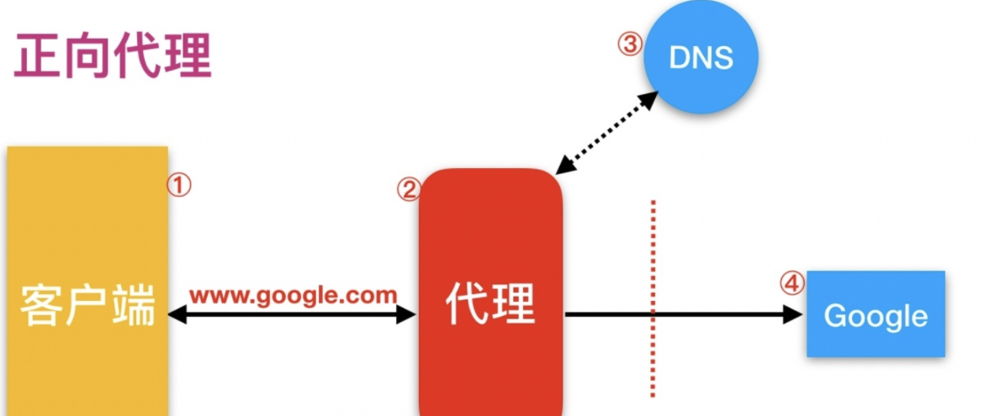
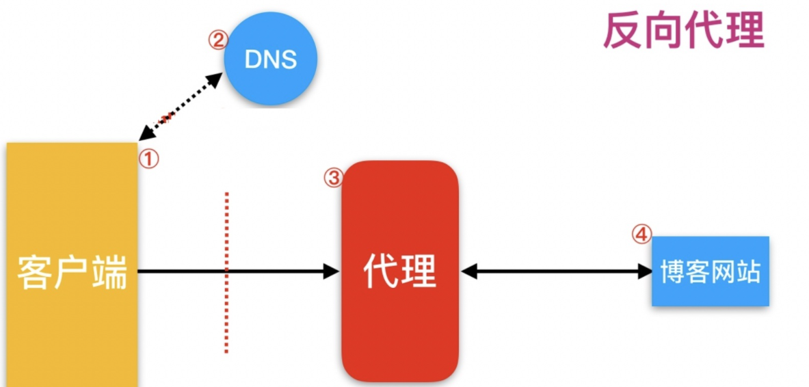
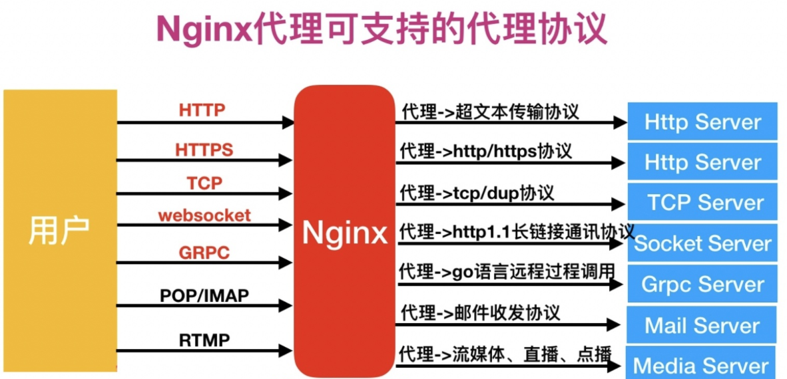
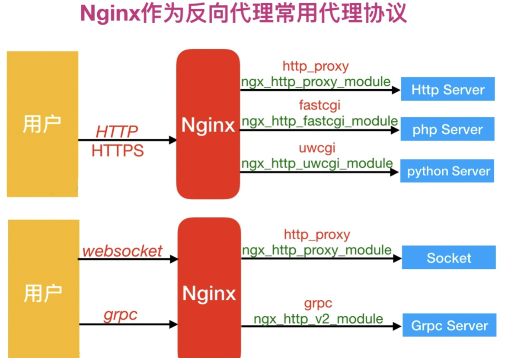

## 一、架构扩展

### 1.数据库迁移

#### 1）迁移场景

```bash
1.配置不足
2.服务器寿命到期
```

### 2.web扩展

### 3.php拆分

#### 1）安装php

```bash
[root@web03 ~]# rz
[root@web03 ~]# ll
-rw-r--r--  1 root root 19889622 Nov 22 15:52 php.tar.gz
[root@web03 ~]# tar xf php.tar.gz 
[root@web03 ~]# yum localinstall -y *.rpm
```

#### 2）配置php

```bash
[root@web03 ~]# vim /etc/php-fpm.d/www.conf
user = www
group = www
[root@web03 ~]# vim /etc/php.ini
upload_max_filesize = 200M
post_max_size = 200M
```

#### 3）创建用户

```bash
[root@web03 ~]# groupadd www -g 666
[root@web03 ~]# useradd www -u 666 -g 666
```

#### 4）启动

```bash
[root@web03 ~]# systemctl start php-fpm
```

#### 5）配置nginx调用远端的php

```bash
[root@web01 ~]# vim /etc/nginx/conf.d/linux.wp.com.conf 
server {
    listen 80;
    server_name linux.wp.com;

    location / {
        root /code/wordpress;
        index index.php;
    }

    location ~* \.php$ {
    	#协议代理到远端的php服务
        fastcgi_pass 172.16.1.9:9000;
        fastcgi_param SCRIPT_FILENAME /code/wordpress/$fastcgi_script_name;
        include fastcgi_params;
    }
}
```

#### 6）重启nginx访问测试

```bash
[root@web01 ~]# nginx -t
nginx: the configuration file /etc/nginx/nginx.conf syntax is ok
nginx: configuration file /etc/nginx/nginx.conf test is successful
[root@web01 ~]# systemctl restart nginx

访问 http://linux.wp.com/，报错为 502 连接后端失败
```

#### 7）进一步修改php配置

```bash
[root@web03 ~]# vim /etc/php-fpm.d/www.conf
listen = 172.16.1.9:9000
listen.allowed_clients = 172.16.1.7
```

#### 8）再次重启访问

```bash
[root@web03 ~]# systemctl restart php-fpm

访问 http://linux.wp.com/，报错为 File not found.
#原因：php解析文件找不到
```

#### 9）推送站点目录

```bash
[root@web01 ~]# scp -r /code 172.16.1.9:/

#授权
[root@web03 ~]# chown -R www.www /code/
```

#### 10）再次访问测试

```bash
1.访问http://linux.wp.com/，没有问题
2.登录没有问题
3.上传图片出现问题
```

#### 11）php服务器也要进行挂载

```bash
[root@web03 ~]# mount -t nfs 172.16.1.31:/data/wp /code/wordpress/wp-content/uploads
```

#### 12）再次写文章上传图片


## 二、代理

### 1.什么是代理

```bash
代理一词往往并不陌生, 该服务我们常常用到如(代理理财、代理租房、代理收货等等)，如下图所示
```


### 2.没有代理

```bash
在没有代理模式的情况下，客户端和Nginx服务端，都是客户端直接请求服务端，服务端直接响应客户端。
```


### 3.有代理

```bash
那么在互联网请求里面，为了安全客户端往往无法直接向服务端发起请求，就需要用到代理服务，来实现客户端和服务端通信，如下图所示
```


### 4.Nginx代理服务常见模式

```bash
Nginx作为代理服务,按照应用场景模式进行总结，代理分为
1.正向代理
2.反向代理
```

#### 1）正向代理

```bash
正向代理，(内部上网) 客户端 <—> 代理 -> 服务端
```



#### 2）反向代理

```bash
反向代理，用于公司集群架构中，客户端 -> 代理 <—> 服务端
```



#### 3）正向代理与反向代理的区别

```bash
1.区别在于形式上服务的”对象”不一样
2.正向代理代理的对象是客户端，为客户端服务
3.反向代理代理的对象是服务端，为服务端服务
```


## 三、Nginx代理服务支持协议

### 1.支持的协议



### 2.反向代理使用协议



### 3.模块总结

```bash
反向代理模式与Nginx代理模块总结如表格所示
```

| **反向代理模式**                           | **Nginx****配置模块**   |
| ------------------------------------------ | ----------------------- |
| http、websocket、https、tomcat（java程序） | ngx_http_proxy_module   |
| fastcgi（php程）                           | ngx_http_fastcgi_module |
| uwsgi（python）                            | ngx_http_uwsgi_module   |
| grpc（go程序）golang                       | ngx_http_v2_module      |


## 四、nginx代理实践

### 1.环境准备

| 主机  | IP         | 身份      |
| ----- | ---------- | --------- |
| lb01  | 10.0.0.4   | 代理      |
| web01 | 172.16.1.7 | web服务端 |

### 2.代理语法

```bash
Syntax:	proxy_pass URL;
Default:	—
Context:	location, if in location, limit_except
```

### 3.配置web01的nginx

```bash
[root@web01 ~]# vim /etc/nginx/conf.d/linux.proxy.com.conf
server {
    listen 80;
    server_name linux.proxy.com;

    location / {
        root /code/proxy;
        index index.html;
    }
}
```

### 4.web01编写一个网站

```bash
[root@web01 ~]# mkdir /code/proxy
[root@web01 ~]# echo "web01 web01 web01 wbe01 ...." > /code/proxy/index.html
[root@web01 ~]# chown -R www.www /code/
```

### 5.访问测试

```bash
1.配置hosts
10.0.0.7 linux.proxy.com

2.重启
[root@web01 ~]# systemctl restart nginx

3.访问
linux.proxy.com
```

### 6.配置代理

```bash
1.安装nginx
2.配置nginx
3.创建用户
4.配置nginx代理
[root@lb01 ~]# vim /etc/nginx/conf.d/linux.proxy.com.conf
server {
    listen 80;
    server_name linux.proxy.com;

    location / {
        proxy_pass http://172.16.1.7:80;
    }
}
```

### 7.重启代理nginx

```bash
[root@lb01 ~]# nginx -t
nginx: the configuration file /etc/nginx/nginx.conf syntax is ok
nginx: configuration file /etc/nginx/nginx.conf test is successful
[root@lb01 ~]# systemctl restart nginx
```

### 8.访问页面测试

```bash
1.配置hosts
10.0.0.4 linux.proxy.com

2.访问测试
结果：访问的页面不是我们要的内容，返回了web端第一个配置文件的内容
#原因：代理请求web服务端时，没有使用域名，使用了IP，匹配时没有匹配到server_name，所以直接返回默认的第一个配置文件
```

### 9.配置代理携带域名访问web端

```bash
[root@lb01 ~]# vim /etc/nginx/conf.d/linux.proxy.com.conf
server {
    listen 80;
    server_name linux.proxy.com;

    location / {
        proxy_pass http://172.16.1.7:80;
        proxy_set_header Host $http_host;
    }
}
```

### 10.重启后再次访问

```bash
[root@lb01 ~]# systemctl restart nginx

再次访问http://linux.proxy.com/，得到想要的内容
```


## 五、Nginx代理常用参数

### 1.添加发往后端服务器的请求头信息

```bash
Syntax:    proxy_set_header field value;
Default:    proxy_set_header Host $http_host;
            proxy_set_header Connection close;
Context:    http, server, location
 
# 用户请求的时候HOST的值是linux.proxy.com, 那么代理服务会像后端传递请求的还是linux.proxy.com
proxy_set_header Host $http_host;
# 将$remote_addr的值放进变量X-Real-IP中，$remote_addr的值为客户端的ip
proxy_set_header X-Real-IP $remote_addr;
# 客户端通过代理服务访问后端服务, 后端服务通过该变量会记录真实客户端地址
proxy_set_header X-Forwarded-For $proxy_add_x_forwarded_for;
```

### 2.代理到后端的TCP连接、响应、返回等超时时间

```bash
#nginx代理与后端服务器连接超时时间(代理连接超时)
Syntax: proxy_connect_timeout time;
Default: proxy_connect_timeout 60s;
Context: http, server, location
 
#nginx代理等待后端服务器的响应时间
Syntax:    proxy_read_timeout time;
Default:    proxy_read_timeout 60s;
Context:    http, server, location
 
#后端服务器数据回传给nginx代理超时时间
Syntax: proxy_send_timeout time;
Default: proxy_send_timeout 60s;
Context: http, server, location
```

### 3.proxy_buffer代理缓冲区

```bash
#nignx会把后端返回的内容先放到缓冲区当中，然后再返回给客户端，边收边传, 不是全部接收完再传给客户端
Syntax: proxy_buffering on | off;
Default: proxy_buffering on;
Context: http, server, location
 
#设置nginx代理保存用户头信息的缓冲区大小
Syntax: proxy_buffer_size size;
Default: proxy_buffer_size 4k|8k;
Context: http, server, location
 
#proxy_buffers 缓冲区
Syntax: proxy_buffers number size;
Default: proxy_buffers 8 4k|8k;
Context: http, server, location
```

### 4.配置代理优化文件

```bash
[root@lb01 ~]# vim /etc/nginx/proxy_params 
proxy_set_header Host $http_host;
proxy_set_header X-Real-IP $remote_addr;
proxy_set_header X-Forwarded-For $proxy_add_x_forwarded_for;
proxy_connect_timeout 10s;
proxy_read_timeout 10s;
proxy_send_timeout 10s;
proxy_buffering on;
proxy_buffer_size 8k;
proxy_buffers 8 8k;
```

### 5.代理调用优化文件

```bash
[root@lb01 ~]# vim /etc/nginx/conf.d/linux.proxy.com.conf 
server {
    listen 80;
    server_name linux.proxy.com;

    location / {
        proxy_pass http://10.0.0.7:80;
        include proxy_params;
    }
}
```


## 六、负载均衡介绍

### 1.什么是负载均衡

```bash
将请求平均的分配给后端服务器
```

### 2.为什么要使用负载均衡

```bash
当我们的Web服务器直接面向用户，往往要承载大量并发请求，单台服务器难以负荷，我使用多台Web服务器组成集群，前端使用Nginx负载均衡，将请求分散的打到我们的后端服务器集群中，实现负载的分发。那么会大大提升系统的吞吐率、请求性能、高容灾

往往我们接触的最多的是SLB(Server Load Balance)负载均衡，实现最多的也是SLB、那么SLB它的调度节点和服务节点通常是在一个地域里面。那么它在这个小的逻辑地域里面决定了他对部分服务的实时性、响应性是非常好的。

所以说当海量用户请求过来以后，它同样是请求调度节点，调度节点将用户的请求转发给后端对应的服务节点，服务节点处理完请求后在转发给调度节点，调度节点最后响应给用户节点。这样也能实现一个均衡的作用，那么Nginx则是一个典型的SLB
```


### 3.负载均衡的叫法

```bash
1.负载均衡
2.负载
3.LB
4.Load Balance
```

### 4.公有云中常见的负载均衡

```bash
1.SLB		#阿里云产品
2.LB		#青云产品
3.CLB		#腾讯云产品
4.ULB		#Ucloud产品
```

### 5.负载均衡软件

```bash
1.nginx
2.Haproxy
3.LVS
```

### 6.负载均衡类型

```bash
1.四层负载均衡
所谓四层负载均衡指的是OSI七层模型中的传输层，那么传输层Nginx已经能支持TCP/IP的控制，所以只需要对客户端的请求进行TCP/IP协议的包转发就可以实现负载均衡，那么它的好处是性能非常快、只需要底层进行应用处理，而不需要进行一些复杂的逻辑

2.七层负载均衡
七层负载均衡它是在应用层，那么它可以完成很多应用方面的协议请求，比如我们说的http应用的负载均衡，它可以实现http信息的改写、头信息的改写、安全应用规则控制、URL匹配规则控制、以及转发、rewrite等等的规则，所以在应用层的服务里面，我们可以做的内容就更多，那么Nginx则是一个典型的七层负载均衡SLB

3.四层和七层负载均衡的区别
四层负载均衡数据包在底层就进行了分发，而七层负载均衡数据包则是在最顶层进行分发、由此可以看出，七层负载均衡效率没有四负载均衡高。
但七层负载均衡更贴近于服务，如:http协议就是七层协议，我们可以用Nginx可以作会话保持，URL路径规则匹配、head头改写等等，这些是四层负载均衡无法实现的。
注意：四层负载均衡不识别域名，七层负载均衡识别域名
```


## 七、负载均衡实践

```bash
Nginx要实现负载均衡需要用到proxy_pass代理模块配置

Nginx负载均衡与Nginx代理不同地方在于，Nginx的一个location仅能代理一台服务器，而Nginx负载均衡则是将客户端请求代理转发至一组upstream虚拟服务池.
```

### 1.负载均衡模块

```bash
# ngx_http_upstream_module

#语法
Syntax:	upstream name { ... }
Default:	—
Context:	http

#例子
upstream backend {
    server backend1.example.com       weight=5;
    server backend2.example.com:8080;
    server backup1.example.com:8080   backup;
    server backup2.example.com:8080   backup;
}

server {
	... ...
    location / {
        proxy_pass http://backend;
    }
}
```

### 2.环境准备

| 主机  | IP                  | 身份      |
| ----- | ------------------- | --------- |
| lb01  | 10.0.0.4,172.16.1.4 | 负载均衡  |
| web01 | 172.16.1.7          | web服务端 |
| web02 | 172.16.1.8          | web服务端 |

### 3.web01准备站点

#### 1）配置nginx

```bash
[root@web01 ~]# vim /etc/nginx/conf.d/linux.lb.com.conf
server {
    listen 80;
    server_name linux.lb.com;
    charset utf8;

    location / {
        root /code/lb;
        index index.html;
    }
}
```

#### 2）准备网站

```bash
[root@web01 ~]# mkdir /code/lb
[root@web01 ~]# echo "我是web0111111111111" > /code/lb/index.html
[root@web01 ~]# chown -R www.www /code/
```

#### 3）配置hosts访问

```bash
[root@web01 ~]# systemctl restart nginx

10.0.0.7 linux.lb.com

访问
```


### 3.web01准备站点

#### 1）配置nginx

```bash
[root@web02 ~]# vim /etc/nginx/conf.d/linux.lb.com.conf
server {
    listen 80;
    server_name linux.lb.com;
    charset utf8;

    location / {
        root /code/lb;
        index index.html;
    }
}
```

#### 2）准备网站

```bash
[root@web02 ~]# mkdir /code/lb
[root@web02 ~]# echo "我是web0222222222222" > /code/lb/index.html
[root@web02 ~]# chown -R www.www /code/
```

#### 3）配置hosts访问

```bash
[root@web02 ~]# systemctl restart nginx

10.0.0.8 linux.lb.com

访问
```


### 4.配置负载均衡配置文件

```bash
[root@lb01 ~]# vim /etc/nginx/conf.d/linux.lb.com.conf
upstream web_group {
    server 172.16.1.7:80;
    server 172.16.1.8;
}

server {
    listen 80;
    server_name linux.lb.com;

    location / {
        proxy_pass http://web_group;
        include proxy_params;
    }
}
```

### 5.准备代理优化文件

```bash
[root@lb01 ~]# vim /etc/nginx/proxy_params 

proxy_set_header Host $http_host;
proxy_set_header X-Real-IP $remote_addr;
proxy_set_header X-Forwarded-For $proxy_add_x_forwarded_for;
proxy_connect_timeout 10s;
proxy_read_timeout 10s;
proxy_send_timeout 10s;
proxy_buffering on;
proxy_buffer_size 8k;
proxy_buffers 8 8k;
```

### 6.重启访问测试

```bash
1.重启
[root@lb01 ~]# nginx -t
nginx: the configuration file /etc/nginx/nginx.conf syntax is ok
nginx: configuration file /etc/nginx/nginx.conf test is successful
[root@lb01 ~]# systemctl restart nginx

2.配置hosts
10.0.0.4 linux.lb.com
```


