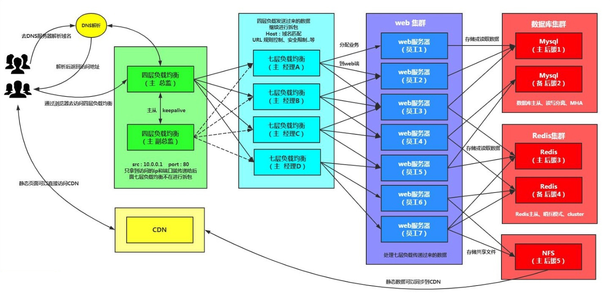

## 一、四层负载均衡

### 1.什么是四层负载均衡

```bash
	所谓四层负载均衡，也就是主要通过报文中的目标地址和端口，再加上负载均衡设备设置的服务器选择方式，决定最终选择的内部服务器。
以常见的TCP为例，负载均衡设备在接收到第一个来自客户端的SYN 请求时，选择一个最佳的服务器，并对报文中目标IP地址进行修改(改为后端服务器IP），直接转发给该服务器。TCP的连接建立，即三次握手是客户端和服务器直接建立的，负载均衡设备只是起到一个类似路由器的转发动作。在某些部署情况下，为保证服务器回包可以正确返回给负载均衡设备，在转发报文的同时可能还会对报文原来的源地址进行修改。
```

### 2.四层负载均衡使用场景

```bash
1.四层+七层来做负载均衡，四层可以保证七层的负载均衡的高可用性；
2.负载均衡可以做端口转发
3.数据库读写分离
```

**四+七大规模适用场景**



### 3.四层负载均衡特点

```bash
1.四层负载均衡仅能转发TCP/IP协议、UDP协议、通常用来转发端口，如：tcp/22、udp/53；
2.四层负载均衡可以用来解决七层负载均衡端口限制问题；（七层负载均衡最大使用65535个端口号）
3.四层负载均衡可以解决七层负载均衡高可用问题；（多台后端七层负载均衡能同时的使用）
4.四层的转发效率比七层的高得多，但仅支持tcp/ip协议，不支持http和https协议；
5.通常大并发场景通常会选择使用在七层负载前面增加四层负载均衡。
```


## 二、四层负载均衡实践

### 1.环境准备

| 主机 | IP                   | 身份         |
| ---- | -------------------- | ------------ |
| lb4  | 172.16.1.3，10.0.0.3 | 四层负载均衡 |
| lb01 | 172.16.1.4，10.0.0.4 | 七层负载均衡 |
| lb02 | 172.16.1.5，10.0.0.5 | 七层负载均衡 |

### 2.测试lb01

```bash
lb01负载均衡确认没有问题
```

### 3.lb4和lb02搭建nginx

```bash
1.配置yum源
2.安装
3.配置nginx
4.创建用户
5.启动
```

### 4.将lb01配置同步到lb02

```bash
[root@lb01 ~]# scp /etc/nginx/conf.d/* 172.16.1.5:/etc/nginx/conf.d/
[root@lb01 ~]# scp /etc/nginx/proxy_params 172.16.1.5:/etc/nginx/
```

### 5.测试lb02的负载均衡

```bash
[root@lb02 ~]# nginx -t
nginx: the configuration file /etc/nginx/nginx.conf syntax is ok
nginx: configuration file /etc/nginx/nginx.conf test is successful
[root@lb02 ~]# systemctl restart nginx

#配置hosts测试
10.0.0.5 linux.wp.com
```

### 6.配置四层负载均衡

#### 1）四层负载均衡语法

```bash
Syntax:	stream { ... }
Default:	—
Context:	main

#示例：四层负载均衡stream模块跟http模块在同一级别，不能配置在http里面
stream {
    upstream backend {
        server backend1.example.com:12345 weight=5;
        server 127.0.0.1:12345            max_fails=3 fail_timeout=30s;
    }

    server {
        listen 12345;
        proxy_connect_timeout 1s;
        proxy_timeout 3s;
        proxy_pass backend;
    }
}
```

#### 2）配置nginx主配置文件

```bash
[root@lb4 ~]# vim /etc/nginx/nginx.conf
#注释http层所有内容
user  www;
worker_processes  1;
error_log  /var/log/nginx/error.log warn;
pid        /var/run/nginx.pid;
events {
    worker_connections  1024;
}
#添加一个包含文件
include /etc/nginx/conf.c/*.conf;
#http {
#    include       /etc/nginx/mime.types;
#    default_type  application/octet-stream;
#    log_format  main  '$remote_addr - $remote_user [$time_local] "$request" '
#                      '$status $body_bytes_sent "$http_referer" '
#                      '"$http_user_agent" "$http_x_forwarded_for"';
#    access_log  /var/log/nginx/access.log  main;
#    sendfile        on;
#    #tcp_nopush     on;
#    keepalive_timeout  65;
#    #gzip  on;
#    include /etc/nginx/conf.d/*.conf;
#}
```

#### 3）配置四层负载均衡

```bash
#创建目录
[root@lb4 ~]# mkdir /etc/nginx/conf.c

#配置
[root@lb4 ~]# vim /etc/nginx/conf.c/linux.lb4.com.conf
stream {
    upstream lbserver {
        server 10.0.0.4:80;
        server 10.0.0.5:80;
    }

    server {
        listen 80;
        proxy_pass lbserver;
        proxy_connect_timeout 1s;
        proxy_timeout 3s;
    }
}
```

#### 4）启动服务

```bash
[root@lb4 ~]# nginx -t
nginx: the configuration file /etc/nginx/nginx.conf syntax is ok
nginx: configuration file /etc/nginx/nginx.conf test is successful
[root@lb4 ~]# systemctl start nginx
```

#### 5）配置hosts访问

```bash
10.0.0.3 linux.wp.com linux.lb.com

#访问
http://linux.wp.com/
```

#### 6）四层负载均衡配置日志

```bash
#四层负载均衡是没有access的日志的，因为在nginx.conf的配置中，access的日志格式是配置在http下的，而四层负载均衡配置是在http以外的；

#如果需要日志则需要配置在stream下面
[root@lb4 ~]# vim /etc/nginx/conf.c/linux.lb4.com.conf
stream {
	log_format  proxy '$remote_addr $remote_port - [$time_local] $status $protocol '
                  '"$upstream_addr" "$upstream_bytes_sent" "$upstream_connect_time"';
    access_log /var/log/nginx/proxy.log proxy;

    upstream lbserver {
        server 10.0.0.4:80;
        server 10.0.0.5:80;
    }

    server {
        listen 80;
        proxy_pass lbserver;
        proxy_connect_timeout 1s;
        proxy_timeout 3s;
    }
}

#查看所有web服务器日志
[root@web01 ~]# tail -f /var/log/nginx/access.log
[root@web02 ~]# tail -f /var/log/nginx/access.log
```


## 三、四层负载端口转发

### 1.请求负载均衡的5555端口，跳转到web01的22端口

```bash
#简单配置
stream {
	server {
        listen 5555;
        proxy_pass 172.16.1.7:22;
	}
}

#一般配置
stream {
    upstream ssh_7 {
        server 10.0.0.7:22;
    }

    server {
        listen 5555;
        proxy_pass ssh_7;
    }
}
```

### 2.请求负载均衡的6666端口，跳转至172.16.1.51:3306

```bash
stream {
    upstream db_51 {
        server 172.16.1.51:3306;
    }
    
    server {
        listen 6666;
        proxy_pass db_51;
    }
}
```

### 3.数据库从库的负载均衡

```bash
stream {
    upstream dbserver {
        server 172.16.1.51:3306;
        server 172.16.1.52:3306;
        server 172.16.1.53:3306;
        server 172.16.1.54:3306;
        server 172.16.1.55:3306;
        server 172.16.1.56:3306;
    }
    
    server {
        listen 5555;
        proxy_pass dbserver;
    }
}
```


## 四、动静分离

```bash
	动静分离，通过中间件将动态请求和静态请求进行分离；
通过中间件将动态请求和静态请求分离，可以减少不必要的请求消耗，同时能减少请求的延时。
通过中间件将动态请求和静态请求分离，逻辑图如下:
```


### 1.单台机器进行动静分离

```bash
[root@web01 ~]# vim /etc/nginx/conf.d/linux.wp.com.conf 
server {
    listen 80;
    server_name linux.wp.com;

    location / {
        root /code/wordpress;
        index index.php;
    }

    location ~* \.(jpg|png|gif)$ {
        root /code/wordpress;
    }

    location ~* \.php$ {
        fastcgi_pass 127.0.0.1:9000;
        fastcgi_param SCRIPT_FILENAME /code/wordpress/$fastcgi_script_name;
        include fastcgi_params;
    }
}
```


