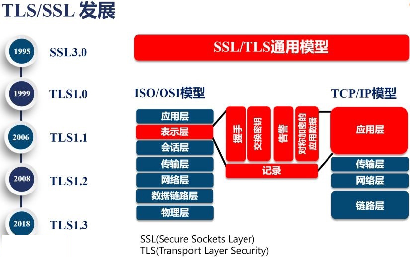
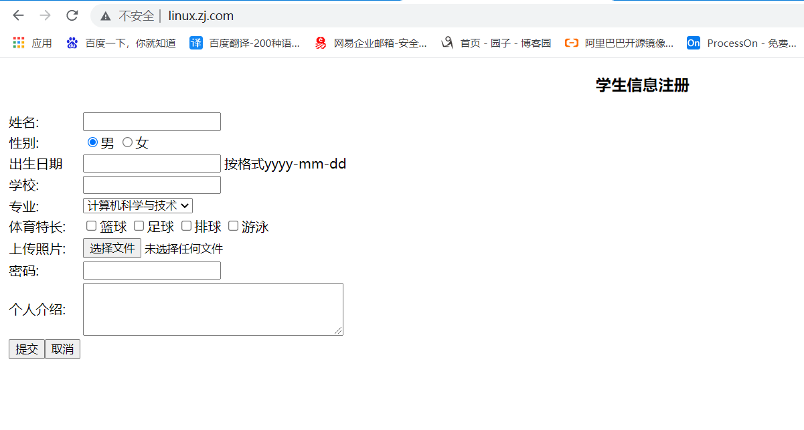
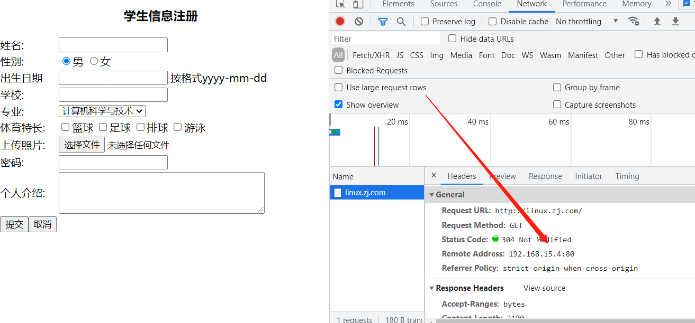
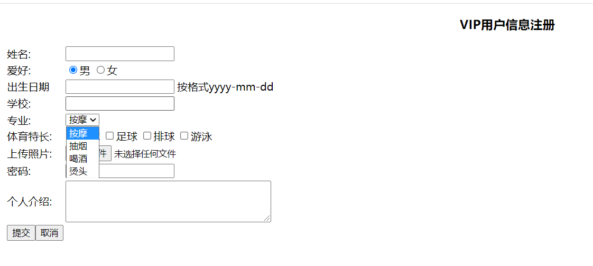
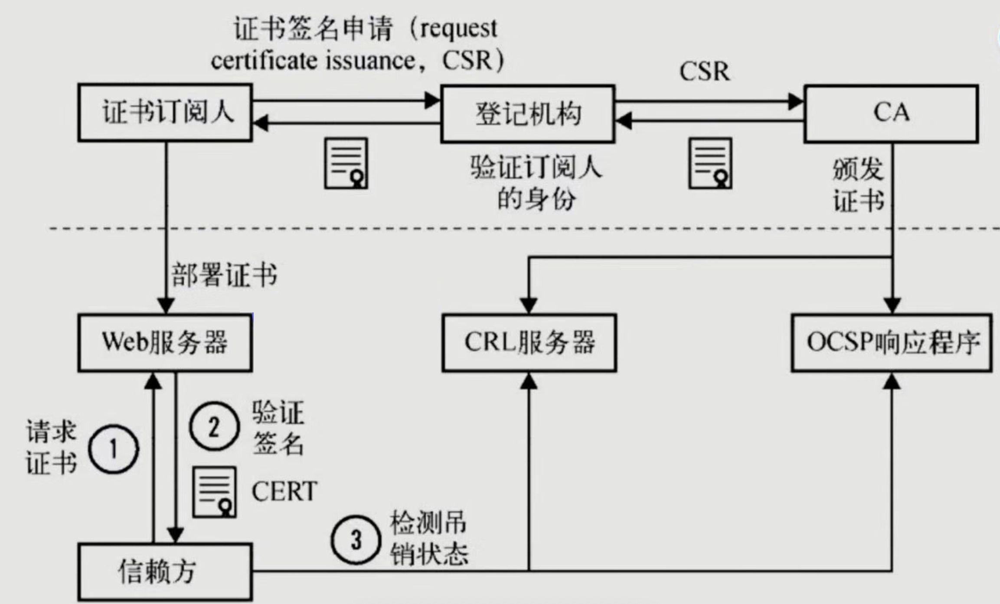
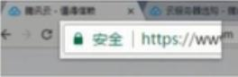
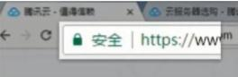
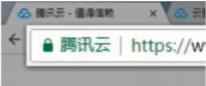

# Nginx HTTPS实战

## 一、HTTPS安全证书基本概述

### 1、为什么需要使用HTTPS

```bash
	因为HTTP不安全，当我们使用http网站时，会遭到劫持和篡改，如果采用https协议，那么数据在传输过程中是加密的，所以黑客无法窃取或者篡改数据报文信息，同时也避免网站传输时信息泄露。
```

### 2、SSL协议

```bash
	那么我们在实现https时，需要了解ssl协议，但我们现在使用的更多的是TLS加密协议。
```

### 3、TLS如何保证明文消息加密？

```bash
	那么TLS是怎么保证明文消息被加密的呢？在OSI七层模型中，应用层是http协议，那么在应用层协议之下，我们的表示层，是ssl协议所发挥作用的一层，他通过（握手、交换秘钥、告警、加密）等方式，是应用层http协议没有感知的情况下做到了数据的安全加密。
```




## 二、模拟网站劫持

### 1、配置一个正经的网站

```bash
[root@web01 /etc/nginx/conf.d]# vim /etc/nginx/conf.d/linux.zj.com.conf

server {
    listen 80;
    server_name linux.zj.com;

    location / {
        root /code;
        index index.html;
    }
}

[root@web01 /etc/nginx/conf.d]# nginx -t
nginx: the configuration file /etc/nginx/nginx.conf syntax is ok
nginx: configuration file /etc/nginx/nginx.conf test is successful
[root@web01 /etc/nginx/conf.d]# nginx -s reload
```


### 2、配置一个正经的页面

```bash
[root@web01 /code]# vim /code/index.html

       <td>按格式yyyy-mm-dd</td>
       </tr>
       <tr><td>学校:</td><td><input type="text"name="stuSchool"></td></tr>
       <tr><td>专业:</td>
           <td><select name="stuSelect2">
               <option selected>计算机科学与技术</option>
               <option>网络工程</option>
               <option>物联网工程</option>
               <option>应用数学</option>
               </select>
               </td>
               </tr>
               <tr><td>体育特长:</td>
                   <td colspan="2">
                      <input type="checkbox"name="stuCheck" >篮球
                      <input type="checkbox"name="stuCheck" >足球
                      <input type="checkbox"name="stuCheck" >排球
                      <input type="checkbox"name="stuCheck" >游泳
                   </td>
               </tr>
               <tr><td>上传照片:</td><td colspan="2"><input type="file" ></td></tr>
               <tr><td>密码:</td><td><input type="password"name="stuPwd" ></td></tr>
               <tr><td>个人介绍:</td>
                   <td colspan="2"><textarea name="Letter"rows="4"cols="40"></textarea></td>
               </tr>
               <tr>
                 <td><input type="submit"value="提交" ><input type="reset"value="取消" ></td>
                 </tr>
                 </table>
                 </form>
</body>
</html>
[root@web01 /code]# chown -R www.www /code/index.html
```

### 3、访问测试




### 4、配置劫持的网站

```bash
[root@lb01 ~]# vim /etc/nginx/conf.d/linux.zj.com.conf

server {
    listen 80;
    server_name linux.zj.com;

    location / {
        proxy_pass http://192.168.15.7:80;
        include proxy_params;
    }
}
```

```bash
[root@lb01 ~]# vim /etc/nginx/proxy_params
proxy_set_header Host $http_host;
proxy_set_header X-Real-IP $remote_addr;
proxy_set_header X-Forwarded-For $proxy_add_x_forwarded_for;
proxy_connect_timeout 10s;
proxy_read_timeout 10s;
proxy_send_timeout 10s;
proxy_buffering on;
proxy_buffer_size 8k;
proxy_buffers 8 8k;
```

### 5、篡改hosts模拟DNS劫持

```bash
192.168.15.4 linux.zj.com
```




### 6、开始篡改网站

```bash
[root@lb01 ~]# vim /etc/nginx/conf.d/linux.zj.com.conf

server {
    listen 80;
    server_name linux.zj.com;

    location / {
        proxy_pass http://192.168.15.7:80;
        include proxy_params;


        sub_filter '<title>学生信息注册页面</title>' '<title>澳门首家线上赌场</title>';
        sub_filter '<h3 align="center">学生信息注册</h3>' '<h3 align="center">VIP用户信息注册</h3>';
        sub_filter '<tr><td>性别:</td>' '<tr><td>爱好:</td>';
        sub_filter '<option selected>计算机科学与技术</option>' '<option selected>按摩</option>';
        sub_filter '<option>网络工程</option>' '<option>抽烟</option>';
        sub_filter '<option>物联网工程</option>' '<option>喝酒</option>';
        sub_filter '<option>应用数学</option>' '<option>烫头</option>';
    }
}
[root@lb01 ~]# systemctl restart nginx
```




## 三、HTTPS证书下发

### 1、CA机构

```bash
那么在数据进行加密与解密过程中，如何确定双方的身份，此时就需要有一个权威机构来验证双方身份，那么这个权威机构就是CA机构，那么CA机构又是如何颁发证书
```


### 2、证书下发流程



```bash
我们首先需要申请证书，先去登记机构进行身份登记，我是谁，我是干嘛的，我想做什么，然后登记机构再通过CSR发给CA机构，CA中心通过后会生成一堆公钥和私钥，公钥会在CA证书链中保存，公钥和私钥证书我们拿到后，会将其部署在WEB服务器上

1.当浏览器访问我们的https站点时，他会去请求我们的证书
2.Nginx这样的web服务器会将我们的公钥证书发给浏览器
3.浏览器会去验证我们的证书是否合法有效
4.CA机构会将过期的证书放置在CRL服务器，CRL服务的验证效率是非常差的，所以CA有推出了OCSP响应程序，OCSP响应程序可以查询指定的一个证书是否过期，所以浏览器可以直接查询OSCP响应程序，但OSCP响应程序性能还不是很高
5.Nginx会有一个OCSP的开关，当我们开启后，Nginx会主动上OCSP上查询，这样大量的客户端直接从Nginx获取证书是否有效
6.浏览器再次访问的时候，web服务器会将证书和验证结果一起发给浏览器，浏览器直接与我们建立连接
```

### 3、加密流程

```bash
1、浏览器发起往服务器的443端口发起请求，请求携带了浏览器支持的加密算法和哈希算法。 
2、服务器收到请求，选择浏览器支持的加密算法和哈希算法。 
3、服务器下将数字证书返回给浏览器，这里的数字证书可以是向某个可靠机构申请的，也可以是自制的。 
4、浏览器进入数字证书认证环节，这一部分是浏览器内置的TLS完成的：
	4.1 首先浏览器会从内置的证书列表中索引，找到服务器下发证书对应的机构，如果没有找到，此时就会提示用户该证书是不是由权威机构颁发，是不可信任的。如果查到了对应的机构，则取出该机构颁发的公钥。 
	4.2 用机构的证书公钥解密得到证书的内容和证书签名，内容包括网站的网址、网站的公钥、证书的有效期等。浏览器会先验证证书签名的合法性（验证过程类似上面Bob和Susan的通信）。签名通过后，浏览器验证证书记录的网址是否和当前网址是一致的，不一致会提示用户。如果网址一致会检查证书有效期，证书过期了也会提示用户。这些都通过认证时，浏览器就可以安全使用证书中的网站公钥了。 
	4.3 浏览器生成一个随机数R，并使用网站公钥对R进行加密。
5、浏览器将加密的R传送给服务器。 
6、服务器用自己的私钥解密得到R。 
7、服务器以R为密钥使用了对称加密算法加密网页内容并传输给浏览器。 
8、浏览器以R为密钥使用之前约定好的解密算法获取网页内容。
```

### 4、证书类型介绍

| 对比         | 域名型 DV                            | 企业型 OV                           | 增强型 EV                               |
| ------------ | ------------------------------------ | ----------------------------------- | --------------------------------------- |
| 绿色地址栏   | 小锁标记+https         | 小锁标记+https        | 小锁标记+企业名称+https   |
| 一般用途     | 个人站点和应用； 简单的https加密需求 | 电子商务站点和应用； 中小型企业站点 | 大型金融平台； 大型企业和政府机构站点   |
| 审核内容     | 域名所有权验证                       | 全面的企业身份验证； 域名所有权验证 | 最高等级的企业身份验证； 域名所有权验证 |
| 颁发时长     | 10分钟-24小时                        | 3-5个工作日                         | 5-7个工作日                             |
| 单次申请年限 | 1年                                  | 1-2年                               | 1-2年                                   |
| 赔付保障金   | ——                                   | 125-175万美金                       | 150-175万美金                           |

### 5、证书购买选择

```bash
1.保护单个域名 www.mumusir.com
2.保护五个域名 www images cdn test m
3.通配符域名 *.linux.com
```

### 6、HTTPS证书注意事项

```bash
1.https证书不支持续费，证书到期需要重新申请并进行替换
2.https不支持三级域名解析，如 test.m.linux.com
3.https显示绿色，说明整个网站的url都是https的
	https显示黄色，因为网站代码中包含http的不安全链接
	https显示红色，那么证书是假的或者证书过期。
```

## 四、单台HTTPS配置

### 1、检查nginx是否有ssl模块

```bash
[root@web01 ~]# nginx -V
--with-http_ssl_module
```

### 2、创建证书存放目录

```bash
[root@web01 ~]# mkdir /etc/nginx/ssl_key
[root@web01 ~]# cd /etc/nginx/ssl_key/
```

### 3、模拟CA机构签发证书

#### 1.生成私钥

```bash
#使用openssl命令充当CA权威机构创建证书（生产不使用此方式生成证书，不被互联网认可的黑户证书）
[root@web01 /etc/nginx/ssl_key]# openssl genrsa -idea -out linux.zj.com.key 2048
Generating RSA private key, 2048 bit long modulus
..+++
...............................................................................................+++
e is 65537 (0x10001)
Enter pass phrase for linux.zj.com.key:123456
Verifying - Enter pass phrase for linux.zj.com.key:123456

[root@web01 /etc/nginx/ssl_key]# ll
total 4
-rw-r--r-- 1 root root 1739 Aug 17 18:36 linux.zj.com.key
```

#### 2.生成公钥

```bash
#生成自签证书(公钥)，同时去掉私钥的密码
[root@web01 /etc/nginx/ssl_key]# openssl req -days 36500 -x509 -sha256 -nodes -newkey rsa:2048 -keyout linux.zj.com.key -out linux.zj.com.crt
Generating a 2048 bit RSA private key
.................+++
............................................+++
writing new private key to 'linux.zj.com.key'
-----
You are about to be asked to enter information that will be incorporated
into your certificate request.
What you are about to enter is what is called a Distinguished Name or a DN.
There are quite a few fields but you can leave some blank
For some fields there will be a default value,
If you enter '.', the field will be left blank.
-----
Country Name (2 letter code) [XX]:CN
State or Province Name (full name) []:shanghai
Locality Name (eg, city) [Default City]:qingpu
Organization Name (eg, company) [Default Company Ltd]:shxiaowu
Organizational Unit Name (eg, section) []:xinyuan
Common Name (eg, your name or your server's hostname) []:xiaowu
Email Address []:123@qq.com

[root@web01 /etc/nginx/ssl_key]# ll
total 8
-rw-r--r-- 1 root root 1399 Aug 17 18:39 linux.zj.com.crt
-rw-r--r-- 1 root root 1704 Aug 17 18:39 linux.zj.com.key
```

**参数介绍**

```bash
# req  --> 用于创建新的证书
# new  --> 表示创建的是新证书    
# x509 --> 表示定义证书的格式为标准格式
# key  --> 表示调用的私钥文件信息
# out  --> 表示输出证书文件信息
# days --> 表示证书的有效期
# sha256 --> 加密方式
```

### 4、配置证书语法

```bash
#1.开启证书
Syntax:	ssl on | off;
Default:	ssl off;
Context:	http, server

#2.指定证书文件
Syntax:	ssl_certificate file;
Default:	—
Context:	http, server

#3.指定私钥文件
Syntax:	ssl_certificate_key file;
Default:	—
Context:	http, server
```

### 5、配置nginx证书

```bash
[root@web01 ~]# vim /etc/nginx/conf.d/linux.zj.com.conf

server {
    listen 443 ssl;
    server_name linux.zj.com;
    ssl_certificate /etc/nginx/ssl_key/linux.zj.com.crt;
    ssl_certificate_key /etc/nginx/ssl_key/linux.zj.com.key;

    location / {
        root /code;
        index index.html;
    }
}
[root@web01 /etc/nginx/conf.d]# nginx -t
nginx: the configuration file /etc/nginx/nginx.conf syntax is ok
nginx: configuration file /etc/nginx/nginx.conf test is successful
[root@web01 /etc/nginx/conf.d]# nginx -s reload
```

### 6、配置hosts解析

```bash
192.168.15.7 linux.zj.com

访问：https://linux.zj.com/
```

### 7、配置http自动跳转https

```bash
[root@web01 ~]# vim /etc/nginx/conf.d/linux.zj.com.conf

server {
    listen 443 ssl;
    server_name linux.zj.com;
    ssl_certificate /etc/nginx/ssl_key/linux.zj.com.crt;
    ssl_certificate_key /etc/nginx/ssl_key/linux.zj.com.key;

    location / {
        root /code;
        index index.html;
    }
}

server {
    listen 80;
    server_name linux.zj.com;

    rewrite (.*) https://$server_name$1;
}
[root@web01 ~]# nginx -t
nginx: the configuration file /etc/nginx/nginx.conf syntax is ok
nginx: configuration file /etc/nginx/nginx.conf test is successful
[root@web01 ~]# nginx -s reload
```

### 8、ssl证书优化参数

```bash
server {
    listen 443 default_server;
    server_name blog.driverzeng.com driverzeng.com;
    ssl on;
    root /var/www/wordpress;
    index index.php index.html index.htm;
    ssl_certificate   ssl/215089466160853.pem;
    ssl_certificate_key  ssl/215089466160853.key;
    
    ssl_session_cache shared:SSL:10m; #在建立完ssl握手后如果断开连接，在session_timeout时间内再次连接，是不需要再次获取公钥建立握手的，可以服用之前的连接
    ssl_session_timeout 1440m;  #ssl连接断开后的超时时间
    ssl_ciphers ECDHE-RSA-AES128-GCM-SHA256:ECDHE:ECDH:AES:HIGH:!NULL:!aNULL:!MD5:!ADH:!RC4;  #配置加密套接协议
    ssl_protocols TLSv1 TLSv1.1 TLSv1.2;  #使用TLS版本协议
    ssl_prefer_server_ciphers on;  #nginx决定使用哪些协议与浏览器通信
```