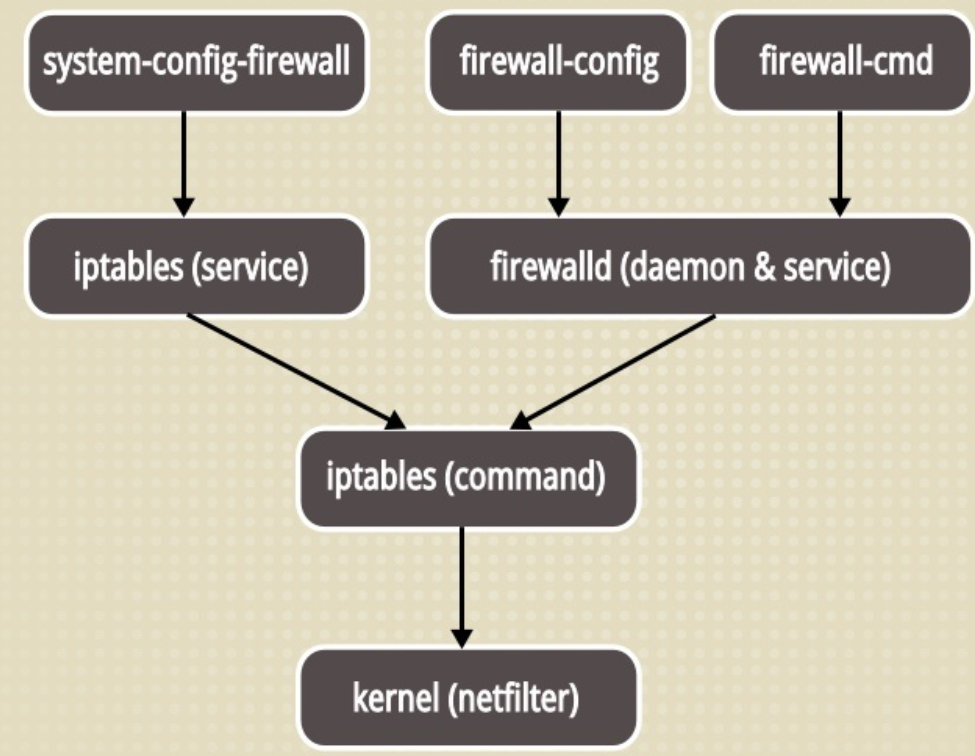
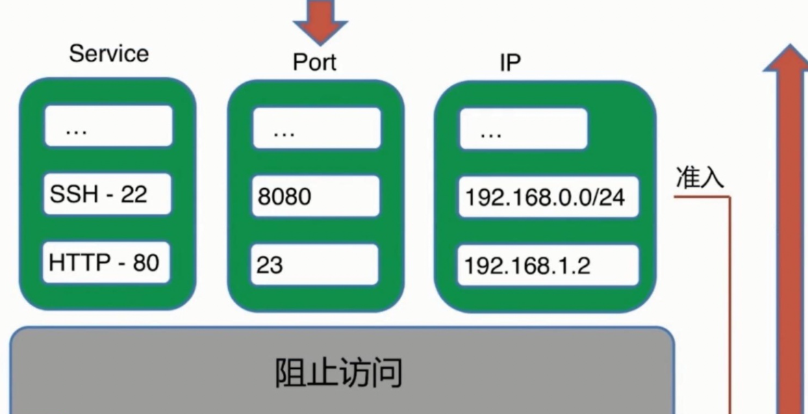
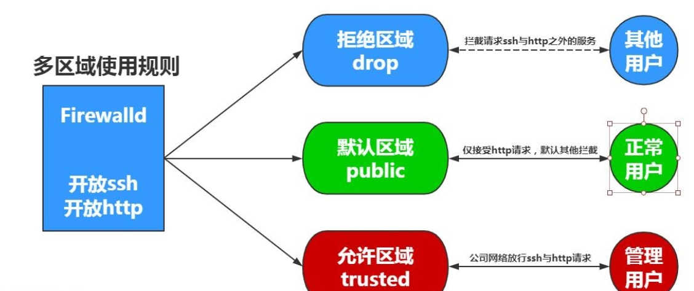
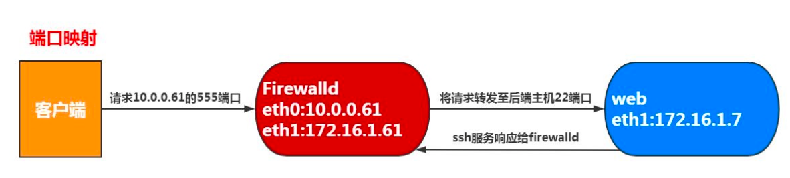
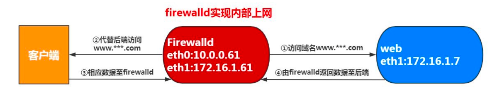

# Firewalld 防火墙

## 一、防火墙基本概述

```bash
在CentOS7系统中集成了多款防火墙管理工具，默认启用的是firewalld（动态防火墙管理器）防火墙管理工具，Firewalld支持CLI（命令行）以及GUI（图形）的两种管理方式。

对于接触Linux较早的人员对Iptables比较熟悉，但由于Iptables的规则比较的麻烦，并且对网络有一定要求，所以学习成本较高。但firewalld的学习对网络并没有那么高的要求，相对iptables来说要简单不少，所以建议刚接触CentOS7系统的人员直接学习Firewalld。
```



```bash
需要注意的是：如果开启防火墙工具，并且没有配置任何允许的规则，那么从外部访问防火墙设备默认会被阻止，但是如果直接从防火墙内部往外部流出的流量默认会被允许。

firewalld 只能做和IP/Port相关的限制，web相关的限制无法实现。
```




## 二、防火墙区域管理

```bash
那么相较于传统的Iptables防火墙，firewalld支持动态更新，并加入了区域zone的概念

简单来说，区域就是firewalld预先准备了几套防火墙策略集合（策略模板），用户可以根据不同的场景选择不同的策略模板，从而实现防火墙策略之间的快速切换
```



| 区域选项    | 默认规则策略                                                 |
| ----------- | ------------------------------------------------------------ |
| **trusted** | 允许所有的数据包流入流出                                     |
| home        | 拒绝流入的流量，除非与流出的流量相关；而如果流量与ssh、mdns、ipp-client、amba-client与dhcpv6-client服务相关，则允许流量 |
| internal    | 等同于home区域                                               |
| work        | 拒绝流入的流量，除非与流出的流量相关；而如果流量与ssh、ipp-client、dhcpv6-client服务相关，则允许流量 |
| **public**  | 拒绝流入的流量，除非与流出的流量相关；而如果流量与ssh、dhcpv6-client服务相关，则允许流量 |
| external    | 拒绝流入的流量，除非与流出的流量相关；而如果流量与ssh服务相关，则允许流量 |
| dmz         | 拒绝流入的流量，除非与流出的流量相关；而如果流量与ssh服务相关，则允许流量 |
| block       | 拒绝流入的流量，除非与流出的流量相关                         |
| **drop**    | 拒绝流入的流量，除非与流出的流量相关                         |

```bash
#必须记住的三个区域，其他的可以不记
trusted			白名单
public			默认区域
drop			黑名单
```


## 三、防火墙基本指令参数

### 1.firewall-cmd命令分类列表

| 参数                          | 作用                                                 |
| ----------------------------- | ---------------------------------------------------- |
| **zone区域相关指令**          |                                                      |
| --get-default-zone            | 获取默认的区域名称                                   |
| --set-default-zone=<区域名称> | 设置默认的区域，使其永久生效                         |
| --get-active-zones            | 显示当前正在使用的区域与网卡名称                     |
| --get-zones                   | 显示总共可用的区域                                   |
| --new-zone=                   | 新增区域                                             |
| **services服务相关命令**      |                                                      |
| --get-services                | 列出服务列表中所有可管理的服务                       |
| --add-service=                | 设置默认区域允许该填加服务的流量                     |
| --remove-service=             | 设置默认区域不允许该删除服务的流量                   |
| **Port端口相关指令**          |                                                      |
| --add-port=<端口号/协议>      | 设置默认区域允许该填加端口的流量                     |
| --remove-port=<端口号/协议>   | 置默认区域不允许该删除端口的流量                     |
| **Interface网站相关指令**     |                                                      |
| --add-interface=<网卡名称>    | 将源自该网卡的所有流量都导向某个指定区域             |
| --change-interface=<网卡名称> | 将某个网卡与区域进行关联                             |
| **source相关指令**            |                                                      |
| --add-source=<IP/子网掩码>    | 一般配置在女默认区域的富规则中或者黑白名单中         |
| --remove-source=<IP/子网掩码> |                                                      |
| **其他相关指令**              |                                                      |
| --list-all                    | 显示当前区域的网卡配置参数、资源、端口以及服务等信息 |
| --reload                      | 让“永久生效”的配置规则立即生效，并覆盖当前的配置规则 |


## 四、防火墙区域配置策略

```bash
为了能正常使用firewalld服务和相关工具去管理防火墙，必须启动firewalld服务，同时关闭以前旧的防火墙相关服务，

需要注意firewalld的规则分为两种状态：
runtime运行时: 修改规则马上生效，但如果重启服务则马上失效，测试建议。
permanent持久配置: 修改规则后需要reload重载服务才会生效，生产建议。
```

### 1.禁用与取消禁用防火墙

```bash
#禁用防火墙
[root@web01 ~]# systemctl mask iptables
Created symlink from /etc/systemd/system/iptables.service to /dev/null.

#取消禁用防火墙
[root@web01 services]# systemctl unmask iptables
Removed symlink /etc/systemd/system/iptables.service
```

### 2.操作防火墙

```bash
[root@web01 ~]# systemctl start firewalld
[root@web01 ~]# systemctl enable firewalld
[root@web01 ~]# systemctl stop firewalld

#重载防火墙配种或清理临时的防火墙配置
[root@web01 ~]# firewalld-cmd --reload
```

### 3.firewalld常用命令

#### 1）查看默认使用的区域

```bash
[root@web01 ~]# firewall-cmd --get-default-zone 
public
```

#### 2）查看默认区域的规则

```bash
[root@web01 ~]# firewall-cmd --list-all
public (active)
  target: default
  icmp-block-inversion: no
  interfaces: eth0 eth1
  sources: 
  services: ssh
  ports: 
  protocols: 
  masquerade: no
  forward-ports: 
  source-ports: 
  icmp-blocks: 
  rich rules:
```

#### 3）查看指定区域的默认规则

```bash
[root@web01 ~]# firewall-cmd --list-all --zone=trusted 

trusted							#区域的名字
  target: ACCEPT				 #状态：允许
  icmp-block-inversion: no		  #icmp块设置
  interfaces: 					 #区域绑定的网卡
  sources: 						 #允许流量通过的网段
  services: 					#允许流量通过的服务
  ports: 						#允许流量通过的端口
  protocols: 					#允许流量通过的协议
  masquerade: no				#IP伪装
  forward-ports: 				#端口转发
  source-ports: 				#端口转发的来源端口
  icmp-blocks: 					  #icmp块设置
  rich rules:					#富规则
```

#### 4）查看区域是否允许某服务

```bash
[root@m01 ~]# firewall-cmd --zone=public --query-service=ssh
yes
[root@m01 ~]# firewall-cmd --zone=public --query-service=https
no
```


## 五、防火墙配置

### 1.firewalld放行服务

#### 1）firewalld放行一个服务

```bash
[root@web01 ~]# firewall-cmd --add-service=http
success
```

#### 2）firewalld放行多个服务

```bash
[root@web01 ~]# firewall-cmd --add-service={http,nginx}
success
```

#### 3）自己添加服务，配置规则

```bash
[root@web01 ~]# cp /usr/lib/firewalld/services/{http.xml,suibian.xml}
[root@web01 ~]# firewall-cmd --reload
success
[root@web01 ~]# firewall-cmd --add-service=suibian
success
```


### 2.firewalld放行端口

#### 1）firewalld放行一个端口

```bash
[root@web01 ~]# firewall-cmd --add-port=80/tcp
success
```

#### 2）firewalld放行多个端口

```bash
[root@web01 ~]# firewall-cmd --add-port={81/tcp,82/tcp}
success
```


### 3.firewalld放行网段

```bash
[root@web01 ~]# firewall-cmd --add-source=10.0.0.0/24 --zone=trusted
success
```


### 4.配置测试

```bash
#要求：使用firewalld各个区域规则结合配置，调整默认public区域拒绝所有流量，但如果来源IP是10.0.0.0/24网段则允许
1.去除配置中的规则
[root@web01 ~]# firewall-cmd --remove-service=ssh
success

2.配置允许10.0.0.0/24网段
[root@web01 ~]# firewall-cmd --add-source=10.0.0.0/24 --zone=trusted 
success
```


## 六、防火墙配置端口转发

```bash
端口转发是指传统的目标地址映射，实现外网访问内网资源

流量转发命令语法为：
firewalld-cmd --permanent --zone=<区域> --add-forward-port=port=<源端口号>:proto=<协议>:toport=<目标端口号>:toaddr=<目标IP地址>
```

### 1.端口转发实践

**实例：需要将本地的10.0.0.7:5555端口转发至172.16.1.4:22端口**

```bash
#1.添加端口转发
[root@web01 ~]# firewall-cmd --add-forward-port=port=5555:proto=tcp:toport=22:toaddr=172.16.1.4
success

#2.开启ip伪装
[root@web01 ~]# firewall-cmd --add-masquerade 
success

#3.查看防火墙配置
[root@web01 ~]# firewall-cmd --list-all
public (active)
  target: default
  icmp-block-inversion: no
  interfaces: eth0 eth1
  sources: 
  services: 
  ports: 
  protocols: 
  masquerade: yes
  forward-ports: port=5555:proto=tcp:toport=22:toaddr=172.16.1.4
  source-ports: 
  icmp-blocks: 
  rich rules: 
  
#4.测试连接
[C:\~]$ ssh 10.0.0.7 5555

Connecting to 10.0.0.7:5555...
Connection established.
To escape to local shell, press 'Ctrl+Alt+]'.

Last login: Mon Dec 14 10:59:58 2020 from 10.0.0.1
[root@lb01 ~]# 
```




## 七、防火墙富规则

```bash
firewalld中的富语言规则表示更细致，更详细的防火墙策略配置，他可以针对系统服务、端口号、原地址和目标地址等诸多信息进行更有针对性的策略配置，优先级在所有的防火墙策略中也是最高的，下面为firewalld富语言规则帮助手册
```

```bash
[root@m01 ~]# man firewall-cmd
[root@m01 ~]# man firewalld.richlanguage
    rule
         [source]
         [destination]
         service|port|protocol|icmp-block|icmp-type|masquerade|forward-port|source-port
         [log]
         [audit]
         [accept|reject|drop|mark]

rule [family="ipv4|ipv6"]
source address="address[/mask]" [invert="True"]
service name="service name"
port port="port value" protocol="tcp|udp"
protocol value="protocol value"
forward-port port="port value" protocol="tcp|udp" to-port="port value" to-addr="address"
accept | reject [type="reject type"] | drop

#富语言规则相关命令
--add-rich-rule='<RULE>'        #在指定的区域添加一条富语言规则
--remove-rich-rule='<RULE>'     #在指定的区删除一条富语言规则

--query-rich-rule='<RULE>'      #找到规则返回0，找不到返回1
--list-rich-rules               #列出指定区里的所有富语言规则
```

### 1.实例一

**允许10.0.0.1主机能够访问http服务，允许172.16.1.0/24能访问111端口**

```bash
[root@web01 ~]# firewall-cmd --add-rich-rule='rule family=ipv4 source address=10.0.0.1 service name=http accept'
success

[root@web01 ~]# firewall-cmd --add-rich-rule='rule family=ipv4 source address=172.16.1.0/24 port port=111 protocol=tcp accept'
success

[root@web01 ~]# firewall-cmd --list-all
public (active)
  target: default
  icmp-block-inversion: no
  interfaces: eth0 eth1
  sources: 
  services: ssh
  ports: 
  protocols: 
  masquerade: no
  forward-ports: 
  source-ports: 
  icmp-blocks: 
  rich rules: 
	rule family="ipv4" source address="10.0.0.1" service name="http" accept
	rule family="ipv4" source address="172.16.1.0/24" port port="111" protocol="tcp" accept
```

### 2.实例二

**默认public区域对外开放所有人能通过ssh服务连接，但拒绝172.16.1.0/24网段通过ssh连接服务器**

```bash
[root@web01 ~]# firewall-cmd --add-rich-rule='rule family=ipv4 source address=172.16.1.0/24 service name=ssh reject'
success

[root@web01 ~]# firewall-cmd --add-rich-rule='rule family=ipv4 source address=172.16.1.0/24 service name=ssh drop'
success

#drop和reject
drop直接丢弃，不返回任何内容
reject是拒绝，会返回拒绝的内容
```

### 3.实例三

**使用firewalld，允许所有人能访问http,https服务，但只有10.0.0.1主机可以访问ssh服务**

```bash
[root@web01 ~]# firewall-cmd --add-service={http,https}
success

[root@web01 ~]# firewall-cmd --remove-service=ssh
success

[root@web01 ~]# firewall-cmd --add-rich-rule='rule family=ipv4 source address=10.0.0.1 service name=ssh accept'
```

### 4.实例四

**当用户来源IP地址是10.0.0.1主机，则将用户请求的5555端口转发至后端172.16.1.4的22端口**

```bash
[root@web01 ~]# firewall-cmd --add-rich-rule='rule family=ipv4 source address=10.0.0.1 forward-port port=5555 protocol=tcp to-port=22 to-addr=172.16.1.4'

[root@web01 ~]# firewall-cmd --add-masquerade 
success
```

### 6.查看富规则

```bash
[root@web01 ~]# firewall-cmd --list-rich-rules

[root@web01 ~]# firewall-cmd --list-all
```

### 7.禁ping

```bash
[root@web01 ~]# firewall-cmd --add-rich-rule='rule family=ipv4 protocol value=icmp drop'
```

### 8.开启vrrp协议

```bash
firewall-cmd --zone=public --add-protocol=vrrp --permanent
```


## 八、防火墙备份

```bash
我们的防火墙规则，配置永久生效后，会保存在 /etc/firewalld/zones/ 目录下，我们如果要进行同样的防火墙配置，只需要将该文件推送至新服务器，并启动防火墙即可

如果要备份，备份的也是 /etc/firewalld/zones/ 目录
```


## 九、防火墙内部共享上网

```bash
在指定的带有公网IP的实例上启动Firewalld防火墙的NAT地址转换，以此达到内部主机上网。
```



### 1.开启ip伪装

```bash
[root@lb01 ~]# firewall-cmd --add-masquerade
[root@lb01 ~]# firewall-cmd --add-masquerade --permanent
```

### 2.开启内核转发

```bash
[root@lb01 ~]# cat /etc/sysctl.conf
net.ipv4.ip_forward = 1

#CentOS 6 系统需要手动开启，CentOS 7 默认就是开启的

[root@lb01 ~]# sysctl -p
```

### 3.修改内网服务器的网卡

```bash
[root@web01 ~]# vim /etc/sysconfig/network-scripts/ifcfg-eth1
GATEWAY=172.16.1.4
DNS1=223.5.5.5

#重启网卡
[root@web01 ~]# ifdown eth1 && ifup eth1
```

### 4.测试

```bash
[root@web01 ~]# ip a
2: eth0: <BROADCAST,MULTICAST,UP,LOWER_UP> mtu 1500 qdisc pfifo_fast state UP group default qlen 1000
    link/ether 00:0c:29:8e:6b:41 brd ff:ff:ff:ff:ff:ff
3: eth1: <BROADCAST,MULTICAST,UP,LOWER_UP> mtu 1500 qdisc pfifo_fast state UP group default qlen 1000
    link/ether 00:0c:29:8e:6b:4b brd ff:ff:ff:ff:ff:ff
    inet 172.16.1.7/24 brd 172.16.1.255 scope global noprefixroute eth1
       valid_lft forever preferred_lft forever
    inet6 fe80::20c:29ff:fe8e:6b4b/64 scope link 
       valid_lft forever preferred_lft forever

[root@web01 ~]# ping www.baidu.com
PING www.a.shifen.com (112.80.248.75) 56(84) bytes of data.
64 bytes from 112.80.248.75 (112.80.248.75): icmp_seq=1 ttl=127 time=11.7 ms
64 bytes from 112.80.248.75 (112.80.248.75): icmp_seq=2 ttl=127 time=9.53 ms
64 bytes from 112.80.248.75 (112.80.248.75): icmp_seq=3 ttl=127 time=9.20 ms
```


# Iptables 防火墙

## 一、Iptables防火墙概述

### 1.应用场景

```bash
1.主机安全
2.内部共享上网
3.端口或IP转发
```

### 2.iptables注意事项

```bash
1.匹配规则是从上往下一次执行的
2.只要匹配上规则，就不会在往下执行
3.如果都没有匹配到规则，就执行默认规则
4.默认规则最后执行，默认允许所有
5.经常使用的规则往前放
```


## 二、iptables 四表五链

### 1.四表五链

```bash
#四表：
filter表——过滤数据包
Nat表——用于网络地址转换（IP、端口）
Mangle表——修改数据包的服务类型、TTL、并且可以配置路由实现QOS
Raw表——决定数据包是否被状态跟踪机制处理

#五链：
INPUT链——进来的数据包应用此规则链中的策略
OUTPUT链——外出的数据包应用此规则链中的策略
FORWARD链——转发数据包时应用此规则链中的策略
PREROUTING链——对数据包作路由选择前应用此链中的规则（所有的数据包进来的时侯都先由这个链处理）
POSTROUTING链——对数据包作路由选择后应用此链中的规则（所有的数据包出来的时侯都先由这个链处理）
```

### 2.filter表

```bash
#过滤数据包，主要作用就是阻止和允许访问
1.INPUT链：过滤流入主机的数据包
2.OUTPUT链：过滤流出主机的数据包
3.FORWARD链：负责转发流经主机的数据包
```

### 3.Nat表

```bash
#用于网络地址转换，主要作用就是端口转发和ip转发
1.OUTPUT链：过滤流出主机的数据包
2.PREROUTING链：数据包到达防火墙时进行判断，改写数据包的地址或或端口（进）
3.POSTROUTING链：数据包到达防火墙时进行判断，改写数据包的地址或或端口（出）
```


## 三、iptables安装

### 1.安装

```bash
[root@lb01 ~]# yum install -y iptables-services
```

### 2.启动

```bash
[root@lb01 ~]# systemctl start iptables.service
```

### 3.iptables常用参数

```bash
1.链管理：
    -N：new, 自定义一条新的规则链；
    -X：delete，删除自定义的规则链；
        注意：仅能删除 用户自定义的 引用计数为0的 空的 链；
    -P：Policy，设置默认策略；对filter表中的链而言，其默认策略有：
           ACCEPT：接受
           DROP：丢弃
           REJECT：拒绝
    -E：重命名自定义链；引用计数不为0的自定义链不能够被重命名，也不能被删除；

2.规则管理：
    -A：append，追加；
    -I：insert, 插入，要指明位置，省略时表示第一条；
    -D：delete，删除；
        (1) 指明规则序号；
        (2) 指明规则本身；
    -R：replace，替换指定链上的指定规则；
    -F：flush，清空指定的规则链；
    -Z：zero，置零；
        iptables的每条规则都有两个计数器：
            (1) 匹配到的报文的个数；
            (2) 匹配到的所有报文的大小之和；

3.查看：
	-L：list, 列出指定链上的所有规则；
    -n：numberic，以数字格式显示地址和端口号；
    -v：verbose，详细信息；
        -vv, -vvv
    -x：exactly，显示计数器结果的精确值；
    --line-numbers：显示规则的序号；
```


## 四、iptables常用操作

### 1.查看防火墙策略（filter）

```bash
[root@lb01 ~]# iptables -nL
Chain INPUT (policy ACCEPT)
target     prot opt source               destination         
ACCEPT     all  --  0.0.0.0/0            0.0.0.0/0            state RELATED,ESTABLISHED
ACCEPT     icmp --  0.0.0.0/0            0.0.0.0/0           
ACCEPT     all  --  0.0.0.0/0            0.0.0.0/0           
ACCEPT     tcp  --  0.0.0.0/0            0.0.0.0/0            state NEW tcp dpt:22
REJECT     all  --  0.0.0.0/0            0.0.0.0/0            reject-with icmp-host-prohibited

Chain FORWARD (policy ACCEPT)
target     prot opt source               destination         
REJECT     all  --  0.0.0.0/0            0.0.0.0/0            reject-with icmp-host-prohibited

Chain OUTPUT (policy ACCEPT)
target     prot opt source               destination
```

### 2.查看指定表

```bash
-t   指定表

[root@lb01 ~]# iptables -nL -t nat
Chain PREROUTING (policy ACCEPT)
target     prot opt source               destination         

Chain INPUT (policy ACCEPT)
target     prot opt source               destination         

Chain OUTPUT (policy ACCEPT)
target     prot opt source               destination         

Chain POSTROUTING (policy ACCEPT)
target     prot opt source               destination 
```

### 3.清空防火墙规则

```bash
#删除规则
[root@lb01 ~]# iptables -F
#删除自定义的链
[root@lb01 ~]# iptables -X
#计数器清零
[root@lb01 ~]# iptables -Z
```

### 4.添加防火墙规则

```bash
[root@lb01 ~]# iptables -t filter -A INPUT -p tcp --dport 22 -j DROP

iptables 		#命令
-t 				#指定表
filter 			#指定链
-A				#添加规则
INPUT			#链的名字
-p				#指定协议
tcp				#tcp协议
--dport			#指定端口
22 				#端口
-j 				#指定动作
DROP			#丢弃


iptables -t nat -A POSTROUTING -s 172.16.1.0/24 -o eth0 -j SNAT --to-source 10.0.0.61
iptables -t nat -A POSTROUTING -s 172.16.1.0/24 -o eth0 -j SNAT --to-source 10.0.0.61
iptables -t nat -I POSTROUTING -s 172.31.0.0/20 -j SNAT --to-source 47.242.159.82
```


### 5.删除防火墙规则

```bash
#1.查看防火墙规则序号
[root@lb01 ~]# iptables -nL --line-numbers
Chain INPUT (policy ACCEPT)
num  target     prot opt source               destination         
1    DROP       tcp  --  0.0.0.0/0            0.0.0.0/0            tcp dpt:80
2    DROP       tcp  --  0.0.0.0/0            0.0.0.0/0            tcp dpt:443
3    DROP       tcp  --  0.0.0.0/0            0.0.0.0/0            tcp dpt:111

#2.删除防火墙规则
[root@lb01 ~]# iptables -D INPUT 1

#3.再次查看
[root@lb01 ~]# iptables -nL --line-numbers
Chain INPUT (policy ACCEPT)
num  target     prot opt source               destination         
1    DROP       tcp  --  0.0.0.0/0            0.0.0.0/0            tcp dpt:443
2    DROP       tcp  --  0.0.0.0/0            0.0.0.0/0            tcp dpt:111
```


## 五、防火墙配置实例

### 1.禁止端口访问

```bash
[root@lb01 ~]# iptables -t filter -A INPUT -p tcp --dport 111 -j DROP
```

### 2.拒绝IP访问

```bash
[root@lb01 ~]# iptables -t filter -A INPUT -p tcp -s 10.0.0.1 -i eth0 -j DROP
-i		指定网卡
-s		指定源地址IP

[root@lb01 ~]# iptables -t filter -A INPUT -p tcp -s 10.0.0.1 -i eth0 -j REJECT
```

### 3.禁止IP网段访问

```bash
[root@lb01 ~]# iptables -t filter -A INPUT -p tcp -s 10.0.0.0/24 -i eth0 -j REJECT
```

### 4.只允许某个IP访问

```bash
#正规的使用方法
[root@lb01 ~]# iptables -t filter -A INPUT -p tcp -s 10.0.0.1 -i eth0 -j ACCEPT
[root@lb01 ~]# iptables -t filter -A INPUT -p tcp -s 10.0.0.0/24 -i eth0 -j DROP

#取反的使用
[root@lb01 ~]# iptables -t filter -A INPUT -p tcp ! -s 10.0.0.1 -i eth0 -j DROP

#添加允许的ip时
[root@lb01 ~]# iptables -t filter -I INPUT -p tcp -s 10.0.0.7 -i eth0 -j ACCEPT
-I		向上添加规则
```


## 六、企业一般配置

### 1.配置前考虑下

```bash
1.考虑防火墙开在哪台机器上
2.这台机器部署了哪些服务
	nginx
	keepalive
3.服务对应的端口和协议
	80
	443
	vrrp
	22
4.配置默认拒绝所有

#配置
[root@lb01 ~]# iptables -t filter -A INPUT -p tcp -m multiport --dport 80,443 -j ACCEPT
[root@lb01 ~]# iptables -t filter -A INPUT -p vrrp -j ACCEPT
[root@lb01 ~]# iptables -t filter -A INPUT -p tcp -s 172.16.1.7 --dport 22 -j ACCEPT
[root@lb01 ~]# iptables -P INPUT DROP

#注意天坑：
配置好以后，不要清空防火墙规则，小心删除规则，因为我们最后一条配置的是默认拒绝所有，而清空防火墙规则不会更改其状态，还是默认拒绝所有，所以完犊子了
[root@lb01 ~]# iptables -P INPUT ACCEPT
```


### 2.防火墙规则永久生效

```bash
#配置完防火墙，执行以下操作，将自己配置的规则添加到防火墙的配置文件中
[root@lb01 ~]# service iptables save
iptables: Saving firewall rules to /etc/sysconfig/iptables:[  OK  ]

[root@lb01 ~]# cat /etc/sysconfig/iptables
# Generated by iptables-save v1.4.21 on Wed Dec 16 15:39:15 2020
*nat
:PREROUTING ACCEPT [0:0]
:INPUT ACCEPT [0:0]
:OUTPUT ACCEPT [1:176]
:POSTROUTING ACCEPT [1:176]
COMMIT
# Completed on Wed Dec 16 15:39:15 2020
# Generated by iptables-save v1.4.21 on Wed Dec 16 15:39:15 2020
*filter
:INPUT ACCEPT [0:0]
:FORWARD ACCEPT [0:0]
:OUTPUT ACCEPT [40:5168]
-A INPUT -m state --state RELATED,ESTABLISHED -j ACCEPT
-A INPUT -p icmp -j ACCEPT
-A INPUT -i lo -j ACCEPT
-A INPUT -p tcp -m state --state NEW -m tcp --dport 22 -j ACCEPT
-A INPUT -p tcp -m state --state NEW -m tcp --dport 3306 -j ACCEPT
-A INPUT -p tcp -m state --state NEW -m tcp --dport 6379 -j ACCEPT
-A INPUT -j REJECT --reject-with icmp-host-prohibited
-A INPUT -s 10.0.0.1/32 -i eth0 -p tcp -j ACCEPT
-A INPUT -s 10.0.0.0/24 -i eth0 -p tcp -j DROP
-A FORWARD -j REJECT --reject-with icmp-host-prohibited
COMMIT
# Completed on Wed Dec 16 15:39:15 2020
```


