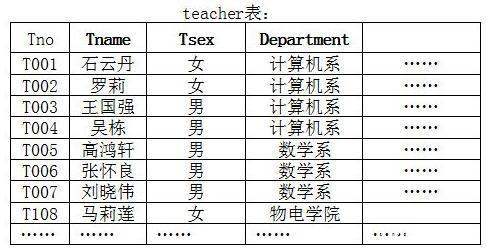
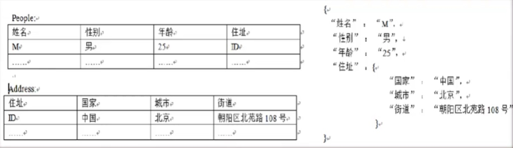
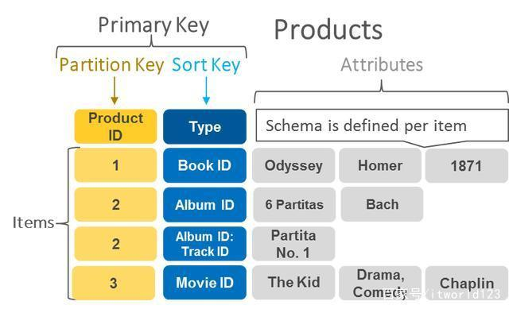
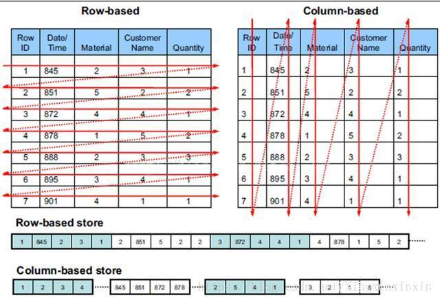
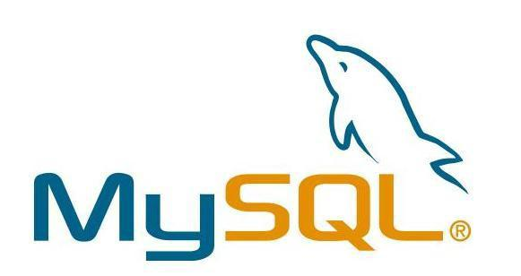
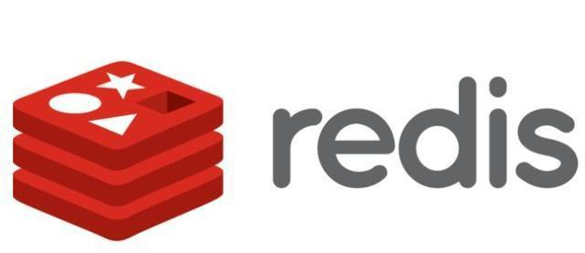
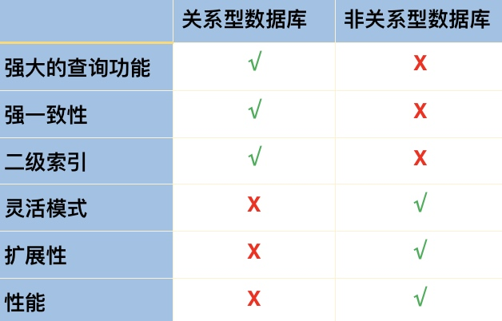
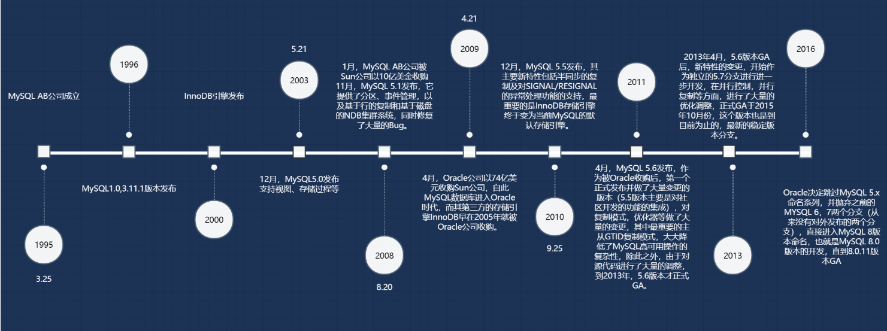
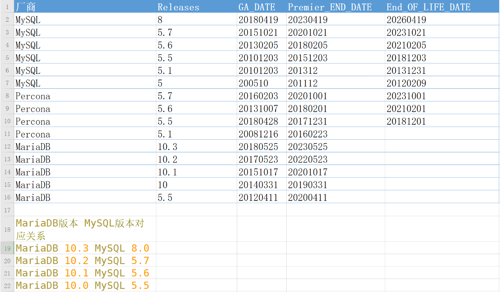

# 引言：数据库介绍

什么是数据库？数据库是做什么用的？数据库有哪些？企业常用的数据库选择？


为什么需要数据库？数据是什么？各种类型的公司分别存储什么数据？


## 一、数据库简介

### 1、数据库概述

数据库从字面上的理解就是数据的仓库，**其实我们平时说的数据库是指数据库管理系统(Database Management System)**，它是一种操纵和管理数据库的大型软件，用于建立、使用和维护数据库，简称DBMS。严格来说数据库是数据库管理系统的实例，一个数据库管理系统可以有多个数据库实例。

数据库系统（Database System），是由数据库及其管理软件组成的系统。

数据库系统是为适应数据处理的需要而发展起来的一种较为理想的数据处理系统，也是一个为实际可运行的[存储](https://baike.baidu.com/item/存储/1582924)、[维护](https://baike.baidu.com/item/维护/7097570)和应用系统提供数据的[软件系统](https://baike.baidu.com/item/软件系统/224122)，是存储介质 、处理对象和管理系统的集合体。


### 2、基本定义

[数据库系统](https://baike.baidu.com/item/数据库系统)[DBS](https://baike.baidu.com/item/DBS)（Data Base System，简称[DBS](https://baike.baidu.com/item/DBS)）通常由[软件](https://baike.baidu.com/item/软件)、[数据库](https://baike.baidu.com/item/数据库)和[数据管理](https://baike.baidu.com/item/数据管理)员组成。其[软件](https://baike.baidu.com/item/软件)主要包括[操作系统](https://baike.baidu.com/item/操作系统)、各种[宿主语言](https://baike.baidu.com/item/宿主语言)、实用[程序](https://baike.baidu.com/item/程序)以及[数据库管理系统](https://baike.baidu.com/item/数据库管理系统)。[数据库](https://baike.baidu.com/item/数据库)由[数据库管理系统](https://baike.baidu.com/item/数据库管理系统)统一管理，数据的插入、修改和检索均要通过数据库管理系统进行。[数据管理](https://baike.baidu.com/item/数据管理)员负责创建、监控和维护整个[数据库](https://baike.baidu.com/item/数据库)，使数据能被任何有权使用的人有效使用。[数据库管理员](https://baike.baidu.com/item/数据库管理员)一般是由业务水平较高、资历较深的人员担任。

数据库系统有大小之分，大型数据库系统有SQL Server、Oracle、DB2等，中小型数据库系统有Foxpro、Access、MySQL。

### 3、数据库构成

数据库系统一般由4部分组成：

1.数据库（database，DB）是指长期存储在[计算机](https://baike.baidu.com/item/计算机)内的，有组织，可共享的数据的集合。[数据库](https://baike.baidu.com/item/数据库)中的数据按一定的数学模型组织、描述和存储，具有较小的[冗余](https://baike.baidu.com/item/冗余)，较高的[数据独立性](https://baike.baidu.com/item/数据独立性)和易扩展性，并可为各种用户共享。

2.硬件：构成[计算机系统](https://baike.baidu.com/item/计算机系统)的各种[物理设备](https://baike.baidu.com/item/物理设备)，包括存储所需的[外部设备](https://baike.baidu.com/item/外部设备)。硬件的配置应满足整个[数据库系统](https://baike.baidu.com/item/数据库系统)的需要。

3.[软件](https://baike.baidu.com/item/软件)：包括[操作系统](https://baike.baidu.com/item/操作系统)、[数据库管理系统](https://baike.baidu.com/item/数据库管理系统)及[应用程序](https://baike.baidu.com/item/应用程序)。[数据库管理系统](https://baike.baidu.com/item/数据库管理系统)（database management system，DBMS）是[数据库系统](https://baike.baidu.com/item/数据库系统)的核心[软件](https://baike.baidu.com/item/软件)，是在[操作系统](https://baike.baidu.com/item/操作系统)的支持下工作，解决如何科学地组织和存储数据，如何高效获取和维护数据的[系统软件](https://baike.baidu.com/item/系统软件)。其主要功能包括：数据定义功能、数据操纵功能、[数据库](https://baike.baidu.com/item/数据库)的运行管理和数据库的建立与维护。

4.人员：主要有4类。第一类为[系统分析员](https://baike.baidu.com/item/系统分析员)和[数据库设计](https://baike.baidu.com/item/数据库设计)人员：系统分析员负责应用系统的[需求分析](https://baike.baidu.com/item/需求分析)和规范说明，他们和用户及[数据库管理员](https://baike.baidu.com/item/数据库管理员)一起确定系统的硬件配置，并参与[数据库系统](https://baike.baidu.com/item/数据库系统)的[概要设计](https://baike.baidu.com/item/概要设计)。[数据库设计](https://baike.baidu.com/item/数据库设计)人员负责数据库中数据的确定、数据库各级模式的设计。第二类为[应用程序](https://baike.baidu.com/item/应用程序)员，负责编写使用[数据库](https://baike.baidu.com/item/数据库)的应用程序。这些[应用程序](https://baike.baidu.com/item/应用程序)可对数据进行检索、建立、删除或修改。第三类为最终用户，他们利用系统的接口或查询语言访问[数据库](https://baike.baidu.com/item/数据库)。第四类用户是[数据库管理员](https://baike.baidu.com/item/数据库管理员)（data base administrator，DBA），负责数据库的总体信息控制。DBA的具体职责包括：具体[数据库](https://baike.baidu.com/item/数据库)中的信息内容和结构，决定数据库的[存储结构](https://baike.baidu.com/item/存储结构)和存取策略，定义数据库的安全性要求和完整性约束条件，监控数据库的使用和运行，负责数据库的性能改进、数据库的重组和重构，以提高系统的性能。

### 4、数据库特点

数据的结构化

数据的共享性好

数据的独立性好

数据存储粒度小

数据库管理系统为用户提供了友好的接口

数据库系统的核心和基础，是数据模型，现有的数据库系统均是基于某种数据模型的。

也可以说，数据库系统的核心就是数据库管理系统。


## 二、数据库分类

### 1、关键词

MySQL：The world's most popular open source database（全世界最流行的开源数据库）

postgresql:  The World's Most Advanced Open Source Relational Database（全世界最先进的开源数据库）


### 2、热度排行

数据库种类很多，我们平时接触最多的恐怕就是Oracle数据库，或者MySQL数据。两者是应用最广泛的关系型数据。如图是2021年2月份使用情况排名，从排名也可以看出上述两个数据库分别排第一名和第二名。

>全球数据库排行：https://db-engines.com/en/ranking
>国产数据库排行：https://www.modb.pro/dbRank


### 3、数据库分类

如果仔细看图1的排名就可以看到，数据库不仅仅有我们平时学到的关系型数据库，还有键值（Key-Value）数据库、列存储数据库、文档数据库和搜索引擎等类型。下面本文将简单介绍一下各种类型的数据。


**关系型数据库**： 

这种类型的数据库是最古老的数据库类型，关系型数据库模型是把复杂的数据结构归结为简单的二元关系（即二维表格形式）， 如图是一个二维表的实例。通常该表第一行为字段名称，描述该字段的作用，下面是具体的数据。在定义该表时需要指定字段的名称及类型。





在关系型数据库中，对数据的操作几乎全部建立在一个或多个关系表格上。在大型系统中通常有多个表，且表之间有各种关系。实际使用就是通过对这些关联的表格分类、合并、连接或选取等运算来实现数据库的管理。


**键值存储数据库**：

键值数据库是一种非关系数据库，它使用简单的键值方法来存储数据。键值数据库将数据存储为键值对集合，其中键作为唯一标识符。




3

如图是某公有云的键值存储示意图，其中键包含分区键和排序键，而值包含更多的实际信息。比如实际使用是可以以学号为键，姓名、性别、年龄和班级等信息为值进行存储。实际存储形式很灵活，是业务需求自行定义即可。


**列存储数据库**：

列式存储(column-based)是相对于传统关系型数据库的行式存储(Row-basedstorage)来说的。简单来说两者的区别就是对表中数据的存储形式的差异。



​                                                                          图3     列存储数据库

如图是传统行数据库和列数据库表中数据在磁盘上的存储形式的差异对比。对于行存储数据库，表中的数据是以行为单位逐行存储在磁盘上的；而对于列存储数据库，表中的数据则是以列为单位逐列存储在磁盘中。

列存储解决的主要问题是数据查询问题。我们知道，平时的查询大部分都是条件查询，通常是返回某些字段（列）的数据。对于行存储数据，数据读取时通常将一行数据完全读出，如果只需要其中几列数据的情况，就会存在冗余列，出于缩短处理时间的考量，消除冗余列的过程通常是在内存中进行的。而列存储，每次读取的数据是集合的一段或者全部，不存在冗余性问题。这样，通过这种存储方式的调整，使得查询性能得到极大的提升。


**面向文档数据库：**

此类数据库可存放并获取文档，可以是XML、JSON、BSON等格式，这些文档具备可述性（self-describing），呈现分层的树状结构（hierarchical tree data structure），可以包含映射表、集合和纯量值。数据库中的文档彼此相似，但不必完全相同。文档数据库所存放的文档，就相当于键值数据库所存放的“值”。文档数据库可视为其值可查的键值数据库。


**图形数据库**：

图形数据库顾名思义，就是一种存储图形关系的数据库。图形数据库是NoSQL数据库的一种类型，它应用图形理论存储实体之间的关系信息。关系型数据用于存储明确关系的数据，但对于复杂关系的数据存储却有些力不从心。如图这种人物之间的关系，如果用关系型数据库则非常复杂，用图形数据库将非常简单。


​                                                                       图4 图形数据库示例


**搜索引擎存储**：

搜索引擎数据库是应用在搜索引擎领域的数据存储形式，由于搜索引擎会爬取大量的数据，并以特定的格式进行存储，这样在检索的时候才能保证性能最优。


### 4、不同类型数据库常用软件

**关系型数据库**： 

关系型数据库最为经典的开源软件就是MySQL，它是最流行的开源关系型数据库管理系统，在 WEB 应用方面 MySQL 是最好的 RDBMS(Relational Database Management System：关系数据库管理系统)应用软件之一。



SUN被甲骨文收购后，MySQL 的原创人员有拉出另外一个分支，命名MariaDB 。该数据库被维基百科，Facebook 甚至 Google 等技术巨头使用。 MariaDB 是一种可为 MySQL 提供插件替换功能的数据库服务器。开发人员的首要关注点是安全性，在每个版本发布时，开发人员还会合并所有 MySQL 的安全修补程序，并在需要时对其进行增强。

除此之外，还有很多开源的关系型数据库，比如经典的文件数据库SQLite和针对Web服务进行优化的CUBRID 等。


**键值存储数据库**：

键值数据库目前应用最多的应该是Redis，Redis是一个开源的使用ANSI C语言编写、支持网络、可基于内存亦可持久化的日志型、Key-Value数据库，并提供多种语言的API。Redis通常最为普通关系型数据库的缓存层，用于降低数据库的访问压力，提升系统性能。




**列存储数据库：**

列存储数据库中最为出名的恐怕就是HBase了，HBase是 BigTable 的开源 java 版本。是建立在 HDFS 之上，提供高可靠性、高性能、列存储、 可伸缩、实时读写 NoSQL 的数据库系统。


**面向文档数据库**：

文档数据库种类繁多，包括MongoDB、CouchDB、 Terrastore、RavenDB和OrientDB等多大十几个。其中MongoDB是目前最为流行的文档数据库，其介于关系数据库和非关系数据库之间的产品，是非关系数据库当中功能最丰富，最像关系数据库的。其最大的特点是分布式部署，可以随着负载的增大动态扩容，从而满足企业业务增长的需求。


**图形数据库**：

图形种类很多，比如Neo4J、ArangoDB、OrientDB、FlockDB、GraphDB、InfiniteGraph、Titan和Cayley等。其中Neo4j 是目前最流行的图形数据库，支持完整的事务，在属性图中，图是由顶点（Vertex），边（Edge）和属性（Property）组成的，顶点和边都可以设置属性，顶点也称作节点，边也称作关系，每个节点和关系都可以由一个或多个属性。Neo4j创建的图是用顶点和边构建一个有向图，其查询语言cypher已经成为事实上的标准。


**搜索引擎存储**：

搜索引擎数据库最近比较火的包括Solr和Elasticsearch等。Solr是Apache 的一个开源项目，基于业界大名鼎鼎的java开源搜索引擎Lucene。在过去的十年里，solr发展壮大，拥有广泛的用户群体。solr提供分布式索引、分片、副本集、负载均衡和自动故障转移和恢复功能。如果正确部署，良好管理，solr就能够成为一个高可靠、可扩展和高容错的搜索引擎。

Elasticsearch构建在Apache Lucene库之上，同是开源搜索引擎。Elasticsearch在Solr推出几年后才面世的，通过REST和schema-free的JSON文档提供分布式、多租户全文搜索引擎。并且官方提供Java，Groovy，PHP，Ruby，Perl，Python，.NET和Javascript客户端。目前Elasticsearch与Logstash和Kibana配合，部署成日志采集和分析，简称ELK，它们都是开源软件。最近新增了一个FileBeat，它是一个轻量级的日志收集处理工具(Agent)，Filebeat占用资源少，适合于在各个服务器上搜集日志后传输给Logstash。


## 三、不同类型数据库的区别以及特点




### MySQL和Redis的对比

1）从数据存储格式上：

~~~txt
例如学生信息：
张三   性别：男    年龄：23   籍贯：上海   手机：1234567890

mysql存储格式:
uid	  姓名	sex    age    home     phone
001	  张三     男	   23     上海    1234567890   

Redis存储格式：
name001:zhangsan
sex001:男
age001:23
home001:上海
phone001:1234567890
~~~

2）从分类上

~~~txt
MySQL是关系型数据库,主要用于存放持久化数据,将数据存储在硬盘中,读取速度较慢。

Redis是NOSQL,即非关系型数据库,也是缓存数据库,即将数据存储在缓存中,缓存的读取速度快,能够大大的提高运行效率,但是保存时间有限。
~~~

3）从运行机制上

~~~txt
mysql作为持久化存储的关系型数据库，相对薄弱的地方在于每次请求访问数据库时，都存在着I/O操作，如果反复频繁的访问数据库。第一：会在反复链接数据库上花费大量时间，从而导致运行效率过慢；第二：反复的访问数据库也会导致数据库的负载过高，那么此时缓存的概念就衍生了出来。

缓存就是数据交换的缓冲区（cache），当浏览器执行请求时，首先会对在缓存中进行查找，如果存在，就获取；否则就访问数据库。缓存的好处就是读取速度快。
redis数据库就是一款缓存数据库，用于存储使用频繁的数据，这样减少访问数据库的次数，提高运行效率。
~~~

4）从存储介质上

~~~txt
mysql用于持久化的存储数据到硬盘，功能强大，但是速度较慢。

redis用于存储使用较为频繁的数据到缓存中，读取速度快。
~~~

5）需求上

~~~txt
MySQL和Redis因为需求的不同,一般都是配合使用。
Redis存储在内存中,如果存储在内存中,存储容量肯定要比磁盘少很多,那么要存储大量数据,只能花更多的钱去购买内存,造成在一些不需要高性能的地方是相对比较浪费的,所以目前基本都是MySQL(主) + Redis(辅),在需要性能的地方使用Redis,在不需要高性能的地方使用MySQL,好钢用在刀刃上。

MySQL支持sql查询,可以实现一些关联的查询以及统计.

Redis对内存要求比较高,在有限的条件下不能把所有数据都放在Redis.

MySQL偏向于存数据,Redis偏向于快速取数据,但Redis查询复杂的表关系时不如MySQL,所以可以把热门的数据放Redis,MySQL存基本数据。
~~~


### MySQL与mongdb对比

MySQL与MongoDB都是开源的常用数据库，但是MySQL是传统的关系型数据库，MongoDB则是非关系型数据库，也叫文档型数据库，是一种NoSQL的数据库。它们各有各的优点，关键是看用在什么地方。所以我们所熟知的那些SQL语句就不适用于MongoDB了，因为SQL语句是关系型数据库的标准语言。

#### （一）关系型数据库-MySQL

 1、在不同的引擎上有不同的存储方式。
 2、查询语句是使用传统的sql语句，拥有较为成熟的体系，成熟度很高。
 3、开源数据库的份额在不断增加，mysql的份额也在持续增长。
 4、缺点就是在海量数据处理的时候效率会显著变慢。

------

#### （二）非关系型数据库-MongoDB

非关系型数据库(nosql ),属于文档型数据库。先解释一下文档的数据库，即可以存放xml、json、bson类型系的数据。这些数据具备自述性，呈现分层的树状数据结构。数据结构由键值(key=>value)对组成。

 1、存储方式：虚拟内存+持久化。
 2、查询语句：是独特的MongoDB的查询方式。
 3、适合场景：事件的记录，内容管理或者博客平台等等。
 4、架构特点：可以通过副本集，以及分片来实现高可用。
 5、数据处理：数据是存储在硬盘上的，只不过需要经常读取的数据会被加载到内存中，将数据存储在物理内存中，从而达到高速读写。
 6、成熟度与广泛度：新兴数据库，成熟度较低，Nosql数据库中最为接近关系型数据库，比较完善的DB之一，适用人群不断在增长。


#### （三）MongoDB优势与劣势

优势：
 1、在适量级的内存的MongoDB的性能是非常迅速的，它将热数据存储在物理内存中，使得热数据的读写变得十分快。
 2、MongoDB的高可用和集群架构拥有十分高的扩展性。
 3、在副本集中，当主库遇到问题，无法继续提供服务的时候，副本集将选举一个新的主库继续提供服务。
 4、MongoDB的Bson和JSon格式的数据十分适合文档格式的存储与查询。

劣势：
 1、 不支持事务操作。MongoDB本身没有自带事务机制，若需要在MongoDB中实现事务机制，需通过一个额外的表，从逻辑上自行实现事务。
 2、 应用经验少，由于NoSQL兴起时间短，应用经验相比关系型数据库较少。
 3、MongoDB占用空间过大。


#### （四）对比

| 数据库       | MongoDB                                              | MySQL                        |
| ------------ | ---------------------------------------------------- | ---------------------------- |
| 数据库模型   | 非关系型                                             | 关系型                       |
| 存储方式     | 以类JSON的文档的格式存储                             | 不同引擎有不同的存储方式     |
| 查询语句     | MongoDB查询方式（类似JavaScript的函数）              | SQL语句                      |
| 数据处理方式 | 基于内存，将热数据存放在物理内存中，从而达到高速读写 | 不同引擎有自己的特点         |
| 成熟度       | 新兴数据库，成熟度较低                               | 成熟度高                     |
| 广泛度       | NoSQL数据库中，比较完善且开源，使用人数在不断增长    | 开源数据库，市场份额不断增长 |
| 事务性       | 仅支持单文档事务操作，弱一致性                       | 支持事务操作                 |
| 占用空间     | 占用空间大                                           | 占用空间小                   |
| join操作     | MongoDB没有join                                      | MySQL支持join                |


#### （五）企业选型

关系型数据库适合存储结构化数据，如用户的帐号、地址： 
1）这些数据通常需要做结构化查询，比如join，这时候，关系型数据库就要胜出一筹 
2）这些数据的规模、增长的速度通常是可以预期的 
3）事务性、一致性 
　　 
NoSQL适合存储非结构化数据，如文章、评论： 
1）这些数据通常用于模糊处理，如全文搜索、机器学习 
2）这些数据是海量的，而且增长的速度是难以预期的， 
3）根据数据的特点，NoSQL数据库通常具有无限（至少接近）伸缩性 
4）按key获取数据效率很高，但是对join或其他结构化查询的支持就比较差


## 四、DBA职业概念

### 1、官方定义的Mysql DBA工作内容

```bash
（1）运维DBA
初级：各版本、各平台安装搭建、升级
中级：体系结构原理、基础管理（启动关闭、初始化配置文件管理、多实例管理、用户权限管理、基本SQL（增删改查））、
     日志管理、备份与恢复、主从复制（构建、状态监控） 
高级：高可用（MGR、InnoDB Cluster）、高性能（优化）
（2）开发DBA
懂至少一门开发语言 ：JAVA、11_开发学习
基本SQL语句深入学习（增删改查）、数据库结构设计（建模）
高级SQL：存储过程、函数、触发器、视图、事件
```

### 2、课程学习内容

```bash
（1）MySQL 5.7 安装部署（二进制）*****
    编译自己扩展
（2）MySQL升级步骤扩展 ***
（3）MySQL5.7 体系结构原理 *****
（4）MySQL基础管理  *****
（5）基础SQL语句使用 *****
（6）SQL高级应用  ***
（7）Information_schema获取元数据 ***
（8）索引、执行计划管理（基础优化）*****
（9）存储引擎  *****
（10）日志管理 *****
（11）备份与恢复 ******
（12）主从复制及架构演变 ******
（13）传统的高可用及读写分离（MHA&Atlas）****
（14）传统分布式架构设计与实现-扩展（Mycat--->DBLE,DRDS）**
（15）MySQL 5.7 高可用及分布式架构-扩展（MGR,InnoDB Cluster）***
（16）MySQL优化（安全、性能） ****
（17）MySQL 监控（zabbix、Open-falcon）    ****
 (18) RDS(阿里云课程)    *****

额外要会的：
    Redis
    mongodb     
了解: 
    PG
    Oracle  
```

### 3、DBA职业素养


## 五、MySQL介绍

### 1、产品历史



### 2、MySQL版本和平替选择



>- 准备安装MySQL时，请确定要使用哪个版本和发行格式（二进制或源码）。
>- 首先，决定要安装开发版本还是通用版本（GA）。开发版本具有最新功能，但不建议用于生产环境。
>- GA版本（也称为生产版本或稳定版本）是供生产使用的。一般使用GA版本（6-12月）。大约20个小版本

### 3、MySQL8.0版本新特性简介

>https://dev.mysql.com/doc/refman/8.0/en/mysql-nutshell.html
>https://dev.mysql.com/doc/refman/8.0/en/added-deprecated-removed.html

### 4、MySQL8.0源码

>https://dev.mysql.com/doc/dev/mysql-server/latest/
