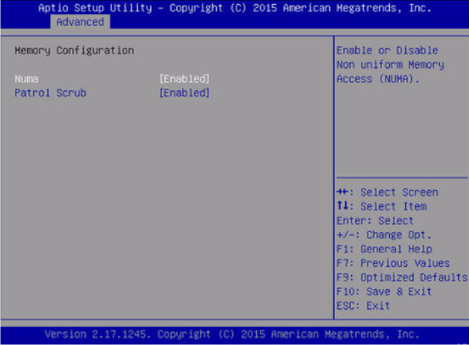
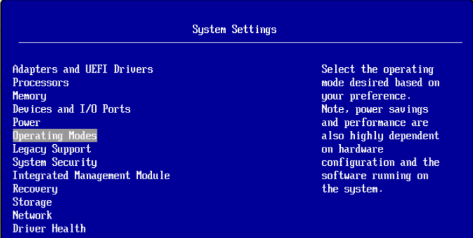
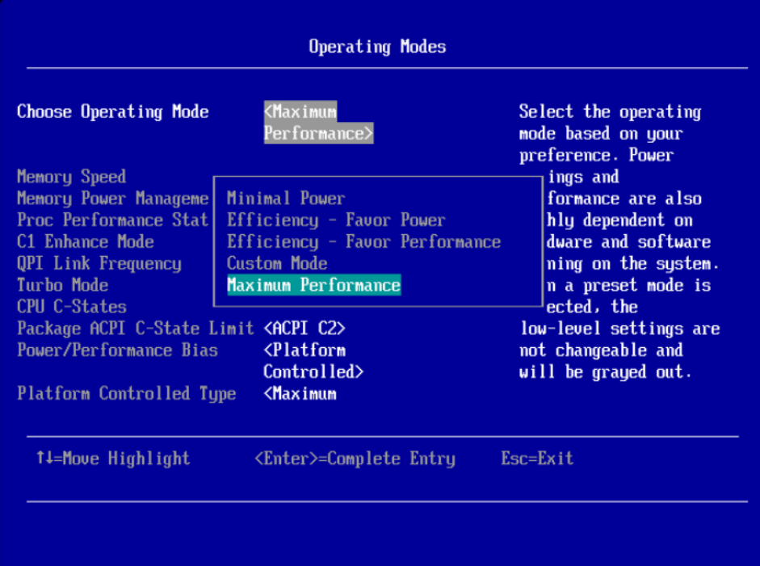

# MySQL安装前置准备

## 一、硬件准备

### 1、标准化数据库专用服务器

>​    帮助公司和运维团队,选择最合适MySQL数据库运行的服务器硬件,从品牌、CPU、MEM、IO设备、网络设备、存储设备等各个层次进行合理建议.而不是上采购人员、商务人员或根本不懂数据库的人员制定服务器标准。杜绝类似：内存小了、磁盘没法用、不符合最低3-5年扩展性硬件等此类问题出现。

### 2、标准化服务器硬件带来的收益

>   出现业务系统故障或性能问题。可以让拍错或者优化时间大大缩减。帮助管理员可以快速根据基准值结合经验，定位瓶颈问题。

## 二、操作系统及配置标准化

### 1、标准化数据库操作系统

>目前，互联网企业广泛应用centos系列操作系统。并且在同一组集群架构的服务器系统都保持系统和内核版本一致。

### 2、标准化数据库稳定系统

>目前采用Centos7.2以上双数版。并且安装同版本光盘稳定兼容较好的软件包。

### 3、标准化操作系统及硬件参数

#### 1.关闭NUMA

##### 1）BIOS级别

>在bios层面numa关闭时，无论os层面的numa是否打开，都不会影响性能。



```bash
# numactl --hardware
available: 1 nodes (0) #如果是2或多个nodes就说明numa没关掉
```

##### 2）OS grub级别

>在os层numa关闭时,打开bios层的numa会影响性能，QPS会下降15-30%;

```bash
vi /boot/grub2/grub.cfg
#/* Copyright 2010, Oracle. All rights reserved. */
default=0
timeout=5
hiddenmenu
foreground=000000
background=ffffff
splashimage=(hd0,0)/boot/grub/oracle.xpm.gz
title Trying_C0D0_as_HD0
root (hd0,0)
kernel /boot/vmlinuz-2.6.18-128.1.16.0.1.el5 root=LABEL=DBSYS ro bootarea=dbsysrhgb quiet console=ttyS0,115200n8 console=tty1 crashkernel=128M@16M numa=off
initrd /boot/initrd-2.6.18-128.1.16.0.1.el5.img
```

##### 3）数据库级别

```bash
mysql> show variables like '%numa%';
+------------------------+-------+
| Variable_name | Value |
+------------------------+-------+
| innodb_numa_interleave | OFF |
+------------------------+-------+
或者：
vi /etc/init.d/mysqld
找到如下行
# Give extra arguments to mysqld with the my.cnf file. This script
# may be overwritten at next upgrade.
$bindir/mysqld_safe --datadir="$datadir" --pid-file="$mysqld_pid_file_path"
$other_args >/dev/null &
wait_for_pid created "$!" "$mysqld_pid_file_path"; return_value=$?

将$bindir/mysqld_safe --datadir="$datadir"这一行修改为：
/usr/bin/numactl --interleave all $bindir/mysqld_safe --datadir="$datadir" --pid-file="$mysqld_pid_file_path"
$other_args >/dev/null &
wait_for_pid created "$!" "$mysqld_pid_file_path"; return_value=$?
```

#### 2.开启CPU高性能模式





#### 3.阵列卡RAID配置

>raid10(推荐)
>SSD、PCI-E、Flash

#### 4.关闭THP

```bash
vi /etc/rc.local
在文件末尾添加如下指令：
if test -f /sys/kernel/mm/transparent_hugepage/enabled; then
echo never > /sys/kernel/mm/transparent_hugepage/enabled
fi
if test -f /sys/kernel/mm/transparent_hugepage/defrag; then
echo never > /sys/kernel/mm/transparent_hugepage/defrag
fi
[root@master ~]# cat /sys/kernel/mm/transparent_hugepage/enabled
always madvise [never]
[root@master ~]# cat /sys/kernel/mm/transparent_hugepage/defrag
always madvise [never]
```

#### 5.网卡绑定

>bonding技术，业务数据库服务器都要配置bonding继续。建议是主备模式。
>交换机一定要堆叠。

#### 6.存储多路径

>使用独立存储设备的话，需要配置多路径:
>linux 自带
>厂商提供

#### 7.系统层面参数优化

##### 1）内核优化

>/etc/sysctl.conf

```bash
vm.swappiness = 5
vm.dirty_ratio = 20
vm.dirty_background_ratio = 10
net.ipv4.tcp_max_syn_backlog = 819200
net.core.netdev_max_backlog = 400000
net.core.somaxconn = 4096
net.ipv4.tcp_tw_reuse=1
net.ipv4.tcp_tw_recycle=0
```

>1. **vm.swappiness = 5**:
>   - **说明**：`swappiness` 是 Linux 用来控制内存页交换到磁盘（即 swap 分区）的积极程度的参数。
>   - **值**：`5` 表示系统倾向于将内存保留给进程，而不是交换到磁盘。这个值越小，系统就越不愿意使用 swap。
>   - **影响**：在高内存负载下，设置较小的 `swappiness` 值有助于确保关键进程可以持续访问内存，而不会被交换到磁盘。
>2. **vm.dirty_ratio = 20** 和 **vm.dirty_background_ratio = 10**:
>   - **说明**：这两个参数控制脏页（即已经被修改但尚未写入磁盘的页）在内存中的行为。
>   - **vm.dirty_ratio = 20**：当系统中有超过 20% 的内存是脏页时，系统将会阻塞所有的写操作，直到脏页被写回磁盘。
>   - **vm.dirty_background_ratio = 10**：当系统中有超过 10% 的内存是脏页时，后台进程（如 `pdflush`）将开始异步地将脏页写回磁盘。
>   - **影响**：这些设置有助于平衡写操作的延迟和磁盘I/O的使用。设置较低的值可以减少写操作的延迟，但可能会增加磁盘I/O的使用。
>3. **net.ipv4.tcp_max_syn_backlog = 819200**:
>   - **说明**：这个参数定义了在 TCP 三次握手过程中，当 SYN（同步）队列满时，系统可以接受的额外 SYN 连接的数量。
>   - **影响**：在高并发的网络环境中，增加这个值有助于防止 SYN 泛洪攻击，并允许更多的连接尝试。
>4. **net.core.netdev_max_backlog = 400000**:
>   - **说明**：这个参数定义了网络接口接收队列的最大长度。
>   - **影响**：在高网络负载下，增加这个值可以减少丢包的可能性，但也会增加系统内存的使用。
>5. **net.core.somaxconn = 4096**:
>   - **说明**：这个参数定义了监听队列（listen queue）的最大长度，即等待被 `accept()` 处理的连接的最大数量。
>   - **影响**：在高并发的服务器应用中，增加这个值可以确保更多的连接请求被接受，而不是被拒绝。
>6. **net.ipv4.tcp_tw_reuse = 1** 和 **net.ipv4.tcp_tw_recycle = 0**:
>   - **说明**：这两个参数与 TCP 的 TIME_WAIT 状态相关。
>   - **net.ipv4.tcp_tw_reuse = 1**：允许重用处于 TIME_WAIT 状态的套接字，用于新的连接。这有助于在高负载下更快地建立新的连接。
>   - **net.ipv4.tcp_tw_recycle = 0**：这个参数通常不建议启用，因为它可能导致与 NAT（网络地址转换）设备的兼容性问题。当启用时，它会加速 TIME_WAIT 套接字的回收。但在这个设置中，它被禁用了。
>   - **影响**：`tcp_tw_reuse` 可以帮助在高负载下更快地建立新的连接，而 `tcp_tw_recycle` 的禁用则避免了与 NAT 设备的潜在兼容性问题。

**常用内核优化**

```bash
root@xiaowu:~# vim /etc/sysctl.conf 
#禁ping
net.ipv4.icmp_echo_ignore_all = 1

#表示开启重用。允许将TIME-WAIT sockets重新用于新的TCP连接，默认为0，表示关闭；
net.ipv4.tcp_syncookies = 1
 
#一个布尔类型的标志，控制着当有很多的连接请求时内核的行为。启用的话，如果服务超载，内核将主动地发送RST包。
net.ipv4.tcp_abort_on_overflow = 1
 
#表示系统同时保持TIME_WAIT的最大数量，如果超过这个数字，TIME_WAIT将立刻被清除并打印警告信息。
#默认为180000，改为6000。对于Apache、Nginx等服务器，此项参数可以控制TIME_WAIT的最大数量,服务器被大量的TIME_WAIT拖死
net.ipv4.tcp_max_tw_buckets = 6000
 
#有选择的应答
net.ipv4.tcp_sack = 1
 
#该文件表示设置tcp/ip会话的滑动窗口大小是否可变。参数值为布尔值，为1时表示可变，为0时表示不可变。tcp/ip通常使用的窗口最大可达到65535 字节，对于高速网络.
#该值可能太小，这时候如果启用了该功能，可以使tcp/ip滑动窗口大小增大数个数量级，从而提高数据传输的能力。
net.ipv4.tcp_window_scaling = 1
 
#TCP接收缓冲区
net.ipv4.tcp_rmem = 30000000 30000000 30000000
 
#TCP发送缓冲区
net.ipv4.tcp_wmem = 30000000 30000000 30000000
 
#Out of socket memory
net.ipv4.tcp_mem = 94500000 915000000 927000000
 
#该文件表示每个套接字所允许的最大缓冲区的大小。
net.core.optmem_max = 81920
 
#该文件指定了发送套接字缓冲区大小的缺省值（以字节为单位）。
net.core.wmem_default = 8388608
 
#指定了发送套接字缓冲区大小的最大值（以字节为单位）。
net.core.wmem_max = 16777216
 
#指定了接收套接字缓冲区大小的缺省值（以字节为单位）。
net.core.rmem_default = 8388608
 
 
#指定了接收套接字缓冲区大小的最大值（以字节为单位）。
net.core.rmem_max = 16777216
 
 
#表示SYN队列的长度,默认为1024,加大队列长度为10200000,可以容纳更多等待连接的网络连接数。
net.ipv4.tcp_max_syn_backlog = 1020000
 
 
#每个网络接口接收数据包的速率比内核处理这些包的速率快时，允许送到队列的数据包的最大数目。
net.core.netdev_max_backlog = 862144
 
 
#web 应用中listen 函数的backlog 默认会给我们内核参数的net.core.somaxconn 限制到128，而nginx 定义的NGX_LISTEN_BACKLOG 默认为511，所以有必要调整这个值。
net.core.somaxconn = 262144
 
 
#系统中最多有多少个TCP 套接字不被关联到任何一个用户文件句柄上。如果超过这个数字，孤儿连接将即刻被复位并打印出警告信息。
#这个限制仅仅是为了防止简单的DoS 攻击，不能过分依靠它或者人为地减小这个值，更应该增加这个
net.ipv4.tcp_max_orphans = 327680
 
#时间戳可以避免序列号的卷绕。一个1Gbps 的链路肯定会遇到以前用过的序列号。时间戳能够让内核接受这种“异常”的数据包。这里需要将其关掉。
net.ipv4.tcp_timestamps = 0
 
 
#为了打开对端的连接，内核需要发送一个SYN 并附带一个回应前面一个SYN 的ACK。也就是所谓三次握手中的第二次握手。这个设置决定了内核放弃连接之前发送SYN+ACK 包的数量。
net.ipv4.tcp_synack_retries = 1
 
 
#在内核放弃建立连接之前发送SYN 包的数量。
net.ipv4.tcp_syn_retries = 1
 
#表示开启重用。允许将TIME-WAIT sockets重新用于新的TCP连接，默认为0，表示关闭；
net.ipv4.tcp_tw_reuse = 1
 
#修改系統默认的 TIMEOUT 时间。
net.ipv4.tcp_fin_timeout = 15
 
#表示当keepalive起用的时候，TCP发送keepalive消息的频度。缺省是2小时，建议改为20分钟。
net.ipv4.tcp_keepalive_time = 30
 
#表示用于向外连接的端口范围。缺省情况下很小：32768到61000，改为1024到65535。（注意：这里不要将最低值设的太低，否则可能会占用掉正常的端口！）
net.ipv4.ip_local_port_range = 1024    65535
 
#以下可能需要加载ip_conntrack模块 modprobe ip_conntrack ,有文档说防火墙开启情况下此模块失效
#縮短established的超時時間
net.netfilter.nf_conntrack_tcp_timeout_established = 180
 
 
#CONNTRACK_MAX 允许的最大跟踪连接条目，是在内核内存中netfilter可以同时处理的“任务”（连接跟踪条目）
net.netfilter.nf_conntrack_max = 1048576
net.nf_conntrack_max = 1048576
```

**生效**

````bash
/sbin/sysctl -p
/sbin/sysctl -w net.ipv4.route.flush=1
````

**草稿**

```bash
#表示开启重用。允许将TIME-WAIT sockets重新用于新的TCP连接，默认为0，表示关闭；
net.ipv4.tcp_syncookies = 1
#一个布尔类型的标志，控制着当有很多的连接请求时内核的行为。启用的话，如果服务超载，内核将主动地发送RST包。
net.ipv4.tcp_abort_on_overflow = 1
#表示系统同时保持TIME_WAIT的最大数量，如果超过这个数字，TIME_WAIT将立刻被清除并打印警告信息。
#默认为180000，改为6000。对于Apache、Nginx等服务器，此项参数可以控制TIME_WAIT的最大数量,服务器被大量的TIME_WAIT拖死
net.ipv4.tcp_max_tw_buckets = 6000
#有选择的应答
#net.ipv4.tcp_sack = 1
#该文件表示设置tcp/ip会话的滑动窗口大小是否可变。参数值为布尔值，为1时表示可变，为0时表示不可变。tcp/ip通常使用的窗口最大可达到65535 字节，对于高速网络.
#  #该值可能太小，这时候如果启用了该功能，可以使tcp/ip滑动窗口大小增大数个数量级，从而提高数据传输的能力。
net.ipv4.tcp_window_scaling = 1
#  #TCP接收缓冲区
net.ipv4.tcp_rmem = 30000000 30000000 30000000
##TCP发送缓冲区
net.ipv4.tcp_wmem = 30000000 30000000 30000000 
# #Out of socket memory
net.ipv4.tcp_mem = 94500000 915000000 927000000    
##该文件表示每个套接字所允许的最大缓冲区的大小。
net.core.optmem_max = 20480   
# #该文件指定了发送套接字缓冲区大小的缺省值（以字节为单位）。
net.core.wmem_default = 8388608
#  #指定了发送套接字缓冲区大小的最大值（以字节为单位）。
net.core.wmem_max = 16777216   
#  #指定了接收套接字缓冲区大小的缺省值（以字节为单位）。
net.core.rmem_default = 8388608          
# #指定了接收套接字缓冲区大小的最大值（以字节为单位）。
net.core.rmem_max = 16777216            
# #表示SYN队列的长度,默认为1024,加大队列长度为10200000,可以容纳更多等待连接的网络连接数。
net.ipv4.tcp_max_syn_backlog = 1020000    
# #每个网络接口接收数据包的速率比内核处理这些包的速率快时，允许送到队列的数据包的最大数目。
net.core.netdev_max_backlog = 862144
##web 应用中listen 函数的backlog 默认会给我们内核参数的net.core.somaxconn 限制到128，而nginx 定义的NGX_LISTEN_BACKLOG 默认为511，所以有必要调整这个值。
net.core.somaxconn = 262144
# #系统中最多有多少个TCP 套接字不被关联到任何一个用户文件句柄上。如果超过这个数字，孤儿连接将即刻被复位并打印出警告信息。
#限制仅仅是为了防止简单的DoS 攻击，不能过分依靠它或者人为地减小这个值，更应该增加这个
net.ipv4.tcp_max_orphans = 327680         
#  #时间戳可以避免序列号的卷绕。一个1Gbps 的链路肯定会遇到以前用过的序列号。时间戳能够让内核接受这种“异常”的数据包。这里需要将其关掉。
net.ipv4.tcp_timestamps = 0     
# #为了打开对端的连接，内核需要发送一个SYN 并附带一个回应前面一个SYN 的ACK。也就是所谓三次握手中的第二次握手。这个设置决定了内核放弃连接之前发送SYN+ACK 包的数量。
net.ipv4.tcp_synack_retries = 1
# #在内核放弃建立连接之前发送SYN 包的数量。
net.ipv4.tcp_syn_retries = 1
# #表示开启重用。允许将TIME-WAIT sockets重新用于新的TCP连接，默认为0，表示关闭；
net.ipv4.tcp_tw_reuse = 1  
##修改系統默认的 TIMEOUT 时间。
net.ipv4.tcp_fin_timeout = 15
 #表示当keepalive起用的时候，TCP发送keepalive消息的频度。缺省是2小时，建议改为20分钟。
net.ipv4.tcp_keepalive_time = 30
#   #表示用于向外连接的端口范围。缺省情况下很小：32768到61000，改为1024到65535。（注意：这里不要将最低值设的太低，否则可能会占用掉正常的端口！）
net.ipv4.ip_local_port_range = 1024    65535                 
#    #以下可能需要加载ip_conntrack模块 modprobe ip_conntrack ,有文档说防火墙开启情况下此模块失效
#    #縮短established的超時時間
# net.netfilter.nf_conntrack_tcp_timeout_established = 180                
# #CONNTRACK_MAX 允许的最大跟踪连接条目，是在内核内存中netfilter可以同时处理的“任务”（连接跟踪条目）
net.netfilter.nf_conntrack_max = 1048576
net.nf_conntrack_max = 1048576
# 值越大，表示越积极使用swap分区，越小表示越积极使用物理内存。默认值swappiness=60，表示内存使用率超过100-60=40%时开始使用交换分区。
vm.swappiness = 5
# 单个进程的脏页数量达到系统总内存的多大比例后，就会触发pdflush/flush/kdmflush等后台回写进程运行。
vm.dirty_ratio = 20
# 所有全局系统进程的脏页数量达到系统总内存的多大比例后，就会触发pdflush/flush/kdmflush等后台回写进程运行。
vm.dirty_background_ratio = 10
# 表示开启TCP连接中TIME-WAIT sockets的快速回收，默认为0，表示关闭
net.ipv4.tcp_tw_recycle = 1
```

##### 2）文件句柄优化

```bash
# vim /etc/security/limits.conf 
#root用户限制
root            soft    core            unlimited
root            hard    core            unlimited
root            soft    nproc           1000000
root            hard    nproc           1000000
root            soft    nofile          1000000
root            hard    nofile          1000000
root            soft    memlock         32000
root            hard    memlock         32000
root            soft    msgqueue        8192000
root            hard    msgqueue        8192000

#其他用户限制
* 		soft 	core 		unlimited
* 		hard 	core 		unlimited
* 		soft 	nproc 		1000000
* 		hard 	nproc 		1000000
* 		soft 	nofile 		1000000
*		hard 	nofile 		1000000
* 		soft 	memlock 	32000
* 		hard 	memlock 	32000
* 		soft 	msgqueue 	8192000
* 		hard 	msgqueue 	8192000
```

**参数解释**

```bash
四列参数的设置：
第一列，可以是用户，也可以是组，要用@group这样的语法，也可以是通配符如*%
第二列，两个值：hard，硬限制，soft，软件限制，一般来说soft要比hard小，hard是底线，决对不能超过，超过soft报警，直到hard数
第三列，见列表，打开文件数是nofile
第四列，数量，这个也不能设置太大
```

##### 3）防火墙

>禁用selinux ： /etc/sysconfig/selinux 更改SELINUX=disabled.
>iptables如果不使用可以关闭。可是需要打开MySQL需要的端口号

##### 4）文件系统优化

>推荐使用XFS文件系统
>MySQL数据分区独立 ，例如挂载点为: /data
>mount参数 defaults, noatime, nodiratime, nobarrier

```bash
# vim /etc/fstab：
/dev/sdb /data xfs defaults,noatime,nodiratime,nobarrier 1 2
```

>1. **/dev/sdb**：
>    这是你想要挂载的设备的路径。在这个例子中，`/dev/sdb`可能是一个硬盘或分区的设备文件。但是，通常一个完整的分区会是`/dev/sdb1`、`/dev/sdb2`等，除非整个磁盘（而不仅仅是第一个分区）都被格式化为一个文件系统。
>2. **/data**：
>    这是挂载点，即文件系统的根目录在文件系统中的位置。当你挂载`/dev/sdb`到这个位置时，你可以通过`/data`目录来访问该设备上的文件。
>3. **xfs**：
>    这是文件系统的类型。在这个例子中，文件系统是XFS。
>4. **defaults,noatime,nodiratime,nobarrier**：
>    这是挂载选项的列表。
>   - `defaults`：这是默认的挂载选项，它通常包括`rw`（读/写）、`suid`（设置用户ID）、`dev`（解释字符和块设备）、`exec`（允许执行二进制文件）、`auto`（允许自动挂载）、`nouser`（只允许root挂载）和`async`（所有I/O到文件系统都应该是异步的）。
>   - `noatime`：不更新文件访问时间。这可以稍微提高性能，特别是对于大量读取操作的文件系统。
>   - `nodiratime`：与`noatime`类似，但仅针对目录。不更新目录的访问时间。
>   - `nobarrier`：不发送写入屏障（barriers）到存储设备。这可以提高某些系统的性能，但可能会增加数据损坏的风险，特别是在某些硬件上。
>5. **1**：
>    这是dump备份的标志。`dump`是一个用于备份文件系统的工具。如果此字段为1，则`dump`将尝试备份此文件系统。在这个例子中，它设置为1，但通常对于大多数现代系统，你可能会看到它设置为0，因为`dump`工具可能不再使用。
>6. **2**：
>    这是fsck（文件系统一致性检查）的顺序。在系统启动时，如果文件系统没有正常卸载，系统可能会运行fsck来修复它。多个文件系统可能具有相同的fsck顺序（例如，它们都设置为2），但这意味着fsck将按照它们在`/etc/fstab`文件中出现的顺序进行检查（除非另有说明）。在这个例子中，`/dev/sdb`（或`/data`）文件系统将在fsck检查的后期进行。根文件系统（通常是`/`）应该有一个较低的fsck顺序（通常是1），以确保它在其他文件系统之前被检查。

##### 5）不使用LVM

##### 6）io调度

>SAS ： deadline
>SSD&PCI-E： noop
>
>centos 7 默认是deadline
>cat /sys/block/sda/queue/scheduler

```bash
#临时修改为deadline(centos6)
echo deadline >/sys/block/sda/queue/scheduler

# 永久修改
vi /boot/grub/grub.conf
kernel /boot/vmlinuz-2.6.18-8.el5 ro root=LABEL=/ elevator=deadline rhgb quiet
```

## 三、预装MySQL前硬件烤机压测

### 1、stress 进行CPU、IO、MEM烤机压测

> 上线前压测半个月以上，有问题找厂家换

```bash
a. 安装
yum install -y epel-release
yum install -y stress
b. 烤机CPU
[root@slave1 ~]# stress -c 4
c. 烤机 MEM
stress -m 3 --vm-bytes 300M
d. 烤机多参数
stress -c 4 -m 2 -d 1
```

### 2、FIO 进行定制化IO烤机压测

>获取机器性能基准，方便上线后，判断性能瓶颈
>
>IO评估：
>
>​    吞吐量：读写速度
>
>​    IOPS：IO每秒发生的次数
>
>​    LA：

#### 1.FIO介绍

>- FIO是测试IOPS的非常好的工具，用来对磁盘进行压力测试和验证。
>- 磁盘IO是检查磁盘性能的重要指标，可以按照负载情况分成照顺序读写，随机读写，混合读写两大类。
>- FIO是一个可以产生很多线程或进程并执行用户指定的特定类型I/O操作的工具，FIO的典型用途是编写和模拟的I/O负载匹配的作业文件。
>- FIO是一个多线程io生成工具，可以生成多种IO模式，用来测试磁盘设备的性能（也包含文件系统：如针对网络文件系统 NFS 的IO测试）。
>- FIO压测可以帮助管理员，提前预知磁盘瓶颈，及时作出扩容建议。也可以作为有效烤机的

#### 2.FIO应用

##### 1）环境准备

```bash
mkdir -p /testio
mkfs.xfs /dev/sdb
mount /dev/sdb /testio

# 创建大文件
dd if=/dev/zero of=/testio/test bs=16k count=512000
```

##### 2）软件安装

```bash
yum install libaio libaio-devel fio
```

##### 3）压测

###### ①测试随机写

```bash
fio --filename=/testio/test --iodepth=4 --ioengine=libaio -direct=1 --rw=randwrite --bs=16k --size=2G --numjobs=64 --runtime=20 --group_reporting --name=test-rand-write
```

###### ②测试顺序读取

```bash
fio --filename=/testio/test -iodepth=64 -ioengine=libaio --direct=1 --rw=read --bs=1m --size=2g --numjobs=4 --runtime=10 --group_reporting --name=test-read
```

###### ③测试顺序写

```bash
fio --filename=/testio/test.big -iodepth=64 -ioengine=libaio -direct=1 -rw=write -bs=1m -size=2g -numjobs=4 -runtime=20 --group_reporting -name=test-write
```

###### ④测试随机读

```bash
fio --filename=/testio/test -iodepth=64 -ioengine=libaio -direct=1 -rw=randread -bs=4k -size=2G -numjobs=64 -runtime=20 --group_reporting -name=test-rand-read
```

###### ⑤16k，70%读取，30%写入

```bash
fio --filename=/dev/sdb --direct=1 --rw=randrw --refill_buffers --norandommap --randrepeat=0 --ioengine=libaio --bs=4k --rwmixread=70 --iodepth=16 --numjobs=16 --runtime=60 --group_reporting --name=73test
```

##### 4）参数解读

```bash
--filename 需要压测的磁盘或者测试文件。
--direct=1 是否绕过文件系统缓存
-ioengine=libaio 采用异步或者同步IO
-iodepth=64 IO队列深度。一次发起多少个IO请求，一般SSD或者flash可以较大。
--numjobs=16 测试并发线程数。在RAID10或Raid5可加大参数。
--rwmixread=70 混合读写，read的比例。一般读写比例28或者37。
--group_reporting 统计汇总结果展示。
--name 起个名。
--rw=randrw 测试类型
```

## 四、数据库软件标准化

### 1、分支

### 2、版本

>1、稳定版：选择开源的社区版的稳定版GA版本。
>2、选择mysql数据库GA版本发布后6个月-12个月的GA双数版本，大约在15-20个小版本左右。
>3、要选择前后几个月没有大的BUG修复的版本，而不是大量修复BUG的集中版本。
>4、要考虑开发人员开发程序使用的版本是否兼容你选的版本。
>5、作为内部开发测试数据库环境，跑大概3-6个月的时间。
>6、优先企业非核心业务采用新版本的数据库GA版本软件。
>7、向DBA高手请教，或者在技术氛围好的群里和大家一起交流，使用真正的高手们用过的好用的GA版本产品。
>最终建议： 8.0.24+是一个不错的版本选择。向后可以选择双数版。
>
>5.7.34+
>8.0.24+

### 3、插件及工具

>官方工具：
>workbench
>mysql-shell
>
>第三方：
>PXB
>PT
>binlog2sql
>FIO
>sysbench
>stress
>navicat/sqlyog
