# Mysql体系结构管理

## 一、MySQL体系结构介绍

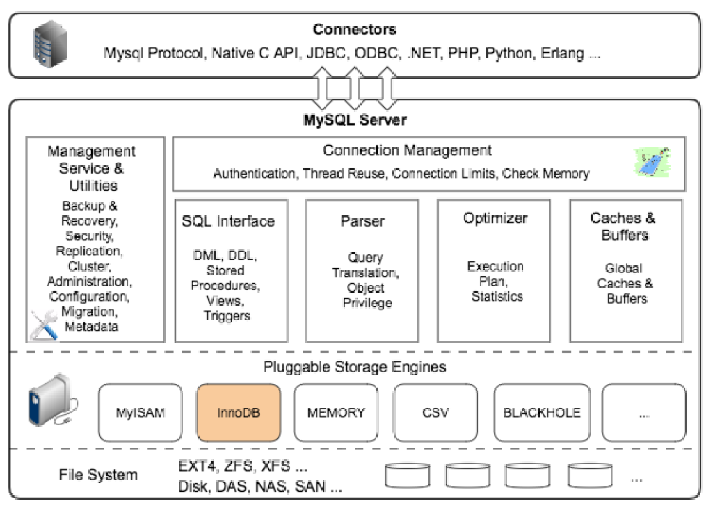

## 二、MySQL 8.0 Server层结构“新姿势”

### 1、客户端与服务器模型

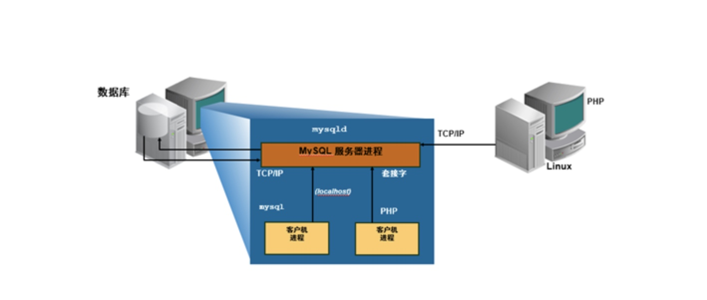

```bash
- 1.mysql是一个典型的C/S服务结构
  -  1.1 mysql自带的客户端程序（/application/mysql/bin）
    -   mysql
    -   mysqladmin
    -   mysqldump

 

- 1.2 mysqld一个二进制程序，后台的守护进程
  -  单进程
  -  多线程
```


### 2、服务连接mysql的方式

#### 1.TCP/IP的连接方式

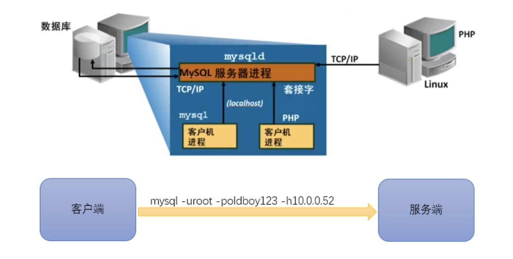

#### 2.套接字连接方式

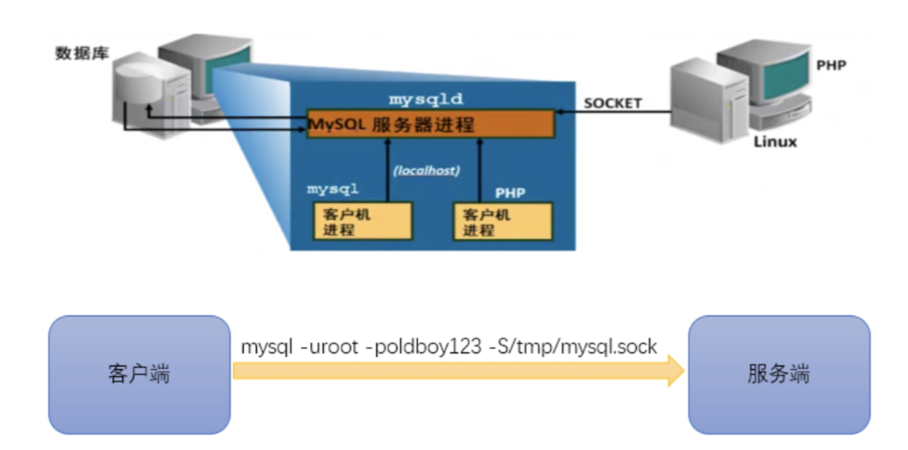

#### 3.API（应用程序开发）

>Native API
>C、PHP、JDBC、ODBC、.NET、Python、Go...

#### 4总结

```bash
TCP/IP方式（远程、本地）：
mysql -uroot -poldboy123 -h 10.0.0.51 -P3306
Socket方式(仅本地)：
mysql -uroot -poldboy123 -S /tmp/mysql.sock
```

### 3、MySQL Server

>Management Service && Utilties
>    Metadata (NEW!!)
>    Plugins(NEW!!)
>    Security (NEW!!)
>    Backup && Restore (NEW !!)
>    Replication (NEW!!)
>    Cluster(NEW!!)
>    Administration
>    Configuration
>    Migration
>Connection Management
>    Authentication (NEW!!)
>    Thread Reuse
>    Connection Limit
>    Check Memory
>SQL Interface
>    DDL(NEW!!)
>    DML
>    procedures
>    function（NEW!!）
>    view
>    triggers
>    JSON (NEW!!)
>Parser
>    Query translation
>    Object privileges
>Optimizer (NEW!!)
>    Explain Statistics
>Cache && Buffers(NEW!!)
>Engines
>    InnoDB

### 4、MySQL8新特性

>- Metadata 结构变化
>- 5.7 版本问题
>     - 两套数据字典信息（Server层 oldguo.frm，InnoDB 数据字典）
>     - DDL无原子化
>     - frm和innodb层会出现不一致
>     - 并发处理需要小心处理（MDL,dict_sys::mutex,dict_sys::rw_lock）
>     - 崩溃无法恢复
>    drop table a,c ;
>- 8.0 变化
>    - 支持事务性DDL，崩溃可以回滚，保证一致。
>         drop table a,c;
>    - 保留一份数据字典信息，取消frm数据字典。
>    - 数据字典存放至InnoDB表中
>    - 采用套锁机制，管理数据字典的并发访问（MDL）
>    - 全新的Plugin支持
>        - 8.0.17+ 加入Clone Plugin,更好的支持MGR，InnoDB Cluster的节点管理
>    - 安全加密方式改变
>        - 改变加密方式为caching_sha2_password
>        - SSL 将支持到 TLSv1.3 版本。
>    - 用户管理及认证方式改变
>        - 改变授权管理方式
>        create user xiaowu@'10.0.0.%' identified by .,..
>        - 加入role角色管理
>        - 添加更多权限
>    - 原子性DDL
>        - 支持原子性DDL
>    - Cache && Buffer的变化
>        - 取消Query Cache

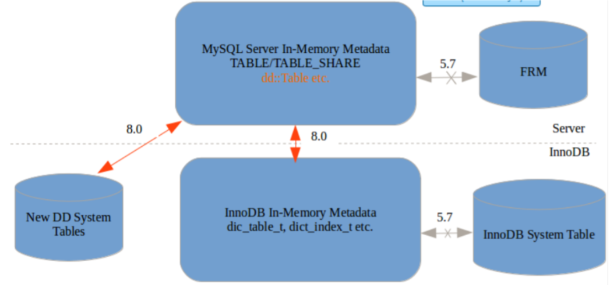

### 5、MySQL 的内存结构

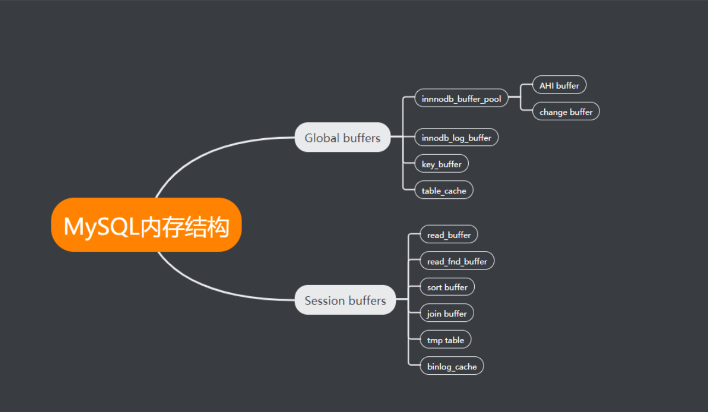

### 6、MySQL 中的线程

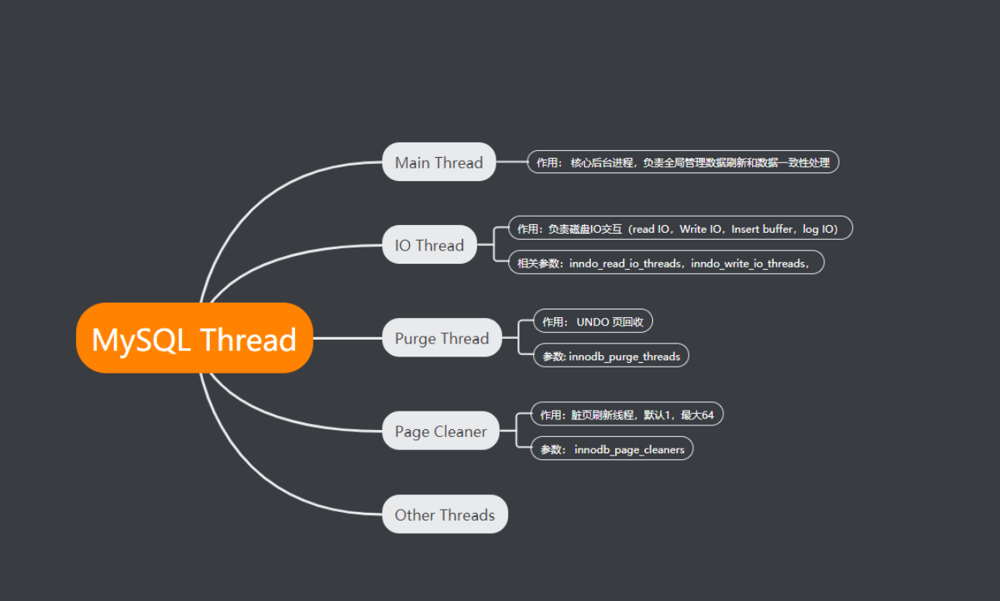

### 7、MySQL SQL语句处理逻辑

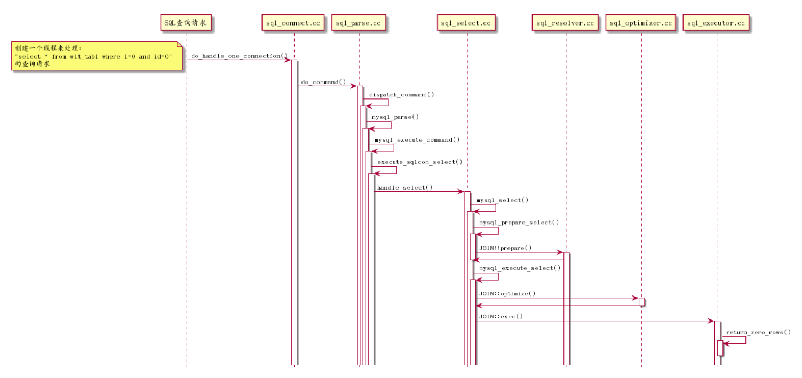


## 三、Mysql服务器的组成

### 1、工作实例

```bash
1.MySQL的后台进程+工作线程+预分配的内存结构。
2.MySQL在启动的过程中会启动后台守护进程，并生成工作线程，预分配内存结构供MySQL处理数据使用。
```


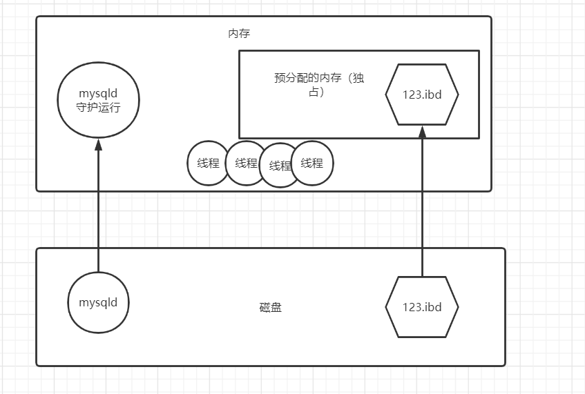


### 2、Mysqld程序结构

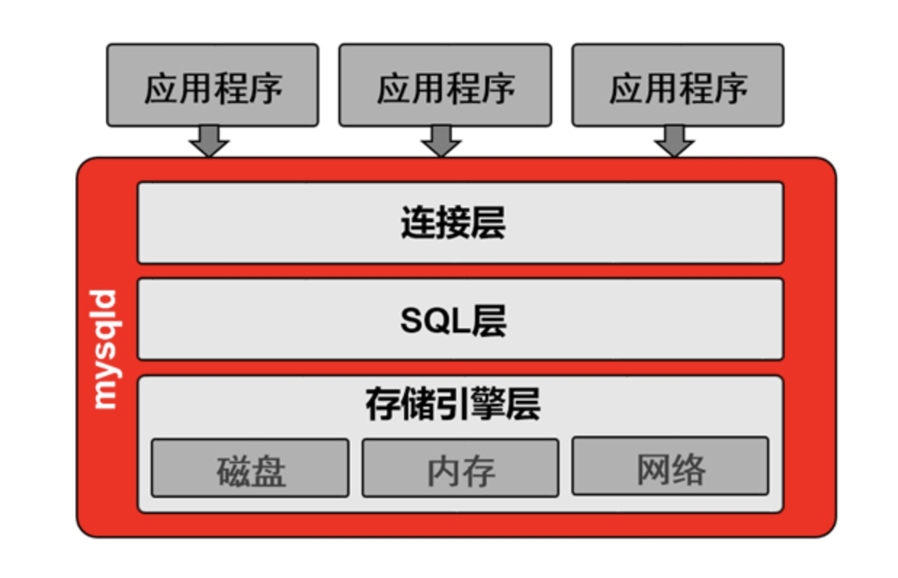

**连接层和SQL层统称为Server层**

**mysqld是一个守护进程但是本身不能自主启动：**

```bash
[root@Centos7 /service]# mysql -u root -p
Enter password: 123456

mysql> select user,host from mysql.user;
+---------------+-----------+
| user          | host      |
+---------------+-----------+
| mysql.session | localhost |
| mysql.sys     | localhost |
| root          | localhost |
+---------------+-----------+
3 rows in set (0.01 sec) 


```


#### 1.连接层

```bash
1、提供连接协议（socket、tcp/ip）
2、验证用户的合法性（用户名、密码、白名单、IP、SOCKET）
3、提供一个专用连接线程（接收SQL、返回结果），将SQL语句交给SQL层继续处理

#查看专用连接线程数量及状态
mysql> show processlist;
+----+------+-----------+------+---------+------+----------+------------------+
| Id | User | Host      | db   | Command | Time | State    | Info             |
+----+------+-----------+------+---------+------+----------+------------------+
|  2 | root | localhost | NULL | Query   |    0 | starting | show processlist |
|  4 | root | localhost | NULL | Sleep   |    4 |          | NULL             |
+----+------+-----------+------+---------+------+----------+------------------+
2 rows in set (0.00 sec)

```

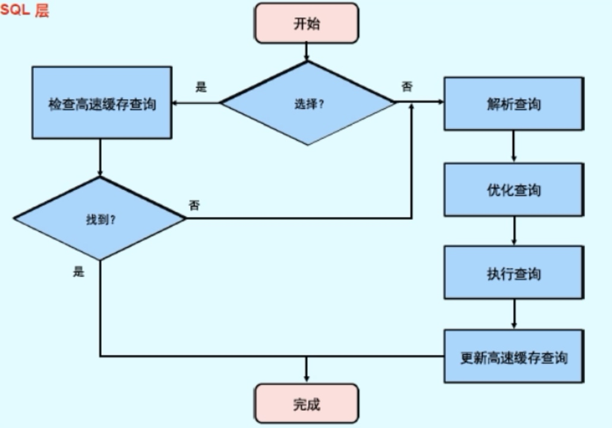


#### 2.SQL层

```bash
1、接收到SQL语句，语法判断。
2、判断语义（判断语句类型：DML、DDL、DCL、DQL）
	DDL ：数据定义语言
	DCL ：数据控制语言
	DML ：数据操作语言
	DQL： 数据查询语言
	...
3、权限验证（该用户是否有执行权限）
4、解析器：解析SQL语句，对语句执行前,进行预处理，生成解析树(执行计划),说白了就是生成多种执行方案.
4、优化器，选择他认为成本最低的执行计划。
5、执行器根据优化器的选择，按照优化器建议执行SQL语句，得到去哪儿找SQL语句需要访问的数据
	-5.1 具体：在哪个数据文件上的哪个数据页中？
	-5.2 将以上结果充送给下层继续处理
6、接收存储引擎层的数据，结构化成表的形式，通过连接层提供的专用线程，将表数据返回给用户。
7、提供查询缓存：query_cache（默认不开启，8.0版本之后不再使用）, 使用memcache 或者redis 替代
8、日志记录（binlog二进制日志，glog通用日志，默认不开启）
```


#### 3.存储引擎层：相当于linux的文件系统，和磁盘交互的模块

```bash
1、接收上层的执行结果
2、取出磁盘文件和相应数据
3、返回给SQL层，结构化之后生成表格，由专用线程返回给客户端
```

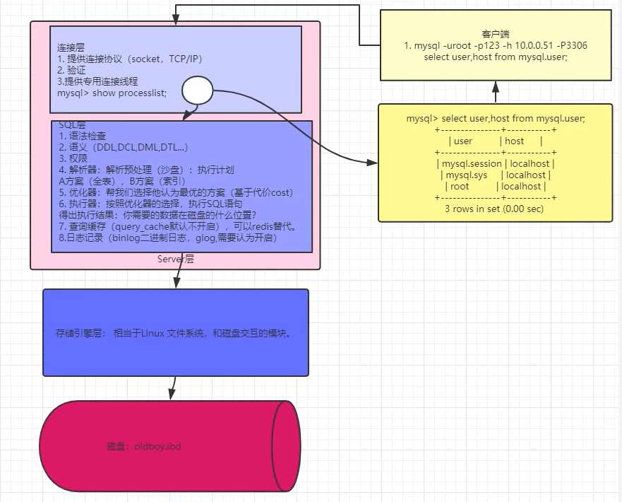

##### 1)8.0.1 ---> 8.0.19

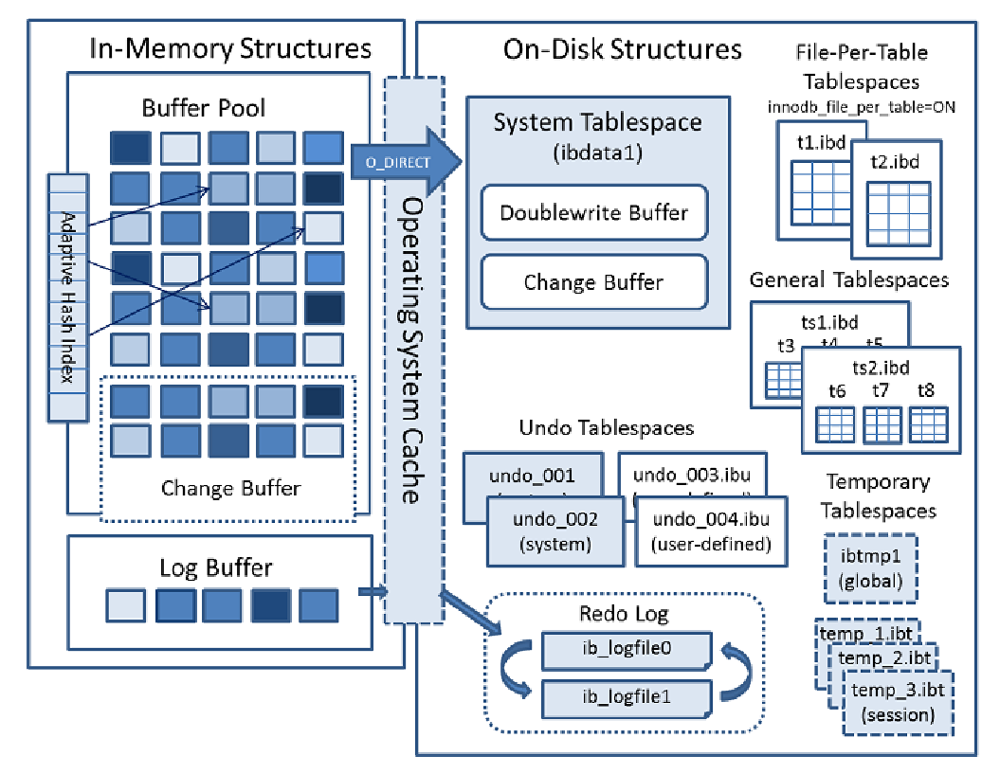

##### 2)8.0.19+

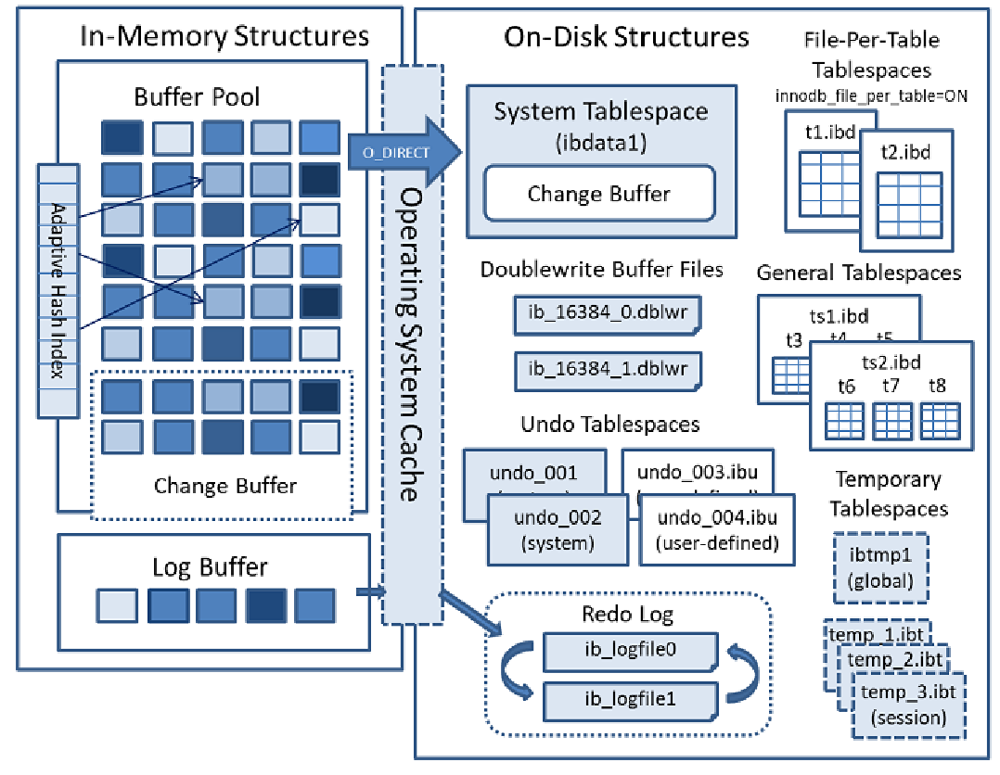


## 四、Mysql的结构


### 1、**MySQL的逻辑对象：做为管理人员或者开发人员操作的对象**


### 2、Mysql的逻辑结构：抽象结构

```bash
1、库
2、表：元数据+真实数据行
3、元数据：列+其它属性（行数+占用空间大小+权限）
4、列：列名字+数据类型+其他约束（非空、唯一、主键、非负数、自增长、默认值）
```

*最直观的数据：二维表，必须用库来存放*

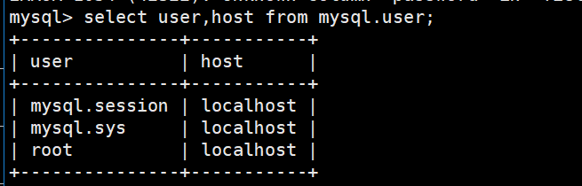


### 3、MySQL逻辑结构与Linux系统对比

| MySQL                     | Linux                          |
| :------------------------ | :----------------------------- |
| 库：库名+库属性           | 目录：目录名+目录属性          |
| show databases;           | ls-l /                         |
| use mysql                 | cd /mysql                      |
| 表：表名+表属性+表内容+列 | 文件：文件名+文件属性+文件内容 |
| show tables;              | ls                             |
| 二维表=元数据+真实数据行  | 文件=文件名+文件属性           |

 ```bash
mysql> show databases;
mysql> use mysql
mysql> show tables;
mysql> desc user;
 ```


### 4、Mysql的物理存储结构

#### 1.MySQL5.7


#### 2.MySQL8

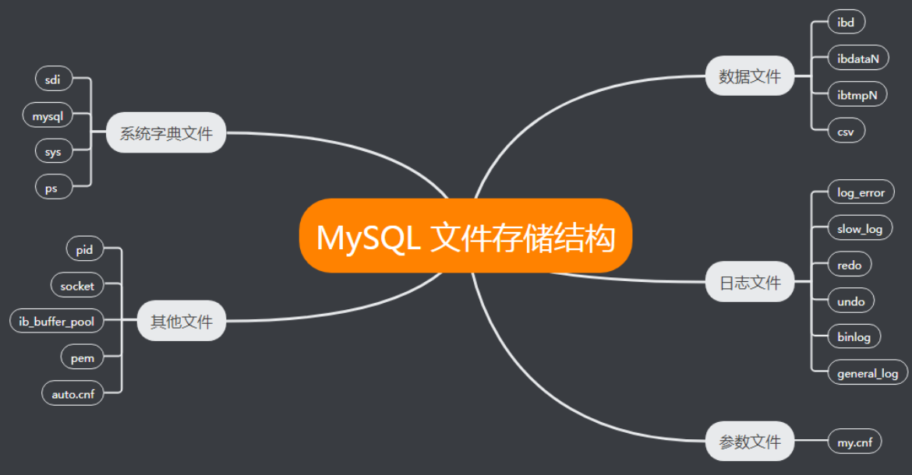


```bash
1）MySQL的最底层的物理结构是数据文件，也就是说，存储引擎层，打交道的文件，是数据文件。
2）存储引擎分为很多种类（Linux中的FS）
3）不同存储引擎的区别：存储方式、安全性、性能

表： 数据行（记录） + 元数据（表属性、表的列（列属性）、表名）
8.0 表存储方式 : 每张表的数据都存储在ibd中
5.7 表的存储方式：
    数据行 ibd
    元数据： frm + ibdata1

DDL原子性 、 Online DDL
```


### 5、段、区、页（块）

>https://dev.mysql.com/doc/refman/8.0/en/glossary.html#glos_page_size

```bash
1、段：理论上一个表就是一个段，由一个或多个区构成（多个区不一定连续），（分区表是一个分区一个段）
2、区（簇）：默认1M，连续的64个pages
3、页（pages）：最小的数据存储单元，默认是16k，由连续4个OS block组成，数据库存储引擎最小的IO单元
```


#### 一切都是为了连续的IO