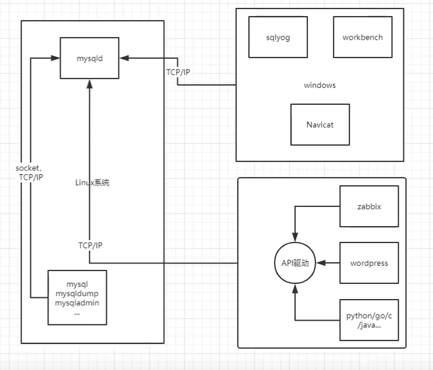
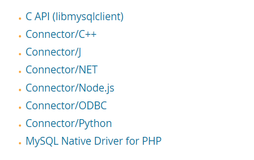
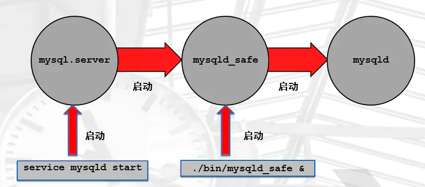

# 基础管理

## 一、用户、权限管理

### 1、用户

#### 1.作用：

```bash
linux用户：登录linux系统、管理linux逻辑结构对象（文件：一切皆文件）

mysql用户：登录mysql数据库，管理数据库逻辑对象（表）
```


#### 2.定义：

```bash
linux用户：用户名

mysql用户：
用户名@'白名单'
	白名单：地址列表，允许白名单的IP登录MySQL，管理MySQL。
	
白名单支持的方式？
wp@'localhost'	：wp用户能够通过本地登录MySQL（socket）
wp@'10.0.0.200'	：wp用户能够通过10.0.0.200远程登录MySQL服务器
wp@'10.0.0.%'	：wp用户能够通过10.0.0.%/24远程登录MySQL服务器
wp@'10.0.0.5%'	:wp用户能够通过10.0.0.(50-59)远程登录MySQL服务器
wp@'10.0.0.0/255.255.254.0' ：wp用户能够通过10.0.0.0/255.255.254.0远程登录MySQL服务器
wp@'%'  :wp用户能够通过与本机连通的主机远程登录MySQL服务器
wp@'db01' :wp用户根据本地host文件去远程登录MySQL服务器
```

#### 3.管理操作：

```bash
mysql> use mysql	#进入mysql库
mysql> show tables;		#查看库中含有的表
mysql> desc user;	#查看user表包含的列
```

**注意：8.0版本之前可以通过grant命令，建立用户和授权。8.0之后要先建用户再授权。MySQL删除用户权限随之消失，不会对数据造成影响。Oracle删除用户，用户所负责的表也会消失。所以删除操作要谨慎！**

##### 1）创建用户

```mysql
mysql> create user wp@'127.0.0.1' identified by '123';
	创建能够通过127.0.0.1登录的wp用户，密码是123
	sha2 : 8.0新的特性
    native: 兼容老版本
mysql> create user wp@'127.0.0.1' identified with mysql_native_password by '123';
```

##### 2）查

```mysql
mysql> desc mysql.user;    ---->  authentication_string
mysql> select user ,host ,authentication_string from mysql.user
	查看可以登陆数据库的用户，登陆主机，密码（加密的）
```

##### 3）改

```mysql
mysql> alter user wp@'127.0.0.1' identified by '456';
	修改密码为456
mysql> alter user wp@'127.0.0.1' identified with mysql_native_password by '456';
```

##### 4）删

```mysql
mysql> drop user oldboy@'10.0.0.%';
	删除用户
```

#### 4.用户资源管理

##### 1）密码过期时间

```mysql
select @@default_password_lifetime;
SET PERSIST default_password_lifetime = 180;
SET PERSIST default_password_lifetime = 0;
CREATE USER 'wp'@'localhost' PASSWORD EXPIRE INTERVAL 90 DAY;
ALTER USER 'wp'@'localhost' PASSWORD EXPIRE INTERVAL 90 DAY;
CREATE USER 'wp'@'localhost' PASSWORD EXPIRE NEVER;
ALTER USER 'wp'@'localhost' PASSWORD EXPIRE NEVER;
FAILED_LOGIN_ATTEMPTS N
```

>1. `SELECT @@default_password_lifetime;`
>    这个查询用于获取全局默认的密码过期时间。如果返回的结果是0，则表示密码永不过期；如果是其他正整数，则表示密码在指定的天数后过期。
>2. `SET PERSIST default_password_lifetime = 180;`
>    这个命令用于设置全局默认的密码过期时间为180天，并将这个设置持久化到配置文件中，以便重启数据库服务器后仍然有效。
>3. `SET PERSIST default_password_lifetime = 0;`
>    这个命令用于将全局默认的密码过期时间设置为0，即密码永不过期，并将这个设置持久化到配置文件中。
>4. `CREATE USER 'wp'@'localhost' PASSWORD EXPIRE INTERVAL 90 DAY;`
>    这个命令创建一个名为'wp'的用户，并设置其密码在90天后过期。
>5. `ALTER USER 'wp'@'localhost' PASSWORD EXPIRE INTERVAL 90 DAY;`
>    这个命令修改已存在的用户'wp'的密码过期策略，设置为90天后过期。
>6. `CREATE USER 'wp'@'localhost' PASSWORD EXPIRE NEVER;`
>    这个命令创建一个名为'wp'的用户，并设置其密码永不过期。
>7. `ALTER USER 'wp'@'localhost' PASSWORD EXPIRE NEVER;`
>    这个命令修改已存在的用户'wp'的密码过期策略，设置为永不过期。

##### 2）密码错误锁定

>**MySQL 8.0.19及更新版本，支持连续几次输入错误密码，锁定账户功能**
>
>**FAILED_LOGIN_ATTEMPTS**：代表尝试失败的次数
>
>**PASSWORD_LOCK_TIME**：代表锁定的时间，单位天。

###### ①创建

```mysql
CREATE USER 'test'@'%' IDENTIFIED BY '123456' FAILED_LOGIN_ATTEMPTS 2 PASSWORD_LOCK_TIME 1;
```

**注意**

>1.failed_login_attempts 和 password_lock_time 必须同时不为 0 才能生效。
>2.创建新用户不指定 failed_login_attempts 和 password_lock_time ，则默认关闭 这2个密码策略。
>3.已使用failed_login_attempts 和 password_lock_time 密码策略的用户，管理员对其 alter user 后不改变原有密码验证策略。
>4.一旦账户被锁定，即使输入正确密码也无法登录。
>5.还有最重要的一点：由于 failed_login_attempts 和 password_lock_time  对密码验证正确与否的连续性，任意一次成功登录，failed_login_attempts 和 password_lock_time密码策略  计数器重置。
>例如 failed_login_attempts 设置为 3 ，前两次密码连续输错，第三次输入正确的密码，FLTTAL 计数器重置。

###### ②解锁

>**锁定后管理员解锁账户**

```mysql
mysql -h 192.168.1.100 -u root -p
mysql> alter user test@'%' account unlock;
```

###### ③已有账户添加此策略

```mysql
UPDATE user SET User_attributes='{"Password_locking": {"failed_login_attempts": 2, "password_lock_time_days": 1}}' WHERE user='tt';
FLUSH PRIVILEGES;
```

##### 3）配置密码重用

```mysql
password_history=6
password_reuse_interval=365
```

##### 4）锁定用户

```mysql
mysql> alter user test@'%' account lock;
```

##### 5）连接资源限制

```mysql
with
MAX_QUERIES_PER_HOUR count
MAX_UPDATES_PER_HOUR count
MAX_CONNECTIONS_PER_HOUR 2000;
MAX_USER_CONNECTIONS count
```

#### 5.超级管理员密码忘记如何找回

```bash
mysqld_safe				#特殊命令，可以启动数据库加参数
--skip-grant-tables		#跳过授权表
--skip-networking		#跳过TCP/IP连接
```

##### 方式1

```bash
1、关闭数据库
systemctl stop mysql
2、使用安全模式启动
mysqld_safe --skip-grant-tables --skip-networking &
3、登录数据库
mysql
4、手工加载授权表
mysql> flush privileges;
5、修改密码
mysql>  alter user root@'localhost' identified by '123';
6、将数据库进程提出终端
pkill mysqld
7、启动数据库
systemctl start  mysqld
```

##### 方式2

```bash
1、关闭数据库
systemctl stop mysql
2、使用安全模式启动
mysqld_safe --skip-grant-tables --skip-networking &
3、登录数据库
mysql
4、手工加载授权表
mysql> flush privileges;
5、修改密码
mysql> grant all on *.* to root@'localhost' identified by '123' with grant option;
#或者update那一条N
mysql> update mysql.user set Grant_priv='Y' where user='root' and host='localhost';
mysql> update mysql.user set password=password("123") where user='root' and host='localhost';
6、将数据库进程提出终端
pkill mysqld
7、启动数据库
systemctl start  mysqld
```

#### 6.8.0用户方面的新特性

```mysql
1. 密码插件,在8.0中替换为了 sha2模式

2. 在8.0中不支持grant直接创建用户并授权，必须先建用户后grant授权。

3.当前，关于密码插件sha2带来的坑？
    客户端工具，navicat 、 sqlyog工具不支持（无法连接）
    主从复制，MGR ，不支持新的密码插件的用户
    老的驱动无法连接数据库

    解决方法：
       create with mysql_native_password
       alter with mysql_native_password

       vim /etc/my.cnf
       default_authentication_plugin=mysql_native_password
```


### 2、权限

#### 1.权限的作用：

````bash
linux权限:是对文件进行权限设置
mysql权限：是对用户的权限设置。用户对数据库对象有哪些管理能力。
````


#### 3.权限的表现方式：

````bash
linux: rwx,可读、可写、可执行
mysql: 用户可以使用哪些命令
````


```bash
mysql> show privileges;			#查看可以设置的权限

（所有可设置的权限）			（作用的对象）								（对权限的操作解释）
+-------------------------+---------------------------------------+-------------------------------------------------------+
| Privilege				  | Context                               | Comment                                               |
+-------------------------+---------------------------------------+-------------------------------------------------------+
| Alter（修改表权限）						  | Tables                                | To alter the table                                    |
| Alter routine（改变或删除存储函数/过程）	 | Functions,Procedures                  | To alter or drop stored functions/procedures          |
| Create（建库、建表、建索引）    			   | Databases,Tables,Indexes              | To create new databases and tables                    |
| Create routine（使用创建函数/过程）			| Databases                             | To use CREATE FUNCTION/PROCEDURE                      |
| Create temporary tables （使用“创建临时表”）| Databases                             | To use CREATE TEMPORARY TABLE                         |
| Create view （创建新的视图） 				  | Tables                                | To create new views                                   |
| Create user  （创建用户） 				   | Server Admin                          | To create new users                                   |
| Delete （删除已存在的数据行）			   | Tables                                | To delete existing rows                               |
| Drop    （删除库、表、视图）    			| Databases,Tables                      | To drop databases, tables, and views                  |
| Event  （创建、更改、删除和执行事件）		| Server Admin                          | To create, alter, drop and execute events             |
| Execute  （执行存储例程函数等） 			   | Functions,Procedures                  | To execute stored routines                            |
| File  （在服务器上读写文件）				   | File access on server                 | To read and write files on the server                 |
| Grant option （给其他用户授权）			 | Databases,Tables,Functions,Procedures | To give to other users those privileges you possess   |
| Index （创建或删除索引）					 | Tables                                | To create or drop indexes                             |
| Insert （在表中插入数据）				| Tables                                | To insert data into tables                            |
| Lock tables（使用锁表（与选择权限一起使用）） | Databases                             | To use LOCK TABLES (together with SELECT privilege)   |
| Process （查看当前正在执行的查询的纯文本）    | Server Admin                          | To view the plain text of currently executing queries |
| Proxy （使代理用户成为可能）					| Server Admin                          | To make proxy user possible                           |
| References （在表上有引用） 				  | Databases,Tables                      | To have references on tables                          |
| Reload （重新加载或刷新表、日志和权限）		| Server Admin                          | To reload or refresh tables, logs and privileges      |
| Replication client （询问主从服务器在哪里）  | Server Admin                          | To ask where the slave or master servers are          |
| Replication slave（从主机读取二进制日志事件） | Server Admin                          | To read binary log events from the master             |
| Select（从表中检索行） 					   | Tables                                | To retrieve rows from table                           |
| Show databases （查看所有数据库）			  | Server Admin                          | To see all databases with SHOW DATABASES              |
| Show view （查看视图的步骤）                 | Tables                                | To see views with SHOW CREATE VIEW                    |
| Shutdown （关闭服务器） 						| Server Admin                          | To shut down the server                               |
| Super（使用KILL thread、SET GLOBAL、CHANGE MASTER等）| Server Admin                  | To use KILL thread, SET GLOBAL, CHANGE MASTER, etc.   |
| Trigger（使用触发器）					    | Tables                                | To use triggers                                       |
| Create tablespace （创建/更改/删除表空间）    | Server Admin                          | To create/alter/drop tablespaces                      |
| Update（更新现有行） 						| Tables                                | To update existing rows                               |
| Usage（无权限登录-仅允许连接） 					  | Server Admin                          | No privileges - allow connect only                    |
+-------------------------+---------------------------------------+-------------------------------------------------------+

```

**注：ALL包括大部分权限并不是全部**


#### 4.权限管理的操作：

##### 语法：

```bash
8.0之前：
	grant 权限 on 对象 to 用户 identified by '密码';
	grant 权限1,权限2,权限3... on 对象 to 用户 identified by '密码';
8.0之后：
	create user 用户 identified by '密码';
	grant 权限 on 对象 to 用户;
	grant 权限1,权限2,权限3... on 对象 to 用户;
```


##### 权限：

```bash
ALL:SELECT,INSERT, UPDATE, DELETE, CREATE, DROP, RELOAD, SHUTDOWN, PROCESS, FILE, REFERENCES, INDEX, ALTER, SHOW DATABASES, SUPER, CREATE TEMPORARY TABLES, LOCK TABLES, EXECUTE, REPLICATION SLAVE, REPLICATION CLIENT, CREATE VIEW, SHOW VIEW, CREATE ROUTINE, ALTER ROUTINE, CREATE USER, EVENT, TRIGGER, CREATE TABLESPACE
ALL							#以上所有权限，一般是管理员才拥有的
权限1,权限2,权限3...		   #普通用户
grant option				#超级管理员，给别的用户授权
	grant 权限1,权限2,权限3... on 对象 to 用户 with grant option;
```

**注意：不要随意授权grant option，不然该用户可以在服务器中为所欲为，包括删除自带的超级管理员（root@localhost）**

##### 对象： 库、表（作用范围）

````bash
*.*                  #所有库所有表，一般是对管理员
wordpress.*          #wordpress库下所有表，开发和应用用户，
wordpress.t1		 #wordpress库下t1表
````


##### MySQL授权表：

```bash
user		#用户对mysql服务的权限
db			#用户对某个库的权限
tables_priv		#用户对某个表的权限
columns_priv 	#用户对某列的权限

查询所有用户对mysql服务的权限
select * from mysql.user\G

查询所有用户对库的权限
select * from mysql.db\G

查询所有用户对某个表的权限
select * from mysql.tables_priv\G

查询所有用户对某列的权限
select * from mysql.columns_priv\G
```


##### 练习

需求1：创建管理员用户，windows机器的navicat登录到linux中的MySQL

```bash
mysql> grant all on *.* to root@'%' identified by 'root1qaz@WSX' with grant option;

查询创建的用户：
mysql> select user,host,authentication_string from mysql.user;

查询某个用户的权限：
mysql> show grants for root@'10.0.0.%';
+--------------------------------------------------------------------+
| Grants for root@10.0.0.%                                           |
+--------------------------------------------------------------------+
| GRANT ALL PRIVILEGES ON *.* TO 'root'@'10.0.0.%' WITH GRANT OPTION |
+--------------------------------------------------------------------+

查询所有用户对mysql服务的权限
select * from mysql.user\G

查询所有用户对库的权限
select * from mysql.db\G

查询所有用户对某个表的权限
select * from mysql.tables_priv\G

查询所有用户对某列的权限
select * from mysql.columns_priv\G

```

**练习**

```bash
grant all on wordpress.* to wordpress@'127.%' identified by 'EWR8FtSPMnrDppxF';
```


需求2：创建一个应用用户app用户，能从windows上登录mysql，能够对app库下所有对象进行create，select，update，delete，insert操作

```bash
mysql> grant create,update,select,insert,delete on app.* to app@'10.0.0.%' identified by '123';

mysql> show grants for app@'10.0.0.%';
+-----------------------------------------------------------------------------+
| Grants for app@10.0.0.%                                                     |
+-----------------------------------------------------------------------------+
| GRANT USAGE ON *.* TO 'app'@'10.0.0.%'                                      |
| GRANT SELECT, INSERT, UPDATE, DELETE, CREATE ON `app`.* TO 'app'@'10.0.0.%' |
+-----------------------------------------------------------------------------+
2 rows in set (0.00 sec)
```


##### 回收权限

```bash
linux:
chmod -R 644 /data	----> chmod -R 755 /data

MySQL:
MySQL中不能通过重复授权，修改权限，只能通过回收权限的方式进行修改

回收'app'@'10.0.0.%'对app库的create权限
revoke create on app.* from 'app'@'10.0.0.%';

添加'app'@'10.0.0.%'对app库的create权限
grant create on app.* to app@'10.0.0.%';

```

#### 5.角色

```mysql
mysql> create role dev@'10.0.0.%';
mysql> grant select on *.* to dev@'10.0.0.%';
mysql> grant dev to user2@'10.0.0.%';


mysql.role_edges;
information_schema.user_privileges;
```

#### 6.生产中的权限规范

```mysql
管理员 : ALL
开发 : Create ,Create routine,Create temporary tables,Create view,Delete ,Event
,Execute,Insert ,References,Select,Show databases ,Show view ,Trigger,Update
监控 : select , replication slave , client supper
备份 : ALL
主从 : replication slave
业务 : insert , update , delete ,select
```


## 二、连接管理

### 1、常见连接方法



#### 1.MySQL自带客户端

mysql：

````bash
MySQL常见参数：
	-u                   用户
	-p                   密码
	-h                   IP
	-P                   端口
	-S                   socket文件
	-e                   免交互执行命令
	<                    导入SQL脚本
	
socket：
	前提：数据库中必须实现授权 wp@'localhost'用户
	
	mysql -uwp -p123 -S /tmp/mysql.sock
	mysql -uwp -p -S /tmp/mysql.sock	#推荐方式
	mysql -p -S /tmp/mysql.sock
	mysql
	mysql -uroot -p123
	
    [root@Centos7 ~]# mysql -uroot -p -e "select user,host from mysql.user;"
    Enter password: 
    +------+-----------+
    | user | host      |
    +------+-----------+
    | root | 10.0.0.%  |
    | root | localhost |
    +------+-----------+

    [root@Centos7 ~]# mysql -uroot -p -S /service/mysql/tmp/mysql.sock


tcp/ip:
	前提：必须提前创建好，可以远程连接的用户（例如：wp@'10.0.0.%'）
	mysql -uwp -p123 -h 10.0.0.51 -P3306
	mysql -uwp -p -h 10.0.0.51 -P3306
	mysql -uwp -p -h 10.0.0.51
	
	[root@Centos7 ~]# mysql -uwp -p123 -h 10.0.0.204 -P3306
	[root@Centos7 ~]# mysql -uwp -p -h 10.0.0.204 -P3306
	[root@Centos7 ~]# mysql -uwp -p -h 10.0.0.204
	
	mysql> select user,host from mysql.user;
    +------+-----------+
    | user | host      |
    +------+-----------+
    | root | 10.0.0.%  |
    | wp   | 10.0.0.%  |
    | root | localhost |
    +------+-----------+

判断连接类型：
	mysql> show processlist;
    +----+------+----------------+-------+---------+------+----------+------------------+
    | Id | User | Host           | db    | Command | Time | State    | Info             |
    +----+------+----------------+-------+---------+------+----------+------------------+
    |  6 | root | 10.0.0.1:65014 | NULL  | Sleep   | 9663 |          | NULL             |
    |  7 | root | 10.0.0.1:65016 | sys   | Sleep   | 9652 |          | NULL             |
    |  8 | root | 10.0.0.1:65017 | mysql | Sleep   |  180 |          | NULL             |
    | 11 | root | localhost      | NULL  | Sleep   |  703 |          | NULL             |
    | 15 | wp   | Centos7:38890  | NULL  | Query   |    0 | starting | show processlist |
    | 16 | root | 10.0.0.1:50930 | mysql | Sleep   |  179 |          | NULL             |
    +----+------+----------------+-------+---------+------+----------+------------------+
  
-e参数：
	[root@Centos7 ~]# mysql -uroot -p -e "select user,host from mysql.user;"
    Enter password: 
    +------+-----------+
    | user | host      |
    +------+-----------+
    | root | 10.0.0.%  |
    | wp   | 10.0.0.%  |
    | root | localhost |
    +------+-----------+

[root@Centos7 ~]# mysql -uroot -p <world.sql
Enter password: 

world.sql下载链接
链接：https://pan.baidu.com/s/1Q7yF3kRc7FJwqyBAB_sVnQ 
提取码：0sbp 
````

mysqldump：备份工具

mysqladmin：管理工具

#### 2.MySQL远程客户端程序（开发工具）

前提：必须提前创建好，可以远程连接的用户（例如：wp@'10.0.0.%'）

#### 3.程序连接

yum install -y php-mysql	#php连接mysql的驱动



#### 4.SSL

```mysql
mysql> show variables like '%ssl%';
+--------------------+-----------------+
| Variable_name | Value |
+--------------------+-----------------+
| have_openssl | YES |
| have_ssl | YES |
| mysqlx_ssl_ca | |
| mysqlx_ssl_capath | |
| mysqlx_ssl_cert | |
| mysqlx_ssl_cipher | |
| mysqlx_ssl_crl | |
| mysqlx_ssl_crlpath | |
| mysqlx_ssl_key | |
| ssl_ca | ca.pem |
| ssl_capath | |
| ssl_cert | server-cert.pem |
6. MySQL 8.0初始化配置方式
6.1 初始化配置方式
6.2 初始化配置文件应用
| ssl_cipher | |
| ssl_crl | |
| ssl_crlpath | |
| ssl_fips_mode | OFF |
| ssl_key | server-key.pem |
+--------------------+-----------------+
17 rows in set (0.01 sec)
```

```bash
[root@db01 data]# mysql_ssl_rsa_setup
mysql -uroot -p123 -h10.0.0.51 --ssl-cert=/data/mysql/data_3306/client-cert.pem
--ssl-key=/data/mysql/data_3306/client-key.pem
```

## 三、MySQL 8.0初始化配置方式

### 1、模板

```bash
[标签]
配置=xxx
配置=xxx
配置=xxx
[标签]
...
标签:
server:
[server]
[mysqld]
[mysqld_safe]
client(不影响远程):
[client]
[mysql]
[mysqldump
```

### 2、示例

>/etc/my.cnf

```bash
[mysqld]
user=mysql                        #管理用户
#basedir=/usr/local/mysql57
basedir=/usr/local/mysql8         #软件路径
datadir=/data/mysql/data_3306     #数据路径
socket=/tmp/mysql.sock            #socket文件位置
server_id=6                       #服务器ID,主从时标识不同主机
log_bin=/data/mysql/binlog_3306   #二进制日志
port=3306                         #端口
[mysql]
socket=/tmp/mysql.sock
```

### 3、配置文件

#### 1.调用非默认路径配置文件方法

```bash
mysqld_safe --defaults-file=/opt/xiaowu.cnf &
```

#### 2.配置文件默认读取路径

```bash
mysqld --help --verbose |grep my.cnf
/etc/my.cnf /etc/mysql/my.cnf /usr/local/mysql/etc/my.cnf ~/.my.cnf
```


## 四、多种启动方式

### 1、启动方式介绍

#### 1.服务正常启动

>systemd ---->/etc/init.d/mysqld ----->mysql.server-------> mysqld_safe & ---->mysqld &



#### 2.排故方式启动

```bash
mysqld &
启动日志全部会打印到屏幕 ----> 可以进行问题排查
```

#### 3.异常crash启动

```bash
mysqld_safe &
当mysqld 异常crash会尝试去启动mysqld
```

### 2、数据库关闭

```mysql
mysqladmin -uroot -p123 shutdown

shutdown;
```

#### 注：

```bash
1、以上多种方式，都可以单独启动MySQL服务
2、mysqld_safe和mysqld一般是在临时维护时使用。
3、另外，从Centos 7系统开始，支持systemd直接调用mysqld的方式进行启动数据
```

## 五、MySQL 8.0 的工具日志配置管理

>error log ： 错误日志
>genernal log ： 普通日志
>binlog ： 二进制日志
>slow log ： 慢日志

### 1、错误日志

#### 1.作用

>从启动开始，发生过的error，warning，note信息。
>
>定位数据库问题：报错，异常（死锁）。

#### 2.配置

```bash
log_error=$DATDDIR/hostname.err
```

>看日志： 主要关注 [ERROR],deadlock

### 2、二进制日志（binlog）

#### 1.作用

>数据恢复（PITR）
>复制

#### 2.配置方法

```bash
基础参数：
server_id = 大于0的值，如果是主从复制，需各节点不同Server_id
log_bin= /data/mysql/binlog3306/mysql-bin
定制参数：
max_binlog_size --> 单个binlog文件大小，默认是1G，512M ,256M
max_binlog_cache_size
binlog_expire_logs_seconds ---> 8.0之后的参数，默认30天。
binlog_format ——--> ROW
sync_binlog=1 ---->
```

>面试题：
>1、双一
>sync_binlog=1
>控制biong 从 内存到磁盘刷新的机制
>1代表的是，每次事务提交都立即刷新到磁盘区域。
>0代表的是，由OS来决定什么时候刷新
>
>2、 binlog_format = row , statement , mixed
>基础操作：
>show binary logs;
>flush logs;
>show master status ;

### 3、慢日志（slow_log）

#### 1.作用

>记录MySQL工作中，运行较慢的语句。用来定位SQL语句性能问题。

#### 2.配置方法

```bash
开关：
slow_query_log=1
slow_query_log_file=
维度：
set global long_query_time=0.5
set global log_queries_not_using_indexes=1
set global log_throttle_queries_not_using_indexes=1000;
```

### 4、general_log

#### 1.介绍

>普通日志，会记录所有数据库发生的事件及语句。

#### 2.配置

```bash
select @@general_log;
set global general_log=1
```

## 六、MySQL的升级

### 1、升级方式介绍

#### 1.INPLACE就地升级

>在一台服务器上，原版本升级到新版本。
>风险较大。
>除非是主从环境。
>**** 建议 ： 不管哪种方式升级，都应该先做了冷备。方便失败回退。****

#### 2.Mergeing(logical)迁移

>逻辑备份方式
>主从方式
>
>野路子（掩耳盗铃过安测）：
>strings /usr/local/mysql56/bin/mysqld | grep 5.6.50
>
>sed -i 's/5.6.50/5.6.55/' /usr/local/mysql56/bin/mysqld

### 2、升级注意事项

```bash
Upgrade is only supported between General Availability (GA) releases.
Upgrade from MySQL 5.6 to 5.7 is supported. Upgrading to the latest release is recommended before upgrading to the next version. For example, upgrade to the latest MySQL 5.6 release before upgrading to MySQL 5.7.
Upgrade that skips versions is not supported. For example, upgrading directly from MySQL 5.5 to 5.7 is not supported.
Upgrade within a release series is supported. For example, upgrading from MySQL 5.7.x to 5.7.y is supported. Skipping a release is also supported. For example, upgrading from MySQL 5.7.x to 5.7.z is supported.


a. 支持GA版本之间升级
b. 5.6--> 5.7 ,先将5.6升级至最新版，再升级到5.7
c. 5.5 ---> 5.7 ,先将5.5 升级至最新，再5.5---> 5.6最新，再5.6--->5.7 最新
d. 回退方案要提前考虑好，最好升级前要备份(特别是往8.0版本升级)。
e. 降低停机时间（停业务的时间）,在业务不繁忙期间升级，做好足够的预演。
```

### 3、INPLACE 升级过程原理 （生产思路）

```bash
a. 安装新版本软件
b. 关闭原数据库业务（挂维护页） innodb_fast_shutdown=0，关闭数据库。
c. 备份原数据库数据（冷备）
d. 使用新版本软件 “挂” 旧版本数据启动(--skip-grant-tables ,--skip-networking)
e. 升级 ： 只是升级系统表。升级时间和数据量无关的。
f. 正常重启数据库。
g. 验证各项功能是否正常。
h. 业务恢复。

建议： inpalce升级最好是主从环境，先从库再主库。
```

### 4、5.6.50 ----> 5.7.32 Inplace 升级演练

#### 1.安装 新版本软件

#### 2.停止业务，挂维护页面

#### 3.旧版本数据库停止数据库

##### 1）连接数据库

```bash
mysql -S /tmp/mysql3356.sock
```

##### 2）断开所有客户端连接

```mysql
show processlist;

select concat('kill ',id,";") from information_schema.processlist;
```

##### 3）关闭快速关闭数据库功能

>确保所有数据落盘

```mysql
set global innodb_fast_shutdown=0;
```

##### 4）关闭数据库

```bash
/usr/local/mysql56/bin/mysqladmin -S /tmp/mysql3356.sock shutdown
```

#### 4.备份

>cp、scp、rsync
>
>磁盘快照、存储快照
>
>跨盘备份
>
>不同路径备份
>
>跨主机备份

#### 5.旧版数据使用新版软件启动

>cat /data/3356/my.cnf

```bash
[mysqld]
user=mysql
basedir=/usr/local/mysql57
datadir=/data/3356/data
socket=/tmp/mysql3356.sock
server_id=56
port=3356
```

#### 6.临时启动用于升级

```bash
/usr/local/mysql57/bin/mysqld_safe --defaults-file=/data/3356/my.cnf --skip-grant-tables --skip-networking &
```

#### 7.升级

```bash
/usr/local/mysql57/bin/mysql_upgrade -S /tmp/mysql3356.sock --force
```

#### 8.关机，并正常启动

````bash
mysql -S /tmp/mysql56.sock
mysql> shutdown;


/usr/local/mysql57/bin/mysqld_safe --defaults-file=/etc/my3356.cnf &
````

#### 9.测试

>灰度？
>业务功能小批量测试？接口测试？

### 5、将5.7 升级至 8.0

>升级差异

```bash
 新特性：
1、 mysql-shell工具，8.0以后，可以调用这个命令，升级之前的预检查。
例子：
[root@db01 ~]# mysqlsh root:123@10.0.0.51:3306 -e "util.checkForServerUpgrade()"

2、升级时不再需要手工 mysql_upgrade，升级功能集成到软件中。

3、限制：升级前必须要备份。否则无法回退。
```

#### 1.预检查

##### 1）下载mysql-shell，并安装

###### ①下载

>mysql-shell要和mysqld8的版本一致
>
>https://downloads.mysql.com/archives/

###### ②安装

```bash
yum install -y mysql-shell-8.0.24-1.el7.x86_64.rpm

# 或者

tar xf mysql-shell-8.0.24-linux-glibc2.12-x86-64bit.tar.gz
ln -s /opt/mysql-shell-8.0.24-linux-glibc2.12-x86-64bit /usr/local/mysqlsh
```

###### ③环境变量配置

>vim /etc/profile

```bash
export PATH=/usr/local/mysqlsh/bin:$PATH
```

>source /etc/profile

##### 2）创建连接用户

>mysql -S /tmp/mysql3357.sock

```mysql
grant all on *.* to root@'10.0.0.%' identified by '123';
```

##### 3）预检查

```mysql
mysqlsh root:123@10.0.0.51:3357 -e "util.checkForServerUpgrade()" >/tmp/up.log

# 或者

./mysqlsh -S /tmp/mysql57.sock -e "util.checkForServerUpgrade()"
```

#### 2.安装 新版本软件

#### 3.停止业务，挂维护页面

#### 4.旧版本数据库停止数据库

##### 1）连接数据库

```bash
mysql -S /tmp/mysql3356.sock
```

##### 2）断开所有客户端连接

```mysql
show processlist;

select concat('kill ',id,";") from information_schema.processlist;
```

##### 3）关闭快速关闭数据库功能

>确保所有数据落盘

```mysql
set global innodb_fast_shutdown=0;
```

##### 4）关闭数据库

```bash
/usr/local/mysql56/bin/mysqladmin -S /tmp/mysql3356.sock shutdown
```

#### 5.备份

>cp、scp、rsync
>
>磁盘快照、存储快照
>
>跨盘备份
>
>不同路径备份
>
>跨主机备份

#### 6.旧版数据使用新版软件启动

>cat /data/3357/my.cnf

```bash
[mysqld]
user=mysql
basedir=/usr/local/mysql8
datadir=/data/3357/data
socket=/tmp/mysql3357.sock
server_id=57
port=3357
```

#### 7.升级

```bash
/usr/local/mysql/bin/mysqld_safe --defaults-file=/data/3357/my.cnf --skip-grant-tables --skip-networking &
```

#### 8.检查

>1.数据目录是否变更

#### 9.关机，并正常启动

````bash
mysql -S /tmp/mysql56.sock
mysql> shutdown;


/usr/local/mysql57/bin/mysqld_safe --defaults-file=/etc/my3356.cnf &
````

#### 10.测试

>灰度？
>业务功能小批量测试？接口测试？

## 七、MySQL的降级

### 1、限制

```bash
官方解释：
https://dev.mysql.com/doc/refman/5.7/en/downgrade-paths.html
Downgrade from MySQL 5.7 to 5.6 is supported using the logical downgrade method.

https://dev.mysql.com/doc/refman/5.7/en/downgrade-binary-package.html#downgrade-procedure-inplace
In-place downgrade is supported for downgrades between GA releases within the same release series(5.7.y ---> 5.7.x).
```

### 2、MySQL 5.7.30 TO 5.7.10 inplace downgrade演练

#### 1.规划

>原版本：
>软件： 5.7.30 /usr/local/mysql + 数据：/data/3306/data
>目标版本： 5.7.10 /usr/local/mysql5710

#### 2.安装 5.7.10 （低） 二进制版本

```bash
ln -s mysql-5.7.10-linux-glibc2.5-x86_64 mysql5710
```

#### 3.针对5730版本（高）进行处理工作

>https://dev.mysql.com/doc/refman/5.7/en/downgrading-to-previous-series.html

#### 4.配置文件备份后差异更改或删除

```bash
cp /etc/my.cnf.bak /etc/my.cnf

/etc/init.d/mysqld restart
```

#### 5.数据库字段更改

>/usr/local/mysql/bin/mysql -uroot -p123456 -S /tmp/mysql.sock

```mysql
set sql_mode='STRICT_TRANS_TABLES,ERROR_FOR_DIVISION_BY_ZERO,NO_AUTO_CREATE_USER,NO_ENGINE_SUBSTITUTION';
set global sql_mode='STRICT_TRANS_TABLES,ERROR_FOR_DIVISION_BY_ZERO,NO_AUTO_CREATE_USER,NO_ENGINE_SUBSTITUTION';
select @@sql_mode;
ALTER TABLE mysql.proc MODIFY definer char(77) CHARACTER SET utf8 COLLATE utf8_bin NOT NULL DEFAULT '';
ALTER TABLE mysql.event MODIFY definer char(77) CHARACTER SET utf8 COLLATE utf8_bin NOT NULL DEFAULT '';
ALTER TABLE mysql.tables_priv MODIFY Grantor char(77) COLLATE utf8_bin NOT NULL DEFAULT '';
ALTER TABLE mysql.procs_priv MODIFY Grantor char(77) COLLATE utf8_bin NOT NULL DEFAULT '';
```

#### 6.优雅的关闭5.7.30（高）

```bash
/usr/local/mysql/bin/mysql -uroot -p123456 -S /tmp/mysql.sock
set global innodb_fast_shutdown=0 ;

/usr/local/mysql/bin/mysqladmin -uroot -p123456 shutdown
```

#### 7.删除ib_logfile*

```bash
rm -rf /data/3306/data/ib_logfile*
```

#### 8.配置文件替换

>vim /etc/my.cnf

```bash
[mysqld]
user=mysql
basedir=/usr/local/mysql5710
#basedir=/usr/local/mysql
datadir=/data/3306/data
socket=/tmp/mysql.sock

[mysql]
socket=/tmp/mysql.sock
```

#### 9.低版本启动高版本数据库

```bash
/usr/local/mysql5710/bin/mysqld --skip-grant-tables --skip-networking &
```

#### 10.执行upgrade

```bash
/usr/local/mysql5710/bin/mysql_upgrade -uroot -p123456 --force
```

#### 11.重启为正常模式

```ba
/etc/init.d/mysqld restart
```

### 3、MySQL 5.7.30 TO 5.6.46 logical downgrade演练

#### 1.安装5.6.46二进制版本软件，环境准备

#### 2.处理5.7.30高版本数据

```mysql
set sql_mode='STRICT_TRANS_TABLES,ERROR_FOR_DIVISION_BY_ZERO,NO_AUTO_CREATE_USER,NO_ENGINE_SUBSTITUTION';
set global sql_mode='STRICT_TRANS_TABLES,ERROR_FOR_DIVISION_BY_ZERO,NO_AUTO_CREATE_USER,NO_ENGINE_SUBSTITUTION';
select @@sql_mode;
ALTER TABLE mysql.proc MODIFY definer char(77) CHARACTER SET utf8 COLLATE utf8_bin NOT NULL DEFAULT '';
ALTER TABLE mysql.event MODIFY definer char(77) CHARACTER SET utf8 COLLATE utf8_bin NOT NULL DEFAULT '';
ALTER TABLE mysql.tables_priv MODIFY Grantor char(77) COLLATE utf8_bin NOT NULL DEFAULT '';
ALTER TABLE mysql.procs_priv MODIFY Grantor char(77) COLLATE utf8_bin NOT NULL DEFAULT '';
ALTER TABLE mysql.tables_priv MODIFY User char(16) NOT NULL default '';
ALTER TABLE mysql.columns_priv MODIFY User char(16) NOT NULL default '';
ALTER TABLE mysql.user MODIFY User char(16) NOT NULL default '';
ALTER TABLE mysql.db MODIFY User char(16) NOT NULL default '';
ALTER TABLE mysql.procs_priv MODIFY User char(16) binary DEFAULT '' NOT NULL;
ALTER TABLE mysql.user ADD Password char(41) character set latin1 collate latin1_bin NOT NULL default '' AFTER user;
UPDATE mysql.user SET password = authentication_string WHERE LENGTH(authentication_string) = 41 AND plugin = 'mysql_native_password';
UPDATE mysql.user SET authentication_string = '' WHERE LENGTH(authentication_string) = 41 AND plugin = 'mysql_native_password';
ALTER TABLE mysql.help_category ENGINE='MyISAM' STATS_PERSISTENT=DEFAULT;
ALTER TABLE mysql.help_keyword ENGINE='MyISAM' STATS_PERSISTENT=DEFAULT;
ALTER TABLE mysql.help_relation ENGINE='MyISAM' STATS_PERSISTENT=DEFAULT;
ALTER TABLE mysql.help_topic ENGINE='MyISAM' STATS_PERSISTENT=DEFAULT;
ALTER TABLE mysql.time_zone ENGINE='MyISAM' STATS_PERSISTENT=DEFAULT;
ALTER TABLE mysql.time_zone_leap_second ENGINE='MyISAM' STATS_PERSISTENT=DEFAULT;
ALTER TABLE mysql.time_zone_name ENGINE='MyISAM' STATS_PERSISTENT=DEFAULT;
ALTER TABLE mysql.time_zone_transition ENGINE='MyISAM' STATS_PERSISTENT=DEFAULT;
ALTER TABLE mysql.time_zone_transition_type ENGINE='MyISAM' STATS_PERSISTENT=DEFAULT;
ALTER TABLE mysql.plugin ENGINE='MyISAM' STATS_PERSISTENT=DEFAULT;
ALTER TABLE mysql.servers ENGINE='MyISAM' STATS_PERSISTENT=DEFAULT;
ALTER TABLE mysql.user MODIFY plugin CHAR(64) COLLATE utf8_bin
DEFAULT 'mysql_native_password';
DROP DATABASE sys;
```

#### 3.逻辑全备5.7.30数据

```mysql
mysqldump -A >/tmp/full.sql
```

#### 4.MySQL5.6.46环境准备

#### 5.恢复备份数据到5.6.46中

```mysql
source /tmp/full.sql
```

