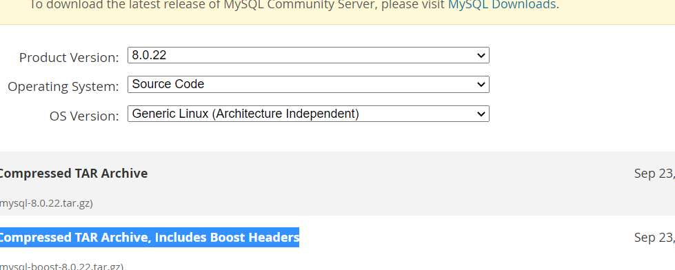

# 初始化配置

## 一、作用

````bash
1、控制MySQL的启动
2、影响到客户端的连接
````


## 二、方法

```bash
源码安装		#变异过程中设置初始化参数
配置文件		#数据库启动之前，设定配置文件参数。 /etc/my.cnf
启动脚本命令行		#mysql_safe --skip-grant-tables --skip-networking &
```


## 三、初始配置文件

### 1、初始化配置文件的默认读取路径

```bash
[root@Centos7 ~]# mysqld --help --verbose |grep my.cnf
/etc/my.cnf /etc/mysql/my.cnf /service/mysql-5.7.28/etc/my.cnf ~/.my.cnf 
                      my.cnf, $MYSQL_TCP_PORT, /etc/services, built-in default

注:
默认情况下，MySQL启动时，会依次读取以上配置文件，如果有重复选项，会以最后一个文件设置的为准。
但是，如果启动时加入了--defaults-file=xxxx时，以上的所有文件都不会读取.
	mysqld --defaults-file=/data/3306/my.cnf &
	mysqld_safe --defaults-file=/data/3306/my.cnf &
```


### 2、配置文件的书写格式

```bash
[标签]	#区分不同程序的参数
配置项=xxxx

标签类型：服务端、客户端
服务器端标签：			#影响数据库服务端运行
[mysqld]
[mysqld_safe]
[server]

客户端标签：			#影响本地客户端连接，不影响远程客户端服务端
[mysql]
[mysqldump]
[client]

配置文件的示例展示：
[root@db01 ~]# cat /etc/my.cnf
[mysqld]							#服务器标签
user=mysql							#数据库管理的用户
basedir=/app/mysql					#软件安装的位置
datadir=/data/mysql					#数据存放的位置
socket=/tmp/mysql.sock				#套接字文件
server_id=6							#标识节点的唯一编号（主从有用）
port=3306							#端口号
log_error=/data/mysql/mysql.log		#错误日志存放位置
[mysql]								#客户端标签
socket=/tmp/mysql.sock				#读取套接字文件的位置
prompt=Master [\\d]>				#指定数据库名称
```


# mysql启动和关闭

## 1、多种启动方式


注：

```bash
1、以上多种方式，都可以单独启动MySQL服务
2、mysqld_safe和mysqld可以临时设定参数，一般是在临时维护时使用。（--skip-grant-tables、--skip-networking、--default-files）
3、另外，从Centos 7系统开始，支持systemd直接调用mysqld的方式进行启动数据库
```


## 2、关闭方式

```bash
service mysqld stop
systemctl stop mysqld
/etc/init.d/mysqld stop
 mysqladmin -uroot -p123 shutdown
 mysql -uroot -p123 -e "shutdown"
```


# mysql多实例

## 1、同版本多实例（3个）

### 1、规划

```bash
1、软件一份		/service/mysql
2、配置文件3份	/data/330{7..9}/my.cnf
3、数据目录3份	/data/330{7..9}/data
4、二进制日志目录3份	/data/330{7..9}/log/mysql-bin
5、错误日志3份	/data/3307/data/log/mysql.err
5、socket 3份		/data/330{7..9}/mysql.sock
6、端口 3份			port=3307,3308,3309
7、server_id 3份		server_id=7,8,9
8、初始化 3次
```


### 2、配置过程

#### 1、创建需要的目录

```bash
[root@Centos7 /service]# mkdir -p /data/330{7..9}/data
[root@Centos7 /service]# mkdir -p /data/330{7..9}/log
[root@Centos7 /data/3307/log]# touch /data/330{7..9}/log/mysql.err
```


#### 2、创建配置文件

```bash
[root@Centos7 /]# vim /data/3307/my.cnf
[mysqld]
basedir=/service/mysql
datadir=/data/3307/data
socket=/data/3307/mysql.sock
log_error=/data/3307/log/mysql.err
log_bin=/data/3307/log/mysql-bin
port=3307
server_id=7

[root@Centos7 /]# vim /data/3308/my.cnf
[mysqld]
basedir=/service/mysql
datadir=/data/3308/data
socket=/data/3308/mysql.sock
log_error=/data/3308/log/mysql.err
log_bin=/data/3308/log/mysql-bin
port=3308
server_id=8

[root@Centos7 /]# vim /data/3309/my.cnf
[mysqld]
basedir=/service/mysql
datadir=/data/3309/data
socket=/data/3309/mysql.sock
log_error=/data/3309/log/mysql.err
log_bin=/data/3309/log/mysql-bin
port=3309
server_id=9
```


#### 3、修改权限

```bash
chown -R mysql.mysql /data

#更改etc防止干扰
mv /etc/my.cnf /etc/my.cnf.bak
```

#### 4、初始化多套数据目录

```bash
[root@Centos7 /]# mysqld_safe --initialize-insecure --user=mysql --basedir=/service/mysql --datadir=/data/3307/data

[root@Centos7 /]# mysqld_safe --initialize-insecure --user=mysql --basedir=/service/mysql --datadir=/data/3308/data

[root@Centos7 /]# mysqld_safe --initialize-insecure --user=mysql --basedir=/service/mysql --datadir=/data/3309/data

#mysqld也可以
mysqld --initialize-insecure --user=mysql --basedir=/service/mysql --datadir=/data/3307/data
```


#### 5、启动数据库

```bash
mysqld_safe --defaults-file=/data/3307/my.cnf &
mysqld_safe --defaults-file=/data/3308/my.cnf &
mysqld_safe --defaults-file=/data/3309/my.cnf &
```


#### 6、检查启动

```bash
[root@Centos7 /data/3307]# netstat -lntup|grep 330
tcp6       0      0 :::3307                 :::*                    LISTEN      4872/mysqld         
tcp6       0      0 :::3308                 :::*                    LISTEN      4327/mysqld         
tcp6       0      0 :::3309                 :::*                    LISTEN      4533/mysqld    
```


#### 7、多实例设置密码

```bash
[root@Centos7 /]# mysqladmin -uroot -S /data/3307/mysql.sock password '123'

[root@Centos7 /]# mysqladmin -uroot -S /data/3308/mysql.sock password '123'

[root@Centos7 /]# mysqladmin -uroot -S /data/3309/mysql.sock password '123'
```


#### 8、多实例验证

```bash
netstat -lnp|grep 330
mysql -S /data/3307/mysql.sock -e "select @@server_id"
mysql -S /data/3308/mysql.sock -e "select @@server_id"
mysql -S /data/3309/mysql.sock -e "select @@server_id"

[root@Centos7 /]# mysql -uroot -p -S /data/3307/mysql.sock -e "show variables like 'server_id';"
Enter password: 
+---------------+-------+
| Variable_name | Value |
+---------------+-------+
| server_id     | 7     |
+---------------+-------+
[root@Centos7 /]# mysql -uroot -p -S /data/3308/mysql.sock -e "show variables like 'server_id';"
Enter password: 
+---------------+-------+
| Variable_name | Value |
+---------------+-------+
| server_id     | 8     |
+---------------+-------+
[root@Centos7 /]# mysql -uroot -p -S /data/3309/mysql.sock -e "show variables like 'server_id';"
Enter password: 
+---------------+-------+
| Variable_name | Value |
+---------------+-------+
| server_id     | 9     |
+---------------+-------+

```


#### 9、添加到system管理

```bash
[root@Centos7 /etc/systemd/system]# vim mysqld3307.service 
[Unit]
Description=MySQL Server
Documentation=man:mysqld(8)
Documentation=https://dev.mysql.com/doc/refman/en/using-systemd.html
After=network.target
After=syslog.target
[Install]
WantedBy=multi-user.target
[Service]
User=mysql
Group=mysql
ExecStart=/service/mysql/bin/mysqld --defaults-file=/data/3307/my.cnf
LimitNOFILE = 5000


[root@Centos7 /etc/systemd/system]# vim mysqld3308.service 
[Unit]
Description=MySQL Server
Documentation=man:mysqld(8)
  cumentation=https://dev.mysql.com/doc/refman/en/using-systemd.html
After=network.target
After=syslog.target
[Install]
WantedBy=multi-user.target
[Service]
User=mysql
Group=mysql
ExecStart=/service/mysql/bin/mysqld --defaults-file=/data/3308/my.cnf
LimitNOFILE = 5000
                                                                                                               
[root@Centos7 /etc/systemd/system]# vim mysqld3309.service 
[Unit]
Description=MySQL Server
Documentation=man:mysqld(8)
Documentation=https://dev.mysql.com/doc/refman/en/using-systemd.html
After=network.target
After=syslog.target
[Install]
WantedBy=multi-user.target
[Service]
User=mysql
Group=mysql
ExecStart=/service/mysql/bin/mysqld --defaults-file=/data/3309/my.cnf
LimitNOFILE = 5000


#注： /usr/lib/systemd/system/ 放在这个目录也可以
```


#### 10、启动

```bash
systemctl start mysqld3307.service
systemctl start mysqld3308.service
systemctl start mysqld3309.service
```


#### 11、再次验证

```bash
netstat -lnp|grep 330
mysql -uroot -p -S /data/3307/mysql.sock -e "select @@server_id"
mysql -uroot -p -S /data/3308/mysql.sock -e "select @@server_id"
mysql -uroot -p -S /data/3309/mysql.sock -e "select @@server_id"
```


## 2、不同版本的多实例

### 1、下载数据库 8.0

https://downloads.mysql.com/archives/community/



### 2、上传并解压

```bash
rz mysql-8.0.20-linux-glibc2.12-x86_64.tar.xz

[root@Centos7 /service]# tar xvf mysql-8.0.20-linux-glibc2.12-x86_64.tar.xz 
```


### 3、做软连接

```bash
[root@Centos7 /service]# ln -s /service/mysql-8.0.20-linux-glibc2.12-x86_64 /service/mysql80
```


### 4、注释5.7的环境变量

```bash
[root@Centos7 /service]# vim /etc/profile.d/mysql.sh 
#export PATH=/service/mysql/bin:$PATH
```


### 5、创建数据路径

```bash
[root@Centos7 /data]# mkdir -p /data/3380/data
[root@Centos7 /data]# mkdir -p /data/3380/log
```


### 6、配置配置文件

```bash
[root@Centos7 /data/3380]# vim my.cnf 
[mysqld]
basedir=/service/mysql80
datadir=/data/3380/data
socket=/data/3380/mysql.sock
log_error=/data/3380/log/mysql.err
log_bin=/data/3380/log/mysql-bin
port=3380
server_id=80
user=mysql
```

注:5.6不会自动生成log_bin,8.0会和数据放在一起（datadir）

### 7、初始化

```bash
[root@Centos7 /data/3380]# /service/mysql80/bin/mysqld --initialize-insecure --user=mysql --datadir=/data/3380/data --basedir=/service/mysql80
```


### 8、启动

````bash
/service/mysql80/bin/mysqld --defaults-file=/data/3380/my.cnf &
````


### 9、验证

```bash
[root@Centos7 /data/3380]# netstat -lntup
Active Internet connections (only servers)
Proto Recv-Q Send-Q Local Address           Foreign Address         State       PID/Program name    
tcp        0      0 0.0.0.0:22              0.0.0.0:*               LISTEN      1388/sshd           
tcp6       0      0 :::33060                :::*                    LISTEN      20529/mysqld        
tcp6       0      0 :::3380                 :::*                    LISTEN      20529/mysqld        
tcp6       0      0 :::22                   :::*                    LISTEN      1388/sshd  

[root@Centos7 /data/3380]# /service/mysql80/bin/mysql -p -S /data/3380/mysql.sock
Enter password: 
Welcome to the MySQL monitor.  Commands end with ; or \g.
Your MySQL connection id is 8
Server version: 8.0.20 MySQL Community Server - GPL

Copyright (c) 2000, 2020, Oracle and/or its affiliates. All rights reserved.

Oracle is a registered trademark of Oracle Corporation and/or its
affiliates. Other names may be trademarks of their respective
owners.

Type 'help;' or '\h' for help. Type '\c' to clear the current input statement.

mysql> 

```

注：最好用高版本客户端连接服务端数据库。

