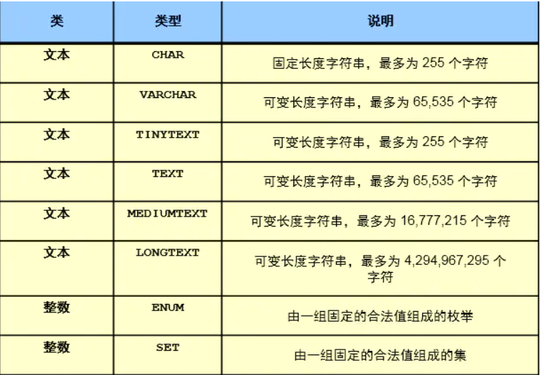
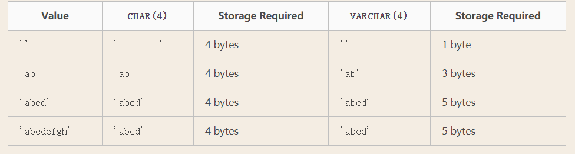
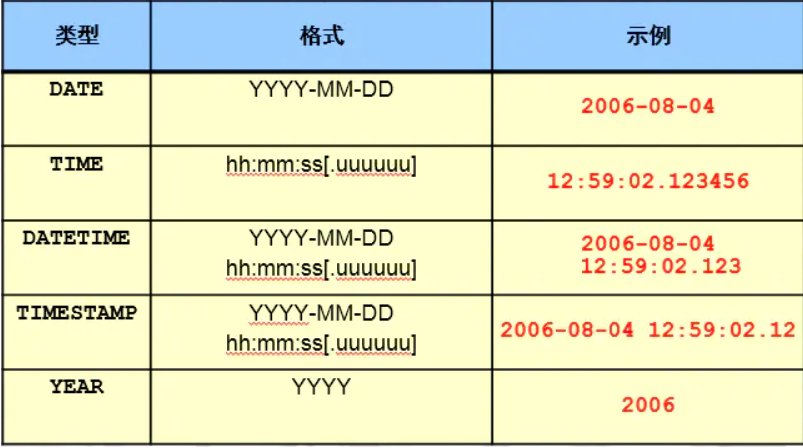

# SQL基础介绍

## 一、SQL介绍

### 1、简介

>结构化查询语言(Structured Query Language)简称SQL，结构化查询语言是一种数据库查询和程序设计语言，用于存取数据以及查询、更新和管理关系数据库系统；
>SQL语句就是对数据库进行操作的一种语言。
>另外，为了使各类RDBMS数据库的SQL能够兼容，大部分的数据库的SQL都符合ANSI的SQL标准。

### 2、ANSI标准发展史

>1986： SQL-87最初由ANSI于1986年正式确定。
>1989：美国国家标准协会（ANSI）发布了第一套数据库查询语言标准，称为SQL-89或FIPS 127-1。
>1992： ANSI发布了修订后的标准ANSI / ISO SQL-92或SQL2，它们比SQLI更严格，增加了一些新功能。这些标准引入了合规水平，表明方言符合ANSI标准的程度。
>1999： ANSI发布SQL3或ANSI / ISO SQL：1999，具有新功能，如对对象的支持。取代了核心规范的合规水平，以及另外9个封装的附加规格。
>2003： ANSI发布SQL：2003，引入标准化序列，XML相关功能和标识列。第一个RDBMS的创建者EFCodd博士于同年4月18日去世。
>2006： ANSI发布SQL：2006，定义如何将SQL与XML结合使用，并使应用程序能够将XQuery集成到现有的SQL代码中。
>2008： ANSI发布SQL：2008，引入INSTEAD OF触发器以及TRUNCATE语句。
>2011： ANSI发布SQL：2011或ISO / IEC 9075：2011，ISO（1987）的第七个修订版和SQL数据库查询语言的ANSI（1986）标准。

### 3、MySQL对于ANSI SQL的支持如下

>https://dev.mysql.com/doc/refman/8.0/en/compatibility.html

```bash
结构化查询语言		#关系型数据库中通用的一类语言
	5.7 以后符合SQL92严格模式
	通过sql_mode参数来控制
```

## 二、MySQL命令常用种类

### 1、内置命令帮助

#### 1.客户端help 命令

>mysql客户端内置命令：

```mysql
\G
\d
\q
\T /tmp/tee.log
source
system
pager/nopager
```

#### 2.服务端help contents

```mysql
Account Management（用户、权限管理）
Administration（系统管理类语句）
Components（组件应用）
Compound Statements（过程函数复合语句）
Contents（帮助目录）
Data Definition（数据定义）
Data Manipulation（数据操作）
Data Types（数据类型）
Functions（内置函数）
Geographic Features（地理位置）
Help Metadata（帮助信息元数据）
Language Structure
Plugins（插件管理）
Storage Engines（）
Table Maintenance（表维护）
Transactions（事务）
User-Defined Functions（自定义函数）
Utility（实用工具）
```

### 2、常用SQL分类

```bash
DDL：Data Definition Language 数据定义语言（CREATE）
DCL：Data control Language 数据控制语言（GRANT，ROLLBACK，COMMIT）
DML：Data Manipulation Language 数据操作语言（INSERT，UPDATE，DELETE）
DQL：Data Query Language 数据查询语言（SELECT）

#DPL：事务处理语言（BEGIN TRANSACTION、COMMIT和ROLLBACK）
```


## 三、SQL_MODE详解

>https://dev.mysql.com/doc/refman/8.0/en/sql-mode.html

| 名称                       | 介绍                                                         |
| -------------------------- | ------------------------------------------------------------ |
| ONLY_FULL_GROUP_BY         | 对于GROUP BY聚合操作，如果在SELECT中的列、HAVING或者ORDER BY子句的列，没有在GROUP BY中出现，或者不在函数中聚合，那么这个SQL是不合法的。 |
| STRICT_TRANS_TABLES        | STRICT_TRANS_TABLES模式：严格模式，进行数据的严格校验，错误数据不能插入，报error错误。如果不能将给定的值插入到事务表中，则放弃该语句。对于非事务表，如果值出现在单行语句或多行语句的第1行，则放弃该语句。 |
| NO_ZERO_IN_DATE            | 在严格模式，不接受月或日部分为0的日期。                      |
| NO_ZERO_DATE               | 在严格模式，不要将 '0000-00-00'做为合法日期。                |
| ERROR_FOR_DIVISION_BY_ZERO | 在严格模式，在INSERT或UPDATE过程中，如果被零除(或MOD(X，0))，则产生错误(否则为警告)。 |
| NO_ENGINE_SUBSTITUTION     | 如果需要的存储引擎被禁用或未编译，那么抛出错误。             |


```bash
作用：规范SQL语句书写方式
    mysql> select @@sql_mode;
    ONLY_FULL_GROUP_BY,
    STRICT_TRANS_TABLES,
    NO_ZERO_IN_DATE,
    NO_ZERO_DATE,
    ERROR_FOR_DIVISION_BY_ZERO,
    NO_AUTO_CREATE_USER,
    NO_ENGINE_SUBSTITUTION 

例子：
	在现实角度，除法运算中，处理不能为0。当MySQL需要做除法运算时，为了保证复合现实的数学逻辑，也需要保证除数不能为0。所以MySQL通过设定sql_mode参数，去规范我们的除法运算，从而保证不会出现违背现实数学逻辑的情况
	现实生活中，我们使用日期，0年0月0日在现实中是不被允许的。
	数据库中的规则规范
	
NO_ZERO_IN_DATE,
NO_ZERO_DATE,
```


## 四、库、表属性介绍

### 1、MySQL逻辑结构

>库：库名，属性（字符集，校对规则，表空间加密）
>表：表名，表属性（存储引擎，字符集，校对，表空间加密），列（列名，列属性），数据行

### 2、 字符集（charset）

```undefined
utf8 ：最大存储长度，单个字符最大支持3个字符
utf8mb4（建议使用这个）：最大存储长度，单个字符最大支持4个字符
	原因：支持编码比utf8多。
	例子：比如，emoji字符mb4中支持，utf8不支持。emoji表情字符，1个字符占四个字节，utf8存不下。
	
建库建表时使用：
5.7默认是latin，防止乱码统一格式
create database zabbix charset utf8mb4;
mysql> show create database zabbix;
+----------+--------------------------------------------------------------------+
| Database | Create Database                                                    |
+----------+--------------------------------------------------------------------+
| zabbix   | CREATE DATABASE `zabbix` /*!40100 DEFAULT CHARACTER SET utf8mb4 */ |
+----------+--------------------------------------------------------------------+
1 row in set (0.00 sec)

```

### 3、校对规则（collation）

```undefined
每种字符集，有多种校对规则（排序规则）
mysql> show collation;
作用：
	影响到排序的操作规则，大小写是否敏感。影像数据库中数据的排序。
```

### 4、存储引擎

```mysql
show engines;
innoDB
```

### 5、加密表空间

```bash
ENCRYPTION='N'/'Y'

临时生效：
INSTALL PLUGIN keyring_file soname 'keyring_file.so';
mkdir -p /data/3306/mysql-keyring/
chown -R mysql.mysql /data/3306/mysql-keyring/
chmod 750 /data/3306/mysql-keyring/

永久生效
在my.cnf的[mysqld]段，加这两行
early-plugin-load=keyring_file.so
keyring_file_data=/data/3306/mysql-keyring/keyring
```

## 五、列的数据类型


### 1、作用

```undefined
保证数据的准确性和标准性。
```

### 2、种类

#### 1.数字类型


##### 1）整型

| 类型      | 占用字节 | 无符号范围 | 有符号范围       | 数据长度 |
| --------- | -------- | ---------- | ---------------- | -------- |
| tinyint   | 1        | 0-255      | -128-127         | 3        |
| smallint  | 2        | 0-65535    | -32768~32767     | 5        |
| mediumint | 3        | 0~16777215 | -8388608~8388607 | 8        |
| int       | 4        | 0~2^32     | -2^31~ 2^32-1    | 10       |
| bigint    | 8        | 0~2^64     | -2^63~ 2^63-1    | 20       |

>1Bytes = 8BITS=11111111=255
>选择数据类型的关键点：
>1、 合适的。
>2、简短的。
>3、 完整的。

##### 2）浮点型与定点数

>FLoat
>Float：表示不指定小数位的浮点数
>Float(M,D)：表示一共存储M个有效数字，其中小数部分占D位
>Float(10,2)：整数部分为8位，小数部分为2位
>
>Double
>Double又称之为双精度：系统用8个字节来存储数据，表示的范围更大，10^308次方，但是精度也只有15位
>左右。
>
>Decimal：
>Decimal系统自动根据存储的数据来分配存储空间，每大概9个数就会分配四个字节来进行存储，同时小数和
>整数部分是分开的。
>
>定点数：能够保证数据精确的小数（小数部分可能不精确，超出长度会四舍五入），整数部分一定精确
>Decimal(M,D)：M表示总长度，最大值不能超过65，D代表小数部分长度，最长不能超过30。

##### 3）常用的数值类型

| 类     | 类型    | 存储长度 | 二进制范围         | 十进制数字范围         |
| ------ | ------- | -------- | ------------------ | ---------------------- |
| 整数   | tinyint | 1B=8bit  | 000000000~11111111 | 0~255，-128~127        |
| 整数   | int     | 4B=32bit | 略                 | 0~2^32-1，-2^31~2^31-1 |
| 整数   | bigint  | 8B=64bit | 略                 | 0~2^64-1，-2^63~2^63-1 |
| 定点数 | decimal |          |                    |                        |

**注意：尽量选最小的，够用就行**

实例

```bash
用utf8mb4创建xiaowu库
mysql> create database xiaowu charset utf8mb4;
使用xiaowu库；
mysql> use xiaowu;
在xiaowu库下创建t1表，id列用int型，name列用varchar型，age用tinyint型
mysql> create table t1(id int ,name varchar(64) ,age tinyint);

说明：手机号是无法存储到int的。一般是使用char类型来存储手机
```

#### 2.字符串类型






**常用字符串类型**

```bash
一、char(11) ：
定长 的字符串类型,在存储字符串时，最大字符长度11个，立即分配11个字符长度的存储空间，如果存不满，空格填充。

二、varchar(11):
变长的字符串类型看，最大字符长度11个。在存储字符串时，自动判断字符长度，按需分配存储空间。

补充：
	1.varchar类型，在存储数据是，会先判断字符长度，然后合理分配存储空间。
	char，不会判断，立即分配空间。
	在固定长度的列中，推荐使用char类型
	
	2.varchar类型，会存储字符串之外，还会额外使用1-2字节存储字符长度。
		adfdd ---》5+1
		
例子：
varchar（10）
abcde ---> 1.判断字符长度---》2.申请空间 ----》3.存字符----》申请一个字节，存储5这个数字

char（10）
abcde ---》1.申请10个字符空间----》2.存字符+表格填充

	3.应用场景
		1.字符串固定长度，char类型，不固定用varchar类型
	
	4.()中的数字问题 
		括号中设置的是字符的个数，无关字符类型。但是不同种类的字符，占用的存储空间是不一样的。对于英文和数字，每个
	mysql> create table t2 (n1 char(10),n2 varchar(10));
	mysql> insert into t2 values('aaaaaaaaaa','aaaaaaaaaa');
	mysql> select * from t2;
    +------------+------------+
    | n1         | n2         |
    +------------+------------+
    | aaaaaaaaaa | aaaaaaaaaa |
    +------------+------------+
	mysql> insert into t2 values('1234567890','1234567890');
	mysql> select * from t2;
    +------------+------------+
    | n1         | n2         |
    +------------+------------+
    | aaaaaaaaaa | aaaaaaaaaa |
    | 1234567890 | 1234567890 |
    +------------+------------+
	mysql> insert into t2 values('12345678901','12345678901');
	ERROR 1406 (22001): Data too long for column 'n1' at row 1

	mysql> insert into t2 values('一二三四五六七八九十','1234567890');
	Query OK, 1 row affected (0.00 sec)

    mysql> select * from t2;
    +--------------------------------+------------+
    | n1                             | n2         |
    +--------------------------------+------------+
    | aaaaaaaaaa                     | aaaaaaaaaa |
    | 1234567890                     | 1234567890 |
    | 一二三四五六七八九十             | 1234567890 |
    +--------------------------------+------------+

	5.7:超出数字类型会直接报错
	5.6:超出数字类型会只记录前十个字符
	括号中设置的是字符的个数，无关字符类型。但是不同种类的字符，占用的存储空间是不一样的。对于英文和数字，每个字符占一个字节长度。对于中文来讲，占用空间大小要考虑字符集。utf8,utf8mb4，每个中文，占3个字节长度。emoji字符，占4个字节长度。总长度不能超过数据类型的最大长度。

	mysql> select length(n1),length(n2) from t2;
    +------------+------------+
    | length(n1) | length(n2) |
    +------------+------------+
    |         10 |         10 |
    |         10 |         10 |
    |         30 |         10 |
    +------------+------------+


三、enum('bj','tj','sh')：	#填写性别，指定多个项，选择其中一个。
枚举类型，比较适合于将来此列的值是固定范围内的特点，可以使用enum,可以很大程度的优化我们的索引结构。下标索引。
说明：字符串类型
作用：
例如：
	id	telnum  	   name  		身份				省
	1    155****8909   xiaowu		3713****		  山东省
	


```


#### 3.时间类型




 列值不能为空，也是表设计的规范，尽可能将所有的列设置为非空。可以设置默认值为0
**unique key** ：唯一键
 列值不能重复
**unsigned** ：无符号
 针对数字列，非负数。


其他属性:
 **key** :索引
 可以在某列上建立索引，来优化查询


```css
DATETIME (占用8个字节)
范围为从 1000-01-01 00:00:00.000000 至 9999-12-31 23:59:59.999999。
TIMESTAMP （占用四个字节）
1970-01-01 00:00:00.000000 至 2038-01-19 03:14:07.999999。
timestamp会受到时区的影响
```

#### 4.二进制类型


#### 5.json类型

```bash
{
	id:101
	name:xiaowu
}
```


## 六、表属性

### 1、 列属性

#### 1.约束

```bash
约束(一般建表时添加):

1、primary key(PK) ：主键约束
设置为主键的列，此列的值必须非空且唯一，主键在一个表中只能有一个，但是可以有多个列一起构成。

2、not null ：非空约束
列值不能为空，也是表设计的规范，尽可能将所有的列设置为非空。可以设置默认值为0

3、unique key ：唯一约束
列值不能重复

4、unsigned ：无符号
针对数字列，非负数。
```


#### 2.其他属性

```bash
1、key :索引
可以在某列上建立索引，来优化查询,一般是根据需要后添加

2、default	:默认值
列中，没有录入值时，会自动使用default的值填充

3、auto_increment	:自增长
针对数字列，顺序的自动填充数据（默认是从1开始，将来可以设定起始点和偏移量）

4、comment  : 注释
```

### 2、表属性

```bash
1、存储引擎:ENGINE
	InnoDB（默认的）
2、字符集和排序规则: CHARSET
	utf8       
	utf8mb4
```
