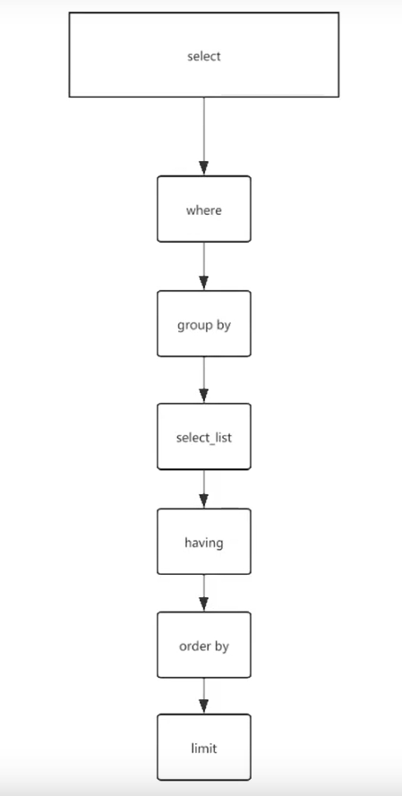
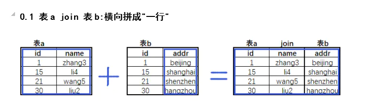

# SQL应用

## 一、client

```mysql
mysql> help
?         (\?) Synonym for `help'.
clear     (\c) Clear the current input statement.
connect   (\r) Reconnect to the server. Optional arguments are db and host.
delimiter (\d) Set statement delimiter.
edit      (\e) Edit command with $EDITOR.
ego       (\G) Send command to mysql server, display result vertically.
exit      (\q) Exit mysql. Same as quit.
go        (\g) Send command to mysql server.
help      (\h) Display this help.
nopager   (\n) Disable pager, print to stdout.
notee     (\t) Don't write into outfile.
pager     (\P) Set PAGER [to_pager]. Print the query results via PAGER.
print     (\p) Print current command.
prompt    (\R) Change your mysql prompt.
quit      (\q) Quit mysql.
rehash    (\#) Rebuild completion hash.
source    (\.) Execute an SQL script file. Takes a file name as an argument.
status    (\s) Get status information from the server.
system    (\!) Execute a system shell command.
tee       (\T) Set outfile [to_outfile]. Append everything into given outfile.
use       (\u) Use another database. Takes database name as argument.
charset   (\C) Switch to another charset. Might be needed for processing binlog with multi-byte charsets.
warnings  (\W) Show warnings after every statement.
nowarning (\w) Don't show warnings after every statement.
resetconnection(\x) Clean session context.

常用
\?	和'help'命令相同
\c  阻止上个命令运行
\G	格式化输出（逐行输出，针对列特别多的场景）
\q	退出会话（ctrl+d）
\.	source 导入SQL脚本，类似于<
\!	调用linux命令
```


## 二、server

```bash
linux当中一切皆命令，一切皆文件。
mysql一切皆SQL，一切皆库、表。
```


### 1、DDL

**数据定义语言**

#### 1.库定义

```bash
库名，库属性
```

##### 1）建库

```mysql
create database 库名 charset utf8mb4 collate utf8mb4_bin;
数据库名				字符集			排序规则	

建库规范：
1.库名不能有大写字母   	#多平台兼容问题
2.建库要加字符集         
3.库名不能有数字开头
4.库名要和业务相关
5.库名不要太长
6.不要使用内置字符

create database xiaowu；
show create database xiaowu；	#查看建库的基本命令（建库语句）
```


##### 2）查库（DQL）

```mysql
show databases；
show create database xiaowu；	#查看建库的基本命令（建库语句）
```


##### 3）修改库

```mysql
show create database school;
alter database xiaowu charset utf8;

注意：修改字符集，修改后的字符集一定是原字符集的严格超集
只能改库属性，不能改库名。
```


##### 4）删库

**生产中谨慎使用**

```mysql
mysql> drop database xiaowu;
```


#### 2.表定义

##### 1）创建表

```mysql
create table stu(
列1  属性（数据类型、约束、其他属性） ，
列2  属性，
列3  属性
)

USE school;
CREATE TABLE stu(
id      INT NOT NULL PRIMARY KEY AUTO_INCREMENT COMMENT '学号',
sname   VARCHAR(255) NOT NULL COMMENT '姓名',
sage    TINYINT UNSIGNED NOT NULL DEFAULT 0 COMMENT '年龄',
sgender ENUM('m','f','n') NOT NULL DEFAULT 'n' COMMENT '性别' ,
sfz     CHAR(18) NOT NULL UNIQUE  COMMENT '身份证',
intime  TIMESTAMP NOT NULL DEFAULT NOW() COMMENT '入学时间'
) ENGINE=INNODB CHARSET=utf8mb4 COMMENT '学生表';

```

| 列名    | 数据类型          | 长度 | 默认          | 主键        | 非空     | 无符号   | 自增           | 列值不重复 | 注释               |
| ------- | ----------------- | ---- | ------------- | ----------- | -------- | -------- | -------------- | ---------- | ------------------ |
| id      | int               |      |               | PRIMARY KEY | NOT NULL |          | AUTO_INCREMENT |            | COMMENT '学号'     |
| name    | varchar           | 255  |               |             | NOT NULL |          |                |            | COMMENT '姓名'     |
| age     | tinyint           |      | DEFAULT 0     |             | NOT NULL | UNSIGNED |                |            | COMMENT '年龄'     |
| gender  | ENUM('m','f','n') |      | DEFAULT 'n'   |             | NOT NULL |          |                |            | COMMENT '性别'     |
| sfz     | CHAR              | 18   |               |             | NOT NULL |          |                | UNIQUE     | COMMENT '身份证'   |
| intinme | TIMESTAMP         |      | DEFAULT NOW() |             | NOT NULL |          |                |            | COMMENT '入学时间' |


```bash
ENGINE=INNODB		 CHARSET=utf8mb4			COMMENT '学生表'
存储引擎	   			字符集						注释
```


**建表规范：**

````bash
1. 表名小写	#多平台兼容问题
2. 不能是数字开头
3. 注意字符集和存储引擎
4. 表名和业务有关
5. 选择合适的数据类型	#合适，简短，足够
6. 每个列都要有注释
7. 每个列设置为非空，无法保证非空，默认值或用0来填充。
8. 必须要有主键
9. 列名不要太长

````


**练习：**


```bash
1、表名过长
2、id bigint（20）过大
3、数字列应该用数字类型
4、distribution_cost应该使用小数
5、时间列应该datatime类型
6、is_deleted用枚举类型
```


##### 2）查询表(DQL)

```mysql
mysql> show tables;
mysql> desc wp_users;
mysql> show create table stu;
```


##### 3）修改表

例子：

```mysql
1.在stu表中添加手机列
ALTER TABLE stu ADD shouji bigint NOT NULL UNIQUE KEy COMMENT '手机号';

alter table stu add shouji bigint notnull unique key comment '手机号' first ;	#列首添加

alter table stu add shouji bigint notnull unique key comment '手机号' after id ;	#在id列后添加一个列

2.手机列修改数据类型为char（11） modefy
alter table stu modify shouji char(11) not null unique key comment '手机号';
alter table stu rename t2;	改表名
3.删除手机号列（危险操作）
mysql> alter table stu drop shouji;


```


##### 4）删除表、库

```bash
mysql> drop table stu;
mysql> drop database 库名;
```


#### 3.DDL扩充

```bash
1、创建一张表
create table 库名.表名(
列名 数据类型 约束 属性,
列名 数据类型 约束 属性,
列名 数据类型 约束 属性,
...
)engine(引擎)=innodb charset(字符集)=utf8mb4;

2、线上DDL（alter）操作对于生产的影响
说明：在MySQL中，DDL语句在对表进行操作是，是要锁“元数据表”的。
扩展：元数据是什么？ ---》类似linux inode信息
	  在MySQL中，DDL语句对表进行操作时，是要锁“元数据表”的，此时，所有修改类命令无法正常运行。所以在对于大表、业务繁忙的表，进行先上DDL操作时，要谨慎。尽量避开业务繁忙时间，进行DDL操作。
```


面试题回答要点：

```bash
1.SQL语句的意思是什么
	以上四条语句是进行DDL加列操作
2.以上操作带来的影响
	在MySQL中，DDL语句对表进行操作时，是要锁“元数据表”的，此时，所有修改类命令无法正常运行。所以在对于大表、业务繁忙的表，进行先上DDL操作时，要谨慎。尽量避开业务繁忙时间，进行DDL操作。
3.我们的建议：
	（1）尽量避开业务繁忙时间，进行DDL。走流程
	（2）建议使用：pt-online-schema-change（pt-osc） gh-ost工具进行DDL操作，减少锁表影响
	（3）如果8.0版本，可以不适用pt工具，8.0之前需要借助以上工具
	
```


### 2、DCL

**数据控制语言**

```bash
grant	授权
revoke	回收权限
```

#### 1.权限管理的操作：

##### 1）语法：

```bash
8.0之前：
	grant 权限 on 对象 to 用户 identified by '密码';
	grant 权限1,权限2,权限3... on 对象 to 用户 identified by '密码';
8.0之后：
	create user 用户 identified by '密码';
	grant 权限 on 对象 to 用户;
	grant 权限1,权限2,权限3... on 对象 to 用户;
```


##### 2）权限：

```mysql
ALL:SELECT,INSERT, UPDATE, DELETE, CREATE, DROP, RELOAD, SHUTDOWN, PROCESS, FILE, REFERENCES, INDEX, ALTER, SHOW DATABASES, SUPER, CREATE TEMPORARY TABLES, LOCK TABLES, EXECUTE, REPLICATION SLAVE, REPLICATION CLIENT, CREATE VIEW, SHOW VIEW, CREATE ROUTINE, ALTER ROUTINE, CREATE USER, EVENT, TRIGGER, CREATE TABLESPACE
ALL							#以上所有权限，一般是管理员才拥有的
权限1,权限2,权限3...		   #普通用户
grant option				#超级管理员，给别的用户授权
	grant 权限1,权限2,权限3... on 对象 to 用户 with grant option;
```

**注意：不要随意授权grant option，不然该用户可以在服务器中为所欲为，包括删除自带的超级管理员（root@localhost）**

##### 3）对象： 库、表（作用范围）

````bash
*.*                  #所有库所有表，一般是对管理员
wordpress.*          #wordpress库下所有表，开发和应用用户，
wordpress.t1		 #wordpress库下t1表
````


##### 4）MySQL授权表：

```mysql
user		#用户对mysql服务的权限
db			#用户对某个库的权限
tables_priv		#用户对某个表的权限
columns_priv 	#用户对某列的权限

查询所有用户对mysql服务的权限
select * from mysql.user\G

查询所有用户对库的权限
select * from mysql.db\G

查询所有用户对某个表的权限
select * from mysql.tables_priv\G

查询所有用户对某列的权限
select * from mysql.columns_priv\G
```


##### 5）练习

需求1：创建管理员用户，windows机器的navicat登录到linux中的MySQL

```mysql
mysql> grant all on *.* to root@'10.0.0.%' identified by '123' with grant option;

查询创建的用户：
mysql> select user,host,authentication_string from mysql.user;

查询某个用户的权限：
mysql> show grants for root@'10.0.0.%';
+--------------------------------------------------------------------+
| Grants for root@10.0.0.%                                           |
+--------------------------------------------------------------------+
| GRANT ALL PRIVILEGES ON *.* TO 'root'@'10.0.0.%' WITH GRANT OPTION |
+--------------------------------------------------------------------+

查询所有用户对mysql服务的权限
select * from mysql.user\G

查询所有用户对库的权限
select * from mysql.db\G

查询所有用户对某个表的权限
select * from mysql.tables_priv\G

查询所有用户对某列的权限
select * from mysql.columns_priv\G

```


需求2：创建一个应用用户app用户，能从windows上登录mysql，能够对app库下所有对象进行create，select，update，delete，insert操作

```mysql
mysql> grant create,update,select,insert,delete on app.* to app@'10.0.0.%' identified by '123';

mysql> show grants for app@'10.0.0.%';
+-----------------------------------------------------------------------------+
| Grants for app@10.0.0.%                                                     |
+-----------------------------------------------------------------------------+
| GRANT USAGE ON *.* TO 'app'@'10.0.0.%'                                      |
| GRANT SELECT, INSERT, UPDATE, DELETE, CREATE ON `app`.* TO 'app'@'10.0.0.%' |
+-----------------------------------------------------------------------------+
2 rows in set (0.00 sec)
```


##### 6）回收权限

```mysql
linux:
chmod -R 644 /data	----> chmod -R 755 /data

MySQL:
MySQL中不能通过重复授权，修改权限，只能通过回收权限的方式进行修改

回收'app'@'10.0.0.%'对app库的create权限
revoke create on app.* from 'app'@'10.0.0.%';

添加'app'@'10.0.0.%'对app库的create权限
grant create on app.* to app@'10.0.0.%';

```

#### 2.资源组管理（8.0新特性）

##### 1）资源组介绍

>MySQL是单进程多线程的程序，MySQL线程包括后台线程（Master Thread、IO Thread、PurgeThread等），以及用户线程。在8.0之前，所有线程的优先级都是一样的，并且所有的线程的资源都是共享的。但是在MySQL 8.0之后，由于Resource Group特性的引入，我们可以来通过资源组的方式修改线程的优先级以及所能使用的资源，可以指定不同的线程使用特定的资源。在目前版本中DBA只能操控CPU资源，并且控制的最小力度为vCPU，即操作系统逻辑CPU核数（可以通过lscpu命令查看可控制CPU总数）。
>
>DBA经常会遇到需要执行跑批任务的需求，这种跑批的SQL一般都是很复杂、运行时间长、消耗资源多的SQL。所以很多跑批任务都是在业务低峰期的时候执行，并且在从库上执行，尽可能降低对业务产生影响。但是对于一些数据一致性比较高的跑批任务，需要在主库上执行，在跑批任务运行的过程中很容易影响到其他线程的运行。那么现在Resource Group就是DBA的福音了，我们可以对跑批任务指定运行的资源组，限制任务使用的资源，减少对其他线程的影响。

>INFORMATION_SCHEMA库下的RESOURCE_GROUPS表中记录了所有定义的资源组的情况:
>
>```mysql
>mysql> select * from information_schema.resource_groups;
>```
>
>MySQL8.0默认会创建两个资源组，一个是USR_default另一个是SYS_default。

>PERFORMANCE_SCHEMA库下的THREADS表中，可以查看当前线程使用资源组的情况:
>
>```mysql
>select * from performance_schema.threads limit 5;
>```

##### 2）资源组创建

```mysql
CREATE RESOURCE GROUP oldguo
TYPE = USER
VCPU = 0
THREAD_PRIORITY = 10;
```

>说明：
>oldguo 为资源组名字
>type=user来源是用户端的慢SQL
>vcpu=0 给它分配到哪个CPU核上（你可以用cat /proc/cpuinfo | grep processor查看CPU有多少核），或者使用top查看哪个核心较为空闲
>thread_priority为优先级别，范围是0到19，19是最低优先级，0是最高优先级。

##### 3）资源组的应用

>将创建的oldguo资源组绑定到执行的线程上，有两种方式：

###### 方式一：

>从PERFORMANCE_SCHEMA.THREADS表中查找需要绑定执行的线程ID
>
>```mysql
>mysql> select * from performance_schema.threads where TYPE='FOREGROUND';
>SET RESOURCE GROUP oldguo FOR 65;
>```

###### 方式二：

>采用Optimizer Hints的方式指定SQL使用的资源组：
>
>```mysql
>SELECT /*+ RESOURCE_GROUP(oldguo) */ * FROM t2 ;
>```

##### 4）资源组修改及删除

###### ①修改

```mysql
# 可能跑批任务使用CPU资源不够，那就需要修改资源组的配置。
ALTER RESOURCE GROUP oldguo VCPU = 10-20;
# 修改资源组优先级：
ALTER RESOURCE GROUP oldguo THREAD_PRIORITY = 5;
```

###### ②禁止使用资源组

```mysql
ALTER RESOURCE GROUP oldguo DISABLE FORCE;
```

###### ③删除资源组

```mysql
DROP RESOURCE GROUP oldguo;
```

##### 5）资源组使用限制

```bash
Linux 平台上需要开启 CAP_SYS_NICE 特性才能使用RESOURCE GROUP

检查mysqld进程是否开启CAP_SYS_NICE特性
getcap /usr/local/mysql/bin/mysqld

给mysqld进程开启CAP_SYS_NICE特性
setcap cap_sys_nice+ep /usr/local/mysql/bin/mysqld
或者：：
systemctl edit mysqld
[Service]
AmbientCapabilities=CAP_SYS_NICE

另外：
mysql 线程池开启后RG失效。
freebsd,solaris 平台thread_priority 失效。

目前只能绑定CPU，不能绑定其他资源。
```

### 3、DML

**数据操作语言**

作用：对表中的数据进行增、删、改

#### 1.insert

```mysql
--- 最标准的insert语句
mysql> desc stu;     #先看看有什么列
mysql> insert into stu(id,sname,sage,sgender,sfz,intime)
    -> values
    -> (1,'zs',18,'m','123456',now());
mysql> select * from stu;                                                       
+----+-------+------+---------+--------+---------------------+
| id | sname | sage | sgender | sfz    | intime              |
+----+-------+------+---------+--------+---------------------+
|  1 | zs    |   18 | m       | 123456 | 2021-02-28 15:27:03 |
+----+-------+------+---------+--------+---------------------+

--- 省事的写法
mysql> insert into stu 
    -> values
    -> (2,'ls',18,'m','1234567',now());
mysql> select * from stu;                                                       
+----+-------+------+---------+---------+---------------------+
| id | sname | sage | sgender | sfz     | intime              |
+----+-------+------+---------+---------+---------------------+
|  1 | zs    |   18 | m       | 123456  | 2021-02-28 15:27:03 |
|  2 | ls    |   18 | m       | 1234567 | 2021-02-28 15:30:45 |
+----+-------+------+---------+---------+---------------------+

--- 针对性的录入数据
mysql> insert into stu(sname,sfz)
    -> values 
    -> ('w5','1233232');
mysql> select * from stu;
+----+-------+------+---------+---------+---------------------+
| id | sname | sage | sgender | sfz     | intime              |
+----+-------+------+---------+---------+---------------------+
|  1 | zs    |   18 | m       | 123456  | 2021-02-28 15:27:03 |
|  2 | ls    |   18 | m       | 1234567 | 2021-02-28 15:30:45 |
|  3 | w5    |    0 | n       | 1233232 | 2021-02-28 15:32:24 |
+----+-------+------+---------+---------+---------------------+


--- 同时录入多行数据
mysql> insert into stu(sname,sfz)
    -> values
    -> ('ll','34314314'),
    -> ('kk','3515315'),
    -> ('jj','654364365');
mysql> select * from stu;
+----+-------+------+---------+-----------+---------------------+
| id | sname | sage | sgender | sfz       | intime              |
+----+-------+------+---------+-----------+---------------------+
|  1 | zs    |   18 | m       | 123456    | 2021-02-28 15:27:03 |
|  2 | ls    |   18 | m       | 1234567   | 2021-02-28 15:30:45 |
|  3 | w5    |    0 | n       | 1233232   | 2021-02-28 15:32:24 |
|  4 | ll    |    0 | n       | 34314314  | 2021-02-28 15:34:37 |
|  5 | kk    |    0 | n       | 3515315   | 2021-02-28 15:34:37 |
|  6 | jj    |    0 | n       | 654364365 | 2021-02-28 15:34:37 |
+----+-------+------+---------+-----------+---------------------+

insert into 库.表 select concat(user,"@",host) from mysql.user;
```


#### 2.update

```mysql
mysql> update stu set sname='zhaosi' where id=1;

mysql> select * from stu;
+----+--------+------+---------+-----------+---------------------+
| id | sname  | sage | sgender | sfz       | intime              |
+----+--------+------+---------+-----------+---------------------+
|  1 | zhaosi |   18 | m       | 123456    | 2021-02-28 15:27:03 |
|  2 | ls     |   18 | m       | 1234567   | 2021-02-28 15:30:45 |
|  3 | w5     |    0 | n       | 1233232   | 2021-02-28 15:32:24 |
|  4 | ll     |    0 | n       | 34314314  | 2021-02-28 15:34:37 |
|  5 | kk     |    0 | n       | 3515315   | 2021-02-28 15:34:37 |
|  6 | jj     |    0 | n       | 654364365 | 2021-02-28 15:34:37 |
+----+--------+------+---------+-----------+---------------------+

注意：update语句必须要加where。
```


#### 3.delete

```mysql
mysql> delete from stu where id=6;


mysql> select * from stu;
+----+--------+------+---------+----------+---------------------+
| id | sname  | sage | sgender | sfz      | intime              |
+----+--------+------+---------+----------+---------------------+
|  1 | zhaosi |   18 | m       | 123456   | 2021-02-28 15:27:03 |
|  2 | ls     |   18 | m       | 1234567  | 2021-02-28 15:30:45 |
|  3 | w5     |    0 | n       | 1233232  | 2021-02-28 15:32:24 |
|  4 | ll     |    0 | n       | 34314314 | 2021-02-28 15:34:37 |
|  5 | kk     |    0 | n       | 3515315  | 2021-02-28 15:34:37 |
+----+--------+------+---------+----------+---------------------+

```

**练习**

```mysql
delete * from agv.EXPRESS_ORDER where OPEN_TIME<'2021-10-26 00:00:00';
delete * from agv.EXPRESS_ARTICLE where PACKAGE_ID<61035;
delete  from agv.EXPRESS_PACKAGE where REQUEST_TIME<'2021-10-26 00:00:00';
delete from agv.LOG_ALERT where CREATE_TIME<'2021-10-26 00:00:00';
```


**扩展**

```bash
1、伪删除
用update来替代delete，最终保证业务中查不到（select）即可
  删除id为1
	原操作：
		mysql> delete from stu where id=1;
	
	伪删除：
        1.添加状态列
        ALTER TABLE stu ADD state TINYINT NOT NULL DEFAULT 1 ;
        SELECT * FROM stu;
        2. UPDATE 替代 DELETE
        UPDATE stu SET state=0 WHERE id=6;
        3. 业务语句查询
        SELECT * FROM stu WHERE state=1;
        
2、delete from stu ，drop table stu，truncate table stu的区别
	1.都可以删除全表

	2.区别
    delete
        逻辑上，逐行删除。数据行多，操作慢
        并没有真正从磁盘删除，只是在存储层面打标记，磁盘空间不立即释放。HWM高水位线（）不会降低。（自增列继续）
    
    drop
    将表结构（元数据）和数据行物理层次删除
    
    truncate
    清空表段中的所有数据页。物理层次删除全表数据磁盘空间立即释放，HWM高水位会降低。（自增列重新开始）
    
#delete，drop，truncate如果不小心删除了，他们都可以恢复吗？
    可以
    常规方法：
    都可以通过 备份+日志，恢复数据。
    
    灵活办法
    delete可以通过，翻转日志（binlog）
    三种删除数据情况，也可以通过《延时从库进行恢复》
    
    
    
```


### 4、DQL

**数据查询语言**

#### 1.select

作用：获取表中的数据行

##### 1）select 单独使用（MySQL独家）

```mysql
	1.配合内置函数使用
		mysql> select now();		#查看当前时间
		mysql> select database();	#查看当前所在库
		mysql> select concat("hello word!");	#命令拼接，显示某字符串
        +-----------------------+
        | concat("hello word!") |
        +-----------------------+
        | hello word!           |
        +-----------------------+
        mysql> select concat(user,"@",host) from mysql.user;
		+-------------------------+
        | concat(user,"@",host)   |
        +-------------------------+
        | root@10.0.0.1           |
        | mysql.session@localhost |
        | mysql.sys@localhost     |
        | root@localhost          |
        +-------------------------+
		mysql> select user();	#查看当前登录用户
		
	2.计算
		mysql> select 10*100;	#进行计算
        +--------+
        | 10*100 |
        +--------+
        |   1000 |
        +--------+

	3.查询数据库的参数
		mysql> select @@port;	#查询当前端口
		mysql> select @@datadir;	#查看数据存储位置

		show variables;		##查看所有参数
		mysql> show variables like '%trx%';	#like 模糊查询

```

##### 2）select 标准用法（配合其他子句使用）

```bash
	单表
	前提：
	select
        1.from 表1，表2，。。。
        2.where 过滤条件1，过滤条件2...
        3.group by  条件列1 条件列2。。。分组字段
        4.select_list 列名
        5.having	过滤条件1 过滤条件2。。。
        6.order by  条件列1 条件列2。。。排序字段
        7.limit	分页限制
```




**使用方法**

准备学习环境[root@Centos7 ~]# mysql -p < world.sql 导入world库

```mysql
[root@Centos7 ~]# mysql -p < world.sql 	#导入world库
world库常见单词
    world            ===>世界
    city             ===>城市
    country          ===>国家
    countrylanguage  ===>国家语言

    city:城市表
    DESC city;
    ID :         城市ID
    NAME :       城市名
    CountryCode: 国家代码，比如中国CHN 美国USA
    District :   省份
    Population : 人口数
    


```


###### **①select配合from子句使用**

```mysql
select配合from子句使用
	语法：
		select 列 from 表;
	例子：
	#查询表中所有列所有行，*谨用！
	select * from city;
	#查询部分列值
	select name,population from city;		
```


###### **②select+from+where配合使用**

```mysql
select+from+where配合使用
	where配合比较判断符=，<,>,>=,<=,!=
	例子：
	#查询属于中国的所有城市信息
	mysql> select * from world.city where countrycode='CHN';	
	#查询人口小于1000的所有城市信息
	mysql> select * from world.city where population < 1000;	
```


###### **③select+from+where+like配合使用，模糊查询，针对字符串**

```mysql
	select+from+where+like配合使用，模糊查询
	#查询city中，国家代号是CH开头的城市信息
	mysql> select * from world.city where countrycode like 'CH%';	
	mysql> select * from world.city where countrycode like 'CH_';
		%:多个任意字符
		_:一个任意字符
	
	
	注：like语句在使用时，切记不要出现前面带%的模糊查询，原因：不走索引。
	#只要前面有%的模糊查询，就不会走索引
	select * from world.city where countrycode like '%CH%';	
```


###### **④select+from+where+逻辑连接符（and or）**

```mysql
select+from+where+逻辑连接符（and or）
#例子：查询中国城市人口超过500W的城市
	mysql> select * from world.city
    -> where countrycode='CHN' and population>5000000;

#查询中国或美国的城市信息
mysql> select * from world.city where countrycode='CHN' or countrycode='USA';

#查询中国和美国的信息，并且人口数量超过500W的城市;
mysql> select * from world.city where countrycode in ('CHN','USA') and population>5000000;

```


###### **⑤where配合between and，取一个范围**

```mysql
where配合between and
#作用：查询数值的一个范围
#查询人口在100W和两百万之前的城市信息
mysql> select * from world.city where population between 1000000 and 2000000;
mysql> select * from world.city where population>=1000000 and population<=2000000;

```


##### **3）select+from+where+group by聚合函数**

````mysql
#作用：对一张表，按照不同数据特点，需要分组计算统计是，会使用group by+聚合函数
group by 配合聚合函数(max(),min(),avg(),count(),sum(),group_concat())使用
聚合函数：
max()			#最大值
min()			#最小值
avg()			#平均值
count()			#统计个数
sum()			#求和
group_concat()	#列转行

#说明：碰到group_by必然会有聚合函数

运行过程：
	提取数据--》排序--》去重--》统计
````


```mysql
# 统计city中，每个国家的城市个数
select countrycode,count(id) from world.city group by countrycode;

# 统计中国每个省的城市个数
mysql> select district,count(id) from world.city where countrycode='CHN' group by district;

#统计每个国家的总人口
mysql> select countrycode,sum(population) from world.city group by countrycode;

#统计中国，每个省的总人口
mysql> select district,sum(population) from world.city where countrycode='CHN' group by district;

#统计中国，每个省总人口，城市个数，城市名列表
mysql> select district,sum(population),count(id),group_concat(name) from world.city where countrycode='CHN' group by district;

```


##### 4）select+group by+having（后过滤）

````mysql
#作用：与where作用相似，都是过滤作用，但having是后过滤 where|group by|having

#统计中国，每个省的总人口，只打印总人口数大于500W
mysql> select district,sum(population) from world.city where countrycode='CHN' group by district having sum(population)>5000000;
````


##### 5）order by 排序

```mysql
#作用：从小到大排序 默认由小到大添加desc后变成又大到小
#统计中国，每个省的总人口，只打印总人口数大于500W，并且按照总人口从大到小排序输出
select district,sum(population) from world.city where countrycode='CHN' group by district having sum(population)>5000000 order by sum(population) desc;

默认升序：asc
	降序：desc
```


##### 6）limit 分页

````mysql
#作用：分页输出
#统计中国，每个省的总人口，只打印总人口数大于500W，并且按照总人口从大到小排序输出,只看前五名
mysql> select district,sum(population) from world.city where countrycode='CHN' group by district having sum(population)>5000000 order by sum(population) desc limit 5;

#统计中国，每个省的总人口，只打印总人口数大于500W，并且按照总人口从大到小排序输出,看6到10名
mysql> select district,sum(population) from world.city where countrycode='CHN' group by district having sum(population)>5000000 order by sum(population) desc limit 5,5;
mysql> select district,sum(population) from world.city where countrycode='CHN' group by district having sum(population)>5000000 order by sum(population) desc limit 5 offset 5;		

##统计中国，每个省的总人口，只打印总人口数大于500W，并且按照总人口从大到小排序输出,看3到5名
mysql> select district,sum(population) from world.city where countrycode='CHN' group by district having sum(population)>5000000 order by sum(population) desc limit 2,3;

mysql> select district,sum(population) from world.city where countrycode='CHN' group by district having sum(population)>5000000 order by sum(population) desc limit 3 offset 2;

````


##### 7）distinct：去重复

````mysql
#去重复
mysql> select countrycode from world.city;
mysql> select distinct(countrycode) from world.city;
````


##### 8）联合查询 - union all

```mysql
#查询中国或美国的城市信息
mysql> select * from world.city where countrycode in ('CHN','USA');

mysql> select * from world.city where countrycode='CHN' union all select * from world.city where countrycode='USA';
	#先查中国的再查美国的。

说明:一般情况下,我们会将 IN 或者 OR 语句 改写成 UNION ALL,来提高性能
UNION     聚合两个结果集，会自动去重复
UNION ALL 聚合两个结果集，不去重复
```


##### 9）join多表连接查询

###### ①案例准备

按需求创建一下表结构

```mysql
use school
student ：学生表
sno：    学号
sname：学生姓名
sage： 学生年龄
ssex： 学生性别

teacher ：教师表
tno：     教师编号
tname：教师名字

course ：课程表
cno：  课程编号
cname：课程名字
tno：  教师编号

score  ：成绩表
sno：  学号
cno：  课程编号
score：成绩

-- 项目构建
drop database school;
CREATE DATABASE school CHARSET utf8mb4;
USE school

CREATE TABLE student(
sno INT NOT NULL PRIMARY KEY AUTO_INCREMENT COMMENT '学号',
sname VARCHAR(20) NOT NULL COMMENT '姓名',
sage TINYINT UNSIGNED  NOT NULL COMMENT '年龄',
ssex  ENUM('f','m') NOT NULL DEFAULT 'm' COMMENT '性别'
)ENGINE=INNODB CHARSET=utf8;

CREATE TABLE course(
cno INT NOT NULL PRIMARY KEY COMMENT '课程编号',
cname VARCHAR(20) NOT NULL COMMENT '课程名字',
tno INT NOT NULL  COMMENT '教师编号'
)ENGINE=INNODB CHARSET utf8;

alter TABLE sc (
sno INT NOT NULL COMMENT '学号',
cno INT NOT NULL COMMENT '课程编号',
score INT  NOT NULL DEFAULT 0 COMMENT '成绩'
)ENGINE=INNODB CHARSET=utf8;

CREATE TABLE teacher(
tno INT NOT NULL PRIMARY KEY COMMENT '教师编号',
tname VARCHAR(20) NOT NULL COMMENT '教师名字'
)ENGINE=INNODB CHARSET utf8;

INSERT INTO student(sno,sname,sage,ssex)
VALUES (1,'zhang3',18,'m');

INSERT INTO student(sno,sname,sage,ssex)
VALUES
(2,'zhang4',18,'m'),
(3,'li4',18,'m'),
(4,'wang5',19,'f');

INSERT INTO student
VALUES
(5,'zh4',18,'m'),
(6,'zhao4',18,'m'),
(7,'ma6',19,'f');

INSERT INTO student(sname,sage,ssex)
VALUES
('oldboy',20,'m'),
('oldgirl',20,'f'),
('oldp',25,'m');


INSERT INTO teacher(tno,tname) VALUES
(101,'oldboy'),
(102,'hesw'),
(103,'oldguo');

DESC course;
INSERT INTO course(cno,cname,tno)
VALUES
(1001,'linux',101),
(1002,'python',102),
(1003,'mysql',103);

DESC sc;
INSERT INTO sc(sno,cno,score)
VALUES
(1,1001,80),
(1,1002,59),
(2,1002,90),
(2,1003,100),
(3,1001,99),
(3,1003,40),
(4,1001,79),
(4,1002,61),
(4,1003,99),
(5,1003,40),
(6,1001,89),
(6,1003,77),
(7,1001,67),
(7,1003,82),
(8,1001,70),
(9,1003,80),
(10,1003,96);

SELECT * FROM student;
SELECT * FROM teacher;
SELECT * FROM course;
SELECT * FROM sc;
```


###### ②介绍

将多张表合成一张大表



查询张三的家庭住址

```mysql
SELECT A.name,B.address FROM
A JOIN  B
ON A.id=B.id
WHERE A.name='zhangsan'
```


###### ③作用

```bash
1、为什么要使用多表连接查询？
我们的查询需求，需要的数据，来自于多张表，单张表无法满足。
2、简单理解：
多表连接实际上是将多张表中，有关联的部分数据，合并成一张新表，在新表中去做 where、group、having、order by、limit
```


###### ④多表连接查询的类型

**1.笛卡尔乘积（不常见）**

```mysql
mysql> select * from teacher,course;
+-----+--------+------+--------+-----+
| tno | tname  | cno  | cname  | tno |
+-----+--------+------+--------+-----+
| 101 | oldboy | 1001 | linux  | 101 |
| 102 | hesw   | 1001 | linux  | 101 |
| 103 | oldguo | 1001 | linux  | 101 |
| 101 | oldboy | 1002 | python | 102 |
| 102 | hesw   | 1002 | python | 102 |
| 103 | oldguo | 1002 | python | 102 |
| 101 | oldboy | 1003 | mysql  | 103 |
| 102 | hesw   | 1003 | mysql  | 103 |
| 103 | oldguo | 1003 | mysql  | 103 |
+-----+--------+------+--------+-----+
9 rows in set (0.00 sec)

mysql> select * from teacher join course;
+-----+--------+------+--------+-----+
| tno | tname  | cno  | cname  | tno |
+-----+--------+------+--------+-----+
| 101 | oldboy | 1001 | linux  | 101 |
| 102 | hesw   | 1001 | linux  | 101 |
| 103 | oldguo | 1001 | linux  | 101 |
| 101 | oldboy | 1002 | python | 102 |
| 102 | hesw   | 1002 | python | 102 |
| 103 | oldguo | 1002 | python | 102 |
| 101 | oldboy | 1003 | mysql  | 103 |
| 102 | hesw   | 1003 | mysql  | 103 |
| 103 | oldguo | 1003 | mysql  | 103 |
+-----+--------+------+--------+-----+
9 rows in set (0.00 sec)
```


**2.内连接（应用最广泛）**

```mysql
select 列名。。。
from A join B
on A.xx=B.yy
mysql> select * from teacher join course on teacher.tno=course.tno;
+-----+--------+------+--------+-----+
| tno | tname  | cno  | cname  | tno |
+-----+--------+------+--------+-----+
| 101 | oldboy | 1001 | linux  | 101 |
| 102 | hesw   | 1002 | python | 102 |
| 103 | oldguo | 1003 | mysql  | 103 |
+-----+--------+------+--------+-----+


```


**3.外连接**

```mysql
#作用：强制驱动表
	驱动表：在多表连接中，承当for循环中外层循环的角色，此时，MySQL会拿着驱动表的每个满足条件的关联列的值，去一次找到for循环内循环中的关联值一一进行判断和匹配。(next loop)。
	建议：将结果集小的表设置为驱动表更加合适，可以降低next loop的次数。对于内连接来讲，我们是没法控制驱动表是谁，完全由优化器决定。如果需要人为干预，需要将内连接写成外连接的方式。
	
1、left join		#左边的所有的数据列都要取到，右表满足条件的数据，强制左表为驱动表
mysql> select city.name,country.name,city.population from city left join country on city.countrycode = country.code and city.population<100 order by city.population desc;


2、right join 	#右边的所有的数据列都要取到，左表满足条件的数据，强制右表为驱动表
mysql> select city.name,country.name,city.population from city right join country on city.countrycode = country.code and city.population<100;

```


###### ⑤全外连接

```mysql
mysql> select city.name,country.name,city.population from city left join country on city.countrycode = country.code and city.population<100 order by city.population desc
union
mysql> select city.name,country.name,city.population from city right join country on city.countrycode = country.code and city.population<100;
```


###### ⑥多表连接查询例子（内连接）

例子一：查询wuhan这个城市，国家名、城市名、城市人口数、国土面积。

```mysql
1、找关联表：
	city：
		城市名（city.name）
		城市人口（city.population）
	country：
		国家名（country.name）
		国土面积（country.surfacearea）
			from city join country
		
2、找关联条件
	mysql> desc city;
	mysql> desc country;
		#发现city.countrycode和country.code有关联
			from city join country on city.countrycode=country.code
			
3、罗列其他查询条件
	mysql> 
	select city.name,
	city.population,
	country.name,
	country.surfacearea 
	from city 
	join country 
	on city.countrycode=country.code 
	where city.name='wuhan';

```

**练习**

```mysql
select agv.MAP_PACKAGE.MAP_SCENE_NAME as 项目名称,
agv.EXPRESS_ORDER.UUID as 订单流水号,
agv.EXPRESS_PACKAGE.REQUEST_TIME as 提交时间,
agv.EXPRESS_PACKAGE.MODIFY_TIME as 受理时间,
agv.AS_ROBOT.NAME as 承运设备名称,
agv.VIRTUAL_SCENE_STATION.NAME as 寄件地址,  ****
agv.EXPRESS_PACKAGE.DEPART_STATION_ARRIVE_TIME as 装货到达时间,
agv.EXPRESS_PACKAGE.DEPART_STATION_COLLECTING_FINISH_TIME as 装货完成时间,

((agv.EXPRESS_PACKAGE.DEPART_STATION_ARRIVE_TIME)-(agv.EXPRESS_PACKAGE.MODIFY_TIME))as 前往装货站点耗时,

((agv.EXPRESS_PACKAGE.DEPART_STATION_COLLECTING_FINISH_TIME)-(agv.EXPRESS_PACKAGE.DEPART_STATION_ARRIVE_TIME))as 装货耗时,

agv.VIRTUAL_SCENE_STATION.NAME as 收件地址,****
as 货柜编号，*****

agv.EXPRESS_PACKAGE.DELIVER_STATION_ARRIVE_TIME as 收货站到达时间,
agv.EXPRESS_PACKAGE.DELIVER_STATION_SIGNING_START_TIME as 签收开始时间,

as 签收完成时间,

((agv.EXPRESS_PACKAGE.DELIVER_STATION_ARRIVE_TIME)-(agv.EXPRESS_PACKAGE.DEPART_STATION_COLLECTING_FINISH_TIME)) as 前往卸货站点耗时,

as 签收等待耗时,

as 签收耗时

from agv.EXPRESS_PACKAGE
join agv.EXPRESS_ORDER
on agv.EXPRESS_PACKAGE.ORDER_ID=agv.EXPRESS_ORDER.ID

join agv.MAP_PACKAGE
on agv.EXPRESS_ORDER.PROJECT_ID=agv.MAP_PACKAGE.ID

join agv.AS_ROBOT
on agv.EXPRESS_PACKAGE.CARRIER=agv.AS_ROBOT.CODE

join agv.VIRTUAL_SCENE_STATION
on agv.EXPRESS_PACKAGE.DEPART_STATION_ID=agv.VIRTUAL_SCENE_STATION.ID

join agv.VIRTUAL_SCENE_STATION
on agv.EXPRESS_PACKAGE.DELIVER_STATION_ID=agv.VIRTUAL_SCENE_STATION.ID

where agv.EXPRESS_ORDER.PROJECT_ID=3
```


例子二：统计学员zhang3，学习了几门课

```mysql
1、找关联表
	student.sname
	count(sc.cno)
		from student join sc
2、找关联条件
	from student join sc
	on student.sno=sc.sno
3、罗列其他条件
    mysql> select student.sno as 学号,
    student.sname as 学生姓名,
    count(sc.cno) as 学习课数 
    from sc 
    join student
    on sc.sno=student.sno 
    where student.sname='zhang3' 
    group by student.sno;
    +--------+--------------+--------------+
    | 学号   | 学生姓名     | 学习课数     |
    +--------+--------------+--------------+
    |      1 | zhang3       |            2 |
    +--------+--------------+--------------+
```


例子三：查询zhang3，学习的课程名称有哪些

```mysql
1、找关联表
	student.sname
	sc.sno,sc.cno
	course.cname
2、找关联条件
	student.sname
	sc.sno,sc.cno
	course.cname
		from student
		join sc
		on student.sno = sc.sno
		join course
		on sc.cno = course.cno
3、罗列条件
mysql> select student.sno as 学号,
    student.sname as 学生姓名,
    group_concat(course.cname) as 课程名称 
    from student 
    join sc 
    on student.sno=sc.sno 
    join course 
    on sc.cno=course.cno 
    where student.sname='zhang3' 
    group by student.sno;
    +--------+--------------+--------------+
    | 学号   | 学生姓名     | 课程名称     |
    +--------+--------------+--------------+
    |      1 | zhang3       | python,linux |
    +--------+--------------+--------------+

```


例子四：查询oldguo老师教的学生名

```mysql
1、找关联条件、关联表
	select teacher.tname,student.sname
	on teacher.tno = course.tno
	on course.cno = sc.cno
	on sc.sno = student.sno
2、罗列条件
	select teacher.tname,
	group_concat(student.sname)
	from teacher
	join course
	on teacher.tno = course.tno
	join sc
	on course.cno = sc.cno
	join student
	on sc.sno = student.sno
	where teacher.tname='oldguo';
	

```


例子五：查询oldguo所教课程的平均分数

```mysql
select teacher.tname,avg(sc.score)
from teacher
join course
on teacher.tno = course.tno
join sc
on course.cno = sc.cno
where teacher.tname='oldguo';
```


例子六：每位老师所教课程的平均分，并按平均分排序

```mysql
mysql> select teacher.tname,
avg(sc.score)
from teacher
join course
on teacher.tno = course.tno 
join sc 
on course.cno = sc.cno 
group by teacher.tname 
order by avg(sc.score)
desc;
+--------+---------------+
| tname  | avg(sc.score) |
+--------+---------------+
| oldboy |       80.6667 |
| oldguo |       76.7500 |
| hesw   |       70.0000 |
+--------+---------------+

```


例子七：查询oldguo所教的不及格的学生姓名

```mysql
mysql> select teacher.tname, 
student.sname, 
sc.score 
from teacher 
join course 
on teacher.tno = course.tno 
join sc
on course.cno = sc.cno 
join student 
on sc.sno = student.sno 
where teacher.tname='oldguo' 
and sc.score < 60;
+--------+-------+-------+
| tname  | sname | score |
+--------+-------+-------+
| oldguo | li4   |    40 |
| oldguo | zh4   |    40 |
+--------+-------+-------+

```


例子八：查询所有老师所教学生不及格的信息

```mysql
mysql> select teacher.tname, student.sname, sc.score from teacher join course on teacher.tno = course.tno join sc on course.cno = sc.cno join student on sc.sno = student.sno where sc.score < 60;
+--------+--------+-------+
| tname  | sname  | score |
+--------+--------+-------+
| hesw   | zhang3 |    59 |
| oldguo | li4    |    40 |
| oldguo | zh4    |    40 |
+--------+--------+-------+

```


例子九：查询平均成绩大于60分的同学的学号和平均成绩

```mysql
select student.sno,
student.sname,
avg(sc.score) 
from student 
join sc 
on student.sno=sc.sno 
group by student.sno 
having avg(sc.score)>60;
```


例子十：查询所有同学的学号、姓名、选课数、总成绩、平均成绩

```mysql
select student.sno,
student.sname,
count(*),
sum(sc.score),
avg(sc.score)
from student
join sc
on student.sno = sc.sno
group by student.sno;

```


例子十一：查询各科成绩的最高分和最低分：以如下形式显示：课程ID，最高分，最低分***

```mysql
select sc.cno as 课程id,
max(sc.score) as 最高分,
min(sc.score) as 最低分
from sc
group by sc.cno;
```


例子十二：统计各位老师，所教课程的及格率（及格人数/总人数）***

```mysql
##case语法
case when 判断 then 结果 end

#
select teacher.tname as 教师姓名,
concat(count(case when sc.score>60 then 1 end)/count(*)*100,"%") as 及格率
from teacher
join course
on teacher.tno = course.tno
join sc
on course.cno = sc.cno
group by teacher.tno;
```


例子十三：查询出只选修了一门课程的全部学生的学号和姓名

```mysql
select student.sno ,student.sname,count(*)
from student
join sc
on student.sno = sc.sno
group by student.sno
having count(*) = 1;
```


例子十五：查询选修课程门数超过1门的学生信息

```mysql
select student.sno ,student.sname,count(*)
from student
join sc
on student.sno = sc.sno
group by student.sno
having count(*) > 1;
```


例子十六：统计每门课程优秀（85分以上），良好（70-85）,一般（60-70），不及格（小于60）的学生列表***

```mysql
select course.cname,
group_concat(
	case when sc.score>=85 
	then student.sname 
	end) as 优秀,
group_concat(
	case when sc.score>=70
	and sc.score<85
	then student.sname
	end) as 良好,
group_concat(
	case when sc.score>=60
	and sc.score<70
	then student.sname
	end) as 一般,
group_concat(
	case when sc.score<60
	then student.sname
	end) as 不及格
from student
join sc
on student.sno=sc.sno
join course
on sc.cno=course.cno
group by course.cno;
```


例子十七：查询平均成绩大于85的所有学生的学号、姓名和平均成绩

```mysql
select student.sno,
student.sname,
avg(sc.score)
from student
join sc
on student.sno=sc.sno
group by student.sno
having avg(sc.score)>85;
```


##### 10）别名

```mysql
#别名是一次性的名字，仅限当前select使用。但可以在全局调用定义的别名
列别名,表别名
SELECT 
a.Name AS an ,
b.name AS bn ,
b.SurfaceArea AS bs,
a.Population AS bp
FROM city AS a  JOIN country AS b
ON a.CountryCode=b.Code
WHERE a.name ='shenyang';

mysql> select city.name,city.population,country.name,country.surfacearea from city join country on city.countrycode=country.code where city.name='wuhan';
+-------+------------+-------+-------------+
| name  | population | name  | surfacearea |
+-------+------------+-------+-------------+
| Wuhan |    4344600 | China |  9572900.00 |
+-------+------------+-------+-------------+


mysql> select city.name as 城市名,city.population as 城市人口,country.name as 国家名,country.surfacearea  as 国土面积 from city join country on city.countrycode=country.code where city.name='wuhan';
+-----------+--------------+-----------+--------------+
| 城市名    | 城市人口     | 国家名    | 国土面积     |
+-----------+--------------+-----------+--------------+
| Wuhan     |      4344600 | China     |   9572900.00 |
+-----------+--------------+-----------+--------------+

```


#### 2.show语句

```mysql
show  databases;                         	#查看所有数据库
show tables;                                #查看当前库的所有表
SHOW tables from                  			#查看某个指定库下的表
show create database world                  #查看建库语句
show create table world.city                #查看建表语句
show grants for  root@'localhost'       	#查看用户的权限信息
show charset；                              #查看字符集
show collation                              #查看校对规则
show processlist;                           #查看数据库连接情况
show full processlist;						#查看数据库连接情况,且显示info的详细信息
show privileges								#查看支持的权限信息
show index from                             #表的索引情况
show status                                 #数据库状态查看
SHOW STATUS LIKE '%lock%';         			#模糊查询数据库某些状态
SHOW variables                             	#查看所有配置信息
SHOW variables LIKE '%lock%';          		#模糊查看部分配置信息
show engines                                #查看支持的所有的存储引擎
show engine innodb status\G                 #查看InnoDB引擎相关的状态信息
show binary logs                            #列举所有的二进制日志
show master status                          #查看数据库的日志位置信息
show binlog evnets                          #查看二进制日志事件
show master status;							#查询二进制日志的位置点信息
show slave status\G                         #查看从库状态
SHOW RELAYLOG EVENTS in       		  		#查看从库relaylog事件信息，查看中继日志事件
desc  (show colums from city)               #查看表的列定义信息

http://dev.mysql.com/doc/refman/5.7/en/show.html
```

