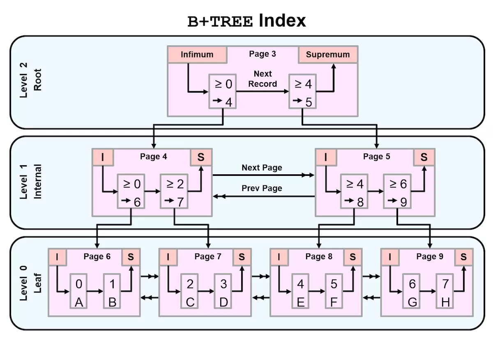
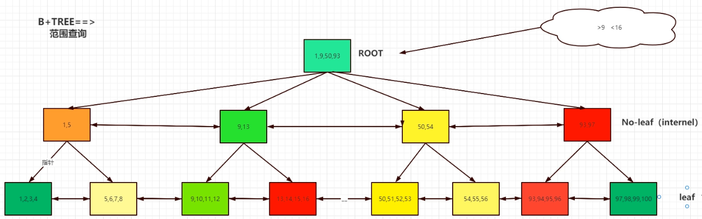

# 索引分类介绍

## 一、介绍

```bash
相当于一本书中的目录，帮助我们快速找到需要内容的页码。
索引可以帮我们快速找到所需要行的数据页码。起到优化查询(where order by  group by ....)目的。
```


## 二、mysql索引类型

```bash
1、Btree （balance tree）	索引  ***
	b-tree
	b+tree（b+tree,b*tree）

Rtree		索引
hash		索引
fulltext	全文索引
Gis			地理位置索引
```

### 1、B+TREE





#### 1、介绍

```bash
遍历---》二叉树-->平衡二叉树---》balance tree

二叉树：
	左节点的key值小于当前节点的key值，右节点的key值大于当前节点的key值。
	

平衡二叉树：
	左子树与右子树的高度差不超过1


B树：
	一次IO读入内存是一页数据，根页数据是常驻数据，数据库启动时就加载到内存当中。只擅长等值查询

B+数：
	非叶子节点只放key
	叶子节点放key：value
	叶子节点有同级指针指向且有序排列，这意味着B+数在范围操作上有天然的优势
	擅长等值查询和范围查询

问题：0-100随机一个数字（假设是9），怎么猜中
	1、最笨方法：逐个猜
	2、二分法：（0-50？ 50-100？）（0-25？ 25-50）（0-12？12-25？）
		问题：二叉树不公平

```

#### 2、分类

```bash
B tree 适合等值查询
B+Tree 在叶子节点添加了双向，在范围查询方面提供了更好的性能(> < >= <= like)
B*Tree 在枝干节点添加了双向
作用：减少了io和量级
```


### 2、MySQL B+tree索引构建过程

#### 1、聚簇索引Btree结构（InnoDB独有）

```bash
区 === 》簇（64个pages）===>1M
构建前提：
	1.建表时，指定了主键列，MySQLInnoDB会将主键作为聚簇索引列，比如ID not null primary key
	2.没有主键，自动选择唯一键（unique）的列，作为聚簇索引。
	3.以上都没有，生成隐藏聚簇索引。
	4.聚集索引必须在建表时才有意义,一般是表的无关列(ID)
作用：
	有了聚簇索引之后，将来插入的数据行，在同一个区内，都会按照ID值的顺序，有序在磁盘存储数据。
	MySQL InnoDB 表 聚簇索引阻止存储数据表
	
```


```bash
构建过程：
1、聚簇索引按照原始数据行所在的数据页（16K）作为叶子节点，然后构建枝节点（存储最下层叶子节点的最小值（一个范围）和指针情况），然后形成根节点（存储下层枝节点的最小值（一个范围）和指针情况）。且根和每个枝节点都占一个页（16K），叶子节点直接使用数据库的页，索引不占用空间。

```


**索引过程简述（如何找到id=23的行）**

```bash
1.加载根节点到内存
2.根据根节点知道去17-21的枝节点
3.加载17-21的枝节点
4.根据枝节点知道去21-24这个页
5.加载这个页，找到23。
6.综上，我们只读了三个页。
```


### 3、辅助索引btree结构

#### 说明

```bash
使用普通列作为条件构建的索引。需要人为创建。
```


#### 作用

````bash
优化非聚簇索引列之外的查询条件的优化
````


#### 创建辅助索引过程

```mysql
alter table t1 add index idx(name);
1.取出ID列和辅助索引列的所有值进行自动排序
2.申请索引叶子节点数据页（16K）,将有序的值存储到叶子节点的数据页中
3.申请枝节点和根节点数据页，将下层节点最小值存储进去
```


#### 辅助索引搜索过程

```mysql
select * from t1 where name='s';
1.加载根节点到内存
2.根据根节点知道去page121的枝节点
3.加载page121的枝节点
4.发现有两个包含s的叶子节点，两个都要读取
4.根据枝节点知道page104和page105去这个页
5.加载这两个页，分别找到name='s'对应的id为8和25。
6.然后进行回表查询，select * from t1 where id in (8,25); 又要进行两次id聚簇索引
	如果辅助索引能完全覆盖我们查询结果时，就不回表。反之，就需要回表。
7.索引完成后打印结果
```


#### 补充

```bash
#回表的问题
1.io量级变大，iops会增大，随机io增大
	回表查询进行多次io，产生随机io，会影响读写效率。
	
#如何减少回表
1.尽可能用主键查询
2.设计理想的联合索引 更精确的查询条件+联合索引
	完全覆盖
3.回表除非只查询索引里面包含的（id、name）不查询*能避免，其他情况无法避免。
4.优化器算法：MBR（扩展扩容）
```


#### 聚簇索引和辅助索引的区别

```bash
1.聚集索引只能有一个,非空唯一,一般时主键
2.辅助索引,可以有多个,时配合聚集索引使用的
3.聚集索引叶子节点,就是磁盘的数据行存储的数据页
4.MySQL是根据聚集索引,组织存储数据,数据存储时就是按照聚集索引的顺序进行存储数据
5.辅助索引,只会提取索引键值,进行自动排序生成B树结构
```


#### 辅助索引细分

##### 1.普通的单列辅助索引


##### 2.联合索引

````mysql
介绍：多个列作为索引条件,生成索引树,理论上设计的好的,可以减少大量的回表查询
	select * from t1 where name='s' and gender = 'm';
	alter table t1 add idx(name,gender)
	alter table world.city add index idx_n_c(name,countrycode);

要求：1、查询条件中，必须包含最左列
	  2、建立联合索引时，一定要选择重复值少的列，作为最左列
	  
例如：idx（a,b,c）可以索引，a，ab，abc
  全部覆盖：
	select * from t1 where a= and b= and c=
	select * from t1 where a in and b in and c in
	select * from t1 where a and b order by c
  部分索引：
  	select * from t1 where a= and b=
  	select * from t1 where a= 
  	select * from t1 where a= and b (> < >= <=) like and c=
  	select * from t1 where a= and c=
  不覆盖：
   bc
   b
   c
````


##### 3.前缀索引

```mysql
1、针对所选择索引的列值长度过长，避免索引树增高、占用更多的索引数据页。
2、MySQL建议索引树高度3-4层。
3、所以可以选择大字段的前面部分字符作为索引的生成条件。
4、选择的前缀索引的前缀时，前缀位数尽量要有标识度。
alter table world.city add index idx_d(district(5));
```


##### 4.唯一索引


```mysql
唯一性索引的值是唯一的，可以更快速的通过该索引来确定某条记录。
例如，学生表中学号是具有唯一性的字段。为该字段建立唯一性索引可以很快的确定某个学生的信息。
如果使用姓名的话，可能存在同名现象，从而降低查询速度。

优化方案:
(1) 如果非得使用重复值较多的列作为查询条件(例如:男女),可以将表逻辑拆分
(2) 可以将此列和其他的查询类,做联和索引
select count(*) from world.city;
select count(distinct countrycode) from world.city;
select count(distinct countrycode,population ) from world.city;
```


#### 索引树的高度受什么影响

```MySQL
1. 数据量级过大			#解决方法:分区表，归档表(pt-archive),分布式架构 
2. 索引列值过长 			#解决方法:前缀索引
3. 选择合适的数据类型
	变长长度字符串,使用了char,解决方案:变长字符串使用varchar
	enum类型的使用enum ('山东','河北','黑龙江','吉林','辽宁','陕西'......)
                      1      2      3
```


# 补充

### 1、更新数据时，会对索引有影响吗，数据变化回使索引实时更新吗？比如insert，updata，delete

```mysql
对于聚簇索引会立即更新。
对于辅助索引，不是实时更新的。
	1、在Innodb 内存结构中，加入了insert buffer（会话），现在版本叫change。
	2、change buffer 功能是临时缓冲辅助索引需要的数据更新，当我们需要查询新insert的数据时，会在内存中进行merge(合并操作)，此时辅助索引在内存就是最新的。
	3、当change buffer或随机某个时间，会将内存中的最新的辅助索引写入磁盘。
	
	
```


### 2、双11大量访问时，索引设置不及时，应该如何解决，如何知道用户经常访问的数据信息是哪些？

```mysql
1、双11的时候，并发度太高，提前1-2周将热点商品数据灌入到TAir（redis，memcached）集群中。

2、KAFKA
```


### 3、如何判断用户有没有走我们的索引？

```mysql
slowlog 日志可以收集不走索引的语句
具体在日志章节
```


### 4、linux看不到中文

```mysql
linux没有中文支持包
字符集设置有问题
```

