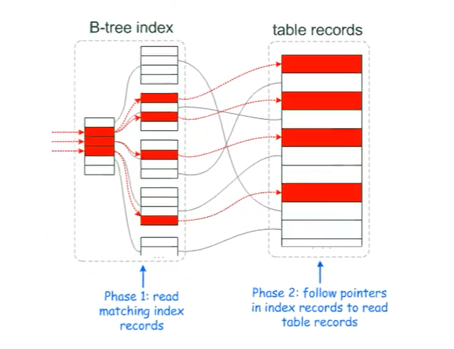
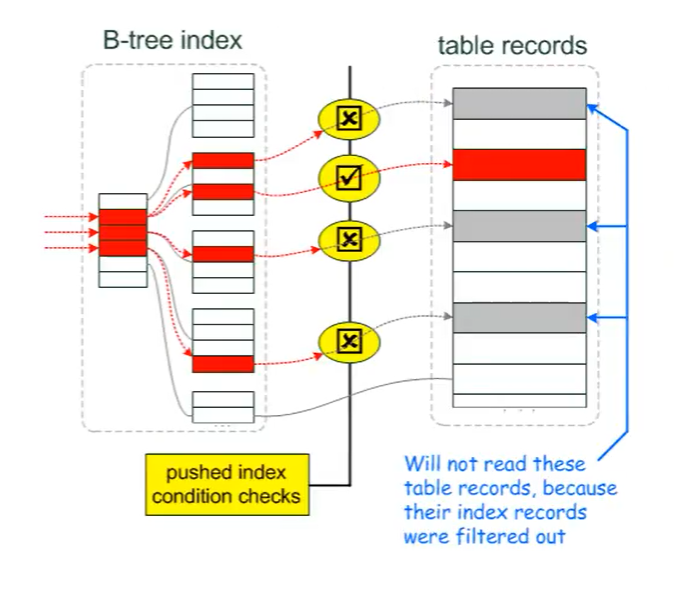
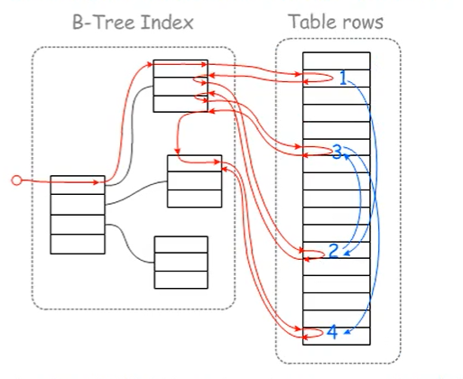
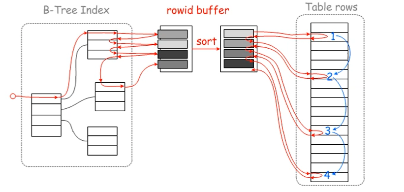
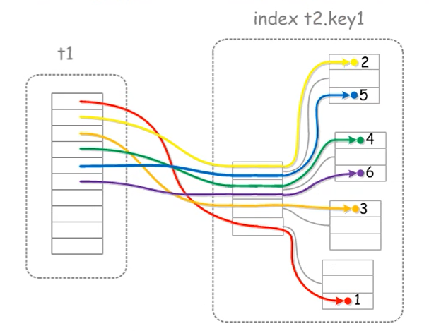
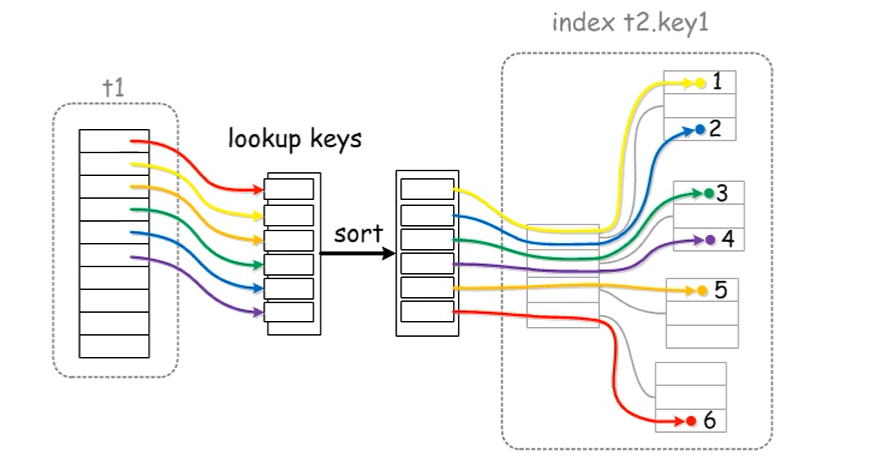

# 优化器针对索引的算法

## 自由化能力

### 一、MySQL索引的自由化-AHI（自适应HASH索引）

````mysql
1、MySQL的innodb引擎，能够创建只有Btree
2、AHI作用：自动评估"热"的内存索引page，生成HASH索引表。帮助Innodb快速读取索引页。加快索引读取的速度。相当于索引的索引。
3、AHI过程：
	index(a,b,c)
	select * from t1 where a= and c= ;
	先在server做a列过滤条件的索引优化
	再将c列的过滤下推到engine层做过滤
	加载数据页
````


### 二、MySQL索引的自由化-change buffer

```mysql
1、比如insert，updata，delete数据。
2、对于聚簇索引会立即更新
3、对于辅助索引，不是实时更新的。
4、在Innodb内存结构中，加入了insert buffer（会话），现在版本叫change buffer。change buffer 功能是临时缓冲辅助索引需要的数据更新。当我们需要查询新insert的数据，会在内存中进行merge（合并）操作，此时辅助索引就是最新的。然后在某个时段将最新的辅助索引更新到磁盘当中。
```


## 算法

### 一、优化器算法

#### 1、查询

```mysql
mysql> select @@optimizer_switch;

index_merge=on,					索引合并
index_merge_union=on,			联合索引合并
index_merge_sort_union=on,		联合索引合并调整
index_merge_intersection=on,	索引合并交集
engine_condition_pushdown=on,	引擎条件下推
index_condition_pushdown=on,	ICP：索引条件下推
mrr=on,							muti range read :多范围读取
mrr_cost_based=on,				基于成本的多范围读取
block_nested_loop=on,			基于块的循环嵌套连接
batched_key_access=off,			批量键访问
materialization=on,				物化
semijoin=on,					半连接
loosescan=on,					松散扫描
firstmatch=on,					第一场比赛
duplicateweedout=on,			重复的weedout
subquery_materialization_cost_based=on,
								基于成本物化子查询
use_index_extensions=on,		使用索引扩展名
condition_fanout_filter=on,		条件输出过滤
derived_merge=on				导出合并


```


#### 2、如何修改

```mysql
1./etc/my.cnf
2.set global optimizer_switch='batched_key_access=on';
3.hints
    SELECT /*+ NO_RANGE_OPTIMIZATION(t3 PRIMARY, f2_idx) */ f1
      FROM t3 WHERE f1 > 30 AND f1 < 33;
    SELECT /*+ BKA(t1) NO_BKA(t2) */ * FROM t1 INNER JOIN t2 WHERE ...;
    SELECT /*+ NO_ICP(t1, t2) */ * FROM t1 INNER JOIN t2 WHERE ...;
    SELECT /*+ SEMIJOIN(FIRSTMATCH, LOOSESCAN) */ * FROM t1 ...;
    EXPLAIN SELECT /*+ NO_ICP(t1) */ * FROM t1 WHERE ...;
```


### 二、ICP （index_condition_pushdown）索引下推

```mysql
作用：
	为了减少没必要的数据页被扫描，将不走索引的条件，在引擎层（engine）提取数据之前先做二次过滤，否定一些不必要的索引。解决无关数据页的读取，解决联合索引只能部分应用的情况。

过程：
	select查询语句在sql层解析后，由优化器选择好方案，在进入引擎层后，引擎层那数据前进行再次过滤，过滤好后再读取硬盘的数据。
```


**没有ICP**





**使用ICP**




### 三、MRR (muti range read)多范围读取

```mysql
mrr优化回表，部分随机io转顺序io，减少回表次数。
    原来：辅助索引----》回表---》 聚簇索引
    mrr：辅助索引---》sort id--》回表---》聚簇索引
```


**没有mrr时**




**有mrr时**



### 四、SNLJ(simple nested loops join)简单嵌套循环联接

```mysql
a join b on a.xx = b.yy where=
伪代码
	for each row in a matching range {
		for each row in b{
			a.xx = b.yy ,send to client
		}
	}
	以上例子，可以通过left join 强制驱动表。
```


### 五、BNLJ（block nested loops join）基于块的嵌套循环联接

```mysql
a join b on a.xx = b.yy where=
伪代码
	for each row in a matching range {
		block
		for each row in b{
			a.xx = b.yy ,send to client
		}
	}
	在a和b关联条件匹配时，不再一次一次进行循环。而是采用一次性将驱动表的关联值和非驱动表匹配。一次性返回结果

主要优化：
	cpu消耗减少，减少了IO次数
	
缺陷：同数据页还要发生多次IO，还是有随机io现象。
	
显示：
	In EXPLAIN output, use of BNL for a table is signified when the Extra value contains Using join buffer (Block Nested Loop) and the type value is ALL, index, or range.
	
	
	8.0.18后转为使用Hash join 8.0.20起弃用BNLJ
```




### 六、BKAJ（batch key access join）批量键访问

````mysql

主要作用：用来优化非驱动表的关联列有辅助索引。相当于BNL+MRR的功能，可以顺序IO，同数据页只读一次，预读。

开启方式：
mysql> set global optimizer_switch='mrr=on,mrr_cost_based=off';
mysql> set global optimizer_switch='batched_key_access=on';
重新登录生效
````

