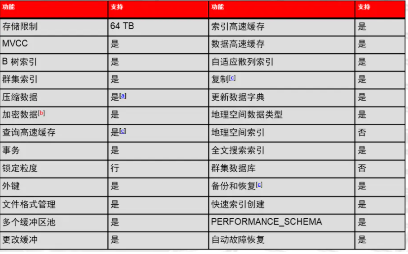
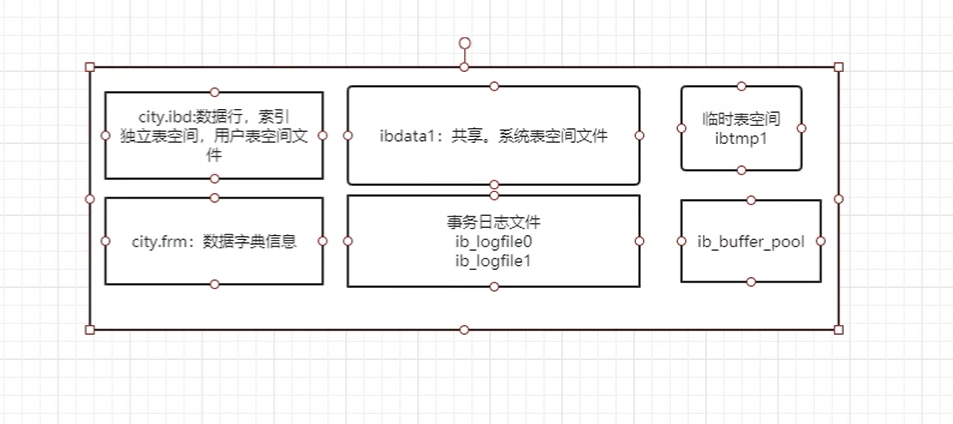
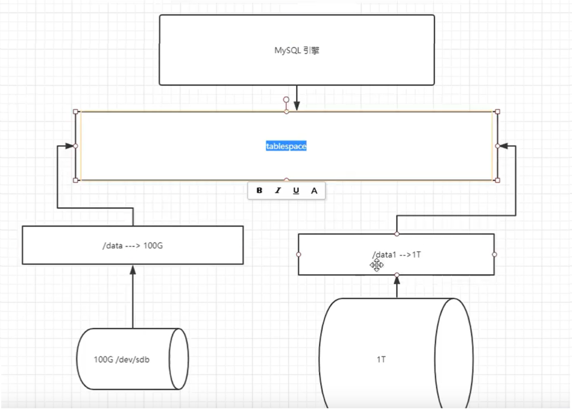

# MySQL存储引擎介绍

## 一、什么是存储引擎

```mysql
1.相当于MySQL内置的文件系统。
2.与linux中的文件系统打交道的层次结构

功能:
    数据读写
    数据安全和一致性
    提高性能
    热备份
    自动故障恢复
    高可用方面支持
    等.
```


## 二、MySQL存储引擎种类

### 1、Oracle MySQL分支

```mysql
可以根据不同的表，设定不同的存储引擎。

mysql> mysql> show engines;
+--------------------+---------+----------------------------------------------------------------+--------------+------+------------+
| Engine             | Support | Comment                                                        | Transactions | XA   | Savepoints |
+--------------------+---------+----------------------------------------------------------------+--------------+------+------------+
| InnoDB             | DEFAULT | Supports transactions, row-level locking, and foreign keys     | YES          | YES  | YES        |
| MRG_MYISAM         | YES     | Collection of identical MyISAM tables                          | NO           | NO   | NO         |
| MEMORY             | YES     | Hash based, stored in memory, useful for temporary tables      | NO           | NO   | NO         |
| BLACKHOLE          | YES     | /dev/null storage engine (anything you write to it disappears) | NO           | NO   | NO         |
| MyISAM             | YES     | MyISAM storage engine                                          | NO           | NO   | NO         |
| CSV                | YES     | CSV storage engine                                             | NO           | NO   | NO         |
| ARCHIVE            | YES     | Archive storage engine                                         | NO           | NO   | NO         |
| PERFORMANCE_SCHEMA | YES     | Performance Schema                                             | NO           | NO   | NO         |
| FEDERATED          | NO      | Federated MySQL storage engine                                 | NULL         | NULL | NULL       |
+--------------------+---------+----------------------------------------------------------------+--------------+------+------------+

列举MySQL中支持存储引擎种类
Innodb：MySQL5.5版本以后默认的存储引擎。99%以上的业务表是InnoDB
MyISAM：
CSV：
MEMORY：
```


### 2、其他分支percona、Mariadb

```mysql
percona:Xtradb
MAriadb:Innodb

其他引擎：
TokuDB，MYrocks

tokudb：适合业务当中有大量插入或者删除操作的场景，应用于数据量级比较大的业务
	高压缩比
Compression: TokuDB compresses all data on disk, including indexes. Compression lowers cost by reducing the amount of storage required and frees up disk space for additional indexes to achieve improved query performance. Depending on the compressibility of the data, we have seen compression ratios up to 25x for high compression. Compression can also lead to improved performance since less data needs to be read from and written to disk.
压缩：TokuDB压缩磁盘上的所有数据，包括索引。压缩通过减少所需的存储量来降低成本，并为附加索引释放磁盘空间，以提高查询性能。根据数据的可压缩性，我们已经看到高压缩比高达25倍。压缩还可以提高性能，因为需要从磁盘读取和写入的数据更少。

	插入和删除的性能高
Fast Insertions and Deletions: TokuDB’s Fractal Tree technology enables fast indexed insertions and deletions. Fractal Trees match B-trees in their indexing sweet spot (sequential data) and are up to two orders of magnitude faster for random data with high cardinality.
快速插入和删除：TokuDB的分形树技术支持快速索引插入和删除。分形树在索引甜点（顺序数据）中匹配B树，对于基数较高的随机数据，其速度快达两个数量级。

现在很多的NewSQL,使用比较多的功能特性
```


### 简历案例

**面试问题**

```mysql
问:2亿行的表，想要删除其中1000w，你们公司都怎么做的？假如是按照时间列条件
回答:
1.如果2亿行数据表，还没有生成，建议在设计表时，采用分区表的方式（按月 range），然后删除时 truncate
2.如果2亿行数据表，已经存在，建议使用pt- archive工具进行归档表，并且删除无用薮据
```


```mysql
环境: zabbix 3.2    mariaDB 5.5(Innodb)  centos 7.3
现象 : zabbix卡的要死 ,  每隔3-4个月,都要重新搭建一遍zabbix,存储空间经常爆满.
问题 :
    1. zabbix 版本 
    2. 数据库版本
    3. zabbix数据库500G,存在一个文件里,其中一个文件400G，删除一个月前的数据，空间不释放
优化建议:
    1.数据库版本升级到5.7+版本 mariadb 10.1+  percona ,zabbix升级更高版本
    2.存储引擎改为tokudb
    3.监控数据按月份进行切割(二次开发:zabbix 数据保留机制功能重写,数据库分表)
    4.关闭binlog和双1
    5.参数调整....
优化结果:
	监控状态良好

为什么?
    1. 原生态支持TokuDB,另外经过测试环境,5.7要比5.5 版本性能 高  2-3倍
    2. TokuDB:insert数据比Innodb快的多，数据压缩比要Innodb高
    3.监控数据按月份进行切割,为了能够truncate每个分区表,立即释放空间
    4.关闭binlog ----->减少无关日志的记录.
    5.参数调整...----->安全性参数关闭,提高性能.

参考：
	去mariadb和tokudb官网
	https://www.percona.com/doc/percona-tokudb/index.html
	https://mariadb.org/
```


````mysql
环境: centos 5.8 ,MySQL 5.0版本,MyISAM存储引擎,网站业务(LNMP),数据量50G左右
现象问题: 业务压力大的时候,非常卡;经历过宕机,会有部分数据丢失.
问题分析:
    1.MyISAM存储引擎表级锁,在高并发时,会有很高锁等待
    2.MyISAM存储引擎不支持事务,在断电时,会有可能丢失数据
职责
    1.监控锁的情况:有很多的表锁等待
    2.存储引擎查看:所有表默认是MyISAM
解决方案:
    1.升级MySQL 5.6.10版本
    2. 迁移所有表到新环境
    3. 开启双1安全参数

查看表锁等待
	mysql> show status like '%lock%';
	
````

### 双1安全参数

```mysql
	mysql的"双1验证"指的是innodb_flush_log_at_trx_commit和sync_binlog两个参数设置，这两个是是控制MySQL 磁盘写入策略以及数据安全性的关键参数。下面从参数含义，性能，安全角度阐述两个参数为不同的值时对db 性能,数据的影响。

一、参数意义

innodb_flush_log_at_trx_commit
	如果innodb_flush_log_at_trx_commit设置为0：log buffer将每秒一次地写入log file中，并且log file的flush(刷到磁盘)操作同时进行.该模式下，在事务提交的时候，不会主动触发写入磁盘的操作;
	如果innodb_flush_log_at_trx_commit设置为1：每次事务提交时MySQL都会把log buffer的数据写入log file，并且flush(刷到磁盘)中去;
	如果innodb_flush_log_at_trx_commit设置为2：每次事务提交时MySQL都会把log buffer的数据写入log file，但是flush(刷到磁盘)操作并不会同时进行。该模式下,MySQL会每秒执行一次 flush(刷到磁盘)操作。

注意：由于进程调度策略问题,这个"每秒执行一次 flush(刷到磁盘)操作"并不是保证100%的"每秒"。

sync_binlog
	sync_binlog 的默认值是0，像操作系统刷其他文件的机制一样，MySQL不会同步到磁盘中去而是依赖操作系统来刷新binary log。
	当sync_binlog =N (N>0) ，MySQL 在每写 N次 二进制日志binary log时，会使用fdatasync()函数将它的写二进制日志binary log同步到磁盘中去。
```


### 3、Innodb核心特性




#### 1）介绍（myisam没有的）

```mysql
MVcc（Multi-Version Concurrency Control多版本并发控制）
clustered index	（聚簇索引）
change buffer
自适应hash索引（AHI）

多缓冲区池
事务（Transaction）
行级锁粒度(Row-level Lock)	
外键
更多复制特性
支持热备(Hot Backup)
自动故障恢复
change buffer
自适应hash索引（AHI）
ACSR（Auto Crash Safey Recovery）自动的故障安全恢复
Replication: Group Commit , GTID (Global Transaction ID) ,多线程(Multi-Threads-SQL ) 

在MySQL5.5版本之后，默认的存储引擎，提供高可靠性和高性能。
```


## 三、存储引擎的管理命令

### 1、查看默认存储引擎

```mysql
SELECT @@default_storage_engine;
```


### 2、默认存储修改（不建议生产操作）

```mysql
1.会话级别修改:
	set default_storage_engine=myisam;
2.全局级别修改(仅影响新会话):
	set global default_storage_engine=myisam;
重启之后,所有参数均失效.

3.如果要永久生效:
	写入配置文件
	vim /etc/my.cnf
	[mysqld]
	default_storage_engine=myisam

存储引擎是表级别的,每个表创建时可以指定不同的存储引擎,但是我们建议统一为innodb.
```


### 3、SHOW 确认每个表的存储引擎

```mysql
mysql> show create table world.city\G

mysql> show table status like 'city'\G

```


### 4、INFORMATION_SCHEMA 确认每个表的存储引擎

```mysql
查看所有表的引擎
select table_schema,table_name ,engine from information_schema.tables where table_schema not in ('sys','mysql','information_schema','performance_schema');

Master [world]>show table status;
Master [world]>show create table city;
```


### 5、修改一个表的存储引擎

```mysql
alter table t1 engine innodb;
注意：此命令我们经常使用他，进行innodb表的碎片整理，，但是不能完全解决
#查看所有表有没有碎片
mysql> select table_schema,table_name,data_free from information_schema.tables;
```


### 6、平常处理过的MySQL问题--碎片处理

````mysql
环境:centos7.4,MySQL 5.7.20,InnoDB存储引擎

业务特点:数据量级较大,经常需要按月删除历史数据.
问题:磁盘空间占用很大,不释放
处理方法:
以前:将数据逻辑导出,手工drop表,然后导入进去
现在:
对表进行按月进行分表(partition,中间件)或者归档表（pt-archive）
业务替换为truncate方式

#查看所有表有没有碎片
mysql> select table_schema,table_name,data_free from information_schema.tables;


````


### 7、批量修改存储引擎

```mysql
需求:将zabbix库中的所有表,innodb替换为tokudb
select concat("alter table zabbix.",table_name," engine tokudb;") from information_schema.tables where table_schema='zabbix' into outfile '/tmp/tokudb.sql';
```


## 四、InnoDB存储引擎物理存储结构

### 1、最直观的存储方式

```mysql
[root@Centos7 /service/mysql/data/world]# ll
total 1336
-rw-r----- 1 mysql mysql   8710 Mar  4 11:22 city.frm
-rw-r----- 1 mysql mysql 917504 Mar  4 11:22 city.ibd
-rw-r----- 1 mysql mysql   9172 Feb 28 17:14 country.frm
-rw-r----- 1 mysql mysql 163840 Feb 28 17:14 country.ibd
-rw-r----- 1 mysql mysql   8702 Feb 28 17:14 countrylanguage.frm
-rw-r----- 1 mysql mysql 229376 Feb 28 17:14 countrylanguage.ibd
-rw-r----- 1 mysql mysql     61 Feb 28 17:14 db.opt
-rw-r----- 1 mysql mysql   8556 Mar  5 19:32 myt.frm
-rw-r----- 1 mysql mysql      0 Mar  5 19:32 myt.MYD
-rw-r----- 1 mysql mysql   1024 Mar  5 19:32 myt.MYI
```


#### 1）MyISAM

```mysql
myt.frm：数字字典信息（列的定义和属性）
myt.MYD：数据行
myt.MYI：索引

#除系统表很少有使用MyISAM
```


#### 2）Innodb


**磁盘目录结构**




##### 1、frm

```mysql
frm：数字字典信息（列的定义和属性）
```


##### 2、ibd

```mysql
ibd:（独立表空间文件）：数据行和索引

从5.6，默认表空间不再使用共享表空间，替换为独立表空间。
主要存储的是用户数据
存储特点为：一个表一个ibd文件，存储数据行和索引信息
基本表结构元数据存储：
xxx.frm
最终结论：
      元数据            数据行+索引
mysql表数据    =（ibdataX+frm）+ibd(段、区、页)
        DDL             DML+DQL

MySQL的存储引擎日志：
	Redo Log: ib_logfile0  ib_logfile1，重做日志
	Undo Log: ibdata1 ibdata2(存储在共享表空间中)，回滚日志
临时表:ibtmp1，在做join union操作产生临时数据，用完就自动

```


##### 3、ibdata1

```mysql
	ibdata1：系统数据字典信息(统计信息)，UNDO，double write 磁盘区域，change buffer磁盘区域

	说明：不同版本ibdata1存储的数据不一样
		5.5：ibdata1中还会存储临时表数据+用户数据（数据行+索引）
		5.6：ibdata1中还会存储临时表数据
		5.7：ibdata1临时表被独立出去
		8.0：ibdata1取消存储数据字典信息，undo被独立
		可以理解为，MySQL在慢慢瘦身ibdata1共享表空间，把比较关键的数据独立出来了。
```


##### 4、ib_logfile0 ~ ib_logfile1

```mysql
ib_logfile0 ~ ib_logfile1: REDO日志文件，事务日志文件，事务重做日志（redo log）
```


##### 5、ibtmp1

```mysql
临时表空间文件（排序，分组，多表连接，子查询，逻辑备份）
```


##### 6、ib_buffer_pool

```mysql
正常关库的时候，存储缓冲区的热数据
```

**综上仅仅拷贝ibd和frm文件到新的数据库，是无法正常使用**


## 五、InnoDB微观结构

### 1、磁盘

#### 表空间



##### 1）介绍

````mysql
1、什么是表空间？
	表空间概念是引入与Oracle数据库。
	起初是为了解决存储空间扩展问题。 MySQL5.5版本引入了共享表空间模式。
````


##### 2)mysql表空间类型

```mysql
1.共享表空间：
	1)在5.5版本引入了共享表空间（ibdata1）
	2)用来存储：系统数据，日志，undo，临时表，用户数据和索引。

2.独立表空间：
	5.6版本默认独立表空间模式。单表单空间。

3.普通表空间：
	1）可以自制表空间和灵活扩展
	2）完全和Oracle一致的表空间管理模式。

4.undo表空间：
	存储undo logs（回滚日志）

5.临时表空间：
	存储临时表（5.7默认独立）
```


##### 3)表空间管理

```mysql
1、用户数据默认的存储方式：独立表空间模式
2、独立表空间和共享表空间是可以互相切换的
```


###### 1.查看默认的表空间模式

```mysql
mysql> select @@innodb_file_per_table;

+-------------------------+
| @@innodb_file_per_table |
+-------------------------+
|                       1 |
+-------------------------+

1代表独立表空间模式
0代表共享表空间模式
```


###### 2.切换表空间模式

```mysql
临时：
mysql> set global innodb_file_per_table=0;

重新登录生效

mysql> select @@innodb_file_per_table;
+-------------------------+
| @@innodb_file_per_table |
+-------------------------+
|                       0 |
+-------------------------+

永久：
vim /etc/my.cnf
innodb_file_per_table=0

说明：修改完成之后，只影响新创建的表。
```


###### 3.扩展共享表空间大小和个数(生产)

```mysql
1.初始化之前操作
说明：通常是在初始化数据是，就设定好参数。
	查看：
    mysql> select @@innodb_data_file_path;
    +-------------------------+
    | @@innodb_data_file_path |
    +-------------------------+
    | ibdata1:12M:autoextend  |
    +-------------------------+
	
	初始化之前，需要在my.cnf加入以下配置即可：
		vim /etc/my.cnf
		innodb_data_file_path=ibdata1:1G;ibdata2:1G:autoextend  
		
2.以运行的数据库上扩展ibdata文件
	错误的方式：
		vim/etc/my.cnf
		innodb_data_file_path=ibdata1:1G;ibdata2:1G:autoextend
	

```


**扩展**

```mysql
数据库启动不了排错：
	查看错误日志，一般是和数据放一起，找括号[error],看相关错误信息。
	innodb data file path=ibdatal: 128M; ibdata2: 128M; ibdata3: 128M: autoextend
	2020-02-21T08: 31: 14.261562Z 0 【ERROR】 InnoDB: The innodb system data file ./ibdatal is of alifferent size 4864 pages （rounded down to MB） than the 8192 pages specified in the.cnf file！

解决方法：在设置innodb_data_file_path参数时，已有的ibdata1文件大小应该和磁盘真实大小一致，而不是随便指定。
	
    正确的方法：
	vim/etc/my.cnf
		innodb_data_file_path=ibdata1:76M;ibdata2:1G:autoextend
```


#### 段、区、页

```mysq
表 ----》 表空间 ----》段 -----》多个区 ----》连续的page ----》连续的block ----》连续的扇区
```


#### 事务日志


##### 1、redo log重做日志

###### 1）介绍

```mysql
用来存储MySQL在做修改类（DML）操作时的数据页变化过程及版本号，属于物理日志。
默认两个文件存储redo，是循环覆盖使用的。
```


###### 2）文件位置

```bash
默认与数据放在一起
[root@Centos7 /service/mysql/data]# ll
ib_logfile0
ib_logfile1
```


###### 3）控制参数

```mysql
mysql> show variables like '%innodb_log%'		#查看数据库变量
+-----------------------------+----------+
| Variable_name               | Value    |
+-----------------------------+----------+
| innodb_log_buffer_size      | 16777216 |
| innodb_log_checksums        | ON       |
| innodb_log_compressed_pages | ON       |
| innodb_log_file_size        | 50331648 |
| innodb_log_files_in_group   | 2        |
| innodb_log_group_home_dir   | ./       |
| innodb_log_write_ahead_size | 8192     |
+-----------------------------+----------+

#设置文件大小：
innodb_log_file_size=50331648
#设置文件个数
innodb_log_files_in_group=2
#设置存储位置
innodb_log_group_home_dir=./
```


##### 2、undo logs 回滚日志

###### 1）功能

```mysql
用来存储回滚日志，可以理解为记录了每次操作的反操作。属于逻辑日志。
	1.使用快照功能，提供Innodb多版本读写。
	2.通过记录的反操作，提供回滚功能
	
```


###### 2）文件位置

```mysql
默认：一部分在共享表空间，一部分在ibtmp
ibtmp1
ibdata1
```


###### 3）控制参数

```mysql
mysql> show variables like '%undo%';
+--------------------------+------------+
| Variable_name            | Value      |
+--------------------------+------------+
| innodb_max_undo_log_size | 1073741824 |
| innodb_undo_directory    | ./         |
| innodb_undo_log_truncate | OFF        |
| innodb_undo_logs         | 128        |
| innodb_undo_tablespaces  | 0          |
+--------------------------+------------+

mysql> show variables like '%segments%';
+--------------------------+-------+
| Variable_name            | Value |
+--------------------------+-------+
| innodb_rollback_segments | 128   |		#回滚段的个数
+--------------------------+-------+

```


### 2、内存

#### 1）数据内存区域

MySQL总共使用内存=共享内存+会话内存*会话个数+额外内存的使用（文件系统缓存）

##### 1.共享内存区域

###### ①buffer pool 缓冲区池：

```mysql
1.Innodb_buffer_pool_size		#设置缓冲区池大小
     mysql> select @@Innodb_buffer_pool_size;
     +---------------------------+
     | @@Innodb_buffer_pool_size |
     +---------------------------+
     |                 134217728 |
     +---------------------------+

2.功能：
	缓冲数据页和索引页
```


##### 2.会话内存缓冲区域

###### ①join_buffer_size


###### ②key_buffer_size


###### ③read_buffer_size 


###### ④read_rnd_buffer_size 


###### ⑤sort_buffer_size


#### 2）日志

```mysql
 innodb_log_buffer_size = 6777216
 功能：负责redo日志的缓存
```