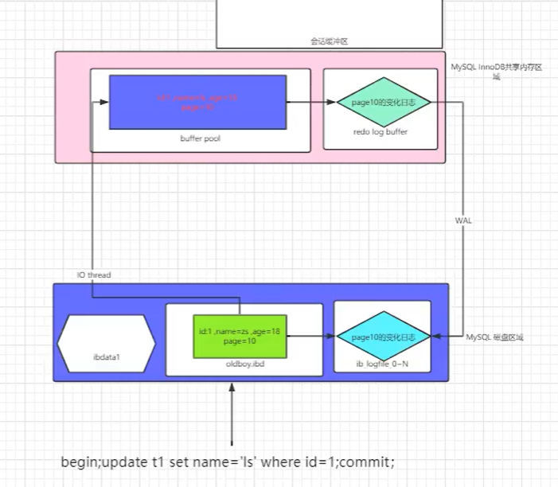
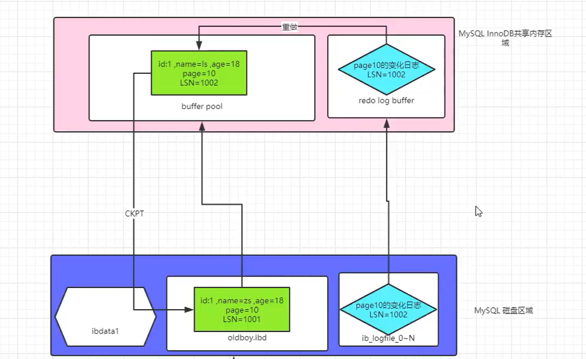
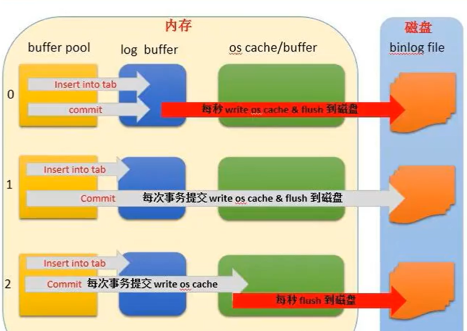
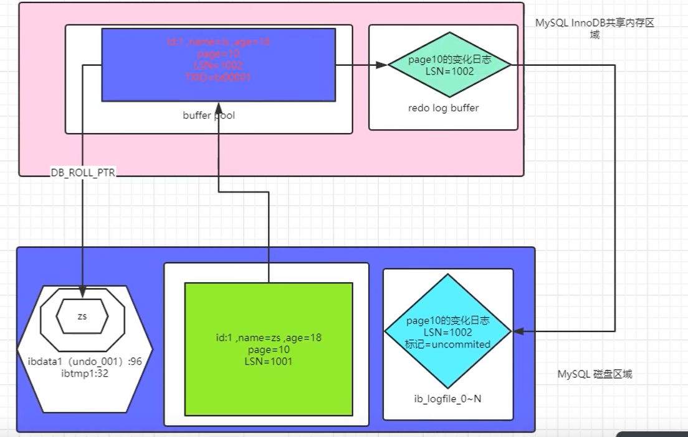
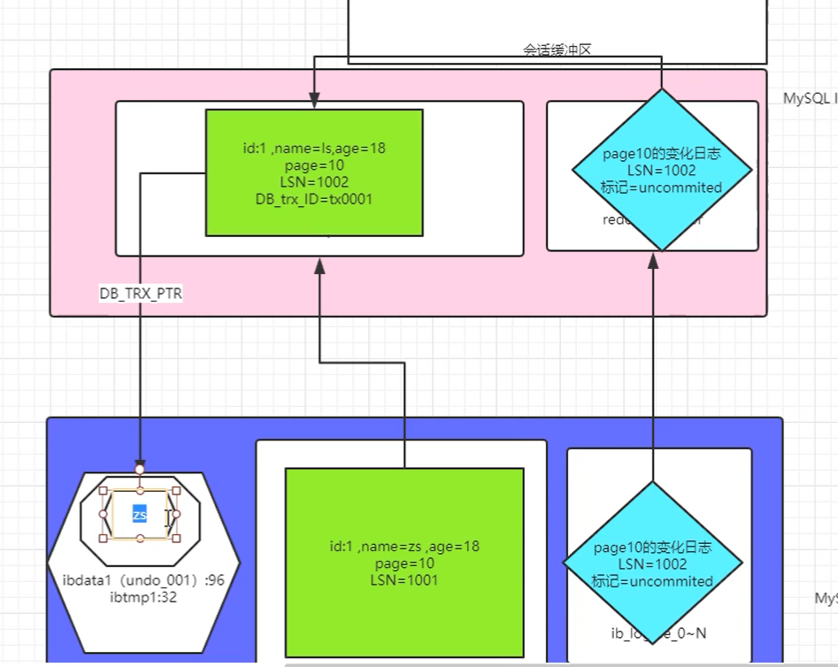

```rust
MySQL-Router    ---> MySQL官方
ProxySQL         --->Percona
Maxscale         ---> MariaDB
```

**面试问题**

```mysql
问:2亿行的表，想要删除其中1000w，你们公司都怎么做的？假如是按照时间列条件
回答:
1.如果2亿行数据表，还没有生成，建议在设计表时，采用分区表的方式（按月 range），然后删除时 truncate
2.如果2亿行数据表，已经存在，建议使用pt- archive工具进行归档表，并且删除无用薮据
```


# 事务

## 一、什么是事务？

```mysql
事务是伴随着《交易类》的业务场景出现的工作机制。保证交易的“和谐”。
```

**交易？**

```mysql
现实交易：
	物换物：麦子换面粉，豆子换豆腐
	货币换物：实物货币换货品，虚拟货币换货物。
	法律或道德约束。和谐的交易是什么类型？
		钱货两清
		
计算机中：
	例如：a账户有100元，b账户0元。
        a发红包给b100元
        a账户：updata	100-100=0元
        b账户：updata	0+100=100元
        事务结束
	

```


## 二、事务的ACID特性

### 1、Atomic

```mysql
原子性：所有语句作为一个单元全部成功执行或全部取消。不能出现中间状态。

	初中知识：原子是物质的构成单元之一，具备化学不可分割性
	在一个事务工作单元中，所有标准事务语句（DML），要么全成功，要么全回滚。
```


### 2、Comsistent

```mysql
一致性：如果数据库在事务开始时处于一致状态，则在执行该事务期间将保留一致状态。

    事务发生前、中、后都应该保证数据始终一致状态
    MySQL的各项功能的设置，都是最终要保证一致性。
    
   例如：
   		一个转账事务，里面有两条sql语句，一条是张三减少100元，另一个是李四加100元
   		转账前：
   			张三：500元
   			李四：500元
   			总额：1000元
   			
   		事务执行完成后，即转账后
   			张三：400元
   			李四：600元
   			两个人总钱数：1000元
   			
   		ps：前后数据类型也要保持一致
```


### 3、Isolated

```mysql
隔离性：事务之间不相互影响。
	mysql支持多事务并发工作的系统。
	a工作的时候不能收到其他事物的影响
	
	串行：一个运行完毕按照顺序再运行下一个，排队吃包子。
	并发：看起来是同行运行的
	并行：真正意义上的同时运行
```


### 4、Durable

```mysql
持久性：事务成功完成后，所做的所有更改都会准确地记录在数据库中。所做的更改不会丢失。

当事务提交（commit命令执行成功后，此次事务操作的所有数据“落盘”），都要永久保存下去。不会因为数据实例发生故障。
```


## 三、事务生命周期管理

### 1、标准事务控制语句

#### 1）begin/start transaction

```mysql
开启事务
说明:在5.5 以上的版本，不需要手工begin，只要你执行的是一个DML，会自动在前面加一个begin命令。
```


#### 2）commit

```mysql
提交事务:完成一个事务，一旦事务提交成功 ，就说明具备ACID特性了。
```


#### 3）rollback

```mysql
回滚事务:将内存中，已执行过的操作，回滚回去
```

**无论是commit、rollback，只要执行了就需要重新begin**

### 2、标准的事务语句

```mysql
insert
updata
delete
select
```


### 3、自动提交功能

```mysql
作用：
	在autocommit=1的时候，在执行dml时，没有加begin（没有显示的开启事务），在你执行dml语句时，会自动在这个dml之前加一个begin，在dml之后加一个commit。
	在autocommit=0的时候，在执行dml时，没有加begin（没有显示的开启事务），在你执行dml语句时，会自动在这个dml之前加一个begin，但是在需要手动commit提交才生效。
应用场景：
	autocommit=1，一般适合于非交易类业务场景
	
	如果是交易类业务：
	方案一：
		autocommit=0；手工commmit提交才生效
	
	方案二：
		autocommit=1；
		每次想要发生事务性操作
		begin和commit都手动操作。
		

		select @@autocommit;	查看事务是否在开启

注：
自动提交是否打开，一般在有事务需求的MySQL中，将其关闭
不管有没有事务需求，我们一般也都建议设置为0，可以很大程度上提高数据库性能

设置方法：
    (1)临时
    set autocommit=0;   			局部生效
    set global autocommit=0;		全局生效

	(2)永久
    vim /etc/my.cnf
    autocommit=0     
```


### 4、隐式事务控制语句

```mysql
隐式提交：
	1.设置了autocommit=1（dml）
	2.DDl，DCL等非dml语句，会触发隐式提交。


用于隐式提交的 SQL 语句：
begin		begin 		
a			a
b			b
commit		begin

SET AUTOCOMMIT = 1

1.导致提交的非事务语句：
DDL语句： （ALTER、CREATE 和 DROP）
DCL语句： （GRANT、REVOKE 和 SET PASSWORD）
锁定语句：（LOCK TABLES 和 UNLOCK TABLES）
导致隐式提交的语句示例：
TRUNCATE TABLE
LOAD DATA INFILE
SELECT FOR UPDATE

2.隐式回滚：
	未commmit会话断开或死掉
	数据库宕机
	某些事务语句执行失败
```


## 四、InnoDB 事务的ACID如何保证?

### 1、关键名词介绍

#### 1)重做日志

```mysql
1.redo log ---> 重做日志 ib_logfile0~1   48M   , 轮询使用
	记录的是数据页的变化
2.redo log buffer ---> redo内存区域
```


#### 2）数据页存储位置

```mysql
1.ibd     ----> ibd(page)存储数据行和索引 

2.buffer pool --->缓冲区池,数据页和索引页的缓冲
```


#### 3）日志序列号lsn

```mysql
LSN : 日志序列号
磁盘数据页,redo文件,buffer pool,redo buffer
MySQL 每次数据库启动,都会比较磁盘数据页和redolog的LSN,必须要求两者LSN一致数据库才能正常启动
```


#### 4)日志优先写

````mysql
WAL : write ahead log 日志优先于数据页，写的方式实现持久化
````


#### 5)脏页

```mysql
脏页: 内存脏页,内存中发生了修改,没写入到磁盘之前,我们把内存页称之为脏页
	磁盘读到内存的数据被修改了且没写入磁盘，内存数据和磁盘数据不一样的数据页
```


#### 6）CKPT

```mysql
CKPT:Checkpoint,检查点,就是将脏页刷写到磁盘的动作
```


#### 7)TXID

```mysql
TXID: 事务号,InnoDB会为每一个事务生成一个事务号,伴随着整个事务.
```


#### 8)undo

```mysql
ibdata1中，存储了事务工作中的回滚信息。
```


#### 9)redo 

```mysql
数据前滚，在事务ACID过程中，实现的是“D”持久化的作用。对于AC也有相应的作用
```


## 五、事务的工作流程

### 1、 redo重做日志

#### 1） Redo是什么？

```ruby
redo,顾名思义“重做日志”，是事务日志的一种。
```


#### 2）作用是什么？

```undefined
在事务ACID过程中，实现的是“D”持久化的作用。对于AC也有相应的作用
```


#### 3） redo日志位置

```ruby
redo的日志文件：iblogfile0 iblogfile1
```


#### 4） redo buffer

```ruby
redo的buffer:数据页的变化信息+数据页当时的LSN号
LSN：日志序列号  磁盘数据页、内存数据页、redo buffer、redolog
```


#### 5） redo的刷新策略

```ruby
commit;
刷新当前事务的redo buffer到磁盘
还会顺便将一部分redo buffer中没有提交的事务日志也刷新到磁盘
```


**正常事务流程**



````mysql
1、找到要修改的数据，将要修改的page页读到内存的buffer pool中
2、在buffer pool中修改数据
3、redo log buffer基于wal原则先记录变化日志到磁盘当中
4、然后再将真正的数据写入磁盘

为什么要先写redo日志：
	因为redo日志小啊，redo只需要记录数据的变化，没有变化的数据不做记录。
	所以，及时写入真实数据宕机时也可以根据源数据加redo日志得到修改之前或修改之后的数据

````


#### 6） MySQL CSR——前滚（数据修改完提交中宕机）

**模拟宕机**




```ruby
MySQL : 在启动时,必须保证redo日志文件和数据文件LSN必须一致, 如果不一致就会触发CSR,最终保证一致
情况一:
我们做了一个事务,begin;update;commit.
1.在begin ,会立即分配一个TXID=tx_01.
2.update时,会将需要修改的数据页(dp_01,LSN=101),加载到data buffer中
3.DBWR线程,会进行dp_01数据页修改更新,并更新LSN=102
4.LOGBWR日志写线程,会将dp_01数据页的变化+LSN+TXID存储到redobuffer
5. 执行commit时,LGWR日志写线程会将redobuffer信息写入redolog日志文件中,基于WAL原则,
在日志完全写入磁盘后,commit命令才执行成功,(会将此日志打上commit标记)
6.假如此时宕机,内存脏页没有来得及写入磁盘,内存数据全部丢失
7.MySQL再次重启时,必须要redolog和磁盘数据页的LSN是一致的.但是,此时dp_01,TXID=tx_01磁盘是LSN=101,dp_01,TXID=tx_01,redolog中LSN=102
MySQL此时无法正常启动,MySQL触发CSR.在内存追平LSN号,触发ckpt,将内存数据页更新到磁盘,从而保证磁盘数据页和redolog LSN一值.这时MySQL正长启动
以上的工作过程,我们把它称之为基于REDO的"前滚操作"
```


#### 补充：

```mysql
1.redo存储的是事务工作过程中，数据页变化。commit时会立即写入磁盘（默认），日志落盘成功commit。正常mysql工作中，主要的工作是提供的是快速d（持久化）功能。mysql出现crash异常宕机时，主要提供的是前滚功能（csr）。

2.innodb_flush_log_at_trx_commit=【0，1，2】三种值：
    0 ：每秒将日志缓冲区写入log file，并同时flush到磁盘。跟事务提交无关。在机器crash并重启后，会丢失一秒的事务日志数据（并不一定是1s，也许会有延迟，跟操作系统调度有关）。

	1（默认）：每次事务提交将日志缓冲区写入log file，并同时flush到磁盘。（crash不会丢失事务日志）

	2：每次事务提交将日志缓冲区写入log file，每秒flush一次到磁盘。（crash有可能丢失数据）
	
3.其他	
	1.redo buffer还和操作系统缓存机制有关，所以书写策略可能和 innodb_fluash_method参数有一定关系。
	2.redo也有group commit;可以理解为，在每次刷新已提交的redo是，顺便可以将一些未提交的事务redo页一次性刷写到磁盘。此时为了区分不同状态的eredo，会添加一些比较特殊的标记（是否提交标记）。
```




### 2、undo 回滚日志

#### 1） undo是什么？

```undefined
undo,顾名思义“回滚日志”
```


#### 2） 作用是什么？

```mysql
1.在事务ACID过程中，实现的是“A” 原子性的作用
2.另外CI也依赖于Undo
3.在rolback时,将数据恢复到修改之前的状态
4.在CSR实现的是,先redo前滚，再undo回滚。
5.一致性快照：
  每个事务开启时（begin），都会通过undo生成一个一致性的快照。
  保存事务修改之前的数据状态.保证了MVCC,隔离性,mysqldump的热备功能
```


#### 3）过程

```mysql
1.现将数据页page加载到内存buffer pool当中
2.在内存buffer pool修改之前，现将事务的回滚信息写进磁盘undo日志当中，完成之后再进行修改
3.内存修改完成后，修改的每个行会生成专属的txid，然后redo log buffer记录行的变化日志。
4、redo log buffer基于wal原则先记录变化日志到磁盘当中
5、然后再将真正的数据写入磁盘

ps：undo在生成过程中，也会记录redo信息
```




#### 4）异常宕机（数据未提交宕机）

```mysql
1.宕机重启，发现redo日志lsn号码比数据lsn号码记得要大。undo中也记录了redo的变化信息。
2.将原数据页和redo日志分别加载到内存当中
3.根据redo变化日志信息对数据进行操作，来构成脏页（行数据、lsn、DB_trx_ID)。
4.发现redo日志中的标记发现uncommited。数据并没有提交。
5.通过DB_TRX_PTR找到最近的事务的回滚信息来进行回滚。
	先前滚，再回滚
```




