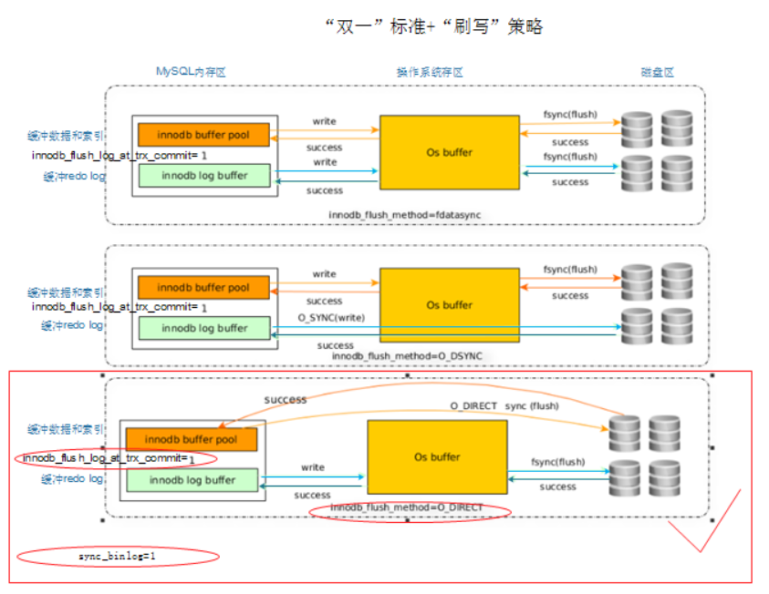
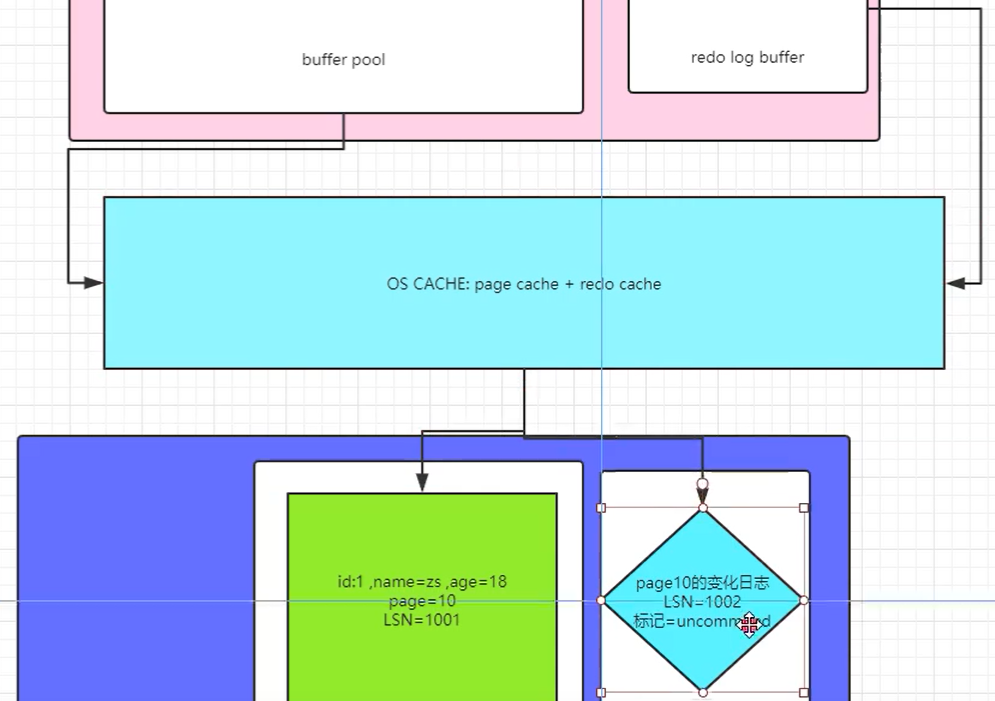

# 存储引擎核心参数


## innodb_flush_log_at_trx_commit=1/0/2

````mysql
innodb_flush_log_at_trx_commit=1/0/2
	双1标准之一： redo log 刷写参数

	提交事务的时候将 redo 日志写入磁盘中，所谓的 redo 日志，就是记录下来你对数据做了什么修改，比如对 “id=10 这行记录修改了 name 字段的值为 xxx”，这就是一个日志。如果我们想要提交一个事务了，此时就会根据一定的策略把 redo 日志从 redo log buffer 里刷入到磁盘文件里去。此时这个策略是通过 innodb_flush_log_at_trx_commit 来配置的，他有几个选项。

	0 : 提交事务的时候，不立即把 redo log buffer 里的数据刷入磁盘文件的，而是依靠 InnoDB 的主线程每秒执行一次刷新到磁盘。此时可能你提交事务了，结果 mysql 宕机了，然后此时内存里的数据全部丢失。

	1 : 提交事务的时候，就必须把 redo log 从内存刷入到磁盘文件里去，只要事务提交成功，那么 redo log 就必然在磁盘里了。注意，因为操作系统的“延迟写”特性，此时的刷入只是写到了操作系统的缓冲区中，因此执行同步操作才能保证一定持久化到了硬盘中。
	
	2 : 提交事务的时候，把 redo 日志写入磁盘文件对应的 os cache 缓存里去，而不是直接进入磁盘文件，可能 1 秒后才会把 os cache 里的数据写入到磁盘文件里去。

	只有1才能真正地保证事务的持久性，但是由于刷新操作 fsync() 是阻塞的，直到完成后才返回，我们知道写磁盘的速度是很慢的，因此 MySQL 的性能会明显地下降。如果不在乎事务丢失，0和2能获得更高的性能。

查询：select @@innodb_flush_log_at_trx_commit;
临时修改：mysql> set global innodb_flush_log_at_trx_commit=1;
永久修改：vim /etc/my.cnf
		innodb_flush_log_at_trx_commit=1

````


## innodb_flush_method=fsync/O_DIRECT/O_DSYNC




### 一、作用

```mysql
控制MySQL刷写磁盘时,log buffer 和data buffer,刷写磁盘的时候是否经过文件系统缓存

OOM？ out of memory：内存溢出
	原因：innodb_buffer_pool_size 80%*total
```


### 二、查看

```mysql
show variables like '%innodb_flush%';
mysql> select @@innodb_flush_method;
```


### 三、参数说明

#### 1、fsync

```mysql
buffer pool和log buffer的数据写磁盘的时候，都需要先经历os buffer然后再写到磁盘
```




#### 2、O_DSYNC

```mysql
log buffer的数据写磁盘时，不走OS buffer，直接写入磁盘
buffer pool的数据写入磁盘时，走OS buffer，再写入磁盘
```


#### 3、O_DIRECT

**建议配合固态盘使用O_DIRECT**

```mysql
buffer pool的数据写磁盘时，不走OS buffer，直接写入磁盘
log buffer的数据写入磁盘时，走OS buffer，再写入磁盘
```


**使用建议**

```mysql
最高安全模式
innodb_flush_log_at_trx_commit=1
Innodb_flush_method=O_DIRECT
最高性能:
innodb_flush_log_at_trx_commit=0
Innodb_flush_method=fsync
```


## innodb_buffer_pool_size

### 一、介绍

```mysql
1.作用：
	数据缓冲区的总大小。数据缓存、索引缓存、数据缓冲、呃逆部结构。是MySQL最大的内存区域。
	
2.默认：128M

3.官方建议：内存的80-90%

4.生产建议：75%一下，按需设置

5.设置：
	set global innodb_buffer_pool_size=134217728(单位字节)

mysql> show engine innodb status\G		查看引擎及内存相关信息

```


## 存储引擎相关

### 一、查看

```mysql
show engines;
show variables like 'default_storage_engine';
select @@default_storage_engine;
```


### 二、如何制定和修改存储引擎

````mysql
(1) 通过参数设置默认引擎
	default_storage_engine=innodb;
(2) 建表的时候进行设置
(3) alter table 表名 engine=innodb;
mysql> set global default_storage_engine=innodb;
````


## 表空间

### 一、共享表空间

```mysql
innodb_data_file_path
一般是在初始化数据之前就设置好
例子:
innodb_data_file_path=ibdata1:512M:ibdata2:512M:autoextend
```


### 二、独立表空间

```mysql
查看：
show variables like 'innodb_file_per_table';


1.开启方法：
mysql> set global innodb_file_per_table=on;
在my.cnf中[mysqld]下设置
innodb_file_per_table=1


3.关闭
mysql> set global innodb_file_per_table=off;
innodb_file_per_table=0关闭独立的表空间


```


## redo相关参数

### innodb_log_buffer_size

```mysql

	该参数确保有足够大的日志缓冲区来保存脏数据在被写入到日志文件之前。

	对于比较小的innodb_buffer_pool_size，建议是设置一样大。 但是，对于比较大的innodb_buffer_pool_size，不建议这么设置，这会存在一个潜在的问题，那就是当mysql挂掉时，恢复数据需要很久，造成大量的停机时间，当我们调整innodb_buffer_pool_size大小时，innodb_log_buffer_size和innodb_log_file_size也应该做出相应的调整。
```


### innodb_log_file_size

#### 一、介绍

```mysql
该参数决定着mysql事务日志文件（ib_logfile0）的大小；

	设置的太小：当一个日志文件写满后，innodb会自动切换到另外一个日志文件，而且会触发数据库的检查点（Checkpoint），这会导致innodb缓存脏页的小批量刷新，会明显降低innodb的性能。由于日志切换更频繁，也就直接导致更多的BUFFER FLUSH，由于日志切换的时候是不能BUFFER FLUSH的， BUFFER写不下去，导致没有多余的buffer 写redo， 那么整个MYSQL就HANG住，还有一种情况是如果有一个大的事务，把所有的日志文件写满了，还没有写完，这样就会导致日志不能切换（因为实例恢复还需要，不能被循环复写）这样mysql就hang住了。可以根据文件修改时间来判断日志文件的旋转频率，旋转频率太频繁，说明日志文件太小了。

	设置的太大：设置很大以后减少了checkpoint，并且由于redo log是顺序I/O，大大提高了I/O性能。但是如果数据库意外出现了问题，比如意外宕机，那么需要重放日志并且恢复已经提交的事务（也就是实例恢复中的前滚, 利用redo从演变化来恢复buffer cache中的数据），如果日志很大，那么将会导致恢复时间很长。甚至到我们不能接受的程度。

	如果对 Innodb 数据表有大量的写入操作，那么选择合适的 innodb_log_file_size 值对提升MySQL性能很重要，
```


#### 二、设置大小

```mysql
一般来说，日志文件的全部大小，应该足够容纳服务器一个小时的活动内容。

	具体依据如下：我经常设置为 64-512MB

	首先在业务高峰期，计算出1分钟写入的redo量，然后评估出一个小时的redo量；

	MariaDB [(none)]> pager grep  Log       ##使用page之后，执行的命令只显示 Log开头的

	PAGER set to 'grep  Log'

	MariaDB [(none)]> show engine innodb status\G select sleep(60); show engine innodb status\G;

	Log sequence number 4578059050533 

	Log flushed up to   1149269980149

	1 row in set (0.00 sec)

	


	1 row in set (1 min 0.00 sec)

	


	Log sequence number 4578062739081 

	Log flushed up to   1149270019005

	1 row in set (0.00 sec)

	MariaDB [(none)]> nopager

	PAGER set to stdout

	MariaDB [(none)]> select (4578062739081-4578059050533)/1024/1024 as MB;

	+------------+

	| MB         |

	+------------+

	| 3.51767349 |

	+------------+

	1 row in set (0.00 sec)

	注意Log sequence number，这是写入事务日志的总字节数。所以，现在你可以看到每分钟有多少MB日志写入（这里的技术适用于所有版本的MySQL，在5.0及更高版本，你可以从SHOW GLOBAL STATUS的输出看Innodb_os_log_written的值） 。

	通过计算后得到每分钟有3.5M的日志写入。

	根据经验法则。通常我们设置redo log size足够大，能够容纳1个小时的日志写入量。

	1小时日志写入量=3.5M * 60=210M，由于默认有两个日志重做日志文件ib_logfile0和ib_logfile1。在日志组中的每个重做日志文件的大小一致，并以循环的方式写入。innodb存储引擎先写重做日志文件0，当达到文件的最后时，会切换到重做日志1，并checkpoint。以此循环。

	所以我们可以大约设置innodb_log_file_size=110M。注意：在innodb1.2.x版本之前，重做日志文件总的大小不得大于等于4G，而1.2.x版本将该限制扩大到了521G。
```


### innodb_log_files_in_group

#### 一、介绍

```mysql
该参数控制日志文件数。默认值为2。mysql 事务日志文件是循环覆写的。

	需要注意的是：innodb_log_files_in_group是静态的变量，需要以“干净”的方式更改并重新启动，否则mysql启动不起来。也就是说如果想把原来是2的修改成3，这样的话你需要先关闭mysql服务，把原来的ib_logfile0和ib_logfile1文件删掉，然后启动mysql，否则报错如下所示：

	直接修改my.cnf将该参数改为3的时候

	重启mysql，报错，innodb引擎无法挂载

	110124 14:06:23  InnoDB: Log file ./ib_logfile2 did not exist: new to be created

	110124 14:06:23 [ERROR] Plugin 'InnoDB' init function returned error.

	110124 14:06:23 [ERROR] Plugin 'InnoDB' registration as a STORAGE ENGINE failed.


综上，建议初始化的时候更改
```

