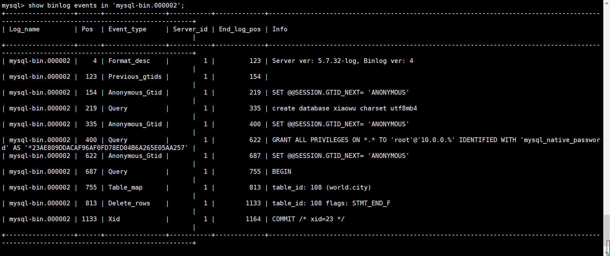
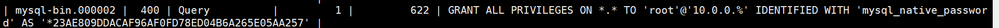
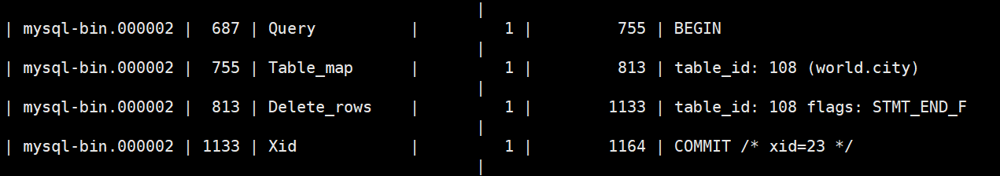
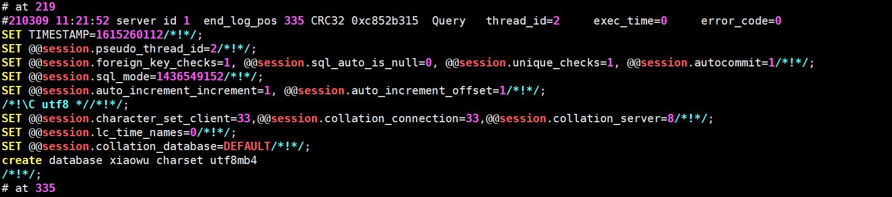
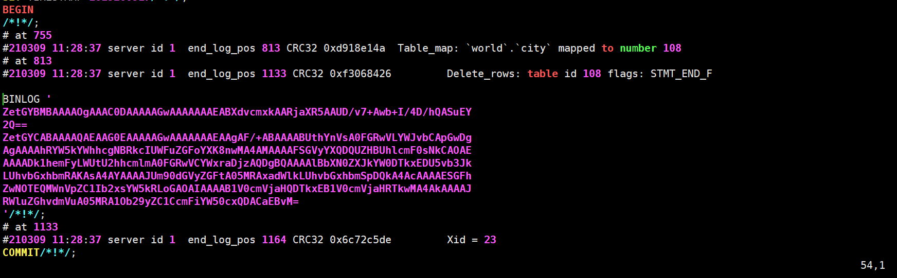
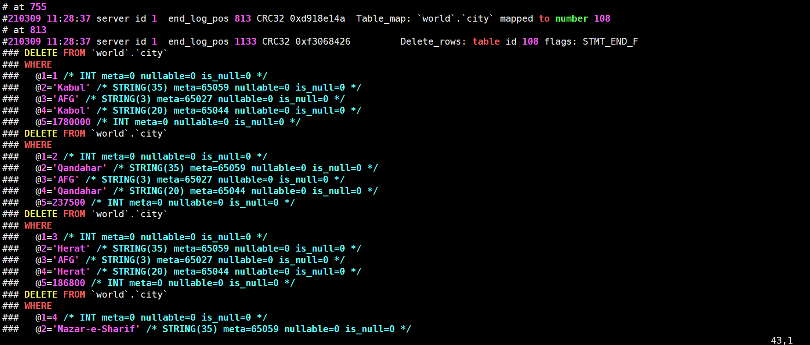

# bin_log二进制日志

## 一、作用

```mysql
1.主要记录数据库变化（DDL,DCL,DML）性质的日志。是逻辑性质日志。
2.数据恢复，主从复制中应用
```

>(1)备份恢复必须依赖二进制日志
>PITR
>
>(2)复制环境必须依赖二进制日志
>8.0之后，默认自动开启。
>
>(3) 分析大事务

## 二、如何配置

```mysql
默认：8.0版本以前，没有开启。我们建议生产开启。

配置方法：
  vim /etc/my.cnf
	server_id=1			主机编号（自定义设置，不可重复)，5.7以后开binlog要加此参数
	log_bin=/service/mysql/binlog/mysql-bin		日志存放目录+日志名前缀，例如： mysql-bin.000001 mysql-bin.000002
	sync_binlog=1		binlog日志刷盘策略，双一中的第二个1。每次事务提交立即刷写binlog到磁盘
	binlog_format=row	binlog的记录格式为row模式
	
	重启生效
	
说明：生产环境中建议路径一定要和数据盘分开（binlog和数据目录放在不同的硬盘当中）
```


## 三、配置启动过程

### 1、修改配置文件

```mysql
[root@Centos7 /service/mysql/binlog]# vim /etc/my.cnf 
[mysqld]
server_id=1
log_bin=/service/mysql/binlog/mysql-bin
sync_binlog=1
binlog_format=row

secure-file-priv=/tmp
basedir=/service/mysql
datadir=/service/mysql/data
socket=/service/mysql/tmp/mysql.sock
user=mysql
port=3306
[mysql]
socket=/service/mysql/tmp/mysql.sock

```


### 2、根据配置文件创建目录

```bash
mkdir /service/mysql/binlog/ -p
chown -R mysql.mysql /service/mysql/binlog/
```


### 3、重启数据库生效

```bash
[root@Centos7 /service/mysql/binlog]# /etc/init.d/mysqld restart
Shutting down MySQL.. SUCCESS! 
Starting MySQL.. SUCCESS! 


[root@Centos7 /service/mysql/binlog]# systemctl restart mysqld.service 
```


### 4、查看启动是否成功

```mysql
[root@Centos7 /service/mysql/binlog]# ps -elf|grep [m]ysql
[root@Centos7 /service/mysql/binlog]# netstat -lntup

[root@Centos7 /service/mysql/binlog]# ll
total 12
-rw-r----- 1 mysql mysql 177 Mar  9 09:45 mysql-bin.000001
-rw-r----- 1 mysql mysql  78 Mar  9 09:45 mysql-bin.index

```


## 四、binlog记录详解

### 1、引入

```mysql
binlog是SQL层的功能。记录的是变更SQL语句，不记录查询语句。
```


### 2、记录sql语句种类

````mysql
DDL(数据库定义语言) ：原封不动的记录当前DDL(statement语句方式)。
DCL(数据库控制语言) ：原封不动的记录当前DCL(statement语句方式)。
DML(数据操纵语言)：只记录已经提交的事务DML

statement 执行什么记录什么
````


### 3、DML

```mysql
binlog_format（binlog的记录格式）参数影响
（1）statement（5.6默认）SBR(statement based replication) ：语句模式原封不动的记录当前DML。
（2）ROW(5.7 默认值) RBR(ROW based replication) ：记录数据行的变化(用户看不懂，需要工具分析)
（3）mixed（混合）MBR(mixed based replication)模式  ：以上两种模式的混合
```


### 4、SBR与RBR模式的对比

```mysql
STATEMENT：可读性较高，日志量少，但是不够严谨，只记录DML语句
ROW      ：可读性很低，日志量大，足够严谨，记录行的真实变化

update t1 set xxx=xxx where id>1000   ? -->一共500w行，row模式怎么记录的日志
为什么row模式严谨？
id  name    intime
insert into t1 values(1,'zs',now())

我们建议使用：row记录模式
```


## 五、event（事件）是什么?

### 1、简介

```mysql
二进制日志的最小记录单元
对于DDL,DCL,一个语句就是一个event
对于DML语句来讲:只记录已提交的事务。
    例如以下列子,就被分为了4个event
				position
				start	stop
    begin;      120  - 340
    DML1        340  - 460
    DML2        460  - 550
    commit;     550  - 760
```


### 2、event的组成

```mysql
三部分构成:
(1) 事件的开始标识
(2) 事件内容
(3) 事件的结束标识

Position:
开始标识: at 194
结束标识: end_log_pos 254
194? 254?
某个事件在binlog中的相对位置号

位置号(position)的作用是什么？
	为了方便我们截取事件
```


## 六、binlog的查看

### 1、日志文件位置查看

#### 1）文件位置查看

```mysql
[root@Centos7 /service/mysql/binlog]# ll
total 12
-rw-r----- 1 mysql mysql 177 Mar  9 09:45 mysql-bin.000001
-rw-r----- 1 mysql mysql 154 Mar  9 09:45 mysql-bin.000002
-rw-r----- 1 mysql mysql  78 Mar  9 09:45 mysql-bin.index


index:保存当前mysql正在使用的位置点
000001-n:保存的记录好的二进制日志（复制日志）
```


### 2、二进制内置查看命令

#### 1）查看相关状态

```mysql
Master [(none)]>show variables like '%log_bin%';
+---------------------------------+------------------------------+
| Variable_name                   | Value                        |
+---------------------------------+------------------------------+
| log_bin                         | ON                           |
| log_bin_basename                | /data/binlog/mysql-bin       |
| log_bin_index                   | /data/binlog/mysql-bin.index |
| log_bin_trust_function_creators | OFF                          |
| log_bin_use_v1_row_events       | OFF                          |
| sql_log_bin                     | ON                           |
+---------------------------------+------------------------------+
```


#### 2）查看是否开启

```mysql
mysql> select @@log_bin;
+-----------+
| @@log_bin |
+-----------+
|         1 |
+-----------+
```


#### 3）查看日志记录位置

```mysql
mysql> select @@log_bin_basename;
+---------------------------------+
| @@log_bin_basename              |
+---------------------------------+
| /service/mysql/binlog/mysql-bin |
+---------------------------------+
```


#### 4）查看一共有多少binlog

```mysql
mysql> show binary logs;
+------------------+-----------+
| Log_name         | File_size |
+------------------+-----------+
| mysql-bin.000001 |       177 |
| mysql-bin.000002 |       154 |
```


#### 5）查看正在使用的日志文件

```mysql
mysql> show master status;
+------------------+----------+--------------+------------------+-------------------+
| File             | Position | Binlog_Do_DB | Binlog_Ignore_DB | Executed_Gtid_Set |
+------------------+----------+--------------+------------------+-------------------+
| mysql-bin.000002 |      154 |              |                  |                   |
+------------------+----------+--------------+------------------+-------------------+
file：当前MySQL正在使用的文件名
position：最后一个时间的结束位置号
```


### 3、日志内容查看

#### 1）event事件查看

```mysql
1.先执行几个命令
	mysql> create database xiaowu charset utf8mb4;
	mysql> grant all on *.* to root@'10.0.0.%' identified by '123';

mysql> show binlog events in 'mysql-bin.000002';
```




**每列解释**

```mysql
1、log_name		binlog文件名
2、Pos			事件开始的位置号（position）
3、Event_type	事件类型
	Format_desc	 格式描述，每个日志文件的第一个时间，多用户没有意义，MySQL识别binlog必要信息
	Previous_gtids		以前的GTID
	anonymous gtid		匿名的GTID
	query				查询
	...
4、server_id		mysql服务号标识
5、end_log_pos	事件结束的位置号
6、INfo			事件内容

补充：
    SHOW BINLOG EVENTS
       [IN 'log_name']
       [FROM pos]
       [LIMIT [offset,] row_count]
       
[root@Centos7 ~]# mysql -p -e "show binlog events in 'mysql-bin.000002'"|grep create
Enter password: 
mysql-bin.000002	219	Query	1	335	create database xiaowu charset utf8mb4
     

```

**事件一：建库**


**事件二：授权**




**事件三：删除表**



**提交的事务才能记录**


#### 2）binlog文件内容详细查看

##### mysqlbinlog

```mysql
1.查看binlog日志内容
mysqlbinlog mysql-bin.000002 
	为方便查看可以导出到某个文件
mysqlbinlog mysql-bin.000002 >/tmp/a.sql

2.查看binlog日志内容且将row格式内容转换成可读方式
mysqlbinlog --base64-output=decode-rows -vvv mysql-bin.000002
mysqlbinlog --base64-output=decode-rows -vvv mysql-bin.000002 >/tmp/b.sql


mysqlbinlog  -d binlog /data/binlog/mysql-bin.000003
[root@db01 binlog]# mysqlbinlog --start-datetime='2019-05-06 17:00:00' --stop-datetime='2019-05-06 17:01:00'  /data/binlog/mysql-bin.000004 
```



```mysql
# at 219	
事件开始标识
#210309 11:21:52 server id 1  end_log_pos 335 CRC32 0xc852b315  Query   thread_id=2     exec_time=0     error_code=0
事件发生时间		mysql服务标识  事件结束标识				
create database xiaowu charset utf8mb4
/*!*/;
# at 335
新事件开始标识，上一个事件的结束标识
```



```mysql
BEGIN
/*!*/;
# at 755
#210309 11:28:37 server id 1  end_log_pos 813 CRC32 0xd918e14a  Table_map: `world`.`city` mapped to number 108
# at 813
#210309 11:28:37 server id 1  end_log_pos 1133 CRC32 0xf3068426         Delete_rows: table id 108 flags: STMT_END_F

BINLOG '
ZetGYBMBAAAAOgAAAC0DAAAAAGwAAAAAAAEABXdvcmxkAARjaXR5AAUD/v7+Awb+I/4D/hQASuEY
2Q==
ZetGYCABAAAAQAEAAG0EAAAAAGwAAAAAAAEAAgAF/+ABAAAABUthYnVsA0FGRwVLYWJvbCApGwDg
AgAAAAhRYW5kYWhhcgNBRkcIUWFuZGFoYXK8nwMA4AMAAAAFSGVyYXQDQUZHBUhlcmF0sNkCAOAE
AAAADk1hemFyLWUtU2hhcmlmA0FGRwVCYWxraDjzAQDgBQAAAAlBbXN0ZXJkYW0DTkxEDU5vb3Jk
LUhvbGxhbmRAKAsA4AYAAAAJUm90dGVyZGFtA05MRAxadWlkLUhvbGxhbmSpDQkA4AcAAAAESGFh
ZwNOTEQMWnVpZC1Ib2xsYW5kRLoGAOAIAAAAB1V0cmVjaHQDTkxEB1V0cmVjaHRTkwMA4AkAAAAJ
RWluZGhvdmVuA05MRA1Ob29yZC1CcmFiYW50cxQDACaEBvM=
'/*!*/;
# at 1133
#210309 11:28:37 server id 1  end_log_pos 1164 CRC32 0x6c72c5de         Xid = 23
COMMIT/*!*/;
```


##### --base64-output=decode-rows -vvv

```bash
2.查看binlog日志内容且将row格式内容转换成可读方式
mysqlbinlog --base64-output=decode-rows -vvv mysql-bin.000002
mysqlbinlog --base64-output=decode-rows -vvv mysql-bin.000002 >/tmp/b.sql
```




### 4、日志截取恢复

#### 1）日志恢复案例

##### ①滚动一个新的日志

```mysql
flush logs;	
```


##### ②模拟数据库

```mysql
1、创建一个数据库
	mysql> create database bindb charset utf8mb4;
2、进入这个库
	mysql> use bindb
3、创建一个非常简单的t1表
	mysql> create table t1 (id int);
4、随便插入一些数据
	mysql> insert into t1 values(1),(2),(3);
    mysql> insert into t1 values(11),(22),(33);
    mysql> insert into t1 values(111),(222),(333);
    
5、查看一下表内容
	mysql> select * from t1;
    +------+
    | id   |
    +------+
    |    1 |
    |    2 |
    |    3 |
    |   11 |
    |   22 |
    |   33 |
    |  111 |
    |  222 |
    |  333 |
    +------+

6、模拟删库
	mysql> drop database bindb;
```


##### ③数据恢复

```mysql
原理：
	找到建库之前的位置点，找到drop之前的位置点，将两点之间的命令再执行一遍
	
1、查看当前二进制日志文件
	mysql> show master status;
	
2、用event进行实践查看
	mysql> show binlog events in 'mysql-bin.000003';
+------------------+------+----------------+-----------+-------------+---------------------------------------+
| Log_name         | Pos  | Event_type     | Server_id | End_log_pos | Info                                  |
+------------------+------+----------------+-----------+-------------+---------------------------------------+
| mysql-bin.000003 |    4 | Format_desc    |         1 |         123 | Server ver: 5.7.32-log, Binlog ver: 4 |
| mysql-bin.000003 |  123 | Previous_gtids |         1 |         154 |                                       |
| mysql-bin.000003 |  154 | Anonymous_Gtid |         1 |         219 | SET @@SESSION.GTID_NEXT= 'ANONYMOUS'  |
| mysql-bin.000003 |  219 | Query          |         1 |         332 | create database bindb charset utf8mb4 |
| mysql-bin.000003 |  332 | Anonymous_Gtid |         1 |         397 | SET @@SESSION.GTID_NEXT= 'ANONYMOUS'  |
| mysql-bin.000003 |  397 | Query          |         1 |         497 | use `bindb`; create table t1 (id int) |
| mysql-bin.000003 |  497 | Anonymous_Gtid |         1 |         562 | SET @@SESSION.GTID_NEXT= 'ANONYMOUS'  |
| mysql-bin.000003 |  562 | Query          |         1 |         635 | BEGIN                                 |
| mysql-bin.000003 |  635 | Table_map      |         1 |         681 | table_id: 109 (bindb.t1)              |
| mysql-bin.000003 |  681 | Write_rows     |         1 |         731 | table_id: 109 flags: STMT_END_F       |
| mysql-bin.000003 |  731 | Xid            |         1 |         762 | COMMIT /* xid=39 */                   |
| mysql-bin.000003 |  762 | Anonymous_Gtid |         1 |         827 | SET @@SESSION.GTID_NEXT= 'ANONYMOUS'  |
| mysql-bin.000003 |  827 | Query          |         1 |         900 | BEGIN                                 |
| mysql-bin.000003 |  900 | Table_map      |         1 |         946 | table_id: 109 (bindb.t1)              |
| mysql-bin.000003 |  946 | Write_rows     |         1 |         996 | table_id: 109 flags: STMT_END_F       |
| mysql-bin.000003 |  996 | Xid            |         1 |        1027 | COMMIT /* xid=40 */                   |
| mysql-bin.000003 | 1027 | Anonymous_Gtid |         1 |        1092 | SET @@SESSION.GTID_NEXT= 'ANONYMOUS'  |
| mysql-bin.000003 | 1092 | Query          |         1 |        1165 | BEGIN                                 |
| mysql-bin.000003 | 1165 | Table_map      |         1 |        1211 | table_id: 109 (bindb.t1)              |
| mysql-bin.000003 | 1211 | Write_rows     |         1 |        1261 | table_id: 109 flags: STMT_END_F       |
| mysql-bin.000003 | 1261 | Xid            |         1 |        1292 | COMMIT /* xid=41 */                   |
| mysql-bin.000003 | 1292 | Anonymous_Gtid |         1 |        1357 | SET @@SESSION.GTID_NEXT= 'ANONYMOUS'  |
| mysql-bin.000003 | 1357 | Query          |         1 |        1452 | drop database bindb                   |
+------------------+------+----------------+-----------+-------------+---------------------------------------+

3、发现起点
	| mysql-bin.000003 |  219 | Query          |         1 |         332 | create database bindb charset utf8mb4 |
	
4、找到终点
	| mysql-bin.000003 | 1357 | Query          |         1 |        1452 | drop database bindb                   |
	
5、截取日志导入一个文件
	[root@Centos7 /service/mysql/binlog]# mysqlbinlog --start-position=219 --stop-position=1357 mysql-bin.000003 > /tmp/bin.sql
	[root@Centos7 /service/mysql/binlog]# mysqlbinlog -d bindb --start-position=219 --stop-position=1357 mysql-bin.000003 > /tmp/bin.sql
		-d 只找到与bindb库相关的数据
		--start-position=219 	数据起始点
		--stop-position=1357	数据终点
		
	mysqlbinlog --start-datetime	--stop-datetime mysql-bin.000003 mysql-bin.000004 mysql-bin.000005
		--start-datetime	数据起始时间
		--stop-datetime		数据结束时间
6、关闭当前会话binlog记录
	mysql> set sql_log_bin=0;

7、数据恢复
	mysql> source /tmp/bin.sql

8、开启当前会话binlog记录
	mysql> set sql_log_bin=1;

9、验证数据
	mysql> select * from bindb.t1;
```


##### ④此种数据恢复的问题

```mysql
1.binlog日志不单单只存储一个数据库的操作，还会有对其他库的操作。
2.需要的日志再多个文件中分布
  时间可以确认的话
	mysqlbinlog -start-datetime	--stop-datetime mysql-bin.000003 mysql-bin.000004 mysql-bin.000005

3.多年数据mysql-bin.000001到mysql-bin.078788
	假设：
		每周六23:00做全备，binlog每天备份23:00
		故障点 周三 10点 drop
		
	方案：
		全备到周六23:00时间点
		周六晚上23:00之后到drop之前的操作根据binlog进行恢复		
```

**综上：binlog实际上使我们数据恢复时配合备份一起恢复数据的手段**


## 七、binlog维护操作

### 1、日志滚动

```mysql
1、立即滚动
    mysql> flush logs;
    mysqladmin -uroot -p flush-logs

2、自动滚动
	1、当binlog日志达到1G时自动滚动
        mysql> select @@max_binlog_size;
        +-------------------+
        | @@max_binlog_size |
        +-------------------+
        |        1073741824 |
        +-------------------+
	2、数据库重启
	3、mysqldump -F
```


### 2、日志的删除

```mysql
注意：不要使用rm命令删除日志

自动删除：
	mysql> select @@expire_logs_days;
    +--------------------+
    | @@expire_logs_days |
    +--------------------+
    |                  0 |
    +--------------------+
	默认是0，永不删除。单位是天
	
	问题：到底设置多少天合适？阈值？假设全备周期七天
		一次全备周期7+1天。一般生产建议两个全备周期14+1
	
手动删除个别：
	PURGE BINARY LOGS TO 'mysql-bin.000010';
	删除10个之前
	删除到哪个时间段为止
	
	PURGE BINARY LOGS BEFORE '2019-04-02 22:46:26';
	删除哪个时间之前
	
手动删除全部：
	mysql> reset maseter;
	危险，在主库执行此操作，主从必宕

```


## 八、binlog的GTID模式管理

### 1、介绍

```mysql
	GTID(GlobalTransactionID)是对于一个已提交事务的编号，并且是一个全局唯一的编号。GTID实际上是由UUID+TID组成的。其中UUID是一个MySQL实例的唯一标识，保存在mysql数据目录下的auto.cnf文件里。TID代表了该实例上已经提交的事务数量，并且随着事务提交单调递增。
	是对于一个已提交事务的编号，并且是一个全局唯一的编号。
它的官方定义如下：

    GTID = source_id ：transaction_id
    	   服务uuid		事务id
    7E11FA47-31CA-19E1-9E56-C43AA21293967:29

5.6 版本新加的特性,5.7中做了加强
5.6 中不开启,没有这个功能.
5.7 中的GTID,即使不开也会有自动生成
SET @@SESSION.GTID_NEXT= 'ANONYMOUS';
```


### 2、重要参数介绍及使用

```mysql
vim /etc/my.cnf
	gtid-mode=on
	enforce-gtid-consistency=true
	log-slave-updates=1
	
	gtid-mode=on					
	打开这个功能
	
	enforce-gtid-consistency=true
	强调gtid一致性
	
	log-slave-updates=1
	主从复制时，binlog从库强制写入，方便从库作为主库。

配置完重启及启动成功
```


### 3、查看

```mysql
1.查看是否启动成功
	mysql> select @@gtid_mode;
    +-------------+
    | @@gtid_mode |
    +-------------+
    | ON          |
    +-------------+
    
2.查看gtid信息
	create database gtid_text;
	mysql> mysql> show master status;
+------------------+----------+--------------+------------------+----------------------------------------+
| File             | Position | Binlog_Do_DB | Binlog_Ignore_DB | Executed_Gtid_Set                      |
+------------------+----------+--------------+------------------+----------------------------------------+
| mysql-bin.000002 |      328 |              |                  | 3f99fbca-76aa-11eb-93d4-000c29155441:1 |
+------------------+----------+--------------+------------------+----------------------------------------+

3.show binlog events in 'mysql-bin.000002';
	+------------------+-----+----------------+-----------+-------------+-------------------------------------------------------------------+
    | Log_name         | Pos | Event_type     | Server_id | End_log_pos | Info                                                              |
    +------------------+-----+----------------+-----------+-------------+-------------------------------------------------------------------+
    | mysql-bin.000002 |   4 | Format_desc    |         1 |         123 | Server ver: 5.7.32-log, Binlog ver: 4                             |
    | mysql-bin.000002 | 123 | Previous_gtids |         1 |         154 |                                                                   |
    | mysql-bin.000002 | 154 | Gtid           |         1 |         219 | SET @@SESSION.GTID_NEXT= '3f99fbca-76aa-11eb-93d4-000c29155441:1' |
    | mysql-bin.000002 | 219 | Query          |         1 |         328 | create database gtid_text                                         |
    +------------------+-----+----------------+-----------+-------------+-------------------------------------------------------------------+

4.查看server_uuid
	select @@server_uuid;
	+--------------------------------------+
    | @@server_uuid                        |
    +--------------------------------------+
    | 3f99fbca-76aa-11eb-93d4-000c29155441 |
    +--------------------------------------+

ps:一个事务一个gtid
```


### 4、基于gtid进行查看binlog日志

```mysql
具备GTID后,截取查看某些事务日志:
--include-gtids	包含某些gtid
--exclude-gtids	排除某些gtid
--skip-gtids
	如果我们是要恢复数据到源数据库或者和源数据库有相同 GTID 信息的实例，那么就要使用该参数。如果不带该参数的话，是无法恢复成功的。因为包含的 GTID 已经在源数据库执行过了，根据 GTID 特性，一个 GTID 信息在一个数据库只能执行一次，所以不会恢复成功。
	如果是恢复到其他实例的数据库并且不包含源实例的 GTID 信息，那么可以不使用该参数，使用或者不使用都可以恢复成功。
```


### 5、**实验**

#### 1、创建一个库，表，并插入数据

```mysql
create database gtdb charset utf8mb4;
use gtdb
create table t1(id int);
insert into t1 values(1),(2),(3);
```


#### 2、手动日志滚动

```mysql
flush logs;
```


#### 3、创建其他表

```mysql
create table t2(id int);
insert into t2 values(1),(2),(3);
flush logs;
show master status;
 

create table t3(id int);
insert into t3 values(1),(2),(3);
flush logs;
show master status;

mysql> drop database gtdb;
show master status;
```


#### 4、找到drop终点

```mysql
mysql> show master status;	查看当前所用binlog文件
+------------------+----------+--------------+------------------+-----------------------
| File             | Position | Binlog_Do_DB | Binlog_Ignore_DB | Executed_Gtid_Set     
+------------------+----------+--------------+------------------+-----------------------
| mysql-bin.000005 |      351 |              |                  | 3f99fbca-76aa-11eb-93d
+------------------+----------+--------------+------------------+-----------------------

mysql> mysql> show binlog events in 'mysql-bin.000005';		查看这个文件中的事务
+------------------+-----+----------------+-----------+-------------+-------------------------------------------------------------------+
| Log_name         | Pos | Event_type     | Server_id | End_log_pos | Info                                                              |
+------------------+-----+----------------+-----------+-------------+-------------------------------------------------------------------+
| mysql-bin.000005 |   4 | Format_desc    |         1 |         123 | Server ver: 5.7.32-log, Binlog ver: 4                             |
| mysql-bin.000005 | 123 | Previous_gtids |         1 |         194 | 3f99fbca-76aa-11eb-93d4-000c29155441:1-6                          |
| mysql-bin.000005 | 194 | Gtid           |         1 |         259 | SET @@SESSION.GTID_NEXT= '3f99fbca-76aa-11eb-93d4-000c29155441:7' |
| mysql-bin.000005 | 259 | Query          |         1 |         351 | drop database gtdb                                                |
+------------------+-----+----------------+-----------+-------------+-------------------------------------------------------------------
```


#### 5、查看起点

```mysql
mysql> show binlog events in 'mysql-bin.000003';
+------------------+-----+----------------+-----------+-------------+-------------------------------------------------------------------+
| Log_name         | Pos | Event_type     | Server_id | End_log_pos | Info                                                              |
+------------------+-----+----------------+-----------+-------------+-------------------------------------------------------------------+
| mysql-bin.000003 |   4 | Format_desc    |         1 |         123 | Server ver: 5.7.32-log, Binlog ver: 4                             |
| mysql-bin.000003 | 123 | Previous_gtids |         1 |         194 | 3f99fbca-76aa-11eb-93d4-000c29155441:1                            |
| mysql-bin.000003 | 194 | Gtid           |         1 |         259 | SET @@SESSION.GTID_NEXT= '3f99fbca-76aa-11eb-93d4-000c29155441:2' |
| mysql-bin.000003 | 259 | Query          |         1 |         369 | create database gtdb charset utf8mb4                              |
| mysql-bin.000003 | 369 | Gtid           |         1 |         434 | SET @@SESSION.GTID_NEXT= '3f99fbca-76aa-11eb-93d4-000c29155441:3' |
| mysql-bin.000003 | 434 | Query          |         1 |         531 | use `gtdb`; create table t2(id int)                               |
| mysql-bin.000003 | 531 | Gtid           |         1 |         596 | SET @@SESSION.GTID_NEXT= '3f99fbca-76aa-11eb-93d4-000c29155441:4' |
| mysql-bin.000003 | 596 | Query          |         1 |         668 | BEGIN                                                             |
| mysql-bin.000003 | 668 | Table_map      |         1 |         713 | table_id: 108 (gtdb.t2)                                           |
| mysql-bin.000003 | 713 | Write_rows     |         1 |         763 | table_id: 108 flags: STMT_END_F                                   |
| mysql-bin.000003 | 763 | Xid            |         1 |         794 | COMMIT /* xid=30 */                                               |
| mysql-bin.000003 | 794 | Rotate         |         1 |         841 | mysql-bin.000004;pos=4                                            |
+------------------+-----+----------------+-----------+-------------+-------------------------------------------------------------------+

发现需要gtid 2-6
文件：mysql-bin.000003-4
```


#### 6、截取

```mysql
[root@Centos7 /service/mysql/binlog]# mysqlbinlog --skip-gtids --include-gtids='3f99fbca-76aa-11eb-93d4-000c29155441:2-6' mysql-bin.000003 mysql-bin.000004 >/tmp/gtid.sql

ps:注意参数
```


#### 7、导入数据库

```mysql
set sql_log_bin=0;
mysql> source /tmp/gtid.sql
```


#### 8、查看数据

```mysql
mysql> select * from t2;
+------+
| id   |
+------+
|    1 |
|    2 |
|    3 |
+------+

mysql> select * from t3;
+------+
| id   |
+------+
|    1 |
|    2 |
|    3 |
+------+

```


### 6、GTID的幂等性

```mysql
幂等性：
	开启GTID后，MySQL恢复binlog时，重复GTID的事务不会再执行了

--skip-gtids
	如果我们是要恢复数据到源数据库或者和源数据库有相同 GTID 信息的实例，那么就要使用该参数。如果不带该参数的话，是无法恢复成功的。因为包含的 GTID 已经在源数据库执行过了，根据 GTID 特性，一个 GTID 信息在一个数据库只能执行一次，所以不会恢复成功。
	如果是恢复到其他实例的数据库并且不包含源实例的 GTID 信息，那么可以不使用该参数，使用或者不使用都可以恢复成功。
	
```

## 九、binlog日志清理

### 1、自动清理

#### 1.查看相关参数

```mysql
show variables like '%expire%';
```

#### 2.常见配置

>企业建议,至少保留两个全备周期+1的binlog

**立即生效**

```mysql
set global expire_logs_days=15;
```

**永久生效**

>my.cnf
>
>```bash
>expire_logs_days=15;
>```

#### 3.MySQL新支持

```mysql
binlog_expire_logs_seconds=2592000
```

### 2、手动清理

#### 1.PURGE BINARY LOGS

```mysql
PURGE BINARY LOGS BEFORE now() - INTERVAL 3 day;
PURGE BINARY LOGS TO 'mysql-bin.000010';
```

>**`PURGE BINARY LOGS BEFORE now() - INTERVAL 3 day;`**
>
>- 此命令删除所有在当前时间三天前创建的二进制日志文件。`now() - INTERVAL 3 day` 部分计算从当前时间开始的三天前的时间戳
>
>**`PURGE BINARY LOGS TO 'mysql-bin.000010';`**
>
>- 此命令删除所有二进制日志文件，直到（但不包括）`'mysql-bin.000010'`。这意味着所有名称按字典顺序小于 `'mysql-bin.000010'` 的日志文件将被删除。

#### 2.reset master;

>主从环境不要用，主从必断

```mysql
reset master;
```

>- 删除所有现有的二进制日志文件。
>- 重置二进制日志索引文件。
>- 创建一个新的二进制日志文件，从 `mysql-bin.000001` 开始。

#### 3.rm -f

>数据库停机后
>
>删除所有binlog文件
>
>mysql-bin.index清空

## 十、日志滚动

### 1、手动

>```mysql
>flush logs;
>```
>
>重启mysql也会自动滚动一个新的

### 2、自动滚动

>日志文件达到1G大小(max_binlog_size)

```mysql
max_binlog_size | 1073741824
```
