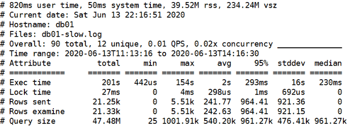
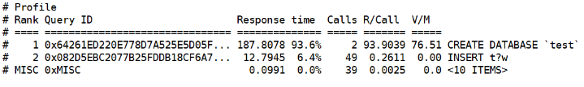
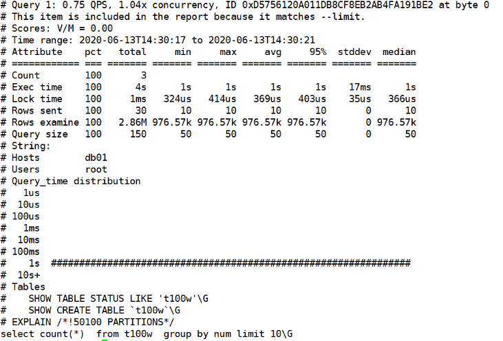

# slowlog

## 一、作用

```mysql
记录MySQL运行过程中较慢的语句，通过一个文本的文件记录下来。帮助我们进行语句优化的工具日志
```


## 二、如何配置

```mysql
默认慢日志没有开启.
	查看是否打开
	mysql> select @@slow_query_log;
    +------------------+
    | @@slow_query_log |
    +------------------+
    |                0 |
    +------------------+
    
    查看慢日志存储位置
    mysql> select @@slow_query_log_file;
    +--------------------------------------+
    | @@slow_query_log_file                |
    +--------------------------------------+
    | /service/mysql/data/Centos7-slow.log |
    +--------------------------------------+

配置参数：
	1.慢语句认定时间阈值
	mysql> select @@long_query_time;
    +-------------------+
    | @@long_query_time |
    +-------------------+
    |         10.000000 |
    +-------------------+
    
    2.非索引查询语句是否记录到慢日志
    mysql> select @@log_queries_not_using_indexes;
    +---------------------------------+
    | @@log_queries_not_using_indexes |
    +---------------------------------+
    |                               0 |
    +---------------------------------+

	vim /etc/my.cnf
	slow_query_log=1
	slow_query_log_file=/service/mysql/data/Centos7-slow.log 
	long_query_time=0.1
	log_queries_not_using_indexes=1
	
	重启生效
```


## 三、模拟慢语句

````mysql
1.导入t100w
mysql> source /root/t100w.sql

2.清空慢日志
[root@Centos7 /service/mysql/data]# >Centos7-slow.log 

3.进行一些语句的查询
use test
select * from t100w limit 500000,10;
select * from t100w limit 600000,10;
select * from t100w limit 600000,1;
select * from t100w limit 600000,2;
select id,count(num) from t100w group by id limit 10;
select id,count(num) from t100w group by id limit 5;
select id,count(num) from t100w group by id limit 2;
select id,count(num) from t100w group by id limit 2;
select id,count(k1) from t100w group by id limit 1;
select id,count(k2) from t100w group by id limit 1;
select k2 ,sum(id) from t100w group by k2 limit 1;
select k2 ,sum(id) from t100w group by k2,k1 limit 1;
select k2 ,sum(id) from t100w group by k2,k1 limit 1;
select k1 ,sum(id) from t100w group by k2,k1 limit 1;
select k1,count(id) from t100w group by k1 limit 10;

4.查看慢日志
[root@Centos7 /service/mysql/data]# vim Centos7-slow.log 

发现记录过于冗杂，不便于观看
````


## 四、分析慢语句

### 1、mysqldumpslow

```mysql
[root@Centos7 /service/mysql/data]# mysqldumpslow -s c -t 10 Centos7-slow.log 
最影响用户体验的，
-s 排序
c 次数
-t 排名前几行
```

### 2、pt-query-digest应用

>https://www.percona.com/downloads/percona-toolkit/LATEST/
>yum install perl-DBI perl-DBD-MySQL perl-Time-HiRes perl-IO-Socket-SSL perl-Digest-MD5
>toolkit工具包中的命令:
>./pt-query-diagest  /data/mysql/slow.log
>Anemometer基于pt-query-digest将MySQL慢查询可视化

#### 1.语法

```bash
pt-query-digest [OPTIONS] [FILES] [DSN]
--create-review-table 当使用--review参数把分析结果输出到表中时，如果没有表就自动创建。
--create-history-table 当使用--history参数把分析结果输出到表中时，如果没有表就自动创建。
--filter 对输入的慢查询按指定的字符串进行匹配过滤后再进行分析
--limit 限制输出结果百分比或数量，默认值是20,即将最慢的20条语句输出，如果是50%则按总响应时间占比从大到小排序，输出到总和达到50%位置截止。
--host mysql服务器地址
--user mysql用户名
--password mysql用户密码
--history 将分析结果保存到表中，分析结果比较详细，下次再使用--history时，如果存在相同的语句，且查询所在的时间区间和历史表中的不同，则会记录到数据表中，可以通过查询同一CHECKSUM来比较某类型查询的历史变化。
--review 将分析结果保存到表中，这个分析只是对查询条件进行参数化，一个类型的查询一条记录，比较简单。当下次使用--review时，如果存在相同的语句分析，就不会记录到数据表中。
--output 分析结果输出类型，值可以是report(标准分析报告)、slowlog(Mysql slow log)、json、json-anon，一般使用report，以便于阅读。
--since 从什么时间开始分析，值为字符串，可以是指定的某个”yyyy-mm-dd [hh:mm:ss]”格式的时间点，也可以是简单的一个时间值：s(秒)、h(小时)、m(分钟)、d(天)，如12h就表示从12小时前开始统计。
--until 截止时间，配合—since可以分析一段时间内的慢查询。
```

#### 2.结果说明



>Overall：总共有多少条查询
>Time range：查询执行的时间范围
>unique：唯一查询数量，即对查询条件进行参数化以后，总共有多少个不同的查询
>total：总计 min：最小 max：最大 avg：平均
>95%：把所有值从小到大排列，位置位于95%的那个数，这个数一般最具有参考价值
>median：中位数，把所有值从小到大排列，位置位于中间那个数



>Response: 总的响应时间。
>time: 该查询在本次分析中总的时间占比。
>calls: 执行次数，即本次分析总共有多少条这种类型的查询语句。
>R/Call: 平均每次执行的响应时间。
>Item : 查询对象
>每部分详细统计结果
>1号查询的详细统计结果，最上面的表格列出了执行次数、最大、最小、平均、95%等各项目的统计。
>Databases: 库名
>Users: 各个用户执行的次数（占比）
>Query_time distribution : 查询时间分布, 长短体现区间占比，本例中查询集中在10ms。
>Tables: 查询中涉及到的表
>Explain: 示例



>每部分详细统计结果
>1号查询的详细统计结果，最上面的表格列出了执行次数、最大、最小、平均、95%等各项目的统计。
>Databases: 库名
>Users: 各个用户执行的次数（占比）
>Query_time distribution : 查询时间分布, 长短体现区间占比，本例中查询集中在1s+。
>Tables: 查询中涉及到的表
>Explain: 执行计划

#### 3.命令行应用实例

```mysql
1.直接分析慢查询文件:
pt-query-digest slow.log > slow_report.log

2.分析最近12小时内的查询：
pt-query-digest --since=12h slow.log > slow_report2.log

3.分析指定时间范围内的查询：
pt-query-digest slow.log --since '2019-01-07 09:30:00' --until '2019-01-07 10:00:00'> > slow_report3.log

4.分析指含有select语句的慢查询
pt-query-digest --filter '$event->{fingerprint} =~ m/^select/i' slow.log> slow_report4.log

5.针对某个用户的慢查询
pt-query-digest --filter '($event->{user} || "") =~ m/^root/i' slow.log> slow_report5.log

6.查询所有所有的全表扫描或full join的慢查询
pt-query-digest --filter '(($event->{Full_scan} || "") eq "yes") ||(($event-> {Full_join} || "") eq "yes")' slow.log> slow_report6.log

7.把结果保存到query_review表
pt-query-digest --user=root –password=abc123 --review h=localhost,D=test,t=query_review --create-review-table slow.log

8.把结果保存到query_history表
pt-query-digest --user=root –password=abc123 --review h=localhost,D=test,t=query_history --create-review-table slow.log_0001
pt-query-digest --user=root –password=abc123 --review h=localhost,D=test,t=query_history --create-review-table slow.log_0002

9.通过tcpdump抓取mysql的tcp协议数据，然后再分析
tcpdump -s 65535 -x -nn -q -tttt -i any -c 1000 port 3306 > mysql.tcp.txt
pt-query-digest --type tcpdump mysql.tcp.txt> slow_report9.log

10.分析binlog
mysqlbinlog mysql-bin.000093 > mysql-bin000093.sql
pt-query-digest --type=binlog mysql-bin000093.sql > slow_report10.log

11.分析general log
pt-query-digest --type=genlog localhost.log > slow_report11.log
```

#### 4.衍生项目

>gui
>anemometer
>lepus
