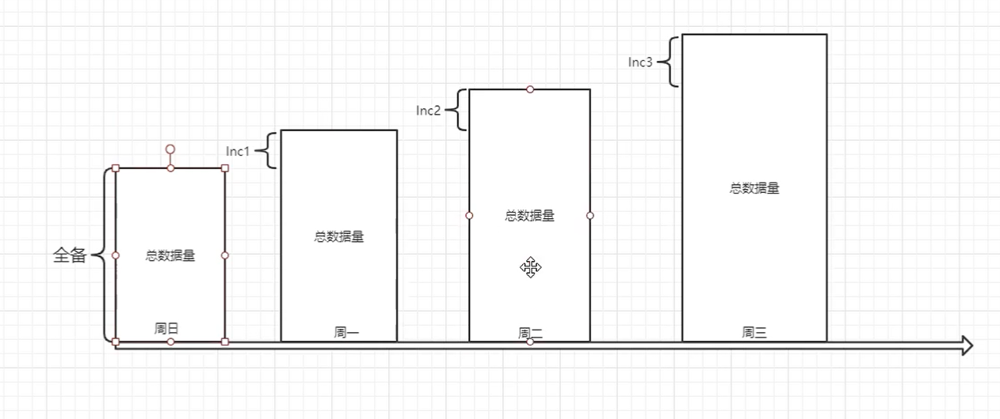
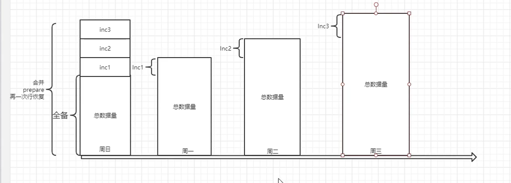

# 物理备份

## 一、PerconaXtrabackup

### 1、上传或下载Xtrabackup

```bash
1.下载
	#下载epel源
	wget -O /etc/yum.repos.d/epel.repo  https://mirrors.aliyun.com/repo/epel-7.repo
	#安装依赖
	yum -y install perl perl-devel libaio libaio-devel perl-Time-HiRes perl-DBD-MySQL
	#下载Xtrabackup
	wget https://www.percona.com/downloads/XtraBackup/Percona-XtraBackup-2.4.4/binary/redhat/7/x86_64/percona-xtrabackup-24-2.4.4-1.el7.x86_64.rpm
	
2.上传Xtrabackup包
	[root@db01 ~]# rz percona-xtrabackup-24-2.4.4-1.el7.x86_64.rpm
```

### 2、安装Xtrabackup

```bash
[root@db01 ~]# yum localinstall -y percona-xtrabackup-24-2.4.4-1.el7.x86_64.rpm

#安装完后会有命令
[root@db01 ~]# xtrabackup			以前使用该命令
[root@db01 ~]# innobackupex			现在使用该命令
```

### 3、介绍

```mysql
物理备份工具，拷贝数据文件
InnoDB表：
	支持热备：业务正常发生的时候，影响较小的备份方式
	1.checkpoint：将已提交的数据页刷新到磁盘。记录开始的LSN
	2.拷贝InnoDB表的相关文件（ibdata1,frm,ibd...）
	3.备份期间产生新的数据变化redo也会备走。
	
非InnoDB表：
	温备：锁表备份
	1.FTWRL，触发全局锁
	2.拷贝非InnoDB表的数据
	3.解锁
	4.再次统计LSN，写入专用文件
	5.记录二进制日志位置记录下来
	6.所有备份文件统一存放在一个目录下
```


### 1、XBK应用

#### 1.前提

```mysql
1.数据库启动
2.能连上数据库
	vim /etc/my.cnf
	[client]
    socket=/tmp/mysql.sock
3.默认会读取[mysqld] ----> datadir=xxxx
4.服务器端工具，不能远程备份
```


#### 2.全备

##### 1）使用

```mysql
[root@db01 ~]# innobackupex --user=root --password=123 /data/xbk/
```


##### 2）查看全备的结果

```bash
[root@db01 /data/xbk/2021-03-10_20-01-04]# ll
total 12340
drwxr-x--- 2 root root       48 Mar 10 20:01 aaa
-rw-r----- 1 root root      425 Mar 10 20:01 backup-my.cnf
-rw-r----- 1 root root     1041 Mar 10 20:01 ib_buffer_pool
-rw-r----- 1 root root 12582912 Mar 10 20:01 ibdata1
drwxr-x--- 2 root root     4096 Mar 10 20:01 mysql
drwxr-x--- 2 root root     8192 Mar 10 20:01 performance_schema
drwxr-x--- 2 root root     8192 Mar 10 20:01 sys
-rw-r----- 1 root root       63 Mar 10 20:01 xtrabackup_binlog_info
-rw-r----- 1 root root      113 Mar 10 20:01 xtrabackup_checkpoints
-rw-r----- 1 root root      535 Mar 10 20:01 xtrabackup_info
-rw-r----- 1 root root     2560 Mar 10 20:01 xtrabackup_logfile

```

###### xtrabackup_binlog_info

```mysql
存放binlog信息，初始位置，位置号和gtid
```


###### xtrabackup_checkpoints

```mysql
记录备份时LSN的变化
```


###### xtrabackup_info

```mysql
备份总信息
```


###### xtrabackup_logfile

```mysql
redo的信息
```


##### 3）手动指定备份目录名

```mysql
[root@db01 /data/xbk/full]# innobackupex --user=root --password=123 --no-timestamp /data/xbk/full
```


#### 3.全备恢复

##### 1）模拟数据库丢失数据

```mysql
pkill mysqld		#kill数据库
[root@db01 /data/xbk/full]# rm -rf /service/mysql/data/		删除数据目录
```


##### 2）备份处理:prepare

```mysql
redo 前滚，undo回滚，模仿CSR过程
[root@db01 /data/xbk]# innobackupex --apply-log /data/xbk/full/

```


##### 3）拷贝数据

```mysql
[root@db01 /data/xbk/full]# cp -a /data/xbk/full/* /service/mysql/data/
```


##### 4）授权

```mysql
[root@db01 /service/mysql]# chown -R mysql.mysql /service/mysql/data

```


##### 5）启动数据库

```mysql
[root@db01 /service/mysql/data]# /etc/init.d/mysqld start

```


#### 4.增备

##### 1）介绍

```mysql
前提：增量必须依赖于全备
	每次增量都是参照上次备份的LSN号码（xtrabackup_checkpoints）,在此基础上变化的数据页，全部备份走
	并且，会将备份过程中产生新的变化的redo一并备份走

恢复时：
	需要将所有需要inc备份，按顺序合并到全备中
	并且需要将每个备份prepare
```

**全备时**只备份增加的量



****

**恢复时**




##### 2）数据库被破坏模拟

###### 1.准备环境

```mysql
mysql> create database xbk charset utf8mb4;
mysql> use xbk
mysql> create table t1(id int);
mysql> insert into t1 values(1),(2),(3);
mysql> select * from t1;
```


###### 2.模拟周日全备

```bash
[root@db01 ~]# rm -rf /data/xbk/*
[root@db01 ~]# innobackupex --user=root --password=123 --no-timestamp /data/xbk/full
```


###### 3.模拟周一数据变化

```mysql
use xbk
create table t2(id int);
insert into t2 values(1),(2),(3);
select * from t2;
```


###### 4.模拟周一晚上增备

```mysql
[root@db01 ~]# innobackupex --user=root --password=123 --no-timestamp --incremental --incremental-basedir=/data/xbk/full /data/xbk/inc
--incremental		打开增备
--incremental-basedir	增备参照备份

```


###### 5.模拟周二数据变化

```mysql
use xbk
create table t3(id int);
insert into t3 values(1),(2),(3);
select * from t3;
```


###### 6.模拟周二晚上增备

```mysql
[root@db01 ~]# innobackupex --user=root --password=123 --no-timestamp --incremental --incremental-basedir=/data/xbk/inc1 /data/xbk/inc2

```


###### 7.模拟周三数据变化

````mysql
use xbk
create table t4(id int);
insert into t4 values(1),(2),(3);
create table t5(id int);
insert into t5 values(1),(2),(3);
select * from t4;
select * from t5;
````


###### 8.模拟周三晚上增备

```mysql
[root@db01 ~]# innobackupex --user=root --password=123 --no-timestamp --incremental --incremental-basedir=/data/xbk/inc2 /data/xbk/inc3
```


###### 9.模拟周四数据变化

```mysql
use xbk
create table t6(id int);
insert into t6 values(1),(2),(3);
select * from t6;
```


10.搞破坏

```
[root@db01 ~]# rm -rf /service/mysql/data/*
[root@db01 ~]# pkill mysqld
```


##### 3）xbk full + inc+binlog 备份恢复手段

###### 1.确认备份完整性

```mysql
[root@db01 /data/xbk]# cat full/xtrabackup_checkpoints 
backup_type = full-backuped
from_lsn = 0
to_lsn = 5593777
last_lsn = 5593786
compact = 0
recover_binlog_info = 0
[root@db01 /data/xbk]# cat inc1/xtrabackup_checkpoints 
backup_type = incremental
from_lsn = 5593777
to_lsn = 5599363
last_lsn = 5599372
compact = 0
recover_binlog_info = 0
[root@db01 /data/xbk]# cat inc2/xtrabackup_checkpoints 
backup_type = incremental
from_lsn = 5599363
to_lsn = 5604959
last_lsn = 5604968
compact = 0
recover_binlog_info = 0
[root@db01 /data/xbk]# cat inc3/xtrabackup_checkpoints 
backup_type = incremental
from_lsn = 5604959
to_lsn = 5617434
last_lsn = 5617443
compact = 0
recover_binlog_info = 0
```


###### 2.恢复思路

```mysql
1.合并，prepare 所有inc备份到全备
2.恢复数据，启动数据库
3.截取binlog日志
4.恢复日志
```

**恢复过程**

###### 3.合并，prepare 所有inc备份到全备

1）基础全备整理

```mysql
[root@db01 /data/xbk]# innobackupex --apply-log --redo-only /data/xbk/full

--redo-only 只前滚，强制跳过回滚。（最后一个不需要）
```


2）合并并prepare inc1 到 full

```mysql
[root@db01 /data/xbk]# innobackupex --apply-log --redo-only --incremental-dir=/data/xbk/inc1 /data/xbk/full
```

**确认**

```mysql
[root@db01 /data/xbk]# cat full/xtrabackup_checkpoints 
backup_type = log-applied
from_lsn = 0
to_lsn = 5599363
last_lsn = 5599372
compact = 0
recover_binlog_info = 0
[root@db01 /data/xbk]# cat inc1/xtrabackup_checkpoints 
backup_type = incremental
from_lsn = 5593777
to_lsn = 5599363
last_lsn = 5599372
compact = 0
recover_binlog_info = 0
```


3）合并并prepare inc2 到 full

```mysql
[root@db01 /data/xbk]# innobackupex --apply-log --redo-only --incremental-dir=/data/xbk/inc2 /data/xbk/full
```

**确认**

```mysql
[root@db01 /data/xbk]# cat full/xtrabackup_checkpoints 
backup_type = log-applied
from_lsn = 0
to_lsn = 5604959
last_lsn = 5604968
compact = 0
recover_binlog_info = 0
[root@db01 /data/xbk]# cat inc2/xtrabackup_checkpoints 
backup_type = incremental
from_lsn = 5599363
to_lsn = 5604959
last_lsn = 5604968
compact = 0
recover_binlog_info = 0
```


4）合并并prepare inc3 到 full

```mysql
[root@db01 /data/xbk]# innobackupex --apply-log --incremental-dir=/data/xbk/inc3 /data/xbk/full
```

**确认**

```mysql
[root@db01 /data/xbk]# cat inc3/xtrabackup_checkpoints 
backup_type = incremental
from_lsn = 5604959
to_lsn = 5617434
last_lsn = 5617443
compact = 0
recover_binlog_info = 0
[root@db01 /data/xbk]# cat full/xtrabackup_checkpoints 
backup_type = full-prepared
from_lsn = 0
to_lsn = 5617434
last_lsn = 5617443
compact = 0
recover_binlog_info = 0
```


5）整理整个全备

```mysql
[root@db01 /data/xbk]# innobackupex --apply-log /data/xbk/full
```


###### 4.拷贝数据

```mysql
[root@db01 /data/xbk]# \cp -a /data/xbk/full/* /service/mysql/data/
```


###### 5.授权

```mysql
[root@db01 /data/xbk]# chown -R mysql.mysql /service/mysql/data
```


###### 6.截取日志

```mysql
起点：
[root@db01 ~]# cat /data/xbk/inc3/xtrabackup_binlog_info 
mysql-bin.000006	2471	9363f6ba-8184-11eb-9695-000c29c99714:1-7,
b91d6a85-819d-11eb-b8dd-000c29c99714:1-11

终点：
	文件末尾
	
截取：[root@db01 ~]# mysqlbinlog --skip-gtids --start-position=2471 /service/mysql/binlog/mysql-bin.000006 >/tmp/bin.sql

ps：要确认mysql-bin.000006后面没有其他日志或其他日志没有数据记录
	

```


###### 7.binlog数据恢复

```mysql
mysql> set sql_log_bin=0;
mysql> source /tmp/bin.sql;
mysql> set sql_log_bin=1;
```


## 企业案例

```mysql
思考问题:总数据量3TB，共10个业务，10个库500张表，周三上午10点，误DROP了 taobao.t1核心业务表20G。导致 taobao库业务无法正常运行。

备份策略:周日fu11，周一到周五inc，bin1og完整。

怎么快速恢复，还不影响其他业务
create table t1;
alter table taobao tl discard tablespace;
alter table taobao tl import tablespace;

要求:
1.方案
2.重现故障
3.恢复模拟
```

### 方法

```mysql
服务器资源够用的话
1.全备增备合并恢复到周二晚上
2.创建一个新的实例
3.导出周三binlog数据
4.导出t1建表语句及表数据


恢复思路:
1。要想恢复单表，需要表结构和数据
	如何获取表结构？
	借助工具 mysqlfrm
	yum install mysql-utilities-y
2.使用 mysqlfrm --diagnostic t2.frm取建表语句
	CREATE TABLE `t2`（
	id int（11）DEFAULT NULL
	） ENGINE=InnoDB;
3.进入数据库中创建表
	CREATE TABLE t2（
	id int（11）DEFAULT NULL
	ENGINE=InnoDB;
4.丢弃新建的表空间
	alter table t2 discard tablespace
5.讲表中数据cp回数据库数据目录
	cp t2.ibd /data/3306/xbk/
	chown mysql.mysql /data/3306/xbk/t2ibd
6.导入表空间
	alter table t2 import tablespace;
```

## 二、企业级备份工具MEB介绍及使用

### 1、下载地址

>https://edelivery.oracle.com/ ---》 mos账号 ---》 8.0.20

### 2、全备及恢复

```bash
[root@db01 ~]# mysqlbackup --socket=/tmp/mysql.sock --backup_dir=/data/backup backup
mysqlbackup --backup-dir=/data/backup/ apply-log
mysqlbackup --backup-dir=/data/backup/ copy-back
```

### 3、单文件

```bash
mysqlbackup --socket=/tmp/mysql.sock --backup-image=/data/backup/img/bak.img --backup-dir=/data/backup/tmp backup-to-image
```

### 4、增量:类似PXB的增量

```bash
mysqlbackup --incremental=optimistic --incremental-base=history:last_backup --backup-dir=/data/back/incr1 --backup-image=incremental_image1.bi backup-to-image
```

### 5、差异

```bash
mysqlbackup --incremental=optimistic --incremental-base=dir:/back/full1 --backup-dir=/back/incr1 --backup-image=incremental_image1.bi backup-to-image
mysqlbackup --incremental=optimistic --incremental-base=dir:/back/incr1 --backup-dir=/back/incr2 --backup-image=incremental_image2.bi backup-to-image
```

### 6、恢复

```bash
方法一：
使用copy-back-and-apply-log恢复全量
使用copy-back-and-apply-log恢复增量
方法二：
前滚全量
mysqlbackup --backup-dir=/full-backup/ apply-log
前滚增量
mysqlbackup --incremental-backup-dir=/incr-backup –backup-dir=/full-backup apply-incremental-backup
```


## 三、MySQL 8.0（8.0.17+） Clone-plugin

### 1、介绍

>本地克隆：
>
>启动克隆操作的MySQL服务器实例中的数据，克隆到同服务器或同节点上的一个目录里
>
>
>
>远程克隆：
>
>默认情况下，远程克隆操作会删除接受者(recipient)数据目录中的数据，并将其替换为捐赠者(donor)的克隆数据。您也可以将数据克隆到接受者的其他目录，以避免删除现有数据。(可选)

### 2、原理

#### 1.PAGE COPY

>这里有两个动作
>
>开启redo archiving功能，从当前点开始存储新增的redo log，这样从当前点开始所有的增量修改都不会丢失。同时上一步在page track的page被发送到目标端。确保当前点之前所做的变更一定发送到目标端。
>
>关于redo archiving，实际上这是官方早就存在的功能，主要用于官方的企业级备份工具，但这里clone利用了该特性来维持增量修改产生的redo。
>在开始前会做一次checkpoint， 开启一个后台线程log_archiver_thread()来做日志归档。当有新的写入时(notify_about_advanced_write_lsn)也会通知他去archive。当
>arch_log_sys处于活跃状态时，他会控制日志写入以避免未归档的日志被覆盖(log_writer_wait_on_archiver), 注意如果log_writer等待时间过长的话， archive任务会被中断掉.

#### 2.Redo Copy

>停止Redo Archiving", 所有归档的日志被发送到目标端，这些日志包含了从page copy阶段开始到现在的所有日志，另外可能还需要记下当前的复制点，例如最后一个事务提交时的binlog位点或者gtid信息，在系统页中可以找到。

#### 3.Done

>目标端重启实例，通过crash recovery将redo log应用上去。

### 3、限制

>官方文档列出的一些限制：
>The clone plugin is subject to these limitations:
>
>* DDL, is not permitted during a cloning operation. This limitation should be considered when selecting data sources. A workaround is to use dedicated donor instances, which can accommodate DDL operations being blocked while data is cloned. Concurrent DML is permitted.
>* An instance cannot be cloned from a different MySQL server version. The donor and recipient must have the same MySQL server version. For example, you cannot clone between MySQL 5.7 and MySQL 8.0\. The clone plugin is only supported in MySQL 8.0.17 and higher.
>* Only a single MySQL instance can be cloned at a time. Cloning multiple MySQL instances in a single cloning operation is not supported.
>* The X Protocol port specified byis not supported for remote cloning operations
>* The clone plugin does not support cloning of MySQL server configurations.
>* The clone plugin does not support cloning of binary logs.
>* The clone plugin only clones data stored in `InnoDB`. Other storage engine data is not cloned.
>* Connecting to the donor MySQL server instance through MySQL Router is not supported.
>* Local cloning operations do not support cloning of general tablespaces that were created with an absolute path. A cloned tablespace file with the same path as the source tablespace file would cause a conflict.

### 4、应用

#### 1.本地

##### 1）加载插件

```mysql
INSTALL PLUGIN clone SONAME 'mysql_clone.so';
```

或者

>/etc/my.cnf

```mysql
[mysqld]
plugin-load-add=mysql_clone.so
clone=FORCE_PLUS_PERMANENT
```

**检查**

```mysql
SELECT PLUGIN_NAME, PLUGIN_STATUS FROM INFORMATION_SCHEMA.PLUGINS WHERE PLUGIN_NAME LIKE 'clone';
```

##### 2）创建克隆专用用户

>BACKUP_ADMIN是MySQL8.0 才有的备份锁的权限

```mysql
CREATE USER clone_user@'%' IDENTIFIED by 'password';
GRANT BACKUP_ADMIN ON *.* TO 'clone_user';
```

##### 3）本地克隆

```bash
[root@db01 3306]# mkdir -p /data/test/
[root@db01 3306]# chown -R mysql.mysql /data/
mysql -uclone_user -ppassword CLONE LOCAL DATA DIRECTORY = '/data/test/clonedir';
```

##### 4）观测状态

```mysql
db01 [(none)]> SELECT STAGE, STATE, END_TIME FROM performance_schema.clone_progress;

+-----------+-------------+----------------------------+
| STAGE     | STATE       | END_TIME                   |
+-----------+-------------+----------------------------+
| DROP DATA | Completed   | 2020-04-20 21:13:19.264003 |
| FILE COPY | Completed   | 2020-04-20 21:13:20.025444 |
| PAGE COPY | Completed   | 2020-04-20 21:13:20.028552 |
| REDO COPY | Completed   | 2020-04-20 21:13:20.030042 |
| FILE SYNC | Completed   | 2020-04-20 21:13:20.439444 |
| RESTART   | Not Started | NULL                       |
| RECOVERY  | Not Started | NULL                       |
+-----------+-------------+----------------------------+
7 rows in set (0.00 sec)
```

##### 5）日志检测

```mysql
set global log_error_verbosity=3;
tail -f db01.err
```

##### 6）克隆

```mysql
CLONE LOCAL DATA DIRECTORY = '/data/test/3308';
```

##### 7）启动新实例

```bash
mysqld_safe --datadir=/data/test/3307 --port=3333 --socket=/tmp/mysql3333.sock --user=mysql --mysqlx=OFF &
```

#### 2.远程克隆

##### 1）加载插件

```mysql
INSTALL PLUGIN clone SONAME 'mysql_clone.so';
```

或者

>/etc/my.cnf

```mysql
[mysqld]
plugin-load-add=mysql_clone.so
clone=FORCE_PLUS_PERMANENT
```

**检查**

```mysql
SELECT PLUGIN_NAME, PLUGIN_STATUS FROM INFORMATION_SCHEMA.PLUGINS WHERE PLUGIN_NAME LIKE 'clone';
```

##### 2）捐赠者授权

```mysql
create user test@'%' identified by '123';
grant backup_admin on *.* to test@'%';
```

##### 3）接受者授权

```mysql
create user test@'%' identified by '123';
grant clone_admin on *.* to test@'%';
```

##### 4）克隆

```mysql
# 捐赠者开启授权列表
SET GLOBAL clone_valid_donor_list='10.0.0.51:3306';

# 接受者克隆
mysql -utest -p123 -h10.0.0.53 -P3306
CLONE INSTANCE FROM test@'10.0.0.51':3306 IDENTIFIED BY '123';
```

