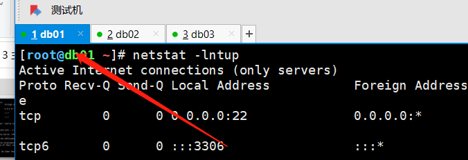
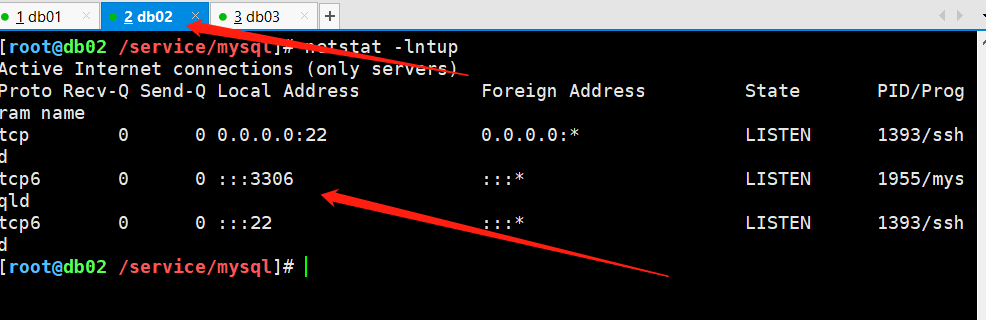
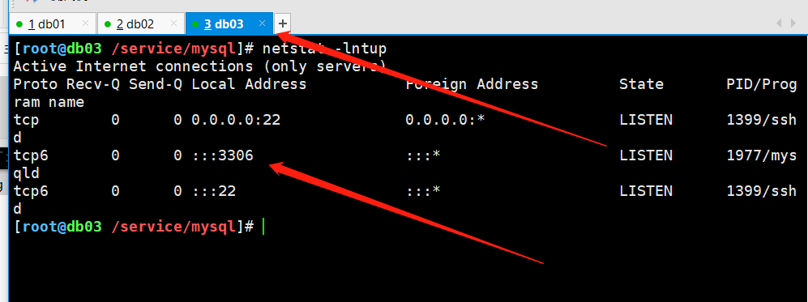
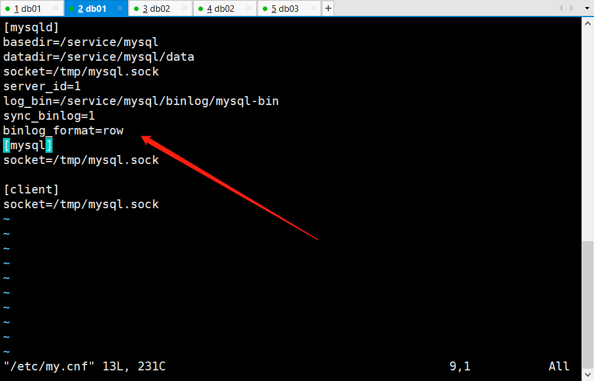
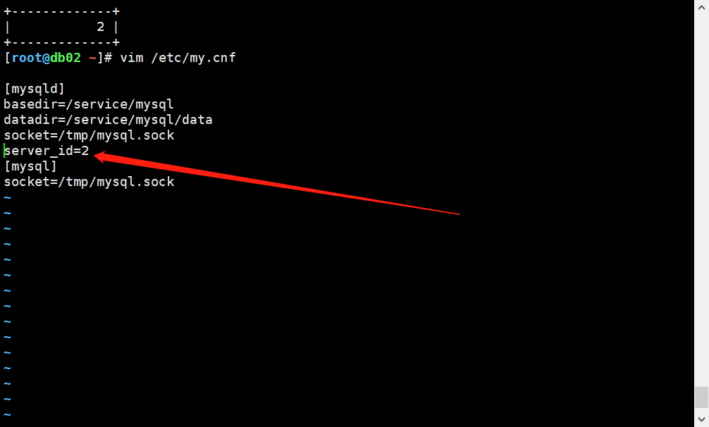
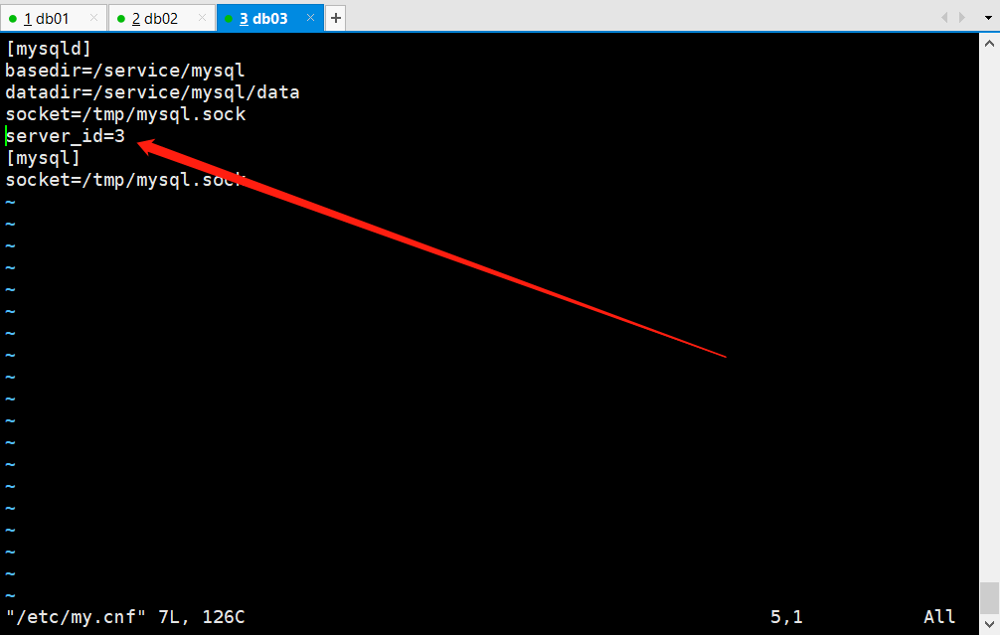
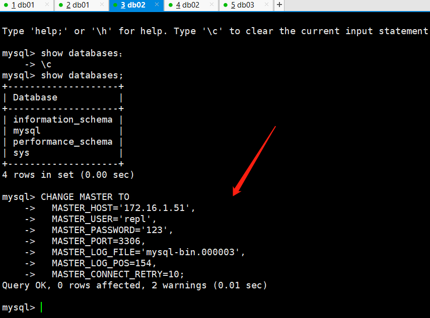
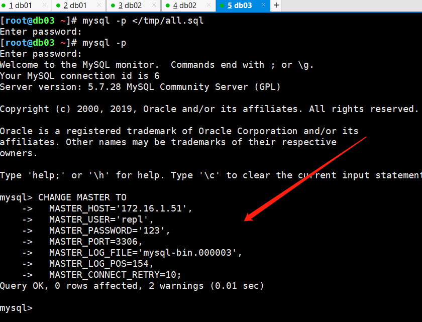
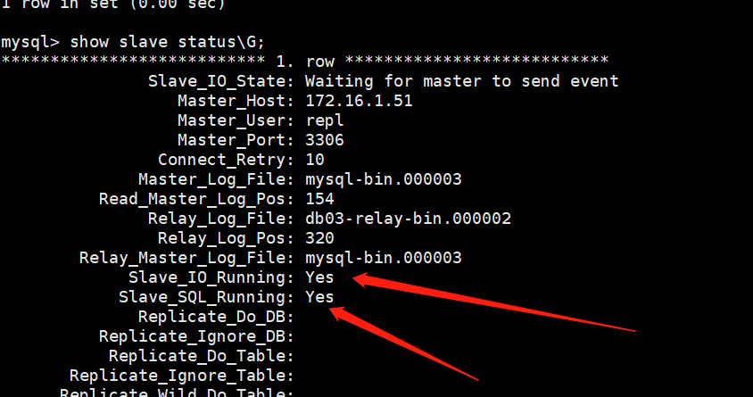

# 主从复制

**全年无故障率**

```mysql
99.9%                 ----> 0.001*365*24*60=525.6  min
99.99%                ----> 0.0001*365*24*60=52.56 min
99.999%               ----> 0.0001*365*24*60=5.256 min
```


**高可用架构方案**

```mysql
负载均衡:有一定的高可用性 
LVS  Nginx
主备系统:有高可用性,但是需要切换,是单活的架构
KA ,   MHA, MMM
真正高可用(多活系统): 
NDB Cluster  Oracle RAC  Sysbase cluster   , InnoDB Cluster（MGR）,PXC , MGC
```


## 一、介绍

```mysql
两台或以上数据库实例，通过二进制日志，实现数据的“同步”关系。

1. 基于二进制日志复制的
2. 主库的修改操作会记录二进制日志
3. 从库会请求新的二进制日志并回放,最终达到主从数据同步
4. 主从复制核心功能:
	辅助备份,处理物理损坏                   
	扩展新型的架构:高可用,高性能,分布式架构等
```


## 二、主从复制的前提(搭建过程)

```mysql
1.需要两台以上实例，server_id,server_uuid不同
2.主库开启binlog，建立专用复制用户
3.网络通畅，时间同步
4.保证主从开启之前的某个时间点,从库数据是和主库一致(补课)
5.从库：主库的链接信息，确认恢复的起点
6.从库：开启专用的复制线程
```


## 三、主从复制搭建（Classic replication）


### 1、实例准备








### 2、配置server_id







**检查**

```bash
配置完重启数据库

[root@db01 ~]# mysql -p -e "select @@server_id";
Enter password: 
+-------------+
| @@server_id |
+-------------+
|           1 |
+-------------+

[root@db02 ~]# mysql -p -e "select @@server_id";
Enter password: 
+-------------+
| @@server_id |
+-------------+
|           2 |
+-------------+

[root@db03 ~]# mysql -p -e "select @@server_id";
Enter password: 
+-------------+
| @@server_id |
+-------------+
|           3 |
+-------------+
```


### 3、检查主库binlog是否开启

```bash
[root@db01 ~]# mysql -p -e "select @@log_bin";
Enter password: 
+-----------+
| @@log_bin |
+-----------+
|         1 |
+-----------+
```


### 4、主库建立复制用户

```bash
[root@db01 ~]# mysql -p -e "grant replication slave on *.* to repl@'172.16.1.%' identified by '123'";
Enter password: 

确认：
[root@db01 ~]# mysql -p -e "select user,host from mysql.user";
Enter password: 
+---------------+-----------+
| user          | host      |
+---------------+-----------+
| repl          | 10.0.0.%  |
| mysql.session | localhost |
| mysql.sys     | localhost |
| root          | localhost |
+---------------+-----------+
```


### 5、主库备份恢复到从库

#### 1）备份

````bash
[root@db01 ~]# mysqldump -uroot -p -A --master-data=2 --single-transaction -R -E --triggers --max_allowed_packet=64M > /tmp/all.sql
Enter password: 

````


#### 2）将备份发给从库

```bash
[root@db01 ~]# rsync -avz /tmp/all.sql root@172.16.1.52:/tmp
[root@db01 ~]# rsync -avz /tmp/all.sql root@172.16.1.53:/tmp


检查
[root@db02 ~]# ll /tmp/
total 836
-rw-r--r-- 1 root  root  848155 Mar 13 19:42 all.sql

[root@db03 ~]# ll /tmp/
total 836
-rw-r--r-- 1 root  root  848155 Mar 13 19:42 all.sql


```


#### 3）从库将备份导入自身数据库

```bash
[root@db02 ~]# mysql -p </tmp/all.sql 
[root@db03 ~]# mysql -p </tmp/all.sql
```


### 6、告知从库复制信息

#### 1）查看

```mysql
mysql> help change master to

CHANGE MASTER TO
  MASTER_HOST='master2.example.com',			主机
  MASTER_USER='replication',					复制用户名
  MASTER_PASSWORD='password',					密码
  MASTER_PORT=3306,								端口
  MASTER_LOG_FILE='master2-bin.001',			开始日志
  MASTER_LOG_POS=4,								位置号
  MASTER_CONNECT_RETRY=10;

```


#### 2）获取备份中的开始日志及位置号

```bash
[root@db01 ~]# grep "\-- CHANGE MASTER TO" /tmp/all.sql
-- CHANGE MASTER TO MASTER_LOG_FILE='mysql-bin.000007', MASTER_LOG_POS=524;

```


#### 3）修改

````mysql
CHANGE MASTER TO
  MASTER_HOST='172.16.1.51',
  MASTER_USER='repl',
  MASTER_PASSWORD='123',
  MASTER_PORT=3306,
  MASTER_LOG_FILE='mysql-bin.000003',
  MASTER_LOG_POS=154,
  MASTER_CONNECT_RETRY=10;
````


#### 4）在从库中执行






### 7、从库开启专用的复制线程

```mysql
mysql> start slave;
```


### 8、验证

```mysql
show slave status;				查看复制线程状态
```

**查看两个复制线程状态是否yes**




**如果不成功，清空。重新来过**

```bash
mysql> stop slave;				关闭复制线程
mysql> reset slave all;			清空复制线程信息

```

