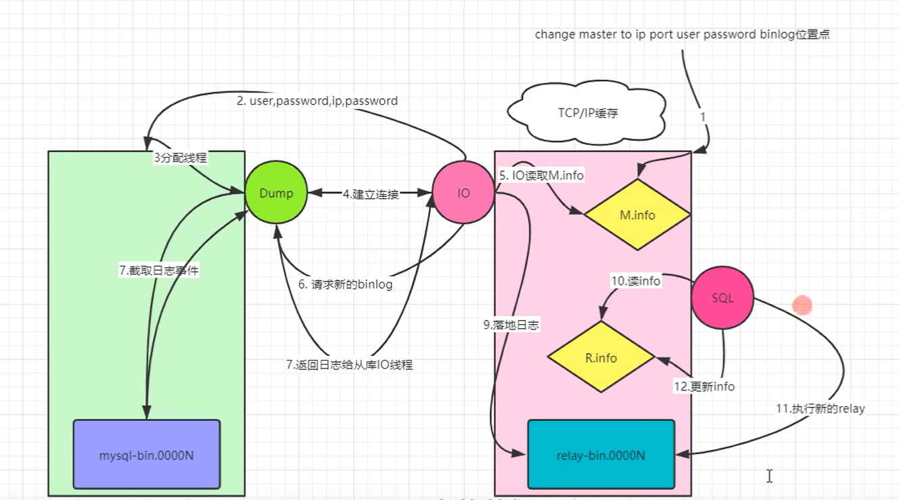

# 主从复制的原理

## 一、主从中涉及到的资源

### 1、文件

```bash
主库：binlog文件
从库：
1.relay-log文件：
	作用：存储接收的binlog，
	位置：默认在从库的数据目录下。
	   	    db02-relay-bin.000001
			db02-relay-bin.000002
	手工定义的方法：
			relay_log_basename=位置信息
		
2.master.info：
	  作用：连接主库的信息，已经接收主库binlog的信息。
	  位置：默认在从库的数据目录下。
	手工定义方法：
			master_info_repository = file/table
	
3.relay.info：
	作用：记录从库回放到的relay-log的位置点。
	位置：默认在从库的数据目录下
		  relay-log.info
	手工定义：
		master_info_repository = file/table
```


### 2、线程

#### 1）主库

```bash
1.Binlog_dump_Thread:
	作用：用来接收从库请求，并且投递binlog给从库。
	查看：mysql> show processlist;
```

#### 2）从库

```bash
1.IO线程：
	作用：请求binlog日志，接收binlog日志
2.SQL线程：
	回放relay日志。
```


## 二、主从复制的原理

```bash
大方框：节点
小方框、菱形：文件
圆圈：线程
```



```bash
1.slave：change master to 时，ip port user password binlog position写入到master.info进行记录
2.slave： start slave 时，从库会启动IO线程和SQL线程
3.IO_T，读取master.info信息，获取主库port、ip、user、password信息连接主库
4. 主库会生成一个准备binlog DUMP线程，来响应从库
5. IO_T根据master.info记录的binlog文件名和position号，请求主库DUMP最新日志
6. DUMP线程检查主库的binlog日志，如果有新的，TP(传送)给从从库的IO_T
7. IO_T将收到的日志存储到了TCP/IP 缓存，立即返回ACK给主库 ，主库工作完成
8.IO_T将缓存中的数据，存储到relay-log日志文件,更新master.info文件中binlog文件名和postion，IO_T工作完成
9.SQL_T读取relay-log.info文件，获取到上次执行到的relay-log的位置，作为起点，回放relay-log
10.SQL_T回放完成之后，会更新relay-log.info文件。
11. relay-log会有自动清理的功能。参数：relay_log_purge=on,定期删除应用过的relay-log
细节：
12.主库一旦有新的日志生成，会发送“信号”给binlog dump ，IO线程再请求
```


# 主从复制监控

## 一、主库方面

```mysql
mysql> show processlist;	查看dump线程情况
mysql> show slave hosts;	查看从库情况
```


## 二、从库方面

```mysql
mysql> show slave status \G;

终点信息介绍

主库相关信息，来自于master.info
    Master_Host: 172.16.1.51			主库ip地址
    Master_User: repl					主库用户名
    Master_Port: 3306					主库端口
    Connect_Retry: 10					重连次数
    Master_Log_File: mysql-bin.000003	从库读取到的主库binlog日志
    Read_Master_Log_Pos: 313			从库读取到的主库位置号

从库relay-log的执行情况，来自于relay.info，一般用作判断主从延时
    Relay_Log_File: db02-relay-bin.000002		从库执行到的binlog文件
    Relay_Log_Pos: 479							从库执行到的位置号
    Relay_Master_Log_File: mysql-bin.000003		执行对应的是主库的那个文件
	Exec_Master_Log_Pos: 313					已经执行到的主库的位置点信息
	Seconds_Behind_Master: 0					落后主库多少秒

从库的线程状态，及具体报错信息
    Slave_IO_Running: Yes				
    Slave_SQL_Running: Yes
    Last_IO_Errno: 0
    Last_IO_Error: 
    Last_SQL_Errno: 0
    Last_SQL_Error: 

过滤复制相关信息的：
    Replicate_Do_DB: 
    Replicate_Ignore_DB: 
    Replicate_Do_Table: 
    Replicate_Ignore_Table: 
    Replicate_Wild_Do_Table: 
    Replicate_Wild_Ignore_Table: 


延时从库的配置信息（人为）
    SQL_Delay: 0
    SQL_Remaining_Delay: NULL

GTID相关复制信息
    Retrieved_Gtid_Set: 
    Executed_Gtid_Set: 
	Auto_Position: 0

```

