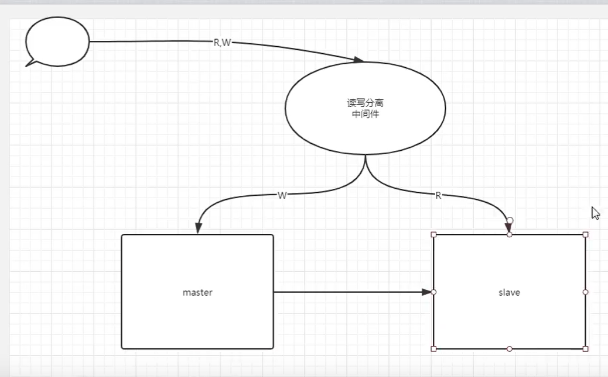

# 主从复制的分析及处理

## 一、监控方法

### 1、show slave status

```mysql
从库的线程状态，及具体报错信息
    Slave_IO_Running: Yes				
    Slave_SQL_Running: Yes
    Last_IO_Errno: 0
    Last_IO_Error: 
    Last_SQL_Errno: 0
    Last_SQL_Error: 
```


## 二、IO线程

### 1、正常状态

```mysql
Slave_IO_Running: Yes
```


### 2、非正常状态

```mysql
NO
Connecting
```


### 3、故障原因

#### 1）连接主库

```mysql
1.网络、端口、防火墙
2.用户、密码、权限（replication slave）
3.主库达到连接数上线（默认151）
	select @@max_connections;
4.版本不统一 5.7 native 8.0 sha2 （加密方式不同）
```

**故障处理方法**

change master to信息写错了:

```mysql
主从中的线程管理
start slave;	启动所有线程
stop slave;		关闭所有线程

start slave sql_thread;		单独启动sql线程
stop slave sql_thread;		单独关闭sql线程

start slave io_thread;		单独启动io线程
stop slave io_thread;		单独关闭io线程

reset slave all;	清除从库身份

change master to信息写错了:
    stop  slave  
    reset slave all 
    change master to 
    start slave
```


主库连接数上线,或者是主库太繁忙

```mysql
show slave  staus \G 
Last_IO_Errno: 1040
Last_IO_Error: error reconnecting to master 'repl@172.16.1.51:3307' - retry-time: 10  retries: 7
处理思路:
拿复制用户,手工连接一下

[root@db01 ~]# mysql -urepl -p123 -h 172.16.1.51
mysql: [Warning] Using a password on the command line interface can be insecure.
ERROR 1040 (HY000): Too many connections
处理方法:
db01 [(none)]>set global max_connections=300;

(3) 防火墙,网络不通
```


#### 2）请求、接收日志

**故障原因**

```mysql
主库二进制日志不完整、损坏、不连续
从库方面,二进制日志位置点不对
主库的server_id (server_uuid)相同
relaylog 问题

原因：主库执行
	reset master; 
Last_IO_Error: Got fatal error 1236 from master when reading data from binary log: 'could not find next log; the first event 'mysql-bin.000001' at 154, the last event read from '/service/mysql/data/mysql-bin.000002' at 154, the last byte read from '/service/mysql/data/mysql-bin.000002' at 154.'
```


**处理方法**

```mysql
解决方案:
重新构建主从


注意：在主从复制环境中,严令禁止主库中reset master; 可以选择expire 进行定期清理主库二进制日志

1、找业务不繁忙期间，停业务五分钟
2、等待从库重放完所有主库日志
3、主库reset master；
4、从库重新同步主库日志
	stop slave;
	reset slave all;
	change master to
	start slave;
```

第三方工具

```mysql
pt工具
```


## 三、SQL线程

### 1、正常状态

```mysql
Slave_SQL_Running: Yes
```


### 2、主要功能

```mysql
回放relay-log中的日志。可以理解为执行relay-log SQL
```


### 3、sql线程故障原因

```mysql
1.创建的对象已经存在
2.需要操作的对象不存在
3.DML语句不符合表定义及约束
4.版本差异，参数设定不同，比如：数据类型的差异，SQL_MODE影响

归根揭底的原因都是由于从库发生了写入操作.
Last_SQL_Error: Error 'Can't create database 'db'; database exists' on query. Default database: 'db'. Query: 'create database db'

双主结构也容易出现问题
```


### 4、处理方法

#### 1）从库有了写入操作

**故障模拟：**

```mysql
1、先在从库 create database xiaowu;
2、再在主库 create database xiaowu;
3、检查从库SQL线程状态
Slave SQL Running: No
Last Error: Error 'Can't create database 'xiaowu'; database exists' on query. Default database: 'xiaowu'
Query: 'create database xiaowu'
```

**处理故障**

```mysql
思路一：一切以主库为准
	从库进行反操作。重启线程
	drop database xiaowu；
	start slave;
	
思路二：跳过方法
  方法一：
	stop slave; 
	set global sql_slave_skip_counter = 1;
	#将同步指针向下移动一个，如果多次不同步，可以重复操作。（跳过当前最新错误）
	start slave;
 
 如果要用这种办法，一定要保证此时故障数据是完全一致性时，才能采用
 	第三方工具：帮助我们检查主从数据一致，并可以修复不一致情况。
 		pt工具主从有关。

 方法二：（暴力方法，遇到自动跳过）
    vim /etc/my.cnf
    slave-skip-errors = 1032,1062,1007
    常见错误代码:
    1007:对象已存在
    1032:无法执行DML
    1062:主键冲突,或约束冲突

但是，以上操作有时是有风险的，最安全的做法就是重新构建主从。把握一个原则,一切以主库为主.


思路三：
	重新搭建主从：备份恢复+重新构建
```


#### 一劳永逸的方法：

```mysql
(1) 可以设置从库只读.
select @@read_only;			#普通用户只读
select @@super_read_only;	#普通管理员用户只读


(2)中间件
读写分离。
```

**中间件**




补充：

1、主库出现问题宕机怎么办

```mysql
物理：
	1、查看主库是否可以ssh连接上
	2、检查binlog是否完整
	3、手工追加日志到最新位置
	4、从库代替主库工作
	
逻辑：
	只能通过备份去恢复
```


2、从库怎么称当主库

```mysql
1、将从库修复到最新状态
2、取消从库的身份
3、情况binlog信息
```

