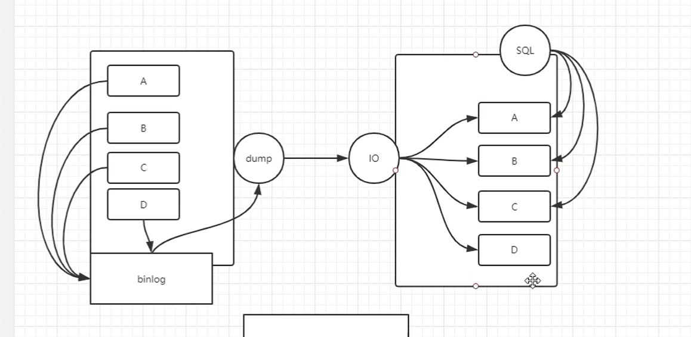
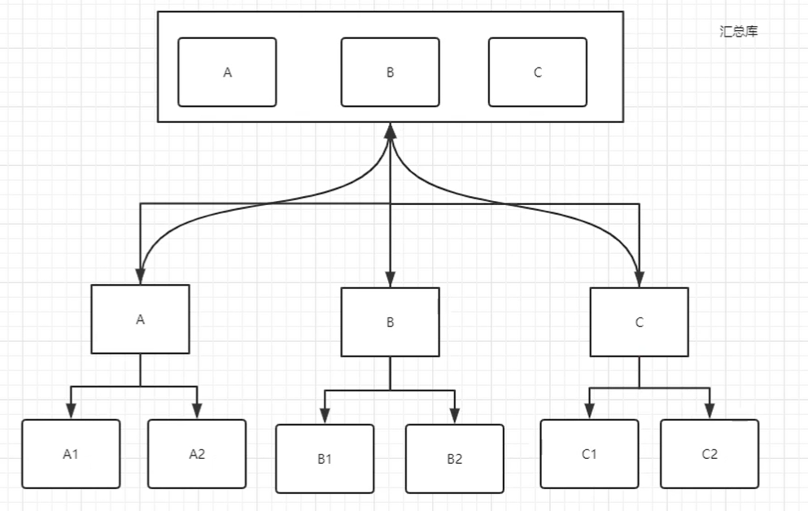

# 过滤复制

## 一、介绍

```mysql
过滤掉不需要的数据，只复制想要复制的数据
```







## 二、配置方法（二选一）

### 1、主库

```mysql
mysql> show master status;

Binlog_Do_DB	白名单
Binlog_Ignore_DB	黑名单

使用：(小写)
	binlog_do_db=库名
	binlog_ignore_db=库名

```


### 2、从库(建议)

```mysql
replicate_do_db					白名单
replicate_ignore_db				黑名单

replicate_do_table				白名单
replicate_ignore_table			黑名单

replicate_wild_do_table			白名单
replicate_wild_ignore_table		黑名单
```

**使用**

```mysql
replicate_do_db=库名
replicate_ignore_db=库名	

replicate_do_table=库名.表名
replicate_ignore_table=库名.表名

replicate_wild_do_table=库名.t*
replicate_wild_ignore_table=库名.t*
```


## 三、实现过程(例子)

```mysql
mysqldump -S /data/3307/mysql.sock -A --master-data=2 --single-transaction  -R --triggers >/backup/full.sql

vim  /backup/full.sql
-- CHANGE MASTER TO MASTER_LOG_FILE='mysql-bin.000002', MASTER_LOG_POS=154;

[root@db01 ~]# mysql -S /data/3309/mysql.sock 
source /backup/full.sql

CHANGE MASTER TO
MASTER_HOST='10.0.0.51',
MASTER_USER='repl',
MASTER_PASSWORD='123',
MASTER_PORT=3307,
MASTER_LOG_FILE='mysql-bin.000002',
MASTER_LOG_POS=154,
MASTER_CONNECT_RETRY=10;
start  slave;
从库
[root@db01 ~]# vim /data/3309/my.cnf 
replicate_do_db=ppt
replicate_do_db=word
[root@db01 ~]# systemctl restart mysqld3309
mysql> show slave status\G
Replicate_Do_DB: ppt,word

主库：
Master [(none)]>create database word;
Query OK, 1 row affected (0.00 sec)
Master [(none)]>create database ppt;
Query OK, 1 row affected (0.00 sec)
Master [(none)]>create database excel;
Query OK, 1 row affected (0.01 sec)
```


