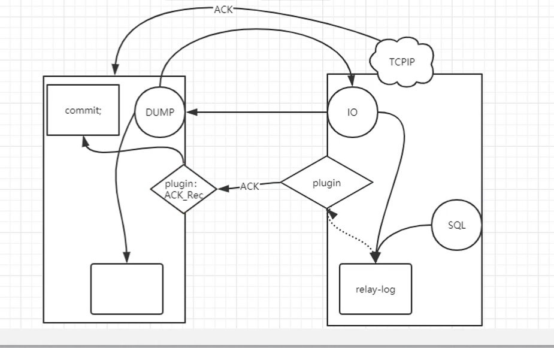

# 半同步复制

## 一、介绍

```bash
1.Classic replication ：传统异步非GTID复制，在这种工作模型下，会导致主从数据不一致情况

2.5.5版本为了保证主从数据的一致性问题。加入了半同步复制的组件

3.如果生产业务比较关注主从一致。我们推荐可以使用MGR的架构，或者PXC等，实现数据一致性。
```


## 二、工作原理的变化




```mysql
1. 主库执行新的事务,commit时,更新 show master  status\G ,触发一个信号给binlog dump
2. binlog dump 接收到主库的 show master status\G信息,通知从库日志更新了
3. 从库IO线程请求新的二进制日志事件
4. 主库会通过dump线程传送新的日志事件,给从库IO线程
5. 从库IO线程接收到binlog日志,当日志写入到磁盘上的relaylog文件时,给主库ACK_receiver线程
6. ACK_receiver线程触发一个事件,告诉主库commit可以成功了
7. 如果ACK达到了我们预设值的超时时间,半同步复制会切换为原始的异步复制.
```


## 三、配置

```mysql
加载插件
主:
INSTALL PLUGIN rpl_semi_sync_master SONAME 'semisync_master.so';
从:
INSTALL PLUGIN rpl_semi_sync_slave SONAME 'semisync_slave.so';
查看是否加载成功:
show plugins;
启动:
主:
SET GLOBAL rpl_semi_sync_master_enabled = 1;
从:
SET GLOBAL rpl_semi_sync_slave_enabled = 1;
重启从库上的IO线程
STOP SLAVE IO_THREAD;
START SLAVE IO_THREAD;
查看是否在运行
主:
show status like 'Rpl_semi_sync_master_status';
从:
show status like 'Rpl_semi_sync_slave_status';
```

