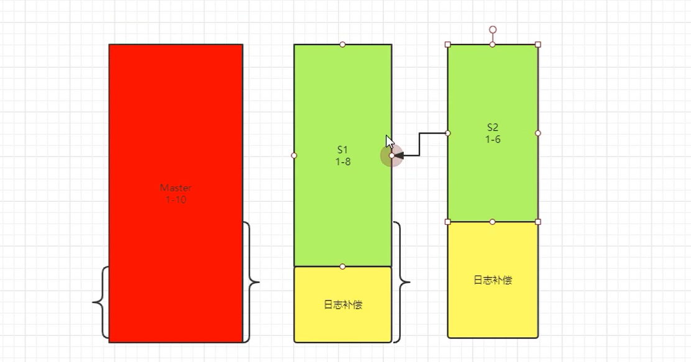

# MHA高可用工作原理

## 一、MHA高可用三大功能

```bash
高可用：
	最擅长的是为我们解决物理损坏
	
1、监控
	数据库节点，主要监控主库
	
2、选主？
	1）优先级（主观行为）
	2）根据日志量判断，日志最接近主库的
	3）日志量相同，配置文件顺序
	
3、日志补偿
	情况一：主库ssh能连上，立即保存缺失部分的日志到从库并恢复
	情况二：ssh无法连接，两个从库进行日志差异补偿（diff）。
```




## 二、MHA Failover过程原理

```bash
高可用：
	最擅长的是为我们解决物理损坏
1、启动Manager
	调用masterha_manger脚本启动manager程序
	
2、监控
	通过masterha_master_monitor心跳检测脚本，监控数据库节点，主要监控主库
	默认探测4次，每隔（ping_interval=2）秒，如果主库还没有心跳，认为主库宕机，进入故障转移（failover）过程。
	
3、选主？
	1）优先级（主观行为），如果在节点配置时，加入了candidate_master=1参数。
		如果备选主，日志量落后主库master太多，也不会选择新主。
		可以通过check_repl_delay=0，不检查日志落后的场景
	2）根据日志量判断，日志最接近主库的
	3）日志量相同，配置文件顺序
	
4、日志补偿
	情况一：主库ssh能连上，通过save_binary_logs立即保存缺失部分的日志到从库（/var/tmp目录下）并恢复。
	情况二：ssh无法连接，两个从库进行（apply_diff_relay_logs ）日志差异补偿（diff）。
	
5、主从身份切换
	所有从库取消原有和主库的复制关系（stop slave；reset slave all）。
	新竹路和剩余主库重新构建主从关系。
	
6、数据库自从被剔除集群
	masterha_conf_host配置信息去掉

7、MHA是一次性的高可用，Failover后，Manager自动退出
	
```

**以上是，MHA的基础环境所具备的功能**


## 三、当前情况下的不足

```bash
1、应用透明
2、数据补偿
3、自动提醒
4、自愈功能 待开发。。。
  思路
	MHA+k8s+operator 官方
	8.0 MGR+mysqlsh
```

