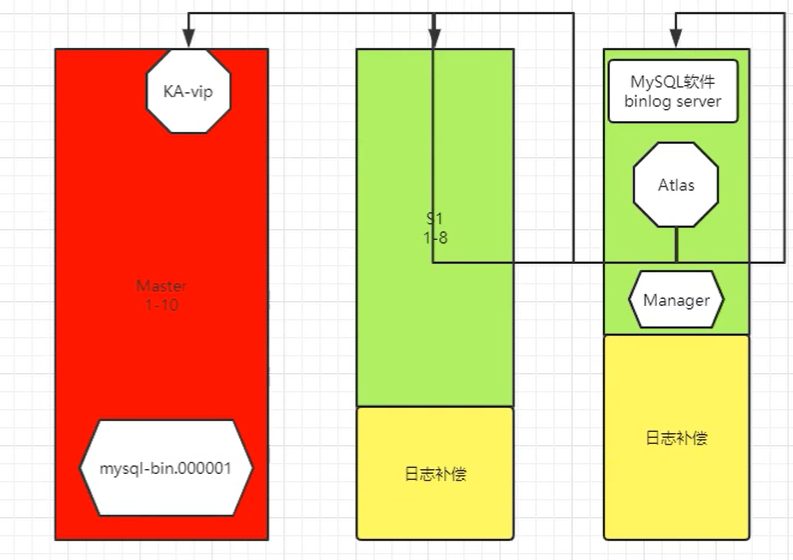

# atlas介绍及安装

## 一、修复MHA环境

### 1、检查MHA主环境

```bash
1.#检查ssh互信
masterha_check_ssh  --conf=/etc/mha/app1.cnf

2.#检查主从状态
masterha_check_repl  --conf=/etc/mha/app1.cnf

3.#查看MHA状态
 masterha_check_status --conf=/etc/mha/app1.cnf
 
4.#若未启动，启动MHA
nohup masterha_manager --conf=/etc/mha/app1.cnf --remove_dead_master_conf --ignore_last_failover  < /dev/null> /var/log/mha/app1/manager.log 2>&1 &

masterha_check_status --conf=/etc/mha/app1.cnf
```


### 2、检查VIP应用透明

```bash
1.#查看MHA主库是否有VIP
	ip a
	
2.#若没有VIP，检查脚本，重新添加权限
dos2unix /usr/local/bin/master_ip_failover 

chmod +x /usr/local/bin/master_ip_failover 

3.#手工生成VIP
ifconfig eth0:1 10.0.0.55/24

4.#重启MHA
masterha_stop --conf=/etc/mha/app1.cnf

nohup masterha_manager --conf=/etc/mha/app1.cnf --remove_dead_master_conf --ignore_last_failover < /dev/null > /var/log/mha/app1/manager.log 2>&1 &
	
5.检测状态
masterha_check_status --conf=/etc/mha/app1.cnf
```


### 3、检查binlogserver数据补偿

```bash
1.#查看配置文件
[binlog1]
hostname=10.0.0.53
master_binlog_dir=/data/mysql/binlog
no_master=1

2.#查看目录、删除历史文件
[root@db03 ~]# cd /data/mysql/binlog/
[root@db03 /data/mysql/binlog]# ll
total 32
-rw-r----- 1 root root 177 Mar 23 10:47 mysql-bin.000001
-rw-r----- 1 root root 444 Mar 23 10:47 mysql-bin.000002
-rw-r----- 1 root root 194 Mar 23 10:47 mysql-bin.000003
-rw-r----- 1 root root 217 Mar 23 10:47 mysql-bin.000004
-rw-r----- 1 root root 613 Mar 23 10:47 mysql-bin.000005
-rw-r----- 1 root root 613 Mar 23 10:47 mysql-bin.000006
-rw-r----- 1 root root 520 Mar 23 10:47 mysql-bin.000007
-rw-r----- 1 root root 234 Mar 23 10:47 mysql-bin.000008
[root@db03 /data/mysql/binlog]# rm -rf *


3.#查看主库当前日志点
db02 [(none)]>show master status;

4.#拉取日志
	mysqlbinlog  -R --host=10.0.0.52 --user=mha --password=mha --raw  --stop-never mysql-bin.000008 &
	
5.#确认
[root@db03 /data/mysql/binlog]# ll
total 4
-rw-r----- 1 root root 234 Mar 25 10:41 mysql-bin.000008
```


### 4、查看MHA邮件提醒

```bash
1.#检查配置文件
[root@db03 /etc/mha]# cat app1.cnf
...
report_script=/usr/local/bin/send_report
...

2.#查看邮件脚本
[root@db03 ~]# cat /usr/local/bin/send_report
...
my $smtp='smtp.qq.com';
my $mail_from='1426115933@qq.com';
my $mail_user='1426115933';
my $mail_pass='wmqulwrumcvqgbbg';
#my $mail_to=['to1@qq.com','to2@qq.com'];
my $mail_to='1426115933@qq.com';
...

3.#添加权限
chmod +x /usr/local/bin/*

4.#重启MHA
[root@db03 ~]# masterha_stop --conf=/etc/mha/app1.cnf

[root@db03 ~]# nohup masterha_manager --conf=/etc/mha/app1.cnf --remove_dead_master_conf --ignore_last_failover < /dev/null > /var/log/mha/app1/manager.log 2>&1 &
```


## 二、stlas介绍

```bash
 	Atlas是由 Qihoo 360, Web平台部基础架构团队开发维护的一个基于MySQL协议的数据中间层项目。
	它是在mysql-proxy 0.8.2版本的基础上，对其进行了优化，增加了一些新的功能特性。
	360内部使用Atlas运行的mysql业务，每天承载的读写请求数达几十亿条。

MySQL读写分离:
	1.官方提供一个:mysql-proxy
	2.Atlas

Atlas主要功能(代理)
	1.读写分离
	2.从库负载均衡
	3.IP过滤
	4.自动分表
	5.DBA可平滑上下线DB(不影响用户的体验,把你的数据库下线)
	6.自动摘除宕机的DB
	
Atlas相对于官方MySQL-Proxy的优势
	1.将主流程中所有Lua代码用C重写，Lua仅用于管理接口
	2.重写网络模型、线程模型
	3.实现了真正意义上的连接池
	4.优化了锁机制，性能提高数十倍
	
注意：
	1、Atlas只能安装运行在64位的系统上
    2、Centos 5.X安装 Atlas-XX.el5.x86_64.rpm，Centos 6.X安装Atlas-XX.el6.x86_64.rpm。
    3、后端mysql版本应大于5.1，建议使用Mysql 5.6以上
```


## 三、atlas安装应用

### 1、下载

```bash
wget https://github.com/Qihoo360/Atlas/releases/download/2.2.1/Atlas-2.2.1.el6.x86_64.rpm


https://github.com/Qihoo360/Atlas/releases
```


### 2、安装

```bash
[root@db03 /tmp]# rpm -ivh Atlas-2.2.1.el6.x86_64.rpm
```

**MHA atlas binlogserver 是可以独立放开的，资源消耗低**




### 3、配置

```bash
cd /usr/local/mysql-proxy/conf

mv test.cnf test.cnf.bak

vim test.cnf

[mysql-proxy]
admin-username = user
admin-password = pwd
proxy-backend-addresses = 10.0.0.55:3306
proxy-read-only-backend-addresses = 10.0.0.51:3306,10.0.0.53:3306
pwds = repl:3yb5jEku5h4=,mha:O2jBXONX098=
daemon = true
keepalive = true
event-threads = 8
log-level = message
log-path = /usr/local/mysql-proxy/log
sql-log=ON
proxy-address = 0.0.0.0:33060
admin-address = 0.0.0.0:2345
charset=utf8

# 启动atlas，可以通过不同的配置文件，进行不同业务的操作
/usr/local/mysql-proxy/bin/mysql-proxyd 配置文件 start
/usr/local/mysql-proxy/bin/mysql-proxyd test start

ps -ef |grep proxy
```


**配置参数解释**

```bash
[mysql-proxy]
#管理接口的用户名
admin-username = user

#管理接口的密码
admin-password = pwd

#Atlas后端连接的MySQL主库的IP和端口，可设置多项，用逗号分隔
proxy-backend-addresses = 10.0.0.55:3306

#Atlas后端连接的MySQL从库的IP和端口，@后面的数字代表权重，用来作负载均衡，若省略则默认为1，可设置多项，用逗号分隔
proxy-read-only-backend-addresses = 10.0.0.51:3306,10.0.0.53:3306

#用户名与其对应的加密过的MySQL密码，密码使用PREFIX/bin目录下的加密程序encrypt加密，下行的user1和user2为示例，将其替换为你的MySQL的用户名和加密密码！
pwds = repl:3yb5jEku5h4=,mha:O2jBXONX098=

#设置Atlas的运行方式，设为true时为守护进程方式，设为false时为前台方式，一般开发调试时设为false，线上运行时设为true,true后面不能有空格。
daemon = true

#设置Atlas的运行方式，设为true时Atlas会启动两个进程，一个为monitor，一个为worker，monitor在worker意外退出后会自动将其重启，设为false时只有worker，没有monitor，一般开发调试时设为false，线上运行时设为true,true后面不能有空格。
keepalive = true

#工作线程数，对Atlas的性能有很大影响，可根据情况适当设置
event-threads = 8

#日志级别，分为message、warning、critical、error、debug五个级别
log-level = message

#日志存放的路径
log-path = /usr/local/mysql-proxy/log

#SQL日志的开关，可设置为OFF、ON、REALTIME，OFF代表不记录SQL日志，ON代表记录SQL日志，REALTIME代表记录SQL日志且实时写入磁盘，默认为OFF
sql-log=ON

#Atlas监听的工作接口IP和端口
proxy-address = 0.0.0.0:33060

#Atlas监听的管理接口IP和端口
admin-address = 0.0.0.0:2345

#默认字符集，设置该项后客户端不再需要执行SET NAMES语句
charset=utf8
```


### 4、测试读写分离

#### 1）登录atlas

```bash
[root@db03 ~]# mysql -umha -pmha -h 10.0.0.53 -P33060
```


#### 2）测试读操作

```bash
db03 [(none)]>select @@server_id;
多次操作，如果是从库轮询读取证明读操作成功
```


#### 3）测试写操作

```bash
db03 [(none)]>begin;select @@server_id;commit;
多次操作，如果是主库证明写走主库
```

