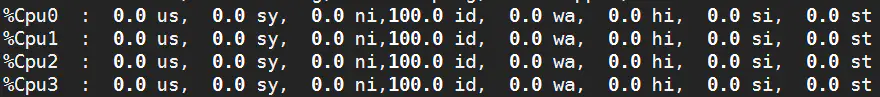

# mysql优化

## 一、优化哲学

### 1、为什么优化

```bash
为了获得成就感?
为了证实比系统设计者更懂数据库?
为了从优化成果来证实优化者更有价值?
```


```bash
但通常事实证实的结果往往会和您期待相反！
优化有风险，涉足需谨慎！
```


### 2、优化风险

```bash
1、优化不总是对一个单纯的环境进行！还很可能是一个复杂的已投产的系统。
2、优化手段本来就有很大的风险，只不过你没能力意识到和预见到！
3、任何的技术可以解决一个问题，但必然存在带来一个问题的风险！
4、对于优化来说解决问题而带来的问题控制在可接受的范围内才是有成果。
5、保持现状或出现更差的情况都是失败！

6、稳定性和业务可持续性通常比性能更重要！
7、优化不可避免涉及到变更，变更就有风险！
8、优化使性能变好，维持和变差是等概率事件！
9、优化不能只是数据库管理员担当风险，但会所有的人分享优化成果！
10、所以优化工作是由业务需要驱使的！！！
```


### 3、谁参与优化

```bash
数据库管理员
业务部门代表
应用程序架构师
应用程序设计人员
应用程序开发人员
硬件及系统管理员
存储管理员
```


### 4、优化方向

```bash
安全优化（业务持续性）
性能优化（业务高效性）
```


### 5、优化的范围及思路

```bash
优化范围：
存储、主机和操作系统:
    主机架构稳定性
    I/O规划及配置
    Swap
    OS内核参数
        网络问题
应用程序:（Index，lock，session）
        应用程序稳定性和性能
        SQL语句性能
    串行访问资源
    性能欠佳会话管理
数据库优化:（内存、数据库设计、参数）
    内存
    数据库结构(物理&逻辑)
    实例配置
```

**优化效果和成本的评估：**


## 二、企业问题

```bash
解: 
我们公司去年10月份,上线了个新业务,站在整体业务角度全面优化方案,期中包含了: 
硬件 : DELL R730 40C 128G 10台 SAS(8块:4块raid10 2块热备)+SSD 512G日志  网卡 4块网卡 bonding 1
操作系统  : C7.6,numa  THP 关闭 , XFS  ,Swap ,sysctl.conf ,limits.conf nofile , 防火墙 selinux 关闭,deadline,No LVM 
数据库实例
SQL规范
索引
事务和锁
架构 
安全 
```


## 三、硬件层面优化

### 1、硬件选配

```bash
1、品牌：DELL、HP、IBM、华为、浪潮。
2、CPU：Inter、E-5
3、内存：ECC 
4、IO : SAS 、 pci-e SSD 、 Nvme flash
5、raid卡：Raid10
6、网卡： 单卡单口  bonding  + 交换机堆叠
7、云服务器： ECS 、RDS 、TDSQL、PolarxDB
```


### 2、关闭NUMA

#### 1）bios级别

```bash
在bios层面numa关闭时，无论os层面的numa是否打开，都不会影响性能。

# numactl --hardware
available: 1 nodes (0)       #如果是2或多个nodes就说明numa没关掉
```


#### 2）OS grub级别：

```bash
vi /boot/grub2/grub.cfg
#/* Copyright 2010, Oracle. All rights reserved. */
 
default=0
timeout=5
hiddenmenu
foreground=000000
background=ffffff
splashimage=(hd0,0)/boot/grub/oracle.xpm.gz
 
title Trying_C0D0_as_HD0
root (hd0,0)
kernel /boot/vmlinuz-2.6.18-128.1.16.0.1.el5 root=LABEL=DBSYS ro bootarea=dbsys rhgb quiet console=ttyS0,115200n8 console=tty1 crashkernel=128M@16M numa=off
initrd /boot/initrd-2.6.18-128.1.16.0.1.el5.img

在os层numa关闭时,打开bios层的numa会影响性能，QPS会下降15-30%;
```


#### 3）数据库级别

```bash
mysql> show variables like '%numa%';
+------------------------+-------+
| Variable_name          | Value |
+------------------------+-------+
| innodb_numa_interleave | OFF   |
+------------------------+-------+

或者： 
vi /etc/init.d/mysqld
找到如下行
# Give extra arguments to mysqld with the my.cnf file. This script
# may be overwritten at next upgrade.
$bindir/mysqld_safe --datadir="$datadir" --pid-file="$mysqld_pid_file_path" $other_args >/dev/null &

wait_for_pid created "$!" "$mysqld_pid_file_path"; return_value=$?
将$bindir/mysqld_safe --datadir="$datadir"这一行修改为：

/usr/bin/numactl --interleave all $bindir/mysqld_safe --datadir="$datadir" --pid-file="$mysqld_pid_file_path" $other_args >/dev/null &
wait_for_pid created "$!" "$mysqld_pid_file_path"; return_value=$?

```


### 3、阵列卡配置建议

```bash
raid10(推荐)

SSD或者PCI-E或者Flash

强制回写（Force WriteBack）
BBU 电池 ： 如果没电会有较大性能影响、定期充放电，如果UPS、多路电源、发电机。可以关闭。

关闭预读 
有可能的话开启Cache(如果UPS、多路电源、发电机。)
```


### 4、关闭THP

```bash
vi /etc/rc.local
在文件末尾添加如下指令：
if test -f /sys/kernel/mm/transparent_hugepage/enabled; then
   echo never > /sys/kernel/mm/transparent_hugepage/enabled
fi
if test -f /sys/kernel/mm/transparent_hugepage/defrag; then
   echo never > /sys/kernel/mm/transparent_hugepage/defrag
fi

[root@master ~]# cat /sys/kernel/mm/transparent_hugepage/enabled 
always madvise [never]
[root@master ~]# cat  /sys/kernel/mm/transparent_hugepage/defrag
always madvise [never]
```


### 5、网卡绑定

```bash
bonding技术，业务数据库服务器都要配置bonding继续。建议是主备模式。
交换机一定要堆叠。
```


### 6、存储多路径

```bash
使用独立存储设备的话，需要配置多路径。
linux 自带 : multipath
厂商提供    : 
```


## 四、系统层面优化

### 1、更改文件句柄和进程数

```bash
内核优化 /etc/sysctl.conf
vm.swappiness = 5
vm.dirty_ratio = 20
vm.dirty_background_ratio = 10
net.ipv4.tcp_max_syn_backlog = 819200
net.core.netdev_max_backlog = 400000
net.core.somaxconn = 4096
net.ipv4.tcp_tw_reuse=1
net.ipv4.tcp_tw_recycle=0

limits.conf 
nofile 63000
```


### 2、selinux和防火墙

```bash
禁用selinux ： /etc/sysconfig/selinux 更改SELINUX=disabled.
iptables如果不使用可以关闭。可是需要打开MySQL需要的端口号
```


### 3、文件系统优化

```bash
推荐使用XFS文件系统
MySQL数据分区独立 ，例如挂载点为: /data
mount参数 defaults, noatime, nodiratime, nobarrier 如/etc/fstab：
/dev/sdb /data                   xfs     defaults,noatime,nodiratime,nobarrier        1 2
```


### 4、不使用LVM


### 5、IO调度

```bash
SAS ：      deadline
SSD&PCI-E： noop

centos 7 默认是deadline
cat   /sys/block/sda/queue/scheduler

#临时修改为deadline(centos6)
echo deadline >/sys/block/sda/queue/scheduler 
vi /boot/grub/grub.conf
更改到如下内容:
kernel /boot/vmlinuz-2.6.18-8.el5 ro root=LABEL=/ elevator=deadline rhgb quiet
```


## 五、数据库版本选择

```bash
1、稳定版：选择开源的社区版的稳定版GA版本。
2、选择mysql数据库GA版本发布后6个月-12个月的GA双数版本，大约在15-20个小版本左右。
3、要选择前后几个月没有大的BUG修复的版本，而不是大量修复BUG的集中版本。
4、要考虑开发人员开发程序使用的版本是否兼容你选的版本。
5、作为内部开发测试数据库环境，跑大概3-6个月的时间。
6、优先企业非核心业务采用新版本的数据库GA版本软件。
7、向DBA高手请教，或者在技术氛围好的群里和大家一起交流，使用真正的高手们用过的好用的GA版本产品。

最终建议： 8.0.20是一个不错的版本选择。向后可以选择双数版。
```


## 六、数据库三层结构及核心参数优化

### 1、连接层

```bash
#mysql最大连接数
max_connections=1000         #*****

#连接错误最大尝试次数
max_connect_errors=999999

#等待超时时间，主要针对非交互式等待超时时间
wait_timeout=600             #*****

#交互式等待超时时间
interactive_timeout=3600

#数据读超时时间
net_read_timeout  = 120

#数据写超时时间
net_write_timeout = 120

#数据包传输允许的最大的数据包大小
max_allowed_packet= 1000M      #*****
```


### 2、server层

```bash
#数据安全更新时间
sql_safe_updates                =1                 # *****
#开启慢日志查询
slow_query_log                  =ON
#指定慢日志存放路径
slow_query_log_file             =/data/3307/slow.log   # *****
#慢日志判断时间
long_query_time                 =1                  # *****
#记录不走索引的sql语句
log_queries_not_using_indexes   =ON                 # *****
#在慢查询日志中，去记录没有使用索引的SQL语句的次数
log_throttle_queries_not_using_indexes = 10         # *****

#排序缓冲
sort_buffer 					= 1M
#连接缓冲
join_buffer 					= 1M
#读缓冲
read_buffer						= 1M

read_rnd_buffer                 = 1M
#临时表缓冲区
tmp_table_size  				= 16M
#堆表
heap_table 						= 16M

#最大执行时间
max_execution_time              = 28800

#锁等待时间
lock_wait_timeout               = 60                 # *****
#表名是否区分大小写，1：不区分
lower_case_table_names          =1                   # *****
# MySQL 线程缓存的大小。这个参数指定了可以保留在缓存中的空闲线程数。提高该值可以减少频繁创建和销毁线程带来的开销
thread_cache_size               =64
# 日志中的时间戳格式。可以设置为 SYSTEM 或 UTC。
log_timestamps                  =SYSTEM              # *****
# 每个客户端连接到 MySQL 时，执行的初始化语句。这里设置了每个连接的字符集为 utf8
init_connect                    ="set names utf8"    # *****
# 事件调度器的开关
event_scheduler                 =OFF
# 指定 MySQL 可以执行 LOAD DATA INFILE、SELECT INTO OUTFILE 等文件操作时的文件存放目录。这项配置限制了 MySQL 只能在指定目录中进行这些操作，增强了安全性
secure-file-priv                =/tmp                # *****
# 二进制日志的自动过期时间，单位为秒。2592000 秒表示 30 天。超过这个时间的二进制日志会被自动删除。
binlog_expire_logs_seconds      =2592000             # *****
# 控制二进制日志的同步频率。1 表示每次事务提交时都会将二进制日志同步到磁盘，以确保数据安全性。
sync_binlog                     =1                   # *****
# 启用二进制日志，并指定二进制日志文件的存放路径
log-bin                         =/data/3307/mysql-bin
# 指定保存二进制日志索引文件的路径。该文件保存了所有二进制日志的列表。
log-bin-index                   =/data/3307/mysql-bin.index
# 设置单个二进制日志文件的最大大小为 500 MB。达到这个大小时，MySQL 会生成一个新的日志文件。
max_binlog_size                 =500M
# 每次操作行级数据时，记录每一行的变更。这种格式适用于复制时能准确记录行的改变。
binlog_format                   =ROW
```


### 3、存储引擎层

```bash
# 设置事务隔离级别为 READ COMMITTED，即每个事务只能读取已经提交的数据，防止“脏读”（dirty reads）。
transaction-isolation               ="READ-COMMITTED"    # *****
# 指定 InnoDB 数据文件的主目录路径。所有 InnoDB 数据文件都存储在这个目录下。
innodb_data_home_dir                =/xxx
# 指定 InnoDB 日志文件的目录路径。InnoDB 的重做日志文件会存储在这个目录中。
innodb_log_group_home_dir           =/xxx
# 设置 InnoDB 每个日志文件的大小为 2048 MB。较大的日志文件能减少日志切换的频率，但会增加恢复时的时间。
innodb_log_file_size                =2048M
# InnoDB 日志文件组中包含的日志文件数。推荐使用 2 或 3 个文件
innodb_log_files_in_group           =3
# 控制事务提交时日志刷新的行为。0: 每秒写日志并刷新到磁盘，不保证持久性。1: 每次事务提交都会写日志并刷新到磁盘，保证持久性（最安全但性能较低）。2: 每次提交时将日志写入操作系统缓存，每秒刷新到磁盘。性能与安全性之间的折中。
innodb_flush_log_at_trx_commit      =2                   # *****
# 使用 O_DIRECT 方式进行文件 I/O 操作，直接从磁盘读写数据，绕过操作系统的缓存，减少双重缓存，提高性能。
innodb_flush_method                 =O_DIRECT            # *****
# InnoDB 刷新脏数据到磁盘时的 I/O 操作速度。值越大，写操作越频繁，适合高 I/O 能力的硬件。
innodb_io_capacity                  =1000                # *****
# InnoDB 最大 I/O 容量。用于限制特殊情况下的 I/O 峰值（如后台操作时）。
innodb_io_capacity_max              =4000         
# InnoDB 缓冲池的大小，建议分配为物理内存的 50%-75%，用于缓存表数据和索引，提高查询性能。
innodb_buffer_pool_size             =64G                 # *****
# InnoDB 缓冲池实例的数量。大缓冲池划分为多个实例以减少锁争用，提升并发性能。
innodb_buffer_pool_instances        =4                   # *****
# InnoDB 日志缓冲区大小。较大的缓冲区能减少写日志的频率，但占用更多内存。
innodb_log_buffer_size              =64M                 # *****
# InnoDB 缓冲池中“脏”页面的最大百分比。脏页面指修改后尚未写入磁盘的数据。当达到这个百分比时，InnoDB 会主动刷新脏数据到磁盘。
innodb_max_dirty_pages_pct          =85                  # *****
# InnoDB 事务等待锁的超时时间（秒）。超过该时间后，事务将回滚。
innodb_lock_wait_timeout            =10                  # *****
# InnoDB 可以打开的文件数上限。较大的值允许更多表文件同时打开，减少频繁打开/关闭文件的开销。
innodb_open_files                   =63000               # *****
# InnoDB 使用的页面清理器线程数。页面清理器用于将脏页从缓冲池刷新到磁盘，提高并发下的写性能。
innodb_page_cleaners                =4
# 用于排序操作的缓冲区大小，影响排序的效率。较大的缓冲区能提高大数据量排序的性能。
innodb_sort_buffer_size             =64M
# 启用时，MySQL 将所有死锁信息记录到错误日志中，便于排查死锁问题。
innodb_print_all_deadlocks          =1                   #
# 当 InnoDB 事务因超时而回滚时，回滚整个事务，而不仅仅是当前的语句。
innodb_rollback_on_timeout          =ON
# 启用 InnoDB 的死锁检测机制。当发生死锁时，InnoDB 会自动检测并选择回滚其中一个事务。
innodb_deadlock_detect              =ON
```


### 4、复制

```bash
# 指定中继日志文件的存储路径。中继日志用于从服务器（slave）保存主服务器（master）传来的二进制日志，确保数据同步。
relay_log                       =/opt/log/mysql/blog/relay
# 指定中继日志索引文件的路径。这个文件保存了所有中继日志文件的列表。
relay_log_index                 =/opt/log/mysql/blog/relay.index
# 设置单个中继日志文件的最大大小为 500 MB。当中继日志达到这个大小时，会创建新的日志文件。
max_relay_log_size              =500M
# 启用中继日志恢复功能。当从服务器崩溃或重启时，自动检测并处理损坏的中继日志，确保复制的连续性和数据一致性。
relay_log_recovery              =ON

# 启用主服务器的半同步复制功能。确保主服务器至少收到一个从服务器的确认响应后，才认为事务提交成功。
rpl_semi_sync_master_enabled                =ON
# 半同步复制主服务器等待从服务器确认的超时时间（单位为毫秒）。如果超时，主服务器将回退到异步复制模式。
rpl_semi_sync_master_timeout                =1000
# 设置主服务器上半同步复制的调试日志级别。32 是详细的日志级别，用于记录半同步复制的相关信息。
rpl_semi_sync_master_trace_level            =32
# 主服务器等待的最少从服务器数量，确保至少有一个从服务器确认事务。
rpl_semi_sync_master_wait_for_slave_count   =1
# 当没有从服务器时，主服务器是否继续等待。如果启用，则即使没有从服务器，主服务器仍会进入等待状态。
rpl_semi_sync_master_wait_no_slave          =ON
# 指定主服务器在什么点进行等待。AFTER_SYNC 表示在事务提交并同步到从服务器后等待确认。
rpl_semi_sync_master_wait_point             =AFTER_SYNC
# 启用从服务器的半同步复制功能。确保从服务器在收到事务后及时返回确认信息。
rpl_semi_sync_slave_enabled                 =ON
# 从服务器的半同步复制日志级别，32 表示详细日志。
rpl_semi_sync_slave_trace_level             =32

# 设置二进制日志组提交时的同步延迟（单位为毫秒）。延迟可以累积多个事务，一起写入二进制日志，提高性能。
binlog_group_commit_sync_delay              =1
# 设置二进制日志组提交前最大事务数。达到这个值时，即使没有达到延迟时间，也会触发日志提交。
binlog_group_commit_sync_no_delay_count     =1000

# 启用 GTID 模式，使用全局事务标识符管理主从复制，保证每个事务在集群中的唯一性，简化主从切换。
gtid_mode                       =ON
# 强制 GTID 一致性，确保所有事务都可被 GTID 标识，以防止不支持 GTID 的语句（如 CREATE TEMPORARY TABLE）破坏一致性。
enforce_gtid_consistency        =ON

# 指定 MySQL 启动时不自动启动从服务器的复制线程。需要手动启动复制。
skip-slave-start                =1
# 普通用户无法对数据库进行写操作（如 INSERT、UPDATE、DELETE 等），但超级用户（如 root）仍然可以进行写操作。通常用于从服务器或进行维护时，防止意外修改数据。
#read_only                      =ON
# 甚至超级用户（如 root）也无法进行写操作，除非将 super_read_only 关闭。这是 MySQL 的更严格的只读模式。
#super_read_only                =ON
# 启用从服务器记录来自主服务器的更新到自己的二进制日志。这使得从服务器可以充当其他从服务器的主服务器。
log_slave_updates               =ON
# 指定服务器的唯一标识符，用于区分主服务器和从服务器，以及多台从服务器之间的区别。
server_id                       =2330602
# 设置从服务器向主服务器报告的主机名。主服务器可以通过这个配置识别从服务器的位置。
report_host                     =xxxx
# 设置从服务器向主服务器报告的端口号
report_port                     =3306
# 设置从服务器的并行复制类型。LOGICAL_CLOCK 使用逻辑时钟确保事务的依赖关系，允许多个事务并行执行。
slave_parallel_type                         =LOGICAL_CLOCK
# 设置从服务器的并行复制线程数。较大的线程数可以提高复制性能，适合多核 CPU。
slave_parallel_workers                      =4
# 指定将主服务器信息存储在表中，而不是文件中。这种方式提供了更高的可靠性。
master_info_repository                      =TABLE
# 指定将中继日志信息存储在表中，而不是文件中，增强数据的一致性和安全性。
relay_log_info_repository                   =TABLE
```


### 5、其他

```bash
客户端配置： 
[mysql]
#自动补全
no-auto-rehash
```


## 七、开发规范

### 1、字段规范

```bash
1. 每个表建议在30个字段以内(了解三大范式)。
2. 需要存储emoji字符的，则选择utf8mb4字符集。
3. 机密数据，加密后存储。
4. 整型数据，默认加上UNSIGNED。
5. 存储IPV4地址建议用bigINT UNSIGNE，查询时再利用INET_ATON()、INET_NTOA()函数转换。
6. 如果遇到BLOB、TEXT大字段单独存储表或者附件形式存储。
7. 选择尽可能小的数据类型，用于节省磁盘和内存空间。
8. 存储浮点数，可以放大倍数存储。
9. 每个表必须有主键，INT/BIGINT并且自增做为主键，分布式架构使用sequence序列生成器保存。
10. 每个列使用not null，或增加默认值。
```


### 2、SQL语句规范

```bash
### 1. 去掉不必要的括号
    如：      ((a AND b) AND c OR (((a AND b) AND (c AND d)))) 
    修改成    (a AND b AND c) OR (a AND b AND c AND d)
### 2.  去掉重叠条件
    如：      (a<b AND b=c) AND a=5
    修改成    b>5 AND b=c AND a=5
    如：      (B>=5 AND B=5) OR (B=6 AND 5=5) OR (B=7 AND 5=6)
    修改成    B=5 OR B=6

### 3. 避免使用not in、not exists 、<>、like %%
### 4. 多表连接，小表驱动大表
### 5. 减少临时表应用，优化order by 、group by、union、distinct、join等
### 6. 减少语句查询范围，精确查询条件
### 7. 多条件，符合联合索引最左原则
### 8. 查询条件减少使用函数、拼接字符等条件、条件隐式转换
### 9. union all 替代 union
### 10.减少having子句使用
### 11.如非必须不使用 for update语句 
### 12.update和delete，开启安全更新参数
### 13.减少inset  ... select语句应用
### 14.使用load 替代insert录入大数据
### 15.导入大量数据时，可以禁用索引、增大缓冲区、增大redo文件和buffer、关闭autocommit、RC级别可以提高效率 
### 16.优化limit，最好业务逻辑中先获取主键ID，再基于ID进行查询 
	limit 5000000,10     limit 10 , 200
### 17. DDL执行前要审核
### 18. 多表连接语句执行前要看执行计划
```


## 八、索引优化

```bash
1. 非唯一索引按照“i_字段名称_字段名称[_字段名]”进行命名。
2. 唯一索引按照“u_字段名称_字段名称[_字段名]”进行命名。
3. 索引名称使用小写。
4. 索引中的字段数不超过5个。
5. 唯一键由3个以下字段组成，并且字段都是整形时，使用唯一键作为主键。
6. 没有唯一键或者唯一键不符合5中的条件时，使用自增id作为主键。
7. 唯一键不和主键重复。
8. 索引选择度高的列作为联合索引最左条件
9. ORDER BY，GROUP BY，DISTINCT的字段需要添加在索引的后面。
10. 单张表的索引数量控制在5个以内，若单张表多个字段在查询需求上都要单独用到索引，需要经过DBA评估。
    查询性能问题无法解决的，应从产品设计上进行重构。
	
11. 使用EXPLAIN判断SQL语句是否合理使用索引，尽量避免extra列出现：Using File Sort，Using Temporary。

12. UPDATE、DELETE语句需要根据WHERE条件添加索引。

13. 对长度大于50的VARCHAR字段建立索引时，按需求恰当的使用前缀索引，或使用其他方法。

14. 下面的表增加一列url_crc32，然后对url_crc32建立索引，减少索引字段的长度，提高效率。

CREATE TABLE all_url(ID INT UNSIGNED NOT NULL PRIMARY KEY AUTO_INCREMENT,
url VARCHAR(255) NOT NULL DEFAULT 0,      
url_crc32 INT UNSIGNED NOT NULL DEFAULT 0,
index idx_url(url_crc32));

15. 合理创建联合索引（避免冗余），(a,b,c) 相当于 (a) 、(a,b) 、(a,b,c)。

16. 合理利用覆盖索引，减少回表。

17. 减少冗余索引和使用率较低的索引
mysql> select * from sys.schema_unused_indexes;
mysql> select * from sys.schema_redundant_indexes\G
```


## 九、锁优化

### 1、全局锁

#### 1）介绍

````bash
全局读锁。
加锁方法： FTWRL，flush tables with read lock.
解锁方法： unlock tables;

出现场景： 
	mysqldump  --master-data  
	xtrabackup（8.0之前早期版本）等备份时。
属于类型： MDL（matedatalock）层面锁
影响情况： 加锁期间，阻塞所有事务写入，阻塞所有已有事务commit。

MDL，等待时间受 lock_wait_timeout=31536000
````


#### 2）检测方法

```bash
## 8.0之前需要手工配置开启.
UPDATE performance_schema.setup_instruments
SET ENABLED = 'YES', TIMED = 'YES'
WHERE NAME = 'wait/lock/metadata/sql/mdl';

mysql> select * from performance_schema.metadata_locks\G

mysql> select OBJECT_SCHEMA ,OBJECT_NAME ,LOCK_TYPE,LOCK_DURATION,LOCK_STATUS ,OWNER_THREAD_ID,OWNER_EVENT_ID from performance_schema.metadata_locks;

mysql> show processlist;
mysql> select * from sys.schema_table_lock_waits;

场景:  业务反馈所有写入做不了.
mysql> show processlist;
mysql> select * from performance_schema.metadata_locks\G
mysql> select * from sys.schema_table_lock_waits;


沟通后决定怎么处理?
kill ?
```


#### 3）经典故障 5.7

````bash
#案例一：
xtrabackup/mysqldump备份时数据库出现hang状态，所有修改查询都不能进行
​```
session1: 模拟一个大的查询或事务
mysql> select id,sleep(100)  from city where id<100  for update ;

session2: 模拟备份时的FTWRL 
mysql> flush tables with read lock;
-- 此时发现命令被阻塞

session3: 发起查询，发现被阻塞
mysql> select * from world.city where id=1 for update;

结论： 备份时，一定要选择业务不繁忙期间，否则有可能会阻塞正常业务。

#案例2：
5.7版本  innobackupex备份全库，进程死了，mysql里就是全库读锁，后边insert 全阻塞了

​```
show processlist  ---->  select * from performance_schema.metadata_locks;  ---> pending ---->granted ----> OWNER_THREAD_ID: 66
---->  select * from threads  \G ----->processlist_Id---->  show processlist ----->  kill processlist_Id 

分析过程:
pending 	 56   54  57
events_statements_history

56: 	   
SQL_TEXT: select * from city where id=500 for update
54: 
SQL_TEXT: flush tables with read lock
	   
57: 
SQL_TEXT: select * from user where id=1 for update	   
	   
granted      55 	   
SQL_TEXT: select id,sleep(100)  from city where id<100  for update	   
  
55  ---> 54 ----> 56 ,57  
55?  ----> 
````


### 2、 row lock wait

#### 1）介绍

```bash
record lock 、gap、next lock
都是基于索引加锁,与事务隔离级别有关
```


#### 2）行锁监控及分析

```bash
# 查询锁等待详细信息
select * from sys.innodb_lock_waits;   ----> blocking_pid(锁源的连接线程)

# 通过连接线程找SQL线程
select * from performance_schema.threads;

# 通过SQL线程找到 SQL语句
select * from performance_schema.events_statements_history;
```


#### 3）优化方向

```bash
1. 优化索引
2. 减少事务的更新范围
3. RC
4. 拆分语句： 
例如：  update t1 set num=num+10 where k1 <100;  k1 是辅助索引,record lock gap next
	   改为:
	   select id from t1 where  k1 <100; ---> id: 20,30,50
	   update t1 set num=num+10   where id in (20,30,50);
​```


问题现场  :  16C    top  CPU使用总量 1200%-1300, 平均 80%+   MySQL数据库服务器
top -Hp  MYSQLID   ---> os_id   ----> P_S.threads ---> processlist_id ,  thread_id  
IO  ---> top  wait 
     可能是什么原因? 
	 IOPS? 回表太多?---> 索引  
	 吞吐? 索引?
	 硬件? raid IO调度  .....
	 大事务.
	 参数.
SQL : 
       events_statements_history/current
	   类型: 
			select  ----> explain  --->索引     SQL本身 --> kill 
			DML     ----> 锁  大事务 ---> 索引  SQL本身 ---> 评估
			DDL     ---->  MDL     ----> kill

```


## 十、架构优化

```bash
高可用架构：
	MHA+ProxySQL+GTID
	MGR\InnoDB Cluster
	PXC 
读写分离： 
	ProxySQL、MySQL-router
NoSQL: 
	Redis+sentinel,Redis Cluster
	MongoDB RS/MongoDB SHARDING Cluster 
	ES
```


## 十一、安全优化

````bash
1、 使用普通nologin用户管理MySQL
2、 合理授权用户、密码复杂度及最小权限、系统表保证只有管理员用户可访问。
3、 删除数据库匿名用户
4、 锁定非活动用户
5、 MySQL尽量不暴露互联网,需要暴露互联网用户需要设置明确白名单、替换MySQL默认端口号、使用ssl连接
6、 优化业务代码，防止SQL注入。
````


## 十二、常用工具介绍

### 1、PT（percona-toolkits）工具的应用:

#### 1）pt工具安装

```bash
[root@master ~]# yum install -y  percona-toolkit-3.1.0-2.el7.x86_64.rpm
```


#### 2）常用工具使用介绍

##### ①pt-archiver 归档表

```bash
场景： 
	面试题： 亿级的大表，delete批量删除100w左右数据。 
	面试题： 定期按照时间范围，进行归档表。

# 重要参数
--limit 100         每次取100行数据用pt-archive处理    
--txn-size  100     设置100行为一个事务提交一次，    
--where 'id<3000'   设置操作条件    
--progress 5000     每处理5000行输出一次处理信息    
--statistics        输出执行过程及最后的操作统计。（只要不加上--quiet，默认情况下pt- archive都会输出执行过程的）    
--charset=UTF8      指定字符集为UTF8—这个最后加上不然可能出现乱码。    
--bulk-delete       批量删除source上的旧数据(例如每次1000行的批量删除操作)

注意:  需要归档表中至少有一个索引,做好是where条件列有索引

使用案例：
1.归档到数据库
db01 [test]>create table test1 like t100w;
pt-archiver --source h=10.0.0.51,D=test,t=t100w,u=oldguo,p=123 --dest h=10.0.0.51,D=test,t=test1,u=oldguo,p=123 --where 'id<10000' --no-check-charset --no-delete --limit=1000 --commit-each --progress 1000 --statistics

2.只清理数据
pt-archiver --source h=10.0.0.51,D=test,t=t100w,u=oldguo,p=123 --where 'id<10000' --purge --limit=1 --no-check-charset

3.只把数据导出到外部文件，但是不删除源表里的数据
pt-archiver --source h=10.0.0.51,D=world,t=city,u=root,p=123 --where '1=1' --no-check-charset --no-delete --file="/tmp/archiver.dat" 
```


##### ②pt-osc

```bash
场景：  
	  修改表结构、索引创建删除
	  不能加快速度，但能减少业务影响（锁）。
	  
面试题 ： 	  	  
pt-osc工作流程：
1、检查更改表是否有主键或唯一索引，是否有触发器
2、检查修改表的表结构，创建一个临时表，在新表上执行ALTER TABLE语句
create table  bak like t1; 
alter table bak add telnum char(11) not null;


3、在源表上创建三个触发器分别对于INSERT UPDATE DELETE操作
create trigger 
a 
b 
c

4、从源表拷贝数据到临时表，在拷贝过程中，对源表的更新操作会写入到新建表中


5、将临时表和源表rename（需要元数据修改锁，需要短时间锁表）

6、删除源表和触发器，完成表结构的修改。


pt-osc工具限制
1、源表必须有主键或唯一索引，如果没有工具将停止工作
2、如果线上的复制环境过滤器操作过于复杂，工具将无法工作
3、如果开启复制延迟检查，但主从延迟时，工具将暂停数据拷贝工作
4、如果开启主服务器负载检查，但主服务器负载较高时，工具将暂停操作
5、当表使用外键时，如果未使用--alter-foreign-keys-method参数，工具将无法执行
6、只支持Innodb存储引擎表，且要求服务器上有该表1倍以上的空闲空间。

pt-osc之alter语句限制
1、不需要包含alter table关键字，可以包含多个修改操作，使用逗号分开，如"drop clolumn c1, add column c2 int"
2、不支持rename语句来对表进行重命名操作
3、不支持对索引进行重命名操作
4、如果删除外键，需要对外键名加下划线，如删除外键fk_uid, 修改语句为"DROP FOREIGN KEY _fk_uid"


pt-osc之命令模板
## --execute表示执行
## --dry-run表示只进行模拟测试
## 表名只能使用参数t来设置，没有长参数

pt-online-schema-change \
--host="127.0.0.1" \
--port=3358 \
--user="root" \
--password="root@root" \
--charset="utf8" \
--max-lag=10 \
--check-salve-lag='xxx.xxx.xxx.xxx' \
--recursion-method="hosts" \
--check-interval=2 \
--database="testdb1" \
  t="tb001" \
--alter="add column c4 int" \
--execute


例子：
pt-online-schema-change --user=oldguo --password=123 --host=10.0.0.51 --alter "add column state int not null default 1" D=test,t=t100w --print --execute


pt-online-schema-change --user=oldguo --password=123 --host=10.0.0.51 --alter "add index idx(num)" D=test,t=t100w --print --execute
```


##### ③pt-table-checksum

```bash
场景：   校验主从数据一致性

1、 创建数据库
Create database pt CHARACTER SET utf8;

创建用户checksum并授权
create user  'checksum'@'10.0.0.%' identified with mysql_native_password by 'checksum';
GRANT ALL ON *.* TO 'checksum'@'10.0.0.%' ;
flush privileges;

2、参数: 
--[no]check-replication-filters：是否检查复制的过滤器，默认是yes，建议启用不检查模式。
--databases | -d：指定需要被检查的数据库，多个库之间可以用逗号分隔。
--[no]check-binlog-format：是否检查binlog文件的格式，默认值yes。建议开启不检查。因为在默认的row格式下会出错。
--replicate`：把checksum的信息写入到指定表中。
--replicate-check-only：只显示不同步信息

3、实例
pt-table-checksum --nocheck-replication-filters --no-check-binlog-format --replicate=pt.checksums --create-replicate-table --databases=test --tables=t1 h=10.0.0.51,u=checksum,p=checksum,P=3307

#!/bin/bash
date >> /root/db/checksum.log
pt-table-checksum --nocheck-binlog-format --nocheck-plan --nocheck-replication-filters --replicate=pt.checksums --set-vars innodb_lock_wait_timeout=120 --databases test --tables t1 -u'checksum' -p'checksum' -h'10.0.0.51' >> /tmp/checksum.log
date >> /root/db/checksum.log
```


##### ④pt-table-sync

```bash
1、主要参数介绍
--replicate ：指定通过pt-table-checksum得到的表.
--databases : 指定执行同步的数据库。
--tables ：指定执行同步的表，多个用逗号隔开。
--sync-to-master ：指定一个DSN，即从的IP，他会通过show processlist或show slave status 去自动的找主。
h= ：服务器地址，命令里有2个ip，第一次出现的是Master的地址，第2次是Slave的地址。
u= ：帐号。
p= ：密码。
--print ：打印，但不执行命令。
--execute ：执行命令。

2、实例
pt-table-sync --replicate=pt.checksums --databases test  --tables t1 h=10.0.0.51,u=checksum,p=checksum,P=3307 h=10.0.0.51,u=checksum,p=checksum,P=3306 --print

pt-table-sync --replicate=pt.checksums --databases test  --tables t1 h=10.0.0.51,u=checksum,p=checksum,P=3307 h=10.0.0.51,u=checksum,p=checksum,P=3307 --execute
```


##### ⑤pt-show-grants

```bash
作用:  用户和权限信息迁移。

pt-show-grants -h10.0.0.51  -P3307  -uchecksum -pchecksum 

-- Grants dumped by pt-show-grants
-- Dumped from server 10.0.0.51 via TCP/IP, MySQL 5.7.28-log at 2020-05-15 17:11:06
-- Grants for 'checksum'@'10.0.0.%'
CREATE USER IF NOT EXISTS 'checksum'@'10.0.0.%';
ALTER USER 'checksum'@'10.0.0.%' IDENTIFIED WITH 'mysql_native_password' AS '*E5E390AF1BDF241B51D9C0DBBEA262CC9407A2DF' REQUIRE NONE PASSWORD EXPIRE DEFAULT ACCOUNT UNLOCK;
GRANT ALL PRIVILEGES ON *.* TO 'checksum'@'10.0.0.%';
-- Grants for 'mysql.session'@'localhost'
CREATE USER IF NOT EXISTS 'mysql.session'@'localhost';
ALTER USER 'mysql.session'@'localhost' IDENTIFIED WITH 'mysql_native_password' AS '*THISISNOTAVALIDPASSWORDTHATCANBEUSEDHERE' REQUIRE NONE PASSWORD EXPIRE DEFAULT ACCOUNT LOCK;
GRANT SELECT ON `mysql`.`user` TO 'mysql.session'@'localhost';
GRANT SELECT ON `performance_schema`.* TO 'mysql.session'@'localhost';
GRANT SUPER ON *.* TO 'mysql.session'@'localhost';
-- Grants for 'mysql.sys'@'localhost'
CREATE USER IF NOT EXISTS 'mysql.sys'@'localhost';
ALTER USER 'mysql.sys'@'localhost' IDENTIFIED WITH 'mysql_native_password' AS '*THISISNOTAVALIDPASSWORDTHATCANBEUSEDHERE' REQUIRE NONE PASSWORD EXPIRE DEFAULT ACCOUNT LOCK;
GRANT SELECT ON `sys`.`sys_config` TO 'mysql.sys'@'localhost';
GRANT TRIGGER ON `sys`.* TO 'mysql.sys'@'localhost';
GRANT USAGE ON *.* TO 'mysql.sys'@'localhost';
-- Grants for 'repl'@'10.0.0.%'
CREATE USER IF NOT EXISTS 'repl'@'10.0.0.%';
ALTER USER 'repl'@'10.0.0.%' IDENTIFIED WITH 'mysql_native_password' AS '*23AE809DDACAF96AF0FD78ED04B6A265E05AA257' REQUIRE NONE PASSWORD EXPIRE DEFAULT ACCOUNT UNLOCK;
GRANT REPLICATION SLAVE ON *.* TO 'repl'@'10.0.0.%';
-- Grants for 'root'@'10.0.0.%'
CREATE USER IF NOT EXISTS 'root'@'10.0.0.%';
ALTER USER 'root'@'10.0.0.%' IDENTIFIED WITH 'mysql_native_password' AS '*23AE809DDACAF96AF0FD78ED04B6A265E05AA257' REQUIRE NONE PASSWORD EXPIRE DEFAULT ACCOUNT UNLOCK;
GRANT ALL PRIVILEGES ON *.* TO 'root'@'10.0.0.%';
-- Grants for 'root'@'localhost'
CREATE USER IF NOT EXISTS 'root'@'localhost';
ALTER USER 'root'@'localhost' IDENTIFIED WITH 'mysql_native_password' AS '*23AE809DDACAF96AF0FD78ED04B6A265E05AA257' REQUIRE NONE PASSWORD EXPIRE DEFAULT ACCOUNT UNLOCK;
GRANT ALL PRIVILEGES ON *.* TO 'root'@'localhost' WITH GRANT OPTION;
GRANT PROXY ON ''@'' TO 'root'@'localhost' WITH GRANT OPTION;
```


## 优化工具的使用

### 1、系统层面

#### 1）cpu

```bash
#cpu是如何使用：
	系统给每个程序分配CPU的时候，以时间来划分表的。
```


##### 1.top 

**第三行cpu**

```bash
top 都要看什么？
%Cpu(s):  0.3 us,  0.3 sy,  0.0 ni, 99.3 id,  0.0 wa,  0.0 hi,  0.0 si,  0.0 st

us：用户程序:工作期间占用的cpu的占比实时状态
	cpu干正事的时间
	
sy：系统程序:工作期间占用的cpu的占比实时状态
	内核态的程序运行时占用的cpu百分比
	内核态:资源监控、分配、回收、维护等工作
	
	如果是数据库服务器，sys高可能是什么问题导致的？
		1.高并发
		2.锁
		3.大表全表扫描
	
id：空闲时间

wa：cpu花在等待上的时间百分比
	等待谁：IO？
	缓存过小
	全表扫描过多
	随机IO多
	高并发，大事务
	raid存储规划问题
```

**查看CPU每个核心的分别使用的情况（按1）：**




