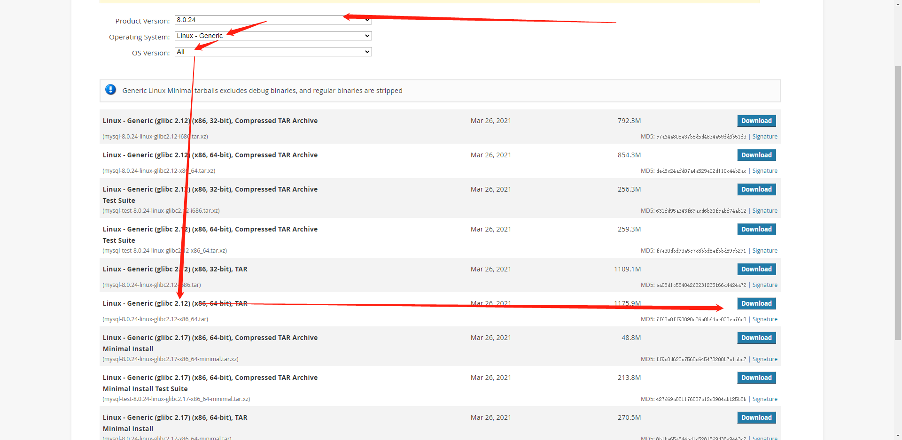

# 安装mysql8.0主从-GTID复制

## 一、创建mysql安装目录

```bash
 sudo mkdir /service
 cd /service/
```


## 二、下载数据库二进制安装包

```bash
wget https://cdn.mysql.com/archives/mysql-8.0/mysql-8.0.36-linux-glibc2.28-x86_64.tar

#使用迅雷下载会快点
```




## 三、解压并重命名、软连接

```bash
tar xf mysql-8.0.36-linux-glibc2.28-x86_64.tar
tar xf mysql-8.0.36-linux-glibc2.28-x86_64.tar.xz
mv mysql-8.0.36-linux-glibc2.28-x86_64 mysql-8.0.36
rm -rf mysql-*.tar*
ln -s mysql-8.0.36 mysql
```

## 四、添加环境变量

```bash
vim /etc/profile.d/mysqld.sh
export PATH=/service/mysql/bin:$PATH

source /etc/profile

#确认
mysql -V
```

## 五、卸载无用软件

```bash
apt-get  remove -y mariadb-libs
```

## 六、创建用户

```bash
groupadd -g 666 mysql
useradd mysql -u 666 -g 666 -s /sbin/nologin -M
```

## 七、创建数据库目录,binlog目录、对整个mysql授权

```bash
mkdir /service/mysql/data/
mkdir -p /service/mysql/binlog/
chown -R mysql:mysql mysql
chown -R mysql:mysql mysql-8.0.36
```

## 八、准备配置文件

### 1、node1

```bash
[mysqld]
# 连接层
## mysql最大连接数
max_connections=1000
## 连接错误最大尝试次数
max_connect_errors=999999
## 等待超时时间，主要针对非交互式等待超时时间
wait_timeout=600
## 交互式等待超时时间
interactive_timeout=3600
## 数据读超时时间
net_read_timeout=120
## 数据写超时时间
net_write_timeout=120
## 数据包传输允许的最大的数据包大小
max_allowed_packet=1000M

# server层
## 数据安全更新时间
sql_safe_updates=1
## 开启慢日志查询
slow_query_log=ON
## 指定慢日志存放路径
slow_query_log_file=/service/mysql/data/slow.log
## 慢日志判断时间
long_query_time=1
## 记录不走索引的sql语句
log_queries_not_using_indexes=true
## 在慢查询日志中，去记录没有使用索引的SQL语句的次数
log_throttle_queries_not_using_indexes=10
## 锁等待时间
lock_wait_timeout=60
## 表名是否区分大小写，1：不区分
lower_case_table_names=1
## 日志中的时间戳格式。可以设置为 SYSTEM 或 UTC。
log_timestamps=SYSTEM
## 每个客户端连接到 MySQL 时，执行的初始化语句。这里设置了每个连接的字符集为 utf8
init_connect="set names utf8"
## 指定 MySQL 可以执行 LOAD DATA INFILE、SELECT INTO OUTFILE 等文件操作时的文件存放目录。这项配置限制了 MySQL 只能在指定目录中进行这些操作，增强了安全性
secure-file-priv=/tmp
## 二进制日志的自动过期时间，单位为秒。2592000 秒表示 30 天。超过这个时间的二进制日志会被自动删除。
binlog_expire_logs_seconds=2592000
## 控制二进制日志的同步频率。1 表示每次事务提交时都会将二进制日志同步到磁盘，以确保数据安全性。
sync_binlog=1
## 启用二进制日志，并指定二进制日志文件的存放路径
log_bin=/service/mysql/binlog/mysql-bin
## 指定保存二进制日志索引文件的路径。该文件保存了所有二进制日志的列表。
log-bin-index=/service/mysql/binlog/mysql-bin.index
## 设置单个二进制日志文件的最大大小为 500 MB。达到这个大小时，MySQL 会生成一个新的日志文件。
max_binlog_size=500M
## 每次操作行级数据时，记录每一行的变更。这种格式适用于复制时能准确记录行的改变。
binlog_format=ROW

# 存储引擎层
## 设置事务隔离级别为 READ COMMITTED，即每个事务只能读取已经提交的数据，防止“脏读”（dirty reads）。
transaction-isolation="READ-COMMITTED"
## 控制事务提交时日志刷新的行为。0: 每秒写日志并刷新到磁盘，不保证持久性。1: 每次事务提交都会写日志并刷新到磁盘，保证持久性（最安全但性能较低）。2: 每次提交时将日志写入操作系统缓存，每秒刷新到磁盘。性能与安全性之间的折中。
innodb_flush_log_at_trx_commit=1
## 使用 O_DIRECT 方式进行文件 I/O 操作，直接从磁盘读写数据，绕过操作系统的缓存，减少双重缓存，提高性能。
innodb_flush_method=O_DIRECT
## InnoDB 缓冲池中“脏”页面的最大百分比。脏页面指修改后尚未写入磁盘的数据。当达到这个百分比时，InnoDB 会主动刷新脏数据到磁盘。
innodb_max_dirty_pages_pct=85
## InnoDB 可以打开的文件数上限。较大的值允许更多表文件同时打开，减少频繁打开/关闭文件的开销。
innodb_open_files=63000
## 启用时，MySQL 将所有死锁信息记录到错误日志中，便于排查死锁问题。
innodb_print_all_deadlocks=1
## 当 InnoDB 事务因超时而回滚时，回滚整个事务，而不仅仅是当前的语句。
innodb_rollback_on_timeout=ON
## 启用 InnoDB 的死锁检测机制。当发生死锁时，InnoDB 会自动检测并选择回滚其中一个事务。
innodb_deadlock_detect=ON

# 复制
## 启用 GTID 模式，使用全局事务标识符管理主从复制，保证每个事务在集群中的唯一性，简化主从切换。
gtid_mode=ON
## 强制 GTID 一致性，确保所有事务都可被 GTID 标识，以防止不支持 GTID 的语句（如 CREATE TEMPORARY TABLE）破坏一致性。
enforce_gtid_consistency=true
## 启用从服务器记录来自主服务器的更新到自己的二进制日志。这使得从服务器可以充当其他从服务器的主服务器。
log-slave-updates=1
## 指定服务器的唯一标识符，用于区分主服务器和从服务器，以及多台从服务器之间的区别。
server_id=41

user=mysql
basedir=/service/mysql
datadir=/service/mysql/data
socket=/tmp/mysql.sock

[client]
socket=/tmp/mysql.sock

[mysql]
prompt=db01 [\\d]>
socket=/tmp/mysql.sock
no-auto-rehash
```


### 2、node2

```bash
[mysqld]
# 连接层
## mysql最大连接数
max_connections=1000
## 连接错误最大尝试次数
max_connect_errors=999999
## 等待超时时间，主要针对非交互式等待超时时间
wait_timeout=600
## 交互式等待超时时间
interactive_timeout=3600
## 数据读超时时间
net_read_timeout=120
## 数据写超时时间
net_write_timeout=120
## 数据包传输允许的最大的数据包大小
max_allowed_packet=1000M

# server层
## 开启慢日志查询
slow_query_log=ON
## 指定慢日志存放路径
slow_query_log_file=/service/mysql/data/slow.log
## 慢日志判断时间
long_query_time=1
## 记录不走索引的sql语句
log_queries_not_using_indexes=true
## 在慢查询日志中，去记录没有使用索引的SQL语句的次数
log_throttle_queries_not_using_indexes=10
## 锁等待时间
lock_wait_timeout=60
## 表名是否区分大小写，1：不区分
lower_case_table_names=1
## 日志中的时间戳格式。可以设置为 SYSTEM 或 UTC。
log_timestamps=SYSTEM
## 每个客户端连接到 MySQL 时，执行的初始化语句。这里设置了每个连接的字符集为 utf8
init_connect="set names utf8"
## 指定 MySQL 可以执行 LOAD DATA INFILE、SELECT INTO OUTFILE 等文件操作时的文件存放目录。这项配置限制了 MySQL 只能在指定目录中进行这些操作，增强了安全性
secure-file-priv=/tmp
## 二进制日志的自动过期时间，单位为秒。2592000 秒表示 30 天。超过这个时间的二进制日志会被自动删除。
binlog_expire_logs_seconds=2592000
## 控制二进制日志的同步频率。1 表示每次事务提交时都会将二进制日志同步到磁盘，以确保数据安全性。
sync_binlog=1
## 启用二进制日志，并指定二进制日志文件的存放路径
log_bin=/service/mysql/binlog/mysql-bin
## 指定保存二进制日志索引文件的路径。该文件保存了所有二进制日志的列表。
log-bin-index=/service/mysql/binlog/mysql-bin.index
## 设置单个二进制日志文件的最大大小为 500 MB。达到这个大小时，MySQL 会生成一个新的日志文件。
max_binlog_size=500M
## 每次操作行级数据时，记录每一行的变更。这种格式适用于复制时能准确记录行的改变。
binlog_format=ROW

# 存储引擎层
## 设置事务隔离级别为 READ COMMITTED，即每个事务只能读取已经提交的数据，防止“脏读”（dirty reads）。
transaction-isolation="READ-COMMITTED"
## 控制事务提交时日志刷新的行为。0: 每秒写日志并刷新到磁盘，不保证持久性。1: 每次事务提交都会写日志并刷新到磁盘，保证持久性（最安全但性能较低）。2: 每次提交时将日志写入操作系统缓存，每秒刷新到磁盘。性能与安全性之间的折中。
innodb_flush_log_at_trx_commit=1
## 使用 O_DIRECT 方式进行文件 I/O 操作，直接从磁盘读写数据，绕过操作系统的缓存，减少双重缓存，提高性能。
innodb_flush_method=O_DIRECT
## InnoDB 缓冲池中“脏”页面的最大百分比。脏页面指修改后尚未写入磁盘的数据。当达到这个百分比时，InnoDB 会主动刷新脏数据到磁盘。
innodb_max_dirty_pages_pct=85
## InnoDB 可以打开的文件数上限。较大的值允许更多表文件同时打开，减少频繁打开/关闭文件的开销。
innodb_open_files=63000
## 启用时，MySQL 将所有死锁信息记录到错误日志中，便于排查死锁问题。
innodb_print_all_deadlocks=1
## 当 InnoDB 事务因超时而回滚时，回滚整个事务，而不仅仅是当前的语句。
innodb_rollback_on_timeout=ON
## 启用 InnoDB 的死锁检测机制。当发生死锁时，InnoDB 会自动检测并选择回滚其中一个事务。
innodb_deadlock_detect=ON

# 复制
## 启用 GTID 模式，使用全局事务标识符管理主从复制，保证每个事务在集群中的唯一性，简化主从切换。
gtid_mode=ON
## 强制 GTID 一致性，确保所有事务都可被 GTID 标识，以防止不支持 GTID 的语句（如 CREATE TEMPORARY TABLE）破坏一致性。
enforce_gtid_consistency=true
## 启用从服务器记录来自主服务器的更新到自己的二进制日志。这使得从服务器可以充当其他从服务器的主服务器。
log-slave-updates=1
## 指定服务器的唯一标识符，用于区分主服务器和从服务器，以及多台从服务器之间的区别。
server_id=42

user=mysql
basedir=/service/mysql
datadir=/service/mysql/data
socket=/tmp/mysql.sock

[client]
socket=/tmp/mysql.sock

[mysql]
prompt=db02 [\\d]>
socket=/tmp/mysql.sock
no-auto-rehash
```

## 九、下载异步IO接口

```bash
wget https://deb.sipwise.com/debian/pool/main/liba/libaio/libaio1_0.3.113-4_amd64.deb
dpkg -i libaio1_0.3.113-4_amd64.deb
```

## 十、初始化数据库

```bash
mysqld --initialize-insecure --user=mysql --basedir=/service/mysql  --datadir=/service/mysql/data 
```

## 十一、复制启动脚本

```bash
 cp /service/mysql/support-files/mysql.server /etc/init.d/mysqld
```

## 十二、修改脚本目录

```bash
sed -i 's#/usr/local#/service#g' /etc/init.d/mysqld /service/mysql/bin/mysqld_safe
```

## 十三、添加systemd管理

```bash
vim /lib/systemd/system/mysqld.service
[Unit]
Description=MySQL Server
Documentation=man:mysqld(8)
Documentation=https://dev.mysql.com/doc/refman/en/using-systemd.html
After=network.target
After=syslog.target
[Install]
WantedBy=multi-user.target
[Service]
User=mysql
Group=mysql
ExecStart=/service/mysql/bin/mysqld --defaults-file=/etc/my.cnf
LimitNOFILE = 5000

systemctl daemon-reload

systemctl enable --now mysqld.service
```

## 十四、构建主从

### 1、node1创建同步账户

```bash
create user repl@'172.16.0.%' identified WITH mysql_native_password by '123';
grant replication slave  on *.* to repl@'172.16.0.%';
flush privileges;
```

### 2、node2使用同步账户连接主库

```bash
#mysql5.7/mysql8.0
change master to 
master_host='172.16.0.25',
master_user='repl',
master_password='123',
MASTER_AUTO_POSITION=1;

start slave;


#mysql8.4
CHANGE REPLICATION SOURCE TO
SOURCE_HOST='192.168.80.51',
SOURCE_PORT=3306,
SOURCE_USER='repl',
SOURCE_PASSWORD='Root@3306',
SOURCE_auto_position=1; 

start replica;
```

**验证**

```bash
#mysql5.7/mysql8.0
show slave status\G

#mysql8.4
show replica status \G;
```


## 十五、配置用户名和密码（主库）

~~~bash
mysql -u root -p			#默认root用户密码为空，有多种方式重置root密码

alter user root@'localhost' identified by '123';
create user root@'%' identified by '123';

grant all privileges on *.* to root@'%' with grant option;


flush privileges;
~~~

## 十六、MHA高可用搭建

### 1、配置关键程序软连接（所有节点）

```bash
ln -s /service/mysql/bin/mysqlbinlog /usr/bin/mysqlbinlog
ln -s /service/mysql/bin/mysql /usr/bin/mysql
```

### 2、配置密钥对互相信任

**主库创建密钥对发给从库**

```bash
rm -rf /root/.ssh
ssh-keygen		交互式直接全部回车
cd /root/.ssh/
mv id_rsa.pub authorized_keys
scp  -r  /root/.ssh  172.16.0.26:/root
```

**验证**

```bash
master:
	ssh 172.16.0.26
node1:
    ssh 172.16.0.25
```

### 3、下载MHA软件

#### 1.下载

```bash
mha官网：https://code.google.com/archive/p/mysql-master-ha/
github下载地址：https://github.com/yoshinorim/mha4mysql-manager/wiki/Downloads

说明：
8.0的版本
	1.修改密码加密模式sha2--->native
	2.使用0.58的MHA版本
```

```bash
mha4mysql-node下载地址：https://github.com/yoshinorim/mha4mysql-node/releases/tag/v0.58

mha4mysql-manager下载地址：https://github.com/yoshinorim/mha4mysql-manager/releases/tag/v0.58
```

#### 2.所有节点安装Node软件依赖包

```bash
apt-get install libdbd-mysql-perl -y
dpkg -i mha4mysql-node_0.58-0_all.deb
```

#### 3.主库创建mha需要的用户

```bash
create user mha@'172.16.0.%' identified with mysql_native_password by 'mha';
grant all privileges on *.* to mha@'172.16.0.%';
flush privileges;
```

#### 4.slave2安装Manager

```bash
apt-get install -y libdbd-mysql-perl libconfig-tiny-perl liblog-dispatch-perl libparallel-forkmanager-perl
dpkg -i mha4mysql-manager_0.58-0_all.deb
```

#### 5.slave3准备配置文件

##### 1)创建配置文件目录

```bash
mkdir -p /etc/mha
```

##### 2)创建日志目录

```bash
mkdir -p /var/log/mha/app1
```

##### 3)编辑Mha配置文件

```bash
vim /etc/mha/app1.cnf
[server default]
manager_log=/var/log/mha/app1/manager
manager_workdir=/var/log/mha/app1
master_binlog_dir=/service/mysql/binlog
user=mha                     
password=mha                         
ping_interval=2
repl_password=1qaz@WSX
repl_user=repl
ssh_user=root
                           
[server1]                
hostname=172.16.0.25
port=3306                      
[server2]        
hostname=172.16.0.26
candidate_master=1
port=3306
[server3]
hostname=172.16.0.6
port=3306
```

##### 4)ssh互信检查

```bash
masterha_check_ssh  --conf=/etc/mha/app1.cnf
```

##### 5)修改脚本

> 修改前

```bash
# vi /usr/share/perl5/MHA/NodeUtil.pm

sub parse_mysql_major_version($) {
  my $str = shift;
  my $result = sprintf( '%03d%03d', $str =~ m/(\d+)/g );
  return $result;
}
```

> 修改后

```bash
sub parse_mysql_major_version($) {
  my $str = shift;
  $str =~ /(\d+)\.(\d+)/;
  my $strmajor = "$1.$2";
  my $result = sprintf( '%03d%03d', $strmajor =~ m/(\d+)/g );
  return $result;
}
```


##### 6)主从状态检查

```bash
masterha_check_repl  --conf=/etc/mha/app1.cnf
```

##### 7)开启

```bash
nohup masterha_manager --conf=/etc/mha/app1.cnf --remove_dead_master_conf --ignore_last_failover  < /dev/null> /var/log/mha/app1/manager.log 2>&1 &
```

##### 8)查看状态

```bash
masterha_check_status --conf=/etc/mha/app1.cnf
```

## 十七、VIP应用透明

### 1、编写脚本

```bash
vim /usr/local/bin/master_ip_failover
#!/usr/bin/env perl
 
use strict;
use warnings FATAL => 'all';
 
use Getopt::Long;
 
my (
    $command,          $ssh_user,        $orig_master_host, $orig_master_ip,
    $orig_master_port, $new_master_host, $new_master_ip,    $new_master_port
);
 
my $vip = '172.16.0.27/22';
my $key = '1';
my $ssh_start_vip = "/sbin/ifconfig eth0:$key $vip";
my $ssh_stop_vip = "/sbin/ifconfig eth0:$key down";
 
GetOptions(
    'command=s'          => \$command,
    'ssh_user=s'         => \$ssh_user,
    'orig_master_host=s' => \$orig_master_host,
    'orig_master_ip=s'   => \$orig_master_ip,
    'orig_master_port=i' => \$orig_master_port,
    'new_master_host=s'  => \$new_master_host,
    'new_master_ip=s'    => \$new_master_ip,
    'new_master_port=i'  => \$new_master_port,
);
 
exit &main();
 
sub main {
 
    print "\n\nIN SCRIPT TEST====$ssh_stop_vip==$ssh_start_vip===\n\n";
 
    if ( $command eq "stop" || $command eq "stopssh" ) {
 
        my $exit_code = 1;
        eval {
            print "Disabling the VIP on old master: $orig_master_host \n";
            &stop_vip();
            $exit_code = 0;
        };
        if ($@) {
            warn "Got Error: $@\n";
            exit $exit_code;
        }
        exit $exit_code;
    }
    elsif ( $command eq "start" ) {
 
        my $exit_code = 10;
        eval {
            print "Enabling the VIP - $vip on the new master - $new_master_host \n";
            &start_vip();
            $exit_code = 0;
        };
        if ($@) {
            warn $@;
            exit $exit_code;
        }
        exit $exit_code;
    }
    elsif ( $command eq "status" ) {
        print "Checking the Status of the script.. OK \n";
        exit 0;
    }
    else {
        &usage();
        exit 1;
    }
}
 
sub start_vip() {
    `ssh $ssh_user\@$new_master_host \" $ssh_start_vip \"`;
}
sub stop_vip() {
     return 0  unless  ($ssh_user);
    `ssh $ssh_user\@$orig_master_host \" $ssh_stop_vip \"`;
}
sub usage {
    print
    "Usage: master_ip_failover --command=start|stop|stopssh|status --orig_master_host=host --orig_master_ip=ip 
            --orig_master_port=port --new_master_host=host --new_master_ip=ip --new_master_port=port\n";
}
```

### 2、检查脚本，添加权限

```bash
注意：
[root@db03 ~]# dos2unix /usr/local/bin/master_ip_failover 
dos2unix: converting file /usr/local/bin/master_ip_failover to Unix format ...
[root@db03 ~]# chmod +x /usr/local/bin/master_ip_failover 
```

### 3、配置MHA脚本

```bash
vim /etc/mha/app1.cnf
master_ip_failover_script=/usr/local/bin/master_ip_failover

注意：/usr/local/bin/master_ip_failover，必须事先准备好
```

### 4、主库上（db01），手工生成第一个vip地址

```bash
ifconfig eth0:1 172.16.0.27/22
```

### 5、重启mha

```bash
masterha_stop --conf=/etc/mha/app1.cnf

nohup masterha_manager --conf=/etc/mha/app1.cnf --remove_dead_master_conf --ignore_last_failover < /dev/null > /var/log/mha/app1/manager.log 2>&1 &
```

### 6、查看mha状态

```bash
masterha_check_status --conf=/etc/mha/app1.cnf
```

## 十八、开启binlog_server数据补偿冗余

### 1、参数

```bash
binlogserver配置：
找一台额外的机器，必须要有5.6以上的版本，支持gtid并开启，我们直接用的第二个slave（db03）
vim /etc/mha/app1.cnf 
[binlog1]
no_master=1					#不参与选主
hostname=172.16.0.6
master_binlog_dir=/service/binlog_server/
```

### 2、创建目录并授权

```bash
mkdir /service/binlog_server/
chown -R mysql.mysql /service/binlog_server
```

### 3、拉取主库日志

**注意**

```bash
拉取日志的起点,需要按照目前从库的已经获取到的二进制日志点为起点
需要在主库查询位置点，不必从第一个开始
```

#### 1.查询主库当前日志点

```bash
mysql -uroot -p  -e "show slave status \G"|grep "Master_Log"
Enter password: 
              Master_Log_File: mysql-bin.000003
          Read_Master_Log_Pos: 196
        Relay_Master_Log_File: mysql-bin.000003
          Exec_Master_Log_Pos: 196
```

#### 2.确认当前mha状态

```bash
masterha_check_status --conf=/etc/mha/app1.cnf 
```

#### 3.拉取日志

```bash
cd /service/binlog_server

mysqlbinlog  -R --host=172.16.0.25 --user=mha --password=mha --raw  --stop-never mysql-bin.000002 &
```


### 4、重启mha

```bash
masterha_stop --conf=/etc/mha/app1.cnf

nohup masterha_manager --conf=/etc/mha/app1.cnf --remove_dead_master_conf --ignore_last_failover < /dev/null > /var/log/mha/app1/manager.log 2>&1 &
```

## 十九、mha钉钉告警

### 1、编写脚本

>vim /usr/local/bin/send_dingding_message

```bash
#!/bin/bash 

DB_ADDRESS=$(cat /var/log/mha/app1/manager.log | grep 'Master failover' | tail -1 | cut -d'(' -f2 | cut -d')' -f1)

function SendMessageToDingding(){ 
    Dingding_Url="https://oapi.dingtalk.com/xxxxxxx 这是你自己的钉钉机器人 Token" 
    # 发送钉钉消息
    curl "${Dingding_Url}" -H 'Content-Type: application/json' -d "
    {
        \"actionCard\": {
            \"title\": \"$1\", 
            \"text\": \"$2\", 
            \"hideAvatar\": \"0\", 
            \"btnOrientation\": \"0\", 
            \"btns\": [
                {
                    \"title\": \"$1\", 
                    \"actionURL\": \"\"
                }
            ]
        }, 
        \"msgtype\": \"actionCard\"
    }"
} 

Subject="内网数据库主库宕机啦~" 

Body="新主库：${DB_ADDRESS}"

SendMessageToDingding $Subject $Body
```

飞书

```bash
#!/bin/bash

DB_ADDRESS=$(cat /var/log/mha/app1/manager.log | grep 'Master failover' | tail -1 | cut -d'(' -f2 | cut -d')' -f1)

function SendMessageToFeishu(){
    Feishu_Url="https://open.feishu.cn/open-apis/bot/v2/hook/95ebf672-f5a4-4aaa-82e9-a734a51c30bb"
    curl -X POST "${Feishu_Url}" -H 'Content-Type: application/json' \
        -d "{
        \"msg_type\": \"text\",
        \"content\": {
            \"text\": \"MHA：内网数据库主库宕机,新主库：${1}\"
        }
        }"
}

SendMessageToFeishu ${DB_ADDRESS}
```


### 2、修改脚本格式

```bash
在linux环境里面用set ff命令修改

1. 查看文件的格式

:set ff命令

显示文件格式 fileformat=dos

2. 修改格式为unix然后保存退出

:set ff=unix
```

### 3、添加权限

```bash
chmod +x /usr/local/bin/send_dingding_message
```

### 4、编辑MHA配置文件

```bash
vim /etc/mha/app1.cnf
report_script=/usr/local/bin/send_dingding_message
```

### 5、重启MHA

```bash
masterha_stop --conf=/etc/mha/app1.cnf

nohup masterha_manager --conf=/etc/mha/app1.cnf --remove_dead_master_conf --ignore_last_failover < /dev/null > /var/log/mha/app1/manager.log 2>&1 &
```

## 二十、ProxySQL读写分离

### 1、介绍

```bash
ProxySQL是基于MySQL的一款开源的中间件的产品，是一个灵活的MySQL代理层，可以实现读写分离，支持 Query路由功能，支持动态指定某个SQL进行缓存，支持动态加载配置信息（无需重启 ProxySQL 服务），支持故障切换和SQL的过滤功能。 
相关 ProxySQL 的网站：
https://www.proxysql.com/
https://github.com/sysown/proxysql/wiki
```

### 2、安装

#### 1.下载proxySQL

```bash
https://proxysql.com/
https://github.com/sysown/proxysql/releases
https://github.com/sysown/proxysql/releases/download/
```

#### 2.安装

```bash
dpkg -i proxysql_2.7.0-dbg-ubuntu24_amd64.deb
```

### 3、操作

```bash
版本：sudo proxysql --version
启动：sudo service proxysql start
暂停：sudo service proxysql stop
重启：sudo service proxysql restart
状态：sudo service proxysql status
```

### 4、端口

```bash
客户端：6033端口
管理端：6032端口
```

### 5、配置文件

> 不推荐使用

```bash
/etc/proxysql.cnf
```

### 6、控制台及介绍

>上述之所以不推荐，是因为我们可以通过ProxySQL控制台在线修改配置，无需重启，立即生效。

#### 1.登录

```bash
mysql -uadmin -padmin -h127.0.0.1 -P6032 --prompt='Admin> ' --default-auth=mysql_native_password
```

#### 2.ProxySQL中管理结构自带的系统库

>在ProxySQL，6032端口共五个库： main、disk、stats 、monitor、stats_history

##### 1)main

```bash
mysql_servers: 后端可以连接 MySQL 服务器的列表 
	mysql_users:   配置后端数据库的账号和监控的账号。 
	mysql_query_rules: 指定 Query 路由到后端不同服务器的规则列表。
	mysql_replication_hostgroups : 节点分组配置信息
注： 表名以 runtime_开头的表示ProxySQL 当前运行的配置内容，不能直接修改。不带runtime_是下文图中Mem相关的配置。
```

##### 2)disk

```bash
持久化的磁盘的配置
```

##### 3)stats

```bash
统计信息的汇总
```

##### 4)monitor

```bash
监控的收集信息，比如数据库的健康状态等
```

##### 5)stats_history

```bash
ProxySQL 收集的有关其内部功能的历史指标
```

#### 3.ProxySQL管理接口的多层配置关系

##### 1)整套配置系统分为三大层

```bash
顶层   RUNTIME 
中间层 MEMORY  （主要修改的配置表）
持久层 DISK 和 CFG FILE 
```

```bash
RUNTIME ： 
	代表 ProxySQL 当前正在使用的配置，无法直接修改此配置，必须要从下一层 （MEM层）“load” 进来。 
	
MEMORY： 
	MEMORY 层上面连接 RUNTIME 层，下面disk持久层。这层可以在线操作 ProxySQL 配置，随便修改，不会影响生产环境。确认正常之后在加载达到RUNTIME和持久化的磁盘上。修改方法： insert、update、delete、select。
	
DISK和CONFIG FILE：
	持久化配置信息。重启时，可以从磁盘快速加载回来。不建议直接修改此配置文件，建议从上一层(MEM层)“SAVE”进来。
```

#### 4.在不同层次件移动配置

```bash
LOAD xxxx  TO RUNTIME;
SAVE xxxx  TO DISK;
```

>为了将配置持久化到磁盘或者应用到 runtime，在管理接口下有一系列管理命令来实现它们。

##### 1)user相关配置

```bash
##  MEM 加载到runtime
LOAD MYSQL USERS TO RUNTIME;

##  runtime 保存至 MEM
SAVE MYSQL USERS TO MEMORY;

## disk 加载到 MEM
LOAD MYSQL USERS FROM DISK;

## MEM  到 disk 
SAVE MYSQL USERS TO DISK;

## CFG 到 MEM
LOAD MYSQL USERS FROM CONFIG
```

##### 2)server 相关配置

```bash
##  MEM 加载到runtime
LOAD MYSQL SERVERS TO RUNTIME;

##  runtime 保存至 MEM
SAVE MYSQL SERVERS TO MEMORY;

## disk 加载到 MEM
LOAD MYSQL SERVERS FROM DISK;

## MEM  到 disk 
SAVE MYSQL SERVERS TO DISK;

## CFG 到 MEM
LOAD MYSQL SERVERS FROM CONFIG
```

##### 3)mysql query rules配置

```bash
##  MEM 加载到runtime
LOAD MYSQL QUERY RULES TO RUNTIME;

##  runtime 保存至 MEM
SAVE MYSQL QUERY RULES TO MEMORY;

## disk 加载到 MEM
LOAD MYSQL QUERY RULES FROM DISK;

## MEM  到 disk 
SAVE MYSQL QUERY RULES TO DISK;

## CFG 到 MEM
LOAD MYSQL QUERY RULES FROM CONFIG
```

##### 4)MySQL variables配置

```bash
##  MEM 加载到runtime
LOAD MYSQL VARIABLES TO RUNTIME;

##  runtime 保存至 MEM
SAVE MYSQL VARIABLES TO MEMORY;

## disk 加载到 MEM
LOAD MYSQL VARIABLES FROM DISK;

## MEM  到 disk 
SAVE MYSQL VARIABLES TO DISK;

## CFG 到 MEM
LOAD MYSQL VARIABLES FROM CONFIG
```

##### 5)总结

```bash
日常配置其实大部分时间在MEM配置，然后load到RUNTIME，然后SAVE到DIsk。cfg很少使用。
例如 ： 
load xxx to runtime;
save xxx to disk;
```

```bash
注意：
	只有load到 runtime 状态时才会验证配置。在保MEM或disk时，都不会发生任何警告或错误。当load到 runtime 时，如果出现错误，将恢复为之前保存得状态，这时可以去检查错误日志。
```

### 7、ProxySQL应用——基于SQL的读写分离

#### 1.从库设定read_only参数

```mysql
set global read_only=1;
set global super_read_only=1;
```

#### 2.在mysql_replication_hostgroup表中，配置读写组编号

##### 1)登录控制台

```bash
mysql -uadmin -padmin -h127.0.0.1 -P6032 --prompt='Admin> ' --default-auth=mysql_native_password
```

##### 2)配置读写组编号

```mysql
insert into 
mysql_replication_hostgroups 
(writer_hostgroup, reader_hostgroup, comment) 
values (10,20,'proxy');
```

##### 3)读取到runtime运行

```bash
load mysql servers to runtime;
```

##### 4)查看结果

```mysql
select * from main.mysql_replication_hostgroups\G
*************************** 1. row ***************************
writer_hostgroup: 10
reader_hostgroup: 20
      check_type: read_only
         comment: proxy
1 row in set (0.00 sec)
```

##### 5)确认后保存并永久生效

```bash
save mysql servers to disk;
```

##### 6)说明

```bash
ProxySQL 会根据server 的read_only 的取值将服务器进行分组。 read_only=0 的server，master被分到编号为10的写组，read_only=1 的server，slave则被分到编号20的读组。所以需要将从库设置：
set global read_only=1;
```

#### 3.添加主机当ProxySQL

##### 1)添加

```mysql
insert into mysql_servers(hostgroup_id,hostname,port) values (10,'172.16.0.25',3306);
insert into mysql_servers(hostgroup_id,hostname,port) values (20,'172.16.0.26',3306);
insert into mysql_servers(hostgroup_id,hostname,port) values (20,'172.16.0.6',3306);
```

##### 2)查看

```mysql
select * from main.mysql_servers;
+--------------+-------------+------+-----------+--------+--------+-------------+-----------------+---------------------+---------+----------------+---------+
| hostgroup_id | hostname    | port | gtid_port | status | weight | compression | max_connections | max_replication_lag | use_ssl | max_latency_ms | comment |
+--------------+-------------+------+-----------+--------+--------+-------------+-----------------+---------------------+---------+----------------+---------+
| 10           | 172.16.0.25 | 3306 | 0         | ONLINE | 1      | 0           | 1000            | 0                   | 0       | 0              |         |
| 20           | 172.16.0.26 | 3306 | 0         | ONLINE | 1      | 0           | 1000            | 0                   | 0       | 0              |         |
| 20           | 172.16.0.6  | 3306 | 0         | ONLINE | 1      | 0           | 1000            | 0                   | 0       | 0              |         |
+--------------+-------------+------+-----------+--------+--------+-------------+-----------------+---------------------+---------+----------------+---------+

```

##### 3)立即生效并永久生效

```mysql
load mysql servers to runtime;
save mysql servers to disk;
```

#### 4.创建监控用户，并开启监控

##### 1)主库创建监控用户

```mysql
create user monitor@'%' identified with mysql_native_password  by 'proxysqlmonitor';
grant replication client on *.* to monitor@'%';

flush privileges;
```

##### 2）ProxySQL修改variables表

```mysql
set mysql-monitor_username='monitor';
set mysql-monitor_password='proxysqlmonitor';
```

或者

```mysql
UPDATE global_variables SET variable_value='monitor'
WHERE variable_name='mysql-monitor_username';
UPDATE global_variables SET variable_value='proxysqlmonitor'
WHERE variable_name='mysql-monitor_password';
```

##### 3)立即并永久生效

```bash
load mysql variables to runtime;
save mysql variables to disk;
```

##### 4)查询监控日志

```mysql
select * from mysql_server_connect_log;
select * from mysql_server_ping_log; 
select * from mysql_server_read_only_log;
select * from mysql_server_replication_lag_log;
```

#### 5.配置应用用户

##### 1）主库创建应用账户

```mysql
create user mrobot@'%' identified with mysql_native_password  by 'root1qaz@WSX';
grant all on *.* to mrobot@'%';

flush privileges;
```

##### 2)ProxySQL添加应用账户

```mysql
insert into mysql_users(username,password,default_hostgroup) values('mrobot','root1qaz@WSX',10);
```

##### 3)保存并立即生效

```mysql
load mysql users to runtime;
save mysql users to disk;
```

> 早起版本要开启事务持续化

```mysql
update mysql_users set transaction_persistent=1 where username='root';
load mysql users to runtime;
save mysql users to disk;
```

#### 6.编写读写规则

##### 1)插入规则

```mysql
insert into mysql_query_rules(rule_id,active,match_pattern,destination_hostgroup,apply) values (1,1,'^select.*for update$',10,1);
insert into mysql_query_rules(rule_id,active,match_pattern,destination_hostgroup,apply) values (2,1,'^select',20,1);
```

##### 2)保存并立即生效

```mysql
load mysql query rules to runtime;
save mysql query rules to disk;
```

##### 3)注意

```bash
select … for update规则的rule_id必须要小于普通的select规则的rule_id，ProxySQL是根据rule_id的顺序进行规则匹配。
```

#### 7.测试读写分离

随便找台有mysql客户端的机器

##### 1)测试读操作

```bash
mysql -umrobot -proot1qaz@WSX -h 172.16.0.6 -P 6033 -e "select @@server_id;"
```

##### 2)测试写操作

```bash
mysql -umrobot -proot1qaz@WSX -h 172.16.0.6 -P 6033 -e "begin;select @@server_id;commit;"
```

## 二十一、数据库备份

### 1、备份策略

```bash
周日全备+增备+binlog日志
```

### 2、XBK工具安装

#### 1.安装Percona存储库

##### 1）下载deb文件

```bash
wget https://repo.percona.com/apt/percona-release_latest.$( lsb_release -sc )_all.deb
```

##### 2)安装

```bash
dpkg -i percona-release_latest.bionic_all.deb
```

#### 2.更新仓库信息

```bash
apt-get update
```

#### 3.安装

```bash
apt-get install percona-xtrabackup-80 -y
```

> 为了进行压缩备份，请安装qpress

```bash
apt-get install qpress
```

### 3、创建备份目录

```bash
mkdir -p /mysql_backup/bash.d
mkdir  /mysql_backup/xbk_backup
mkdir  /mysql_backup/xbk_backup_history
```

### 4、编写备份脚本

#### 1.备份服务器是mysql从库场景

```bash
#!/bin/bash
DB_HOST=localhost
DB_PORT=3306
DB_USER=root
DB_PASSWORD=123
DB_CFG=/etc/my.cnf
DB_EXPIRE=7
DB_BACKUP_DIR=/mysql_backup/xbk_backup
DB_BACKUP_HISTORY=/mysql_backup/xbk_backup_history
BACK_LOG=$DB_BACKUP_DIR/backup.log

function error_text(){
    echo "[ ERROR ] $@" >> ${BACK_LOG}
}

function ok_text(){
    echo "[ OK ] $@" >> ${BACK_LOG}
}


function check_service(){
  #检查数据库服务是否起来
  if [ $(systemctl status mysqld.service|grep running|wc -l) -ne 1 ]; then
      error_text "时间：$(date '+%Y-%m-%d %H:%m:%S') MySQL服务未启动"
      exit 1
  else
      ok_text "时间：$(date '+%Y-%m-%d %H:%m:%S') MySQL服务正常"
  fi
  #检查数据库是否能正常使用
  mysql -u${DB_USER} -h${DB_HOST} -P${DB_PORT} -p${DB_PASSWORD} -e 'show processlist' &>/dev/null
  if [ $? -eq 0 ]; then
      ok_text "时间：$(date '+%Y-%m-%d %H:%m:%S') MySQL连接正常"
  else
      error_text "时间：$(date '+%Y-%m-%d %H:%m:%S') MySQL连接失败"
      exit 1
  fi
}

function del_full(){
  # 如果之前的全备大于7天，进行备份历史留档，再重新备份,之所以加6是因为full本身算一天
  if [ $(find ${DB_BACKUP_DIR} -maxdepth 1 -mindepth 1 -type d -mtime +6 | grep full | wc -l) -ne 0 ]; then
      mv ${DB_BACKUP_DIR} ${DB_BACKUP_HISTORY}/xbk_backup_$(date '+%Y-%m-%d-%H%m%S')
      mkdir ${DB_BACKUP_DIR}
      ok_text "时间：$(date '+%Y-%m-%d %H:%m:%S') 由于full备份大于七天，已将备份归档，并清理备份目录"
      return 1
  else
      # 没有超过七天的备份
      return 0
  fi
}

function del_history(){
  # 历史留档大于60天的删除
  find ${DB_BACKUP_HISTORY} -maxdepth 1 -mindepth 1 -type d -mtime +59 -exec rm -rf {} \;
}


function db_full(){
  # 判断是否为第一次全备,如果是则进行全备
  if [ ! -d ${DB_BACKUP_DIR}/full ]; then
      xtrabackup --defaults-file=${DB_CFG} --user=${DB_USER} --password=${DB_PASSWORD} --backup --parallel=4 --target-dir=${DB_BACKUP_DIR}/full &>/dev/null
      if [ $? -ne 0 ]; then
          error_text "时间：$(date '+%Y-%m-%d %H:%m:%S') XBK全备失败"
          exit 1
      else
          ok_text "时间：$(date '+%Y-%m-%d %H:%m:%S') XBK全备成功"
          exit 1 #不让后边db_incre执行
      fi
  else
      # 如果有full,则判断是否存在时间大于7天
      del_full
      # 存在大于7天的备份，清理后重新备份
      if [ $? -eq 1 ]; then
      xtrabackup --defaults-file=${DB_CFG} --user=${DB_USER} --password=${DB_PASSWORD} --backup --parallel=4 --target-dir=${DB_BACKUP_DIR}/full &>/dev/null
          if [ $? -ne 0 ]; then
              error_text "时间：$(date '+%Y-%m-%d %H:%m:%S') XBK全备失败"
              exit 1
          else
              ok_text "时间：$(date '+%Y-%m-%d %H:%m:%S') XBK全备成功"
              exit 1
          fi
      fi
  fi
}

function db_incre(){
  # 先判断是否存在incre备份，如果有再判断时候存在大于7天的备份，然后再备份新的增量备份
  if [ $(ls ${DB_BACKUP_DIR} | grep incre | wc -l) -eq 0 ]; then
      # 第一次增量备份
      xtrabackup --defaults-file=${DB_CFG} --user=${DB_USER} --password=${DB_PASSWORD} --backup --parallel=4 --target-dir=${DB_BACKUP_DIR}/incre1 --incremental-basedir=${DB_BACKUP_DIR}/full &>/dev/null
      if [ $? -ne 0 ]; then
          error_text "时间：$(date '+%Y-%m-%d %H:%m:%S') XBK第1次增量备份失败"
          rm -rf ${DB_BACKUP_DIR}/incre1 &>/dev/null
          exit 1
      else
          ok_text "时间：$(date '+%Y-%m-%d %H:%m:%S') XBK第1次增量备份成功"
      fi
  else
      # 存在incre备份：
      local num=`expr $(ls ${DB_BACKUP_DIR} | grep incre | awk -F"incre" 'END{print $2}')`
      local tmp=$(( $num+1 ))
      xtrabackup --defaults-file=${DB_CFG} --user=${DB_USER} --password=${DB_PASSWORD} --backup --parallel=4 --target-dir=${DB_BACKUP_DIR}/incre$tmp --incremental-basedir=${DB_BACKUP_DIR}/incre$num &>/dev/null
      if [ $? -ne 0 ]; then
          error_text "时间：$(date '+%Y-%m-%d %H:%m:%S') XBK第${tmp}次增量备份失败"
          rm -rf ${DB_BACKUP_DIR}/incre${tmp} &>/dev/null
          exit 1
      else
          ok_text "时间：$(date '+%Y-%m-%d %H:%m:%S') XBK第${tmp}次增量备份成功"
      fi
  fi
}


# 名字：full,incre1,incre2,incre3,incre4
function db_backup(){
  db_full
  db_incre
}

function useage(){
        echo -e "\033[0m*******************************************************\033[0m"
        echo -e "\033[31m该脚本用于:MySQL XBK全备+增量备份                     \033[0m"
        echo -e "\033[34mUsage:                                                 \033[0m"
        echo -e "\033[35m    bash mysql.sh backup                              \033[0m"
        echo -e "\033[36mMySQL 脚本配置信息                                     \033[0m"
        echo -e "\033[32mMySQL IP: ${DB_HOST}                                     \033[0m"
        echo -e "\033[32mMySQL PORT: ${DB_PORT}                                   \033[0m"
        echo -e "\033[32mMySQL USER: ${DB_USER}                                   \033[0m"
        echo -e "\033[32mMySQL PASSWORD: ${DB_PASSWORD}                           \033[0m"
        echo -e "\033[32mMySQL LOG: ${BACK_LOG}                                   \033[0m"
        echo -e "\033[32mMySQL EXPIRE: ${DB_EXPIRE}day                          \033[0m"
        echo -e "\033[32mMySQL BACKUP DIR: ${DB_BACKUP_DIR}                       \033[0m"
        echo -e "\033[32mMySQL BACKUP HISTORY DIR: ${DB_BACKUP_HISTORY}         \033[0m"
        echo -e "\033[0m*******************************************************\033[0m"
}

case $1 in
  backup)
    useage
    check_service
    db_backup
    del_history
  ;;
  *)
    useage
  ;;
esac
```

配置定时任务

```bash
0 2 * * * /bin/bash /mysql_backup/bash.d/mysql-xbk.sh backup
```


#### 2.备份服务器不是mysql从库的场景

##### 1)从库备份脚本

```bash
#!/bin/bash
DB_HOST=localhost
DB_PORT=3306
DB_USER=root
DB_PASSWORD=123
DB_CFG=/etc/my.cnf
DB_BACKUP_DIR=/service/mysql_backup/xbk_backup
BACK_LOG=$DB_BACKUP_DIR/backup.log

BACKUP_HOST=192.168.0.100
BACKUP_PATH=/backup/mysql_backup/xbk_backup

function error_text(){
    echo "[ ERROR ] $@" >> ${BACK_LOG}
}

function ok_text(){
    echo "[ OK ] $@" >> ${BACK_LOG}
}


function check_service(){
  #检查数据库服务是否起来
  if [ $(systemctl status mysqld.service|grep running|wc -l) -ne 1 ]; then
      error_text "时间：$(date '+%Y-%m-%d %H:%m:%S') MySQL服务未启动"
      exit 1
  else
      ok_text "时间：$(date '+%Y-%m-%d %H:%m:%S') MySQL服务正常"
  fi
  #检查数据库是否能正常使用
  mysql -u${DB_USER} -h${DB_HOST} -P${DB_PORT} -p${DB_PASSWORD} -e 'show processlist' &>/dev/null
  if [ $? -eq 0 ]; then
      ok_text "时间：$(date '+%Y-%m-%d %H:%m:%S') MySQL连接正常"
  else
      error_text "时间：$(date '+%Y-%m-%d %H:%m:%S') MySQL连接失败"
      exit 1
  fi
}

function del_full(){
  # 如果之前的全备大于7天，进行备份历史留档，再重新备份,之所以加6是因为full本身算一天
  if [ $(find ${DB_BACKUP_DIR} -maxdepth 1 -mindepth 1 -type d -mtime +6 | grep full | wc -l) -ne 0 ]; then
      rm -rf ${DB_BACKUP_DIR}/*
      ok_text "时间：$(date '+%Y-%m-%d %H:%m:%S') 大于七天备份已经清理"
      return 1
  else
      # 没有超过七天的备份
      return 0
  fi
}

function db_full(){
  # 判断是否为第一次全备,如果是则进行全备
  if [ ! -d ${DB_BACKUP_DIR}/full ]; then
      xtrabackup --defaults-file=${DB_CFG} --user=${DB_USER} --password=${DB_PASSWORD} --backup --parallel=4 --target-dir=${DB_BACKUP_DIR}/full &>/dev/null
      if [ $? -ne 0 ]; then
          error_text "时间：$(date '+%Y-%m-%d %H:%m:%S') XBK全备失败"
          exit 1
      else
          ok_text "时间：$(date '+%Y-%m-%d %H:%m:%S') XBK全备成功"
          rsync_backup
          exit 1 #不让后边db_incre执行
      fi
  else
      # 如果有full,则判断是否存在时间大于7天
      del_full
      # 存在大于7天的备份，清理后重新备份
      if [ $? -eq 1 ]; then
      xtrabackup --defaults-file=${DB_CFG} --user=${DB_USER} --password=${DB_PASSWORD} --backup --parallel=4 --target-dir=${DB_BACKUP_DIR}/full &>/dev/null
          if [ $? -ne 0 ]; then
              error_text "时间：$(date '+%Y-%m-%d %H:%m:%S') XBK全备失败"
              exit 1
          else
              ok_text "时间：$(date '+%Y-%m-%d %H:%m:%S') XBK全备成功"
              rsync_backup
              exit 1
          fi
      fi
  fi
}

function db_incre(){
  # 先判断是否存在incre备份，如果有再判断时候存在大于7天的备份，然后再备份新的增量备份
  if [ $(ls ${DB_BACKUP_DIR} | grep incre | wc -l) -eq 0 ]; then
      # 第一次增量备份
      xtrabackup --defaults-file=${DB_CFG} --user=${DB_USER} --password=${DB_PASSWORD} --backup --parallel=4 --target-dir=${DB_BACKUP_DIR}/incre1 --incremental-basedir=${DB_BACKUP_DIR}/full &>/dev/null
      if [ $? -ne 0 ]; then
          error_text "时间：$(date '+%Y-%m-%d %H:%m:%S') XBK第1次增量备份失败"
          rm -rf ${DB_BACKUP_DIR}/incre1 &>/dev/null
          exit 1
      else
          ok_text "时间：$(date '+%Y-%m-%d %H:%m:%S') XBK第1次增量备份成功"
      fi
  else
      # 存在incre备份：
      local num=`expr $(ls ${DB_BACKUP_DIR} | grep incre | awk -F"incre" 'END{print $2}')`
      local tmp=$(( $num+1 ))
      xtrabackup --defaults-file=${DB_CFG} --user=${DB_USER} --password=${DB_PASSWORD} --backup --parallel=4 --target-dir=${DB_BACKUP_DIR}/incre$tmp --incremental-basedir=${DB_BACKUP_DIR}/incre$num &>/dev/null
      if [ $? -ne 0 ]; then
          error_text "时间：$(date '+%Y-%m-%d %H:%m:%S') XBK第${tmp}次增量备份失败"
          rm -rf ${DB_BACKUP_DIR}/incre${tmp} &>/dev/null
          exit 1
      else
          ok_text "时间：$(date '+%Y-%m-%d %H:%m:%S') XBK第${tmp}次增量备份成功"
      fi
  fi
}

function rsync_backup() {
  rsync -avz ${DB_BACKUP_DIR}/ root@${BACKUP_HOST}:${BACKUP_PATH}
}

# 名字：full,incre1,incre2,incre3,incre4
function db_backup(){
  db_full
  db_incre
}

function usage(){
        echo -e "\033[0m*******************************************************\033[0m"
        echo -e "\033[31m该脚本用于:MySQL XBK全备+增量备份                     \033[0m"
        echo -e "\033[34mUsage:                                                 \033[0m"
        echo -e "\033[35m    bash mysql.sh backup                              \033[0m"
        echo -e "\033[36mMySQL 脚本配置信息                                     \033[0m"
        echo -e "\033[32mMySQL IP: ${DB_HOST}                                     \033[0m"
        echo -e "\033[32mMySQL PORT: ${DB_PORT}                                   \033[0m"
        echo -e "\033[32mMySQL USER: ${DB_USER}                                   \033[0m"
        echo -e "\033[32mMySQL PASSWORD: ${DB_PASSWORD}                           \033[0m"
        echo -e "\033[32mMySQL LOG: ${BACK_LOG}                                   \033[0m"
        echo -e "\033[32mMySQL BACKUP DIR: ${DB_BACKUP_DIR}                       \033[0m"
        echo -e "\033[0m*******************************************************\033[0m"
}

case $1 in
  backup)
    usage
    check_service
    db_backup
    rsync_backup
  ;;
  *)
    usage
  ;;
esac
```

定时任务

```bash
0 0 * * * /bin/bash /service/mysql_backup/bash.d/node-backup.sh backup
```


##### 2)备份服务器备份脚本

```bash
#!/bin/bash
DB_BACKUP_DIR=/backup/mysql_backup/xbk_backup
DB_BACKUP_HISTORY=/backup/mysql_backup/xbk_backup_history
BACK_LOG=$DB_BACKUP_DIR/backup.log

function error_text(){
    echo "[ ERROR ] $@" >> ${BACK_LOG}
}

function ok_text(){
    echo "[ OK ] $@" >> ${BACK_LOG}
}

function del_full(){
  # 如果之前的全备大于7天，进行备份历史留档，再重新备份,之所以加6是因为full本身算一天
  if [ $(find ${DB_BACKUP_DIR} -maxdepth 1 -mindepth 1 -type d -mtime +6 | grep full | wc -l) -ne 0 ]; then
      mv ${DB_BACKUP_DIR} ${DB_BACKUP_HISTORY}/xbk_backup_$(date '+%Y-%m-%d-%H%m%S')
      mkdir ${DB_BACKUP_DIR}
      ok_text "时间：$(date '+%Y-%m-%d %H:%m:%S') 由于full备份大于七天，已将备份归档，并清理备份目录"
      return 1
  else
      # 没有超过七天的备份
      return 0
  fi
}

function del_history(){
  # 历史留档大于60天的删除
  find ${DB_BACKUP_HISTORY} -maxdepth 1 -mindepth 1 -type d -mtime +59 -exec rm -rf {} \;
}

function usage(){
        echo -e "\033[0m*******************************************************\033[0m"
        echo -e "\033[31m该脚本用于:MySQL XBK全备+增量备份                     \033[0m"
        echo -e "\033[34mUsage:                                                 \033[0m"
        echo -e "\033[35m    bash mysql.sh backup                              \033[0m"
        echo -e "\033[36mMySQL 脚本配置信息                                     \033[0m"
        echo -e "\033[32mMySQL LOG: ${BACK_LOG}                                   \033[0m"
        echo -e "\033[32mMySQL BACKUP DIR: ${DB_BACKUP_DIR}                       \033[0m"
        echo -e "\033[32mMySQL BACKUP HISTORY DIR: ${DB_BACKUP_HISTORY}         \033[0m"
        echo -e "\033[0m*******************************************************\033[0m"
}

case $1 in
  backup)
    usage
    del_full
    del_history
  ;;
  *)
    usage
  ;;
esac
```

定时任务

```bash
0 7 * * * /bin/bash /backup/mysql_backup/bash.d/delete-old-backup.sh backup
```

