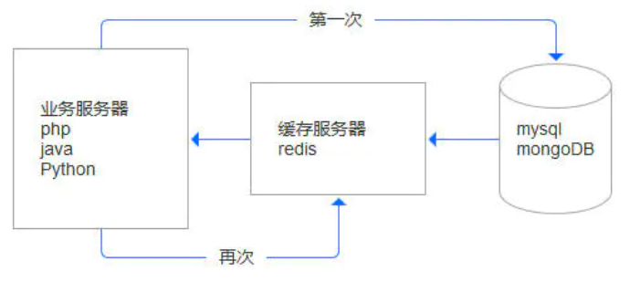
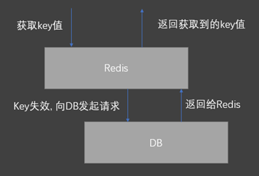

# Redis简介

>Redis是一款开源的，ANSI C语言编写的，高级键值(key-value)缓存和支持永久存储NoSQL数据库产品。Redis采用内存(In-Memory)数据集(DataSet) 。支持多种数据类型。运行于大多数POSIX系统，如Linux、*BSD、OSX等。不支持windows。



## 一、Redis的特性

```bash
1、基于内存，性能高效
2、支持分布式，理论上可以无限扩展
3、key-value存储系统
4、开源的使用ANSI C语言编写、遵守BSD协议、支持网络、可基于内存亦可持久化的日志
```


## 二、Redis的特点

```bash
1、C/S通讯模型
2、单进程单线程模型
3、数据类型丰富：Redis具有丰富的数据类型，可以适用于各种场景。
4、操作具有原子性
5、持久化：支持落盘动作。防止数据丢失
6、高并发高速读写
7、支持高可用：Redis支持两种高可用集群方式
8、支持事物：Redis也支持类似于MySQL数据库那样的事务。
9、消息队列、消息订阅：　Redis的列表类型键可以用来实现队列，并且支持阻塞式读取，可以很容易的实现一个高性能的优先队列。同时在更高层面上，Redis还支持"发布/订阅"的消息模式，可以基于此构建一个聊天系统。
10、4多种内存分配及回收策略：Redis可以通过 maxmemory 参数来限制最大可用内存，主要为了避免Redis内存超过操作系统内存，从而导致服务器响应变慢甚至死机的情况。而回收策略主要是删除过期的key以及内存达到 maxmemory 后的淘汰机制。
```


## 三、Redis的应用场景

```bash
Redis 的应用场景包括：缓存系统（“热点”数据：高频读、低频写）、计数器、消息队列系统、排行榜、社交网络和实时系统。
```


## 四、Redis的数据类型及主要特性

>Redis提供的数据类型主要分为5种自有类型和一种自定义类型，这5种自有类型包括：String类型、哈希类型、列表类型、集合类型和顺序集合类型。


### 1、String类型：

>它是一个二进制安全的字符串，意味着它不仅能够存储字符串、还能存储图片、视频等多种类型, 最大长度支持512M。

**操作命令**

```bash
GET/MGET
SET/SETEX/MSET/MSETNX
INCR/DECR
GETSET
DEL
```


### 2、哈希类型

>该类型是由field和关联的value组成的map。其中，field和value都是字符串类型的。

```bash
LPUSH/LPUSHX/LPOP/RPUSH/RPUSHX/RPOP/LINSERT/LSET
LINDEX/LRANGE
LLEN/LTRIM
```


### 3、列表类型

>该类型是一个插入顺序排序的字符串元素集合, 基于双链表实现。

List的操作命令如下：

```bash
LPUSH/LPUSHX/LPOP/RPUSH/RPUSHX/RPOP/LINSERT/LSET
LINDEX/LRANGE
LLEN/LTRIM
```


### 4、集合类型

>Set类型是一种无顺序集合, 它和List类型最大的区别是：集合中的元素没有顺序, 且元素是唯一的。

> Set类型的底层是通过哈希表实现的，其操作命令为：

```bash
SADD/SPOP/SMOVE/SCARD
SINTER/SDIFF/SDIFFSTORE/SUNION
```

>Set类型主要应用于：在某些场景，如社交场景中，通过交集、并集和差集运算，通过Set类型可以非常方便地查找共同好友、共同关注和共同偏好等社交关系。


### 5、顺序集合类型

> ZSet是一种有序集合类型，每个元素都会关联一个double类型的分数权值，通过这个权值来为集合中的成员进行从小到大的排序。与Set类型一样，其底层也是通过哈希表实现的。

ZSet命令：

```bash
ZADD/ZPOP/ZMOVE/ZCARD/ZCOUNT
ZINTER/ZDIFF/ZDIFFSTORE/ZUNION
```


## 五、Redis常见问题解析

### 1、缓存穿透

#### 1）概念

>在Redis获取某一key时, 由于key不存在, 缓存不起作⽤，而必须向DB发起一次请求的行为, 称为“Redis击穿”。流量⼤时db会挂掉 。




#### 2）原因

```bash
第一次访问
恶意访问不存在的key
Key过期
```


#### 3）规避方案

```bash
1.服务器启动时, 提前写入
2.规范key的命名, 通过中间件拦截（采⽤布隆过滤器, 使⽤⼀个⾜够⼤的bitmap, ⽤于存储可能访问的key, 不存在的key直接被过滤;）
3.对某些高频访问的Key，设置合理的TTL或永不过期
```


### 2、缓存雪崩

#### 1）概念

```bash
	1、Redis缓存层由于某种原因宕机后，所有的请求会涌向存储层，短时间内的高并发请求可能会导致存储层挂机，称之为“Redis雪崩”。
	2、⼤量的key设置了相同的过期时间, 导致在缓存同⼀时刻全部失败, 造成瞬时db请求量⼤, 压⼒骤增, 引起雪崩
```


#### 2）规避方案

```bash
1、使用Redis集群
2、限流
3、可以给缓存设置过期时间加上⼀个随机值时间, 使得每个key的过期时间分布开来, 不会集中在同 ⼀时刻失效
```


### 3、缓存击穿

#### 1）概念

```bash
	⼀个存在的key, 在缓存过期的⼀刻, 同时有⼤量的请求, 这些请求都会击穿到DB, 造成瞬时db请求量⼤, 压 ⼒骤增
```


#### 2）规避方案

```bash
	在访问key之前, 采⽤SETNX(set if not exists) 来设置另⼀个短期key来锁住当前key的访问, 访问结束再删除该短期key
```


