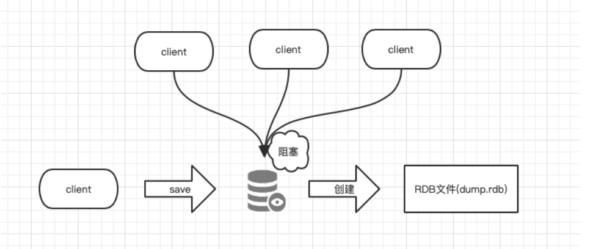
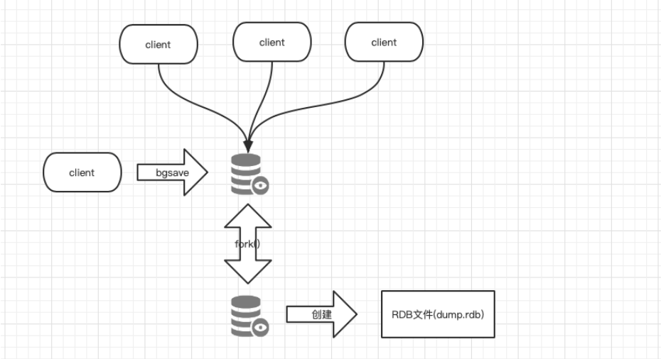
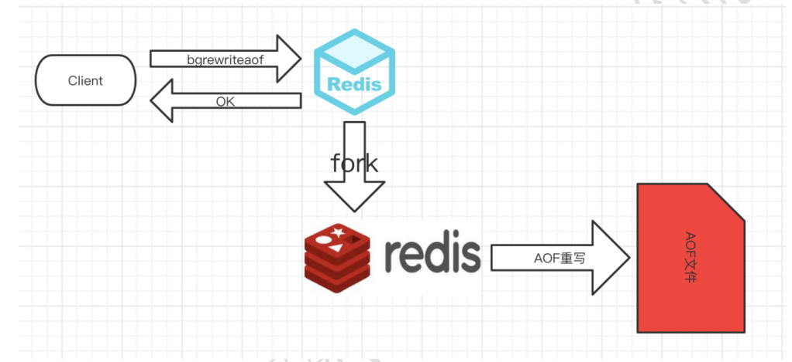
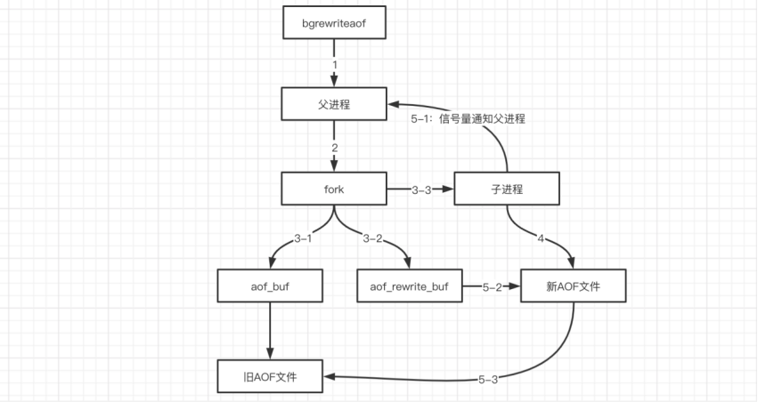

**Redis面临的数据安全问题**

```bash
	Redis是一个缓存中间件，它的最大特点是使用内存从而使其性能强悍。但是使用内存的方式有一个致命的特点就是数据没办法持久化保存。然而Redis持久化存储有两种持久化方案，RDB(Redis DataBase)和 AOF(Append-Only File)。其中RDB是将内存中的数据进行快照存储到磁盘，AOF则为可回放的命令日志记录redis内的所有操作。它们各有特点也相互独立。Redis4之后支持RDB-AOF混合持久化的方式，结合了两者的优点，可以通过 aof-use-rdb-preamble 配置项可以打开混合开关。
```

# RDB：快照持久化

## 一、原理

```bash
	RDB(Redis DataBase)是将Redis内存中的数据进行Snaptshot快照存储在磁盘内，是Redis的默认持久化方案。使用RDB持久化默认有三种策略，该持久化策略在redis.conf中可配置，会以一段时间内有指定次数据修改的规则触发快照动作，快照文件名为dump.rdb，该文件默认使用LZF压缩算法 。每当Redis服务重启的时候会从该文件中加载数据进内存。
```


## 二、save和bgsave

```bash
	RDB持久化除了可以根据配置中的策略触发，也可以手动触发，使用save和bgsave命令即可。这两个命令的区别的save会阻塞服务器进程，在进行save的过程中，服务器不能处理任何请求，而bgsave会通过一个子进程在后台处理rdb持久化。事实上save和bgsave调用的都是rdbSave函数，因此Redis不允许save和bgsave同时运行，这也是为了避免出现竞争导致rdb文件数据不准确。
```

```bash
	bgsave操作使用CopyOnWrite机制进行写时复制，是由一个子进程将内存中的最新数据遍历写入临时文件，此时父进程仍旧处理客户端的操作，当子进程操作完毕后再将该临时文件重命名为dump.rdb替换掉原来的dump.rdb文件，因此无论bgsave是否成功，dump.rdb都不会受到影响。
```

```bash
	另外在主从全量同步、debug reload以及shutdown的情况下也会触发RDB数据持久化。
```

### 1、save原理图




### 2、bgsave原理图



### 3、save与bgsave对比

| 命令     | save             | bgsave               |
| -------- | ---------------- | -------------------- |
| IO类型   | 同步             | 异步                 |
| 是否阻塞 | 是               | 否（阻塞发生在fork） |
| 有点     | 不会消耗额外内存 | 不阻塞客户端命令     |
| 缺点     | 阻塞客户端命令   | 创建fork，消耗内存   |


## 三、RDB优点

### 1、及时点紧凑文件，适用于备份

```bash
	RDB是一种表示某个即时点的Redis数据的紧凑文件。RDB文件适合用于备份。例如，你可能想要每小时归档最近24小时的RDB文件，每天保存近30天的RDB快照。这允许你很容易的恢复不同版本的数据集以容灾。
```


### 2、适合灾备恢复，可远程传输

```bash
	RDB非常适合于灾难恢复，作为一个紧凑的单一文件，可以被传输到远程的数据中心。
```


### 3、子进程进行复制任务，不影响父进程

```bash
	RDB最大化了Redis的性能，因为Redis父进程持久化时唯一需要做的是启动(fork)一个子进程，由子进程完成所有剩余工作。父进程实例不需要执行像磁盘IO这样的操作。
```


### 4、数据保存读写快

```bash
	RDB在重启保存了大数据集的实例时比AOF要快。
```


## 四、RDB缺点

### 1、容易数据丢失

```bash
	当你需要在Redis停止工作(例如停电)时最小化数据丢失，RDB可能不太好。你可以配置不同的保存点(save point)来保存RDB文件(例如，至少5分钟和对数据集100次写之后，但是你可以有多个保存点)。然而，你通常每隔5分钟或更久创建一个RDB快照，所以一旦Redis因为任何原因没有正确关闭而停止工作，你就得做好最近几分钟数据丢失的准备了。
```


### 2、大数据量RDB导致服务停止几秒

```bash
	RDB需要经常调用fork()子进程来持久化到磁盘。如果数据集很大的话，fork()比较耗时，结果就是，当数据集非常大并且CPU性能不够强大的话，Redis会停止服务客户端几毫秒甚至一秒。AOF也需要fork()，但是你可以调整多久频率重写日志而不会有损(trade-off)持久性(durability)。
```


**总结**

```bash
优点：速度快，适合于用作备份，主从复制也是基于RDB持久化功能实现的。
缺点：会有数据丢失、导致服务停止几秒
```


## 五、RDB相关配置

### 1、RDB触发机制

```bash
# 格式：save <seconds> <changes>

#   save ""				#关闭该规则
save 900 1				#900秒内至少有1个key被改变则做一次快照
save 300 10				#300秒内至少有300个key被改变则做一次快照
save 60 10000			#300秒内至少有300个key被改变则做一次快照
```


### 2、设置持久化文件名

```bash
dbfilename  dump.rdb
#rdb持久化存储数据库文件名，默认为dump.rdb
```


### 3、bgsave出错时动作

```bash
stop-write-on-bgsave-error yes 
#yes代表当使用bgsave命令持久化出错时候停止写RDB快照文件,no表明忽略错误继续写文件。
```


### 4、RDB文件检查

```bash
rdbchecksum yes
#在写入文件和读取文件时是否开启rdb文件检查，检查是否有无损坏，如果在启动是检查发现损坏，则停止启动。
```


### 5、RDB文件存放目录

```bash
dir "/etc/redis"
#数据文件存放目录，rdb快照文件和aof文件都会存放至该目录，请确保有写权限
```


### 6、RDB压缩

```bash
rdbcompression yes
#是否开启RDB文件压缩，该功能可以节约磁盘空间
```


## 六、RDB相关操作

### 1、停止备份

```bash
在配置文件中就设置save ""或在命令行中 config set save ""。
```


### 2、手动开始备份

```bash
save：会立即生成dump.rdb，但是会阻塞往redis内存中写入数据。
bgsave：后台异步备份。
```

>如果是使用flushdb命令，会把之前的快照更新成当前的空状态，所以执行了flushdb后更新的快照是没有数据的。


# AOF (append-only log file) 

## 一、原理（可以理解为数据库binlog）

```bash
	AOF(Append-Only File)记录Redis中每次的写命令，类似mysql中的binlog，服务重启时会重新执行AOF中的命令将数据恢复到内存中，RDB(按策略持久化)持久化方式记录的粒度不如AOF(记录每条写命令)，因此很多生产环境都是开启AOF持久化。AOF中记录了操作和数据，在日志文件中追加完成后才会将内存中的数据进行变更。
```


## 二、过程

```bash
1. 客户端的请求写命令会被append追加到AOF缓冲区内；
2. AOF缓冲区根据AOF持久化策略[always,everysec,no]将操作sync同步到磁盘的AOF文件中；
3. AOF文件大小超过重写策略或手动重写时，会对AOF文件rewrite重写，压缩AOF文件容量；
4. Redis服务重启时，会重新load加载AOF文件中的写操作达到数据恢复的目的；
```


## 三、AOF相关配置

>开启了AOF之后，RDB就默认不使用了。使用下面的配置开启AOF以及策略。(如果使用AOF，推荐选择always方式持久化，否则在高并发场景下，每秒钟会有几万甚至百万条请求，如果使用everysec的方式的话，万一服务器挂了那几万条数据就丢失了)。


### 1、开启AOF

```bash
#开启AOF持久化
appendonly yes
```


### 2、指定AOF文件名

```bash
#AOF文件名
appendfilename "appendonly.aof"
```


### 3、AOF文件路径

```bash
#AOF文件存储路径 与RDB是同一个参数
dir "/opt/app/redis6/data"
```


### 4、AOF记录策略

```bash
#AOF策略，一般都是选择第一种[always:每个命令都记录],[everysec:每秒记录一次],[no:看机器的心情高兴了就记录]
appendfsync always
#appendfsync everysec
#appendfsync no
```


### 5、AOF重写策略

```bash
#aof文件大小比起上次重写时的大小,增长100%(配置可以大于100%)时,触发重写。[假如上次重写后大小为10MB，当AOF文件达到20MB时也会再次触发重写，以此类推]
auto-aof-rewrite-percentage 100 
 
#aof文件大小超过64MB时,触发重写
auto-aof-rewrite-min-size 64mb 
```


### 6、AOF同异步写入策略

```bash
#是否在后台写时同步单写，默认值no(表示需要同步).这里的后台写，表示后台正在重写文件(包括bgsave和bgrewriteaof.bgrewriteaof网上很多资料都没有涉及到。其实关掉bgsave之后，主要的即是aof重写文件了).no表示新的主进程的set操作会被阻塞掉，而yes表示新的主进程的set不会被阻塞，待整个后台写完成之后再将这部分set操作同步到aof文件中。但这可能会存在数据丢失的风险(机率很小)，如果对性能有要求，可以设置为yes，仅在后台写时会异步处理命令.

no-appendfsync-on-rewrite no
```


### 7、AOF恢复遇错

```bash
# 指redis在恢复时，会忽略最后一条可能存在问题的指令。默认值yes。即在aof写入时，可能存在指令写错的问题(突然断电，写了一半)，这种情况下，yes会log并继续，而no会直接恢复失败.
aof-load-truncated
```


## 四、AOF持久化策略

>AOF分别有三种备份策略，分别是[always:每个命令都记录],[everysec:每秒记录一次],[no:看机器的心情高兴了就记录]，针对这三种策略给出如下说明。


### 1、策略说明

| 策略     | 说明                            | 优点       |
| -------- | ------------------------------- | ---------- |
| always   | 每次执行，都会持久化到AOF文件中 | 不丢失数据 |
| everysec | 每秒持久化一次                  | 减少IO     |
| no       | 根据服务器性能持久化            | 全自动     |


### 2、策略抉择

| 命令 | Always     | Everysec              | no             |
| ---- | ---------- | --------------------- | -------------- |
| 优点 | 不丢失数据 | 每秒一次fsync，减少IO | 不用管，全自动 |
| 缺点 | IO开销大   | 丢1秒钟的数据         | 不可控         |


## 五、AOF重写

> AOF持久化机制记录每个写命令，当服务重启的时候会复现AOF文件中的所有命令，会消耗太多的资源且重启很慢。因此为了避免AOF文件中的写命令太多文件太大，Redis引入了AOF的重写机制来压缩AOF文件体积。AOF文件重写是把Redis进程内的数据转化为写命令同步到新AOF文件的过程。

### 1、AOF重写配置

| 配置名                      | 含义                                  |
| --------------------------- | ------------------------------------- |
| appendonly                  | 开启AOF持久化功能                     |
| auto-aof-rewrite-min-size   | 触发重写的最小尺寸                    |
| auto-aof-rewrite-percentage | AOF文件增长率                         |
| aof_current_size            | AOF当前尺寸                           |
| aof_base_size               | AOF上次启动和重写的尺寸（单位：字节） |

### 2、AOF重写触发机制

```bash
根据配置，AOF持久化触发机制如下：
1.aof_current_size > auto-aof-rewrite-min-size
2.(aof_current_size - aof_base_size) / aof_base_size > auto-aof-rewrite-percentage
```


### 3、AOF重写流程





# RDB与AOF抉择

## 一、RDB与AOF比较

| 命令       | RDB    | AOF                                |
| ---------- | ------ | ---------------------------------- |
| 启动优先级 | 低     | 高                                 |
| 体积       | 小     | 大                                 |
| 恢复速度   | 快     | 慢                                 |
| 数据安全性 | 丢数据 | 根据策略的不同，丢数据的情况也不同 |
| 轻重       | 重     | 轻                                 |

## 二、RDB与AOF之间的优劣势

### 1、RDB的优点

>1、压缩后的二进制文件，适用于备份、全量复制及灾难恢复。

> 2、RDB恢复数据性能优于AOF方式。


### 2、RDB的缺点

> 1、无法做到实时持久化，每次都要创建子进程，频繁操作成本过高

> 2、 保存后的二进制文件，不同版本直接存在兼容性问题


### 3、AOF的优点

> 1、以文本形式保存，易读

> 2、记录写操作保证数据不丢失


### 4、AOF的缺点

> 1、存储所有写操作命令，且文件为文本格式保存，未经压缩，文件体积高。

> 2、恢复数据时重放AOF中所有代码，恢复性能弱于RDB方式。


# AOF与RDB混合

```bash
	看了上面的RDB和AOF的介绍后，我们可以发现，使用RDB持久化会有数据丢失的风险，但是恢复速度快，而使用AOF持久化可以保证数据完整性，但恢复数据的时候会很慢。于是从Redis4之后新增了混合AOF和RDB的模式，先使用RDB进行快照存储，然后使用AOF持久化记录所有的写操作，当重写策略满足或手动触发重写的时候，将最新的数据存储为新的RDB记录。这样的话，重启服务的时候会从RDB何AOF两部分恢复数据，即保证了数据完整性，又提高了恢复的性能。

	开启混合模式后，每当bgrewriteaof命令之后会在AOF文件中以RDB格式写入当前最新的数据，之后的新的写操作继续以AOF的追加形式追加写命令。当redis重启的时候，加载 aof 文件进行恢复数据：先加载 rdb 的部分再加载剩余的 aof部分。
```

## 一、开启混合配置

```bash
# 修改下面的参数即可开启AOF，RDB混合持久化
aof-use-rdb-preamble yes
```


>​	开启混合持久化模式后，重写之后的aof文件里和rdb一样存储二进制的快照数据，继续往redis中进行写操作，后续操作在aof中仍然是以命令的方式追加。因此重写后aof文件由两部分组成，一部分是类似rdb的二进制快照，另一部分是追加的命令文本。

