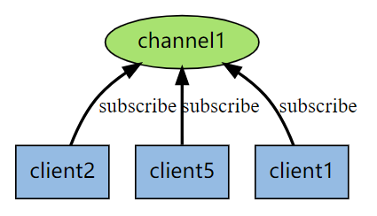
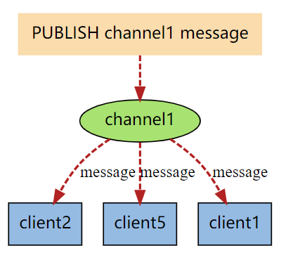
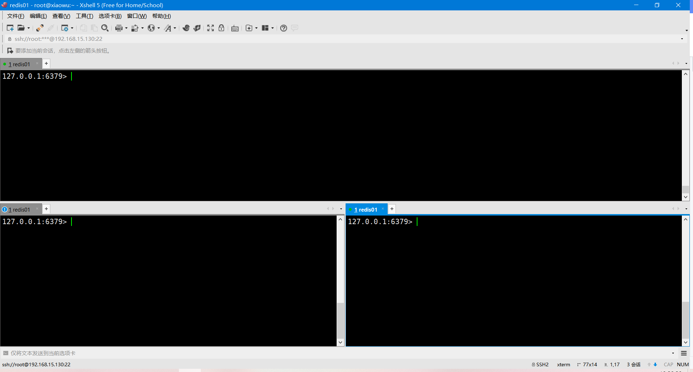
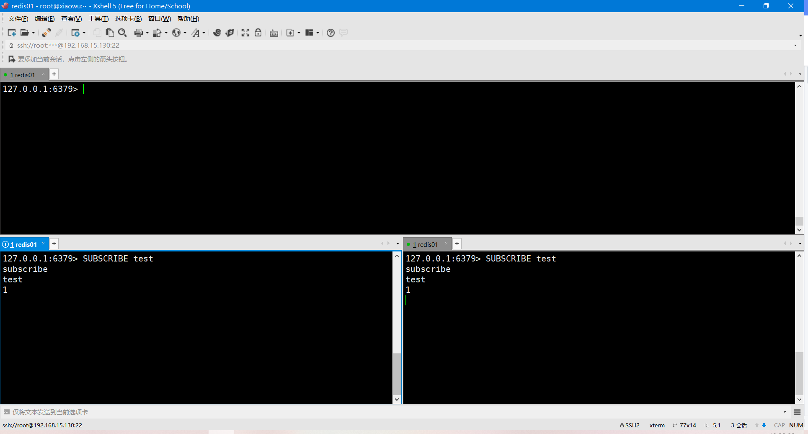
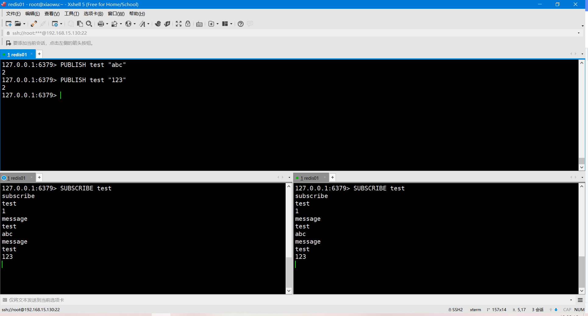

# 订阅与发布

>Redis 通过 [PUBLISH](http://redis.readthedocs.org/en/latest/pub_sub/publish.html#publish) 、 [SUBSCRIBE](http://redis.readthedocs.org/en/latest/pub_sub/subscribe.html#subscribe) 等命令实现了订阅与发布模式， 这个功能提供两种信息机制， 分别是订阅/发布到频道和订阅/发布到模式

## 一、角色划分

>在Redis订阅与发布中有以下几种角色：发布者、订阅者以及频道。

### 1、发布者

>发布者最主要的工作就是将信息发布到频道中。

### 2、订阅者/消费者

>订阅者最主要的功能是接收并消费频道中的订阅信息

### 3、频道

>频道最主要的功能是存储发布者发布的信息，然后分别发给每一个消费者。


## 二、过程概述

### 1、SUBSCRIBE：订阅

>Redis 的 [SUBSCRIBE](http://redis.readthedocs.org/en/latest/pub_sub/subscribe.html#subscribe) 命令可以让客户端订阅任意数量的频道， 每当有新信息发送到被订阅的频道时， 信息就会被发送给所有订阅指定频道的客户端。

>下图展示了频道 `channel1` ， 以及订阅这个频道的三个客户端 —— `client2` 、 `client5` 和 `client1` 之间的关系：



### 2、PUBLISH：发布

>当有新消息通过 [PUBLISH](http://redis.readthedocs.org/en/latest/pub_sub/publish.html#publish) 命令发送给频道 `channel1` 时， 这个消息就会被发送给订阅它的三个客户端：



## 三、使用

### 1、准备角色

> 打开三个窗口，一个窗口为发布者，两个窗口为订阅者。




### 2、SUBSCRIBE：订阅者订阅频道

```bash
127.0.0.1:6379> SUBSCRIBE test
```



### 3、PUBLISH：发布者发布消息

> 发布的同时订阅者收到消息

```bash
127.0.0.1:6379> PUBLISH test "abc"
2
127.0.0.1:6379> PUBLISH test "123"
2
```

