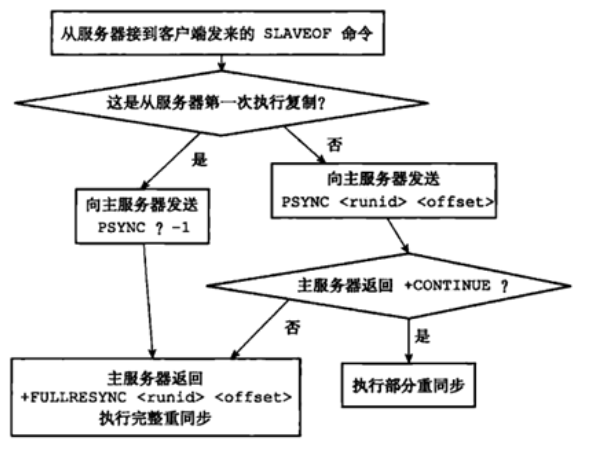

# Redis集群

```bash
	由于单机Redis存储能力受单机限制，以及无法实现读写操作的负载均衡和读写分离，无法保证高可用。本篇就来介绍 Redis 集群搭建方案及实现原理，实现Redis对数据的冗余备份，从而保证数据和服务的高可用。主从复制是哨兵和集群的基石，因此我们循序渐进，由浅入深一层层的将Redis高可用方案抽丝剥茧展示在大家面前。
```


# 主从复制

## 一、主从复制概述

### 1、简介

```bash
	主从复制，是指将一台Redis服务器的数据，复制到其他的Redis服务器。前者称为主节点(master)，后者称为从节点(slave)；数据的复制是单向的，只能由主节点到从节点。

	默认情况下，每台Redis服务器都是主节点；且一个主节点可以有多个从节点(或没有从节点)，但一个从节点只能有一个主节点。
```

### 2、主从复制的作用

#### 1.数据冗余：

>主从复制实现了数据的热备份，是持久化之外的一种数据冗余方式。


#### 2.故障恢复：

>当主节点出现问题时，可以由从节点提供服务，实现快速的故障恢复；实际上是一种服务的冗余。


#### 3.负载均衡

>在主从复制的基础上，配合读写分离，可以由主节点提供写服务，由从节点提供读服务（即写Redis数据时应用连接主节点，读Redis数据时应用连接从节点），分担服务器负载；尤其是在写少读多的场景下，通过多个从节点分担读负载，可以大大提高Redis服务器的并发量。


#### 4.高可用基石

>除了上述作用以外，主从复制还是哨兵和集群能够实施的基础，因此说主从复制是Redis高可用的基础。


## 二、简单实现主从复制

> 使用多实例方式实现主从

>需要注意，**主从复制的开启，完全是在从节点发起的；不需要我们在主节点做任何事情。**

### 1、复制从节点配置文件

```bash
[root@xiaowu /usr/local/redis/conf]# cp redis.conf redis-6381.conf
[root@xiaowu /usr/local/redis/conf]# cp redis.conf redis-6382.conf
```


### 2、修改从节点配置文件

**6381**

```bash
[root@xiaowu /usr/local/redis/conf]# vim redis-6381.conf
...
port 6381
...
daemonize yes
...
pidfile "/var/run/redis_6381.pid"
...
dbfilename "6381-dump.rdb"
...
appendfilename "6381-appendonly.aof"
...
replicaof 127.0.0.1 6379
...
masterauth 123
...
masteruser default
...
replica-read-only yes
```

**6382**

```bash
[root@xiaowu /usr/local/redis/conf]# vim redis-6382.conf 
...
port 6382
...
daemonize yes
...
pidfile "/var/run/redis_6382.pid"
...
dbfilename "6382-dump.rdb"
...
appendfilename "6382-appendonly.aof"
...
replicaof 127.0.0.1 6379
...
masterauth 123
...
masteruser default
...
replica-read-only yes
```


### 3、启动从节点

#### 1.从节点开启主从复制有三种方式

```bash
（1）配置文件

在从服务器的配置文件中加入：slaveof <masterip> <masterport>

（2）启动命令

redis-server启动命令后加入 --slaveof <masterip> <masterport>

（3）客户端命令

Redis服务器启动后，直接通过客户端执行命令：slaveof <masterip> <masterport>，则该Redis实例成为从节点。
```

> 我们已经修改了配置文件，所以直接启动就是主从

#### 2.启动客户端

```bash
[root@xiaowu /usr/local/redis/conf]# redis-server redis-6381.conf 
[root@xiaowu /usr/local/redis/conf]# redis-server redis-6382.conf 
```

**验证**

````bash
[root@xiaowu /usr/local/redis/conf]# ps -elf |grep [r]edis
5 S root       2157      1  0  80   0 - 41248 ep_pol 16:12 ?        00:00:14 /usr/local/redis/bin/redis-server 127.0.0.1:6379
5 S root       2778      1  0  80   0 - 41248 ep_pol 20:42 ?        00:00:00 redis-server 127.0.0.1:6381
5 S root       2785      1  0  80   0 - 41248 ep_pol 20:42 ?        00:00:00 redis-server 127.0.0.1:6382
````

### 4、登录查看

**6381**

```bash
[root@xiaowu /usr/local/redis/conf]# redis-cli --raw -p 6381
127.0.0.1:6381> auth 123
OK
127.0.0.1:6381> info replication
# Replication
role:slave
master_host:127.0.0.1
master_port:6379
master_link_status:up		##出现up表示主库连接成功
master_last_io_seconds_ago:5
master_sync_in_progress:0
slave_repl_offset:84
slave_priority:100
slave_read_only:1
connected_slaves:0
master_replid:2b8c0ee9e00b3e887e5da53bbdefe80502aadba2
master_replid2:0000000000000000000000000000000000000000
master_repl_offset:84
second_repl_offset:-1
repl_backlog_active:1
repl_backlog_size:1048576
repl_backlog_first_byte_offset:1
repl_backlog_histlen:84
```

**6382**

```bash
[root@xiaowu /usr/local/redis/conf]# redis-cli --raw -p 6382
127.0.0.1:6382> auth 123
OK
127.0.0.1:6382> INFO replication
# Replication
role:slave
master_host:127.0.0.1
master_port:6379
master_link_status:up
master_last_io_seconds_ago:8
master_sync_in_progress:0
slave_repl_offset:238
slave_priority:100
slave_read_only:1
connected_slaves:0
master_replid:2b8c0ee9e00b3e887e5da53bbdefe80502aadba2
master_replid2:0000000000000000000000000000000000000000
master_repl_offset:238
second_repl_offset:-1
repl_backlog_active:1
repl_backlog_size:1048576
repl_backlog_first_byte_offset:1
repl_backlog_histlen:238
127.0.0.1:6382> 
```


### 5、验证功能

**主库创建数据**

```bash
[root@xiaowu ~]# redis-cli --raw
127.0.0.1:6379> auth 123
OK
127.0.0.1:6379> set zhucong 666
OK
```

**从库查看**

```bash
##6381
127.0.0.1:6381> keys *
ccc
aabc
abc
ab
bbb
zhucong
aaa
a
127.0.0.1:6381> get zhucong
666
127.0.0.1:6381> 

## 6382
127.0.0.1:6382> keys *
zhucong
abc
a
ccc
bbb
aaa
aabc
ab
127.0.0.1:6382> get zhucong
666
```


## 三、取消主从

### slaveof no one：从节点取消主从关系

>从节点断开复制后，不会删除已有的数据，只是不再接受主节点新的数据变化。

```bash
127.0.0.1:6382> slaveof no one
OK
127.0.0.1:6382> INFO replication
# Replication
role:master
connected_slaves:0
master_replid:ac69d021b9f23fae2ae3c3ba34d89b2816440649
master_replid2:2b8c0ee9e00b3e887e5da53bbdefe80502aadba2
master_repl_offset:856
second_repl_offset:857
repl_backlog_active:1
repl_backlog_size:1048576
repl_backlog_first_byte_offset:1
repl_backlog_histlen:856
127.0.0.1:6382> 
```


## 四、主从复制过程

>连接建立阶段（即准备阶段）、数据同步阶段、命令传播阶段；下面分别进行介绍。

### 1、连接建立阶段

>​	该阶段的主要作用是在主从节点之间建立连接，为数据同步做好准备。

#### 步骤一：保存主节点信息

>​	从节点服务器内部维护了两个字段，即masterhost和masterport字段，用于存储主节点的ip和port信息。

>​	需要注意的是，slaveof是异步命令，从节点完成记录主节点ip和port的保存后，向发送slaveof命令的客户端直接返回OK，实际的复制操作在这之后才开始进行。

#### 步骤二：建立socker连接

>​	从节点每秒1次调用复制定时函数replicationCron()，如果发现了有主节点可以连接，便会根据主节点的ip和port，创建socket连接。如果连接成功，则：

**从节点**

```bash
为该socket建立一个专门处理复制工作的文件事件处理器，负责后续的复制工作，如接收RDB文件、接收命令传播等。
```

**主节点**

```bash
接收到从节点的socket连接后（即accept之后），为该socket创建相应的客户端状态，并将从节点看做是连接到主节点的一个客户端，后面的步骤会以从节点向主节点发送命令请求的形式来进行。
```

#### 步骤三：发送ping命令

>从节点成为主节点的客户端之后，发送ping命令进行首次请求，目的是：检查socket连接是否可用，以及主节点当前是否能够处理请求。

**发送ping后，会出现3中情况**

`1、返回pong`

```bash
说明socket连接正常，且主节点当前可以处理请求，复制过程继续。
```


`2、超时`

```bash
一定时间后从节点仍未收到主节点的回复，说明socket连接不可用，则从节点断开socket连接，并重连。
```


`3、返回pong以外的结果`

```bash
如果主节点返回其他结果，如正在处理超时运行的脚本，说明主节点当前无法处理命令，则从节点断开socket连接，并重连。
```


#### 步骤四：身份验证

>​	如果从节点中设置了masterauth选项，则从节点需要向主节点进行身份验证；没有设置该选项，则不需要验证。从节点进行身份验证是通过向主节点发送auth命令进行的，auth命令的参数即为配置文件中的masterauth的值。

>​	如果主节点设置密码的状态，与从节点masterauth的状态一致（一致是指都存在，且密码相同，或者都不存在），则身份验证通过，复制过程继续；如果不一致，则从节点断开socket连接，并重连。


#### 步骤五：发送从节点端口信息

>​	身份验证之后，从节点会向主节点发送其监听的端口号（前述例子中为6381、6382），主节点将该信息保存到该从节点对应的客户端的slave_listening_port字段中；该端口信息除了在主节点中执行info Replication时显示以外，没有其他作用。


### 2、数据同步阶段

>​	主从节点之间的连接建立以后，便可以开始进行数据同步，该阶段可以理解为从节点数据的初始化。具体执行的方式是：从节点向主节点发送psync命令（Redis2.8以前是sync命令），开始同步。


>​	数据同步阶段是主从复制最核心的阶段，根据主从节点当前状态的不同，可以分为全量复制和部分复制


>​	需要注意的是，在数据同步阶段之前，从节点是主节点的客户端，主节点不是从节点的客户端；而到了这一阶段及以后，主从节点互为客户端。原因在于：在此之前，主节点只需要响应从节点的请求即可，不需要主动发请求，而在数据同步阶段和后面的命令传播阶段，主节点需要主动向从节点发送请求（如推送缓冲区中的写命令），才能完成复制。


### 3、命令传播阶段

>​	数据同步阶段完成后，主从节点进入命令传播阶段；在这个阶段主节点将自己执行的写命令发送给从节点，从节点接收命令并执行，从而保证主从节点数据的一致性。


>​	在命令传播阶段，除了发送写命令，主从节点还维持着心跳机制：PING和REPLCONF ACK。


### 4、注意：延迟与数据不一致

```bash
	需要注意的是，命令传播是异步的过程，即主节点发送写命令后并不会等待从节点的回复；因此实际上主从节点之间很难保持实时的一致性，延迟在所难免。数据不一致的程度，与主从节点之间的网络状况、主节点写命令的执行频率、以及主节点中的repl-disable-tcp-nodelay配置等有关。
```


**处理网络波动**

```bash
	repl-disable-tcp-nodelay no：该配置作用于命令传播阶段，控制主节点是否禁止与从节点的TCP_NODELAY；默认no，即不禁止TCP_NODELAY。当设置为yes时，TCP会对包进行合并从而减少带宽，但是发送的频率会降低，从节点数据延迟增加，一致性变差；具体发送频率与Linux内核的配置有关，默认配置为40ms。当设置为no时，TCP会立马将主节点的数据发送给从节点，带宽增加但延迟变小。
```

>​	一般来说，只有当应用对Redis数据不一致的容忍度较高，且主从节点之间网络状况不好时，才会设置为yes；多数情况使用默认值no。


### 5、过程总结：

> 在顺利情况下，大体流程如下：

```bash
1.保存主节点信息：配置slaveof之后会在从节点保存主节点的信息。

2.主从建立socket连接：定时发现主节点以及尝试建立连接。

3.发送ping命令：从节点定时发送ping给主节点，主节点返回PONG。若主节点没有返回PONG或因阻塞无法响应导致超时，则主从断开，在下次定时任务时会从新ping主节点。

4.权限验证：若主节点开启了ACL或配置了requirepass参数，则从节点需要配置masteruser和masterauth参数才能保证主从正常连接。

5.同步数据集：首次连接，全量同步。

6.命令持续复制：全量同步完成后，保持增量同步。
```


## 五、全量复制和部分复制

>在Redis2.8以前，从节点向主节点发送sync命令请求同步数据，此时的同步方式是全量复制；在Redis2.8及以后，从节点可以发送psync命令请求同步数据，此时根据主从节点当前状态的不同，同步方式可能是全量复制或部分复制。后文介绍以Redis2.8及以后版本为例。

### 1、全量复制

>用于初次复制或其他无法进行部分复制的情况，将主节点中的所有数据都发送给从节点，是一个非常重型的操作。

**过程**

#### 1.判断复制方式为全量

```bash
1.从节点判断无法进行部分复制，向主节点发送全量复制的请求
2.从节点发送部分复制的请求，但主节点判断无法进行部分复制
```


#### 2.主节点生成RDB，并缓冲写命令

```bash
主节点收到全量复制的命令后，执行bgsave，在后台生成RDB文件，并使用一个缓冲区（称为复制缓冲区）记录从现在开始执行的所有写命令
```


#### 3.从节点接收RDB，并载入RDB

```bash
主节点的bgsave执行完成后，将RDB文件发送给从节点；从节点首先清除自己的旧数据，然后载入接收的RDB文件，将数据库状态更新至主节点执行bgsave时的数据库状态
```


#### 4.从节点执行主节点发来的命令

```bash
节点将前述复制缓冲区中的所有写命令发送给从节点，从节点执行这些写命令，将数据库状态更新至主节点的最新状态
```


#### 5.如果从开启AOF，则bgrewriteaof

```bash
如果从节点开启了AOF，则会触发bgrewriteaof的执行，从而保证AOF文件更新至主节点的最新状态
```


### 2、全量复制的缺点

#### 1.主节点资源消耗严重

```bash
主节点通过bgsave命令fork子进程进行RDB持久化，该过程是非常消耗CPU、内存(页表复制)、硬盘IO的
```

#### 2.网络带宽消耗严重

```bash
主节点通过网络将RDB文件发送给从节点，对主从节点的带宽都会带来很大的消耗
```

#### 3.从节点RDB载入阻塞，资源消耗

```bash
从节点清空老数据、载入新RDB文件的过程是阻塞的，无法响应客户端的命令；如果从节点执行bgrewriteaof，也会带来额外的消耗
```


### 3、部分复制

> 由于全量复制在主节点数据量较大时效率太低，因此Redis2.8开始提供部分复制，用于处理网络中断时的数据同步。

>用于网络中断等情况后的复制，只将中断期间主节点执行的写命令发送给从节点，与全量复制相比更加高效。需要注意的是，如果网络中断时间过长，导致主节点没有能够完整地保存中断期间执行的写命令，则无法进行部分复制，仍使用全量复制。

#### 1.依赖概念

##### 1）复制偏移量

```bash
	主节点和从节点分别维护一个复制偏移量（offset），代表的是主节点向从节点传递的字节数；主节点每次向从节点传播N个字节数据时，主节点的offset增加N；从节点每次收到主节点传来的N个字节数据时，从节点的offset增加N。
```

**作用**

```bash
offset用于判断主从节点的数据库状态是否一致：如果二者offset相同，则一致；如果offset不同，则不一致，此时可以根据两个offset找出从节点缺少的那部分数据。例如，如果主节点的offset是1000，而从节点的offset是500，那么部分复制就需要将offset为501-1000的数据传递给从节点。而offset为501-1000的数据存储的位置，就是下面要介绍的复制积压缓冲区。
```


##### 2）复制积压缓冲区

```bash
	复制积压缓冲区是由主节点维护的、固定长度的、先进先出(FIFO)队列，默认大小1MB；当主节点开始有从节点时创建，其作用是备份主节点最近发送给从节点的数据。注意，无论主节点有一个还是多个从节点，都只需要一个复制积压缓冲区。
```

```bash
	在命令传播阶段，主节点除了将写命令发送给从节点，还会发送一份给复制积压缓冲区，作为写命令的备份；除了存储写命令，复制积压缓冲区中还存储了其中的每个字节对应的复制偏移量（offset）。由于复制积压缓冲区定长且是先进先出，所以它保存的是主节点最近执行的写命令；时间较早的写命令会被挤出缓冲区。
```


**积压缓冲区是有限的**

```bash
	由于该缓冲区长度固定且有限，因此可以备份的写命令也有限，当主从节点offset的差距过大超过缓冲区长度时，将无法执行部分复制，只能执行全量复制。反过来说，为了提高网络中断时部分复制执行的概率，可以根据需要增大复制积压缓冲区的大小(通过配置repl-backlog-size)；例如如果网络中断的平均时间是60s，而主节点平均每秒产生的写命令(特定协议格式)所占的字节数为100KB，则复制积压缓冲区的平均需求为6MB，保险起见，可以设置为12MB，来保证绝大多数断线情况都可以使用部分复制。
```


**从节点将offset发送给主节点后，主节点根据offset和缓冲区大小决定能否执行部分复制：**

```bash
如果offset偏移量之后的数据，仍然都在复制积压缓冲区里，则执行部分复制；
如果offset偏移量之后的数据已不在复制积压缓冲区中（数据已被挤出），则执行全量复制。
```

##### 3）服务器运行ID（runid）

```bash
	每个Redis节点(无论主从)，在启动时都会自动生成一个随机ID(每次启动都不一样)，由40个随机的十六进制字符组成；runid用来唯一识别一个Redis节点。通过info Server命令，可以查看节点的runid：
	# redis-cli info server grep run_id
```

**根据runid识别主节点**

> 主从节点初次复制时，主节点将自己的runid发送给从节点，从节点将这个runid保存起来；当断线重连时，从节点会将这个runid发送给主节点；主节点根据runid判断能否进行部分复制：

```bash
1、如果从节点保存的runid与主节点现在的runid相同，说明主从节点之前同步过，主节点会继续尝试使用部分复制(到底能不能部分复制还要看offset和复制积压缓冲区的情况)；

2、如果从节点保存的runid与主节点现在的runid不同，说明从节点在断线前同步的Redis节点并不是当前的主节点，只能进行全量复制。
```


### 4、psync执行过程



>（1）首先，从节点根据当前状态，决定如何调用psync命令：

````bash
如果从节点之前未执行过slaveof或最近执行了slaveof no one，则从节点发送命令为psync ? -1，向主节点请求全量复制；

如果从节点之前执行了slaveof，则发送命令为psync <runid> <offset>，其中runid为上次复制的主节点的runid，offset为上次复制截止时从节点保存的复制偏移量。
````


> 主节点根据收到的psync命令，及当前服务器状态，决定执行全量复制还是部分复制：

```bash
如果主节点版本低于Redis2.8，则返回-ERR回复，此时从节点重新发送sync命令执行全量复制；

如果主节点版本够新，且runid与从节点发送的runid相同，且从节点发送的offset之后的数据在复制积压缓冲区中都存在，则回复+CONTINUE，表示将进行部分复制，从节点等待主节点发送其缺少的数据即可；

如果主节点版本够新，但是runid与从节点发送的runid不同，或从节点发送的offset之后的数据已不在复制积压缓冲区中(在队列中被挤出了)，则回复+FULLRESYNC <runid> <offset>，表示要进行全量复制，其中runid表示主节点当前的runid，offset表示主节点当前的offset，从节点保存这两个值，以备使用。
```


## 六、心跳机制（命令传播阶段）

> 在命令传播阶段，除了发送写命令，主从节点还维持着心跳机制：PING和REPLCONF ACK。心跳机制对于主从复制的超时判断、数据安全等有作用。

### 1、主->从：PING

```bash
	PING发送的频率由repl-ping-slave-period参数控制，单位是秒，默认值是10s。
	关于该PING命令究竟是由主节点发给从节点，还是相反，有一些争议；因为在Redis的官方文档中，对该参数的注释中说明是从节点向主节点发送PING命令
```


### 2、从->主：REPLCONF ACK

>在命令传播阶段，**从节点会向主节点发送**REPLCONF ACK命令，频率是每秒1次；命令格式为：REPLCONF ACK {offset}，其中offset指从节点保存的复制偏移量。REPLCONF ACK命令的作用包括：

#### 1.实时监测主从节点网络状态

```bash
该命令会被主节点用于复制超时的判断。此外，在主节点中使用info Replication，可以看到其从节点的状态中的lag值，代表的是主节点上次收到该REPLCONF ACK命令的时间间隔，在正常情况下，该值应该是0或1
```


#### 2.检测命令丢失

```bash
	从节点发送了自身的offset，主节点会与自己的offset对比，如果从节点数据缺失（如网络丢包），主节点会推送缺失的数据（这里也会利用复制积压缓冲区）。注意，offset和复制积压缓冲区，不仅可以用于部分复制，也可以用于处理命令丢失等情形；区别在于前者是在断线重连后进行的，而后者是在主从节点没有断线的情况下进行的。
```


#### 3.辅助保证从节点的数量和延迟

```bash
	Redis主节点中使用min-slaves-to-write和min-slaves-max-lag参数，来保证主节点在不安全的情况下不会执行写命令；所谓不安全，是指从节点数量太少，或延迟过高。例如min-slaves-to-write和min-slaves-max-lag分别是3和10，含义是如果从节点数量小于3个，或所有从节点的延迟值都大于10s，则主节点拒绝执行写命令。而这里从节点延迟值的获取，就是通过主节点接收到REPLCONF ACK命令的时间来判断的，即前面所说的info Replication中的lag值。
```


## 七、主从复制相关配置

### 1、主从都有关配置

#### 1.slaveof <masterip> <masterport>

```bash
Redis启动时起作用；作用是建立复制关系，开启了该配置的Redis服务器在启动后成为从节点。该注释默认注释掉，即Redis服务器默认都是主节点。
```


#### 2.repl-timeout

```bash
slave和master之间的复制超时时间，默认为60s。
```


### 2、主节点相关配置

#### 1.无盘复制

##### 1）repl-diskless-sync no 是否无盘复制

```bash
	作用于全量复制阶段，控制主节点是否使用diskless复制（无盘复制）,网络特别好可以开启减少磁盘IO。默认no
	
diskless复制
	在全量复制时，主节点不再先把数据写入RDB文件，而是直接写入slave的socket中，整个过程中不涉及硬盘；diskless复制在磁盘IO很慢而网速很快时更有优势。需要注意的是，截至Redis3.0，diskless复制处于实验阶段，默认是关闭的。
```


##### 2）epl-diskless-sync-delay 5 无盘复制停顿时间

```bash
	该配置作用于全量复制阶段，当主节点使用diskless复制时，该配置决定主节点向从节点发送之前停顿的时间，单位是秒；只有当diskless复制打开时有效，默认5s。之所以设置停顿时间，是基于以下两个考虑：(1)向slave的socket的传输一旦开始，新连接的slave只能等待当前数据传输结束，才能开始新的数据传输 (2)多个从节点有较大的概率在短时间内建立主从复制。
```


#### 2.client-output-buffer-limit

```bash
默认：client-output-buffer-limit slave 256MB 64MB 60
	这个参数分为3部分，第二部分涉及slave。表示主节点输出给从节点的缓存(output-buffer)大小。默认是：256M 64M 60秒。意思是：如果output-buffer>256M则从节点需要重新全同步，如果256>output-buffer>64且持续时间60秒，则从节点需要重新全同步。
	
	对于访问量很大或存储数据很多redis服务，这个设置太小了，需要调大或直接取消限制。
	取消限制：client-output-buffer-limit slave 0 0 0
```


#### 3.repl-disable-tcp-nodelay no

```bash
在slave和master同步后（发送psync/sync），后续的同步是否设置成TCP_NODELAY

	假如设置成yes，则redis会合并小的TCP包从而节省带宽，但会增加同步延迟（40ms），造成master与slave数据不一致
	假如设置成no，则redis master会立即发送同步数据，没有延迟
```


#### 4.repl-ping-replica-period 10

```bash
5.0版本之前的均使用repl-ping-slave-period，而从5.0开始变成了repl-ping-replica-period，也就是说这两个其实是同一个东西
	定义心跳（PING）间隔。
```


#### 5.repl-backlog-size 1mb

```bash
复制积压缓冲区的大小
```


#### 6.repl-backlog-ttl 3600

```bash
当主节点没有从节点时，复制积压缓冲区保留的时间，这样当断开的从节点重新连进来时，可以进行部分复制；默认3600s。如果设置为0，则永远不会释放复制积压缓冲区。
```


#### 7.min-slaves-to-write 3

```bash
规定了主节点的最小从节点数目
```


#### 8.min-slaves-max-lag 10

```bash
对应的最大延迟
```


### 3、从节点

#### 1.slave-serve-stale-data yes

```bash
与从节点数据陈旧时是否响应客户端命令有关
```


#### 2.slave-read-only yes

```bash
从节点是否只读；默认是只读的。由于从节点开启写操作容易导致主从节点的数据不一致，因此该配置尽量不要修改。
```

