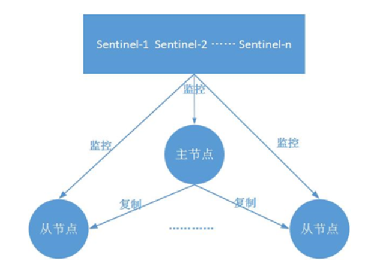
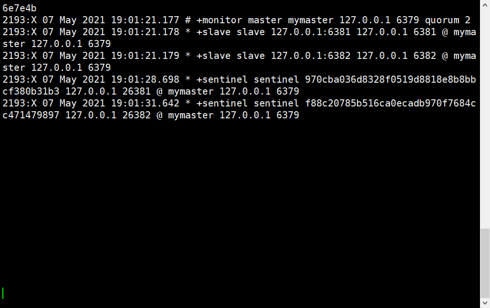
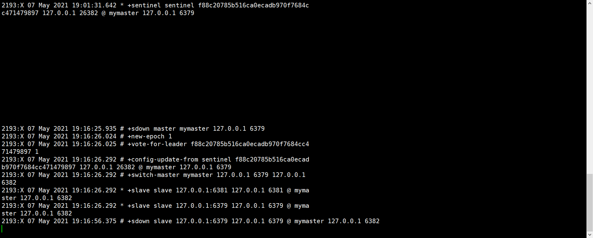

# Redis高可用技术

## 一、持久化

```bash
	持久化是最简单的高可用方法(有时甚至不被归为高可用的手段)，主要作用是数据备份，即将数据存储在硬盘，保证数据不会因进程退出而丢失。
```


## 二、主从复制

```bash
	复制是高可用Redis的基础，哨兵和集群都是在复制基础上实现高可用的。复制主要实现了数据的多机备份，以及对于读操作的负载均衡和简单的故障恢复。缺陷：故障恢复无法自动化；写操作无法负载均衡；存储能力受到单机的限制。
```


## 三、哨兵

```bash
	在复制的基础上，哨兵实现了自动化的故障恢复。
	缺陷：写操作无法负载均衡；存储能力受到单机的限制。
```


## 四、集群

```bash
通过集群，Redis解决了写操作无法负载均衡，以及存储能力受到单机限制的问题，实现了较为完善的高可用方案。
```

# 哨兵

## 一、介绍

```bash
	哨兵（sentinel），用于对主从结构中的每一台服务器进行监控，当主节点出现故障后通过投票机制来挑选新的主节点，并且将所有的从节点连接到新的主节点上。前面的主从是最基础的提升Redis服务器稳定性的一种实现方式，但我们可以看到master节点仍然是一台，若主节点宕机，所有从服务器都不会有新的数据进来，如何让主节点也实现高可用，当主节点宕机的时候自动从从节点中选举一台节点提升为主节点就是哨兵实现的功能。
```


## 二、作用

### 1、监控（Monitoring）

```bash
哨兵会不断地检查主节点和从节点是否运作正常。
```


### 2、通讯（communication）

```bash
当监控节点出现故障，哨兵之间进行通讯。
```


### 3、自动故障转移（Automatic failover）

````bash
当主节点不能正常工作时，哨兵会开始自动故障转移操作，它会将失效主节点的其中一个从节点升级为新的主节点，并让其他从节点改为复制新的主节点。
````


### 4、配置提供者（Configuration provider）

```bash
客户端在初始化时，通过连接哨兵来获得当前Redis服务的主节点地址。
```


### 5、通知（Notification）

```bash
哨兵可以将故障转移的结果发送给客户端
```


> ​	其中，监控和自动故障转移功能，使得哨兵可以及时发现主节点故障并完成转移；而配置提供者和通知功能，则需要在与客户端的交互中才能体现。

> ​	这里对“客户端”一词在文章中的用法做一个说明：在前面的文章中，只要通过API访问redis服务器，都会称作客户端，包括redis-cli、Java客户端Jedis等；为了便于区分说明，本文中的客户端并不包括redis-cli，而是比redis-cli更加复杂：redis-cli使用的是redis提供的底层接口，而客户端则对这些接口、功能进行了封装，以便充分利用哨兵的配置提供者和通知功能。


## 三、架构图



它由两部分组成，哨兵节点和数据节点：

> 哨兵节点:哨兵系统由一个或多个哨兵节点组成,哨兵节点是特殊的redis节点,不存储数

>主节点和从节点都是数据节点。


## 四、工作流程

### 1、实时监控

```bash
	每个Sentinel以每秒钟一次的频率向它所知的Master，Slave以及其他 Sentinel 实例发送一个PING命令。
```


### 2、监控失败，主观下线

```bash
	如果一个实例（instance）距离最后一次有效回复PING命令的时间超过 own-after-milliseconds 选项所指定的值，则这个实例会被Sentinel标记为主观下线。
```


### 3、其他哨兵确认是否下线

```bash
	如果一个Master被标记为主观下线，则正在监视这个Master的所有 Sentinel 要以每秒一次的频率确认Master的确进入了主观下线状态。 
```


### 4、多个哨兵确认主观下线，状态变为客观下线

```bash
	当有足够数量的Sentinel（大于等于配置文件指定的值）在指定的时间范围内确认Master的确进入了主观下线状态，则Master会被标记为客观下线。
```


### 5、INFO监控

```bash
	在一般情况下，每个Sentinel 会以每10秒一次的频率向它已知的所有Master，Slave发送 INFO 命令。
```


### 6、INFO监控升级

```bash
	当Master被Sentinel标记为客观下线时，Sentinel 向下线的 Master 的所有Slave发送 INFO命令的频率会从10秒一次改为每秒一次。 
```


### 7、客观下线条件不足，取消下线状态

```bash
	若没有足够数量的Sentinel同意Master已经下线，Master的客观下线状态就会被移除。 若 Master重新向Sentinel 的PING命令返回有效回复，Master的主观下线状态就会被移除。
```


## 五、哨兵部署

>​	这一部分将部署一个简单的哨兵系统，包含1个主节点、2个从节点和3个哨兵节点。方便起见：所有这些节点都部署在一台机器上，使用端口号区分

### 1、部署主从

> ​	哨兵系统中的主从节点，与普通的主从节点配置是一样的，并不需要做任何额外配置。下面分别是主节点（port=6379）和2个从节点（port=6381/6382）的配置文件。

#### 1.修改配置文件

##### 1）主节点（6379）

```bash
[root@xiaowu /usr/local/redis/conf]# egrep -v "^#|^$" redis.conf 
bind 127.0.0.1 172.16.1.130
protected-mode yes
port 6379
tcp-backlog 511
timeout 0
tcp-keepalive 300
daemonize yes
supervised no
pidfile "/var/run/redis_6379.pid"
loglevel notice
logfile ""
databases 16
always-show-logo yes
save 900 1
save 300 10
save 60 10000
stop-writes-on-bgsave-error yes
rdbcompression yes
rdbchecksum yes
dbfilename "dump.rdb"
rdb-del-sync-files no
dir "/"
masterauth 123
masteruser default
replica-serve-stale-data yes
replica-read-only yes
repl-diskless-sync no
repl-diskless-sync-delay 5
repl-diskless-load disabled
repl-disable-tcp-nodelay no
replica-priority 100
acllog-max-len 128
aclfile /usr/local/redis/conf/users.acl
lazyfree-lazy-eviction no
lazyfree-lazy-expire no
lazyfree-lazy-server-del no
replica-lazy-flush no
lazyfree-lazy-user-del no
oom-score-adj no
oom-score-adj-values 0 200 800
appendonly no
appendfilename "appendonly.aof"
appendfsync everysec
no-appendfsync-on-rewrite no
auto-aof-rewrite-percentage 100
auto-aof-rewrite-min-size 64mb
aof-load-truncated yes
aof-use-rdb-preamble yes
lua-time-limit 5000
slowlog-log-slower-than 10000
slowlog-max-len 128
latency-monitor-threshold 0
notify-keyspace-events ""
hash-max-ziplist-entries 512
hash-max-ziplist-value 64
list-max-ziplist-size -2
list-compress-depth 0
set-max-intset-entries 512
zset-max-ziplist-entries 128
zset-max-ziplist-value 64
hll-sparse-max-bytes 3000
stream-node-max-bytes 4kb
stream-node-max-entries 100
activerehashing yes
client-output-buffer-limit normal 0 0 0
client-output-buffer-limit replica 256mb 64mb 60
client-output-buffer-limit pubsub 32mb 8mb 60
hz 10
dynamic-hz yes
aof-rewrite-incremental-fsync yes
rdb-save-incremental-fsync yes
jemalloc-bg-thread yes
```

> ​	和普通主从不同的是主库需要指定复制的用户和密码，用来自己宕机恢复后重新加入主从变为从节点


##### 2）从节点（6381）

```bash
[root@xiaowu /usr/local/redis/conf]# egrep -v "^#|^$" redis-6381.conf 
bind 127.0.0.1 172.16.1.130
protected-mode yes
port 6381
tcp-backlog 511
timeout 0
tcp-keepalive 300
daemonize yes
supervised no
pidfile "/var/run/redis_6381.pid"
loglevel notice
logfile ""
databases 16
always-show-logo yes
save 900 1
save 300 10
save 60 10000
stop-writes-on-bgsave-error yes
rdbcompression yes
rdbchecksum yes
dbfilename "6381-dump.rdb"
rdb-del-sync-files no
dir "/"
# replicaof 127.0.0.1 6379
masterauth 123
masteruser default
replica-serve-stale-data yes
replica-read-only yes
repl-diskless-sync no
repl-diskless-sync-delay 5
repl-diskless-load disabled
repl-disable-tcp-nodelay no
replica-priority 100
acllog-max-len 128
aclfile /usr/local/redis/conf/users.acl
lazyfree-lazy-eviction no
lazyfree-lazy-expire no
lazyfree-lazy-server-del no
replica-lazy-flush no
lazyfree-lazy-user-del no
oom-score-adj no
oom-score-adj-values 0 200 800
appendonly no
appendfilename "6381-appendonly.aof"
appendfsync everysec
no-appendfsync-on-rewrite no
auto-aof-rewrite-percentage 100
auto-aof-rewrite-min-size 64mb
aof-load-truncated yes
aof-use-rdb-preamble yes
lua-time-limit 5000
slowlog-log-slower-than 10000
slowlog-max-len 128
latency-monitor-threshold 0
notify-keyspace-events ""
hash-max-ziplist-entries 512
hash-max-ziplist-value 64
list-max-ziplist-size -2
list-compress-depth 0
set-max-intset-entries 512
zset-max-ziplist-entries 128
zset-max-ziplist-value 64
hll-sparse-max-bytes 3000
stream-node-max-bytes 4kb
stream-node-max-entries 100
activerehashing yes
client-output-buffer-limit normal 0 0 0
client-output-buffer-limit replica 256mb 64mb 60
client-output-buffer-limit pubsub 32mb 8mb 60
hz 10
dynamic-hz yes
aof-rewrite-incremental-fsync yes
rdb-save-incremental-fsync yes
jemalloc-bg-thread yes
```

> 从库要注释replicaof 127.0.0.1 6379配置，防止服务重启产生主从数据不一致。


##### 3）从节点（6382）

```bash
[root@xiaowu /usr/local/redis/conf]# egrep -v "^#|^$" redis-6382.conf 
bind 127.0.0.1 172.16.1.130
protected-mode yes
port 6382
tcp-backlog 511
timeout 0
tcp-keepalive 300
daemonize yes
supervised no
pidfile "/var/run/redis_6382.pid"
loglevel notice
logfile ""
databases 16
always-show-logo yes
save 900 1
save 300 10
save 60 10000
stop-writes-on-bgsave-error yes
rdbcompression yes
rdbchecksum yes
dbfilename "6382-dump.rdb"
rdb-del-sync-files no
dir "/"
# replicaof 127.0.0.1 6379
masterauth 123
masteruser default
replica-serve-stale-data yes
replica-read-only yes
repl-diskless-sync no
repl-diskless-sync-delay 5
repl-diskless-load disabled
repl-disable-tcp-nodelay no
replica-priority 100
acllog-max-len 128
aclfile /usr/local/redis/conf/users.acl
lazyfree-lazy-eviction no
lazyfree-lazy-expire no
lazyfree-lazy-server-del no
replica-lazy-flush no
lazyfree-lazy-user-del no
oom-score-adj no
oom-score-adj-values 0 200 800
appendonly no
appendfilename "6382-appendonly.aof"
appendfsync everysec
no-appendfsync-on-rewrite no
auto-aof-rewrite-percentage 100
auto-aof-rewrite-min-size 64mb
aof-load-truncated yes
aof-use-rdb-preamble yes
lua-time-limit 5000
slowlog-log-slower-than 10000
slowlog-max-len 128
latency-monitor-threshold 0
notify-keyspace-events ""
hash-max-ziplist-entries 512
hash-max-ziplist-value 64
list-max-ziplist-size -2
list-compress-depth 0
set-max-intset-entries 512
zset-max-ziplist-entries 128
zset-max-ziplist-value 64
hll-sparse-max-bytes 3000
stream-node-max-bytes 4kb
stream-node-max-entries 100
activerehashing yes
client-output-buffer-limit normal 0 0 0
client-output-buffer-limit replica 256mb 64mb 60
client-output-buffer-limit pubsub 32mb 8mb 60
hz 10
dynamic-hz yes
aof-rewrite-incremental-fsync yes
rdb-save-incremental-fsync yes
jemalloc-bg-thread yes
```


#### 2.启动实例

```bash
[root@xiaowu /usr/local/redis/conf]# systemctl restart redis.service  	# 我自己加了systemd管理
[root@xiaowu /usr/local/redis/conf]# redis-server redis-6381.conf 
[root@xiaowu /usr/local/redis/conf]# redis-server redis-6382.conf
```


#### 3.搭建主从

**6381**

```bash
[root@xiaowu /usr/local/redis/conf]# redis-cli -p 6381 --raw
127.0.0.1:6381> AUTH 123
OK
127.0.0.1:6381> SLAVEOF 127.0.0.1 6379
OK
127.0.0.1:6381> info replication
# Replication
role:slave
master_host:127.0.0.1
master_port:6379
master_link_status:up
master_last_io_seconds_ago:4
master_sync_in_progress:0
slave_repl_offset:28
slave_priority:100
slave_read_only:1
connected_slaves:0
master_replid:656644e6daeffb5f7727b94f4f3cd01e7862890c
master_replid2:0000000000000000000000000000000000000000
master_repl_offset:28
second_repl_offset:-1
repl_backlog_active:1
repl_backlog_size:1048576
repl_backlog_first_byte_offset:1
repl_backlog_histlen:28
127.0.0.1:6381> 
```


**6382**

```bash
[root@xiaowu ~]# redis-cli -p 6382 --raw
127.0.0.1:6382> AUTH 123
OK
127.0.0.1:6382> SLAVEOF 127.0.0.1 6379
OK
127.0.0.1:6382> info replication
# Replication
role:slave
master_host:127.0.0.1
master_port:6379
master_link_status:up
master_last_io_seconds_ago:8
master_sync_in_progress:0
slave_repl_offset:112
slave_priority:100
slave_read_only:1
connected_slaves:0
master_replid:656644e6daeffb5f7727b94f4f3cd01e7862890c
master_replid2:0000000000000000000000000000000000000000
master_repl_offset:112
second_repl_offset:-1
repl_backlog_active:1
repl_backlog_size:1048576
repl_backlog_first_byte_offset:99
repl_backlog_histlen:14
```


**6379主库**

```bash
[root@xiaowu ~]# redis-cli --raw
127.0.0.1:6379> AUTH 123
OK
127.0.0.1:6379> INFO replication
# Replication
role:master
connected_slaves:2
slave0:ip=127.0.0.1,port=6381,state=online,offset=1078,lag=1
slave1:ip=127.0.0.1,port=6382,state=online,offset=1078,lag=1
master_replid:656644e6daeffb5f7727b94f4f3cd01e7862890c
master_replid2:0000000000000000000000000000000000000000
master_repl_offset:1078
second_repl_offset:-1
repl_backlog_active:1
repl_backlog_size:1048576
repl_backlog_first_byte_offset:1
repl_backlog_histlen:1078
```


### 2、部署三台哨兵

**配置详解**

```bash
# 端口
port 26379

# 是否后台启动
daemonize yes

# pid文件路径
pidfile /var/run/redis-sentinel.pid

# 日志文件路径
logfile "/var/log/sentinel.log"

# 定义工作目录
dir /tmp

# 定义Redis主的别名, IP, 端口，这里的2指的是需要至少2个Sentinel认为主Redis挂了才最终会采取下一步行为
# sentinel monitor [集群名称] [集群主节点IP] [断开] []
sentinel monitor mymaster 127.0.0.1 6379 2

# 配置mymaster的密码
sentinel auth-pass mymaster 123

# 如果mymaster 30秒内没有响应，则认为其主观失效
sentinel down-after-milliseconds mymaster 30000

# 如果master重新选出来后，其它slave节点能同时并行从新master同步数据的台数有多少个，显然该值越大，所有slave节点完成同步切换的整体速度越快，但如果此时正好有人在访问这些slave，可能造成读取失败，影响面会更广。最保守的设置为1，同一时间，只能有一台干这件事，这样其它slave还能继续服务，但是所有slave全部完成缓存更新同步的进程将变慢。
sentinel parallel-syncs mymaster 1

# 该参数指定一个时间段，在该时间段内没有实现故障转移成功，则会再一次发起故障转移的操作，单位毫秒
sentinel failover-timeout mymaster 180000

# 不允许使用SENTINEL SET设置notification-script和client-reconfig-script。
sentinel deny-scripts-reconfig yes
```


#### 1.创建配置文件存放目录

```bash
[root@xiaowu /usr/local/redis]# mkdir sentinel
```


#### 2.创建配置文件

##### 1）sentinel-26379.conf

```bash
port 26379
daemonize yes
pidfile "/var/run/redis/redis-sentinel79.pid"
logfile "/var/log/redis/sentinel79.log"
dir "/tmp"
sentinel monitor mymaster 127.0.0.1 6379 2
sentinel auth-pass mymaster 123
sentinel down-after-milliseconds mymaster 30000
sentinel parallel-syncs mymaster 1
sentinel failover-timeout mymaster 180000
sentinel deny-scripts-reconfig yes
```


##### 2）sentinel-26381.conf

```bash
port 26381
daemonize yes
pidfile "/var/run/redis/redis-sentinel81.pid"
logfile "/var/log/redis/sentinel81.log"
dir "/tmp"
sentinel monitor mymaster 127.0.0.1 6379 2
sentinel auth-pass mymaster 123
sentinel down-after-milliseconds mymaster 30000
sentinel parallel-syncs mymaster 1
sentinel failover-timeout mymaster 180000
sentinel deny-scripts-reconfig yes
```


##### 3）sentinel-26382.conf

```bash
port 26382
daemonize yes
pidfile "/var/run/redis/redis-sentinel82.pid"
logfile "/var/log/redis/sentinel82.log"
dir "/tmp"
sentinel monitor mymaster 127.0.0.1 6379 2
sentinel auth-pass mymaster 123
sentinel down-after-milliseconds mymaster 30000
sentinel parallel-syncs mymaster 1
sentinel failover-timeout mymaster 180000
sentinel deny-scripts-reconfig yes
```


#### 3.创建pid和log存放目录

```bash
[root@xiaowu /usr/local/redis/sentinel]# mkdir /var/log/redis
[root@xiaowu /usr/local/redis/sentinel]# mkdir /var/run/redis
```


#### 4.启动哨兵

**启动命令**

```bash
redis-sentinel sentinel-26379.conf
或
redis-server sentinel-26379.conf --sentinel
```

**启动**

```bash
[root@xiaowu /usr/local/redis/sentinel]# redis-sentinel sentinel-26379.conf 
[root@xiaowu /usr/local/redis/sentinel]# redis-sentinel sentinel-26381.conf 
[root@xiaowu /usr/local/redis/sentinel]# redis-sentinel sentinel-26382.conf 
```


#### 5.查看进程

```bash
root       1961      1  0 17:00 ?        00:00:10 /usr/local/redis/bin/redis-server 127.0.0.1:6379
root       1986      1  0 17:01 ?        00:00:07 redis-server 127.0.0.1:6381
root       1992      1  0 17:01 ?        00:00:07 redis-server 127.0.0.1:6382
root       2193      1  0 19:01 ?        00:00:00 redis-sentinel *:26379 [sentinel]
root       2199      1  0 19:01 ?        00:00:00 redis-sentinel *:26381 [sentinel]
root       2205      1  0 19:01 ?        00:00:00 redis-sentinel *:26382 [sentinel]
```


#### 6.登录哨兵查看信息

```bash
[root@xiaowu ~]# redis-cli  -p 26379
127.0.0.1:26379> sentinel master mymaster
 1) "name"
 2) "mymaster"
 3) "ip"
 4) "127.0.0.1"
 5) "port"
 6) "6379"
 7) "runid"
 8) "144421f56857972e75c41a620c488a7a8e4d203b"			#有这个说明哨兵创建成功
 9) "flags"
10) "master"
11) "link-pending-commands"
12) "0"
13) "link-refcount"
14) "1"
15) "last-ping-sent"
16) "0"
17) "last-ok-ping-reply"
18) "396"
19) "last-ping-reply"
20) "396"
21) "down-after-milliseconds"
22) "30000"
23) "info-refresh"
24) "2563"
25) "role-reported"
26) "master"
27) "role-reported-time"
28) "163250"
29) "config-epoch"
30) "0"
31) "num-slaves"
32) "2"
33) "num-other-sentinels"
34) "2"
35) "quorum"
36) "2"
37) "failover-timeout"
38) "180000"
39) "parallel-syncs"
40) "1"
```


## 六、故障转移

### 1、监控其中一个哨兵的日志

```bash
[root@xiaowu /var/log/redis]# tail -f sentinel79.log 
```




### 2、关闭主节点

```bash
[root@xiaowu ~]# systemctl stop redis.service 
```


### 3、查看日志



### 4、查看81状态

````bash
127.0.0.1:6381> auth 123
OK
127.0.0.1:6381> info replication
# Replication
role:slave
master_host:127.0.0.1
master_port:6382
master_link_status:up
master_last_io_seconds_ago:0
master_sync_in_progress:0
slave_repl_offset:210095
slave_priority:100
slave_read_only:1
connected_slaves:0
master_replid:ef9d2920cc764d755e0d89c6e4d65993c02444c4
master_replid2:656644e6daeffb5f7727b94f4f3cd01e7862890c
master_repl_offset:210095
second_repl_offset:181135
repl_backlog_active:1
repl_backlog_size:1048576
repl_backlog_first_byte_offset:1
repl_backlog_histlen:210095
````


### 5、查看82状态

```bash
127.0.0.1:6382> auth 123
OK
127.0.0.1:6382> info replication
# Replication
role:master
connected_slaves:1
slave0:ip=127.0.0.1,port=6381,state=online,offset=188794,lag=1
master_replid:ef9d2920cc764d755e0d89c6e4d65993c02444c4
master_replid2:656644e6daeffb5f7727b94f4f3cd01e7862890c
master_repl_offset:188927
second_repl_offset:181135
repl_backlog_active:1
repl_backlog_size:1048576
repl_backlog_first_byte_offset:99
repl_backlog_histlen:188829
```


## 七、故障恢复

### 1、恢复6379端口

```bash
[root@xiaowu ~]# systemctl start redis.service
```


### 2、查看日志

```bash
2193:X 07 May 2021 19:20:29.679 # -sdown slave 127.0.0.1:6379 127.0.0.1 6379 @ mymaster 127.0.0.1 6382
2193:X 07 May 2021 19:20:39.638 * +convert-to-slave slave 127.0.0.1:6379 127.0.0.1 6379 @ mymaster 127.0.0.1 6382
```


### 3、6379信息

```bash
127.0.0.1:6379> auth 123
OK
127.0.0.1:6379> INFO replication
# Replication
role:slave
master_host:127.0.0.1
master_port:6382
master_link_status:up
master_last_io_seconds_ago:1
master_sync_in_progress:0
slave_repl_offset:237831
slave_priority:100
slave_read_only:1
connected_slaves:0
master_replid:ef9d2920cc764d755e0d89c6e4d65993c02444c4
master_replid2:0000000000000000000000000000000000000000
master_repl_offset:237831
second_repl_offset:-1
repl_backlog_active:1
repl_backlog_size:1048576
repl_backlog_first_byte_offset:231383
repl_backlog_histlen:6449
```


### 4、查看6381信息

```bash
127.0.0.1:6381> auth 123
OK
127.0.0.1:6381> info replication
# Replication
role:slave
master_host:127.0.0.1
master_port:6382
master_link_status:up
master_last_io_seconds_ago:1
master_sync_in_progress:0
slave_repl_offset:241051
slave_priority:100
slave_read_only:1
connected_slaves:0
master_replid:ef9d2920cc764d755e0d89c6e4d65993c02444c4
master_replid2:656644e6daeffb5f7727b94f4f3cd01e7862890c
master_repl_offset:241051
second_repl_offset:181135
repl_backlog_active:1
repl_backlog_size:1048576
repl_backlog_first_byte_offset:1
repl_backlog_histlen:241051
```

### 5、查看6382信息

```bash
127.0.0.1:6382> info replication
# Replication
role:master
connected_slaves:2
slave0:ip=127.0.0.1,port=6381,state=online,offset=243060,lag=1
slave1:ip=127.0.0.1,port=6379,state=online,offset=243060,lag=0
master_replid:ef9d2920cc764d755e0d89c6e4d65993c02444c4
master_replid2:656644e6daeffb5f7727b94f4f3cd01e7862890c
master_repl_offset:243060
second_repl_offset:181135
repl_backlog_active:1
repl_backlog_size:1048576
repl_backlog_first_byte_offset:99
repl_backlog_histlen:242962
```


## 八、新加入一个从节点

### 1、创建配置文件

```bash
[root@xiaowu /usr/local/redis/conf]# cp redis-6382.conf redis-6383.conf
[root@xiaowu /usr/local/redis/conf]# vim redis-6383.conf 
...
port 6383
...
pidfile "/var/run/redis_6383.pid"
...
dbfilename "6383-dump.rdb"
...
appendfilename "6383-appendonly.aof"
...
```


### 2、启动

```bash
[root@xiaowu /usr/local/redis/conf]# redis-server redis-6383.conf
```


### 3、连接当前主库 （6382）

```bash
[root@xiaowu /usr/local/redis/conf]# redis-cli -p 6383
127.0.0.1:6383> auth 123
OK
127.0.0.1:6383> SLAVEOF 127.0.0.1 6382
OK
```


### 4、查看日志

```bash
2193:X 07 May 2021 19:31:30.433 * +slave slave 127.0.0.1:6383 127.0.0.1 6383 @ mymaster 127.0.0.1 6382
```


### 5、查看6382信息

```bash
127.0.0.1:6382> info replication
# Replication
role:master
connected_slaves:3
slave0:ip=127.0.0.1,port=6381,state=online,offset=369384,lag=1
slave1:ip=127.0.0.1,port=6379,state=online,offset=369384,lag=0
slave2:ip=127.0.0.1,port=6383,state=online,offset=369384,lag=1
master_replid:ef9d2920cc764d755e0d89c6e4d65993c02444c4
master_replid2:656644e6daeffb5f7727b94f4f3cd01e7862890c
master_repl_offset:369398
second_repl_offset:181135
repl_backlog_active:1
repl_backlog_size:1048576
repl_backlog_first_byte_offset:99
repl_backlog_histlen:369300
127.0.0.1:6382> 
```

> redis加入一个新节点需要手动加入，加入成功后哨兵才会监听


## 九、哨兵命令

### 1、基础查询命令

>通过这些命令，可以查询哨兵系统的拓扑结构、节点信息、配置信息等。

#### 1.info sentinel

> 获取监控的所有主节点的基本信息

```bash
127.0.0.1:26379> info sentinel
# Sentinel
sentinel_masters:1
sentinel_tilt:0
sentinel_running_scripts:0
sentinel_scripts_queue_length:0
sentinel_simulate_failure_flags:0
master0:name=mymaster,status=ok,address=127.0.0.1:6382,slaves=3,sentinels=3
127.0.0.1:26379> 
```


#### 2.sentinel masters

>获取监控的所有主节点的详细信息

```bash
127.0.0.1:26379> sentinel masters
1)  1) "name"
    2) "mymaster"
    3) "ip"
    4) "127.0.0.1"
    5) "port"
    6) "6382"
    7) "runid"
    8) "2cb276b2b0487bf3ebc21e8ac3d673ef76ccaaac"
    9) "flags"
   10) "master"
   11) "link-pending-commands"
   12) "0"
   13) "link-refcount"
   14) "1"
   15) "last-ping-sent"
   16) "0"
   17) "last-ok-ping-reply"
   18) "195"
   19) "last-ping-reply"
   20) "195"
   21) "down-after-milliseconds"
   22) "30000"
   23) "info-refresh"
   24) "2167"
   25) "role-reported"
   26) "master"
   27) "role-reported-time"
   28) "1157416"
   29) "config-epoch"
   30) "1"
   31) "num-slaves"
   32) "3"
   33) "num-other-sentinels"
   34) "2"
   35) "quorum"
   36) "2"
   37) "failover-timeout"
   38) "180000"
   39) "parallel-syncs"
   40) "1"
```

#### 3.sentinel master mymaster

>获取监控的主节点mymaster的详细信息

```bash
127.0.0.1:26379> sentinel master mymaster
 1) "name"
 2) "mymaster"
 3) "ip"
 4) "127.0.0.1"
 5) "port"
 6) "6382"
 7) "runid"
 8) "2cb276b2b0487bf3ebc21e8ac3d673ef76ccaaac"
 9) "flags"
10) "master"
11) "link-pending-commands"
12) "0"
13) "link-refcount"
14) "1"
15) "last-ping-sent"
16) "0"
17) "last-ok-ping-reply"
18) "332"
19) "last-ping-reply"
20) "332"
21) "down-after-milliseconds"
22) "30000"
23) "info-refresh"
24) "1439"
25) "role-reported"
26) "master"
27) "role-reported-time"
28) "1236950"
29) "config-epoch"
30) "1"
31) "num-slaves"
32) "3"
33) "num-other-sentinels"
34) "2"
35) "quorum"
36) "2"
37) "failover-timeout"
38) "180000"
39) "parallel-syncs"
40) "1"
```

#### 4.sentinel slaves mymaster

> 获取监控的主节点mymaster的从节点的详细信息

```bash
127.0.0.1:26379> sentinel slaves mymaster
1)  1) "name"
    2) "127.0.0.1:6383"
    3) "ip"
    4) "127.0.0.1"
    5) "port"
    6) "6383"
    7) "runid"
    8) "83a5f57cc4fc77c86417452cf14bfcd3af22e154"
    9) "flags"
   10) "slave"
   11) "link-pending-commands"
   12) "0"
   13) "link-refcount"
   14) "1"
   15) "last-ping-sent"
   16) "0"
   17) "last-ok-ping-reply"
   18) "716"
   19) "last-ping-reply"
   20) "716"
   21) "down-after-milliseconds"
   22) "30000"
   23) "info-refresh"
   24) "9582"
   25) "role-reported"
   26) "slave"
   27) "role-reported-time"
   28) "441353"
   29) "master-link-down-time"
   30) "0"
   31) "master-link-status"
   32) "ok"
   33) "master-host"
   34) "127.0.0.1"
   35) "master-port"
   36) "6382"
   37) "slave-priority"
   38) "100"
   39) "slave-repl-offset"
   40) "444928"
2)  1) "name"
    2) "127.0.0.1:6379"
    3) "ip"
    4) "127.0.0.1"
    5) "port"
    6) "6379"
    7) "runid"
    8) "2a230b2bcb8b00a6a1d675964ae23adb5b96a030"
    9) "flags"
   10) "slave"
   11) "link-pending-commands"
   12) "0"
   13) "link-refcount"
   14) "1"
   15) "last-ping-sent"
   16) "0"
   17) "last-ok-ping-reply"
   18) "716"
   19) "last-ping-reply"
   20) "716"
   21) "down-after-milliseconds"
   22) "30000"
   23) "info-refresh"
   24) "7395"
   25) "role-reported"
   26) "slave"
   27) "role-reported-time"
   28) "1082137"
   29) "master-link-down-time"
   30) "0"
   31) "master-link-status"
   32) "ok"
   33) "master-host"
   34) "127.0.0.1"
   35) "master-port"
   36) "6382"
   37) "slave-priority"
   38) "100"
   39) "slave-repl-offset"
   40) "445341"
3)  1) "name"
    2) "127.0.0.1:6381"
    3) "ip"
    4) "127.0.0.1"
    5) "port"
    6) "6381"
    7) "runid"
    8) "f983a7b26c70a9a3b71db468428c242836955295"
    9) "flags"
   10) "slave"
   11) "link-pending-commands"
   12) "0"
   13) "link-refcount"
   14) "1"
   15) "last-ping-sent"
   16) "0"
   17) "last-ok-ping-reply"
   18) "716"
   19) "last-ping-reply"
   20) "716"
   21) "down-after-milliseconds"
   22) "30000"
   23) "info-refresh"
   24) "59"
   25) "role-reported"
   26) "slave"
   27) "role-reported-time"
   28) "1345494"
   29) "master-link-down-time"
   30) "0"
   31) "master-link-status"
   32) "ok"
   33) "master-host"
   34) "127.0.0.1"
   35) "master-port"
   36) "6382"
   37) "slave-priority"
   38) "100"
   39) "slave-repl-offset"
   40) "446804"
127.0.0.1:26379> 
```


#### 5.sentinel sentinels mymaster

> 获取监控的主节点mymaster的哨兵节点的详细信息

```bash
127.0.0.1:26379> sentinel sentinels mymaster
1)  1) "name"
    2) "970cba036d8328f0519d8818e8b8bbcf380b31b3"
    3) "ip"
    4) "127.0.0.1"
    5) "port"
    6) "26381"
    7) "runid"
    8) "970cba036d8328f0519d8818e8b8bbcf380b31b3"
    9) "flags"
   10) "sentinel"
   11) "link-pending-commands"
   12) "0"
   13) "link-refcount"
   14) "1"
   15) "last-ping-sent"
   16) "0"
   17) "last-ok-ping-reply"
   18) "609"
   19) "last-ping-reply"
   20) "609"
   21) "down-after-milliseconds"
   22) "30000"
   23) "last-hello-message"
   24) "499"
   25) "voted-leader"
   26) "?"
   27) "voted-leader-epoch"
   28) "0"
2)  1) "name"
    2) "f88c20785b516ca0ecadb970f7684cc471479897"
    3) "ip"
    4) "127.0.0.1"
    5) "port"
    6) "26382"
    7) "runid"
    8) "f88c20785b516ca0ecadb970f7684cc471479897"
    9) "flags"
   10) "sentinel"
   11) "link-pending-commands"
   12) "0"
   13) "link-refcount"
   14) "1"
   15) "last-ping-sent"
   16) "0"
   17) "last-ok-ping-reply"
   18) "609"
   19) "last-ping-reply"
   20) "609"
   21) "down-after-milliseconds"
   22) "30000"
   23) "last-hello-message"
   24) "1781"
   25) "voted-leader"
   26) "?"
   27) "voted-leader-epoch"
   28) "0"
127.0.0.1:26379> sentinel sentinels mymaster
1)  1) "name"
    2) "970cba036d8328f0519d8818e8b8bbcf380b31b3"
    3) "ip"
    4) "127.0.0.1"
    5) "port"
    6) "26381"
    7) "runid"
    8) "970cba036d8328f0519d8818e8b8bbcf380b31b3"
    9) "flags"
   10) "sentinel"
   11) "link-pending-commands"
   12) "0"
   13) "link-refcount"
   14) "1"
   15) "last-ping-sent"
   16) "0"
   17) "last-ok-ping-reply"
   18) "551"
   19) "last-ping-reply"
   20) "551"
   21) "down-after-milliseconds"
   22) "30000"
   23) "last-hello-message"
   24) "861"
   25) "voted-leader"
   26) "?"
   27) "voted-leader-epoch"
   28) "0"
2)  1) "name"
    2) "f88c20785b516ca0ecadb970f7684cc471479897"
    3) "ip"
    4) "127.0.0.1"
    5) "port"
    6) "26382"
    7) "runid"
    8) "f88c20785b516ca0ecadb970f7684cc471479897"
    9) "flags"
   10) "sentinel"
   11) "link-pending-commands"
   12) "0"
   13) "link-refcount"
   14) "1"
   15) "last-ping-sent"
   16) "0"
   17) "last-ok-ping-reply"
   18) "551"
   19) "last-ping-reply"
   20) "551"
   21) "down-after-milliseconds"
   22) "30000"
   23) "last-hello-message"
   24) "846"
   25) "voted-leader"
   26) "?"
   27) "voted-leader-epoch"
   28) "0"
```


### 2、添加/移除对主节点的监控

**添加**

```bash
sentinel monitor mymaster2 127.0.0.1 6379 2
```

**移除**

```bash
sentinel remove mymaster2
```


### 3、强制故障转移

```bash
sentinel failover mymaster

	该命令可以强制对mymaster执行故障转移，即便当前的主节点运行完好；例如，如果当前主节点所在机器即将报废，便可以提前通过failover命令进行故障转移。
```


## 十、定时任务

1. 每10秒每个sentinel会对master和slave执行info命令，这个任务达到两个目的：

   ​	a) 发现slave节点

   ​	b) 确认主从关系

   

2. 每2秒每个sentinel通过master节点的channel交换信息（pub/sub）。master节点上有一个发布订阅的频道(__sentinel__:hello)。sentinel节点通过__sentinel__:hello频道进行信息交换(对节点的"看法"和自身的信息)，达成共识。

   

3. 每1秒每个sentinel对其他sentinel和redis节点执行ping操作（相互监控），这个其实是一个心跳检测，是失败判定的依据。


## 十一、主观下线和客观下线

### 1、主观

```bash
	在心跳检测的定时任务中，如果其他节点超过一定时间没有回复，哨兵节点就会将其进行主观下线。顾名思义，主观下线的意思是一个哨兵节点“主观地”判断下线；与主观下线相对应的是客观下线。
```


### 2、客观

```bash
	哨兵节点在对主节点进行主观下线后，会通过sentinel is-master-down-by-addr命令询问其他哨兵节点该主节点的状态；如果判断主节点下线的哨兵数量达到一定数值，则对该主节点进行客观下线。
```


> ​		需要特别注意的是，客观下线是主节点才有的概念；如果从节点和哨兵节点发生故障，被哨兵主观下线后，不会再有后续的客观下线和故障转移操作。