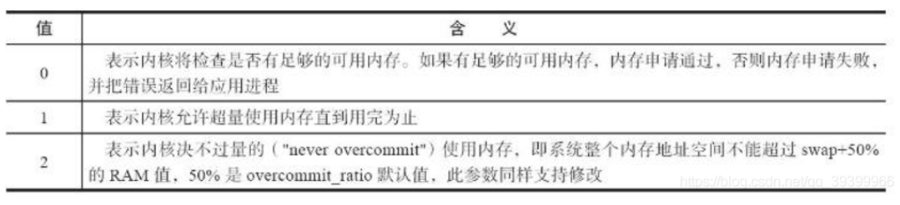

# Redis优化

## 一、配置优化

### 1、内存分配

```bash
[root@xiaowu ~]# vim /etc/sysctl.conf
...
vm.overcommit_memory = 1
```



### 2、关闭swap分区

```bash
# 关闭swap分区
swapoff -a 

# 注释swap分区
vim /etc/fstab
```


### 3、redis配置优化

#### 1. maxmemory

```bash
maxmemory <bytes>

	设置Redis使用的最大物理内存，即Redis在占用maxmemory大小的内存之后就开始拒绝后续的写入请求，该参数可以确保Redis因为使用 了大量内存严重影响速度或者发生OOM(out-of-memory，发现内存不足时，它会选择杀死一些进程(用户态进程，不是内核线程)，以便释放内存)。此外， 可以使用info命令查看Redis占用的内存及其它信息。
```


#### 2.timeout

>客户端timeout 设置一个超时时间，防止无用的连接占用资源。设置如下命令

```bash
timeout 150
cp-keepalive 150 (定时向client发送tcp_ack包来探测client是否存活的。默认不探测)
```


#### 3.rdbcompression

```bash
	默认值是yes。对于存储到磁盘中的快照，可以设置是否进行压缩存储。如果是的话，redis会采用LZF算法进行压缩。如果你不想 消耗CPU来进行压缩的话，可以设置为关闭此功能，但是存储在磁盘上的快照会比较大。
```


#### 4.rdbchecksum

```bash
	默认值是yes。在存储快照后，我们还可以让redis使用CRC64算法来进行数据校验，但是这样做会增加大约10%的性能消耗，如果希 望获取到最大的性能提升，可以关闭此功能。
```


#### 5.appendonly no

```bash
	减少占用CPU时间 主库可以不进行dump操作或者降低dump频率。 取消AOF持久化。
```


#### 6.maxclients

```bash
	客户端连接的最大数，可以通过在Redis-cli工具上输入 config set maxclients 去设置最大连接数。根据连接数负载的情况
```


## 二、缩短键值对象

> 降低Redis内存使用最直接的方式就是缩减键（key）和值（value）的长度。

````bash
	key长度：如在设计键时，在完整描述业务情况下，键值越短越好。
	value长度：值对象缩减比较复杂，常见需求是把业务对象序列化成二进制数组放入Redis。首先应该在业务上精简业务对象，在存到Redis之前先把你的数据 压缩下。
````

