# MongoDB介绍

## 一、简介

### 1、MongoDB趋势及未来展望

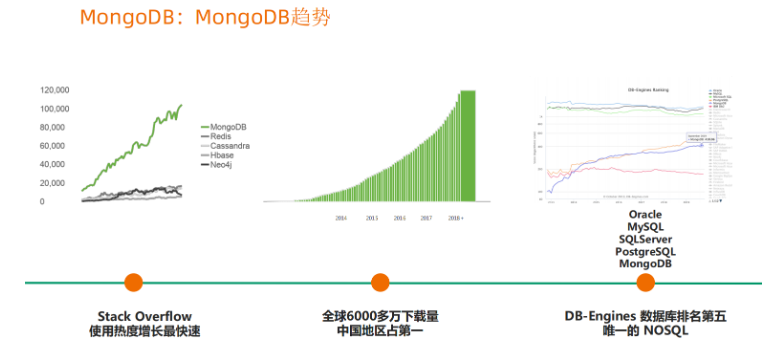

### 2、对于MongoDB的认识Q&A

| Q                    | A                                                            |
| -------------------- | ------------------------------------------------------------ |
| 什么是 MongoDB？     | 一个以 JSON 为数据模型的文档数据库                           |
| 为什么叫文档数据库？ | 文档来自于“JSON Document”，并非我们一般理解的 PDF，WORD      |
| 谁开发 MongDB？      | 上市公司 MongoDB Inc. ，总部位于美国纽约。                   |
| 主要用途有哪些？     | OLTP\OLAP数据库，类似于 Oracle, MySQL,海量数据处理，数据平台。 |
| 主要特点是什么？     | 无模式或可选。友好的JSON数据模型，开发方便。                 |
| MongoDB 是免费的吗？ | MongoDB 有两个发布版本：社区版和企业版。企业版基于商业协议，需付费。 |

### 3、MongoDB 版本变迁

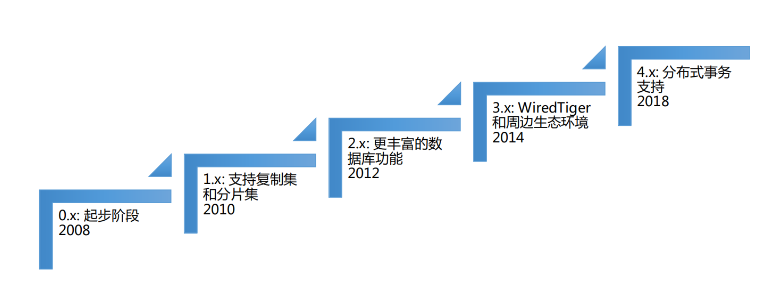

### 4、MongoDB vs. RDBMS

| 功能         | MongoDB                                  | RDBMS           |
| ------------ | ---------------------------------------- | --------------- |
| 数据模型     | JSON                                     | Relational      |
| 数据库类型   | OLTP/OLAP                                | OLTP/OLAP       |
| CRUD 操作    | MQL/SQL                                  | SQL/SQLX        |
| 高可用       | 原生Replica-Set                          | Cluster、中间件 |
| 横向扩展能力 | 原生MSC                                  | 分片、中间件    |
| 索引支持     | B-Tree、F-text、GIS、multikey、HASH、TTL | B-Tree          |
| 开发难度     | easy                                     | hard            |
| 数据容量     | 无理论上限                               | 千万、亿        |
| 扩展方式     | 垂直扩展+水平扩展                        | 垂直扩展        |

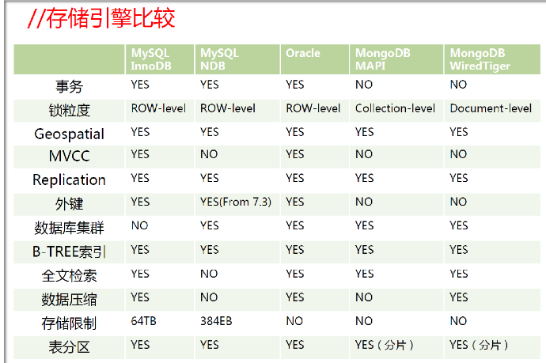

### 5、MongoDB vs. MySQL逻辑结构对比

| MySQL    | MongoDB    |
| -------- | ---------- |
| database | database   |
| table    | collection |
| row      | document   |

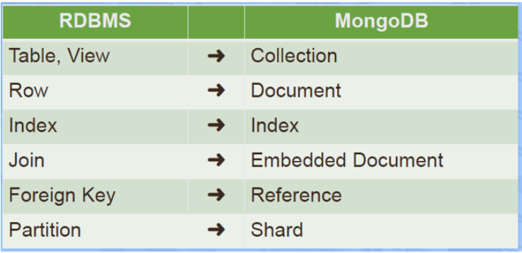

## 二、MongoDB 特色及优势

### 1、面向开发者的易用+高效数据库

#### **mysql模型**

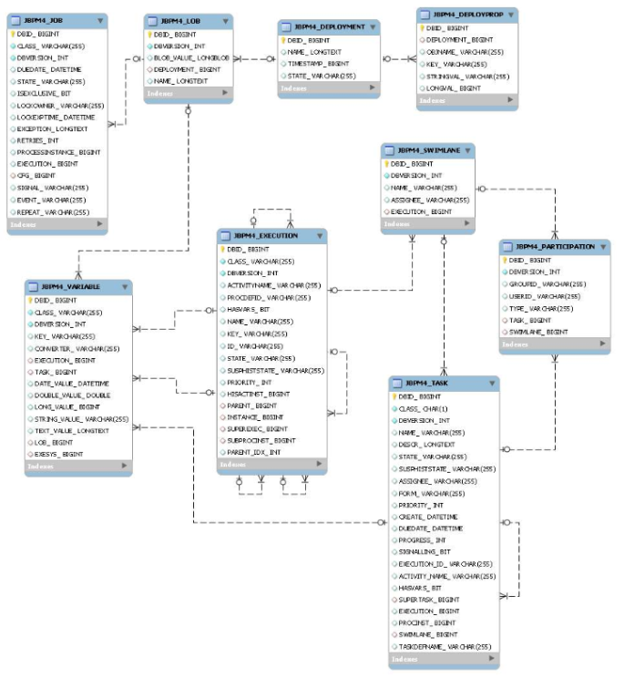

#### JSON模型：条理清楚

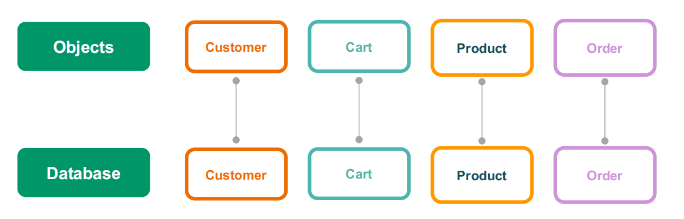

#### 快速响应业务变化

>a. 多类型:
>同一个Collection中,可以包含不同字段（类型）的文档对象.
>b. 更灵活：
>线上修改结构，应用与数据库均无须下线。

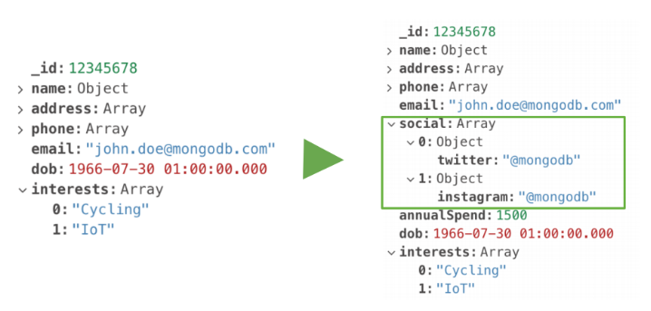

#### 简洁的开发模式

>a. 数据库引擎只需要在一个存储区读写.
>b. 反范式、无关联的组织极大优化查询速度.
>c. 程序API自然，开发快速.

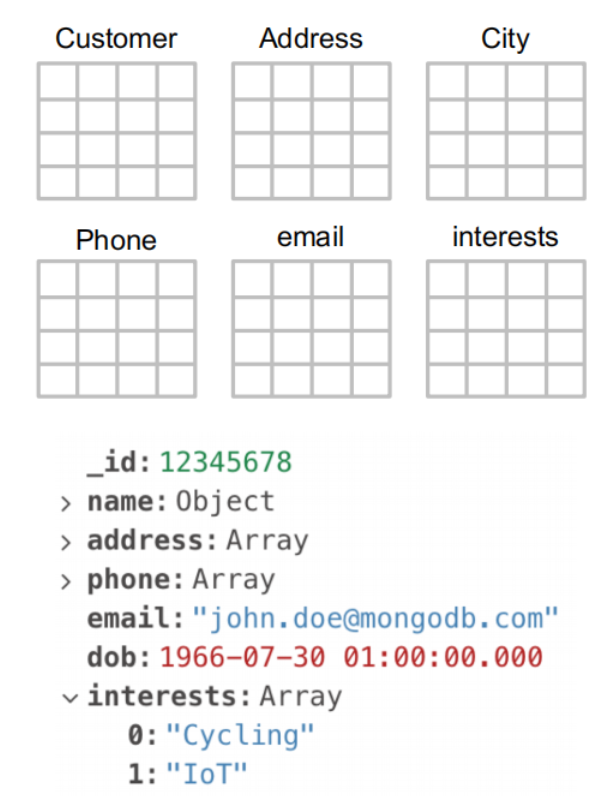

#### SQL插入数据代码量

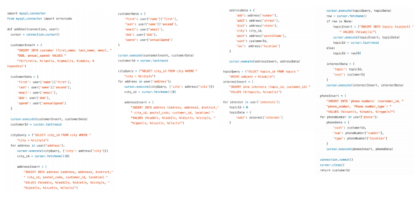

#### MongoDB 只需要两行代码

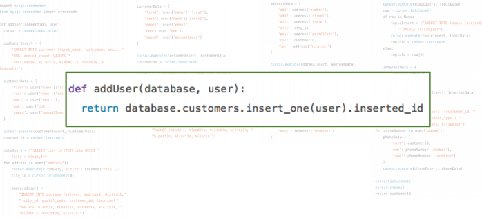

### 2、优势

#### 1.高可用能力

>a. Replica Set – 2 to 50 个成员
>b. 自恢复
>c. 多中心容灾能力
>d. 滚动服务 – 最小化服务终端

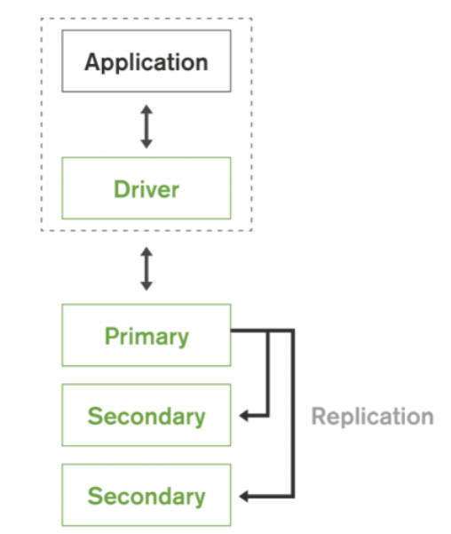

#### 2.横向扩展能力

>a. 需要的时候无缝扩展
>b. 应用全透明
>c. 多种数据分布策略
>d. 轻松支持TB–PB数量级

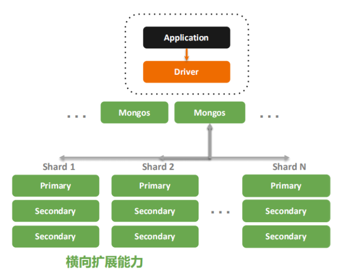

#### 3.MongoDB 技术优势总结

>a. JSON 结构和对象模型接近，开发代码量低
>b. JSON 的动态模型意味着更容易响应新的业务需求
>c. 复制集提供99.999%高可用
>d. 分片架构支持海量数据和无缝扩容