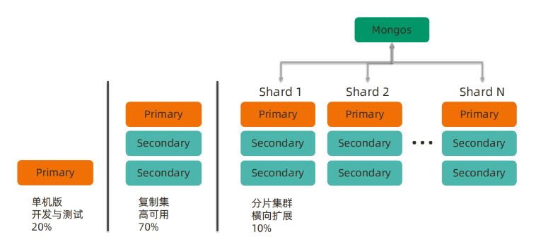
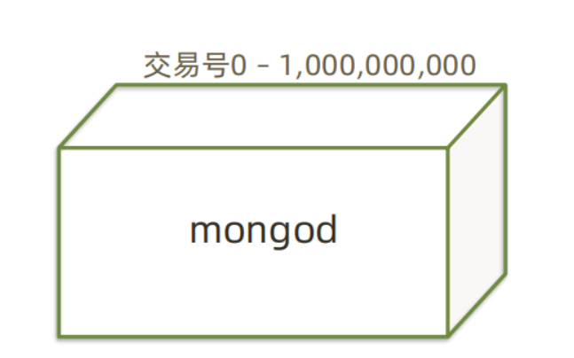
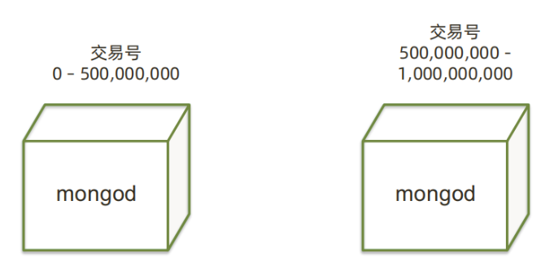
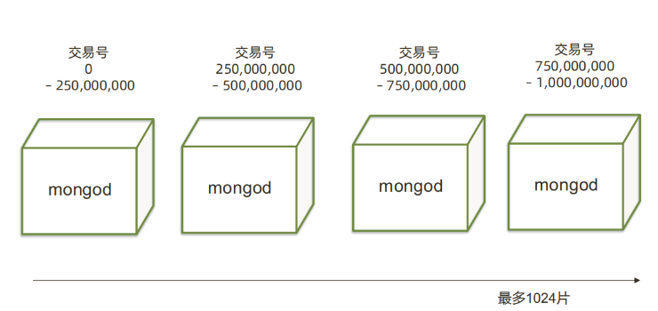
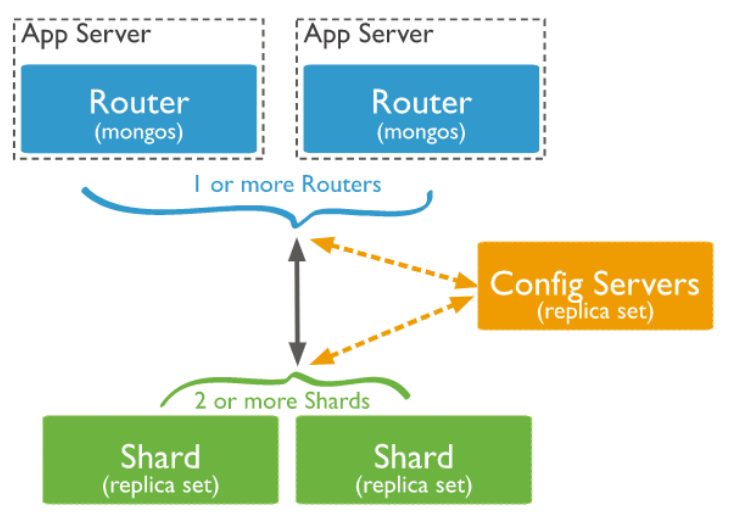
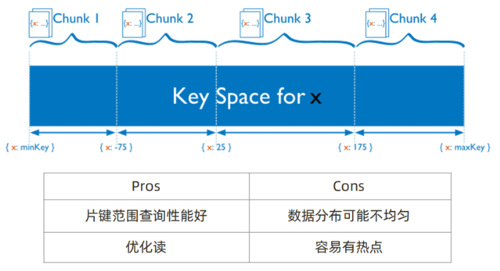
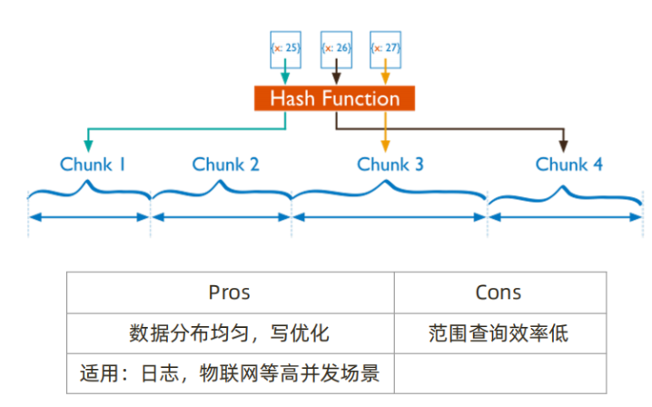
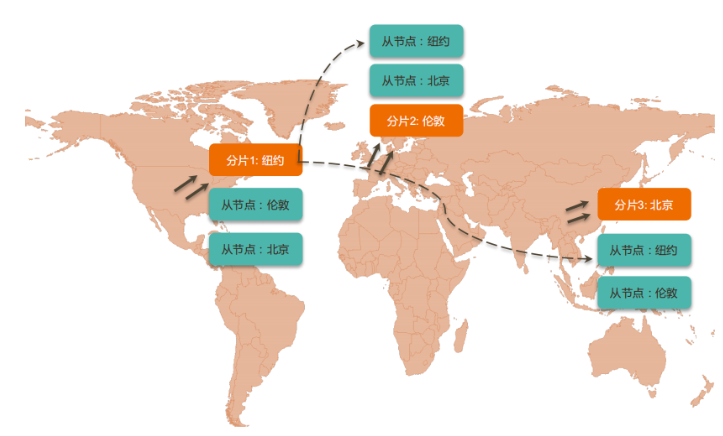

# MongoDB分片集群-介绍

## 一、MongoDB常见架构



## 二、分片集群机制及原理

### 1、为什么使用分片集群

>• 数据容量日益增大，访问性能日渐降低，怎么破？
>• 新品上线异常火爆，如何支撑更多的并发用户？
>• 单库已有 10TB 数据，恢复需要1-2天，如何加速？
>• 地理分布数据

### 2、如何解决以上问题

#### 1.原始结构

```bash
•银行交易单表内10亿笔资料
•超负荷运转
```



#### 2.把数据分成两半



#### 3.把数据分成4部分



### 3、分片架构介绍



#### 1.Mongos 路由节点

>提供集群单一入口
>转发应用端请求
>选择合适数据节点进行读写
>合并多个数据节点的返回
>无状态
>建议至少2个

#### 2.Config Servers配置节点

>提供集群元数据存储
>分片数据分布的映射

#### 3.Shards 数据节点

>以复制集为单位
>横向扩展
>最大1024分片
>分片之间数据不重复
>所有分片在一起才可
>完整工作

### 4、MongoDB 分片集群特点

>• 应用全透明，无特殊处理
>• 数据自动均衡
>• 动态扩容，无须下线
>• 提供三种分片方式

### 5、分片集群数据分布方式

>• 基于范围
>• 基于 Hash
>• 基于 zone / tag

#### 1.分片集群数据分布方式 – 基于范围



#### 2.分片集群数据分布方式 – 基于哈希



#### 3.分片集群数据分布方式 – 自定义Zone



