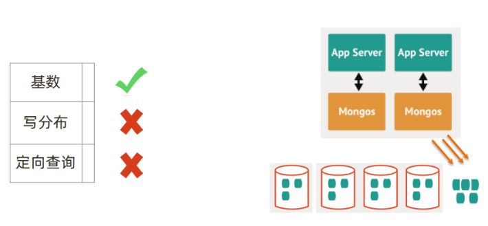
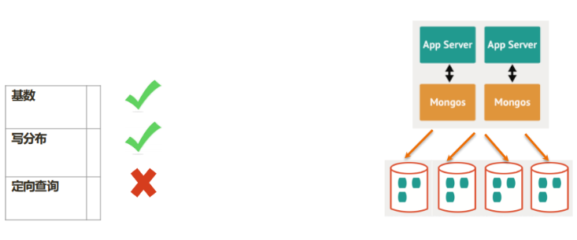
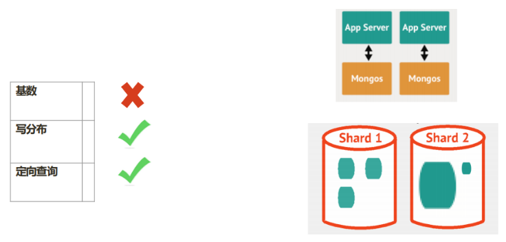
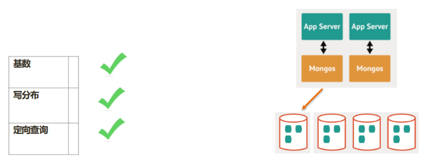

# 企业中分片集群设计

## 一、分片的基本标准

>• 关于数据：数据量不超过3TB，尽可能保持在2TB一个片；
>• 关于索引：常用索引必须容纳进内存； 
>• 按照以上标准初步确定分片后，还需要考虑业务压力，随着压力增大，CPU、RAM、磁盘中的任何一项出现瓶颈时，都可以通过添加更多分片来解决。

## 二、如何粗略判断需要多少分片

| 条件                                      | 分片个数                   |
| ----------------------------------------- | -------------------------- |
| B : 工作集大小 / 单服务器内存容量         | 400GB / （256G * 0.6） = 3 |
| A : 所需存储总量 / 单服务器可挂载容量     | 8TB / 2TB = 4              |
| C : 并发量总数 / （单服务器并发量 * 0.7） | 30000 / (9000*0.7) = 6     |
| D: 额外开销                               | ？                         |

>分片数量 = max(A, B, C)+D =?

## 三、额外的考量

>考虑分片的分布：
>• 是否需要跨机房分布分片？
>• 是否需要容灾？ 
>• 高可用的要求如何?

## 四、选择片键的正确姿势


>影响片键效率的主要因素：
>• 取值基数（Cardinality）；
>• 取值分布；
>• 分散写，集中读；
>• 被尽可能多的业务场景用到；
>• 避免单调递增或递减的片键

### 1、选择基数大的片键

>对于小基数的片键：
>• 因为备选值有限，那么块的总数量就有限；
>• 随着数据增多，块的大小会越来越大； 
>• 水平扩展时移动块会非常困难；
>
>例如：存储一个高中的师生数据，以年龄（假设年龄范围为15~65岁）作为片键，
>15<=年龄<=65，且只为整数,所以最多只会有51个 chunk
>
>结论：取值基数要大！

### 2、选择分布均匀的片键

>对于分布不均匀的片键：
>• 造成某些块的数据量急剧增大
>• 这些块压力随之增大
>• 数据均衡以 chunk 为单位，所以系统无能为力 • 例如：存储一个学校的师生数据，以年龄（假设年龄范围为15~65岁）作为片键，
>那么：
>• 15<=年龄<=65，且只为整数
>• 大部分人的年龄范围为15~18岁（学生） • 15、16、17、18四个 chunk 的数据量、访问压力远大于其他 chunk
>结论：取值分布应尽可能均匀

### 3、通过一个例子来看片键选择

```bash
{
_id: ObjectId(), 
user: 123,
time: Date(), 
subject: “...”, 
recipients: [], 
body: “...”, 
attachments: []
}
```

#### 1.选择片键： { _id: 1}



#### 2.选择片键： { _id: ”hashed”}



#### 3.选择片键： { user_id: 1 }



#### 4.选择片键： { user_id: 1, time:1 }



## 五、如何规划硬件

>• mongos 与 config 通常消耗很少的资源，可以选择低规格虚拟机； 
>• 资源的重点在于 shard 服务器： 
>• 需要足以容纳热数据索引的内存； 
>• 正确创建索引后 CPU 通常不会成为瓶颈，除非涉及非常多的计算；
>• 磁盘尽量选用 SSD； 
>实际测试是最好的检验，来看你的资源配置是否完备。
>另外，即使项目初期已经具备了足够的资源，仍然需要考虑在合适的时候扩展。建议监控
>各项资源使用情况，无论哪一项达到60%以上，则开始考虑扩展。
>• 扩展需要新的资源，申请新资源需要时间；
>• 扩展后数据需要均衡，均衡需要时间。应保证新数据入库速度慢于均衡速度 
>• 均衡需要资源，如果资源即将或已经耗尽，均衡也是会很低效的。