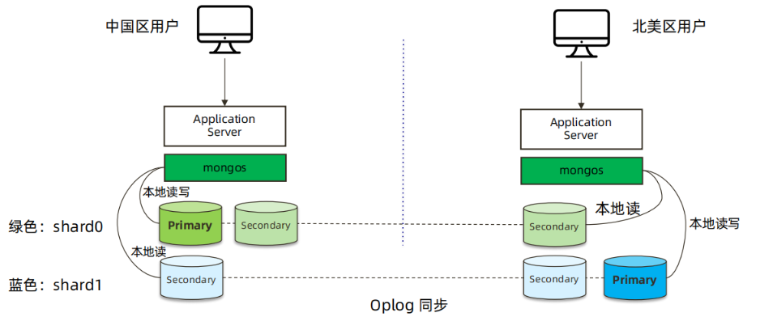

# 高级集群设计

## 一、容灾级别

| 级别 | 方式                                                         | RPO     | RTO            |
| ---- | ------------------------------------------------------------ | ------- | -------------- |
| L0   | **无备源中心**:<br />没有灾难恢复能力，只在本地进行数据备份  | 24小时+ | 4小时+         |
| L1   | **本地备份+异地保存**：<br />本地将关键数据备份，然后送到异地保存。<br />灾难发生后，按预定数据恢复程序恢复系统和数据。 | 24小时+ | 8小时+         |
| L2   | **双中心主备模式**:<br />在异地建立一个热备份点，通过网络进行数据备份。<br />当出现灾难时，备份站点接替主站点的业务，维护业务连续性 | 秒级    | 数分钟到半小时 |
| L3   | **双中心双活**<br />在相隔较远的地方分别建立两个数据中心，进行相互数据备份。<br />当某个数据中心发生灾难时，另一个数据中心接替其工作任务。 | 秒级    | 秒级           |
| L4   | **双中心双活 + 异地热备 = 两地三中心**<br />在同城分别建立两个数据中心，进行相互数据备份。<br />当该城市的2个中心同时不可用（地震/大面积停电/网络等），快速切换到异地 | 秒级    | 分钟级         |

## 二、MongoDB两地三中心集群实现


## 三、两地三中心规划及实施


### 1、准备虚拟机及数据库实例

#### 1.规划

```bash
# 10.0.0.51
primary:10.0.0.51:10001
s1 :10.0.0.51:10002

# 10.0.0.52
s3 :10.0.0.52:10003
s4 :10.0.0.52:10004

# 10.0.53
s5 :10.0.53:10005
```

#### 2.准备实例

##### 1）10.0.0.51

###### ①创建依赖目录

```bash
su - mongod
mkdir -p /mongodb/10001/conf /mongodb/10001/data /mongodb/10001/log
mkdir -p /mongodb/10002/conf /mongodb/10002/data /mongodb/10002/log
```

###### ②准备配置文件

```bash
cat > /mongodb/10001/conf/mongod.conf <<EOF
systemLog:
  destination: file
  path: /mongodb/10001/log/mongodb.log
  logAppend: true
storage:
  journal:
    enabled: true
  dbPath: /mongodb/10001/data
  directoryPerDB: true
  #engine: wiredTiger
  wiredTiger:
    engineConfig:
      cacheSizeGB: 0.5
      directoryForIndexes: true
    collectionConfig:
      blockCompressor: zlib
    indexConfig:
      prefixCompression: true
processManagement:
  fork: true
net:
   port: 10001
   bindIp: 10.0.0.51,127.0.0.1
replication:
  oplogSizeMB: 2048
  replSetName: my_repl
EOF
```

```bash
cp  /mongodb/10001/conf/mongod.conf  /mongodb/10002/conf/
sed 's#10001#10002#g' /mongodb/10002/conf/mongod.conf -i
```

###### ③服务启动

```bash
mongod -f /mongodb/10001/conf/mongod.conf
mongod -f /mongodb/10002/conf/mongod.conf
```

##### 2）10.0.0.52

###### ①创建依赖目录

```bash
su - mongod
mkdir -p /mongodb/10003/conf /mongodb/10003/data /mongodb/10003/log
mkdir -p /mongodb/10004/conf /mongodb/10004/data /mongodb/10004/log
```

###### ②准备配置文件

```bash
cat > /mongodb/10003/conf/mongod.conf <<EOF
systemLog:
  destination: file
  path: /mongodb/10003/log/mongodb.log
  logAppend: true
storage:
  journal:
    enabled: true
  dbPath: /mongodb/10003/data
  directoryPerDB: true
  #engine: wiredTiger
  wiredTiger:
    engineConfig:
      cacheSizeGB: 0.5
      directoryForIndexes: true
    collectionConfig:
      blockCompressor: zlib
    indexConfig:
      prefixCompression: true
processManagement:
  fork: true
net:
   port: 10003
   bindIp: 10.0.0.52,127.0.0.1
replication:
  oplogSizeMB: 2048
  replSetName: my_repl
EOF	
```

```bash
cp  /mongodb/10003/conf/mongod.conf  /mongodb/10004/conf/
sed 's#10003#10004#g' /mongodb/10004/conf/mongod.conf -i
```

###### ③服务启动

```bash
mongod -f /mongodb/10003/conf/mongod.conf
mongod -f /mongodb/10004/conf/mongod.conf
```

##### 3）10.0.0.53

###### ①创建依赖目录

```bash
su - mongod
mkdir -p /mongodb/10005/conf /mongodb/10005/data /mongodb/10005/log
```

###### ②准备配置文件

```bash
cat > /mongodb/10005/conf/mongod.conf <<EOF
systemLog:
  destination: file
  path: /mongodb/10005/log/mongodb.log
  logAppend: true
storage:
  journal:
    enabled: true
  dbPath: /mongodb/10005/data
  directoryPerDB: true
  #engine: wiredTiger
  wiredTiger:
    engineConfig:
      cacheSizeGB: 0.5
      directoryForIndexes: true
    collectionConfig:
      blockCompressor: zlib
    indexConfig:
      prefixCompression: true
processManagement:
  fork: true
net:
   port: 10005
   bindIp: 10.0.53,127.0.0.1
replication:
  oplogSizeMB: 2048
  replSetName: my_repl
EOF	
```

###### ③服务启动

```bash
mongod -f /mongodb/10005/conf/mongod.conf
```

#### 3.集群实例初始化

```bash
config = {_id: 'my_repl', members: [
                          {_id: 0, host: '10.0.0.51:10001'},
                          {_id: 1, host: '10.0.0.51:10002'},
                          {_id: 2, host: '10.0.0.52:10003'},
                          {_id: 3, host: '10.0.0.52:10004'},
                          {_id: 4, host: '10.0.0.53:10005'}
                          ]
          }
rs.initiate(config) 
```

### 2、优先级配置

```bash
cfg = rs.conf()
cfg.members[1].priority = 20
cfg.members[2].priority = 10
cfg.members[3].priority = 10
rs.reconfig(cfg)
```

### 3、复制集安全加固

#### 1.在启动一个节点创建验证文件并复制到其他服务器

```bash
openssl rand -base64 756 > /mongodb/10001/conf/keyfile
cp -a  /mongodb/10001/conf/keyfile /mongodb/10002/conf
chmod 600 /mongodb/10001/conf/keyfile /mongodb/10002/conf/keyfile
scp /mongodb/10001/conf/keyfile 10.0.0.52:/mongodb/10003/conf
scp /mongodb/10001/conf/keyfile 10.0.0.52:/mongodb/10004/conf
scp /mongodb/10001/conf/keyfile 10.0.53:/mongodb/10005/conf
```

#### 2.每个节点打开开启验证配置

```bash
cat >> /mongodb/10001/conf/mongod.conf <<EOF 
security:
  keyFile: /mongodb/10001/conf/keyfile
EOF

cat >>/mongodb/10002/conf/mongod.conf <<EOF 
security:
  keyFile: /mongodb/10002/conf/keyfile
EOF

cat >> /mongodb/10003/conf/mongod.conf <<EOF
security:
  keyFile: /mongodb/10003/conf/keyfile
EOF

cat >> /mongodb/10004/conf/mongod.conf <<EOF
security:
  keyFile: /mongodb/10004/conf/keyfile
EOF

cat >> /mongodb/10005/conf/mongod.conf <<EOF
security:
  keyFile: /mongodb/10005/conf/keyfile
EOF
```

#### 3.所有节点重启

```bash
use admin
db.shutdownServer()

+++++
Shut down each mongod in the replica set, starting with the secondaries. Continue until all members of the replica set are offline, including any arbiters. The primary must be the last member shut down to avoid potential rollbacks.
+++++
```

#### 4.在主节点添加用户

```bash
use admin
db.createUser(
{
    user: "root",
    pwd: "root123",
    roles: [ { role: "root", db: "admin" } ]
}
)

手工交互式输入密码
db.createUser(
{
    user: "root1",
    pwd: passwordPrompt(),
    roles: [ { role: "root", db: "admin" } ]
}
)

手工交互式验证
my_repl:PRIMARY> use admin
switched to db admin
my_repl:PRIMARY> db.auth("root1",passwordPrompt())
Enter password: 
```

## 四、全球多写集群：多地域Zone分片



### 1、shard复制集

#### 1.db01：10.0.0.51模拟中国数据中心

##### 1）创建依赖目录

```bash
su - mongod
mkdir -p /mongodb/20001/conf /mongodb/20001/data /mongodb/20001/log
mkdir -p /mongodb/20002/conf /mongodb/20002/data /mongodb/20002/log
mkdir -p /mongodb/20003/conf /mongodb/20003/data /mongodb/20003/log
```

##### 2）准备配置文件

```bash
cat > /mongodb/20001/conf/mongod.conf <<EOF
systemLog:
  destination: file
  path: /mongodb/20001/log/mongodb.log
  logAppend: true
storage:
  journal:
    enabled: true
  dbPath: /mongodb/20001/data
  directoryPerDB: true
  #engine: wiredTiger
  wiredTiger:
    engineConfig:
      cacheSizeGB: 0.5
      directoryForIndexes: true
    collectionConfig:
      blockCompressor: zlib
    indexConfig:
      prefixCompression: true
processManagement:
  fork: true
net:
   port: 20001
   bindIp: 10.0.0.51,127.0.0.1
replication:
  oplogSizeMB: 2048
  replSetName: CN_sh
sharding:
  clusterRole: shardsvr
EOF
```

```bash
cp  /mongodb/20001/conf/mongod.conf  /mongodb/20002/conf/
cp  /mongodb/20001/conf/mongod.conf  /mongodb/20003/conf/
sed 's#20001#20002#g' /mongodb/20002/conf/mongod.conf -i
sed 's#20001#20003#g' /mongodb/20003/conf/mongod.conf -i
```

##### 3）服务启动

```bash
mongod -f /mongodb/20001/conf/mongod.conf
mongod -f /mongodb/20002/conf/mongod.conf
mongod -f /mongodb/20003/conf/mongod.conf
```

#### 2.db02：10.0.0.52模拟北美数据中心

##### 1）创建依赖目录

```bash
su - mongod
mkdir -p /mongodb/20001/conf /mongodb/20001/data /mongodb/20001/log
mkdir -p /mongodb/20002/conf /mongodb/20002/data /mongodb/20002/log
mkdir -p /mongodb/20003/conf /mongodb/20003/data /mongodb/20003/log
```

##### 2）准备配置文件

```bash
cat > /mongodb/20001/conf/mongod.conf <<EOF
systemLog:
  destination: file
  path: /mongodb/20001/log/mongodb.log
  logAppend: true
storage:
  journal:
    enabled: true
  dbPath: /mongodb/20001/data
  directoryPerDB: true
  #engine: wiredTiger
  wiredTiger:
    engineConfig:
      cacheSizeGB: 0.5
      directoryForIndexes: true
    collectionConfig:
      blockCompressor: zlib
    indexConfig:
      prefixCompression: true
processManagement:
  fork: true
net:
   port: 20001
   bindIp: 10.0.0.52,127.0.0.1
replication:
  oplogSizeMB: 2048
  replSetName: US_sh
sharding:
  clusterRole: shardsvr
EOF	
```

```bash
cp  /mongodb/20001/conf/mongod.conf  /mongodb/20002/conf/
cp  /mongodb/20001/conf/mongod.conf  /mongodb/20003/conf/
sed 's#20001#20002#g' /mongodb/20002/conf/mongod.conf -i
sed 's#20001#20003#g' /mongodb/20003/conf/mongod.conf -i
```

##### 3）服务启动

```bash
mongod -f /mongodb/20001/conf/mongod.conf
mongod -f /mongodb/20002/conf/mongod.conf
mongod -f /mongodb/20003/conf/mongod.conf
```

#### 3.配置复制集

```bash
config = {_id: 'CN_sh', members: [
                          {_id: 0, host: '10.0.0.51:20001'},
                          {_id: 1, host: '10.0.0.51:20002'},
                          {_id: 2, host: '10.0.0.52:20003'}]
          }
          
rs.initiate(config) 


config = {_id: 'US_sh', members: [
                          {_id: 0, host: '10.0.0.52:20001'},
                          {_id: 1, host: '10.0.0.52:20002'},
                          {_id: 2, host: '10.0.0.51:20003'}]
          }
          
rs.initiate(config) 
```

### 2、10.0.0.51：config节点配置

#### 1.创建依赖目录

```bash
mkdir -p /mongodb/20004/conf /mongodb/20004/data /mongodb/20004/log
mkdir -p /mongodb/20005/conf /mongodb/20005/data /mongodb/20005/log
mkdir -p /mongodb/20006/conf /mongodb/20006/data /mongodb/20006/log
```

#### 2.准备配置文件

```bash
cat > /mongodb/20004/conf/mongod.conf <<EOF
systemLog:
  destination: file
  path: /mongodb/20004/log/mongodb.log
  logAppend: true
storage:
  journal:
    enabled: true
  dbPath: /mongodb/20004/data
  directoryPerDB: true
  #engine: wiredTiger
  wiredTiger:
    engineConfig:
      cacheSizeGB: 0.5
      directoryForIndexes: true
    collectionConfig:
      blockCompressor: zlib
    indexConfig:
      prefixCompression: true
processManagement:
  fork: true
net:
   port: 20004
   bindIp: 10.0.0.51,127.0.0.1
replication:
  oplogSizeMB: 2048
  replSetName: config
sharding:
  clusterRole: configsvr
EOF
```

```bash
cp  /mongodb/20004/conf/mongod.conf  /mongodb/20005/conf/
cp  /mongodb/20004/conf/mongod.conf  /mongodb/20006/conf/
sed 's#20004#20005#g' /mongodb/20005/conf/mongod.conf -i
sed 's#20004#20006#g' /mongodb/20006/conf/mongod.conf -i
```

#### 3.服务启动

```bash
mongod -f /mongodb/20004/conf/mongod.conf
mongod -f /mongodb/20005/conf/mongod.conf
mongod -f /mongodb/20006/conf/mongod.conf
```

#### 4.配置复制集

```bash
config = {_id: 'config', members: [
                          {_id: 0, host: '10.0.0.51:20004'},
                          {_id: 1, host: '10.0.0.51:20005'},
                          {_id: 2, host: '10.0.0.51:20006'}]
          }
rs.initiate(config) 
```

### 3、mongos配置

#### 1. 10.0.0.51

##### 1）创建依赖目录

```bash
mkdir -p /mongodb/20010/conf  /mongodb/20010/log 
```

##### 2）准备配置文件

```bash
cat > /mongodb/20010/conf/mongos.conf<<EOF
systemLog:
  destination: file
  path: /mongodb/20010/log/mongos.log
  logAppend: true
net:
  bindIp: 10.0.0.51,127.0.0.1
  port: 20010
sharding:
  configDB: config/10.0.0.51:20004,10.0.0.51:20005,10.0.0.51:20006
processManagement: 
  fork: true
EOF 
```

##### 3）服务启动

```bash
mongos -f /mongodb/20010/conf/mongos.conf 
```

#### 2. 10.0.0.52

##### 1）创建依赖目录

```bash
mkdir -p /mongodb/20011/conf  /mongodb/20011/log 
```

##### 2）准备配置文件

```bash
cat>  /mongodb/20011/conf/mongos.conf <<EOF
systemLog:
  destination: file
  path: /mongodb/20011/log/mongos.log
  logAppend: true
net:
  bindIp: 10.0.0.52,127.0.0.1
  port: 20011
sharding:
  configDB: config/10.0.0.51:20004,10.0.0.51:20005,10.0.0.51:20006
processManagement: 
  fork: true
EOF
```

##### 3）服务启动

```bash
mongos -f /mongodb/20011/conf/mongos.conf 
```

### 4、mongs添加分片

```bash
db.runCommand( { addshard : "CN_sh/10.0.0.51:20001,10.0.0.51:20002,10.0.0.52:20003",name:"CN_sh"} )
db.runCommand( { addshard : "US_sh/10.0.0.52:20001,10.0.0.52:20002,10.0.0.51:20003",name:"US_sh"} )
```

### 5、配置分片规则


```bash
sh.addShardTag("CN_sh", "ASIA")
sh.addShardTag("US_sh", "AMERICA")

sh.addTagRange( "zonedb.vast",
{ "locationCode" : "CN", "order_id" : MinKey },
{ "locationCode" : "CN", "order_id" : MaxKey ),
"ASIA" )

sh.addTagRange( "zonedb.vast",
{ "locationCode" : "US", "order_id" : MinKey },
{ "locationCode" : "US", "order_id" : MaxKey ),
"AMERICA" )

sh.addTagRange( "zonedb.vast",
{ "locationCode" : "CA", "order_id" : MinKey },
{ "locationCode" : "CA", "order_id" : MaxKey ),
"AMERICA" )
```