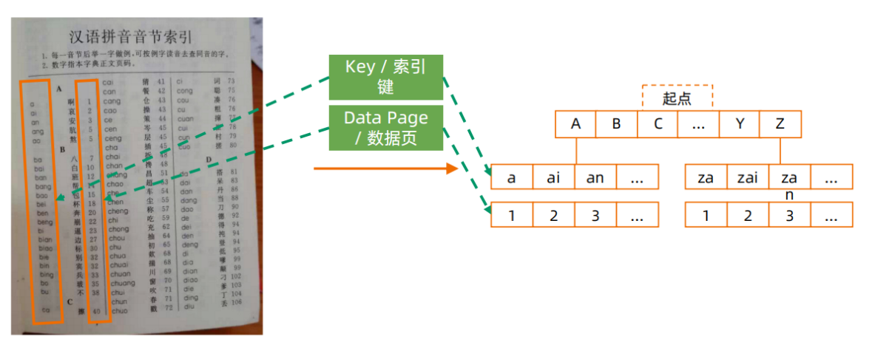
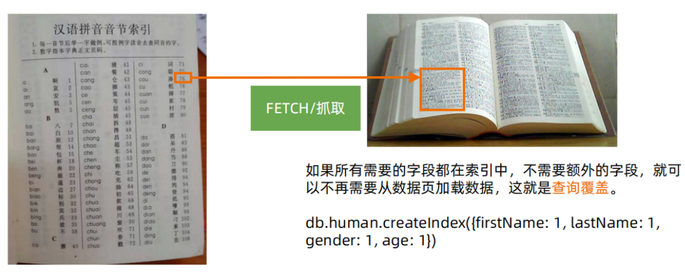
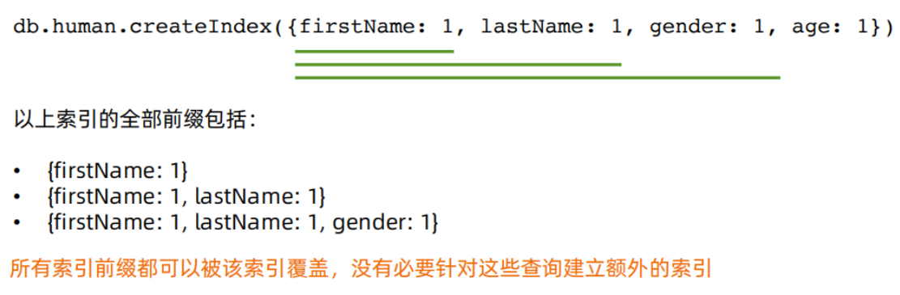
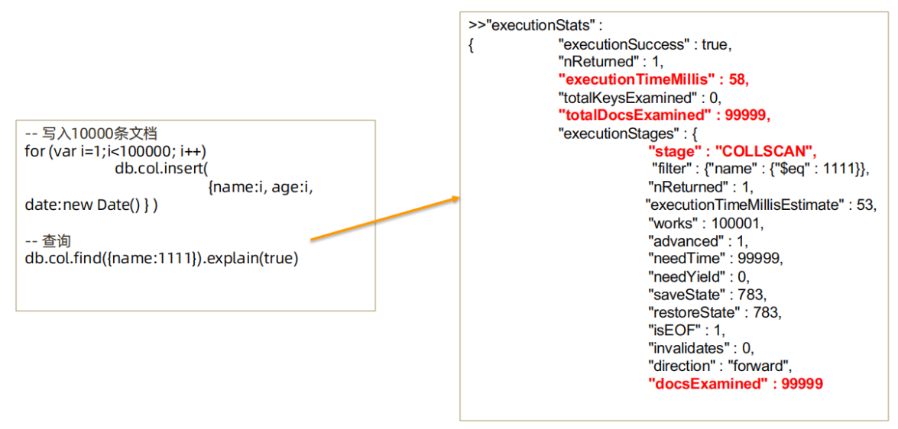
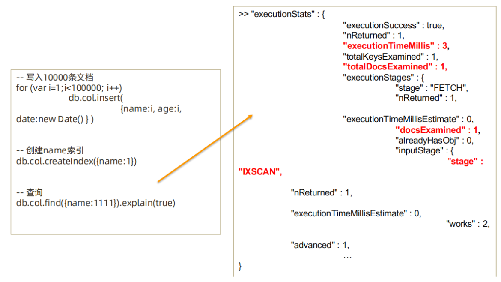
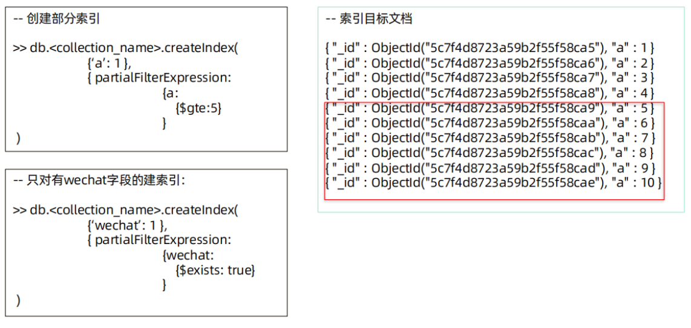

# MongoDB索引管理

## 一、Index/Key/DataPage——索引/键/数据页？



## 二、Covered Query



## 三、IXSCAN/COLLSCAN


## 四、复合索引



## 五、Selectivity——过滤性

>在一个有10000条记录的集合中：
>• 满足 gender= F 的记录有4000 条
>• 满足 city=LA 的记录有 100 条
>• 满足 ln=‘parker’ 的记录有 10 条
>查询条件：
>ln=10 city=SZ gender=F
>条件 ln 能过滤掉最多的数据，city
>其次，gender 最弱。
>所以 ln 的过滤性（selectivity）> city > gender。

## 六、执行计划

### 1、获取执行计划



### 2、优化后的执行计划



## 七、组合索引的最佳方式：ESR原则

```bash
组合索引的最佳方式：ESR原则
• 精确（Equal）匹配的字段放最前面
• 排序（Sort）条件放中间
• 范围（Range）匹配的字段放最后面
同样适用： ES, ER
请看一下查询条件：
db.members.find({ gender: “F”， age: {$gte:
18}}).sort(“join_date:1”)

{ gender: 1, age: 1, join_date: 1 }
{ gender: 1, join_date:1, age: 1 }
{ join_date: 1, gender: 1, age: 1 }
{ join_date: 1, age: 1, gender: 1 }
{ age: 1, join_date: 1, gender: 1}
{ age: 1, gender: 1, join_date: 1}
这么多候选的，用哪一个？

db.ci.createIndex( { id: 1 } )
```

## 八、部分索引

