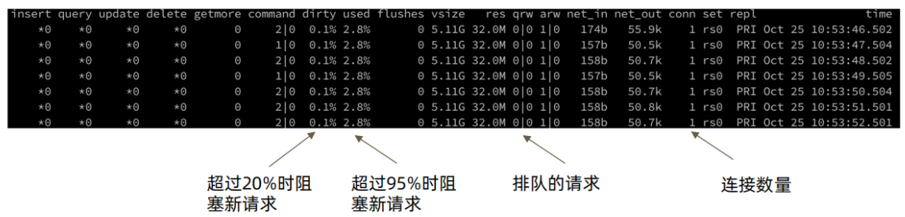
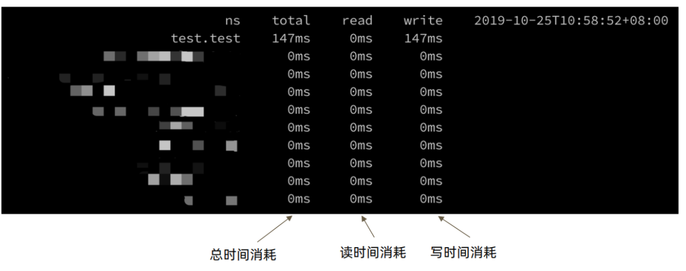
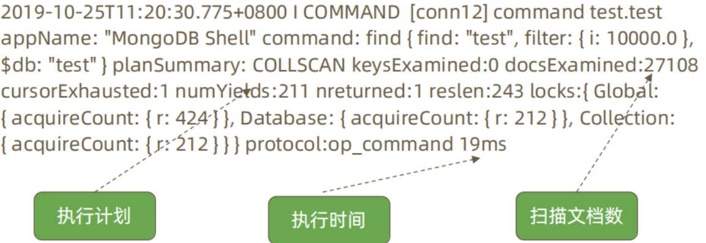

# MongoDB 性能诊断

## 一、问题诊断工具 - mongostat



```bash
主要关注点： 
dirty： 
内存中的脏页数量百分比。默认在5%以下，每分钟在后台刷盘；超过5%后台进程频繁刷盘，超过20%会阻止新请求。

used：  
分配给mongodb的内存使用的百分比。低于80%,不会触发内存回收,超过80%,触发LRU回收内存，默认超过95%会阻止新请求。

qrw: 排队的请求数量，超过10以上，需要关注下积压的操作是什么（慢查询、锁等）。
```

## 二、问题诊断工具 - mongotop



## 三、问题诊断 – mongod 慢日志

```bash
配置方法： 
方法一：启动命令行
启动MongoDB时加上--profile=级别  

方法二：配置文件
operationProfiling:
   mode: slowOp
   slowOpThresholdMs： 10
   
方法三：在线配置
db.setProfilingLevel(2);    
db.setProfilingLevel( 1 , 10 ); 

上面profile的级别可以取0，1，2  三个值，他们表示的意义如下： 
0 –  不开启 
1 –  记录慢命令 (默认为>100ms)  
2 –  记录所有命令  

查询 Profiling 记录 ： 
列出执行时间长于某一限度(100 ms)的 Profile 记录： 
    db.system.profile.find( { millis : { $gt : 100 } } ) 
```

>说明： mongod的日志也会记录慢日志信息，会更加详细。如下面例子：

