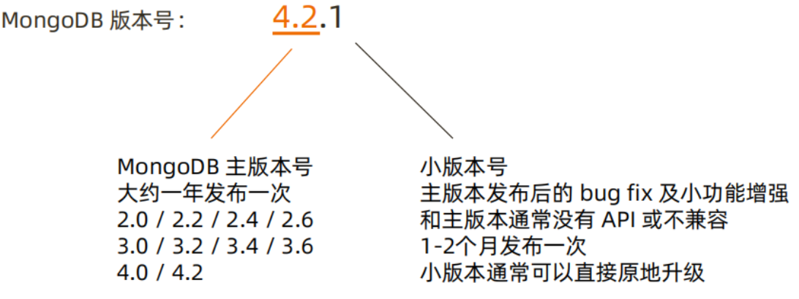
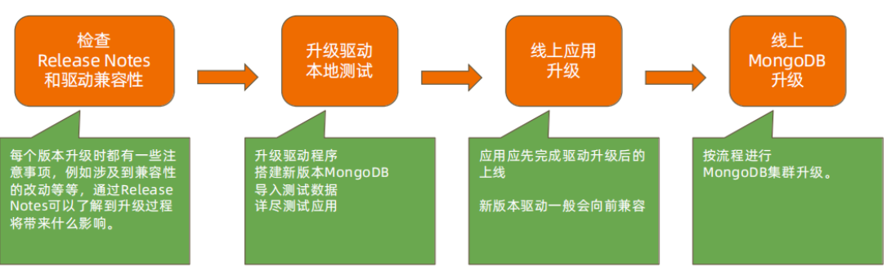
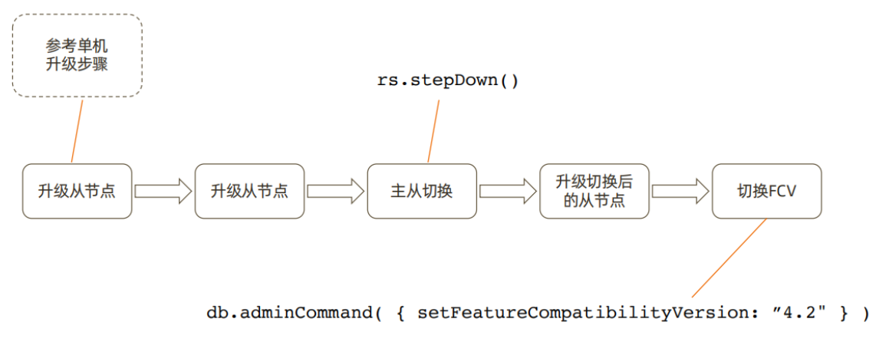
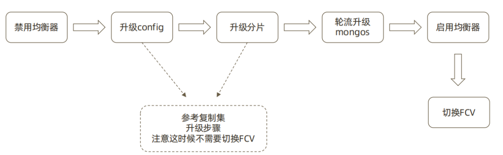

# MongoDB的生产上线及版本升级

## 一、上线前：性能测试

>模拟真实压力，对集群完成充分的性能测试，了解集群概况。
>性能测试的输出：
>• 压测过程中各项指标表现，例如 CRUD 达到多少，连接数达到多少等。
>• 根据正常指标范围配置监控阈值；
>• 根据压测结果按需调整硬件资源；

## 二、上线前：环境检查

>按照最佳实践要求对生产环境所使用的操作系统进行检查和调整。最常见的需要调整的参数包括： 
>• 禁用 NUMA，否则在某些情况下会引起突发大量swap交换；
>• 禁用 Transparent Huge Page，否则会影响数据库效率；
>• tcp_keepalive_time 调整为120秒，避免一些网络问题；
>• ulimit -n，避免打开文件句柄不足的情况；
>• 关闭 atime，提高数据文件访问效率；

## 三、上线后

>性能监控
>为防止突发状况，应对常见性能指标进行监控以及时发现问题。
>性能监控请参考前述章节的内容
>定期健康检查
>● mongod 日志；
>● 环境设置是否有变动； 
>● MongoDB 配置是否有变动；

## 四、MongoDB 版本发布规律



## 五、主版本升级流程



>参考 ： https://docs.mongodb.com/ecosystem/drivers/driver-compatibility-reference/

## 六、MongoDB 单机升级流程


>升级模拟4.0.18升级4.2.8版本

### 1、安装高版本软件至/data/app/mongodb

### 2、停低版本实例

```bash
[mongod@db01 ~]$ /opt/mongodb/bin/mongod -f /data/mongo40/conf/mongo.conf --shutdown

killing process with pid: 4860
```

### 3、启动后自动升级

```bash
[mongod@node01 ~]$ mongod -f /mongodb/conf/mongo.conf 
about to fork child process, waiting until server is ready for connections.
forked process: 6376
child process started successfully, parent exiting
```

### 4、检测版本

```bash
> db.version()
4.2.8
```

### 5、切换FCV

```bash
> db.adminCommand( { setFeatureCompatibilityVersion: "4.2" } )
{ "ok" : 1 }

> db.adminCommand( { getParameter: 1, featureCompatibilityVersion: 1 } )
{ "featureCompatibilityVersion" : { "version" : "4.2" }, "ok" : 1 }
```

## 七、MongoDB 复制集升级流程



```bash
1、升级从节点
如单机升级步骤。

2、将主节点身份切换并升级
rs.stepdown()
升级步骤如单机升级流程。

3、切换FCV
> db.adminCommand( { getParameter: 1, featureCompatibilityVersion: 1 } )

> db.adminCommand( { setFeatureCompatibilityVersion: "4.4" } )
{ "ok" : 1 }

> db.adminCommand( { getParameter: 1, featureCompatibilityVersion: 1 } )
{ "featureCompatibilityVersion" : { "version" : "4.4" }, "ok" : 1 }
```

## 八、MongoDB 分片集群升级流程



```bash
1、禁用均衡器
sh.stopBalancer()

2、升级config（从-->主）
参考复制集升级过程

3、升级分片
参考复制集升级过程

4、升级mongos(建议多个mongos)
轮流升级

5. 启动均衡器
sh.startBalancer()
```

## 九、版本升级：在线升级注意

>MongoDB支持在线升级，即升级过程中不需要间断服务；
>升级过程中虽然会发生主从节点切换，存在短时间不可用，但是： 
>• 3.6版本开始支持自动写重试可以自动恢复主从切换引起的集群暂时不可写； 
>
>• 4.2开始支持的自动读重试则提供了包括主从切换在内的读问题的自动恢复； 
>
>升级需要逐版本完成，不可以跳版本： 
>• 正确：3.2->3.4->3.6->4.0->4.2
>
>• 错误：3.2->4.2
>
>原因： 
>• MongoDB复制集仅仅允许相邻版本共存
>
>• 有一些升级内部数据格式如密码加密字段，需要在升级过程中由mongo进行转换

## 十、降级

>• 如果升级无论因何种原因失败，则需要降级到原有旧版本。在降级过程中：
>• 滚动降级过程中集群可以保持在线，仅在切换节点时会产生一定的不可写时间；
>• 降级前应先去除已经用到的新版本特性。例如：用到了 NumberDecimal 则应把所有使用NumberDecimal 的文档先去除该字段；
>• 通过设置 FCV（Feature Compatibility Version）可以在功能上降到与旧版本兼容；
>• FCV 设置完成后再滚动替换为旧版本。